# Algorithms


## 基础

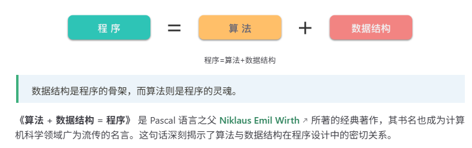

一个算法应具备以下五个基本特性：**输入**、**输出**、**有穷性**、**确定性**、**可行性**。

### 算法复杂度分析

#### 时间复杂度


##### 关于*O(log~n~)*

每次操作将问题规模缩小一半的算法，如「二分查找」和「分治算法」，时间复杂度为 ==O(logn)==


#### 空间复杂度

空间复杂度的计算主要考虑算法运行过程中额外占用的空间，包括局部变量和递归栈空间。

##### 常数空间 O(1)

```python
def algorithm(n):
    a = 1
    b = 2
    res = a * b + n
    return res
```

上述代码中，只使用了固定数量的变量，因此空间复杂度为 O(1)。

##### 线性空间 O(n)

```python
def algorithm(n):
    if n <= 0:
        return 1
    return n * algorithm(n - 1)
```

上述代码中，递归深度为 n*n*，需要 O(n) 的栈空间。


常见空间复杂度从小到大排序：O(1)*O*(1) < O(log⁡n)*O*(log*n*) < O(n)*O*(*n*) < O(n2)*O*(*n*2) < O(2n)*O*(2*n*)


#### 参考

[0.3 算法复杂度 | 算法通关手册（LeetCode）](https://algo.itcharge.cn/00_preface/00_03_algorithm_complexity/#_2-2-渐进符号)


### NP问题


#### 基本概念：

**约化：**


**多项式**


#### P问题

定义:一个可以在多项式时间复杂度内解决的问题。
例如:n个数的排序问题(不超过0(n^2^))


#### NP问题

定义:可以在多项式的时间里**验证**一个解的问题。即给出一个答案，可以很快地(在多项式时间内)验证这个答案是对的还是错的，但是**不一定能在多项式时间内求出正确的解**。

举例：

1.数独问题：


2.hamilton问题：


#### NP-hard

定义:任意NP问题可以在多项式时间内约化成该问题即为了解决NP问题A，先将问题A约化为另一个问题B，解决问题B同时也间接解决了问题A。问题B就是一个NP难问题

举例：旅行商最短路径问题

设一个推销员需要从香港出发，经过广州，北京，上海，…，等n个城市，最后返回香港。 任意两个城市之间都有飞机直达，但双向的票价不等。求总路费最少的行程安排。

分析:想要知道所有方案中花费最少的，必须检查所有可能的旅行安排才能找到，即**(n-1)!种**方案，很显然这**不是P问题（不是多项式）**。给出任意一个行程安排，你能算出它的总路费，但**无法在多项式时间内验证这条路是否是最短路**。所以不是NP问题。（下图纯绿色部分）


#### NP-Complete问题

定义:所有**既是NP问题，又是NP难问题**的问题
即一个NP问题，任意的NP问题可以约化到它:

NPC问题只能暴力求解？

举例：

旅行商问题（限制花费）

设一个推销员需 要从香港出发，经过广州，北京，上海，…，等n个城市，最后返回香港。 任意两个城市之间都有飞机直达，但双向的票价不等。现在假设公司给报销C块钱问是否存在一个行程安排，使得他能遍历所有城市，而且总的路费小于C?


### 基础算法分类

#### 枚举（Enumeration）


#### 递归（Recursion）

递归函数会==调用自身==

递归的本质与`数学归纳法`高度契合


##### 递归三步法

递归的核心思想是：==把大问题拆解为小问题，逐步解决==。写递归时，可以遵循以下三步：

1. **写递推公式**：找出原问题与子问题的关系，写出递推公式。
2. **确定终止条件**：明确递归==何时结束==，以及==结束时的返回值==。
3. **翻译为代码**：
   - 定义递归函数（明确参数和返回值含义）
   - 编写递归主体（递推公式对应的递归调用）
   - 加入终止条件的判断和处理

##### 注意事项

递归在程序执行时依赖于调用栈。每递归调用一次，系统会为该调用分配一个新的栈帧，如果递归层数过深，极易导致`Stack Overflow`。


##### 避免重复运算

递归算法常常会遇到重复计算的问题，尤其是在分治结构中多个子问题重叠时。例如，斐波那契数列的递归定义如下：


如下图所示，计算 f(5)*f*(5) 时，f(3)*f*(3) 会被多次递归计算，f(2)*f*(2)、f(1)*f*(1)、f(0)*f*(0) 也会被重复计算，导致效率极低。

为避免重复运算，可以引入缓存机制（如哈希表、数组或集合）记录已经计算过的子问题结果。这种做法称为==记忆化递归==


#### 分治（Divide and Conquer）

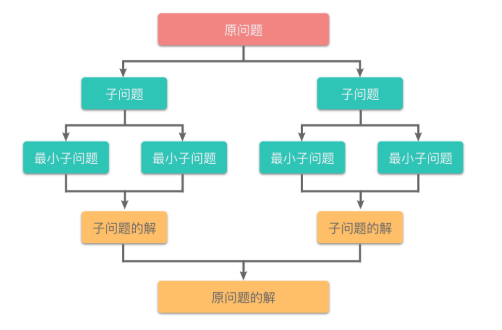

##### 分治算法与递归算法的关系

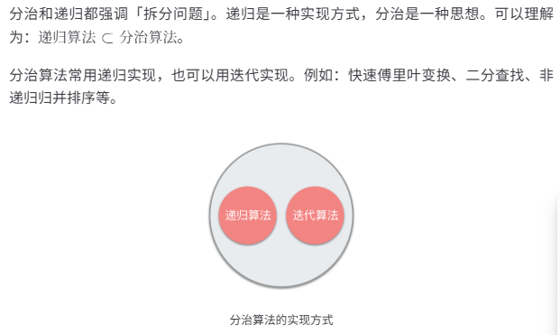

##### 使用条件

1. **可分解**：原问题能拆分为若干规模更小、结构相同的子问题。
2. **子问题独立**：各子问题互不影响，无重叠部分。
3. **有终止条件**：子问题足够小时可直接解决。
4. **可合并**：子问题的解能高效合并为原问题的解，且合并过程不能太复杂。


##### 伪代码

```python
def solve_min(problem):
    ...
    return ans_min

def divide(problem_n)
	...
    return [problem_1, problem_2, ..., problem_k]

def merge([ans_1, ans_2, ..., ans_k])
	...
    return ans

def divide_and_conquer(problem):
    """
    分治算法通用模板
    :param problem_n: 问题规模
    :return: 原问题的解
    """
    # 1. 递归终止条件：当问题规模足够小时，直接解决
    if problem < d:  # d 为可直接求解的最小规模
        return solve_min(problem)  # 直接求解

    # 2. 分解：将原问题分解为 k 个子问题
    problems_k = divide(problem)  # divide 函数返回 k 个子问题的列表

    # 3. 递归求解每个子问题
    ans_k = []
    for sub_problem in problems_k:
        sub_ans = divide_and_conquer(sub_problem)  # 递归求解子问题
        ans_k.append(sub_ans)  # 收集每个子问题的解

    # 4. 合并：将 k 个子问题的解合并为原问题的解
    ans = merge(ans_k)
    return ans  # 返回原问题的解
```


##### 时间复杂度分析

分治算法的核心在于：将大问题递归拆分为更小的子问题，直到子问题足够简单（通常可直接用常数时间解决），然后合并子问题的解。

实际的`时间复杂度`主要由`「分解」`和`「合并」`两个过程决定。

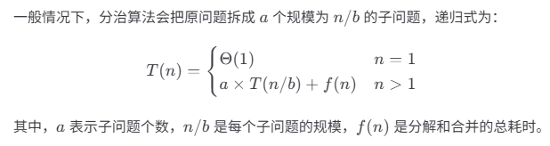

求解分治算法复杂度，常用两种方法：`递推法`和`递归树法`

###### 递推法

以[归并排序](# 归并排序（Merge Sort）)为例，其递归式为


###### 递归树法

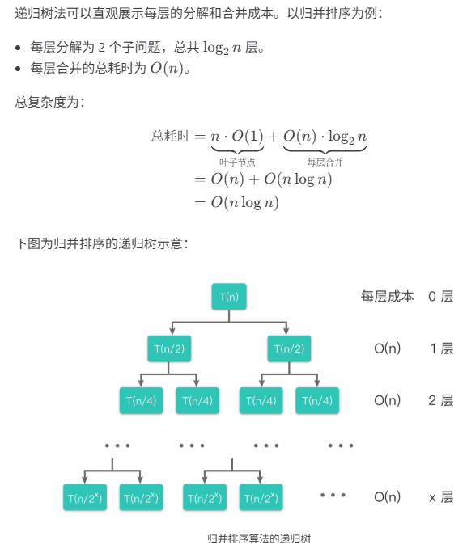


#### 回溯（Backtracking）

系统地搜索所有可能解的算法

走不通就退回，换条路再试

```python
def backtrack(参数):
    if 终止条件:
        处理结果
        return
    for 选择 in 可选列表:
        if 满足约束:
            做选择
            backtrack(新参数)
            撤销选择
```


##### 相关题目

- n皇后问题：[7.4 回溯算法 | 算法通关手册（LeetCode）](https://algo.itcharge.cn/07_algorithm/07_04_backtracking_algorithm/#_5-2-n-皇后)


#### 贪心（Greedy）

核心思想是：将问题分解为若干步骤，每一步都根据当前情况，==按照某种标准选择最优解==（即「贪心」选择），==不回头==、不考虑整体，==只关注当前局部最优==。这样可以==避免穷举所有可能==，大大简化求解过程。


##### 相关问题

- [发放饼干](https://leetcode.cn/problems/assign-cookies/)

- [无重叠区间](https://algo.itcharge.cn/07_algorithm/07_05_greedy_algorithm/#_3-1-经典例题-分发饼干)

  !!! note
      
      这个问题是一些文章GPU实现并行计算的一个基础


### 常见数据结构

#### 堆栈/队列


#### 链表

!!! note
    std::list 是标准库提供的双向链表（doubly-linked list）容器实现

```c++
struct Node {
    int data;
    Node* next;
    Node(int x) : data(x), next(nullptr) {}
};
```

特点：插入和删除比较高效，遍历（查询）比较低效


##### 跳表


##### 并查集

一种树型的数据结构，用于处理一些不交集（Disjoint Sets）的==合并及查询问题==。

会有三个函数：

- **合并 `union(x, y)`**：将集合 x*x* 和集合 y*y* 合并成一个集合。
- **查找 `find(x)`**：查找元素 x*x* 属于哪个集合。
- **查找 `is_connected(x, y)`**：查询元素 x*x* 和 y*y* 是否在同一个集合中。


###### 基本方法

使用「一个森林（若干棵树）」来存储所有集合。每一棵树代表一个集合，树上的每个节点都是一个元素，树根节点为这个集合的代表元素。使用一个数组 ***fa*** 来记录这个森林


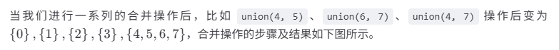

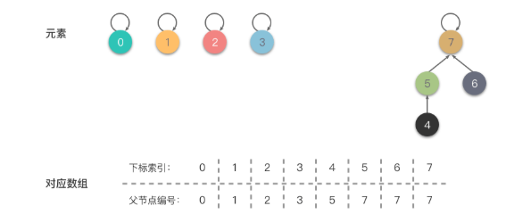

```python
class UnionFind:
    def __init__(self, n):                          # 初始化：将每个元素的集合编号初始化为数组 fa 的下标索引
        self.fa = [i for i in range(n)]

    def find(self, x):                              # 查找元素根节点的集合编号内部实现方法
        while self.fa[x] != x:                      # 递归查找元素的父节点，直到根节点
            x = self.fa[x]
        return x                                    # 返回元素根节点的集合编号

    def union(self, x, y):                          # 合并操作：令其中一个集合的树根节点指向另一个集合的树根节点
        root_x = self.find(x)
        root_y = self.find(y)
        if root_x == root_y:                        # x 和 y 的根节点集合编号相同，说明 x 和 y 已经同属于一个集合
            return False
        self.fa[root_x] = root_y                    # x 的根节点连接到 y 的根节点上，成为 y 的根节点的子节点
        return True

    def is_connected(self, x, y):                   # 查询操作：判断 x 和 y 是否同属于一个集合
        return self.find(x) == self.find(y)
```

!!! note
    ⚠️这样写有问题，需要做路径压缩
    
    

###### 路径压缩

###### 隔代压缩

!!! note
    **隔代压缩**：在==查询时==，两步一压缩，一直循环执行「把当前节点指向它的父亲节点的父亲节点」这样的操作，从而减小树的深度。


```python
def find(self, x):                              # 查找元素根节点的集合编号内部实现方法
    while self.fa[x] != x:                      # 递归查找元素的父节点，直到根节点
        self.fa[x] = self.fa[self.fa[x]]        # 隔代压缩
        x = self.fa[x]
    return x                                    # 返回元素根节点的集合编号
```

###### 完全压缩

!!! note
    **完全压缩**：在==查询时==，把被查询的节点到根节点的路径上的所有节点的父节点设置为根节点，从而减小树的深度。也就是说，在向上查询的同时，把在路径上的每个节点都直接连接到根上，以后查询时就能直接查询到根节点。

相比较于「隔代压缩」，「完全压缩」压缩的更加彻底。下面是一个「完全压缩」的例子。


```python
def find(self, x):                              # 查找元素根节点的集合编号内部实现方法
    if self.fa[x] != x:                         # 递归查找元素的父节点，直到根节点
        self.fa[x] = self.find(self.fa[x])      # 完全压缩优化
    return self.fa[x]
```


###### 按秩合并

因为路径压缩==只在查询时进行，并且只压缩一棵树上的路径==，所以并查集最终的结构仍然可能是比较复杂的。为了避免这种情况，另一个优化方式是「按秩==合并==」。

!!! note
    这是在优化合并，其实还是在优化/压缩路径

###### 按深度合并

初始化时，将所有元素的 rank*r**ank* 值设为 11。在合并操作时，比较两个根节点，把 rank*r**ank* 值较小的根节点指向 rank*r**ank* 值较大的根节点上合并。

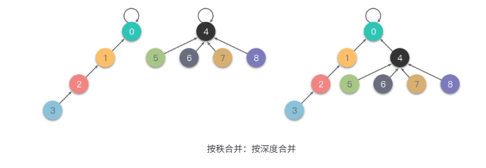

```python
class UnionFind:
    def __init__(self, n):                          # 初始化
        self.fa = [i for i in range(n)]             # 每个元素的集合编号初始化为数组 fa 的下标索引
        self.rank = [1 for i in range(n)]           # 每个元素的深度初始化为 1
    
    def find(self, x):                              # 查找元素根节点的集合编号内部实现方法
        while self.fa[x] != x:                      # 递归查找元素的父节点，直到根节点
            self.fa[x] = self.fa[self.fa[x]]        # 隔代压缩
            x = self.fa[x]
        return x                                    # 返回元素根节点的集合编号

    def union(self, x, y):                          # 合并操作：令其中一个集合的树根节点指向另一个集合的树根节点
        root_x = self.find(x)
        root_y = self.find(y)
        if root_x == root_y:                        # x 和 y 的根节点集合编号相同，说明 x 和 y 已经同属于一个集合
            return False
        
        if self.rank[root_x] < self.rank[root_y]:   # x 的根节点对应的树的深度 小于 y 的根节点对应的树的深度
            self.fa[root_x] = root_y                # x 的根节点连接到 y 的根节点上，成为 y 的根节点的子节点
        elif self.rank[root_y] > self.rank[root_y]: # x 的根节点对应的树的深度 大于 y 的根节点对应的树的深度
            self.fa[root_y] = root_x                # y 的根节点连接到 x 的根节点上，成为 x 的根节点的子节点
        else:                                       # x 的根节点对应的树的深度 等于 y 的根节点对应的树的深度
            self.fa[root_x] = root_y                # 向任意一方合并即可
            self.rank[root_y] += 1                  # 因为层数相同，被合并的树必然层数会 +1
        return True

    def is_connected(self, x, y):                   # 查询操作：判断 x 和 y 是否同属于一个集合
        return self.find(x) == self.find(y)
```


###### 按大小合并

初始化时，将所有元素的 size*s**i**ze* 值设为 11。在合并操作时，比较两个根节点，把 size*s**i**ze* 值较小的根节点指向 size*s**i**ze* 值较大的根节点上合并。


```python
class UnionFind:
    def __init__(self, n):                          # 初始化
        self.fa = [i for i in range(n)]             # 每个元素的集合编号初始化为数组 fa 的下标索引
        self.size = [1 for i in range(n)]           # 每个元素的集合个数初始化为 1
    
    def find(self, x):                              # 查找元素根节点的集合编号内部实现方法
        while self.fa[x] != x:                      # 递归查找元素的父节点，直到根节点
            self.fa[x] = self.fa[self.fa[x]]        # 隔代压缩优化
            x = self.fa[x]
        return x                                    # 返回元素根节点的集合编号

    def union(self, x, y):                          # 合并操作：令其中一个集合的树根节点指向另一个集合的树根节点
        root_x = self.find(x)
        root_y = self.find(y)
        if root_x == root_y:                        # x 和 y 的根节点集合编号相同，说明 x 和 y 已经同属于一个集合
            return False
        
        if self.size[root_x] < self.size[root_y]:   # x 对应的集合元素个数 小于 y 对应的集合元素个数
            self.fa[root_x] = root_y                # x 的根节点连接到 y 的根节点上，成为 y 的根节点的子节点
            self.size[root_y] += self.size[root_x]  # y 的根节点对应的集合元素个数 累加上 x 的根节点对应的集合元素个数
        elif self.size[root_x] > self.size[root_y]: # x 对应的集合元素个数 大于 y 对应的集合元素个数
            self.fa[root_y] = root_x                # y 的根节点连接到 x 的根节点上，成为 x 的根节点的子节点
            self.size[root_x] += self.size[root_y]  # x 的根节点对应的集合元素个数 累加上 y 的根节点对应的集合元素个数
        else:                                       # x 对应的集合元素个数 小于 y 对应的集合元素个数
            self.fa[root_x] = root_y                # 向任意一方合并即可
            self.size[root_y] += self.size[root_x]
            
        return True

    def is_connected(self, x, y):                   # 查询操作：判断 x 和 y 是否同属于一个集合
        return self.find(x) == self.find(y)
```

###### 复杂度分析

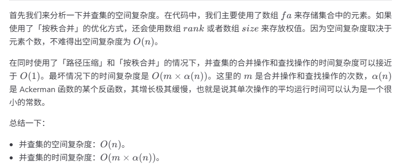


###### 参考

- [5.8 并查集 | 算法通关手册（LeetCode）](https://algo.itcharge.cn/05_tree/05_08_union_find/#_1-1-并查集的定义)


##### 链表排序


基于数组的排序算法[在这](./Algorithms.md/)

##### 参考

[2.1 链表基础 | 算法通关手册（LeetCode）](https://algo.itcharge.cn/02_linked_list/02_01_linked_list_basic/#_2-5-插入节点)


#### 树

##### 二叉搜索树

也称为` 二叉查找树` 、`二叉搜索树` 、`有序二叉树`或`排序二叉树`。

特点：

- 若它的左子树不为空，左子树上所有节点的值都小于它的根节点；若它的右子树不为空，右子树上所有的节点的值都大于它的根节点。
- 二分搜索树对有序数列有着==高效的插入、删除、查询操作==


###### 查找

```java
...
// 查看以node为根的二分搜索树中是否包含键值为key的节点, 使用递归算法
private boolean contain(Node node, Key key){

    if( node == null )
        return false;

    if( key.compareTo(node.key) == 0 )
        return true;
    else if( key.compareTo(node.key) < 0 )
        return contain( node.left , key );
    else // key > node->key
        return contain( node.right , key );
}
...
    
```


###### 插入

```java
public class BST<Key extends Comparable<Key>, Value> {

    // 树中的节点为私有的类, 外界不需要了解二分搜索树节点的具体实现
    private class Node {
        private Key key;
        private Value value;
        private Node left, right;

        public Node(Key key, Value value) {
            this.key = key;
            this.value = value;
            left = right = null;
        }
    }
    // 根节点
    private Node root;
    // 树种的节点个数
    private int count;
    // 构造函数, 默认构造一棵空二分搜索树
    public BST() {
        root = null;
        count = 0;
    }
    // 返回二分搜索树的节点个数
    public int size() {
        return count;
    }
    // 返回二分搜索树是否为空
    public boolean isEmpty() {
        return count == 0;
    }
}
```


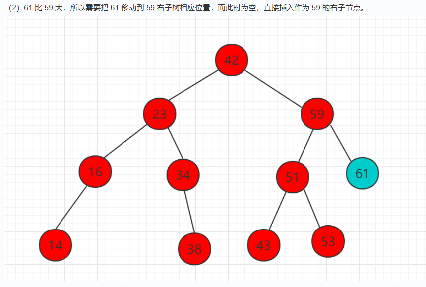


##### 平衡树

也叫`AVL`树

用于==解决二叉排序树高度不确定的问题==：如果二叉排序树的子树间的高度相差太大，就会让二叉排序树操作的时间复杂度升级为$\mathcal{O}(n)$，而不是$\mathcal{O}(h)$, whiere $h$ is height of tree


**性质**：

- 左子树和右子树的高度之差的**绝对值小于等于1**
- **左子树和右子树也是平衡二叉树**


**平衡因子（BF）：**

平衡因子=结点左子树的高度-结点右子树的高度。

因此平衡二叉树所有结点的平衡因子只能是-1、0、1，如下图，是一个平衡二叉树


**失衡**

当我们在一个平衡二叉树上插入一个结点时，有可能会**导致失衡**，即出现平衡因子绝对值大于1。如下图：

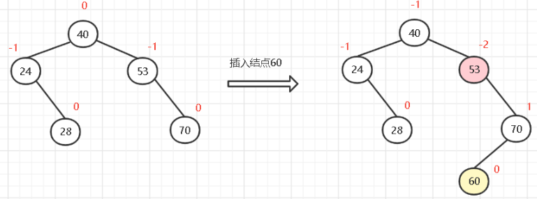

**恢复平衡**

插入：4种情况

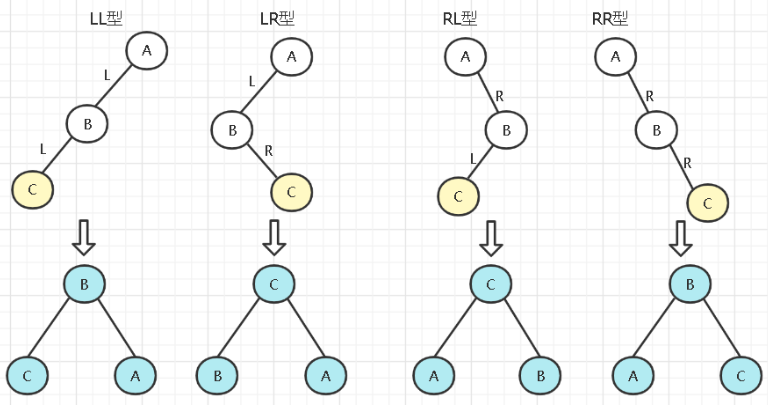

删除：6种情况

[数据结构之——平衡二叉树（内容详解）-CSDN博客](https://blog.csdn.net/m0_37914588/article/details/103754959)


###### 参考：

[平衡二叉树-菜鸟笔记](https://www.coonote.com/algorithm-note/balanced-binary-tree-detail.html)

[数据结构之——平衡二叉树（内容详解）-CSDN博客](https://blog.csdn.net/m0_37914588/article/details/103754959)


##### 红黑树

红黑树是为解决 `AVL 树`在动态操作中的效率瓶颈，通过放宽平衡条件、引入颜色标记机制而设计的产物

和`AVL树`一样，也是为了树的`平衡`，但是方法不一样

###### 定义

一棵红黑树是满足如下红黑性质的二叉排序树：
**（1）每个节点要么是黑色，要么是红色**
**（2）根节点是黑色**
**（3）叶节点是黑色（规定只有NULL才能成为叶节点）**
**（4）红色节点的两个子节点都是黑色**
**（5）任意一个节点到叶子节点的路径都包含数量相同的黑色节点**


推论：

- `最短路径`肯定都是全黑的
- `最长路径`加入红色节点只能出现一黑一红这样掺杂
- 最极限情况下，`最长路径`掺杂的红色节点数量一定是黑色节点数量-1

###### 查找

因为红黑树是二叉平衡树，所以查找过程和普通的二叉平衡树==一样==。

###### 插入

红黑树插入数据分为三步：查找、插入、修正
（1）查找：依照查找步骤找到要插入的位置
（2）插入：在找到的位置处插入一个`红色节点`
（3）修正：利用`变色、旋转`等方法对红黑树进行调整，使其依然满足`定义`

红黑树的修正调整分为两种：`变色`、`旋转`。

[红黑树详解-CSDN博客](https://blog.csdn.net/fenger3790/article/details/105401369/)

插入情况：5类

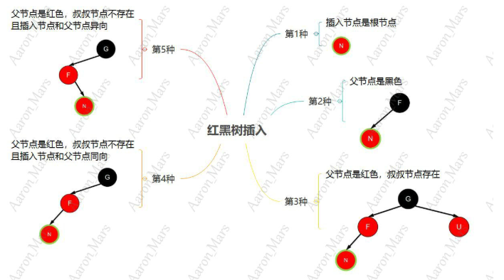

!!! note
    N（New）表示新插入的节点，F（Father）表示插入位置的父节点，U（Uncle）表示插入节点的叔叔节点，也就是父节点的对称节点，G（Grandfather）表示插入节点的祖父节点，也就是父节点的父节点）

**情况1:**

红黑树是一棵空树，插入的节点是根节点。
因为我们规定根节点必须是黑色，所以只需要把节点变色即可。


**情况2:**
插入节点的父节点是黑色。
因为插入节点是红色，不影响线路上具体的黑色节点数，所以可以直接插入，无需任何更改。

举个例子：
比如在节点15的左子树处插入一个新节点14，因为15是黑色节点，所以可以直接插入。
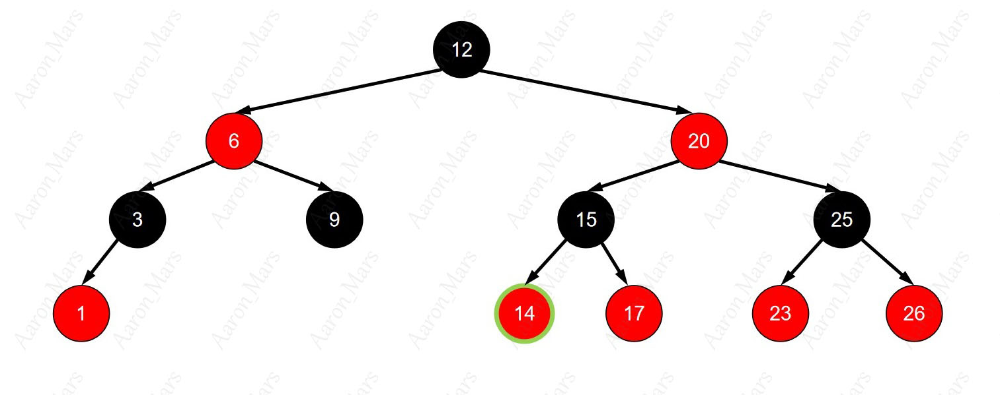

**情况3:**
插入节点的父节点是红色，且叔叔节点存在。

首先，如果如果父节点是红色，那叔叔节点也一定是红色。因为如果叔叔节点是黑色，那说明通过叔叔节点的路径比通过父节点的路径多了一个黑色节点，这样就不满足定理第5条了。
而由红黑树定理第4条可知红色节点的子节点只能是黑色，所以祖父节点一定是黑色，而我们新添加的节点也是红色，和父节点冲突了，所以需要进行调整。
调整的策略如下：


这里注意的是，我们调整的策略很简单，把父节点和叔叔节点变成黑色，把祖父节点变成红色，这样能够保证通过父节点和叔叔节点的路径和原来一样，只包含一个黑色节点。
但是把祖父节点变成红色，可能会和上面的节点继续冲撞，所以我们要以祖父节点为中心==，继续向上调整，直到不再冲突为止==。

下面的动图展示了实际例子：


**情况4:**
插入节点的父节点是红色，叔叔节点不存在，且插入节点和父节点==同向==。

!!! note
    什么叫同向？
    父节点在祖父节点的左子树，新节点在父节点的左子树；或者
    父节点在祖父节点的右子树，新节点在父节点的右子树。


调整策略如下：
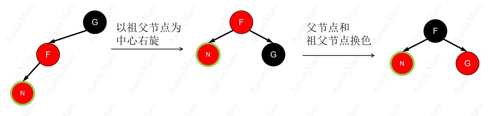


下面的动图展示了实际例子：
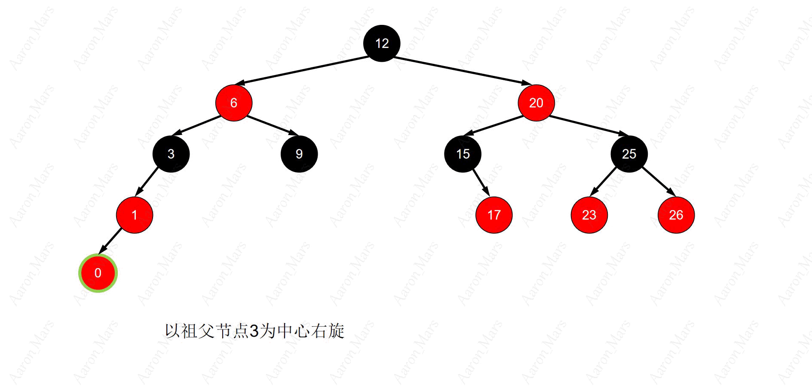

**情况5:**
插入节点的父节点是红色，叔叔节点不存在，且插入节点和父节点==异向==。调整策略如下：

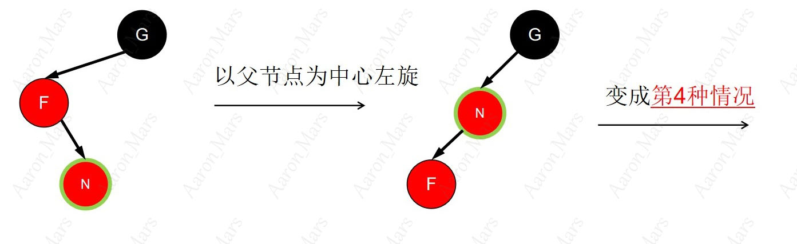

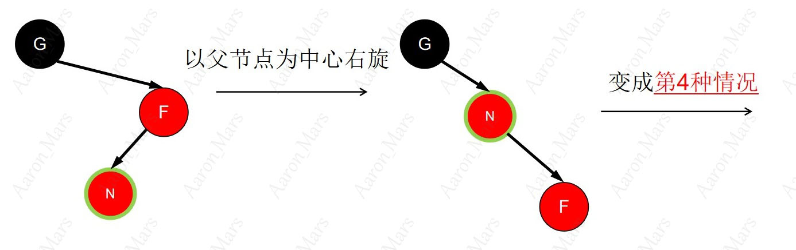


情况5只需要旋转一次就会变成和情况4相同的情况，这时利用情况4的调整策略即可。

下面的动图展示了实际例子：


###### 参考

[数据结构（十三）：红黑树-CSDN博客](https://blog.csdn.net/weixin_72359141/article/details/148715964)


###### 删除

删除情况：5大类10小类

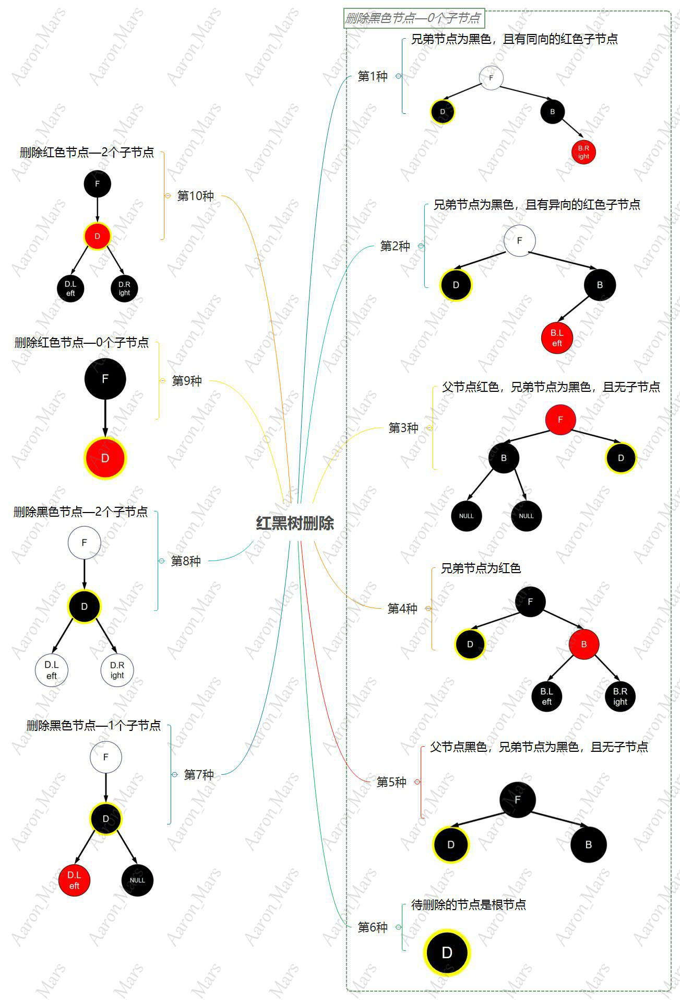

[红黑树详解-CSDN博客](https://blog.csdn.net/fenger3790/article/details/105401369/)

##### B Tree

B树是一棵`M`路平衡搜索树，进一步压缩了高度`h`，多用于==文件系统、数据库==的实现

###### 背景

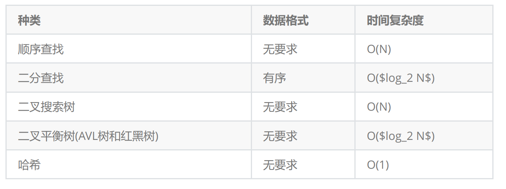

以上结构适合用于数据量相对不是很大，能够一次性存放在内存中，进行数据查找的场景。如果数据量很大，比如有==100G数据==，无法一次放进内存中，那就只能放在磁盘上了，如果放在磁盘上，有需要`查找`某些数据，那么如果处理呢？那么我们可以考虑将==存放关键字及其映射的数据的地址放到一个内存中的搜索树的节点中==，那么要访问数据时，先取这个地址去磁盘访问数据。


使用平衡二叉树搜索树的缺陷：平衡二叉树搜索树的高度是==logN，这个查找次数在内存中是很快的。但是当数据都在磁盘中时，访问磁盘速度很慢，在数据量很大时，logN次的磁盘访问，是一个难以接受的结果。==

使用`哈希表`的缺陷：哈希表的效率很高是O(1)，但是一些极端场景下某个位置`冲突`很多，导致访问次数剧增，也是难以接受的

###### 性质

对于B树，m阶B树 中的 m阶 的值是整个 B树 中取节点的最大的度。

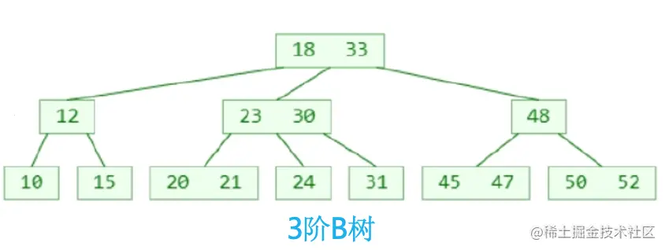

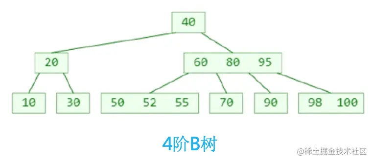

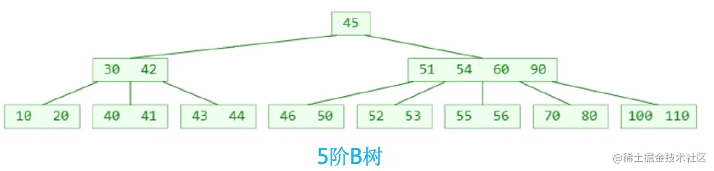

观察上面几个B树，可以发现一些共同的特点：

- 1 个节点可以存储超过 2 个元素、可以拥有超过 2 个子节点；
- 拥有二叉搜索树的一些性质；
- 平衡：每个节点的所有子树高度一致；
- 比较矮。


###### 查找/添加/删除：

###### [B树- 掘金](https://juejin.cn/post/6956589890062516237)


###### 参考

[高阶数据结构——B树-CSDN博客](https://blog.csdn.net/weixin_74310945/article/details/140961914)

[B树 - 掘金](https://juejin.cn/post/6956589890062516237)


##### O Tree


#### 堆

- `优先队列`的使用场景，堆这种数据结构也可以提高入队和出队的效率
- 堆的根节点最大称为`最大堆`

##### 二叉堆

二叉堆是一颗`完全二叉树`，且堆中某个节点的值总是不大于其父节点的值，该完全二叉树的深度为 k，除第 k 层外，其它各层 (1～k-1) 的结点数都达到最大个数，第k 层所有的结点都连续集中在==最左边。==

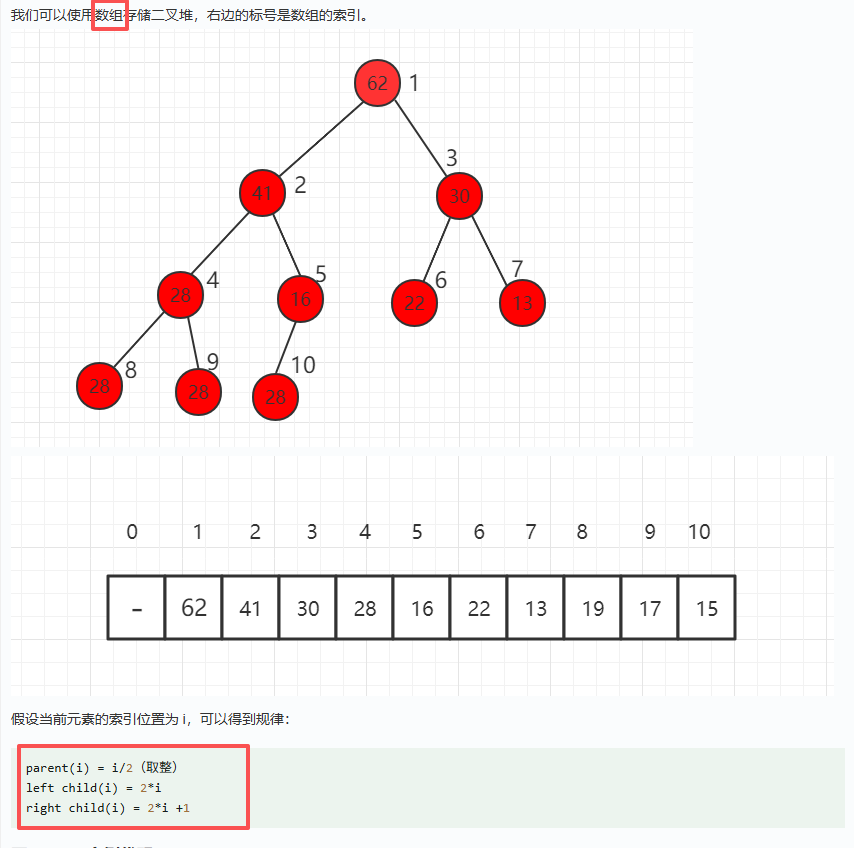

##### 堆的 shift up

向一个最大堆中==添加元素==，称为 **shift up**。

[堆的 shift up | 菜鸟教程](https://www.runoob.com/data-structures/heap-shift-up.html)

##### 堆的 shift down

从一个最大堆中取出最大优先级元素，称为 shift down

!!! note
    ⚠️只能取出最大优先级的元素，所以往往用在优先队列上

[堆的 shift down | 菜鸟教程](https://www.runoob.com/data-structures/heap-shift-down.html)


##### 索引堆及其优化

如果堆中存储的==元素较大==，那么进行交换就要消耗大量的时间，这个时候可以用索引堆的数据结构进行替代，堆中存储的是数组的索引，我们相应操作的是索引。

[索引堆及其优化 | 菜鸟教程](https://www.runoob.com/data-structures/heap-index.html)


#### 哈希表

也叫`散列表`

##### 标准库

| 容器                                            | 头文件          | 是否映射 key→value | 是否允许重复 key      | 主要用途/说明                                |
| ----------------------------------------------- | --------------- | ------------------ | --------------------- | -------------------------------------------- |
| std::unordered_map<Key,T,Hash,KeyEq,Alloc>      | <unordered_map> | 是（映射）         | 否（唯一 key）        | 常用的哈希映射，key→value 查找/插入平均 O(1) |
| std::unordered_multimap<Key,T,Hash,KeyEq,Alloc> | <unordered_map> | 是（映射）         | 是（允许重复 key）    | 需要相同 key 对应多个 value 时使用           |
| std::unordered_set<Key,Hash,KeyEq,Alloc>        | <unordered_set> | 否（只有 key）     | N/A（集合，单一 key） | 集合去重 / membership 测试                   |
| std::unordered_multiset<Key,Hash,KeyEq,Alloc>   | <unordered_set> | 否（只有 key）     | 是（允许重复）        | 需要计数或保留重复 key 的集合                |


##### 开源库

- [Tessil/robin-map: C++ implementation of a fast hash map and hash set using robin hood hashing](https://github.com/Tessil/robin-map)
- 还有一些针对并行的哈希表[greg7mdp/parallel-hashmap: A family of header-only, very fast and memory-friendly hashmap and btree containers.](https://github.com/greg7mdp/parallel-hashmap)


##### 基本内容


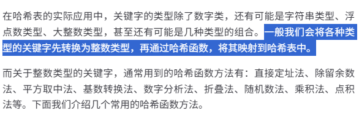

##### 哈希冲突


###### 具体方法查看[link](https://algo.itcharge.cn/03_stack_queue_hash_table/03_06_hash_table/#_3-2-链地址法)


#### 图

##### 邻接矩阵

##### 邻接表

##### 十字链表


### 参考

- [0.2 数据结构与算法 | 算法通关手册（LeetCode）](https://algo.itcharge.cn/00_preface/00_02_data_structures_algorithms/#_2-1-算法的基本特性)


## 排序

### 分类

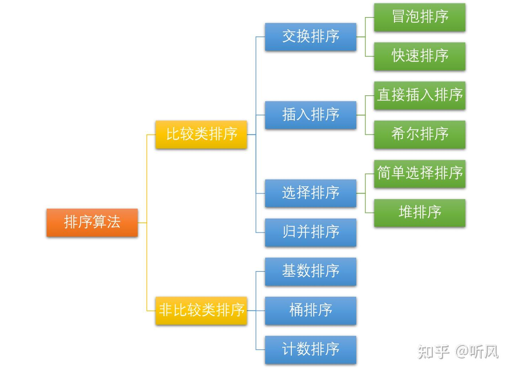

| 排序算法 | 时间复杂度（平均） | 时间复杂度（最差） | 时间复杂度（最好） | 空间复杂度 | 排序方式   | 稳定性 |
| -------- | ------------------ | ------------------ | ------------------ | ---------- | ---------- | ------ |
| 冒泡排序 | O(n²)              | O(n²)              | O(n)               | O(1)       | 原地排序   | 稳定   |
| 选择排序 | O(n²)              | O(n²)              | O(n²)              | O(1)       | 原地排序   | 不稳定 |
| 插入排序 | O(n²)              | O(n²)              | O(n)               | O(1)       | 原地排序   | 稳定   |
| 希尔排序 | O(n log n)         | O(n²)              | O(n log n)         | O(1)       | 原地排序   | 不稳定 |
| 归并排序 | O(n log n)         | O(n log n)         | O(n log n)         | O(n)       | 非原地排序 | 稳定   |
| 快速排序 | O(n log n)         | O(n²)              | O(n log n)         | O(log n)   | 原地排序   | 不稳定 |
| 堆排序   | O(n log n)         | O(n log n)         | O(n log n)         | O(1)       | 原地排序   | 不稳定 |
| 计数排序 | O(n + k)           | O(n + k)           | O(n + k)           | O(k)       | 非原地排序 | 稳定   |
| 基数排序 | O(nk)              | O(nk)              | O(nk)              | O(n + k)   | 非原地排序 | 稳定   |
| 桶排序   | O(n + k)           | O(n²)              | O(n + k)           | O(n + k)   | 非原地排序 | 稳定   |

#### 比较类排序

比较类排序是通过比较来决定元素间的相对次序，由于其时间复杂度不能突破 `O(nlogn)`，因此也称为非线性时间比较类排序。

比较类排序的优势是，适用于各种规模的数据，也不在乎数据的分布，都能进行排序。可以说，**比较排序适用于一切需要排序的情况**。

#### 非比较类排序

非比较排序不通过比较来决定元素间的相对次序，而是通过确定每个元素之前，应该有多少个元素来排序。由于它可以突破基于比较排序的时间下界，以线性时间运行，因此称为`线性时间非比较类排序`。

非比较排序时间复杂度底，但由于非比较排序需要占用空间来确定唯一位置。所以**对数据规模和数据分布有一定的要求**


### 冒泡排序（Bubble Sort）

冒泡排序模拟了“气泡上浮”的过程，通过不断地比较相邻两个元素并将较大的值向右交换，使得每一轮遍历都能将当前未排序部分的最大值移动到末尾。整个排序过程分为多轮，每轮都会让一个最大值归位，最终整个数组变为有序。它的核心思想是重复比较相邻元素，发现逆序则交换，通过多轮将最大值逐步移动到右侧。==当某一轮遍历中未发生任何交换时，说明数组已经有序，可以提前结束排序==


| 维度         | 分析                                 |
| ------------ | ------------------------------------ |
| 时间复杂度   | 最好：O(n)；最坏：O(n²)；平均：O(n²) |
| 空间复杂度   | O(1)，原地排序                       |
| 稳定性       | 稳定（相同元素相对位置不变）         |
| 是否原地排序 | 是                                   |


### 选择排序（Selection Sort）

选择排序的核心思想是：每一轮从待排序部分中选择最小（或最大）的元素，将其放到已排序序列的末尾（或开头）。通过不断地选择和交换，最终整个数组变为有序。它不依赖相邻比较，而是全局扫描未排序区域寻找最值，然后和当前起始位置交换。由于每次都明确选出最小值，其交换次数固定为 `n-1` 次。


| 维度         | 分析                                     |
| ------------ | ---------------------------------------- |
| 时间复杂度   | 最好：O(n²)；最坏：O(n²)；平均：O(n²)    |
| 空间复杂度   | O(1)，原地排序                           |
| 稳定性       | ❌ 不稳定（可能交换掉相同元素的原始顺序） |
| 是否原地排序 | 是                                       |

### 插入排序（Insertion Sort）

插入排序的基本思想是：构建有序序列，对于未排序数据，从后向前扫描已排序序列，找到相应位置并插入。它==模拟的是打扑克牌时理牌的过程==，每次将新牌插入到合适的位置。插入排序通过构建一个逐步扩大的有序区，不断将新的元素插入其中，最终使整个数组有序。插入过程依赖于比较和移动。


| 维度         | 分析                                           |
| ------------ | ---------------------------------------------- |
| 时间复杂度   | 最好：O(n)（已排序）；最坏：O(n²)；平均：O(n²) |
| 空间复杂度   | O(1)，原地排序                                 |
| 稳定性       | 稳定                                           |
| 是否原地排序 | 是                                             |


### 希尔排序（Shell Sort）

希尔排序是==插入排序的改进版==，采用分组插入的思想。它首先将整个待排序元素==分为若干个小组==（由步长 `gap `决定），在每组中进行插入排序，然后逐渐缩小 gap，最终 gap=1 时对整体做一次插入排序。这样可以在初期就让元素快速移动到接近最终位置，从而加快整体排序速度。原理上它是通过“预排序 + 缩小增量”的策略减少整体比较次数，是==不稳定==的排序算法。

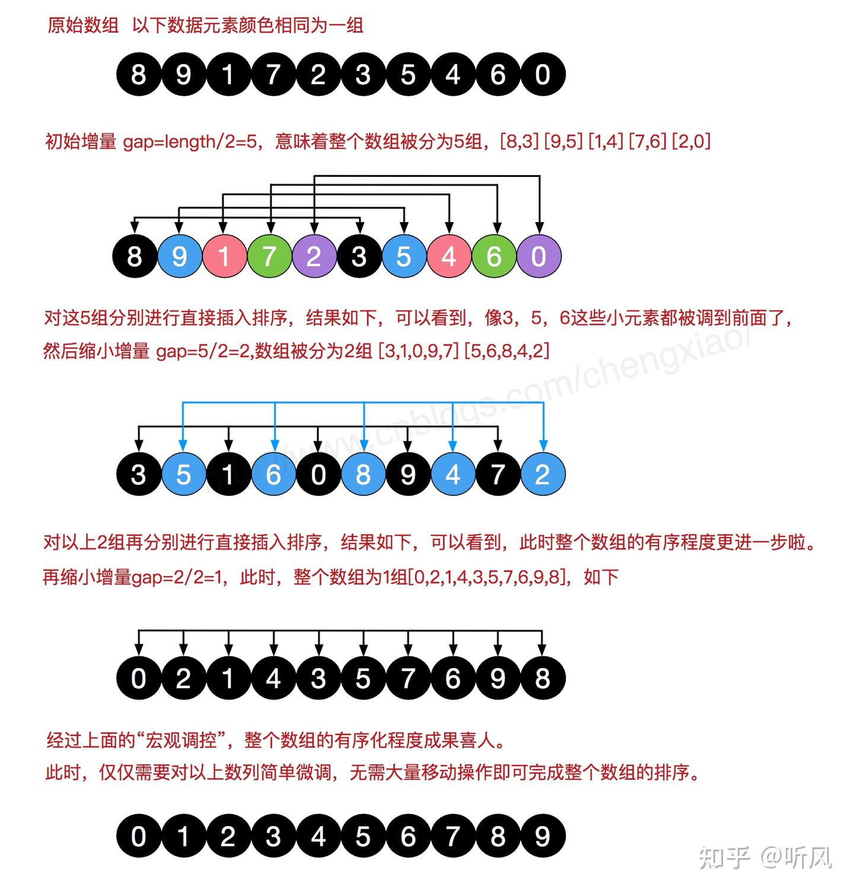

| 维度         | 分析                                                |
| ------------ | --------------------------------------------------- |
| 时间复杂度   | 最好：O(n log n)；最坏：O(n²)；==平均：O(n log n)== |
| 空间复杂度   | O(1)，原地排序                                      |
| 稳定性       | ❌ 不稳定                                            |
| 是否原地排序 | 是                                                  |


### 归并排序（Merge Sort）

归并排序是一种典型的==分治算法==。它将一个大问题分解成小问题，逐步解决，然后合并结果。归并排序的思想是将数组分成两半，对每一半递归地进行归并排序，最终合并两个有序的子数组。归并排序时间复杂度稳定在 `O(n log n)`，==适用于大数据量排序==。


| 维度         | 分析                                                     |
| ------------ | -------------------------------------------------------- |
| 时间复杂度   | ==最好：O(n log n)；最坏：O(n log n)；平均：O(n log n)== |
| 空间复杂度   | O(n)，==需要额外的空间存储子数组==                       |
| 稳定性       | 稳定                                                     |
| 是否原地排序 | ❌ 不是                                                   |


### 快速排序（Quick Sort）

!!! note
    取数组中第 n 大的元素并不需要对整个数组进行排序，使用快速排序的思路求数组中第 n 大元素算法复杂度为 **O(n)**。

快速排序==同样采用分治法==，它通过选择一个“基准”元素，将数组分成两部分，左边部分小于基准元素，右边部分大于基准元素。然后递归地对左右两部分进行排序，最后合并。

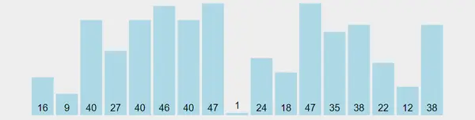

| 维度         | 分析                                            |
| ------------ | ----------------------------------------------- |
| 时间复杂度   | 最好：O(n log n)；最坏：O(n²)；平均：O(n log n) |
| 空间复杂度   | ==O(log n)==，递归栈空间                        |
| 稳定性       | ❌ 不稳定（元素交换可能打乱相同元素的相对顺序）  |
| 是否原地排序 | ✅ 是                                            |


#### 双路快速排序

双路快速排序算法是==随机化快速排序的改进版本==，partition 过程使用两个索引值（i、j）用来遍历数组，将 **<v** 的元素放在索引i所指向位置的左边，而将 **>v** 的元素放在索引j所指向位置的右边，**v** 代表标定值。

时间和空间复杂度同随机化快速排序。 对于有大量重复元素的数组，如果使用上一节随机化快速排序效率是非常低的，导致 partition 后大于基点或者小于基点数据的子数组长度会极度不平衡，甚至会退化成 **O(n\*2)** 时间复杂度的算法，对这种情况可以使用双路快速排序算法。


#### 三路排序算法

三路快速排序是双路快速排序的进一步改进版本，三路排序算法把排序的数据分为三部分，分别为小于 v，等于 v，大于 v，v 为标定值，这样三部分的数据中，等于 v 的数据在下次递归中不再需要排序，小于 v 和大于 v 的数据也不会出现某一个特别多的情况），通过此方式三路快速排序算法的性能更优。

时间和空间复杂度同随机化快速排序。

三路快速排序算法是使用三路划分策略对数组进行划分，对处理大量重复元素的数组非常有效提高快速排序的过程。它添加处理等于划分元素值的逻辑，将所有等于划分元素的值集中在一起。


### 堆排序（Heap Sort）

堆排序是一种选择排序，它利用==堆这种数据结构==的特性来进行排序。堆是一种`完全二叉树`，满足堆的性质：==每个节点的值都大于或小于其子节点的值==。

堆排序的基本思想是：将待排序序列构造成一个`大顶堆`（当然小堆顶也行），此时，整个序列的最大值就是堆顶的根节点。将其与末尾元素进行交换，此时末尾就为最大值。然后将剩余n-1个元素重新构造成一个堆，这样会得到n个元素的次小值。如此反复执行，便能得到一个有序序列了


**大顶堆：arr[i] >= arr[2i+1] && arr[i] >= arr[2i+2]**  

**小顶堆：arr[i] <= arr[2i+1] && arr[i] <= arr[2i+2]**  


| 维度         | 分析                                                 |
| ------------ | ---------------------------------------------------- |
| 时间复杂度   | 最好：O(n log n)；最坏：O(n log n)；平均：O(n log n) |
| 空间复杂度   | O(1)，原地排序                                       |
| 稳定性       | ❌ 不稳定                                             |
| 是否原地排序 | ✅ 是                                                 |


### 计数排序（Counting Sort）


### 基数排序（Radix Sort）


### 桶排序（Bucket Sort）


### 排序算法稳定性分析


### 参考

- [1.3 冒泡排序 | 算法通关手册（LeetCode）](https://algo.itcharge.cn/01_array/01_03_array_bubble_sort/)
- [(99+ 封私信 / 80 条消息) 十大经典排序算法详解与动态图解：从入门到精通 - 知乎](https://zhuanlan.zhihu.com/p/1896155298470799256)
- [随机化快速排序 | 菜鸟教程](https://www.runoob.com/data-structures/random-quick-sort.html)


## Graph Theory

### 单源最短路径(SSSP)-无权

##### 问题描述

从一个节点出发，到所有节点的最短路径

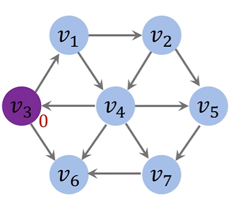

##### BFS


##### 参考

[3.03. 11-2- 无权图的最短路算法 Finding Shortest P_哔哩哔哩_bilibili](https://www.bilibili.com/video/BV1DG4y1N7Y6?spm_id_from=333.788.videopod.episodes&vd_source=ea5f077dc692dc32725d05ff92da61a5&p=3)


### 单源最短路径(SSSP)-有正权

#### 问题描述

从一个节点出发，每个边都一个正值权重，找到这个点到所有节点的最短路径

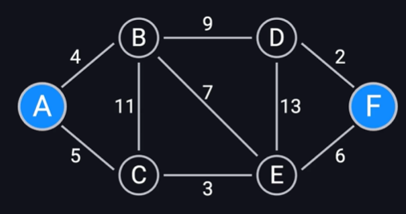


#### 近年的突破

[STOC Best Paper: Breaking the Sorting Barrier for Directed Single-Source Shortest Paths](https://dl.acm.org/doi/abs/10.1145/3717823.3718179)


#### Dijkstra


- 原理：[Dijkstra最短路径算法_哔哩哔哩_bilibili](https://www.bilibili.com/video/BV14dXpYEEZS/?spm_id_from=333.337.search-card.all.click&vd_source=ea5f077dc692dc32725d05ff92da61a5)

- 其实就是BFS，不同的是需要使用的是`优先队列`进行排序

  - 优先队列一般使用`二叉堆`或者`斐波那契堆`实现待选节点的==删除和插入==

  - ==C++标准库有优先队列的实现==`priority_queue`

  - 算法的==时间复杂度==(主要)取决于优先队列的实现方式

    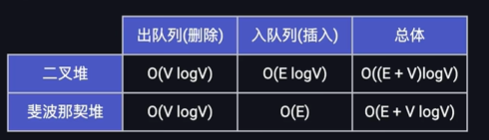

- 注意：边权重不能为负，有负权边的图需要使用`Bellman-Ford `算法

优先队列和堆

!!! note
    排序算法中有`堆排序`，其中也有相关内容


##### C++示例

```c++
#include <iostream>
#include <vector>
#include <queue>
#include <utility>
#include <limits>

using std::cout;
using std::endl;
using std::vector;
using std::pair;
using std::priority_queue;
using std::make_pair;
using ll = long long;

const ll INF = std::numeric_limits<ll>::max() / 4;

// Dijkstra: returns distance vector from src to all nodes (0..n-1)
// adj: adjacency list where adj[u] contains pairs (v, weight)
vector<ll> dijkstra(int n, int src, const vector<vector<pair<int,int>>> &adj) {
    vector<ll> dist(n, INF);
    dist[src] = 0;
    // min-heap of (distance, node)
    priority_queue<pair<ll,int>, vector<pair<ll,int>>, std::greater<pair<ll,int>>> pq;
    pq.push(make_pair(0LL, src));

    while (!pq.empty()) {
        auto [d, u] = pq.top(); pq.pop();
        if (d != dist[u]) continue; // stale entry
        for (const auto &e : adj[u]) {
            int v = e.first;
            int w = e.second;
            if (dist[v] > dist[u] + w) {
                dist[v] = dist[u] + w;
                pq.push(make_pair(dist[v], v));
            }
        }
    }
    return dist;
}

int main() {
    // simple test graph
    // 6 nodes: 0..5
    int n = 6;
    vector<vector<pair<int,int>>> adj(n);
    auto add_edge = [&](int u, int v, int w) {
        adj[u].push_back(make_pair(v, w));
        // if undirected, also add adj[v].push_back({u,w});
    };

    add_edge(0, 1, 7);
    add_edge(0, 2, 9);
    add_edge(0, 5, 14);
    add_edge(1, 2, 10);
    add_edge(1, 3, 15);
    add_edge(2, 3, 11);
    add_edge(2, 5, 2);
    add_edge(3, 4, 6);
    add_edge(4, 5, 9);

    int src = 0;
    auto dist = dijkstra(n, src, adj);

    cout << "Distances from node " << src << ":\n";
    for (int i = 0; i < n; ++i) {
        if (dist[i] >= INF/2) cout << i << ": INF\n";
        else cout << i << ": " << dist[i] << '\n';
    }

    return 0;
}

```


##### 参考

- [4.04. 11-3- Dijkstra 算法 寻找有权图中最短路 Findin_哔哩哔哩_bilibili](https://www.bilibili.com/video/BV1DG4y1N7Y6?spm_id_from=333.788.videopod.episodes&vd_source=ea5f077dc692dc32725d05ff92da61a5&p=4)
- [Dijkstra最短路径算法_哔哩哔哩_bilibili](https://www.bilibili.com/video/BV14dXpYEEZS/?spm_id_from=333.337.search-card.all.click&vd_source=ea5f077dc692dc32725d05ff92da61a5)
- [c++ STL二叉堆(优先队列)_c++二叉堆实现优先队列-CSDN博客](https://blog.csdn.net/okok__TXF/article/details/120722582#:~:text=本文详细介绍了C%2B%2B中如何手动实现二叉堆（优先队列），包括插入、删除、调整等操作，并通过示例代码进行演示。 接着，讲解了STL中的优先队列`priority_queue`的使用，包括最小堆和最大堆，并展示了自定义比较函数的方法。 此外，还提供了自定义类型在优先队列中的应用示例。 摘要生成于 C知道 ，由 DeepSeek-R1,满血版支持， 前往体验 > 完全二叉树：叶子节点只会出现在最后2层，且最后一层的叶子节点都靠左对齐。 二叉堆 (优先队列)：一种特殊的完全二叉树， 父结点值比子结点大或者小。 二叉堆前提是他必须是一颗完全二叉树！)
- [数据结构堆(Heap)详解-堆的建立、插入、删除、最大堆、最小堆、堆排序等_最大堆 heap 是一个什么样的存在?-CSDN博客](https://blog.csdn.net/xiaomucgwlmx/article/details/103522410)
- [数据结构-详解优先队列的二叉堆（最大堆）原理、实现和应用-C和Python-CSDN博客](https://blog.csdn.net/SHIDACSDN/article/details/128843212)


### 最小生成树(MST)

Minimum Spanning Tree

!!! note
    关于Spanning的意义：[5.05. 12-1- 最小生成树 Minimum Spanning Trees_哔哩哔哩_bilibili](https://www.bilibili.com/video/BV1DG4y1N7Y6?spm_id_from=333.788.videopod.episodes&vd_source=ea5f077dc692dc32725d05ff92da61a5&p=5)

#### 树的概念

- 树和无向图的区别是：树没有回路，并且是一个连通图。
- 树是一个特殊的图
- 树如果有n个节点，那么一定有n-1个边

#### 问题解释

从有权的连通的无向图中，找到一个包含其中所有节点的树，总体权重最小


- 不能有环

#### Prim算法和Kruskal算法

##### 过程  

- [数据结构——四分钟搞定Prim算法_哔哩哔哩_bilibili](https://www.bilibili.com/video/BV1Cv4y1s7kU/?spm_id_from=333.337.search-card.all.click&vd_source=ea5f077dc692dc32725d05ff92da61a5)

- [数据结构——两分钟搞定最小生成树Kruskal算法_哔哩哔哩_bilibili](https://www.bilibili.com/video/BV1do4y1v7KZ?spm_id_from=333.788.player.switch&vd_source=ea5f077dc692dc32725d05ff92da61a5)

- 时间复杂度对比

  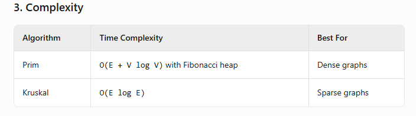

  

  

- Kruskal算法的时间复杂度来自初始的排序权重，而非并查集

!!! note
    ⚠️Kruskal算法中如何判断两个节点是否在同一个树中？并查集


### Tarjan算法提取强连通分量

#### basic

- 强联通图

  

- 强联通分量

  在强连图图的基础上加入一些点和路径，使得当前的图不在强连通，称原来的强连通的部分为强连通分量。

  


#### 基本思路

对于每次搜索的点，我们都加入栈中，遇到回路时，在把栈中的元素逐个弹出，记录它们的起始结点，直到栈中弹出的元素正好是起始结点时，结束弹栈，继续搜索其它强连通分量

在这个过程中，所有的点和都有的边都被遍历了一次，所以最终的时间复杂度为**O ( N + E )** 


#### 流程举例


### 一笔画(Eulerian Path/Circuit)

#### 概述

一笔画问题。用图论的术语来说，就是判断这个图是否是一个能够[遍历](https://zh.wikipedia.org/wiki/图的遍历)完所有的边而没有重复。这样的图现称为**欧拉图**。这时遍历的路径称作**欧拉路径(Eulerian Path)**（一个[环](https://zh.wikipedia.org/wiki/图论)或者一条链），如果路径闭合（一个圈），则称为**欧拉回路(Eulerian Circuit)**[[1\]](https://zh.wikipedia.org/wiki/一笔画问题#cite_note-early-1)。

一笔画问题的推广是[多笔画问题]()，即对于不能一笔画的图，探讨最少能用多少笔来画成。

欧拉对[哥尼斯堡七桥问题]()的研究正是图论的开端

!!! note
    **哥尼斯堡七桥问题**
    
    


#### 定理


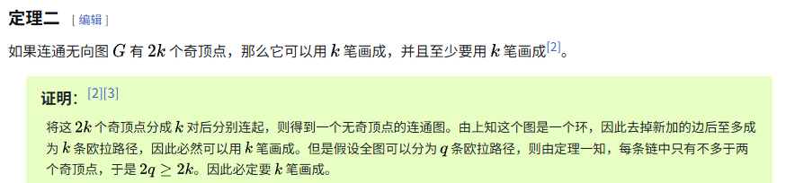

#### 算法


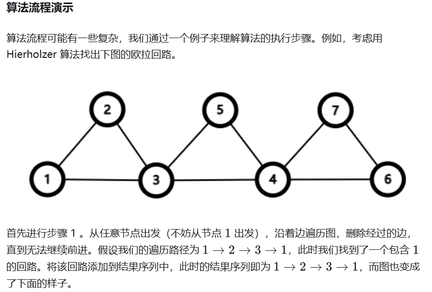


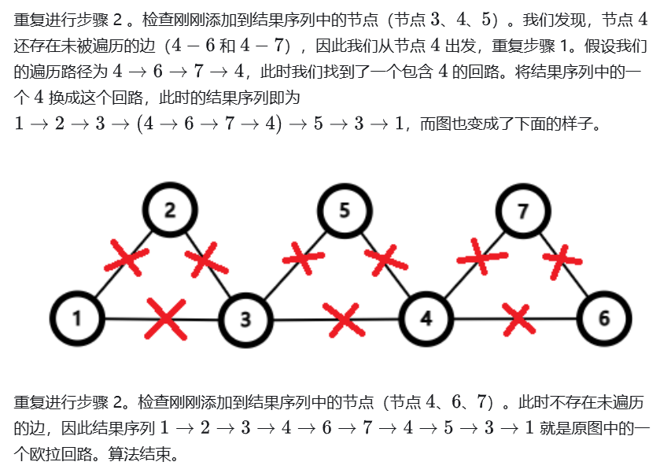


```c++
#include <iostream>
#include <string>
#include <vector>
#include <stack>
#include <algorithm>
#include <boost/graph/adjacency_list.hpp>

// Define Node property with a Name
struct Node {
    std::string name;
};

// Define Edge property with a Name
struct Edge {
    std::string name;
};

// Define the Graph type
// Using listS for OutEdgeList to efficiently handle edge removal during Hierholzer's algorithm
// while supporting multiple edges. 
// vecS for VertexList allows easy indexing.
using Graph = boost::adjacency_list<boost::listS, boost::vecS, boost::undirectedS, Node, Edge>;
using Vertex = boost::graph_traits<Graph>::vertex_descriptor;
using EdgeDesc = boost::graph_traits<Graph>::edge_descriptor;

// Helper to find Eulerian Path/Circuit
std::vector<Vertex> find_eulerian_path(Graph g) { // Pass by value to modify a copy
    std::vector<Vertex> circuit;
    
    // 1. Check degrees
    std::vector<Vertex> odd_degree_nodes;
    auto v_pair = boost::vertices(g);
    for (auto it = v_pair.first; it != v_pair.second; ++it) {
        if (boost::out_degree(*it, g) % 2 != 0) {
            odd_degree_nodes.push_back(*it);
        }
    }

    if (odd_degree_nodes.size() != 0 && odd_degree_nodes.size() != 2) {
        std::cerr << "Graph does not have an Eulerian Path (Odd degree count: " << odd_degree_nodes.size() << ")" << std::endl;
        return {};
    }

    // 2. Determine start vertex
    Vertex curr = *boost::vertices(g).first; // Default to first vertex
    if (!odd_degree_nodes.empty()) {
        curr = odd_degree_nodes[0]; // Start at one of the odd degree nodes
    }
    
    // Ensure we start at a vertex with edges if possible (for disconnected components logic, though assuming connected here)
    if (boost::out_degree(curr, g) == 0) {
         auto v_range = boost::vertices(g);
         for(auto it = v_range.first; it != v_range.second; ++it){
             if(boost::out_degree(*it, g) > 0) {
                 curr = *it;
                 break;
             }
         }
    }

    // 3. Hierholzer's Algorithm
    std::stack<Vertex> curr_path;
    curr_path.push(curr);

    while (!curr_path.empty()) {
        Vertex u = curr_path.top();

        if (boost::out_degree(u, g) > 0) {
            // Pick the first available edge
            auto edges = boost::out_edges(u, g);
            EdgeDesc e = *edges.first;
            Vertex v = boost::target(e, g);

            // Remove edge to mark as visited
            // Note: remove_edge(e, g) is safer than remove_edge(u, v, g) for multigraphs
            boost::remove_edge(e, g);

            curr_path.push(v);
        } else {
            circuit.push_back(u);
            curr_path.pop();
        }
    }

    // The circuit is constructed in reverse order
    std::reverse(circuit.begin(), circuit.end());
    return circuit;
}

int main() {
    Graph g;

    auto add_node = [&](std::string name) {
        return boost::add_vertex(Node{std::move(name)}, g);
    };

    auto v_a = add_node("A");
    auto v_b = add_node("B");
    auto v_c = add_node("C");
    auto v_d = add_node("D");
    auto v_e = add_node("E");

    auto add_edge = [&](Vertex u, Vertex v, std::string name) {
        boost::add_edge(u, v, Edge{std::move(name)}, g);
    };

    // --- Complex Multigraph Case ---
    std::cout << "Constructing complex multigraph..." << std::endl;

    // 4 edges between A and B
    add_edge(v_a, v_b, "AB_1");
    add_edge(v_a, v_b, "AB_2");
    add_edge(v_a, v_b, "AB_3");
    add_edge(v_a, v_b, "AB_4");

    // Cycle B-C-D-B
    add_edge(v_b, v_c, "BC_1");
    add_edge(v_c, v_d, "CD_1");
    add_edge(v_d, v_b, "DB_1");

    // Double edge between D and E
    add_edge(v_d, v_e, "DE_1");
    add_edge(v_d, v_e, "DE_2");

    // Degrees Analysis:
    // A: 4 (Even)
    // B: 4 + 1 + 1 = 6 (Even)
    // C: 1 + 1 = 2 (Even)
    // D: 1 + 1 + 2 = 4 (Even)
    // E: 2 (Even)
    // Result: Should have an Eulerian Circuit.

    std::cout << "Graph structure:" << std::endl;
    boost::graph_traits<Graph>::edge_iterator ei, ei_end;
    for (boost::tie(ei, ei_end) = boost::edges(g); ei != ei_end; ++ei) {
        std::cout << g[boost::source(*ei, g)].name << " -- " << g[boost::target(*ei, g)].name 
                  << " (" << g[*ei].name << ")" << std::endl;
    }

    std::cout << "\nAttempting to find Eulerian Circuit..." << std::endl;
    std::vector<Vertex> path = find_eulerian_path(g);

    if (!path.empty()) {
        std::cout << "Eulerian Circuit found: ";
        for (size_t i = 0; i < path.size(); ++i) {
            std::cout << g[path[i]].name;
            if (i < path.size() - 1) std::cout << " -> ";
        }
        std::cout << std::endl;
    } else {
        std::cout << "No Eulerian Path/Circuit found." << std::endl;
    }

    // --- Modify for Eulerian Path Case ---
    std::cout << "\nRemoving one A-B edge to create Eulerian Path case (A and B become odd degree)..." << std::endl;
    
    // We need to remove one specific edge between A and B.
    // Since we don't have the descriptors saved, we iterate to find one.
    auto out_edges = boost::out_edges(v_a, g);
    for(auto it = out_edges.first; it != out_edges.second; ++it) {
        if(boost::target(*it, g) == v_b) {
            boost::remove_edge(*it, g);
            break; // Remove only one
        }
    }

    // New Degrees:
    // A: 3 (Odd)
    // B: 5 (Odd)
    // Others unchanged (Even)
    // Result: Should find Eulerian Path starting at A or B.

    path = find_eulerian_path(g);

    if (!path.empty()) {
        std::cout << "Eulerian Path found: ";
        for (size_t i = 0; i < path.size(); ++i) {
            std::cout << g[path[i]].name;
            if (i < path.size() - 1) std::cout << " -> ";
        }
        std::cout << std::endl;
    } else {
        std::cout << "No Eulerian Path found." << std::endl;
    }

    return 0;
}

```


#### ref

[一笔画问题 - 维基百科，自由的百科全书](https://zh.wikipedia.org/wiki/一笔画问题)


### 参考

- [强推！浙大博士王树森半天就教会了我图论和图算法，原理详解+项目实战，学不会来打我！_哔哩哔哩_bilibili](https://www.bilibili.com/video/BV1DG4y1N7Y6?spm_id_from=333.788.videopod.episodes&vd_source=ea5f077dc692dc32725d05ff92da61a5)
- [图论——强连通分量（Tarjan算法)-CSDN博客](https://blog.csdn.net/weixin_43843835/article/details/88381828)
- https://zhuanlan.zhihu.com/p/639902025


## Maze Algorithm

### 基本知识

- 曼哈顿距离：水平+垂直举例
- 欧几里得距离：直线距离

### 原理

F=G+H


## 动态规划DP

Dynamic Programing简称 **DP**，是一种求解多阶段决策过程最优化问题的方法。在动态规划中，通过把原问题分解为相对简单的子问题，先求解子问题，再由子问题的解而得到原问题的解。

### 核心思想

1. 把「原问题」分解为「若干个重叠的子问题」，每个子问题的求解过程都构成一个 **「阶段」**。在完成一个阶段的计算之后，动态规划方法才会执行下一个阶段的计算。
2. 在求解子问题的过程中，按照「自顶向下的记忆化搜索方法」或者「自底向上的递推方法」求解出「子问题的解」，把结果存储在==表格==中，当需要再次求解此子问题时，直接从表格中查询该子问题的解，从而避免了大量的重复计算。

#### 简单例子

斐波那契数列

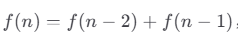

```python
class Solution:
    def fib(self, n: int) -> int:
        if n == 0:
            return 0
        if n == 1:
            return 1

        dp = [0 for _ in range(n + 1)]
        dp[0] = 0
        dp[1] = 1

        for i in range(2, n + 1):
            dp[i] = dp[i - 2] + dp[i - 1]

        return dp[n]
```


### 使用条件

1. **最优子结构性质**

   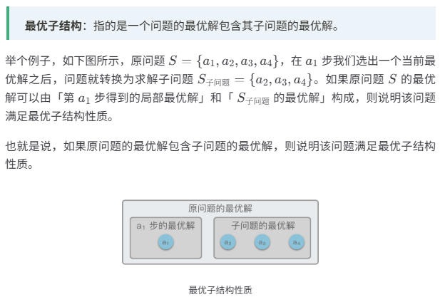

2. **重叠子问题性质**

   指的是在求解子问题的过程中，有大量的子问题是重复的，一个子问题在下一阶段的决策中可能会被多次用到。如果有大量重复的子问题，那么只需要对其求解一次，然后用表格将结果存储下来，以后使用时可以直接查询，不需要再次求解

3. **无后效性**

   指的是子问题的解（状态值）只与之前阶段有关，而与后面阶段无关。当前阶段的若干状态值一旦确定，就不再改变，不会再受到后续阶段决策的影响。


### 背包问题

#### 定义


背包问题可分为：`0-1 背包问题`、`完全背包问题`、`多重背包问题`、`分组背包问题`，以及`混合背包问题`等


#### 0-1背包问题

[(32 封私信 / 59 条消息) 动态规划求解“组合总和”问题 - 知乎](https://zhuanlan.zhihu.com/p/78080883)

每种物品有且仅有 1 件，每件物品可以选择不放入背包，也可以选择放入背包。

定义状态 `dp[i][w]` 表示为：前 `i` 件物品放入一个最多能装重量为 `w` 的背包中，可以获得的最大价值。

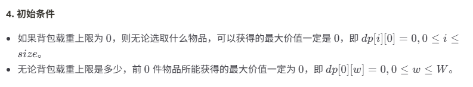


##### 类似问题

[416. 分割等和子集 - 力扣（LeetCode）](https://leetcode.cn/problems/partition-equal-subset-sum/description/)


#### 完全背包问题


### 常见问题

基础：

- 爬楼梯
- 求斐波那契数列-->[最长递增子序列](https://algo.itcharge.cn/08_dynamic_programming/08_03_linear_dp_01/#_2-1-%E6%9C%80%E9%95%BF%E9%80%92%E5%A2%9E%E5%AD%90%E5%BA%8F%E5%88%97)-->[斐波那契子序列的长度](https://algo.itcharge.cn/08_dynamic_programming/08_03_linear_dp_01/#_2-3-最长的斐波那契子序列的长度)
- 不同路径-->拓展-->[出界的路径数](https://algo.itcharge.cn/solutions/0500-0599/out-of-boundary-paths/#题目链接)
- [组合总和(01背包)](https://leetcode.cn/problems/combination-sum/)([动态规划求解“组合总和”问题 - 知乎](https://zhuanlan.zhihu.com/p/78080883))-->[目标和](https://leetcode.cn/problems/target-sum/solutions/816361/mu-biao-he-by-leetcode-solution-o0cp/), [分割等和子集](https://leetcode.cn/problems/partition-equal-subset-sum/solutions/442320/fen-ge-deng-he-zi-ji-by-leetcode-solution/)
- 双串线性DP问题：[最长公共子序列](https://leetcode.cn/problems/longest-common-subsequence/description/)和[最长重复子数组](https://leetcode.cn/problems/maximum-length-of-repeated-subarray/description/)，[编辑距离（需要转化）](https://leetcode.cn/problems/edit-distance/solutions/188223/bian-ji-ju-chi-by-leetcode-solution/)
- 矩阵线性DP问题：[最小路径和](https://leetcode.cn/problems/minimum-path-sum/)
- 无串线性DP问题：[整数拆分](https://leetcode.cn/problems/integer-break/solutions/352875/zheng-shu-chai-fen-by-leetcode-solution/) ≈ [两个键的键盘](https://leetcode.cn/problems/2-keys-keyboard/description/)


## 线性规划LP

### 概述

线性规划算法的==核心思想==是：在满足约束条件的前提下，找到目标函数的最优解。

几乎任何涉及**“有限资源下如何最优配置”**的问题都可以用 LP 建模

#### 要素

（1）目标函数：线性函数，可以是最大化或最小化。
（2）约束条件：线性不等式或等式。
（3）变量：决策变量，一般为实数。

#### 凸函数、凸规划


### 工具

在实际应用、论文写作、数学建模竞赛中，我们通常**不手算单纯形法**，而是借助以下工具快速建模与求解：

| 工具                                            | 特点                                                         |
| ----------------------------------------------- | ------------------------------------------------------------ |
| **Python（PuLP / ==SciPy== / CVXPY）**          | 强大灵活，适合建模与自动化求解                               |
| **Lingo / ==Gurobi== / CPLEX**                  | 专业优化软件，求解大规模 LP 极快，常用于学术研究与工业优化   |
| [SYMPHONY](https://github.com/coin-or/SYMPHONY) | SYMPHONY is an open-source solver, callable library, and development framework for ==mixed-integer linear programs (MILPs)== written in C with a number of unique features |
| **CBC**                                         |                                                              |

[Ubuntu安装Gurobi+CMake使用详细指南 - 编程爱好者博客](https://bchobby.github.io/posts/4fb40fbd05216891a7defe29e30c309a/)


### 分类

| 问题类型                 | 变量类型                     | 目标函数和约束 | 常用算法                   | 复杂度                       |
| :----------------------- | :--------------------------- | :------------- | :------------------------- | :--------------------------- |
| 线性规划（LP）           | 连续                         | 线性           | 单纯形法、内点法           | 多项式时间（内点法）         |
| 整数线性规划（ILP）      | 整数                         | 线性           | 分支定界、割平面、分支切割 | NP难                         |
| 混合整数线性规划（MILP） | 整数和连续                   | 线性           | 分支定界、割平面、分支切割 | NP难                         |
| 非线性规划（NLP）        | 通常连续（也可整数，但更难） | 非线性         | 梯度下降、牛顿法、SQP等    | 一般NP难，凸优化为多项式时间 |

### 一般线性规划（LP）

线性规划（Linear Programming，简称LP）是一种数学方法，用于在给定的线性约束条件下，求解线性目标函数的最大值或最小值。


#### 方法

- 单纯形法


### 整数规划（ILP）

#### 举例


### 非线性规划(NLP)

如果**目标函数或约束条件中包含非线性函数**，就称这种规划问题为非线性规划问 题

一般说来，解非线性规划要比解线性规划问题困难得多。而且，也不象线性规划有 `单纯形法`这一通用方法


#### 方法


### 参考

- [深入解析：数学建模-线性规划(LP) - yfceshi - 博客园](https://www.cnblogs.com/yfceshi/p/19060256)


## Combinatorial Optimization

组合优化问题(COP)


### 精确方法和近似方法


### 常见相关场景/问题

- TSP

  给定一系列城市和每对城市之间的距离，求解访问每座城市一次并回到起始城市的最短回路

- VRP

  给定一组客户点、车辆容量、车辆数量、起始点和终点，目标是找到使得所有客户点都被访问一次的最短路径方案。

- MVC(最小顶点覆盖问题)

- MDS(最小支配集)

- MIS(最大独立集)

  

- 背包问题


  

### Heuristic algorithm

#### SA

Simulated Annealing  


#### GA

Genetic Algorithm

#### GE

Grammatical Evolution


### 基于NN和DL的方法


#### 分类


#### 特点

##### 优点


##### 缺点


#### 经典模型

##### Pointer Network

PointerNet 是基于 Sequence to Sequence 的 Attention 机制的改进


PointerNet 引入了一种**新的神经体系结构**来学习输出序列的条件概率，其中元素是与**输入序列中的位置**相对应的**离散标记**

###### 模型


作者发现， $ A^i_j $ 经过softmax后，也可以直接作为针对原序列的指针进行训练；简单理解为，原来的 $ A^i_j $ 为原序列每一位的注意力，那么新的 $ A^i_j $ 可以作为原序列每一位放在此处的概率，最后选择概率最大的直接输出。


编码器和解码器均为 LSTM  


###### 训练的问题


###### 强化学习进行训练


## 随机无导数优化算法

### 总结

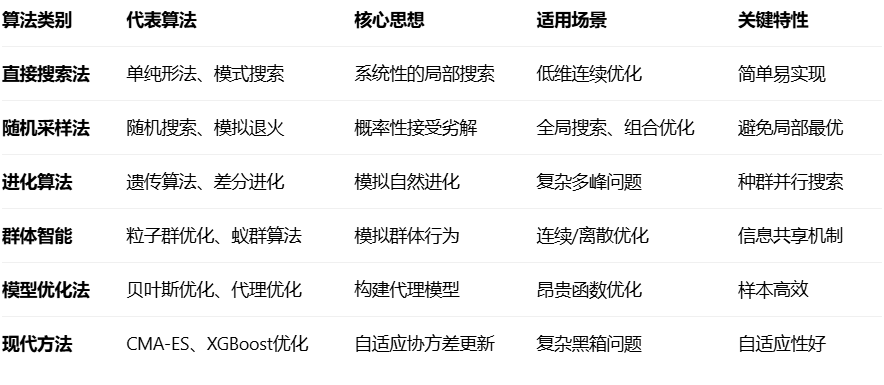

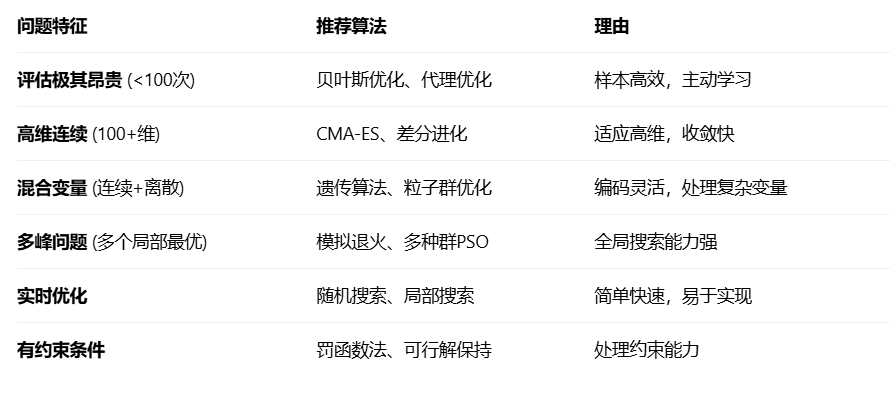

- **变量类型**：连续→PSO/DE，离散→GA/模拟退火
- 实际应用中，经常采用**组合策略**：先用全局搜索（如遗传算法）找到有希望的区域，再用局部搜索（如单纯形法）精细优化。对于最前沿的问题，CMA-ES和贝叶斯优化通常是首选。

### 启发式优化算法

#### SA

##### 概述

SA是一种相对而言比较好实现的算法，

##### 应用场景

因为需要较高的初始温度以及较低的降火速率和终止温度，因此目标函数调用次数较多，==不适用于目标函数评估时间过长的模型==


##### ref

[模拟退火算法求解组合优化（附代码详解） - 知乎](https://zhuanlan.zhihu.com/p/270928880)

#### GA

- 具体的交叉和变异方法是关键
- 如果fitness计算量大，适合并行

#### DE

差分进化算法和`遗传算法`很相似，也是一种基于群体智能理论的优化算法，通过群体内个体间的合作与竞争而产生的全局搜索策略，采用实数编码、基于差分的简单变异操作和“一对一”的竞争生存策略，降低了进化计算操作的复杂性。

`差分进化算法`具有记忆能力使其可以动态跟踪当前的搜索情况，以调整其搜索策略，具有较强的全局收敛能力和稳健性，且不需要借助问题的特征信息，适用于求解一些利用常规的数学规划方法很难求解，甚至无法求解的复杂优化问题


#### PSO


#### ref

- [常用优化算法(模拟退火、遗传算法、粒子群算法）及其Python实现](https://zhuanlan.zhihu.com/p/609963622)


### 贝叶斯优化

- **适用**：超参数调优、实验设计、昂贵仿真优化

##### 

#### 工具

GPflow 


### CMA-ES

- `CMA-ES`是一种**随机无导数优化算法**，特别擅长处理传统优化方法难以应对的复杂问题。它通过==自适应调整协方差矩阵==来引导搜索方向，不需要计算梯度信息，非常适合==黑箱优化==场景。
- 这个强大的**无导数数值优化算法**能够解决==非凸、病态、多模态、崎岖和带噪声==的优化挑战，在连续和混合整数搜索空间中表现出色。


#### 工具

##### pycma

###### install

```bash
python -m pip install cma
```

###### example

```python
import cma
 
# 最小化tablet函数
x, es = cma.fmin2(cma.ff.tablet, 15 * [1], 1)
 
# 获取最优解和算法结果
best_solution = es.result[0]
mean_solution = es.result[5]
```


### XGBoost优化

  

## 优化理论

#### 凸优化

#### 多目标优化问题（Multi-Objective Optimization Problem, MOOP）


## other

### sequence pairs  

Sequence Pair (SP) is a floorplan representation by a pair of module-name sequences: positive locus, and negative locus. It does not gaurantee the floorplan to be compacted. Yet, it has a P*-admissible solution space.


#### 参考

[PD PA2 Report - HackMD](https://hackmd.io/@mirkat1206/BJZx_JuQc#Sequence-Pair)


### Zobrist 哈希

- Zobrist 散列
- 佐布里斯特 
- Zobrist 哈希是一种专门针对==棋类游戏==而提出来的编码方式,以其发明者 Albert L.Zobrist 的名字命名。
- Zobrist 哈希通过一种特殊的置换表,也就是对==棋盘上每一位置的各个可能状态赋予一个编码索引值==,来实现在极==低冲突率==的前提下在一个整型数据上对棋盘进行编码。其编码步骤描述如下:


#### 实例

https://www.bilibili.com/video/BV1D94y1D7mF?spm_id_from=333.788.videopod.episodes&vd_source=ea5f077dc692dc32725d05ff92da61a5&p=6

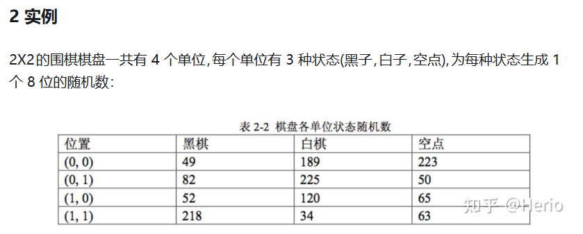

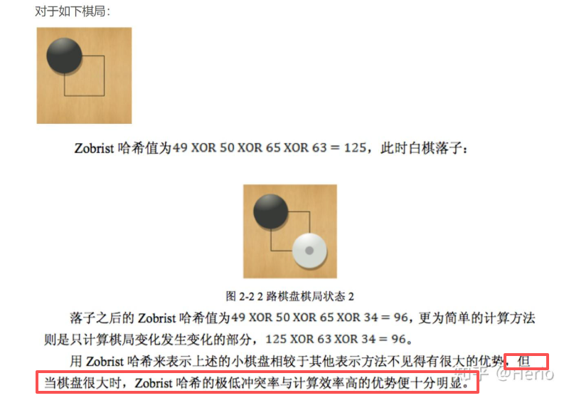


#### 参考

- [alphago 实战](https://www.bilibili.com/video/BV1D94y1D7mF?spm_id_from=333.788.videopod.episodes&vd_source=ea5f077dc692dc32725d05ff92da61a5&p=6)
- https://zhuanlan.zhihu.com/p/605462944
- [gobang/docs/Zobrist.md at main · arcturus-school/gobang](https://github.com/arcturus-school/gobang/blob/main/docs/Zobrist.md)
- [七：Zobrist缓存 - 《五子棋AI教程 第二版》 - 书栈网 · BookStack](https://www.bookstack.cn/read/lihongxun945-gobang-ai/fddd888addab81b9.md)


