# 概述

## 背景

- Implementing analog circuit layout is a heavily manual, timeconsuming, and error-prone task.   

- 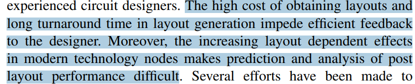
- analog  ICs flow faces challenges regarding low design efficiency and slow development speed [AIPlacer: 1] 
- 

### 和数字在布局的区别

- Digital designers have to deal with a large number of rectangular devices, but all the devices share the same height and are placed in rows rather than freely, which resembles 1D Bin Packing Problem (Munienand Ezugwu, 2021). On the other hand, Analog and Mixed-Signal (AMS) ICs usually contain fewer devices, which may have different sizes and voltage levels and can be freely placed on the canvas. Hence, routability is generally not a critical issue for analog circuit layouts.
- Unlike digital ICs, analog ICs contain a large number of design constraints and intricate performance metrics to meet, which requires a steep learning curve for designers with a wealth of specialized skills. 
- 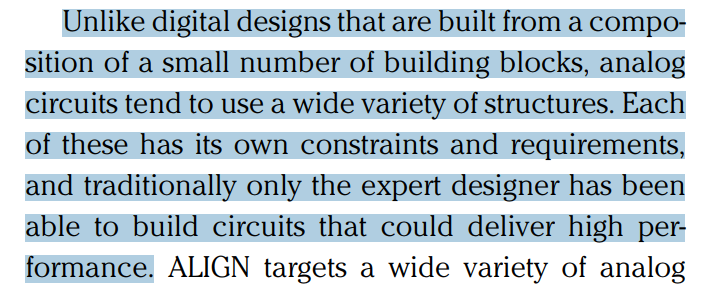

#### performance-driven placement optimization  

AIPlacer:

- 
- 


## 指标

- area
- wirelength

  - HPWL
  - RWL
- symmetry
- parasitics
- power
- via
- thermal effects
- 

## 难点

- the impact of layout on analog circuit performance can be very large due to significant RC (Resistance and Capacitance) parasitic generated in layout

  

- the layout effect on performance is often very complex and thus difficult to be quickly and accurately estimated.

- analog circuit performance has much larger variety than digital circuits, and different performance metrics are used for different types of analog circuits. 

- Unlike its counterpart in the digital domain, AMS circuits are sensitive to layout parasitics and coupling while lacking a practical approach to model the performance from layouts [21]

- Unlike typical digital designs, AMS circuits are sensitive to small perturbation and distortion on the signal and raise more considerable challenges on the layouts.

- 企业方面：用户不一定有 GPU

- flow auto 的缺点：

  1) Analog circuit topologies are rapidly evolving with new design practices. A fully automated flow is not flexible enough to satisfy the versatile customization demands. 

  2) Analog layout drawing is designer-specific. That is, two designers can have quite different ways to layout the same circuit according to their own experience and taste, which is hard to be implemented in a fully automated flow.

  3) Layouts generated by a fully automated flow may not align with designers’ intuition, like the example in Figure 1, leading to performance degradation or difficulties in postsilicon debugging after tape-out. 

     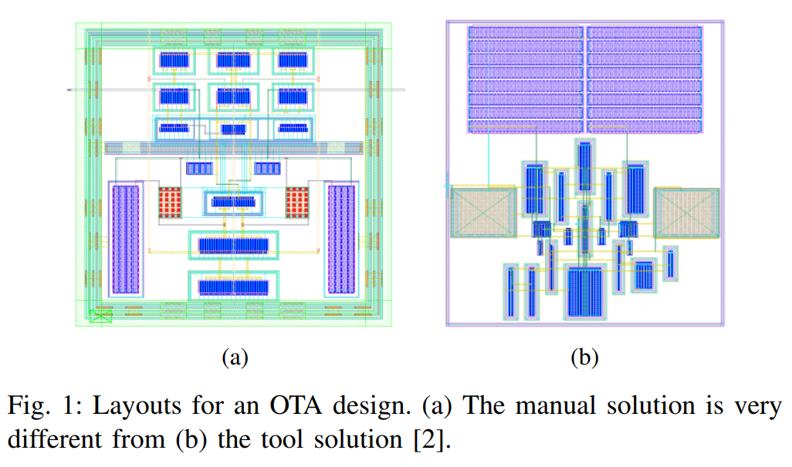


## 约束类型

[DATE22]: symmetry [5], common-centroid [6], regularity [7], proximity [8], pre-placed [9], fixed-boundary [10], and mimimum/maximum separation [11]. Performance-related constraints such as monotonic current flows [12] have also been studied. 


### overlap  

### symmetry  

- 
- 对称性约束是模拟版图综合过程中应用最广泛且至关重要的约束之一。模拟设计经常采用差分拓扑结构来抑制共模噪声并增强电路的鲁棒性。这些拓扑结构中器件的失配会显著降低电路性能。
- 在版图设计中，需要对这些器件进行对称的放置和布线，以确保匹配性。
- Symmetry constraints are one of the most essential and widely adopted constraints applied during analog layout synthesis. Analog designs frequently use differential topologies to reject common-mode noise and enhance circuit robustness and performance [18]. Mismatch of sensitive devices in the layouts often cause performance degradation to offset and commonmode rejection ratio (CMRR) [19]. Thus correctly identifying symmetry constraints between sensitive devices are crucial for ensuring the quality of placement and routing
- Symmetry constraints are one of the ==most essential and widely adopted== constraints applied during analog layout synthesis
- 

#### hierarchical symmetry constraints  


### alignment  


### common-centroid  

- 
- [ICCAD20:19, 33, 38]  
- 

### topo

- 

### length

- 

### current/signal-flow

- [ICCAD20]
- Current flow constraint requires that the path or direction of current flows must align with the circuit’s design. Adhering to current flow constraints mitigates issues such as voltage drops, noise, electromagnetic interference, and localized overheating.

### regularity  

- [ICCAD20: 7, 26, 39]  

### proximity  

- various minimum distances between devices
- [ICCAD20:6, 18, 25, 33–35, 41] 

### thermal effects  

- [ICCAD20:19, 20]   

### area


## 版图基本知识

### MOS


#### finger & multiple&fin

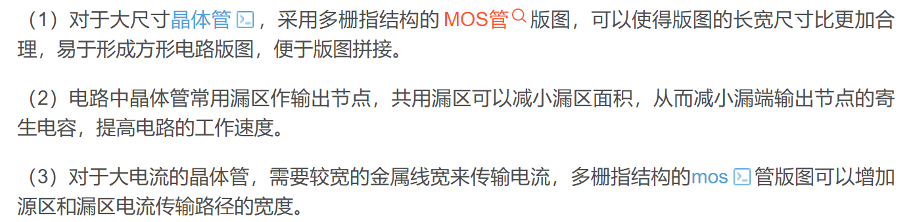


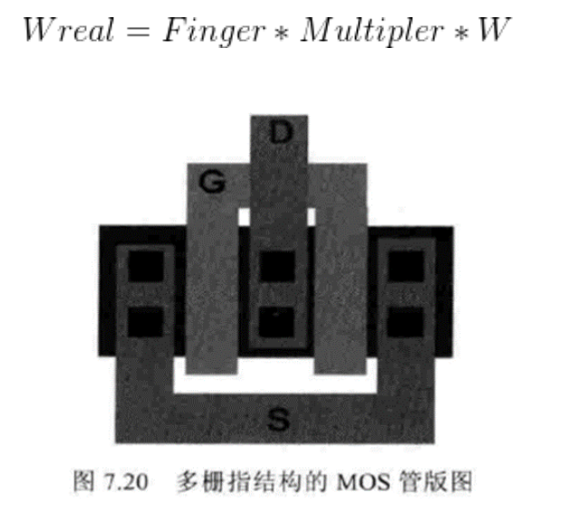

`finger`就是做成==叉指==形状的单个晶体管 , `mulitiplier`是多个并列的晶体管

`finger`是指将一个MOS管的**沟道分割**成多个**并联**的部分，每个部分称为一个finger。比如，如果一个MOS管的宽度太大，直接画成一个宽沟道可能不符合设计规则，或者导致版图不均匀。这时候，把它分成多个finger，每个finger的宽度较小，然后并联起来，总宽度就是各个finger的宽度之和。MOS管的漏端==结电容和栅电阻均会减小==

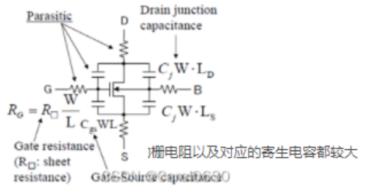


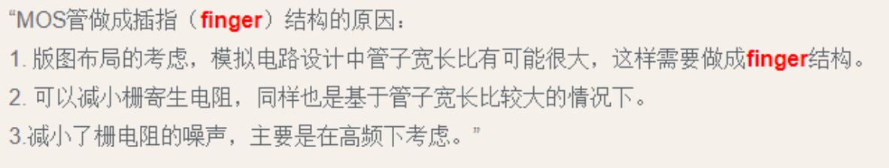

`multiplier`是指器件被复制的次数。比如，设置multiplier为4，相当于把这个MOS管**复制**4个，==并联==在一起。这种情况下，==每个MOS管都是独立的，它们的源、漏、栅都分别连接在一起==。这样==总宽度是单个MOS宽度的4倍==，电流能力也变成四倍。

> 一般来说，fingers数取偶数会好一些

`fin`

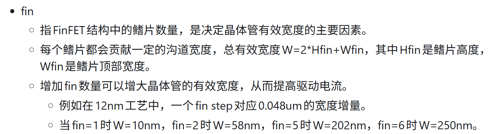

### LDE效应

layout-dependent effects

layout dependent effect can affect device `threshold voltage V_th` , `mobility` and circuit performance

 [(LDE) ](https://www.toutiao.com/article/7463532600296997412/?wid=1761215732491) [版图基础知识 - 小小桂花糕 - 博客园](https://www.cnblogs.com/jinzbr/p/18235452)

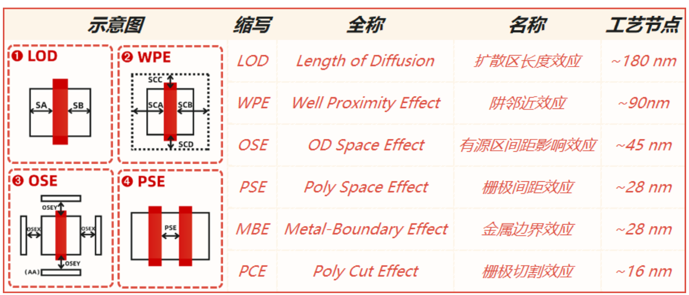

- LOD(Length of Diffusion)
  -  STI 应力引起的 LOD 效应的影响
  -  [告别失配！实用的版图匹配技巧 ①（附仿真验证说明） - 知乎](https://zhuanlan.zhihu.com/p/1966516064595715212)
  -  不要盲目套用 “匹配就是 ABBA” 的经验，ABBA 能抵消全局梯度，却无法消除局部 STI 应力差异。
- WPE(Well Proximity Effect)
- OSE(OD Space Effect)
- PSE(Poly Space Effect)
- MBE(Metal Boundary Effect）
- PCE(Poly Cut Effect)

#### LOD

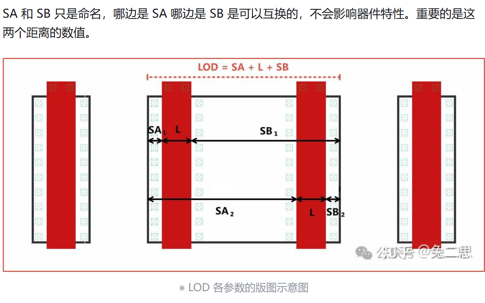

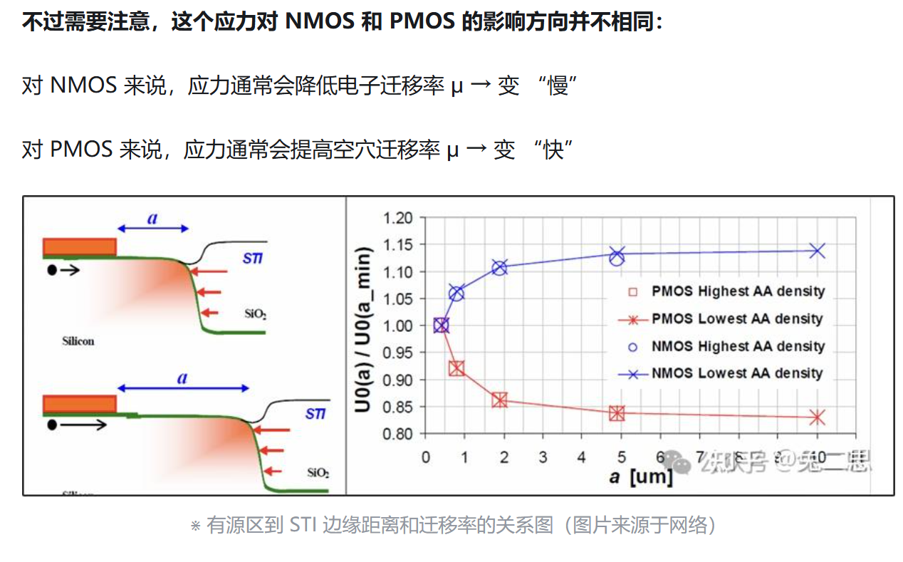

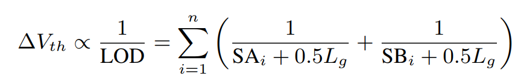


##### 实例

[告别失配！实用的版图匹配技巧 ①（附仿真验证说明） - 知乎](https://zhuanlan.zhihu.com/p/1966516064595715212)


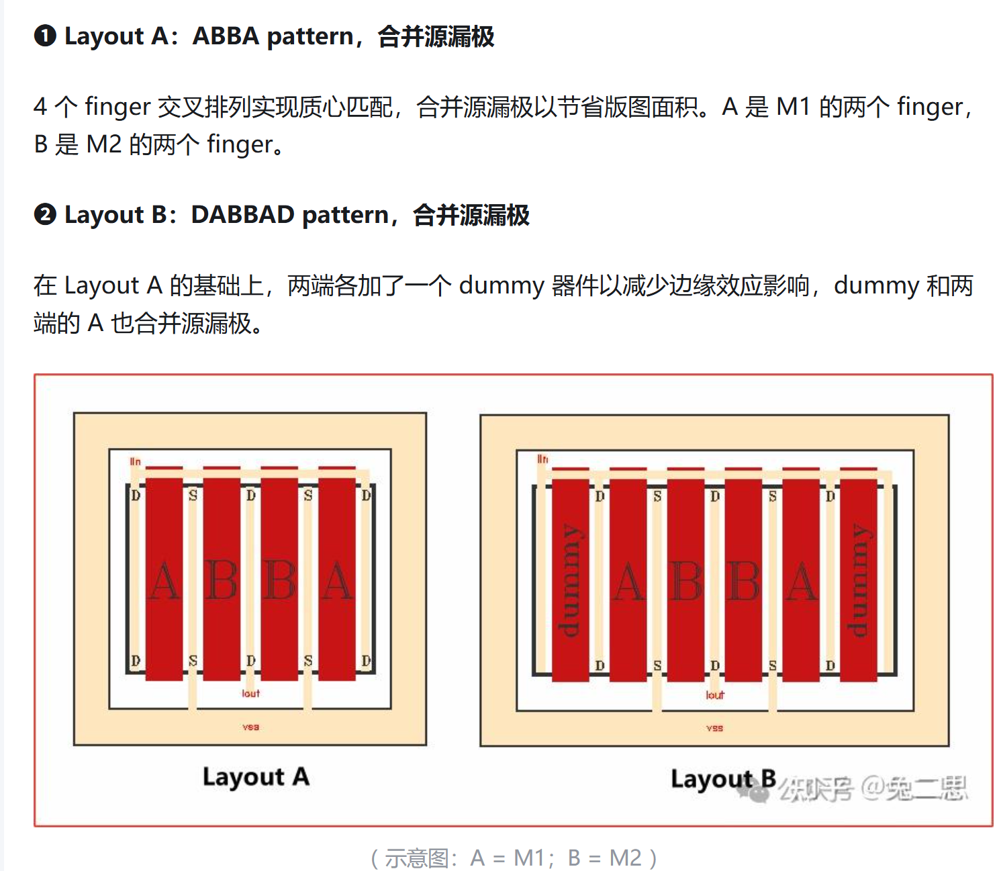

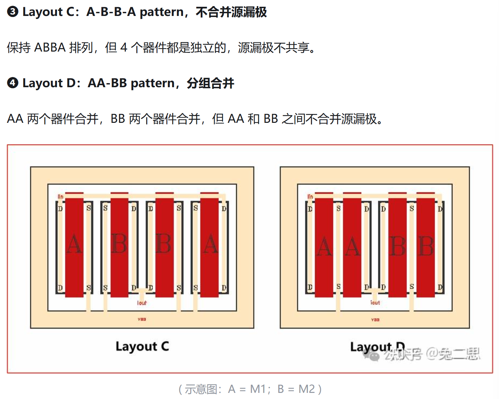


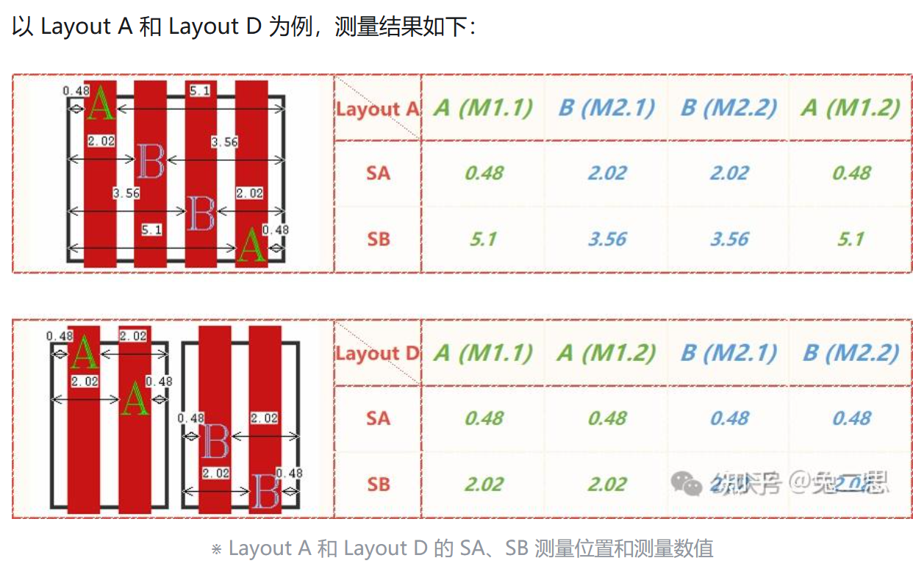


#### WPE

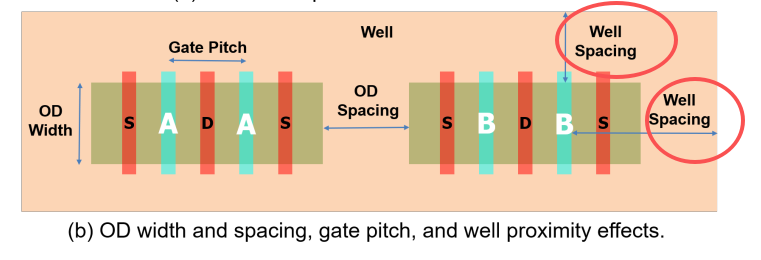

- 为了减少闩锁效应（latchup），制造过程中会使用高能离子注入来创建深倒置阱剖面（deep retrograde well profile），改变了阱区的掺杂剖面，

- 在先进技术节点（如纳米级CMOS），LDEs会导致晶体管性能参数（如阈值电压、迁移率）发生变化

- 影响：改变`Vth` of a device based on its ==distance from the well edge==  

- The WPE induced mismatch can be ==minimized by keeping well edges far from devices== or by maintaining equal well spacing for the devices to be matched

  

#### OSE

栅极之间的间距变化会影响多晶硅栅周围应力材料（如氮化硅）的体积，从而调制应力并改变Vth。

### variations 

学术解释：

--cite-->[Common-Centroid Layouts for Analog Circuits: Advantages and Limitations]()


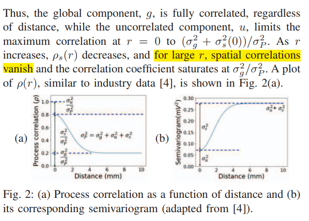


--cite-->[Constructive Place-and-Route for FinFET-Based Transistor Arrays in Analog Circuits Under Nonlinear Gradients]()


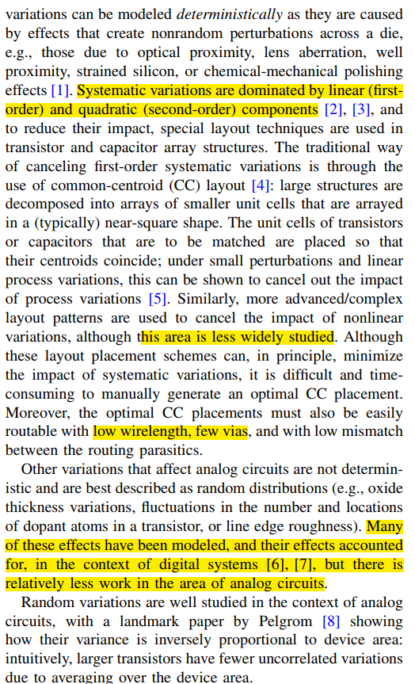


#### random variations 

Analog circuit performance can degrade due to random and spatial variations

can be mitigated using larger-sized devices  [2] [3] However, larger device may have more spatial variations as the distance between the devices increases [3].  --cit-->, Analog Transistor Placement Optimization Considering Nonlinear Spatial Variations

- 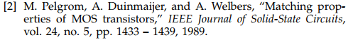
- 

However, increasing the size may cause the devices to become more sensitive to process gradients  [2].

- 

random dopant fluctuations (RDF)


#### spatial variations

use common-centroid, which effectively reduces `linear variations` or `first-order effect`

Several factors, including `process variations`, `thermal distribution` or uneven `mechanical stress` from other circuit layers, can contribute to spatial variations

The spatial variations can be modeled by Taylor series, where the lower order terms have greater impacts on the mismatch among devices [3] [4] [5] [6]

- 

However, for high performance systems, layout must be optimized considering `nonlinear or higher order effects` [3] [4] [5] [6] [10] [11]

- 
- Spatial variations have `linear` and `nonlinear` components
  - 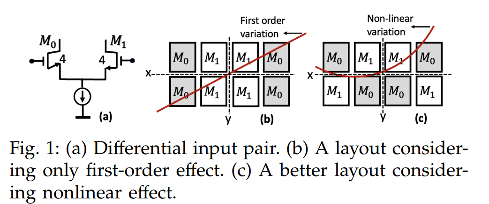
  - 
- 

#### Gradient-Based Variations  

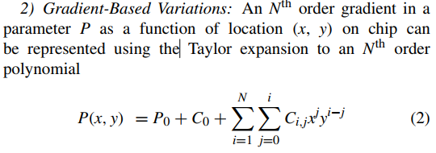


### 电迁移（EM）

电迁移可以被形象地理解为金属导线中的“动脉硬化”。当大量电子（电流）长时间持续地流过一根细小的金属导线时，会像水流冲击河床一样，对导线原子产生一个持续的推力（电子风）

影响：

- **短期**：金属原子被“吹走”，导致导线局部变薄，电阻逐渐增大。
- **长期**：最终会在高电流密度处形成**开路**（导线断裂），电路功能完全失效。
- **工艺演进下的恶化**：在旧工艺中，这个问题主要发生在较粗的上层金属。但在纳米级工艺中，最底层的金属导线变得极细，电流密度急剧升高，使得**电迁移成为所有金属层都必须严肃对待的可靠性头号杀手**，尤其是在充满大直流电流的模拟电路和电源网络中。

**对具体电路的破坏性影响**：

- **电流镜**：连接匹配晶体管的金属线上的寄生电阻，会导致它们的源极电压出现微小差异。这会直接破坏精确的**电流比例关系**，使电路失去功能。
- **差分对/OTA**：寄生电阻会降低电路的**跨导（Gm）**，这是模拟电路的核心性能指标，直接导致放大器增益、带宽等关键性能的劣化。

can be reduced by identifying sensitive wires and using ==multiple parallel connections== between nodes,


### 参考

- [集成电路版图设计技术更新版_哔哩哔哩_bilibili](https://www.bilibili.com/video/BV1dL411n7c2?spm_id_from=333.788.videopod.episodes&vd_source=ea5f077dc692dc32725d05ff92da61a5)
- [版图知识大总结_陆晓欢.pdf](版图知识大总结_陆晓欢.pdf)
- [Finger对MOS管的影响以及finger与Multiple的区别（浅显理解） - 知乎](https://zhuanlan.zhihu.com/p/690311740)
- [fingers和multiplier_inv电路中multiplier跟fingers的区别-CSDN博客](https://blog.csdn.net/Cecilia_yxy/article/details/134325937)
- 


## 版图绘制方法

### placement


#### clustered


#### Interdigitating 

- U may assume that interdigitization is a special case of a ==common centroid== but with ==only one row==

- 相比cc,在==面积效率和局部热管理==上更好，但可能引入额外寄生电容。

- Interdigitated适合==面积受限或高频场景==

- [In transistor matching if the total length of the mirror ==exceeds 80um or 100um==, try to use common centroid for better matching](https://www.edaboard.com/threads/common-centroid-interdigitization.58378/)

- virtuoso的操作https://youtu.be/hy_APHz8XwQ?list=PL0oLvNvFrW9xbe26NgdX-HsknCJ4ioGT7

- 原理：

  

  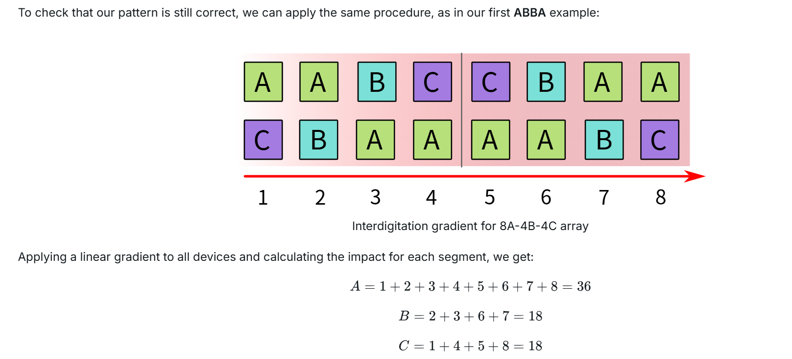


>[!WARNING]
>
>貌似finger必须是双数。为了源漏共用？
>
>[in interdigitised pattern all the transistors are in interleaved pattern like suppose there are two transistors with 2 fingers each](https://www.edaboard.com/threads/common-centroid-interdigitization.58378/)


##### Interdigitation Patterns


#### Common Centroid

- **Common Centroid** is more advanced matching technique, suitable for more complex analog structures, such as ==differential pairs==, BJT arrays in Bandgaps, R/C DAC array etc. 

- 相比idg在降低偏移电压和改善线性度方面更优，但需要更大面积和更复杂路由。

- Common-Centroid适合高精度应用（如低偏移要求）

- “共质心布局的缺点是显而易见的。这就需要==交叉连接器件==，增加了匹配器件之间的==分离==(area⬆️)，并且在线性工艺梯度不是主要限制的情况下可能会使匹配恶化。”

- 在匹配vs区域的情况下，赢家肯定是匹配。因此，当采用cc法时，面积是最不重要的。如果晶体管没有正确匹配，那么整个电路就会被搞砸。所以cc是一个福音。不可能总是用cc，但只要有可能，最好的办法就是用它。[Common Centroid & Interdigitization | Forum for Electronics](https://www.edaboard.com/threads/common-centroid-interdigitization.58378/)

- common centroid layout provides ==better matching== as in this method gradients are canceled in ==both X and Y direction==. Interdigitized method provides gradient cancellation in ==one direction only==.

- virtuoso的操作https://youtu.be/mca7NKcTlhU?list=PL0oLvNvFrW9xbe26NgdX-HsknCJ4ioGT7

- Commoncentroid (CC) is a special layout technique which has been shown to be beneficial in reducing first-order variations [6] [7] [8] [9]

  - 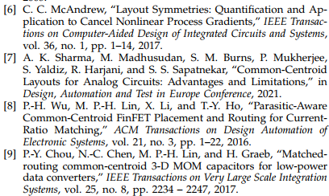

- Common-centroid (CC) layouts are widely used in analog design to make circuits resilient to variations by matching device characteristics. However, CC layout may involve increased routing complexity and higher parasitics than other alternative layout schemes. 

- Commoncentroid (CC) layouts have been shown to be better than other alternatives such as clustered and interdigitated patterns for mitigating process-induced linear variations [3]  and are widely used to match circuit elements [2], [4], [5], [6], [7]. 

  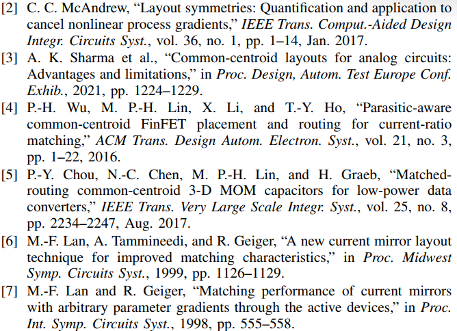

- square-like pattern offers the best matching performance [14] [11] --cite-->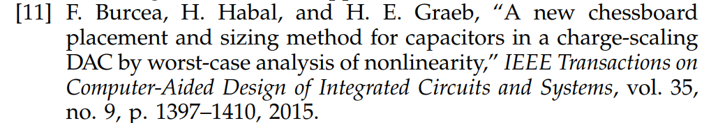

  > 并没有说方形会带来更好的性能

- One of the fundamental rules for CC layouts underscores the importance of achieving the maximum degree of dispersion [1]

  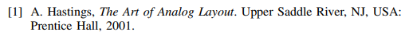

- It is important to note that CC layouts are generally not preferred for ==high-frequency== applications due to ==high parasitic effects==.

- 器件匹配得越好，连线往往越复杂

- 原理：

- 学术解释first-order process gradient

  --cite-->[DATE21-Common-Centroid Layouts for Analog Circuits: Advantages and Limitations]()

  

  


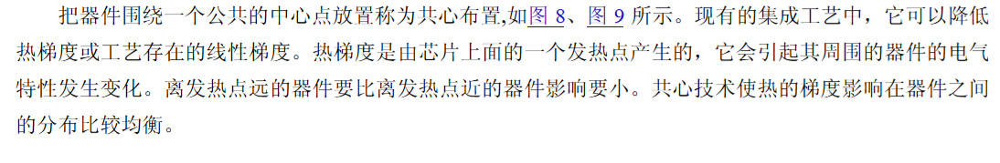


##### 2器件示例


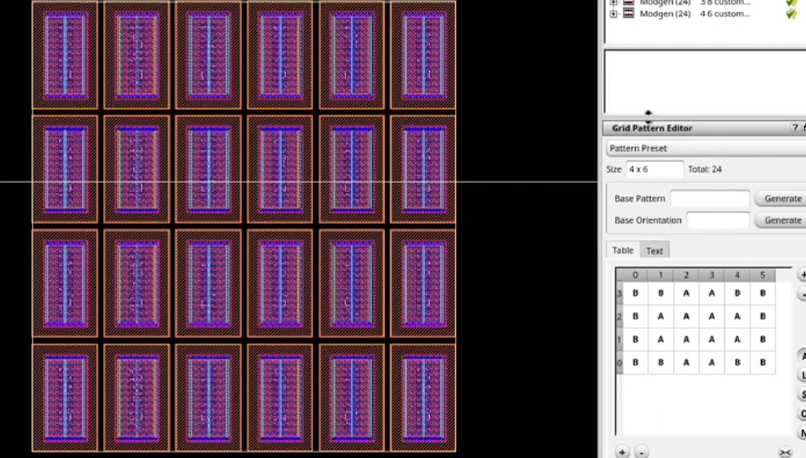


##### 3器件示例


##### 4器件示例


##### cc和idg可以混合

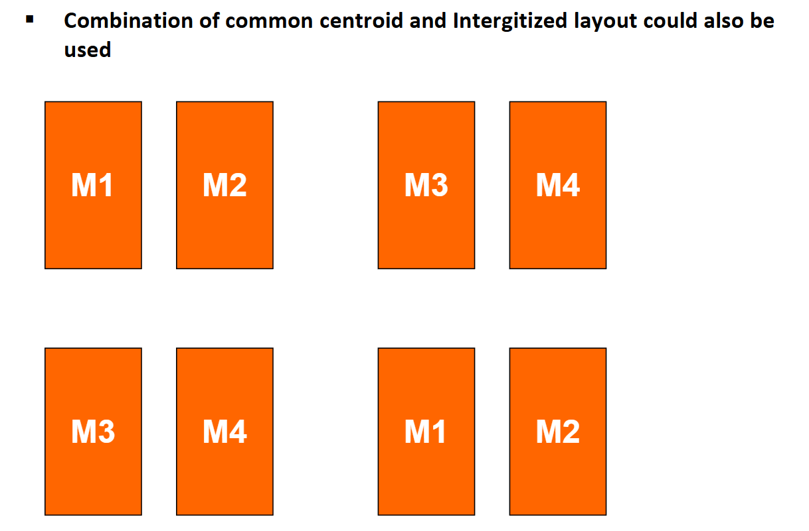

> [!WARNING]
>
> 感觉具体那种效果好很难说


##### 不相等/不规则的数量


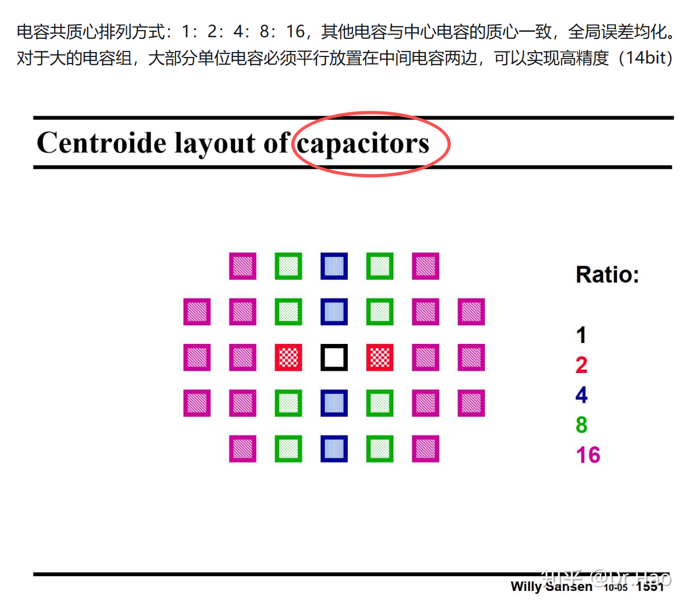


##### CC Patterns


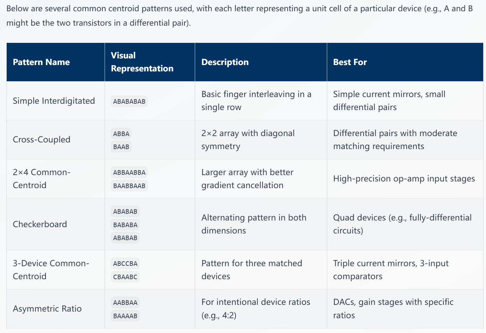


#### 电阻电容根器件法(Root Device Method)

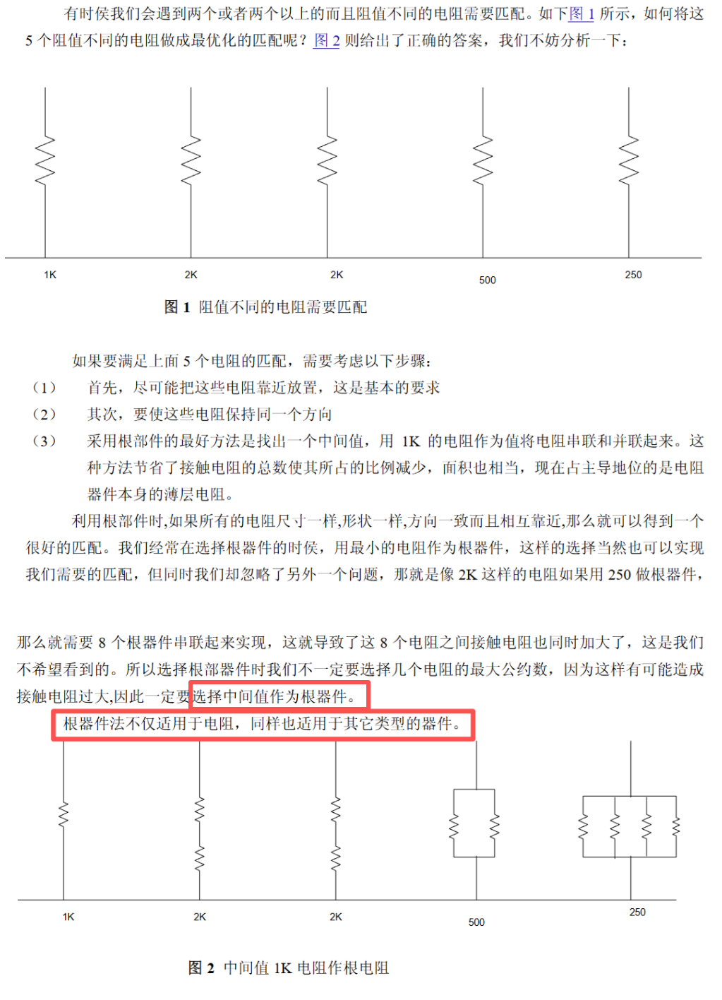

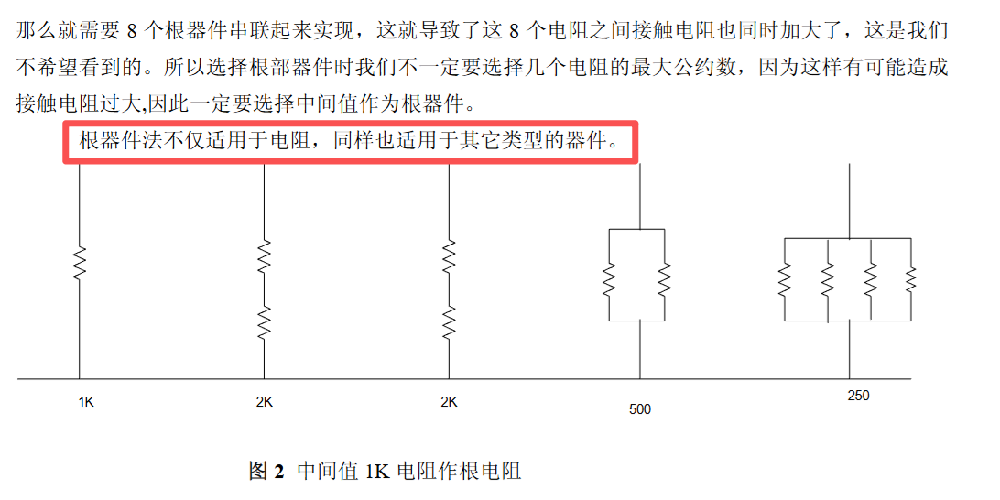


#### Dummy虚拟器件

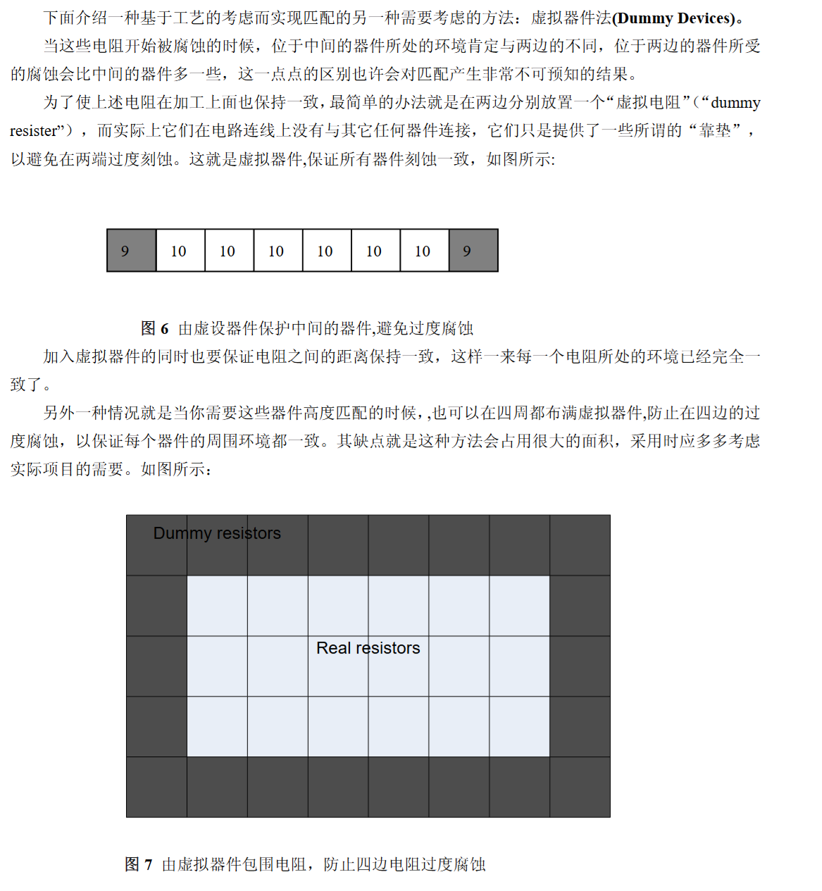


#### 考虑源漏共用

A layout that does not share diffusion region can lead to worse routing length and may degrade spatial variations due to increased layout area.

Diffusion sharing is a widely used concept in analog applications [19] . Sharing diffusion region not only reduces layout area and routing cost but also minimizes spatial variation [21]. However, fully sharing diffusion region without using dummies is not always possible in a CC type layout  

minimizing only the dummy count leads to inferior results --cite-->[Multiobjective Optimization for Common-Centroid Placement of Analog Transistors]()


一个很好的图表示：


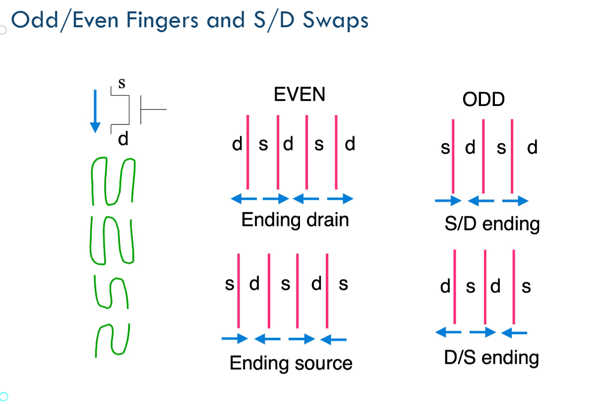


> m和nf用户定下了，我们应该改不了。这也约束了算法的通用性。


#### 参考

- [模拟电路版图设计中的匹配艺术](../Analog/模拟电路版图设计中的匹配艺术.pdf)
- [Matching patterns - AnalogHub](https://analoghub.ie/category/Layout/article/layoutMatchingPatterns)
- [Matching Technique in Analog Layout - Siliconvlsi](https://siliconvlsi.com/matching-technique-in-analog-layout/)
- [CMOS Inverter Layout (Cadence Layout XL)](https://www.youtube.com/watch?v=KzH6KV-a6BA)
- [Matching Technique in Analog Layout - Siliconvlsi](https://siliconvlsi.com/matching-technique-in-analog-layout/)
- [Analog Layout Guide – Nextra](https://neu-ucb-tvip.github.io/tvip-analog-workspace/Analog_Layout_Guide/#interdigitation-patterns)
- [people.engr.tamu.edu/spalermo/ecen474/Lab2.pdf](https://people.engr.tamu.edu/spalermo/ecen474/Lab2.pdf)
- 
- Thanks to hejing0901@primarius-tech.com


### routing

Route signals symmetrically to reduce IR drops and parasitic mismatches on either branch.

#### 过孔

纳米级技术中的通孔电阻同样显著，且较低金属层对单向布线的要求使得CC布局必须采用通孔数量较少的布线方案。--cite-->[Performance-Aware Common-Centroid Placement and Routing of Transistor Arrays in Analog Circuits]

#### 高频信号线

高频信号线走线采用高层金属走线，高层金属厚度大，寄生电阻小，寄生电容也小；高频信号线尽量走直线；避免平行走线，采用不同层金属走线，或者加大同层金属走线的间距以减小耦合和串扰

All the critical signals should be shielded with gnd or clean reference signal

For high speed signals, the shield line shouldn’t be put closer to the signal toavoid loading

#### 关键信号

关键信号要离PAD足够近，以减小走线寄生电容，直流信号的PAD由于考虑到漏压降的问题，走线越宽，有利于减小压降。

Use proper spacing between two signal


#### 电迁移


#### Tiling?

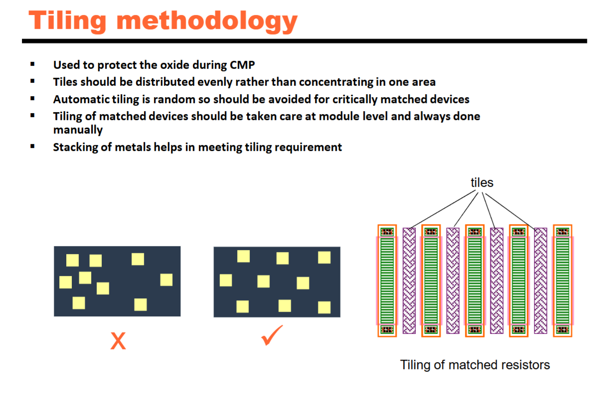


#### Antenna Effect


#### Latchup 


#### Power


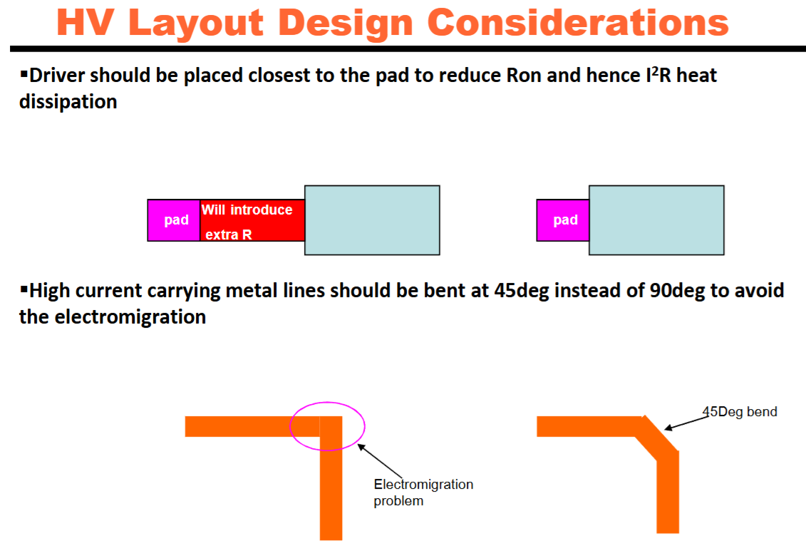


#### IR drop

IR drop **CANNOT BE IGNORED** in modern nodes, particularly when wide metal lines are not used for power/ground or high-current paths.

Always consider adding more metal width and multiple vias to keep IR drops minimal and symmetrical.


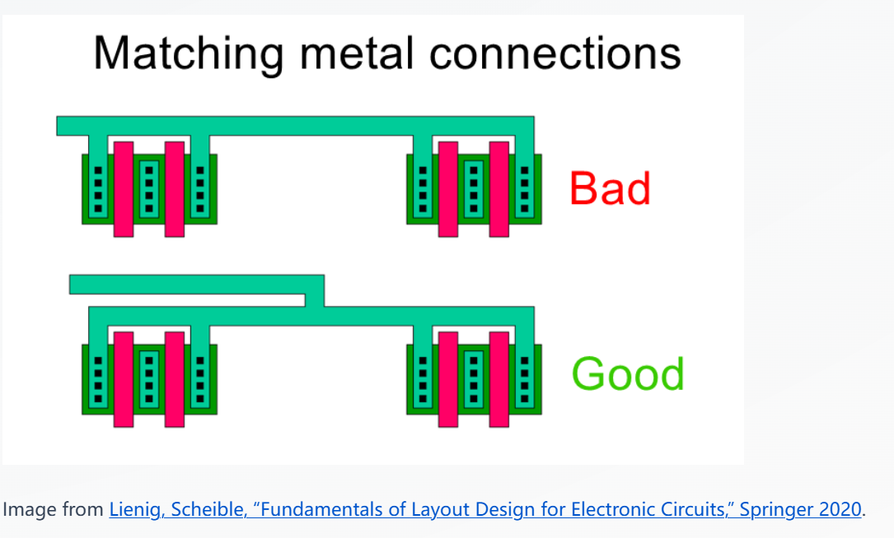

#### 参考

[eet.bme.hu/~bognar/rfic/Layout02.pdf](https://www.eet.bme.hu/~bognar/rfic/Layout02.pdf)

[ee.iitm.ac.in/vlsi/_media/courses/ee5325_2019/ee5325_lecture48_6nov2019.pdf](https://www.ee.iitm.ac.in/vlsi/_media/courses/ee5325_2019/ee5325_lecture48_6nov2019.pdf)


### 减小失配方法总结

#### overview

- Place transistor segments in the areas of low-stress gradients.
- Place transistors in ==close proximity==. Keep the layout of the transistors as ==compact== as possible
- Orient transistors in the same direction.
- Whenever possible use ==Common centroid== layouts.
- Place transistors well away from the ==power== devices.
- For current matching keep the overdrive voltage large.
- For voltage, matching keeps overdrive voltage smaller.
- 

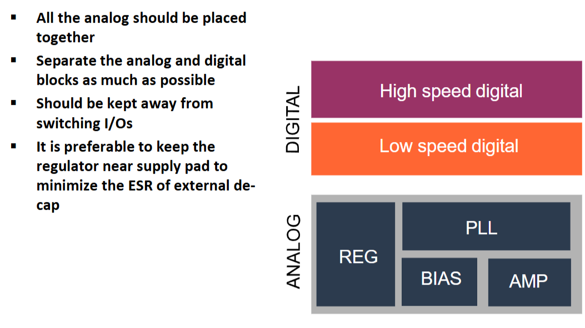


#### 增加尺寸

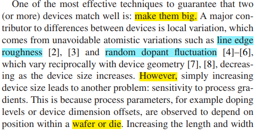


--cite-->[TCAD17](Layout Symmetries: Quantification and Application
to Cancel Nonlinear Process Gradients)


#### 远离噪声（相同距离）

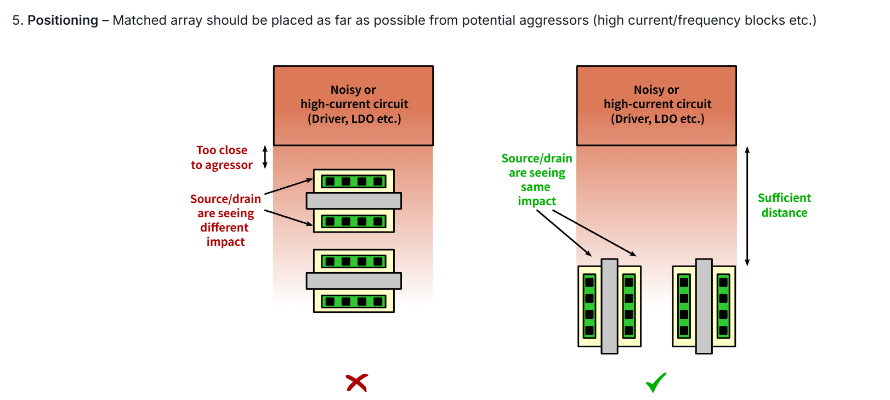

#### dummy


> [!CAUTION]
>
> 不过貌似正常都只是在两边放dummy，可能严格的才需要？

> [!WARNING]
>
> 工艺越先进越要二维的dummy


#### CC考虑二阶效应


--cite-->[TCAD17](Layout Symmetries: Quantification and Application
to Cancel Nonlinear Process Gradients)


### other

- 为了防止**闩锁效应**，电路版图设计的角度，NMOS和PMOS附近设置尽可能多的接触孔以减小寄生电阻，或者添加保护环；

- 要注意[天线效应](https://zhida.zhihu.com/search?content_id=220772738&content_type=Article&match_order=1&q=天线效应&zhida_source=entity)和[电迁移](https://zhida.zhihu.com/search?content_id=220772738&content_type=Article&match_order=1&q=电迁移&zhida_source=entity)，长的金属要不断进行跳线来减弱天线效应，在大电流的走线上，金属线宽要足够大，如果不够可以采用多层金属分流。

- 在模拟模块和数字模块之间要加隔离环以隔离噪声干扰。

- 无论怎么努力改进失配，Bipolar工艺比CMOS工艺的匹配性更好，原因如下：

  （1）Bipolar失调表达式中不包含阈值电压Vt的离散影响；

  （2）Bipolar的比例因子为kT/q，小于CMOS器件的Vov/2；

  （3）Bipolar失调电压随温度的漂移很容易控制，减小Vos的同时也会减小失调电压的温漂；
  
- 


### 参考

[Analog Layout Guide – Nextra](https://neu-ucb-tvip.github.io/tvip-analog-workspace/Analog_Layout_Guide/)


## 常见pattern版图

### overview

the **Interdigitation** is a ==less complex== method, and it would be sufficient for structures like small ==current mirrors== and ==biasing circuits==. Using this pattern will be **more area-efficient** and allows **simple routing**.

When we are talking about structures that require **maximum precision** - such as R/C DAC arrays, differential pairs - we have to use the **Common Centroid** to achieve the best performance. 

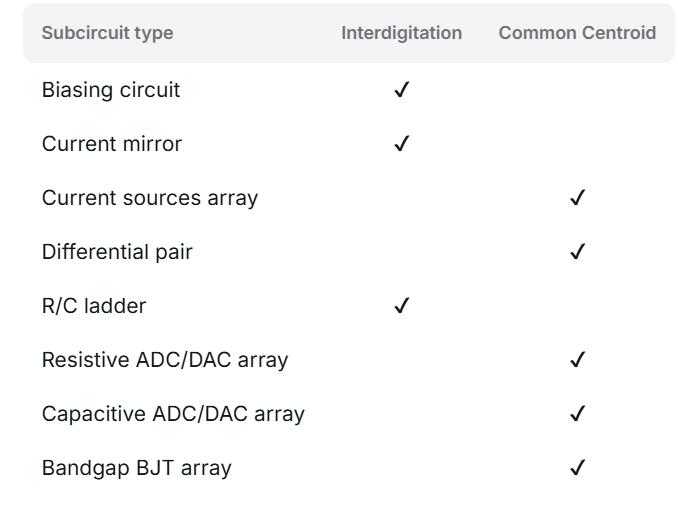

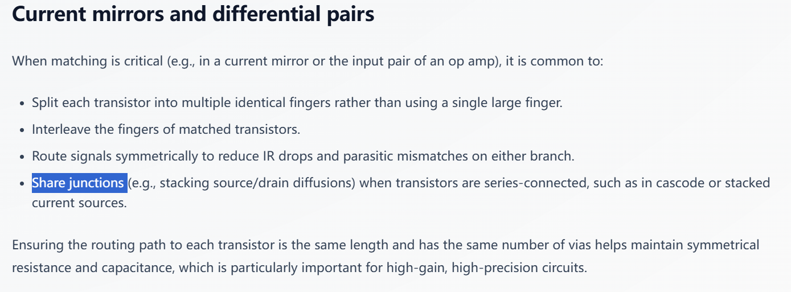

> 也不一定，我看也有挺多电流镜用CC的


-- cite-->[DATE21-Common-Centroid Layouts for Analog Circuits: Advantages and Limitations]()


-- cite-->[DATE24 Analog Transistor Placement Optimization Considering Nonlinear Spatial Variations]()

### 电流镜

#### 基本电流镜

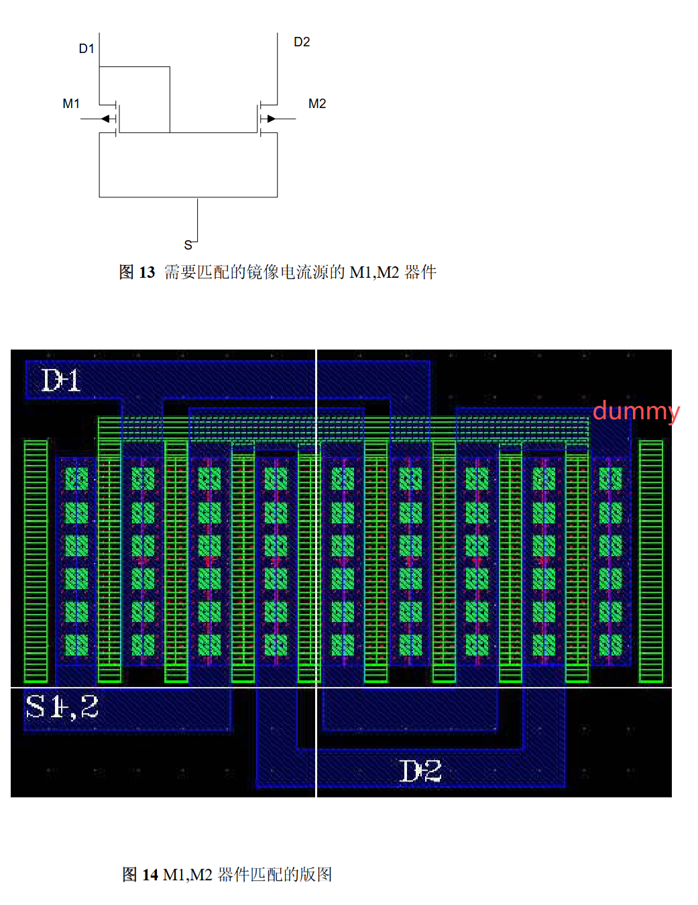


#### cascode电流镜

源漏共用

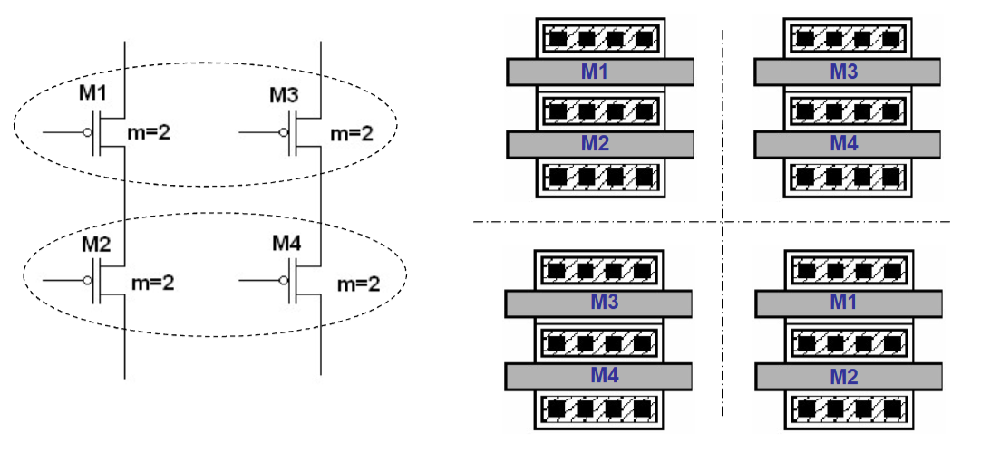

#### 共源共栅电流镜

[IC Layout版图实操重要知识-电流镜_电流镜版图匹配设计-CSDN博客](https://blog.csdn.net/qq_49315469/article/details/129650954)

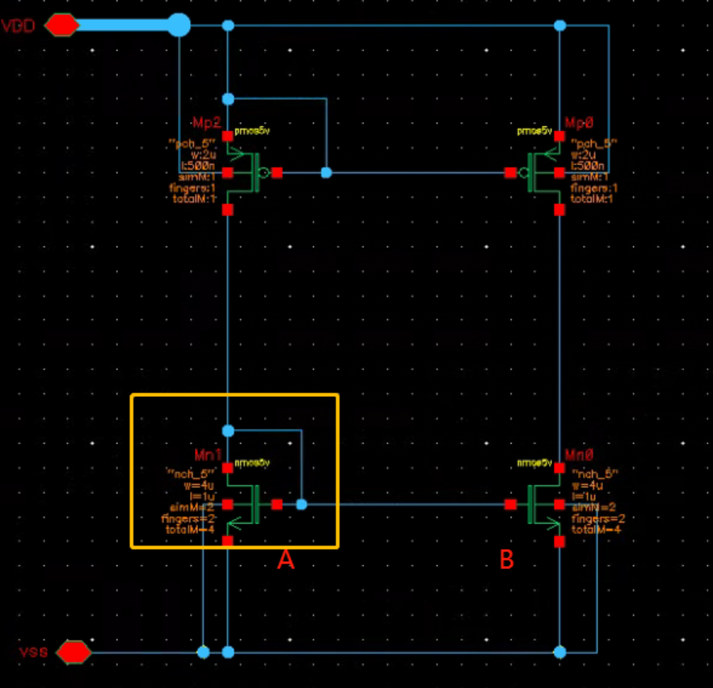

两种匹配方式，一种是B A A B，将器件摆放成一排然后两边加dummy，最后再围上P环


另外一种匹配方式是摆放成两排，交叉匹配，即第一排为dummy A B dummy，第二排为dummy B A dummy，然后再围上P环

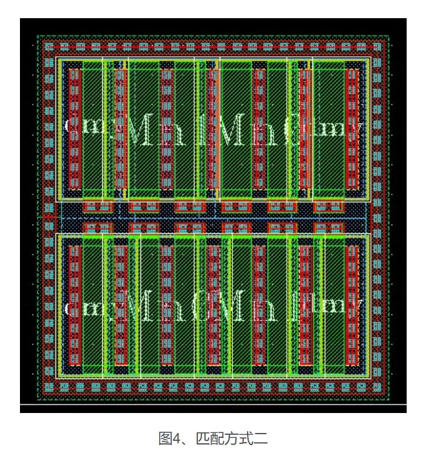


#### 多路输出电流镜

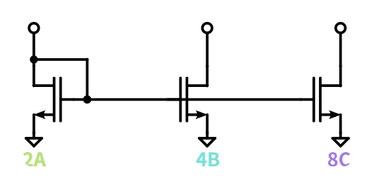


https://www.youtube.com/watch?list=PL0oLvNvFrW9xbe26NgdX-HsknCJ4ioGT7&v=mca7NKcTlhU&embeds_referring_euri=https%3A%2F%2Fanaloghub.ie%2F&source_ve_path=MjM4NTE


> [!WARNING]
>
> 相比idg，cc数量翻倍了？为了全部源漏共用，idg只能这么设计！注意每一个B-B或者C-C之间都是D端的，两边的都是共用的GND


>[!WARNING]
>
>M7飞哪去了？


### 差分对

- [版图匹配之差分电流镜_电流镜版图匹配设计-CSDN博客](https://blog.csdn.net/weixin_52567455/article/details/129659950)
  
  - 差分对必须采用双排的==共质心ABBA==形式。除非在不重要的cell，得到电路准许才可画一排。==必须加dummy==(一排，两排)
  
    > ！一定是一对的吗
  
  - 在m<4的情况下，s/D端不合并的画法匹配度比源漏合并的高一些。具体看长度差距分析，超过4个不建议用s、D不合并方法
  
  - 差分对的匹配需加dummy
  
  - 差分对一般采用ABBA、二维的匹配方式，较之AABB式的匹配具有中心对称，能够减小失配，更佳性能的优点，差分对中的ABBA匹配形式且merge的情况需要保证左右，上下都具备这种形式，且在一个方向上管子数量为4X(X > 1时),A可以等于aa，B=bb
  
    
  
  - 差分对的gate连线需要特别注意，非交叉位置相邻gate间的连线不要出现多层金属叠层连通的情况，且最好用m2连接，所有gate上面的金属孔要一致
  
    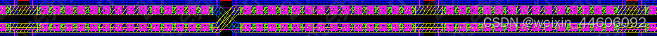
  
  - 差分的gate与源漏的线分别出在两边，gate必须加屏蔽线
  
  - 差分对上面不允许跨其他线，自身源漏线也尽量不要跨，有线道的情况下要留出源漏线的走线位置，且最好有屏蔽，加屏蔽时头的地方要每层金属都包住
  
  
  
  
  
- 

[【Analog Layout Considerations】布局中的匹配与对称性技术_Importance of Symmetry in Analog Layout - CSDN文库](https://wenku.csdn.net/column/658wg015qj)

[电路设计：差分对原理与版图绘制关键-CSDN博客](https://blog.csdn.net/weixin_44606092/article/details/134468049)


### cap


### 其他

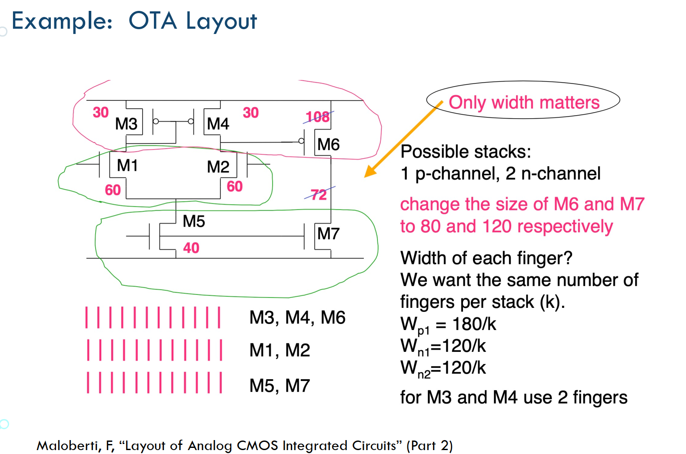

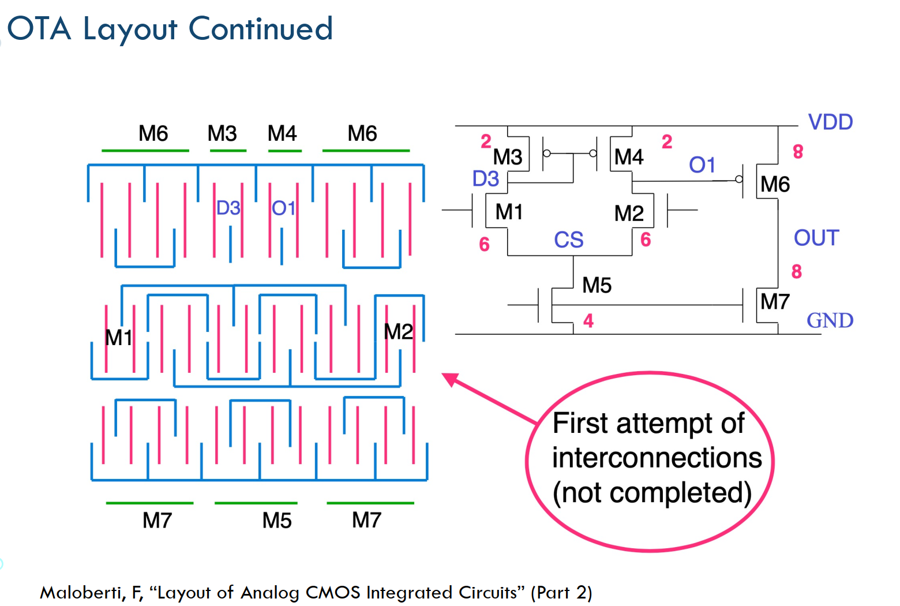


# placement 算法

## 三种布局范式

- 结合数字 APR 综合的

  - 仍然缺乏普遍适用性  

- Procedural

  - 程序性布局生成器在开发参数化单元以及整合用于编码器件放置和布线的脚本方面仍然需要大量的人工劳动。尽管如此，这些方法在将设计迁移到不同技术节点时已显著减少了人工工作量。

- 基于优化的

  - 基于优化的布局综合的典型流程将布局考虑因素表述为用户定义的参数或约束


## GA

Kubalík et al. (2019) and Kubalík et al. (2023)   FLP   


## Simulated Annealing

Historically, most analog placement methods were based on simulated annealing and focused on handling geometrical constraints such as symmetry that are specific to analog ICs [DATE22[4]–[8]]()

### 优点

- flexibility in incorporating different types of cost functions  

### 缺点

- not a fast algorithm in general
  - its runtime speed is acceptable for analog IC designs, which typically have much less elements than digital circuits. 
- the approach cannot guarantee good performance for large-scale analog netlists  
- cannot utilize past or external knowledge to enhance exploration of the solution space, as each problem instance is optimized anew.

### 相关论文

- 

- 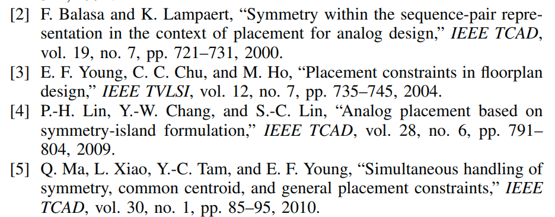

- 

- Cohn, J., Garrod, D., et al. (1991). KOAN/ANAGRAM II: new tools for device-level analog placement and routing. IEEE Journal of Solid-State Circuits, 26(3): 330–342

- Martins, R., Lourenc¸o, N., and Horta, N. (2015). Multiobjective optimization of analog integrated circuit placement hierarchy in absolute coordinates. 

  Expert Systems with Applications, 42(23): 9137–9151.
  
- 

  


## LP

Analytical Approaches  

### NLP

non-linear programming (NLP)  

absolute representation, where each element is described by its actual coordinates. While this approach makes it ==easy to describe the majority of the constraints==, it can produce ==infeasible solutions== due to the overlapping of design elements. which initially determine the ==global placement== using `Nonlinear Programming` and then produce feasible placement using `Linear Programming (LP)` or other methods. (类似 SA)

For conventional performanceoblivious analog placement, analytical techniques are ==55×== faster than `simulated annealing`. However, not all analytical techniques can reduce area and wirelength compared to simulated annealing. 

cannot utilize past or external knowledge to enhance exploration of the solution space, as each problem instance is optimized anew.

- [ICCAD20: 29, 40]  

  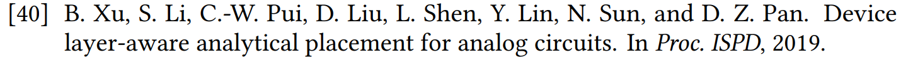

- in theory has advantages in scalability. However, NLP needs to relax the constraints and therefore requires extra post-processing step to legalize the results.

- the constraint relaxation and the ==extra legalization step== restrict its potential to handle various constraints simultaneously. 

- Xu et al. (2017)  

- (Mirhoseini et al., 2021)   

- Chen, T.-C., Jiang, Z.-W., et al. (2008). NTUplace3

- Xu, B., Li, S., et al. (2019a). Device layer-aware analytical placement for analog circuits. 

- Lin, Y., Li, Y., et al. (2022). Are analytical techniques worthwhile for analog IC placement?

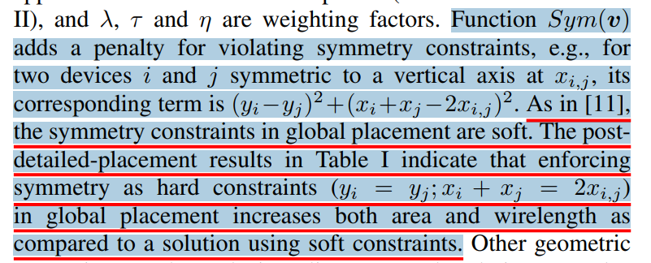


### ILP

- 相关论文：
  - ROC24: Automated placement of analog integrated circuits using priority-based constructive heuristic
  - Grus et al. (2023)  
  - Xu, B., Li, S., et al. (2017). Hierarchical and analytical placement techniques for high-performance analog circuits.  
- It is important to mention that although ILP does not scale well for large problems, the problem sizes of analog circuits are generally small, making an ILP solution tractable
- Since our layout system is built on discrete grids, integer solutions are preferred. 

### MILP

mixed-integer-programming (MILP)  

- [ICCAD20: 39, 41]  
- B. Xu et al., “Hierarchical and analytical placement techniques for highperformance analog circuits,” in Proc. ISPD, 2017, pp. 55–62  
- MILP is limited to linear objective and constraints and its scalability is concerned. 
- it suffers from poor scalability for large-scale circuits.


## combinatorial optimization  

相关论文：

- ROC24: Automated placement of analog integrated circuits using priority-based constructive heuristic
- pocket: additional free space around the devices  


## SMT formulation

- 特点：

  - The flexible syntax of SMT enables efficient problem modeling and various constraint support. 
  - SMT formulas supports richer modeling expressions (e.g., if-then-else, either-or, Boolean cardinality), thus amenable for efficient, versatile formulations for placement instances

- 介绍：

  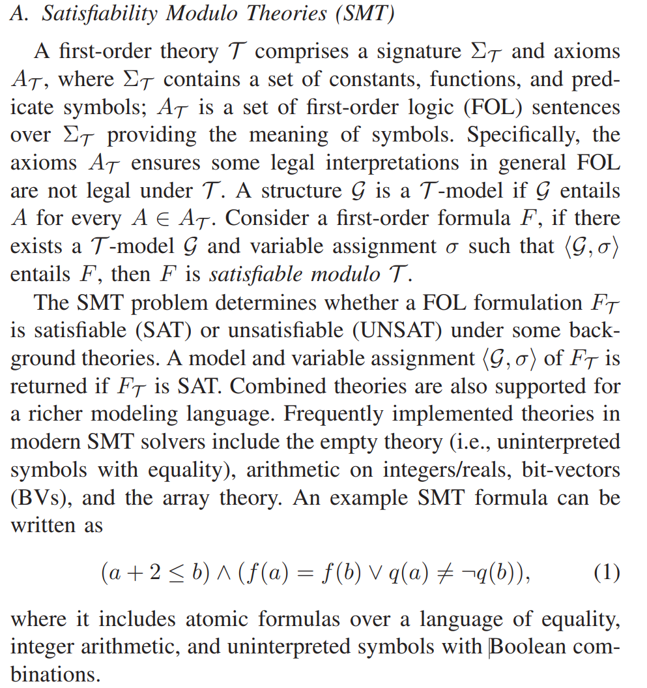

- 相关论文：

  - S. M. Saif et al. , “Pareto front analog layout placement using satisfiability modulo theories,” in Proc. DATE, 2016, pp. 1411–1416.
  - DATE22:  Routability-Aware Placement for Advanced FinFET Mixed-Signal Circuits using Satisfiability Modulo Theories
  - Used in Lin et al. (2009), Dayasagar and Sudhakar (2023) and Shanthi et al. (2022),


## B*-tree/O-tree 

- 一般和启发式方法配合
- deterministic
- 相关论文
  - P.-Y. Chou, H.-C. Ou, and Y.-W. Chang, “Heterogeneous `b*-trees` for analog placement with symmetry and regularity considerations,” in Proc. ICCAD. IEEE, ==2011==, pp. 512–516.
  - Y. Pang, F. Balasa, K. Lampaert, and C.-K. Cheng, “Block placement with symmetry constraints based on the `o-tree` non-slicing representation,” in Proc. DAC, ==2000==, pp. 464–467
  - 


## sequence pairs  

一般和启发式方法配合

topological representation, which determines the relative positions between devices. 

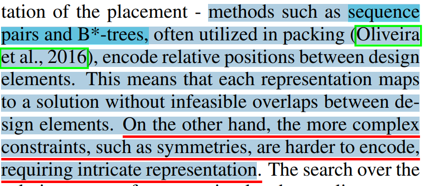

相关论文

- 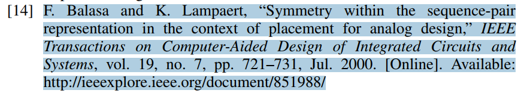
- 

## Forced-directed approach 

Spindler, P., Schlichtmann, U., and Johannes, F. M. (2008). Kraftwerk2—A fast force-directed quadratic placement approach using an accurate net model.


- 相关论文：

  - originally proposed in Murata et al. (1996). It utilizes two permutations of devices, which encode the placement. Authors of Balasa and Lampaert (1999) extend this representation to handle crucial features such as symmetry groups. The sequence pair representation was further extended to handle general constraints such as abutment (two devices are placed exactly next to each other) in 

  - Ma et al. (2011), and this work finally became the core of the placer of the open-source tool ==ALIGN== (Dhar et al., 2021).
  
  - Oliveira, J. F., Junior, A. N., et al. (2016). A survey on ´heuristics for the two-dimensional rectangular strip `packing problem`. Pesquisa Operacional, 36:197–226.


# 数据集

### MAGICAL

- 
- 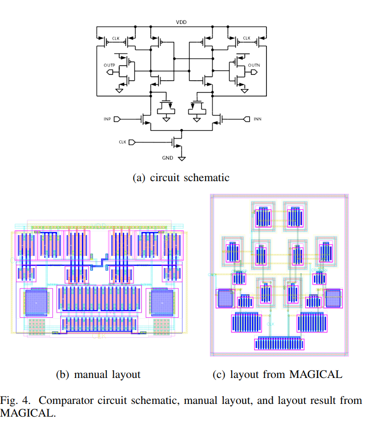
- 

### ALIGN

consisting of 1390 OTA circuits, including bias networks


### MCNC

  

### GSRC

  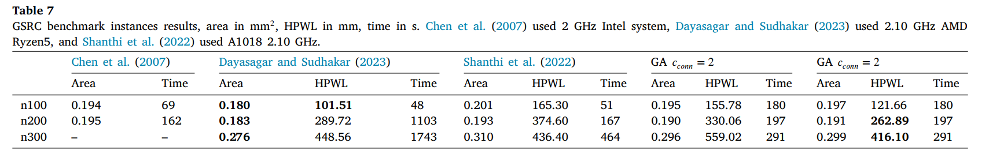


### AMSnet

[AMSnet 2.0: A Large AMS Database with AI Segmentation for Net Detection](https://amsnet2-0.github.io/AMSNet2.0.github.io/)

### AICircuit

aiccircuit 是一个全面的多层次数据集和基准，用于开发和评估模拟和射频电路设计中的 ML 算法。aiccircuit 包括七个常用的基本电路和两个由多个电路块组成的复杂无线收发器系统，涵盖了实际应用中遇到的各种设计场景。我们广泛评估了数据集上的各种 ML 算法，揭示了 ML 算法在学习从设计规范到所需电路参数的映射方面的潜力。


# 综述

### -routing-IEEE Access-2023-Analog Integrated Circuit Routing Techniques: An Extensive Review---

#### Background

- as A/RF design moved into ==advanced integration technology nodes==, the increasing number of design rules/constraints, wire resistance, congestion, and interwire parasitic growth is constantly challenging existing automatic routing techniques and keeping pressure on their improvement.  average number of layout design rules contained in process design kits (PDKs) has escalated from below 1000 rules in 180/130-nanometer nodes to more than 10 times in 22-nanometer and below [5]

- In the analog domain, it is widely acknowledged that circuits/systems’ performance is critically dependent on the ==parasitic== structures induced by the layout. Thus, analog routing has historically been a handcrafting process, requiring a different level of attention and detail than its digital counterpart

- designers are usually ==skeptical== about the success/reliability of other routing tools with a higher level of automation, as they usually involve non-systematic/stochastic processes

- PiS & LaS flow

  

- Language: BALLISTIC [21], MSL [22]

- procedural routing generators (PRGs)  method:

  

- template-based routing generators (TbRGs)  

  They are particularly useful when a validated previously designed layout, i.e., a legacy layout, has to be migrated to other(s) close/similar technology node(s) or changes in the design are needed.

  

- sequential path-finding generators (SPfGs).  

  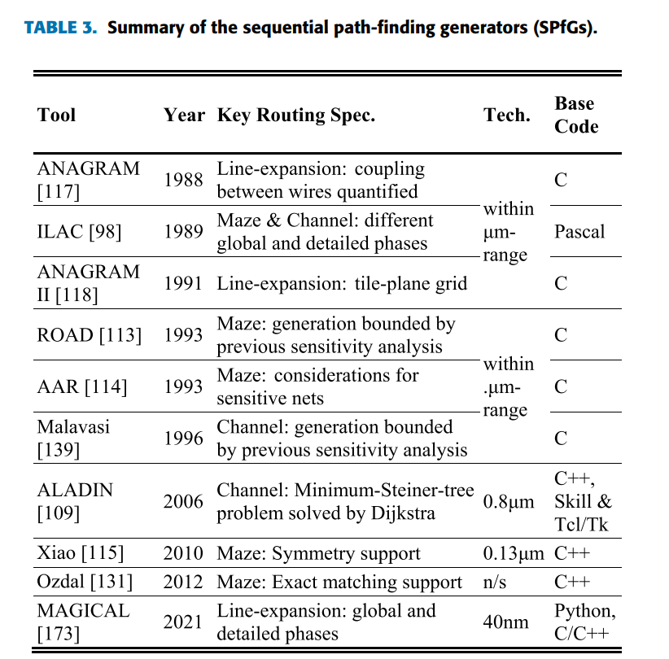

- 模拟布线中研究最广泛的两种非理想现象是电迁移和 IR 压降。电迁移指的是在高电流密度作用下，电源网络和信号线中的材料迁移； IR 压降则是由于互连线电阻导致的网络电压波动，会影响电路性能。这些非理想现象最终可以通过使用具有 ==可变线宽的布线算法== 来缓解

- integer linear programming (ILP) and evolutionary routing generators

  同时处理所有网络  

  

- ML

  

- ARouter Timeline

  

  

  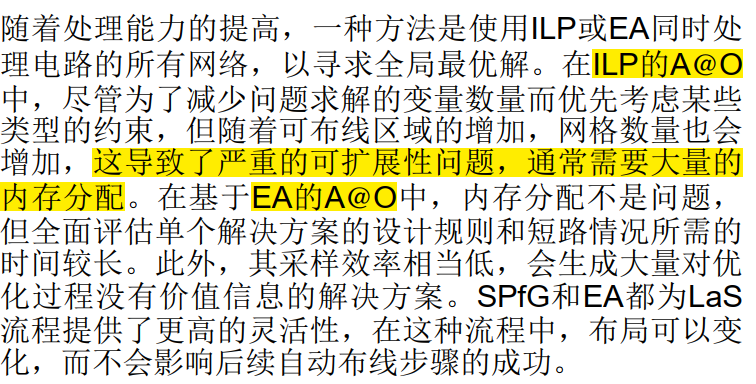


### --ASP DAC-2024-Performance Driven Analog Layout Automation: Current Status and Future Directions--CUHK Bei Yu

#### Background

- Conventionally, research in academic analog place-and-route (PNR) algorithms often targets the optimization of proxy objectives, such as wire length and area [1].  Such an approach fails to reveal the

  capability of the automation algorithms for important metrics such as performance and manufacturability.

- template-based methods

  - utilize user-defined layout patterns or floorplans to implement the layout
  - BAG [2] and LAYGO [3], [4]  

- a general and effective approach to considering post-layout circuit performance remains an open question.

- Analog circuit performance is highly sensitive to layout intricacies and can be adversely affected by layout parasitics, coupling, and noise

- Manual design often relies on experience, design expertise, and trial-and-error to search for a satisfactory layout.

- Symmetry constraints have played a crucial role in analog layout design

- 


### Challenges and opportunities toward fully automated analog layout design-JoS20-DZP


  # Placement

  Routability-aware placement for advanced finfet mixed-signal circuits using satisfiability modulo theories

  

  ## Placer-stochastic

  SA/

  ### [TCAD10-SA-EFYY]()

  - 

  

  ## Placer-analytical   

  ### [-system signal flow-ICCAD20--UTA]()

  - [OpenSource!](https://github.com/krzhu/IdeaPlaceEx)
  - non-linear programming-based (`NLP`) `global placement` 
  - linear-programming-based (`LP`) legalization, minimizing the ==area and wirelength==.  
  - we spread the modules considering the placement objectives and the constraint penalties using `gradient descent-based optimization`. 
  - 

  

  #### background

  - However, the `hyper-edge net models` often underestimate the importance of the ==directions of signals==

  - problem1: 需要的是关键信号线的线短些

    

    

  - privious work: 

    

  - current flow-related constraints: the direct current from the ==supply (VDD) to the sink (VSS)== is constrained to be monotonic in one direction

    - [28, 31, 36, 37]  
    - such constraints are not easy to be extended to general ==signals and system-level circuits.==  

    

  

  

  #### contribution

  - NLP-based global placement 

    leveraging the prior knowledge of ==power/ground== routing in analog layouts  

  - a holistic method to update the parameters and multipliers

  

  

  #### flow

  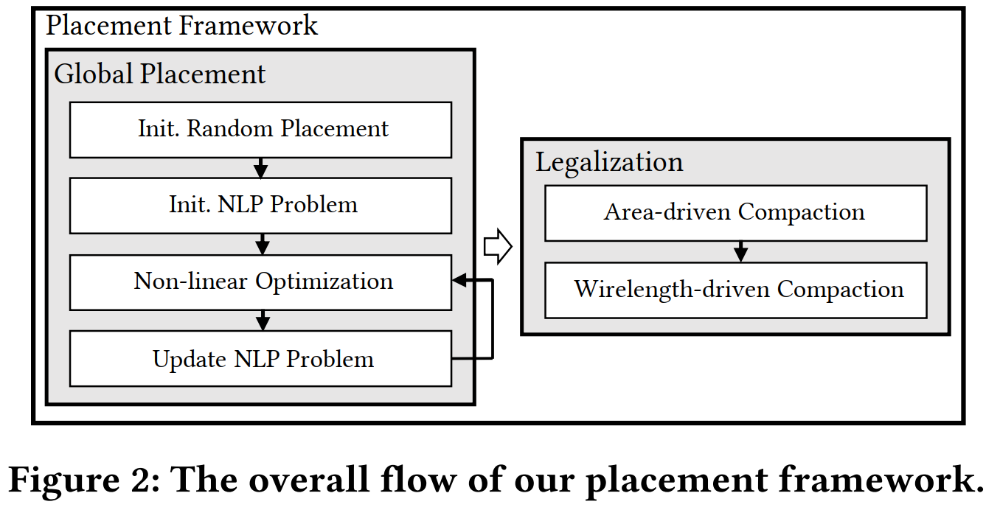

  

  

  #### model

  ##### NLP for GP:

  - 目标和约束

    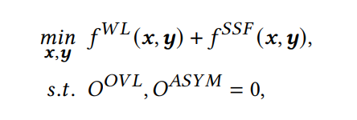

  - overlap 计算

    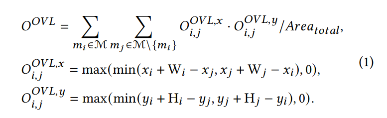

  - 对称计算

    

    > [!TIP]
    >
    > 这里只写了一个方向的

  - 更详细的目标：

    

    - SSF

      

    - SWL

      HPWL+log-sum-exponential (LSE)  

      

    - PWL

      (PG) nets are often routed in a different approach from the signals

      the pins of PG nets are more likely to be individually connected to the current supply/sink

      for the PG nets 

      - pins are considered separately instead of being modeled as in a net-wise ==hyper-edge==
      - only the ==vertical distance== to the current supply/sink is considered.

      

    - CRF

      - `𝛾𝐶𝑅𝐹`  is a parameter to control the smoothness and accuracy of the LSE approximation

    - OVL

      - smoothed version of Equation 1  

    - ASYM

      - The asymmetry penalty is the smoothed version of Equation 2   

      

  ##### ADAM optimizer  

  ##### 𝝀 settings  

  ##### 𝜸 settings

  

  ##### Legalization  

  - based on the plane sweep line algorithm from [9]  
  - 
  - 

  #### experiment

  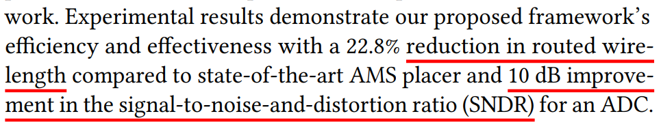

  - used detailed router [5]  
  - We achieve 34%, 23%, and 10% reductions in area, routed wirelength and number of VIAs over [40]
  - 
  - 
  - 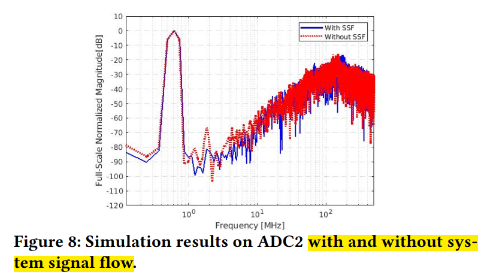
  - 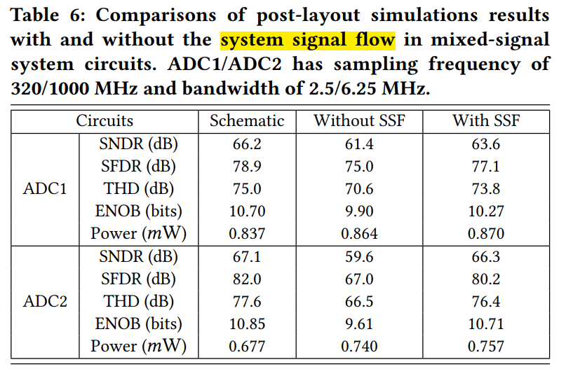
  - 

  

  #### 

  ### [-GAN+Well Generation-ASPDAC22-GAN-UTA]()

  - analytical well-aware non-linear programming-based analog placer

  - formulate the `well proximity effect (WPE)` handling as constraints and solve them in our placement engine.

  - uses a `generative adversarial network (GAN)` for generating wells and guides the placement process

  - optimizes for area and wirelength.

  - 前置工作：

    - `WellGAN`: Generative-adversarial-network-guided well generation for analog/mixed-signal circuit layout. `WellGAN`  generates the wells after the placement which might be ==sub-optimal==
    - `NLP` Placer 类似 [ICCAD20 SSF]() 那篇

  - to reduce area and half-perimeter wirelength  

  - problem formulation

    

    

  - 

  #### background

  - what is well:

    

  - automatic layout frameworks often use individual wells for each PMOS, e.g., ALIGN [3] and MAGICAL [4], [5].

  

  #### contribution

  - propose a new well-aware placement methodology  
  - consider wells as fence region constraints  
  - formulate WPE as minimum device-well-edge distance constraints and propose an efficient well legalization algorithm.

  

  #### flow

  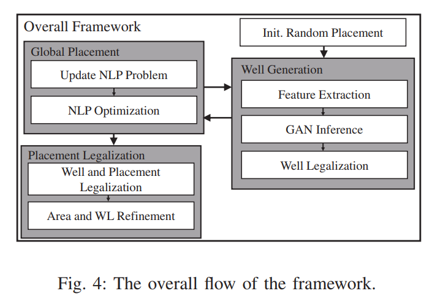

  

  

  #### model

  ##### GAN

  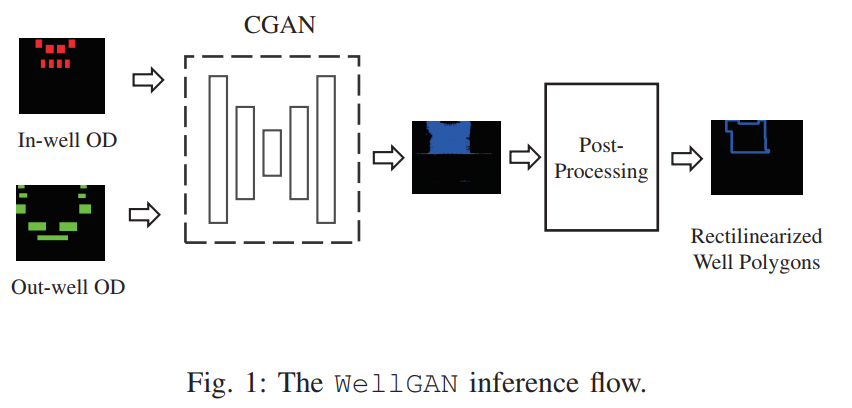

  

  ##### WPE

  

  

  ##### NLP Placer

  - NLP 目标：

    

  - 

  

  #### data

  from `WellGAN`：(OTA) with different architectures (OTA1, OTA2, OTA3, and OTA4), two comparators with the same topology but with different sizing (COMP1 and COMP2), a bootstrap switch (BOOTSTRAP), and a resistor digital-to-analog converter unit (RDAC). 

  

  #### experiment

  baseline:

  - The first baseline uses individual wells, denoted as “individual wells”
  - second baseline is to generate wells after placement using GANbased well generation, denoted as “WellGAN after placements”.  

  ##### single well type

  

  ##### multi-well type

  

  

  

  

  ##### WPE effect

  

  ### ePlace A-NLP+GNN-DATE22-Are Analytical Techniques Worthwhile for Analog IC Placement-TAU

  - GNN
  - Device Flipping  
  - [privious work](): J. Lu et al., “ePlace-MS: Electrostatics-based placement for mixed-size circuits,”  IEEE TCAD, vol. 34, no. 5, pp. 685–698, 2015
  - results indicate that not every analytical technique is superior to simulated annealing in solution quality.
  - it is widely recognized that analog circuit performance can be seriously affected by the quality of placement [18], [19], most existing placement techniques are unable to directly optimize performance. 

  #### background

  

  #### contribution

  - 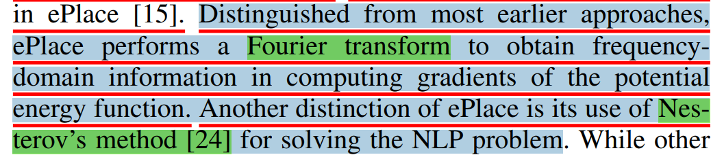
  - 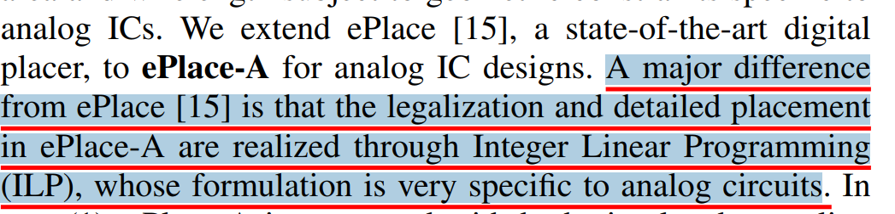

  

  

  #### flow

  - `global placement` based on `NLP` and a stage of `legalization and detailed placement`. 

  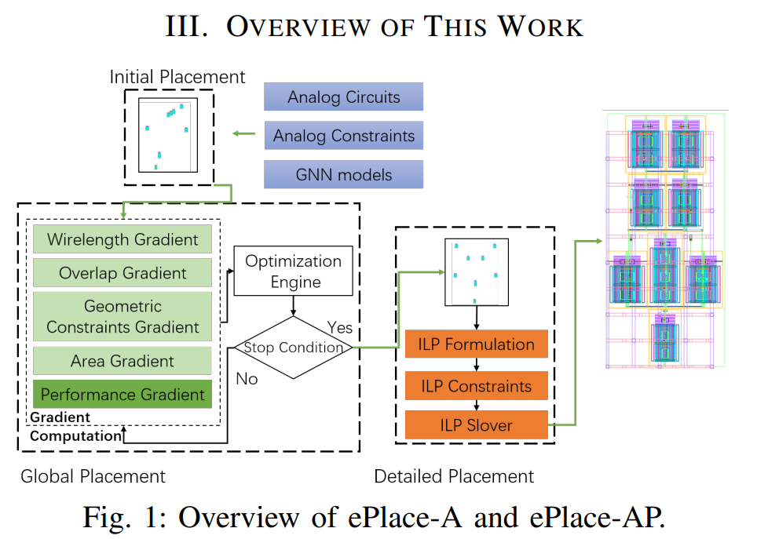

  

  #### model

  ##### GP: NLP

  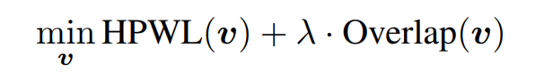

  

  

  

  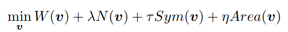

  ##### Legalization and Detailed Placement：ILP

  - device flipping  
  - 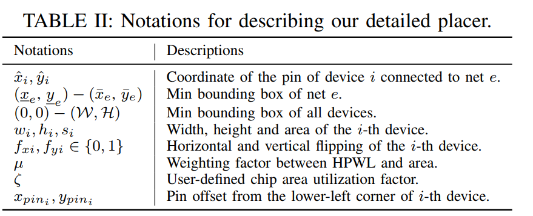
  - 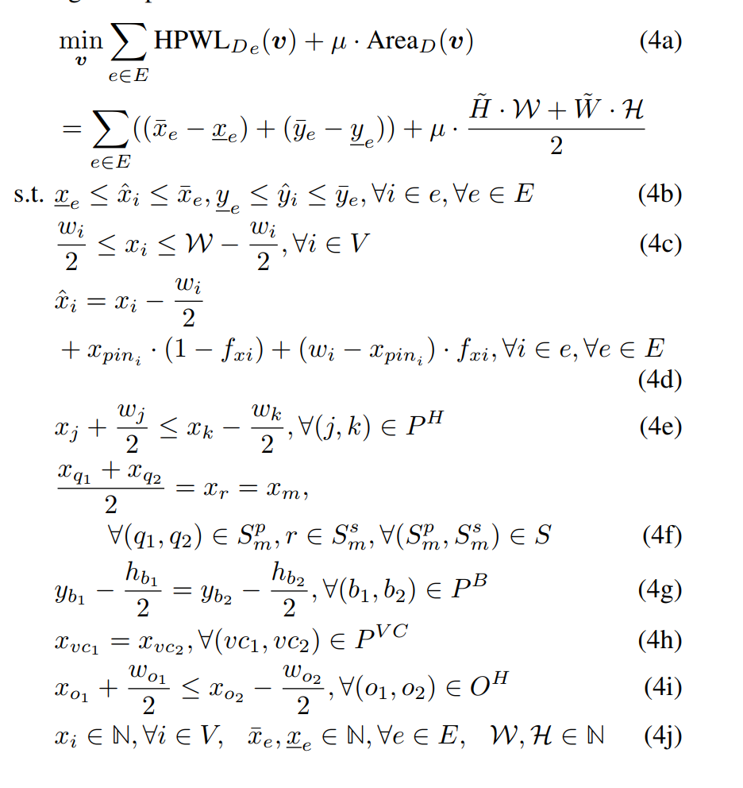

  

  #### data

  The testcases include three Operational Transconductance Amplifier (OTA) designs, two comparator designs, two Voltage Controlled Oscillator (VCO) designs, an analog adder, a Variable Gain Amplifier (VGA) and an Switched Capacitor Filter (SCF). 

  GF12nm PDK  

  #### experiment

  

  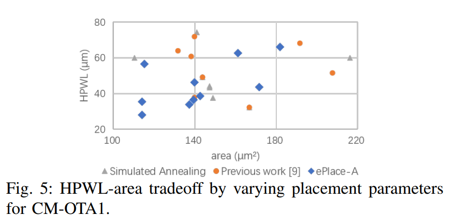

  

  

  

  ### [-ILP+COR24Pre- ICORES23--STM]()

  - Our proposed ILP solution derives its core ideas from approaches used for general `rectangle packing problem` (Korf et al., 2010; Berger et al., 2009). 
  - [FLP 问题](https://blog.csdn.net/JESSIENOTCAR/article/details/134990427)
  - BCD 工艺

  

  #### background

  

  

  #### contribution

  - ILP formulation of the placement problem.  
  - Method based on `force-directed graph drawing (FDGD)` for finding partial initial solution used as a warm start to ILP model, which significantly improves the performance of the utilized `Gurobi` (Gurobi Optimization, LLC, 2021) solver.

  

  #### model

  ##### constraintion

  

  ###### block

  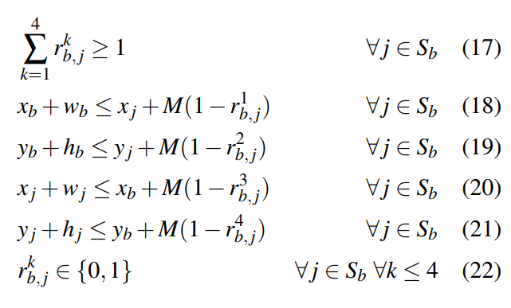

  ###### Aspect Ratio  

  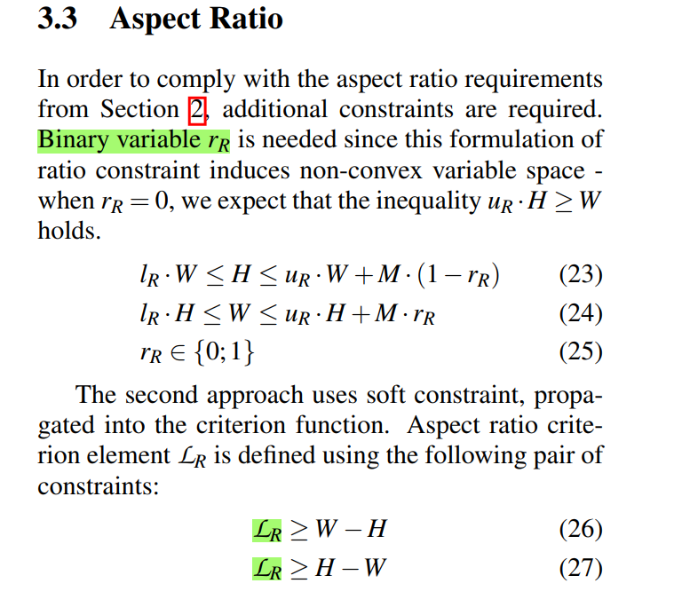

  ##### FDGD 

  背景：

  

  一个继续改进的点：a number of decision variables grows quadratically with an increasing number of independent rectangles to be placed.

  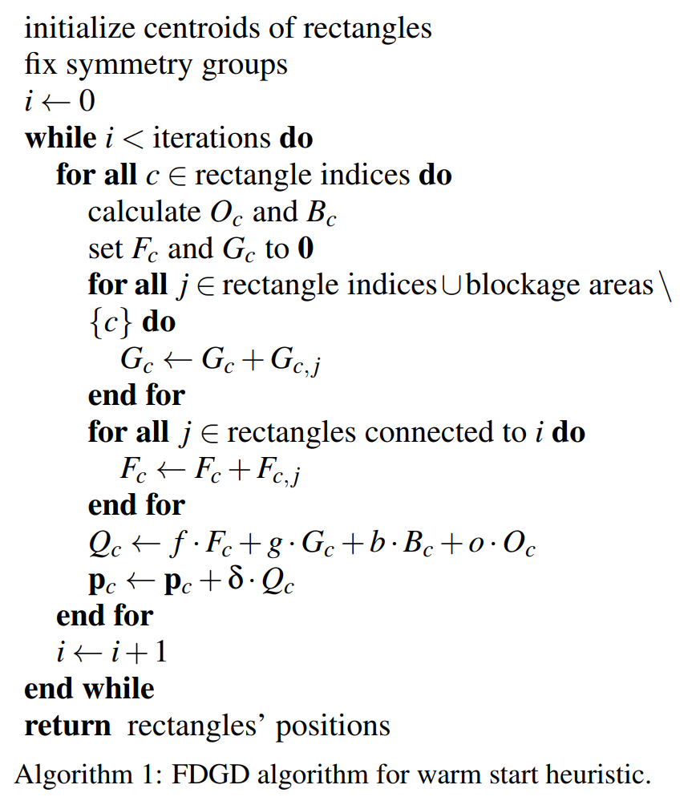

  #### data

  

  #### experiment

  - Gurobi ILP solver v9.1.2  
  - four threads 

  

  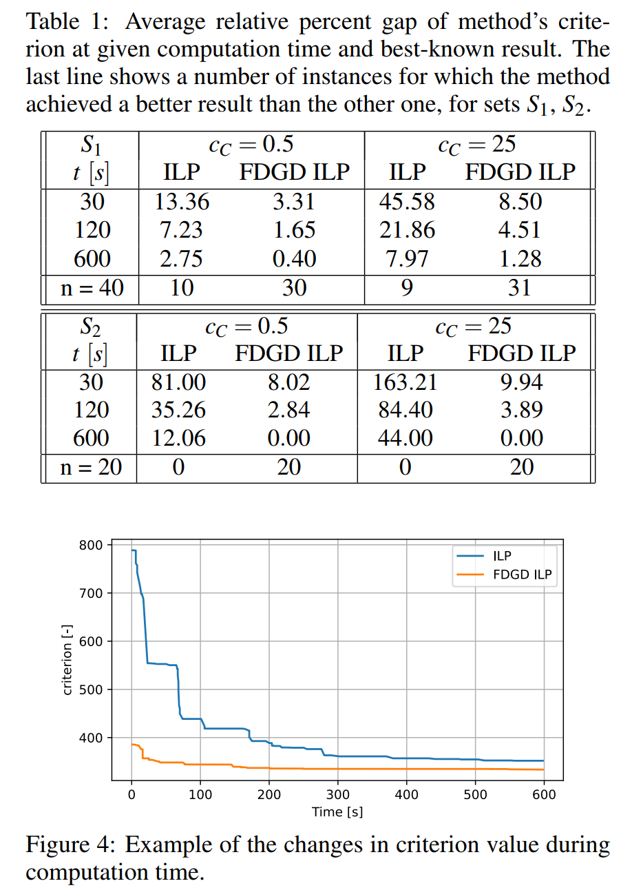

  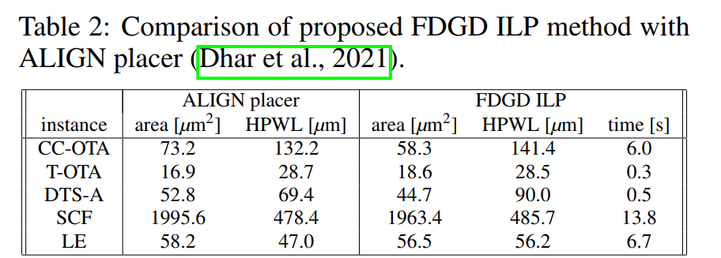

  

  > [!TIP]
  >
  > 都比手工的差 

  ### [-Priority-based+associated constraints -COR24-CO+heuristic+RL-]()

  - build on our previous conference papers (Grus et al., 2023; Grus and Hanzálek , 2024), and FLP (Kubalík et al., 2019).
  - Method based on `force-directed graph drawing (FDGD)` for finding partial initial solution used as a warm start to ILP model, which significantly improves the performance of the utilized `Gurobi` solver

  #### background

  - 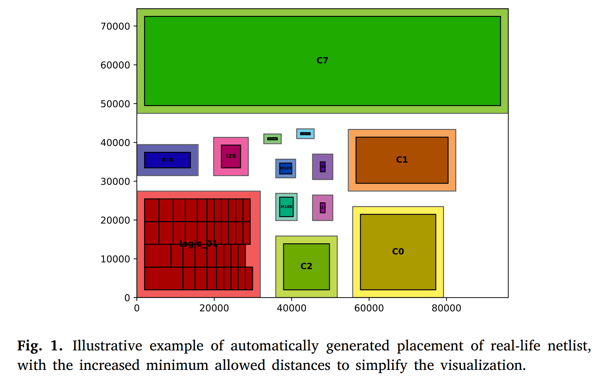

  

  #### contribution

  - associated constraints  
  - Priority-based constructive heuristic inspired by Kubalík et al. (2019) maps each indirect representation to a feasible placement

  #### flow

  

  #### model

  ##### constraints  

  

  

  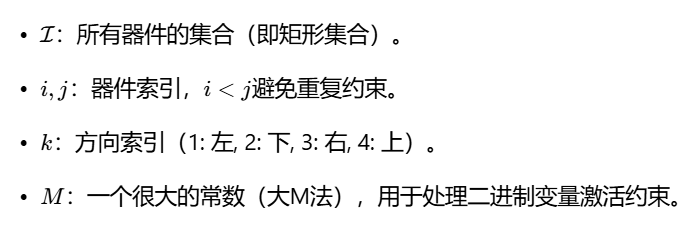

  

  

  

  

  

  

  ###### 对称约束

  注意一个 G 只有一个 x~G~

  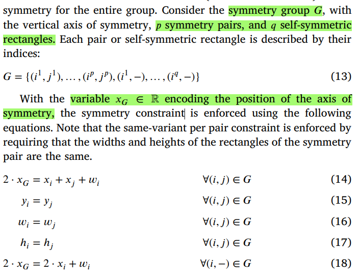

  

  

  

  

  

  ###### 版图形状

  

  ###### 宽高比

  

  ###### **面积近似**

  

  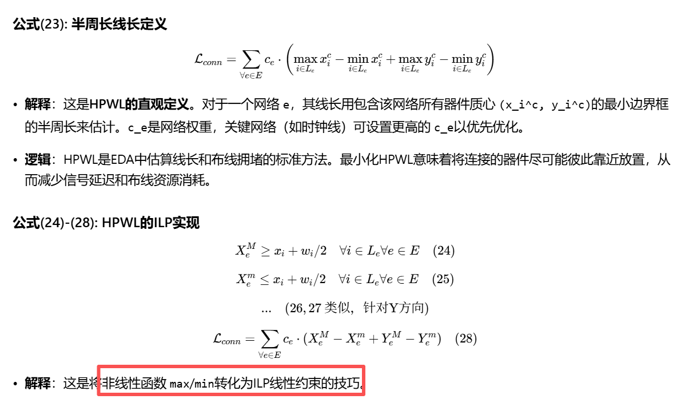

  

  ##### Constructive heuristic  

  

  

  #### data

  

  #### experiment

  

  

  ### [AIPlacer-GNN unsupervised-ASPDAC25--USTC]()

  - the first multi-task learning model for analog placement automation.

  - baseline: [DAC21]()

  - Concept of `global position` is interesting

    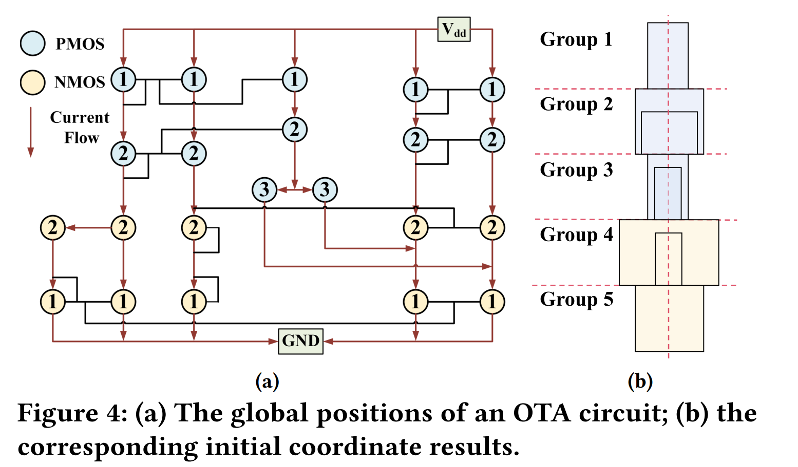

  - > [! WARNING]
    >
    > 这里的非监督其实和 NLP 是差不多的概念？⚠️ 非监督但是也分了测试集和训练集
    >
    > 没有提 `Legalization`？是不需要吗？

  #### background

  - Although recent works have investigated ML-based analog placement automation, these arts face complex training datasets and efficiency challenges.   

  

  #### contribution

  - the first multi-task learning model for analog placement automation.
  - A practical scheme  
  - An unsupervised loss function  

  #### flow

  

  ##### Input  

  - a SPICE netlist(an un-directed graph)

    - node feature(12 dim):

      - (length and width) , 2 dim 

      - device type (i.e., NMOS, PMOS, PASSIVE), 3 dim

      - global positional info (5 dim)

        - calculate the shortest path from the POWER(GND) port to PMOS (NMOS), respectively. The shortest path length refers to the device position, which is transformed into a 5-dimensional one-hot vector. 

        - the global position of the device is highly consistent with the actual order of ==current flows== in the circuit (shown in the red arrow).

        - 

        - > [! WARNING]
          >
          >固定只能有 5 个 dim 感觉电路如果再大点就不适配了

      - init positional info (2 dim)  

        

    - constraint relation

      - 

      - 𝑴1 matrix: 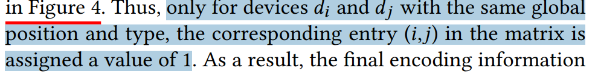

        >[!WARNING]
        >
        >是否会有例外？

      - 𝑴2 matrix: 

        对称信息

        > [!TIP]
        >
        > 没有区分 x/y 对称，还有对称组？
        >
        > 感觉还有很大提升空间

      - 𝑴3 matrix: 

        current-flow VDD2VSS

  #### mode

  - **GAT** to realize the feature interactions between nodes. 
  - **RGCN** for constraint relation
    - 
  - **MTN** Decoder  
    - MMOE-based
    - 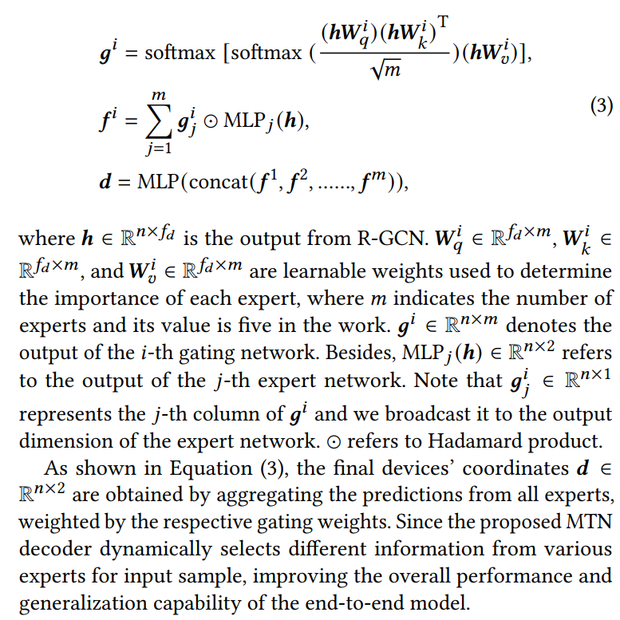

  ##### loss

  > 无监督感觉就是想 NLP 一样找最小值？

  

  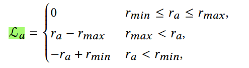

  

  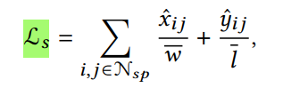

  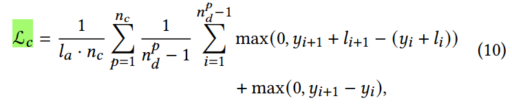

  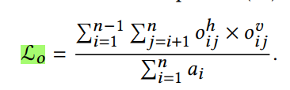

  

  

  #### data

  - TSMC180

  - 13 type ==**OTA only**==

    

  

  #### experiment

  - ⚠️ 非监督但是也分了测试集和训练集

  - 

  - 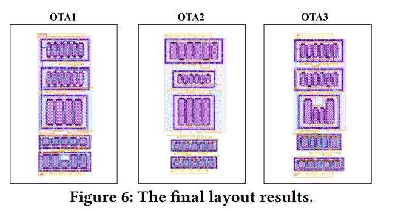

    > `global position` 分开的很明确

  - Ablation Study  

    

    

  

## Placer-DL


### [SACPlace-MADRL+symmetry-DATE25-MADRL-CAS]()

- 

#### background

- 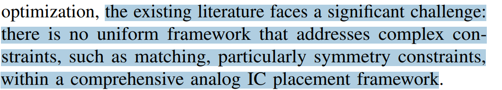
- 

#### contribution

- symmetry-aware  
- introduce cumulative rewards  
- multi-agent  


#### flow

SACPlace initially extracts layout information and various constraints as the input information for placement refinement and evaluation.


#### model

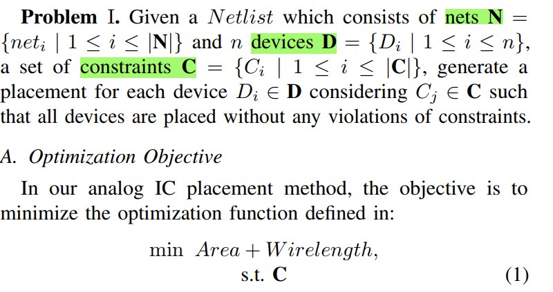

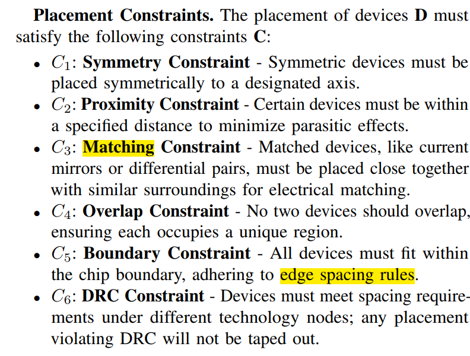

- ==each device== to be placed is treated as an individual ==agent==
- Initially, all devices are intentionally overlapped to facilitate the forward progress of DRL optimization.

##### state

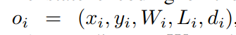

##### action

action space A ensures symmetrical actions  


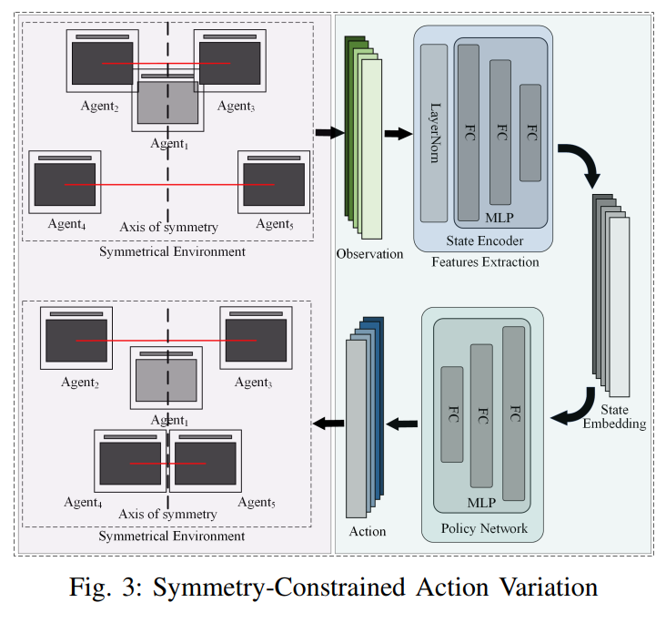

##### reward

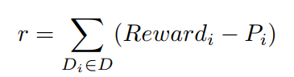

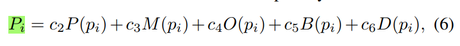


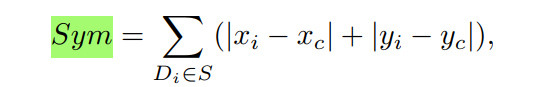


##### MARL

> 没看懂


#### data

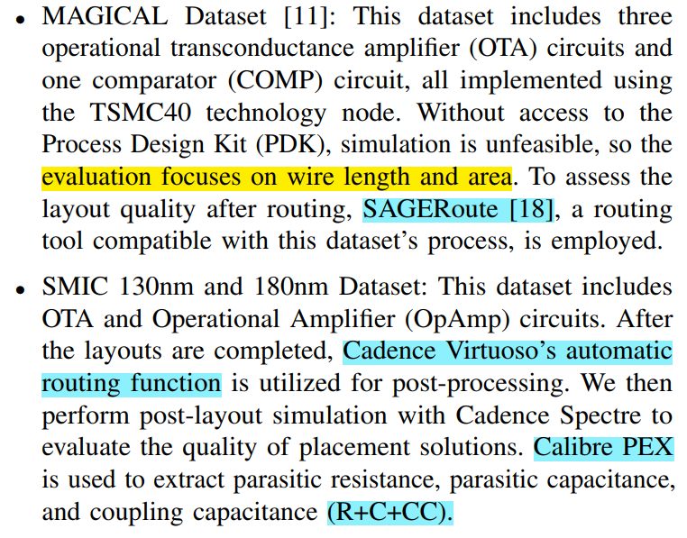

> SAGERoute!

#### experiment

- compare different SOTA DRL approaches  

- 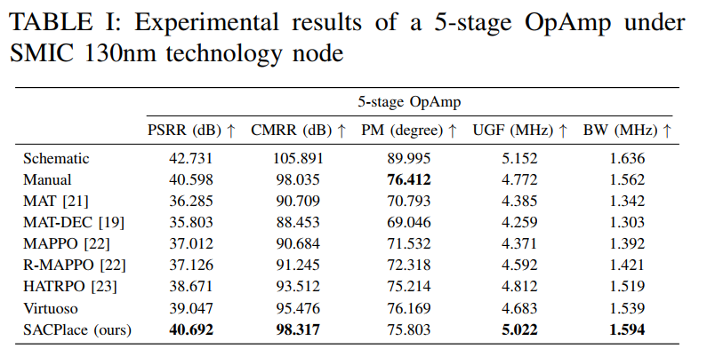

  > 都是和 RL 的方法比较，和 Virtuoso 的自动布局布线
  >
  > Virtuoso, struggles to adequately meet symmetry constraints  

- 

- 


  ## Placer-other

  ### [-Interactive Layout Editing+instant legalization-DAC21--PEK Gao, Lin]()  

  - legalization 
  - 交互的
  - adopt analog placement engine of MAGICAL [2] to generate the initial placement results shown to the users. 

  #### background

  - shortcoming of full-auto flow

    

  - In other words, designers expect a tool to improve their productivity but still have full control over the design process.

  - So far, developing an end-to-end flow that can generate highquality and stable solutions is still challenging, as it is hard to define a universal analytical objective for analog layout problems.

  - 

  

  #### contribution

  - `interactive analog placement` framework that supports ==commands== for fast layout editing  
  - an instant `legalization algorithm` for incremental layout update with ==linear time complexity==
  - Experimental results on open-source analog circuits such as comparators, amplifiers, and data converters demonstrate that the framework can enable efficient layout editing and reduce the turn-around time for layout designers.

  

  #### flow

  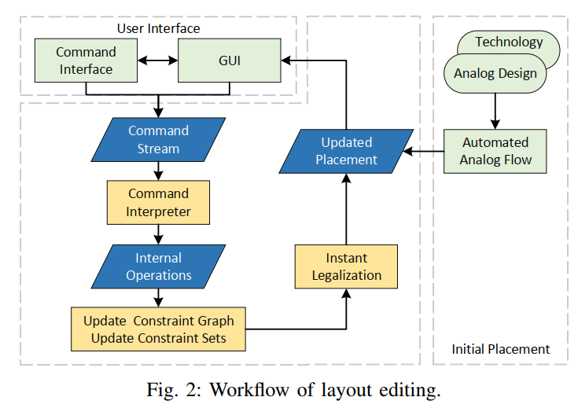

  - All events on the interface are encoded as commands.  
  - 

  

  #### model

  ##### command set

  

  ##### constraint graph   

  

  ##### Instant Legalization  

  

  

  legalizer can handle both flat circuits and hierarchical circuits.  For hierarchical circuits, the legalization process starts with the leaf-level subcircuits in the circuit hierarchy tree.

  

  ##### MCG(G^M^)

  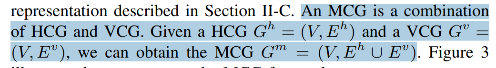

  有向无环图 directed acyclic graph (DAG)  

  

  linear ordering S ={v2; v1; v5; v3; v4}  

  

  

  ##### Layout Partitioning  

  two symmetry groups  

  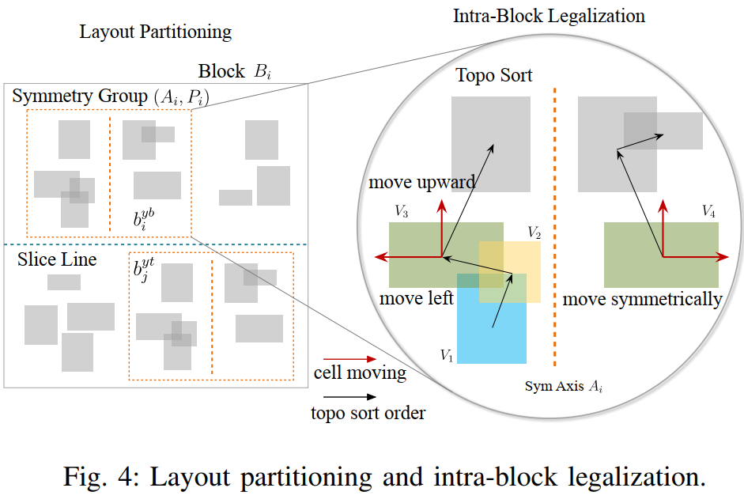

  

  

  ##### topo-sort based legalization  

  > [!TIP]
  >
  > 前面没怎么看懂，之后再看看

  

  

  #### experiment

  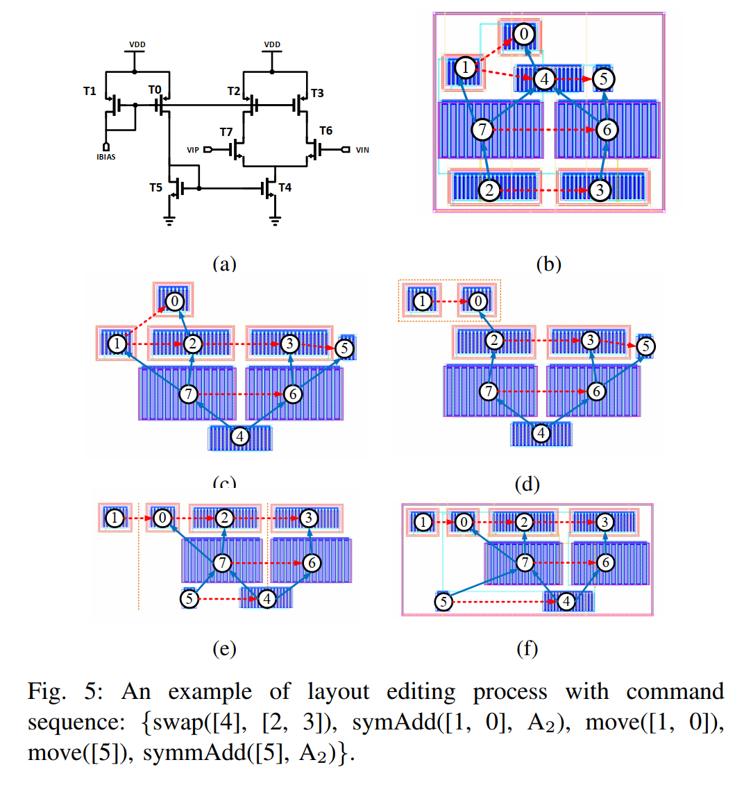

  > [!WARNING]
  >
  > A~2~是什么？

  比 MAGICAL（基于 LP）的快很多

  

  

  

  ## Placer-adv

  ### [-AMS+FinFET-DATE22--DZP]()

  - FinFET

  - SMT formulation

  - problem formulation：

    

  #### background

  - FinFET reigon-based layout 新增的 constraint:

    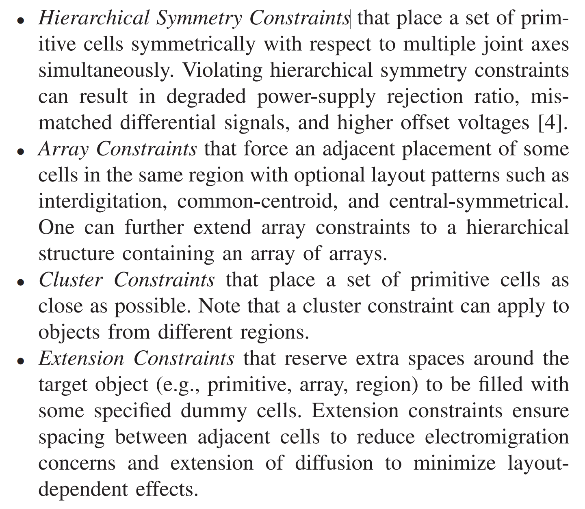

  - 两个相关 privious works

    - 
    - 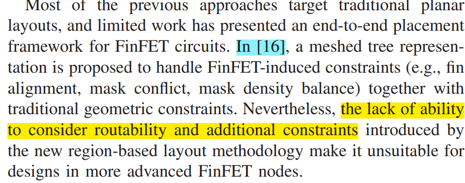

  - 

  

  #### contributuion

  - an `SMT-based` placement framework targeting a new `region-based` layout for advanced FinFET AMS designs
  - a `window-based` pin density checking SMT formulation for placement routability consideration.
  - leverage `incremental SMT` solving techniques for efficient wirelength optimization, enabling the application of our framework to `large-scale designs.`

  

  #### experiment

  - Z3 SMT solver  

  - 商用数据集：BUF, VCO

    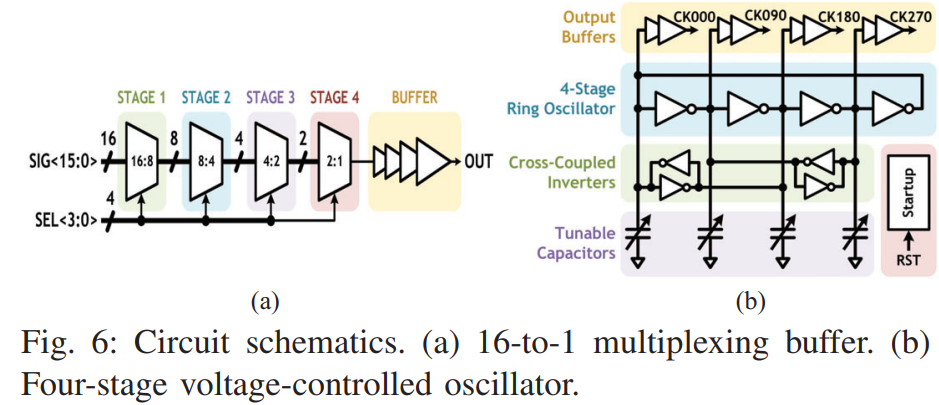

  - TSMC 5nm

  - use [ICCAD20]() analog router [18]

  

  ## POpt-DL

  ### [-survey ML+SA-ISVLSI20--UTA-]()

  - 一个实验性质的对比工作，NN, RF, SVM
  - Placer 基于 [TCAD10-SA-EFYY]() 的工作
  - OTA only
  - 

  #### background

  - most of the previous works are focused on geometric constraint

  - the impact of layout on analog circuit performance can be very large due to significant RC (Resistance and Capacitance) parasitic generated in layout.

  - 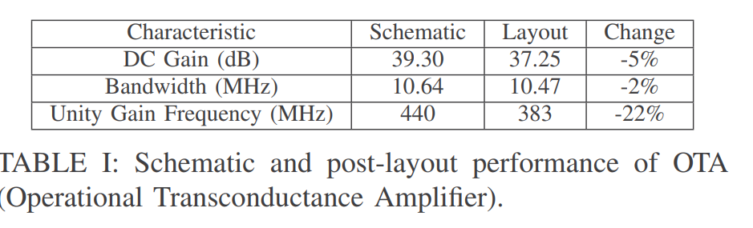

  - the layout effect on performance is often very complex and thus difficult to be quickly and accurately estimated

  - 

    

  #### contribution

  - directly optimizes circuit performance during placement
  - It can directly optimize analog circuit performance along with conventional objectives, including wirelength, area and geometric constraints such as symmetry constraints

  

  #### experiment

  

  ### [-Placement Quality Prediction via Transfer Learning-DATE20-CNN-UTA]()

  - OTA only
  - a new methodology to shorten the gap in post layout performance modeling for analog circuits.
  - Magical  to generate layouts
  - [Opensource!](https://github.com/magical-eda/UT-AnLay  )

  

  #### background

  - hand-crafted constraints are often questionable in explainability and confidence, and lack flexibility and generality in meeting the detailed needs of different scenarios. 
  - a mapping between a given layout and the expected post layout performance is imperative yet still challenging
  - One major bottleneck of design exploration is the runtime involved with post layout simulations. 

  #### contribution

  - proposed approach leverages an automatic flow to generate high-quality labeled training data
  - a transfer learning scheme that significantly reduces the amount of data needed during training

  

  #### model

  

  

  #### data

  create a balanced data with the worst performing  25th percentile layout labeled as 1 and the best 

  25th as 0. （分类）

  他说的数据剪枝貌似就是分类为 0 的电路只选性能 25%以下的，1 的电路只选 75%以上的

  we propose divide the circuit into the following subcircuits based on functionality

  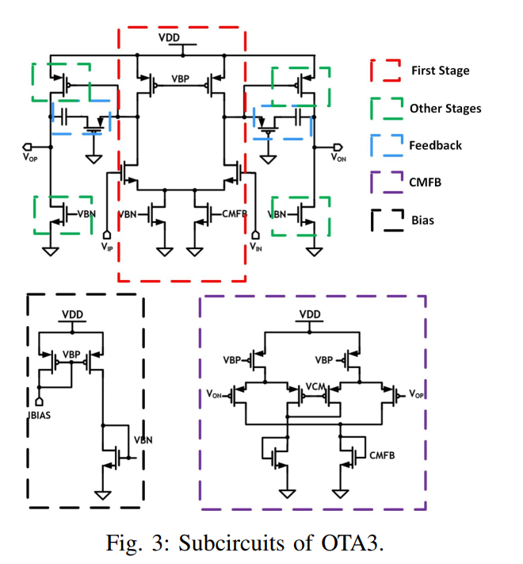

  In all our experiment, the image size is selected to be 64*64. 

  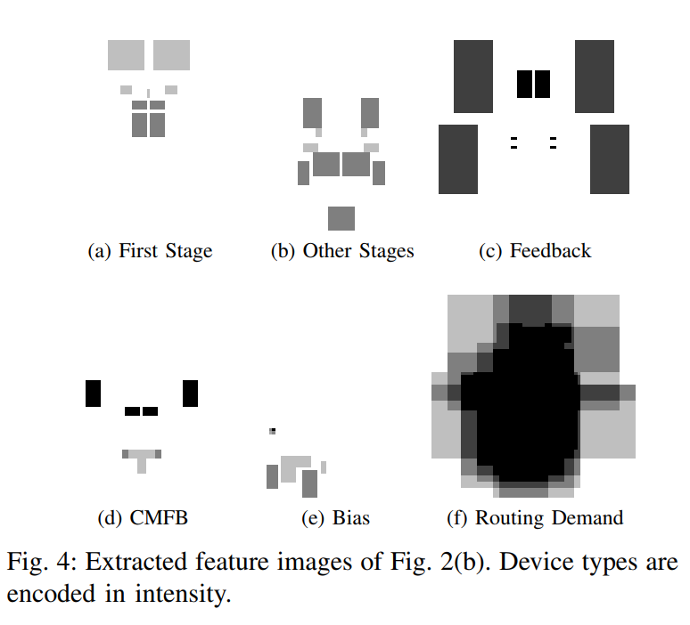

  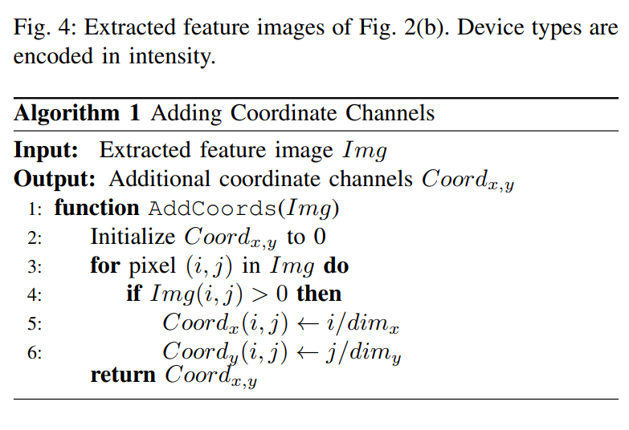

  

  #### experiment

  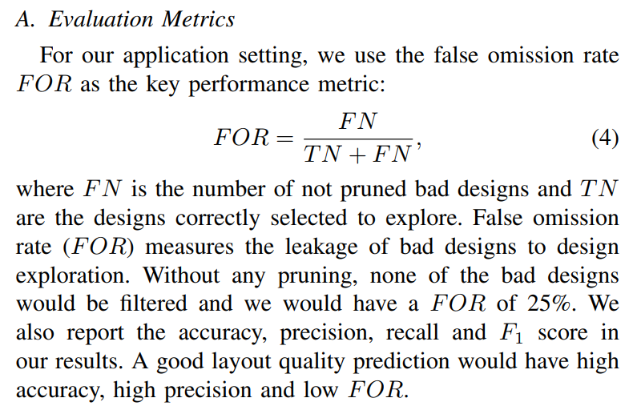

  

  

  ### [-Constraint Evaluation-ASPDAC21-SVM+MLP-]()

  - 基于 [TCAD10-SA](#TCAD10-SA-EFYY) 方法的 Placer
  - testcase: three 12nm OTA 

  #### background

  - the interconnect parasitic correlation may not be linear over the search space

  #### experiment

  

  ### [-Analog Placement Quality Prediction-ASPDAC23-NAS-DU]()

  - [DATE20]() 的延伸，就是用 NAS 优化了一下？
  - NAS: [ 神经架构搜索（NAS）简要介绍 - 知乎](https://zhuanlan.zhihu.com/p/127194745)
  - 

  #### background

  - Severalrecent studies apply machine learning (ML) techniques to directly predict the impact of placement on circuit performance or even guide the placement process. However, the significant diversity in analog design topologies can lead to different impacts on performance metrics (e.g., common-mode rejection ratio (CMRR) or offset voltage). 
  - 

  

  #### data

  using the same open-sourced dataset and the same setting as the work [DATE20]()

  

  

  # Routing

  ### LDS—A description script for layout templates

  ### BAG

  - grid and template-based 

  ### LAYGO1

  - grid and template-based 
  - 类似 [BAG](# BAG)

  

  ### LAYGO2

  - [OpenSource!](https://github.com/niftylab/laygo2)

  

  

  

  ### Analog and mixed-signal layout automation using digital place-and-route tools

  - digital PR tools base
  - a fully automated solution where the physical design process is treated as an optimization process.

  


# DTCO

### [-BO+closed loop+SSF post-DAC20--UTA]()

- closed loop

- [MAGICAL]() 的一部分

- problem formulation

  

#### background

#### contribution

- closed loop
- automatic symmetry constraint detection both between devices and subcircuits
- 

#### flow

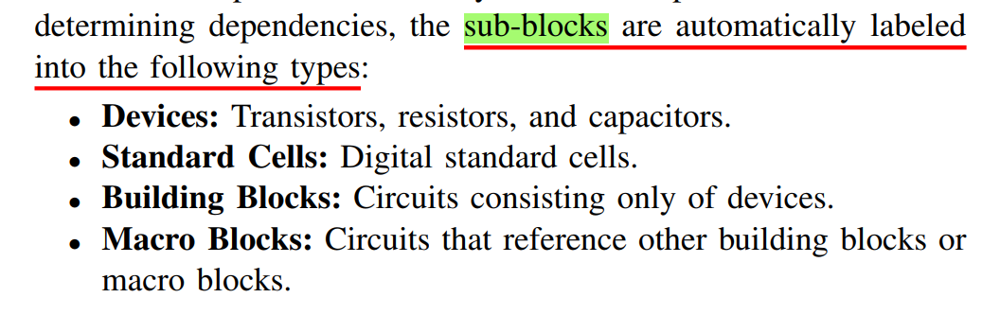

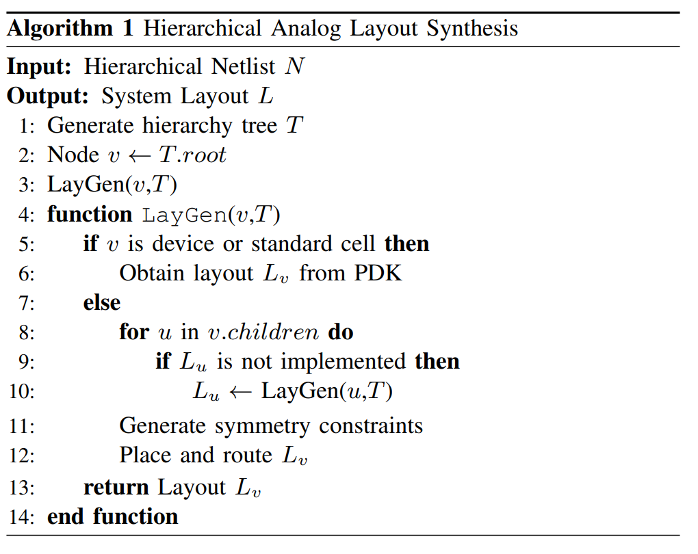

> DFS-based


#### model

- Gaussian process regression (GPR) and MOBO

- classify symmetry constraints into two categories  

  - Device Symmetry, graph isomorphic algorithms
  - System Symmetry

- Close loop:

  


#### data

#### experiment

- GPflow  to do MOBO


# Gate Sizing

### [- -DAC-2024-MARL-Mohsen et al-]()

- Model-Based Policy Optimization (MBPO) to highly boost the sample efficiency of reinforcement learning for analog circuit sizing  
- Integrated in the Twin Delayed DDPG (TD3) algorithm  
- 

### [PZTA-Transferable Circuit Theory-Inspired-ISEDA-2025- -Fudan-]()

- a transferable pole-zero-based transient assertion (PZTA) system


#### background

- Transient simulation is a major computational bottleneck in analog circuit sizing optimization, especially when

  the circuit is unstable.

- Simulation-based methods achieve high accuracy but suffer from inefficiency, while surrogate-based ap

  proaches promise speedups but struggle with prediction errors and high computational costs. 


### Routing

- 概伦和北大合作的
- for analog/mixed-signal integrated circuits.  


#### background

- Most previous work has focused only on ==geometric constraints== or basic ==electrical constraints==, lacking ==holistic== and ==systematic== investigation.
- categorize routing constraints into：
  -  geometric constraints (e.g., design rules) 
  - electrical constraints (e.g., EM and IR drop constraints on power/ground nets, symmetry nets, sensitive area constraint, etc.)
- privious works‘ limitation
  - no tackles multiple constraints  
  - ignore the differences in resistance and capacitance caused by different net routing topologies when handling EM and IR drop constraints


#### contribution


- considers both geometric and electrical constraints  
- compatible with manually placed layouts  
- a novel Steiner tree based wire sizing scheme
  - considers both net routing topologies and wire sizes with accurate estimation of resistance and capacitance for EM and IR drop constraints
- a multi-constraint aware routing algorithm
  - work with complicated constraints and the wire sizing scheme

# Netlist Annotation & Constraint Generation  

Liu M, Li W, Zhu K, et al. S3DET: Detecting system symmetry constraints for analog circuits with graph similarity. Proc ASPDAC, 2020, 193  基于快速图相似性  

Kunal K, Poojary P, Dhar T, et al. A general approach for identifying hierarchical symmetry constraints for analog circuit layout. Proc ICCAD, 2020

Kunal K, Dhar T, Madhusudan M, et al. GANA: ==Graph convolutional network based== automated netlist annotation for analog circuits. Proc DATE, 2020  

templates-based:

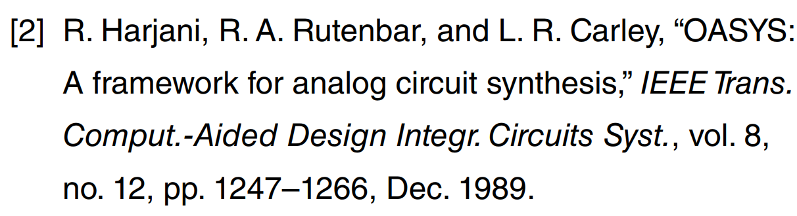

knowledge-based:

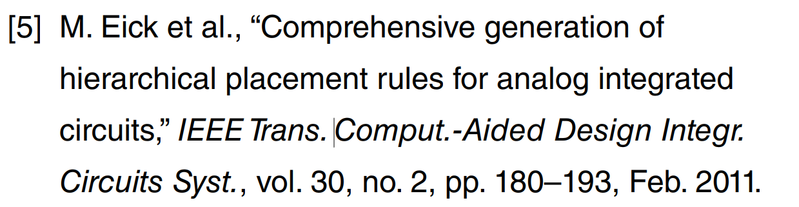

templates and knowledge-based

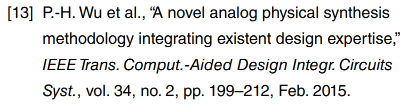


# Design rule abstraction  

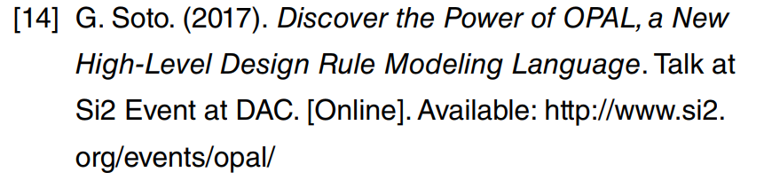


# PCell Generator

### [ALIGN-opt-DATE21--]()

- 一个方法上的改进，但是没仔细说PCell的生成

#### background

- The quality of primitive cell layout is critical for design performance


## Array CC PR


### TOREAD

#### cap


#### mos

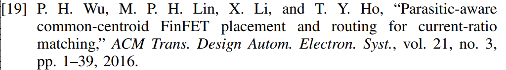

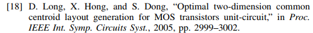

> diffusion share


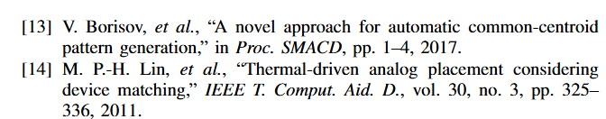


文献[13]和[14]提出了构造性算法来生成晶体管阵列的共质心（CC）版图模式。其中[14]还在布局生成过程中考虑了热效应。然而，这两项研究均未解决布线问题、晶体管间扩散区共享问题或布局相关效应（LDEs）。文献[15]提出了一种扩散区共享感知的CC布局布线算法，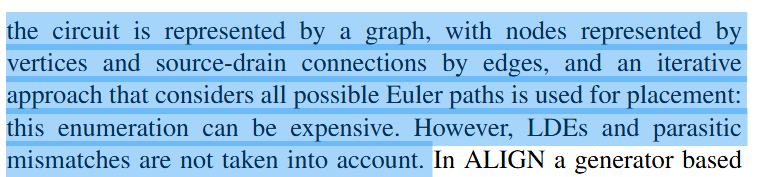


### [-Eulerian Path-ICASIC-03--Tsinghua]()

- $\mathcal{O}(n)$
- dummy insert
- two dimension cc


#### background

#### contribution

#### flow

#### model

the follow five rules should beconsidered [9]. 

1. Coincidence
2. Symmetry
3. Dispersion
4. Compactness
5. Orientation


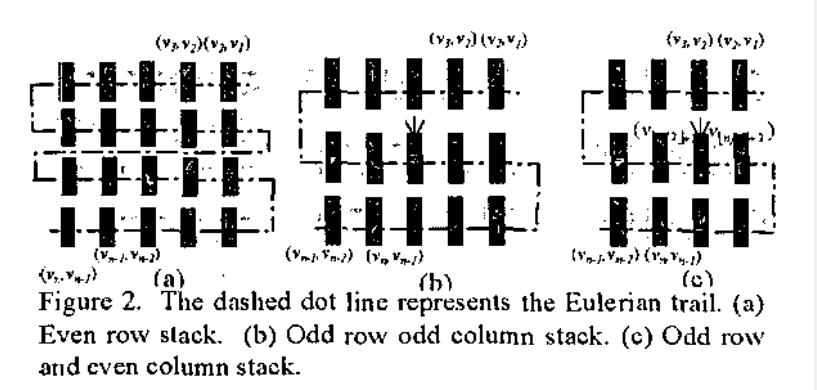

#### data

#### experiment


### [Layout Symmetries--TCAD-17--]()

- arbitrary numbers of rows and columns
- applicable to all device types
- 主要是比较与总结，非常全面
- 但是只有AB两个器件


#### contribution


#### model

##### 匹配梯度模型

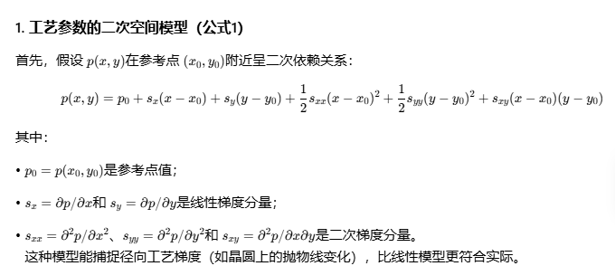


##### 对称类型

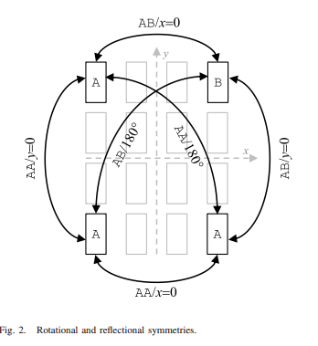


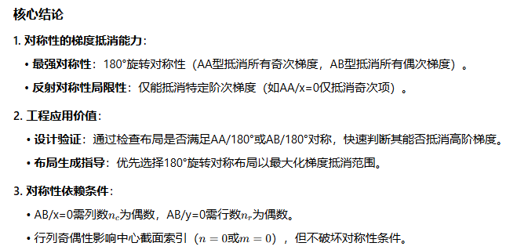

##### 离散度


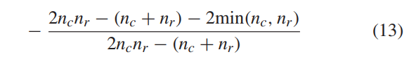


##### 三种算法

1. 行数模4余1

2. 行数模4余3

3. 行数为偶数

   

> 只适合两个器件，同时不考虑abut
>
> 大数量的二管差分对和电流镜可以用


##### DO LINEAR GRADIENTS CANCEL IN COMMON CENTROID LAYOUTS？


#### experiment


### [-Choose pattern-DATE-21--Sharma]()

- 讨论了什么时候用什么pattern， 很深的理论分析，
- TODO: 没看懂.
- 结论
- 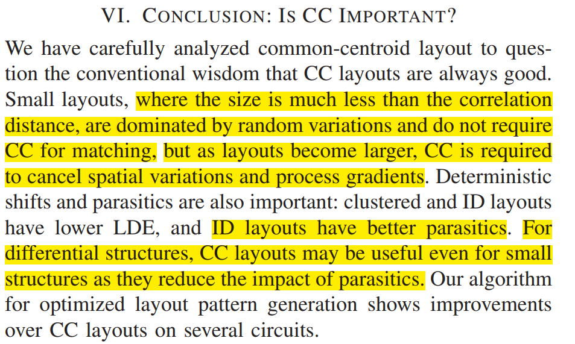


#### background

- LDE and Variation  


### [-Performance-Aware Common-Centroid Placement and Routing-ICCAD-21--Sharma]()

- Performance-Aware:  maximizes diffusion sharing, incorporates length of diffusion (LOD) based stress-induced performance variations, and mitigates resistive parasitics and electromigration (EM) hotspots
- Placement and Routing 
- FinFET


#### background

- LDE
- 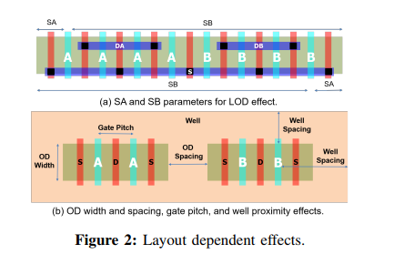


#### flow

#### model

##### placement

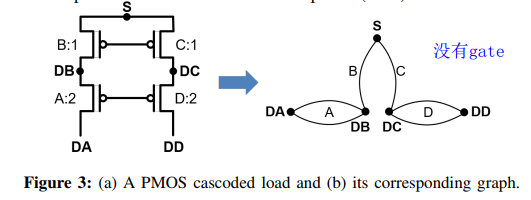

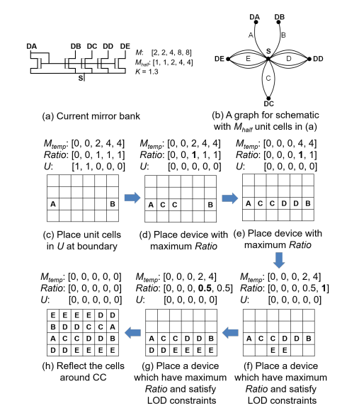


##### routing

EM and IR drop aware

can be reduced by identifying sensitive wires and using ==multiple parallel connections== between nodes,

**overall scheme** is to connect all cells of the same device in a row using ==horiztontal== wires, and to connect cells across rows using ==vertical== wires. 


#### experiment

env

- simulate spatial variations random fields  tool: [GeoStat-Framework/GSTools: GSTools - A geostatistical toolbox: random fields, variogram estimation, covariance models, kriging and much more](https://github.com/GeoStat-Framework/GSTools)

### [-CC nonlinear spatial variations Opt-DATE-24-SA-UTA](https://ieeexplore-ieee-org-443.webvpn.scut.edu.cn/document/10546584/)

- minimizing nonlinear spatial variations.  
- placment only
- more general: consider diffusion break, routing complexity, nonlinear spatial variations and  LDE
- not-cc
- 没后仿

#### background

- LDE and Variation

- [14, 7] have proposed custom algorithm for symmetric transistor placement, which handles layout constraints. However, this method is limited to producing layouts of the `CC` type, making it inefficient in handling nonlinear variations？

  The method also lacks a welldefined objective in the problem formulation, hindering the ability to prioritize one constraint over another. 

  Furthermore, the layout constraints are handled separately through post-processing steps after placement, which can lead to ==sub-optimal== results.

- 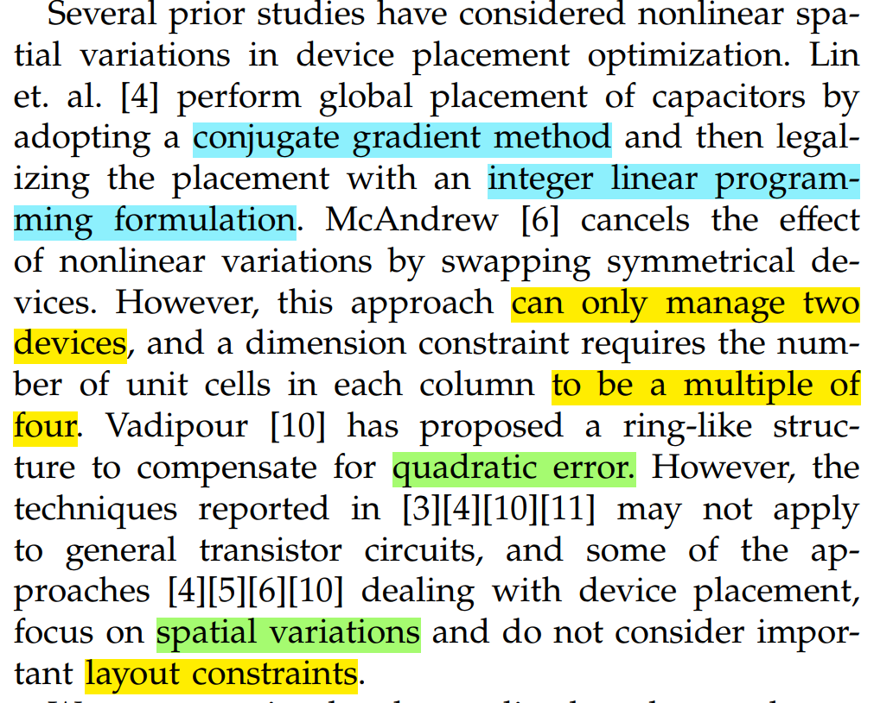

- 


#### contribution


#### flow

Our approach ==starts with an initial placement== of unit cells

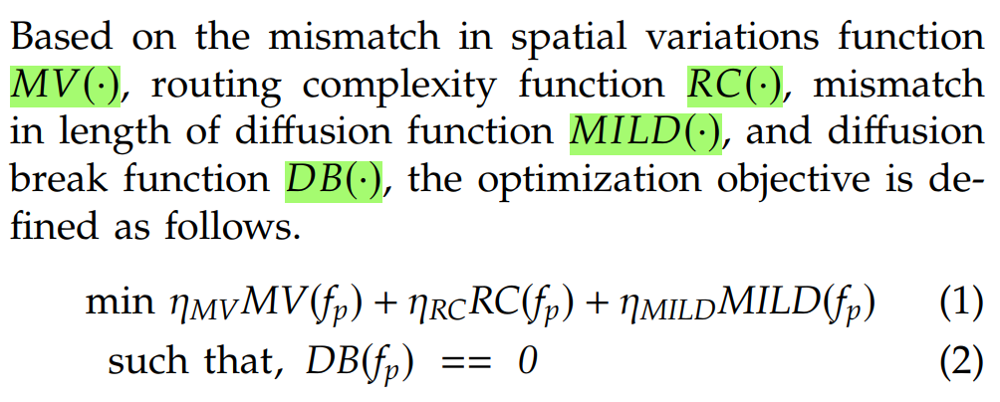


#### model

##### 空间误差


##### 布线复杂度

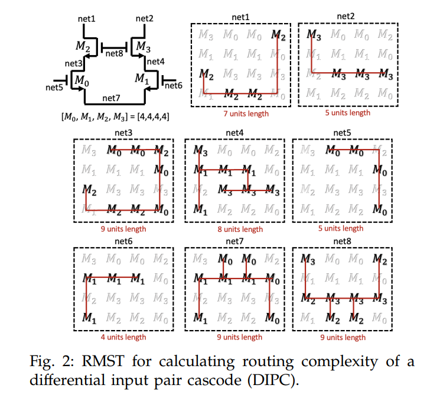

56

𝑂(𝑛2)  

##### LOD效应

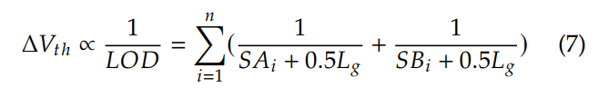

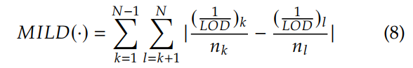


##### Diffusion Break  


##### SA 优化

SA适合这种小规模的问题


init solution:


Random Perturbation  

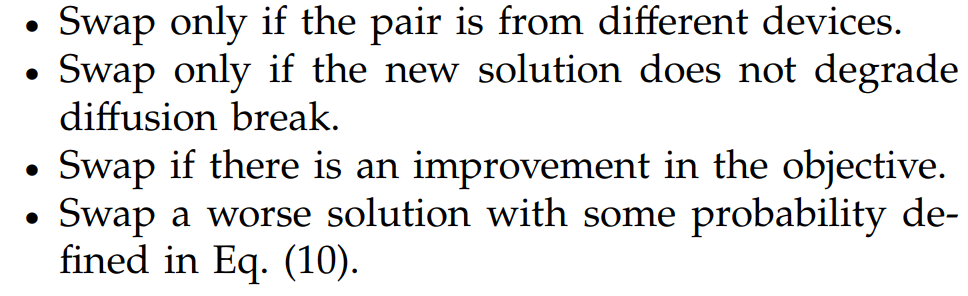

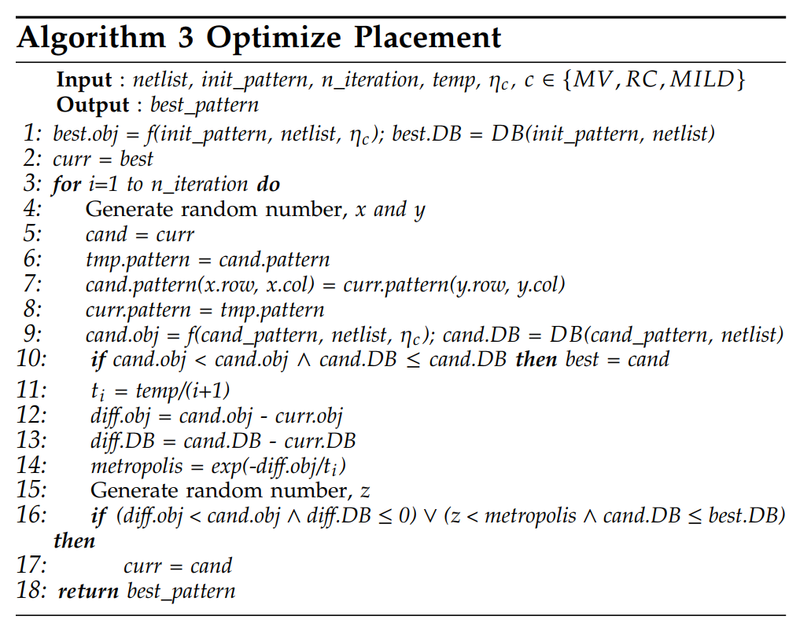


#### data


#### experiments

###### setting

g: random

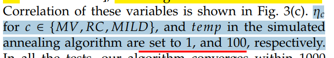


result

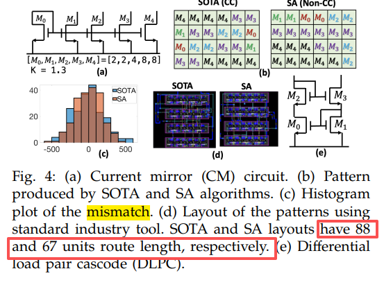

这个生成的pattern一眼看着应该挺难接受的

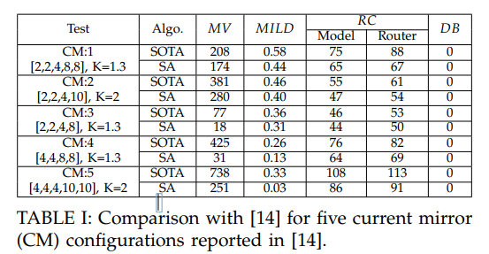


> [!WARNING]
>
> 没说时间，没后仿
>
> 


### [-Nonlinear Gradients -TCAD-24--Sharma]()

- FinFET-Based  
- Sharma 这个方向的第三篇
- dispersion
- optimize the placement for second-order gradients  
- routing 和之前的工作一样
- 详细阐述了为什么要引入空间位置的非线性成分
- 


#### background

- LED, EM, Variation  

- 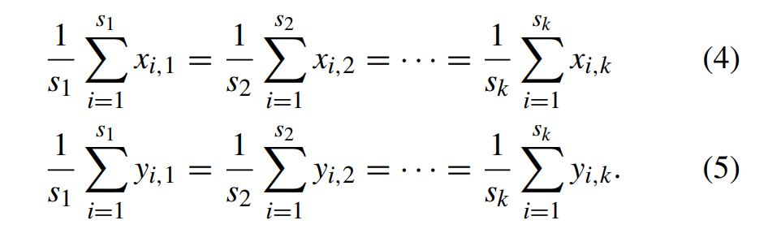

- 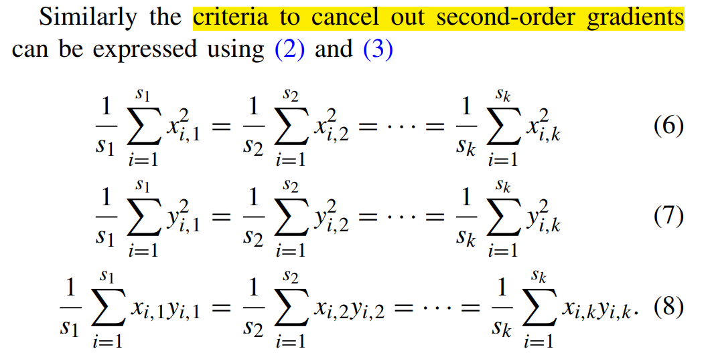

  > [!CAUTION]
  >
  > 这里是分开来相等，但是在[DATE24]()中，每个component和起来相等

- 

- 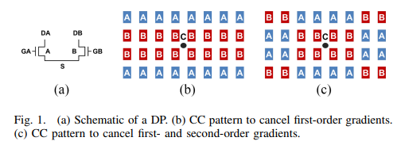


#### model

##### 之前的方法：


> [!CAUTION]
>
> 如果是8列
> (g)下一次放置就完蛋了


##### new method

extensible to higher than second-order gradients, but in practice it is unlikely that such an analysis is necessary in real world scenarios.

by swapping unit cell


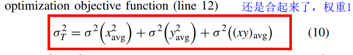

>[!CAUTION]
>
> 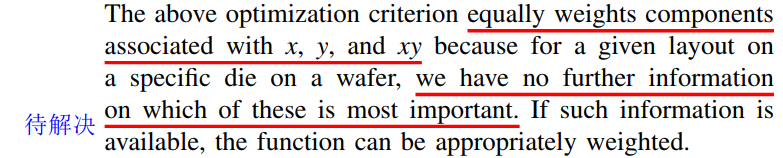


#### data/setting

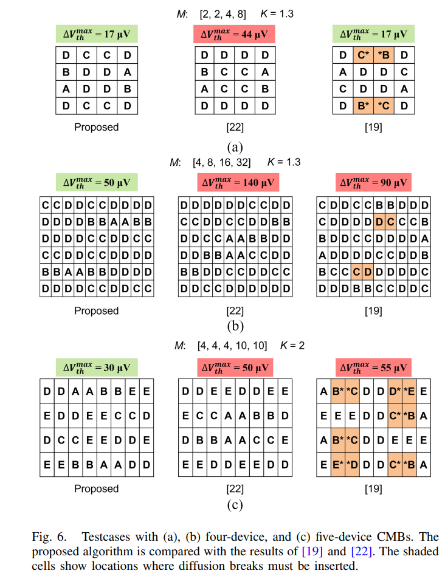


#### experiment


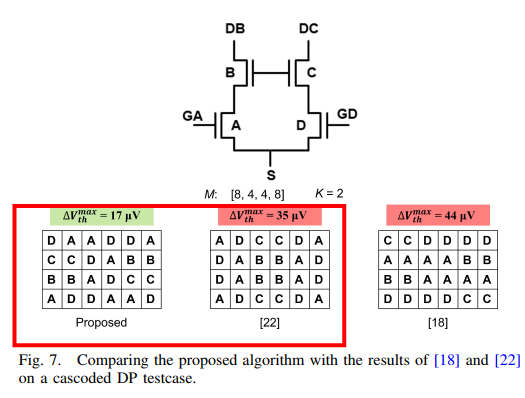

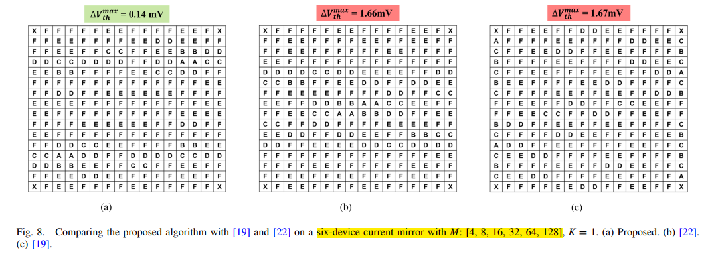

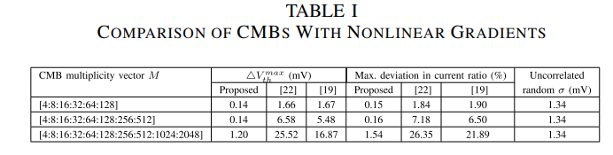

impact of secondorder gradients increases significantly with the ==layout size==  


> Intel(R) Core i7 8665U CPU @1.90 GHz

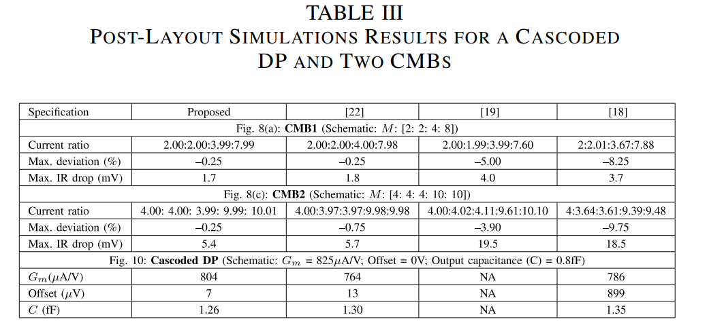

### [-Multiobjective Optimization-TCAD-25-SA-Supriyo]()

- Multi-object: degree of dispersion, routing complexity, diffusion sharing, and layout dependent effects.

- constraints, including degree of dispersion, routing complexity, diffusion sharing, and layout dependent effects.

- Supriyo 上一个工作的期刊，多了很多东西

- SA换成 支持==多目标优化==的 AMOSA [22]， 不需要调参了  

  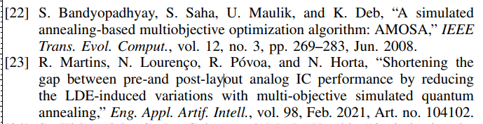

- CC-type， 上一个工作可能出现 not CC?

- 增加了dummy count的考虑

- 增加了离散程度的

- ，没有使用

- placement only

- 可以也没给run time

  > 之后可能往高频/routing/Post-Layout Aware去做？


#### background

- LED and Variation  


#### contribution


- XY/180°


#### flow

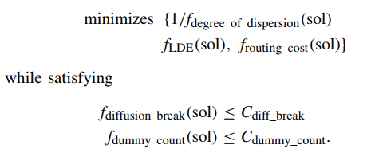


##### init placement


mirroring strategy of device placement using the X==X==/180  transformation proves insufficient

XY/180◦ transformation can be applied only to devices having the same number of units

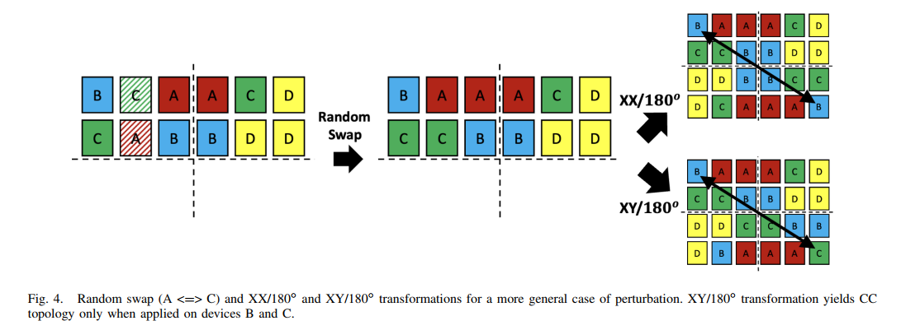


#### model

##### AMOSA-based

we store the solution==s== in new-pts（AMOSA store one solution）

> TOREAD


##### constration

Degree of Dispersion  


Layout Dependent Effects  

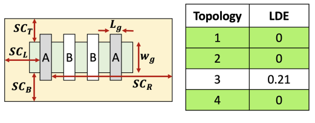

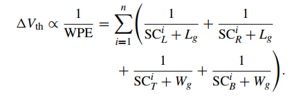


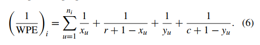

Routing Cost  

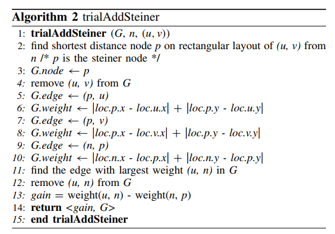

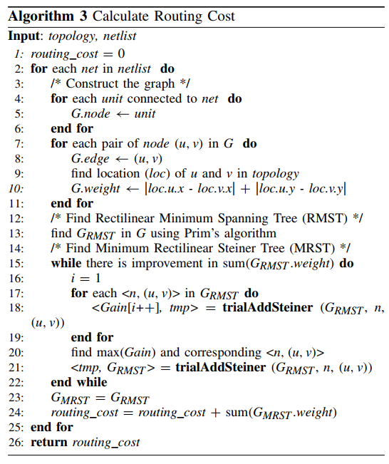

> [!CAUTION]
>
> 再换成RSMT？
>
> 有这么麻烦吗

#### Data and Env

TSMC 40 nm PDK  

Virtuoso schematic and GXL layout environment   

==manually== create  the topology (i.e., the pattern) using the Modgen feature  

> Modgen feature 是什么？

Calibre nmLVS and PEX  

> 不用过DRC，也难过

Labels and NWELL are created ==manually==  


> 感觉case的单元数量都挺大的。不过小的话好像也没什么优化必要

#### experiment

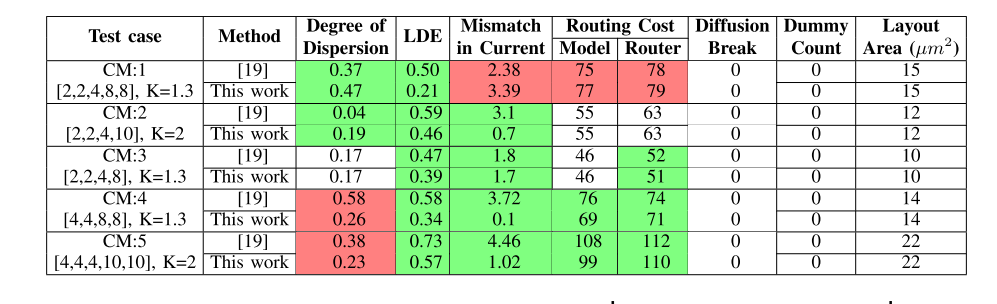

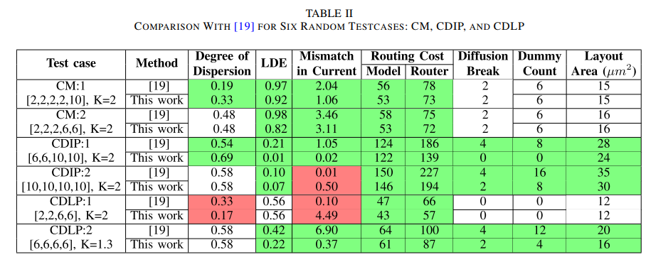

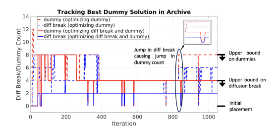

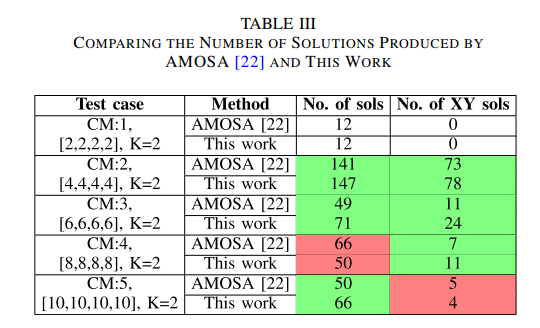

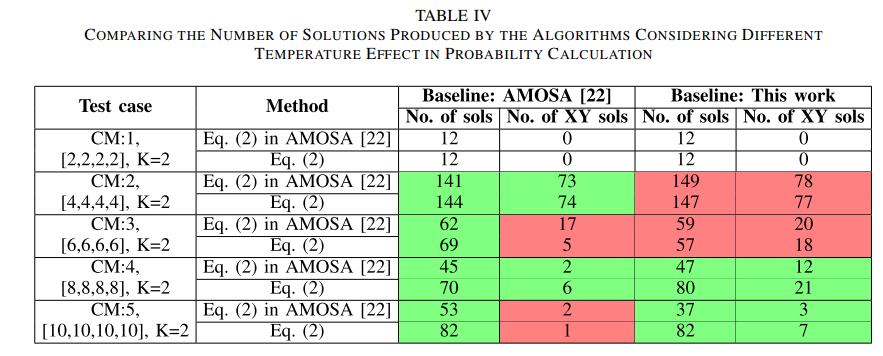


# Tools

## Generator

### PCell

- Cadence
- 

### PyCells

- related tools：pycell studio
- Synopsys


### BAG1/2

- 2013/2018

- Berkeley Analog Generator (BAG)

- [OpenSource](https://github.com/ucb-art/BAG_framework)

- PyCell-based

- procedural based, users have to write significant amount of codes, limiting the wide adoption of the solutions

  程序性布局生成器在开发参数化单元以及整合用于编码器件放置和布线的脚本方面仍然需要大量的人工劳动。尽管如此，这些方法在将设计迁移到不同技术节点时已显著减少了人工工作量。


## Netlist2GDS

### MAGICAL

- [magical-eda/MAGICAL: Machine Generated Analog IC Layout](https://github.com/magical-eda/MAGICAL)
- IDEA program  “no human in the loop”   
- 


#### flow


- MAGICAL supports different device types, including PMOS, NMOS, MOM capacitors, and poly resisters. 
- Transistors can have additional attributes such as lvt (low threshold voltage), hvt (high threshold voltage) and na (native device)

#### files

Benchmark circuit examples are under `examples/`


#### case

three OTA

one COMP

two ADC

- The ADC circuits are relatively large and have a hierarchy.
- All circuits contain symmetry group constraints.   


#### model

MAGICAL 会为每个 PMOS 器件生成单独的 NWELL 接触孔


##### CONSTRAINT EXTRACTION  

###### Graph Abstraction  

netlist -> graph

`Devices`, `pins`, and `nets` are all represented as nodes. 

###### Seed Pattern Detection  

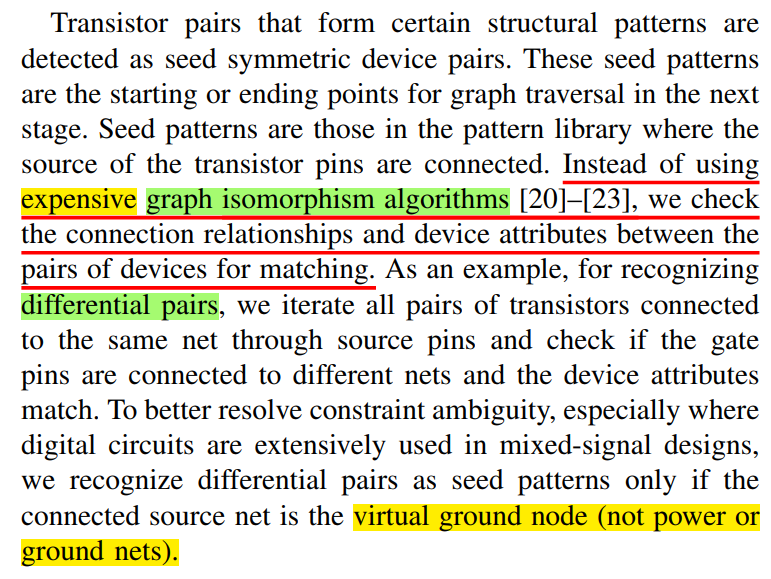

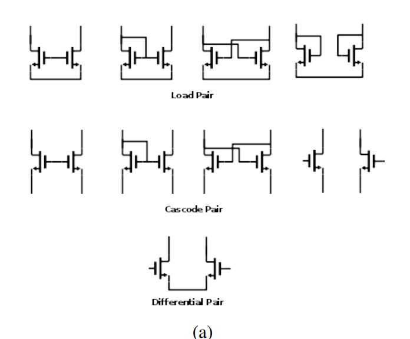

模式匹配


###### Signal Flow Based Graph Traversal  

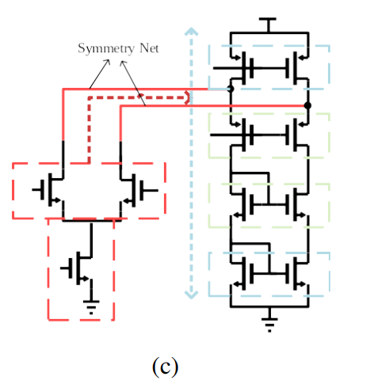

define `current directions` 

###### Constraints Post-processing  

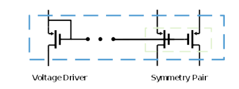


##### placer

- IO:
  - The inputs to the placer include the circuit netlist, extracted constraints, generated devices, and process technologydependent design rules  
  - The outputs are the legalized GDSII layout of the placement result and pin information for routing.
- satisfying the symmetry constraints and design rules. 
- 基于 [ISPD19, XU](), NLP
  - NLP
    - we can get a global placement result encouraging symmetry and boundary constraints with short wirelength and small device overlapping
  - legalization  and detailed placement
    - constructing the constraint graphs  
      - `constraint graphs and plane sweep algorithm`: J. Doenhardt and T. Lengauer, “Algorithmic aspects of one-dimensional layout compaction,”  IEEE TCAD, vol. 6, no. 5, pp. 863–878, 1987
      - missing positional constraint edges: [ISPD19, XU]()
    - linear programming (LP)
      - optimize the wirelength for the given legal placement  
- `Post-Placement Optimization`：WellGAN 

##### router

- two stages, global and detailed routing  
  - 
  - global routing: grid-based A* search routing engine, 3D grid, two-pin nets, RRR
  - detailed routing: a sequential A* search kernel is applied  
- net constraintion
- 

#### Install

To clone the repository and submodules, go to the path to download the repository.

```
# clone the repository 
git clone https://github.com/magical-eda/MAGICAL.git
git submodule init
git submodule update
```

You can use the Docker container to avoid building all the dependencies yourself.

1. Install Docker on [Linux](https://docs.docker.com/install/).

2. Navigate to the repository.

   ```
   cd MAGICAL
   ```

   

3. Get the docker container with either of the following options.

   - Option 1 (Recommended): pull from the cloud [jayl940712/magical](https://hub.docker.com/r/jayl940712/magical).

   ```
   docker pull jayl940712/magical:latest
   ```

   

   - Option 2: build the container.

   ```
   docker build . --file Dockerfile --tag magical:latest
   ```

   

4. Run the docker container

   ```
   docker run -it -v $(pwd):/MAGICAL jayl940712/magical:latest bash
   ```

   

   Or if you used option 2 to build the container

   ```
   docker run -it -v $(pwd):/MAGICAL magical:latest bash
   ```

   


### ALIGN

- [ALIGN-analoglayout/ALIGN-public](https://github.com/ALIGN-analoglayout/ALIGN-public?tab=readme-ov-file)

- [ALIGN: Document](https://align-analoglayout.github.io/ALIGN-public/index.html), MAGICAL 没有文档

- The goal of ALIGN (Analog Layout, Intelligently Generated from Netlists) is to automatically translate an unannotated (or partially annotated) `SPICE netlist` of an analog circuit to a `GDSII layout`.

- also releases a set of analog circuit designs.

- covering four broad classes of functionality  

  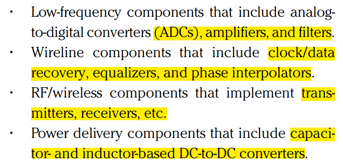

- 


#### Core concept

hierarchical

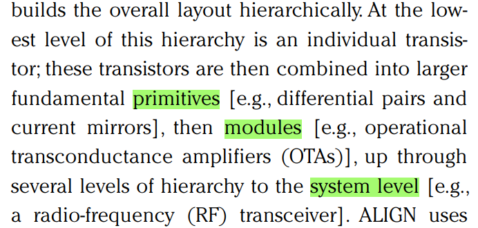


#### flow

[ALIGN: flow — ALIGN](https://align-analoglayout.github.io/ALIGN-public/notes/flow.html#inputs)

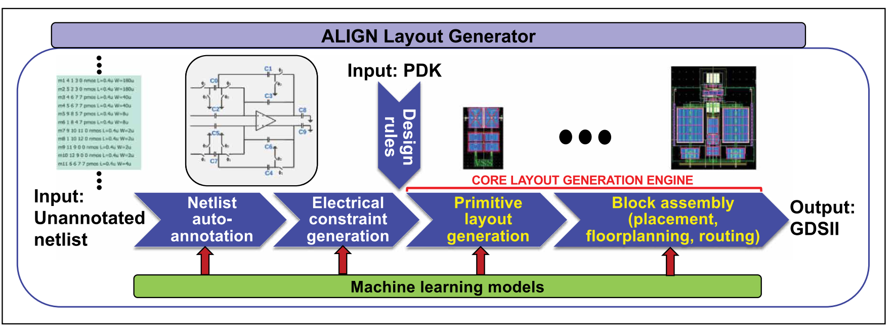

- netlist

  - "Only one .sp file allowed"

  - `primitive_lib = generate_hierarchy(netlist, subckt, topology_dir, flatten, pdk_dir)`

    - align/config

      

      - "basic_template.sp"： template library
    
        
    
      - "user_template.sp"
    
    - `read_lib` 获取 template(PCell)
    
  - `primitives = generate_primitives(primitive_lib, pdk_dir, primitive_dir, netlist_dir, blackbox_dir, scale)`
  
    - 一个primitive的dict内容：
  
      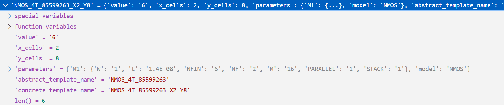
  
  - `generate_pnr`


##### Netlist auto-annotation  

   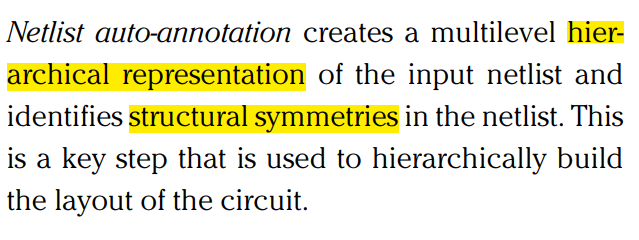

   The input to ALIGN is a SPICE netlist that is converted to a `graph` representation

   uses two approaches   

   - ML-based methods

     Details of the approach are provided in [GANA]()

   - Graph-traversal-based methods  

     for blocks that lie ==outside the scope of the GCN training set==, we use graph-based approaches to recognize repeated structures within a circuit.

     `approximate subgraph isomorphism`  

   可以找到 primitives/hierarchy/symmetry

   example:

   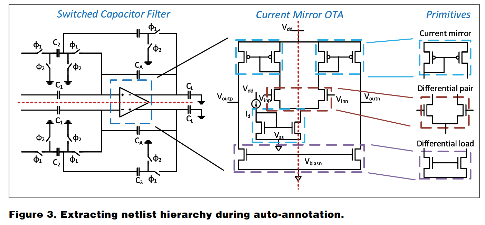

   >It is important to note that the best layout hierarchy may sometimes differ from a logical netlist hierarchy

##### Design rule capture

   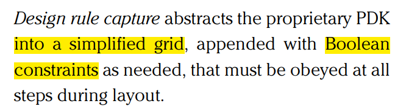

   


 ##### Constraint generation   

   

two type of constraints:

1. Geometric constraints,

   symmetry, matching, and common-centroid constraints

   [GCN-based method]()

2. Electrical constraints  

   bound the maximum parasitics at any node of the circuit

   

   

   

##### Parameterized primitive layout generation    

   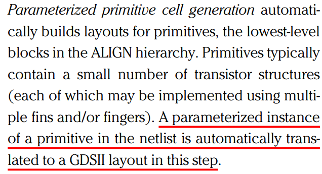

provides the user with a predefined `library` of parameterizable primitives

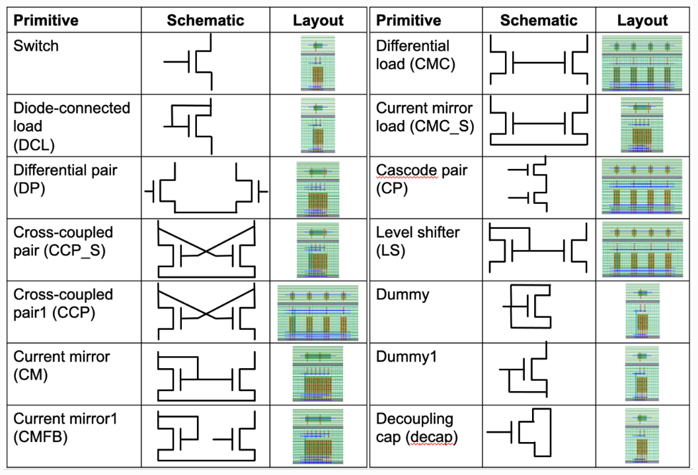


##### Hierarchical block assembly   

   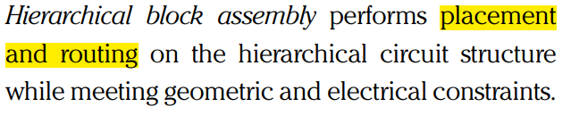

placement

- SA+sequence pairs  [TCAD11]

router

- can employ one of the two detailed routers
  - `integer linear programming` formulation and an `A* algorithm`;  this works particularly well for more ==sparse designs==
  - A `satisfiability-based` [detailed router](github.com/ALIGN-analoglayout/AnalogDetailedRouter), released by Intel, is well suited for ==congested== designs


#### constraintion

[Constraints — ALIGN](https://align-analoglayout.github.io/ALIGN-public/notes/const.html)

- SymmetricBlocks

- Order

- align

- Enclose

- Spread

- aspect ratio

  Define ==lower and upper bounds== on aspect ratio (=width/height) of a ==subcircuit==

- Boundary

- CompactPlacement？

- SameTemplate？

- CreateAlias？

- GroupBlocks

  Forces a ==hierarchy== creation for group of instances. This brings the instances ==closer==. This reduces the problem statement for placer thus providing better solutions.

  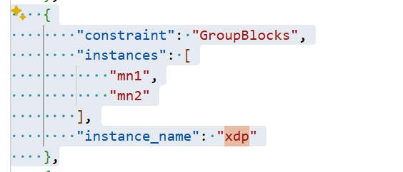

  

  

- DoNotIdentify

- BlockDistance

- guard ring

- GroupCaps

- NetConst

- PortLocation

- SymmetricNets

- MultiConnection

- PowerPorts

- GroundPorts

- ClockPorts

- DoNotUseLib

- 

#### PDK abstraction

- [Doc](..\Analog\Tools\ALIGN_PDK_Abstraction_Guide.pptx)

- [PDK abstraction — Detailed explanation](https://align-analoglayout.github.io/ALIGN-public/notes/adding_pdk.html)

- 

- Files:

  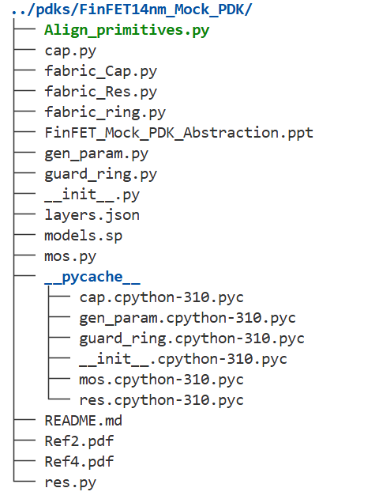

##### layer.json

- [What is Front End(FEOL), Middle End, and Back End of Line(BEOL)](https://techovedas.com/what-is-front-endfeol-middle-end-and-back-end-of-linebeol-in-semiconductor-manufacturing/)
- Metal names in the ‘layers.json’ must start with ‘M’ 
- Via names in the ‘layers.json’ must start with ‘V’
- Do not use FEOL layer names starting with ‘M’ or ‘V’
- All dimensions are in nanometer
- [PDK abstraction — Detailed explanation](https://align-analoglayout.github.io/ALIGN-public/notes/adding_pdk.html) 中有 json 字段的详细解释
  - Metal/Via
  - Poly
  - Fin
  - N/Pwell
  - vt_type(RVT/LVT/HVT/SLVT)
  - active
  - Boundary Layers
  - MOM Cap

**BEOL(Back End of Line) Design rules**


**FEOL (Front End of Line) Design rules**

These layers are used by the `cell generator` and may vary based on the `PDK`.

> 一些关于衬底的，比如 PC 层


##### model.sp

- Define ==models for devices available in a pdk==

- The model names are used in ‘annotation phase’

- example

  

- 


#### PCell Generator


 four basic cell types:

- [Transistor](https://github.com/ALIGN-analoglayout/ALIGN-public/blob/master/pdks/FinFET14nm_Mock_PDK/Align_primitives.py)
- [Capacitor](https://github.com/ALIGN-analoglayout/ALIGN-public/blob/master/pdks/FinFET14nm_Mock_PDK/fabric_Cap.py)
- [Resistor](https://github.com/ALIGN-analoglayout/ALIGN-public/blob/master/pdks/FinFET14nm_Mock_PDK/fabric_Res.py).
- [Guard ring](https://github.com/ALIGN-analoglayout/ALIGN-public/blob/master/pdks/FinFET14nm_Mock_PDK/fabric_ring.py).

Cell fabric module defines the common structure for cell generation utilities which are used in the primitive generator. This remains common across PDKs.


#### Hierarchical Analog Placer and Router Flow

[ALIGN-public/PlaceRouteHierFlow/README.md at master · ALIGN-analoglayout/ALIGN-public](https://github.com/ALIGN-analoglayout/ALIGN-public/blob/master/PlaceRouteHierFlow/README.md)


#### install

> [!CAUTION]
>
> 1. CMake 版本不能太高，实测 `cmake4.1` 不行。`cmake3.29.3` 可以但是也有警告。
>
> 2. 为了防止 github 在线下载问题，需要手动下载一份 `https://github.com/ArthurSonzogni/nlohmann_json_cmake_fetchcontent/archive/refs/tags/v3.7.3.tar.gz` 和 `https://sourceforge.net/projects/lpsolve/files/lpsolve/5.5.2.11/lp_solve_5.5.2.11_source.tar.gz/download`
>
>    解压然后指定 CMAKE_ARGS 到对应路径
>

> 学校服务器 g++版本太低，需要自己下
>
> ` conda install -y -c conda-forge gcc_linux-64=10 gxx_linux-64=10 cmake=3.29.3 make gdb`
>
> 

```bash
conda create -y -n align python=3.10

conda activate align
conda install -c conda-forge -y boost lpsolve55
conda run python -m pip install --upgrade pip
source install_deps.sh
conda list
pip uninstall cmake
pip install cmake==3.29.3
# 为了防止github在线下载问题，需要手动下载一份`https://github.com/ArthurSonzogni/nlohmann_json_cmake_fetchcontent/archive/refs/tags/v3.7.3.tar.gz` 和 `https://sourceforge.net/projects/lpsolve/files/lpsolve/5.5.2.11/lp_solve_5.5.2.11_source.tar.gz/download`
export FETCHCONTENT_SOURCE_DIR_JSON=${HOME}/Downloads/nlohmann_json_cmake_fetchcontent-3.7.3
export FETCHCONTENT_SOURCE_DIR_LPSOLVE=${HOME}/Downloads/lp_solve_5.5
# export FETCHCONTENT_FULLY_DISCONNECTED=ON      # 可保持，防止再次访问外网
export CMAKE_ARGS="-DFETCHCONTENT_SOURCE_DIR_JSON=${HOME}/Downloads/nlohmann_json_cmake_fetchcontent-3.7.3 \
                   -DFETCHCONTENT_SOURCE_DIR_LPSOLVE=${HOME}/Downloads/lp_solve_5.5"
BUILD_TYPE='RelWithDebInfo' BUILD_TESTING='ON' python setup.py develop -v
```


```
(align) pengxuan@user-Super-Server:~/Software/ALIGN-public$ conda list
# packages in environment at /home/pengxuan/Software/miniconda3/envs/align:
#
# Name                     Version          Build                 Channel
_libgcc_mutex              0.1              main
_openmp_mutex              5.1              1_gnu
align                      0.9.8            pypi_0                pypi
blinker                    1.9.0            pypi_0                pypi
boost                      1.78.0           py310hc4a4660_0       conda-forge
boost-cpp                  1.78.0           h75c5d50_1            conda-forge
bzip2                      1.0.8            h5eee18b_6
ca-certificates            2025.10.5        hbd8a1cb_0            conda-forge
certifi                    2025.10.5        pypi_0                pypi
cffi                       1.15.1           pypi_0                pypi
charset-normalizer         3.4.4            pypi_0                pypi
click                      8.3.0            pypi_0                pypi
cmake                      3.29.3           pypi_0                pypi
colorlog                   6.10.1           pypi_0                pypi
coverage                   7.11.0           pypi_0                pypi
dash                       3.2.0            pypi_0                pypi
distro                     1.9.0            pypi_0                pypi
exceptiongroup             1.3.0            pypi_0                pypi
execnet                    2.1.1            pypi_0                pypi
expat                      2.7.1            h6a678d5_0
flask                      3.1.2            pypi_0                pypi
flatdict                   4.0.1            pypi_0                pypi
gdspy                      1.6.13           pypi_0                pypi
icu                        70.1             h27087fc_0            conda-forge
idna                       3.11             pypi_0                pypi
importlib-metadata         8.7.0            pypi_0                pypi
iniconfig                  2.3.0            pypi_0                pypi
itsdangerous               2.2.0            pypi_0                pypi
jinja2                     3.1.6            pypi_0                pypi
ld_impl_linux-64           2.44             h153f514_2
libblas                    3.9.0            37_h4a7cf45_openblas  conda-forge
libcblas                   3.9.0            37_h0358290_openblas  conda-forge
libffi                     3.4.4            h6a678d5_1
libgcc-ng                  11.2.0           h1234567_1
libgfortran-ng             13.2.0           h69a702a_0            conda-forge
libgfortran5               13.2.0           ha4646dd_0            conda-forge
libgomp                    11.2.0           h1234567_1
liblapack                  3.9.0            37_h47877c9_openblas  conda-forge
libnsl                     2.0.0            h5eee18b_0
libopenblas                0.3.30           h46f56fc_0
libstdcxx-ng               11.2.0           h1234567_1
libuuid                    1.41.5           h5eee18b_0
libxcb                     1.17.0           h9b100fa_0
libzlib                    1.3.1            hb25bd0a_0
lp_solve                   5.5.2.5          h14c3975_1001         conda-forge
lpsolve55                  5.5              py310h96516ba_1004    conda-forge
lz4-c                      1.9.3            h9c3ff4c_1            conda-forge
markupsafe                 3.0.3            pypi_0                pypi
memory-profiler            0.61.0           pypi_0                pypi
mip                        1.15.0           pypi_0                pypi
more-itertools             10.8.0           pypi_0                pypi
narwhals                   2.9.0            pypi_0                pypi
ncurses                    6.5              h7934f7d_0
nest-asyncio               1.6.0            pypi_0                pypi
networkx                   3.4.2            pypi_0                pypi
ninja                      1.13.0           pypi_0                pypi
numpy                      2.2.6            pypi_0                pypi
openssl                    3.0.18           hd6dcaed_0
packaging                  25.0             pypi_0                pypi
pandas                     2.3.3            pypi_0                pypi
pip                        25.3             pypi_0                pypi
plotly                     6.3.1            pypi_0                pypi
pluggy                     1.6.0            pypi_0                pypi
psutil                     7.1.2            pypi_0                pypi
pthread-stubs              0.3              h0ce48e5_1
pybind11                   3.0.1            pypi_0                pypi
pycparser                  2.23             pypi_0                pypi
pydantic                   1.10.24          pypi_0                pypi
pygments                   2.19.2           pypi_0                pypi
pytest                     8.4.2            pypi_0                pypi
pytest-cov                 7.0.0            pypi_0                pypi
pytest-cpp                 2.6.0            pypi_0                pypi
pytest-rerunfailures       16.1             pypi_0                pypi
pytest-timeout             2.4.0            pypi_0                pypi
pytest-xdist               3.8.0            pypi_0                pypi
python                     3.10.19          h6fa692b_0
python-dateutil            2.9.0.post0      pypi_0                pypi
python-gdsii               0.2.1            pypi_0                pypi
python_abi                 3.10             2_cp310               conda-forge
pytz                       2025.2           pypi_0                pypi
pyyaml                     6.0.3            pypi_0                pypi
readline                   8.3              hc2a1206_0
requests                   2.32.5           pypi_0                pypi
retrying                   1.4.2            pypi_0                pypi
scikit-build               0.18.1           pypi_0                pypi
setuptools                 80.9.0           py310h06a4308_0
six                        1.17.0           pypi_0                pypi
sqlite                     3.50.2           hb25bd0a_1
tk                         8.6.15           h54e0aa7_0
tomli                      2.3.0            pypi_0                pypi
typing-extensions          4.15.0           pypi_0                pypi
tzdata                     2025.2           pypi_0                pypi
urllib3                    2.5.0            pypi_0                pypi
werkzeug                   3.1.3            pypi_0                pypi
wheel                      0.45.1           py310h06a4308_0
xorg-libx11                1.8.12           h9b100fa_1
xorg-libxau                1.0.12           h9b100fa_0
xorg-libxdmcp              1.1.5            h9b100fa_0
xorg-xorgproto             2024.1           h5eee18b_1
xz                         5.6.4            h5eee18b_1
z3-solver                  4.15.3.0         pypi_0                pypi
zipp                       3.23.0           pypi_0                pypi
zlib                       1.3.1            hb25bd0a_0
zstd                       1.5.2            h8a70e8d_1            conda-forge
```


##### bug

GLIBCXX_3.4.30' not found

```bash
Traceback (most recent call last):
  File "/home/pengxuan/Software/miniconda3/envs/align/bin/schematic2layout.py", line 2, in <module>
    import align
  File "/home/pengxuan/Software/ALIGN-public/align/__init__.py", line 6, in <module>
    from .main import schematic2layout
  File "/home/pengxuan/Software/ALIGN-public/align/main.py", line 14, in <module>
    from .pnr import generate_pnr
  File "/home/pengxuan/Software/ALIGN-public/align/pnr/__init__.py", line 1, in <module>
    from .checkers import *
  File "/home/pengxuan/Software/ALIGN-public/align/pnr/checkers.py", line 7, in <module>
    from .router import NType
  File "/home/pengxuan/Software/ALIGN-public/align/pnr/router.py", line 12, in <module>
    from .. import PnR
ImportError: /home/pengxuan/Software/miniconda3/envs/align/bin/../lib/libstdc++.so.6: version `GLIBCXX_3.4.30' not found (required by /home/pengxuan/Software/ALIGN-public/align/PnR.cpython-310-x86_64-linux-gnu.so)

```

> fix: `conda install -c conda-forge "libstdcxx-ng>=13.2.0"`


#### debug

```json
{
    "version": "0.2.0",
    "configurations": [
        {
            "name": "Debug schematic2layout",
            "type": "debugpy",
            "request": "launch",
            "program": "${workspaceFolder}/bin/schematic2layout.py",
            "args": [
                "${workspaceFolder}/examples/telescopic_ota",
                "-p",
                "${workspaceFolder}/pdks/FinFET14nm_Mock_PDK/"
            ],
            "cwd": "${workspaceFolder}/work",
            "console": "integratedTerminal",
            "justMyCode": false
        }
    ]
}
```


## viewer

### KLayout

[KLayout Layout Viewer And Editor](https://www.klayout.de/doc-qt5/manual/basic.html)

#### install

>  无 sudo 权限 local 下载

```bash
  535  rm -rf ../local/
  536  mkdir -p ~/local/klayout && cd ~/local/klayout
  537  dpkg-deb -x ~/Downloads/klayout_0.30.4-1_amd64.deb .
  538  ls
  539  source ~/.bashrc
  540  klayout -v
  541  find ~/local/klayout -name 'libklayout_tl.so*'
  542  find ~/local/klayout -name 'x86_64-linux-gnu'
  543  source ~/.bashrc
  544  klayout -v
  545  export LD_LIBRARY_PATH="$HOME/local/klayout/usr/lib/klayout:$HOME/local/klayout/usr/lib:$LD_LIBRARY_PATH"
  546  klayout -v
  547  tree usr/
  548  apt download libgit2-28
  549  ls
  550  find "libgit2*"
  551  find -name "libgit2*"
  552  dpkg-deb -x libgit2-28_*.deb ~/local/klayout
  553  find -name "libgit2*"
  554  export LD_LIBRARY_PATH="$HOME/local/klayout/usr/lib/x86_64-linux-gnu:$HOME/local/klayout/usr/lib/klayout:$HOME/local/klayout/usr/lib:$LD_LIBRARY_PATH"
  555  klayout -v
  556  find libQt5Xml.so.5
  557  apt download libqt5xml5
  558  dpkg-deb -x libqt5xml5_*_amd64.deb ~/local/klayout
  559  tree .
  560  export LD_LIBRARY_PATH="$HOME/local/klayout/usr/lib/x86_64-linux-gnu:$HOME/local/klayout/usr/lib/klayout:$HOME/local/klayout/usr/lib:$LD_LIBRARY_PATH"
  561  export QT_PLUGIN_PATH="$HOME/local/klayout/usr/lib/qt5/plugins:$QT_PLUGIN_PATH"
  562  ldd ~/local/klayout/usr/bin/klayout | grep "not found"
  563  klayout -v
  564  cd ~/Downloads
  565  apt download libqt5printsupport5 libqt5sql5 libqt5designer5 libqt5multimediawidgets5 libqt5multimedia5 libqt5xmlpatterns5 libmbedcrypto3 libmbedtls12 libmbedx509-0 libhttp-parser2.9 libssh2-1
  566  for pkg in libqt5printsupport5_* libqt5sql5_* libqt5designer5_* libqt5multimediawidgets5_* libqt5multimedia5_* libqt5xmlpatterns5_* libmbedcrypto3_* libmbedtls12_* libmbedx509-0_* libhttp-parser2.9_* libssh2-1_*; do     dpkg-deb -x "$pkg" ~/local/klayout; done
  567  export LD_LIBRARY_PATH="$HOME/local/klayout/usr/lib/x86_64-linux-gnu:$HOME/local/klayout/usr/lib/klayout:$HOME/local/klayout/usr/lib:$LD_LIBRARY_PATH"
  568  export QT_PLUGIN_PATH="$HOME/local/klayout/usr/lib/qt5/plugins:$QT_PLUGIN_PATH"
  569  ldd ~/local/klayout/usr/bin/klayout | grep "not found"
  570  cd ~/Downloads
  571  apt download libqt5opengl5
  572  dpkg-deb -x libqt5opengl5_*_amd64.deb ~/local/klayout
  573  source ~/.bashrc
  574  ldd ~/local/klayout/usr/bin/klayout | grep "not found"
  575  klayout -v
```

