# EDA4PR-Digtal

## Cross-Stage Prediction

- Earlystage prediction can enhance design quality by proactively detecting potential design issues in advance  --cite-->[cluster-net]
- `Shift left`出处：V. Bhardwaj, “Shift left trends for design convergence in soc: An eda perspective,” International Journal of Computer Applications, vol. 174, no. 16, pp. 22–27, Jan 2021  

### congestion

#### background

- Routing congestion can overwhelm routing resources and lead to low cell utilization and routing detours  

- congestion is not known accurately until late in the design cycle, after placement and routing.  

- Many modern placement and synthesis tools leverage congestion estimation in their cost analysis in order to minimize the effects of congestion in the final physical design 

- 

- It is known that the total net length can be a good proxy for congestion   

- A simple approximation for congestion prediction is to use the size of the local neighborhood  

- 

- 和 fan-in, fan-out 强相关

- Precise congestion prediction from a placement solution plays a crucial role in circuit placement   
- Multiple **previous works** have attempted to predict detailed routing congestion in the **placement step** in an effort to optimize routability of the placement solution: RUDY, POLAR 2.0. All these techniques are implemented  in the placement step and need the position information of cells .

- To avoid the high computation cost of placement, it is more useful to be able to predict congestion in the logic synthesis phase.   

- congestion prediction problem can be frame as **node regression problem**  
- with the growth of circuit scale and complexity, time consumption
  tends to be unacceptable when utilizing a **global router** in the placement cycle to obtain the **congestion map**.  
- Current machine learning models commonly follow a two-phase workflow. First, based on domain knowledge, human experts generate various local features on the circuit using predefined functions on netlist. Then, based on the generated features, a specific model, e.g. convolution neural network (CNN) model is designed to predict either the routing demand map or the congestion map  
- the emergence of **Graph Neural Network (GNN)** triggered applications of undirected homogeneous graphs models on routing congestion prediction, since a VLSI circuit can be naturally represented by a graph  

#### [RouteNet-DRC Hotspot Prediction-ICCAD-2018-CNN](https://zhiyaoxie.com/files/ICCAD18_RouteNet.pdf)

##### background

- Every chip design project must complete routing **without design rule violation** before tapeout. However, this basic requirement is often difficult to be satisfied especially when routability is not adequately considered in early design stages.  

- In light of this fact, routability prediction has received serious attention in both academic research and industrial tool development. Moreover, routability is widely recognized as a main objective for **cell placement**  

- CNN and Transfer Learning  

  - CNN learns more abstract patterns from images  
  - Our RouteNet transfers such state-of-the-art ability in image pattern recognition to circuits for capturing the patterns about routability. RouteNet predicts routability based on a pretrained ResNet architecture  
  - Fully Convolutional Network (FCN): outputs an image with size equal to or smaller than input.   many FCNs have both deep and shallow paths in one network.   

- RUDY(Rectangular Uniform wire DensitY)

  - 它被用作我们 RouteNet 的输入特征，因为它与路由拥塞部分相关，获取速度快，可以直接表示为与 RouteNet 相吻合的图像

- challenge of macros

  

  - The orange circles in Figure 3 indicate a strong tendency for hotspots to aggregate at the small gap between neighboring macros  
  - Blue dashed circles indicate the remaining sparsely distributed hotspots 
  - 
  - 有 macro，线性程度低

##### task

- predict overall routability (DRC count), 分类任务，预测总的#DRV
- predict `DRC hotspot` locations.DRC hotspots mean the specific locations with high density of DRVs. like an end-to-end object detection task, which is more difficult to solve. GCell 内#DRV 超过设定值则为 `DRC hotspot`

##### contribution:

- mixed-size macros
- first systematic study on CNN-based routability prediction  
- high accuracy and high speed  

##### flow

##### model

- \#DRV prediction

  ResNet18-based

  

  preprocess

  - 

  - 

    ResNet 是一个固定输入（224*224）的模型，为了使用知识迁移，将输入  通过插值的方法变成 。具体怎么插？

  

- hotspot prediction

##### data

dataset:

ISPD 2015 benchmarks  

different placement made by “obstacle-aware macro placement " algorithm [5].  

each floorplan is placed and routed by Cadence Encounter v14.20 [2]  

##### experiment

we compare the TPR of all methods under the same FPR (error under 1%)

#### [CongestionNet-predict congestion hotspots-IFIP-2019-GNN(GAT)-nvidia](https://ieeexplore.ieee.org/stamp/stamp.jsp?tp=&arnumber=8920342&tag=1)

a **graph**-based deep learning method for predicting **routing congestion hotspots** from a **netlist** before placement.  Predict the ==detail routed== **lower metal layer** congestion values  

why low layer? 因为较低金属层上的拥塞主要是由局部逻辑结构驱动的，而不是由无关逻辑簇之间的较长互连驱动的，后者往往在较高金属层上运行. predicting lower metal layer congestion is not only more important for the underlying task of identifying congested logic structures, but also simplifies the task for our
graph based network  

##### contribution

- 阶段早, 只使用网表
- 由于该模型仅基于网表的逻辑结构而不是任何特定的单元布局进行预测，因此它消除了基于布局的方法中存在的次优布局的伪影 
- can be done without any physical information  
- GNN, 快
- the first work exploring the use of graph based deep learning for physical design problems  

**数据:**

roughly 5000 distinct cell types  

we project our per cell predictions back onto their respective 2D grid (using the **final ground truth physical placement**) and average all cells within each grid cell to come up with a predicted value that can be compared to the original ground truth grid value.  

**模型参数:**

an 8 layer Graph Attention Network (GAT) with size 16 intermediate (or hidden) state  

无向图, each node corresponds to a cell 

节点特征: length 50 for each **cell type** and each cell’s **logic description** as well as the **pin count** and **cell size** of that cell

**实验:**

report correlation values using the **Kendall ranking coefficient**  

实际效果可视化

对比实验

消融实验

cell type or function is an essential part of our predictions.   

cell type 不是没起作用吗

**缺点:** 

- model needs to be **retrained** for every **new process technology**, since the embeddings are over cell types specific to a process technology.  
- it occasionally over predicts congestion in areas of **low to moderate** congestion, such as in most failing parts of Partition A  
- due to the **graph based** nature of the model, it sometimes makes **overly soft decision** boundaries  
- 
- the CongestionNet uses informative cell attributes (cell size and pin count) alone as the input to the GAT and does not use any embedding encoding the netlist structure  

**可改进的点:**

#### [-Congestion prediction + embedding + matrix factorization + partition-arXiv-2021-GNN(Sage)-NAL+]()

- a framework that can directly learn embeddings for the given netlist to enhance the quality of our node features  
- 目的是使用网表数据，减少 placement 迭代
- The key difference between this work and [CongestionNet]() model lies in our construction of an ==embedding== pipeline for EDA netlists  

##### background

- predicting cell congestion due to improper logic combination can reduce the burden of subsequent physical implementations.  

- previous work: require informative cell features 

- an awareness of high congestion areas at an early design stage is of great importance to provide fast feedback and shorten design cycles  

- Although the global routing result provides a good estimation of routing congestion [6], [19], an awareness of high congestion areas at an **early** design stage is of great importance to provide fast feedback and shorten design cycles

- Multiple works have attempted to predict detailed **routing congestion** in the placement step in an effort to optimize **routability** of the placement solution  

- The process of node embedding involves learning a free vector ev for each node.   

- Embedding learning has achieved great success in the field of Natural Language Processing (NLP), where methods such as Word2Vec   

- Random-walk based embedding method  

  - Node2vec, LINE, DeepWalk
  - These methods are derived from the skip-gram encoding method Word2vec   
  - there are two aspects of EDA that pose difficulties for standard random-walk based methods  
    1. the typical circuit is extremely large   
    2. in the congestion prediction context, the desired prediction is often on the unseen cells in a new circuit.   (像文本那种，应该是所有文本都作为训练集，所以和电路不一样)。training and testing on distinct graphs requires ==extra alignment post-processing== [26], [27], which is both challenging and extremely time consuming.  

- Embedding ==alignment==  

  Wasserstein-Procrustes alignment  

  uses a 正交变换矩阵 $Q \in \mathbb{R}^{d \times d}$ 和排列（置换）矩阵 $P \in \mathbb{R}^{V \times V} $ to align two graphs G, G' with $X \in \mathbb{R}^{V \times d}$

  

  最终目标：让两个图的节点坐标尽可能重合，即使它们最初看起来不一样。

  

  !!! note
      打个比方：假设你有一个班级的座位表，每个学生的位置用坐标（比如 x, y）表示。现在隔壁班也有一个座位表，座位形状和你们班完全一样，但可能：
      
      1. 他们的座位整体旋转了某个角度（比如你们班正北方向是讲台，他们班正东方向是讲台）
      2. 学生的座位编号顺序被打乱了（比如你们班 1 号坐在前排左，他们班 1 号可能坐在后排右）
      
      ### 对应到图中的概念：
      
      1. **图嵌入（Node Embedding）**
          就像把每个学生用坐标表示，这里的 "坐标" 就是算法生成的 d 维向量 X。这些坐标要保留同学之间的关系（比如经常互动的同学坐标更接近）。
      2. **正交变换矩阵 Q**
          相当于旋转或镜像整个座位表（比如把整个班级的座位顺时针转 90 度）。这种变换不改变同学之间的相对距离——原本坐在一起的同学，旋转后还是坐在一起。
      3. **排列矩阵 P**
          相当于重新给座位编号。比如把原本 1 号同学的标签贴到 5 号座位上，但座位本身的位置没变。这就像洗牌一样打乱顺序，但实际座位布局不变。
      
      ### 具体到你的问题：
      
      - **第一步：对齐旋转/镜像（找 Q）**
       假设两个班级座位布局完全一样，但方向不同。我们需要找到一个 "旋转角度" Q，让两个班级的座位表方向一致。
      
       比如你们班座位表是正常方向，隔壁班被旋转了 90 度。通过 Q 这个旋转矩阵，可以把他们的座位表转回来，这样两个班级的座位坐标就能对齐。
      
      - **第二步：对齐编号顺序（找 P）**
       即使座位方向对齐了，同学的编号可能还是乱的。比如你们班 1 号同学坐在(1,1)，而隔壁班 1 号可能坐在(1,1)的是他们班的 5 号同学。这时候需要一个 "编号重排" 矩阵 P，把他们的编号顺序调整到和你们班一致。
      
      ### 实际应用场景：
      
      假设淘宝和京东都有用户关系网图：
      
      1. **淘宝图**：用户 A、B、C 的嵌入坐标是 X
      2. **京东图**：同样的用户被称作 X'、Y、Z，嵌入坐标是 X'
      
      即使两个平台的用户关系完全相同：
      
      - 京东可能用了不同的嵌入算法（导致需要旋转 Q）
      - 用户的 ID 编号不同（导致需要重新排列 P）
      
      通过找到 Q 和 P，就能判断 "淘宝用户 A" 对应 "京东用户 X"，实现跨平台用户对齐。
      
      ### 再简化总结：
      
      这个数学问题就像在做两件事：
      
      1. **纠正方向差异**：用 Q 旋转/镜像，让两个图的方向一致
      2. **纠正编号混乱**：用 P 重新排列，让对应的节点找到彼此
      
      最终目标：让两个图的节点坐标尽可能重合，即使它们最初看起来不一样。
      
      

- Pointwise Mutual Information (PMI) Matrices  

  PMI 矩阵是用来衡量图中任意两个节点之间相似度的工具。比如，它可以告诉你两个用户的关系有多紧密。

  定义：

  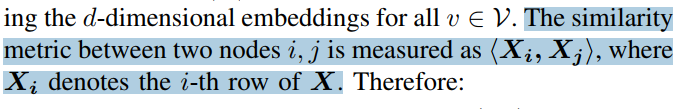

  - 

  - 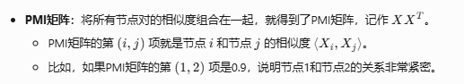

  - 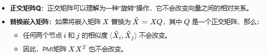

    推导：

    

  - !!! note
  -     ### **举个例子**
  -     
  -     假设你有一个社交网络，有 3 个用户：A、B、C。他们的嵌入向量如下：
  -     
  -     - A 的嵌入向量：*X* 1 = [1,0]
  -     - B 的嵌入向量：*X* 2 = [0,1]
  -     - C 的嵌入向量：*X* 3 = [1,1]
  -     
  -     也就是 $X \in \mathbb{R}^{3 \times 2}$
  -     
  -     #### **1. 计算相似度**
  -     
  -     - A 和 B 的相似度：⟨ *X* 1, *X* 2⟩ = 1×0+0×1 = 0
  -     - A 和 C 的相似度：⟨ *X* 1, *X* 3⟩ = 1×1+0×1 = 1
  -     - B 和 C 的相似度：⟨ *X* 2, *X* 3⟩ = 0×1+1×1 = 1
  -     
  -     #### **2. 构建 PMI 矩阵**
  -     
  -     PMI 矩阵就是：
  -     
  -     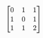
  -     
  -     - 第 (1,2) 项是 0，表示 A 和 B 不相似。
  -     - 第 (1,3) 项是 1，表示 A 和 C 相似。
  -     
  -     #### **3. 正交矩阵的作用**
  -     
  -     假设我们用一个正交矩阵 *Q* 旋转嵌入向量，比如：
  -     
  -     *Q* = [0110]
  -     
  -     新的嵌入矩阵 `X~=XQ` 就是：
  -     
  -     - A 的新嵌入向量：*X*~1 = [0,1]
  -     - B 的新嵌入向量：*X*~2 = [1,0]
  -     - C 的新嵌入向量：*X*~3 = [1,1]
  -     
  -     重新计算相似度：
  -     
  -     - A 和 B 的相似度：⟨ *X*~1, *X*~2⟩ = 0×1+1×0 = 0
  -     - A 和 C 的相似度：⟨ *X*~1, *X*~3⟩ = 0×1+1×1 = 1
  -     - B 和 C 的相似度：⟨ *X*~2, *X*~3⟩ = 1×1+0×1 = 1
  -     
  -     PMI 矩阵仍然是：
  -     
  -     
  -     
  -     也就是说，正交变换不会改变节点之间的相似度。

- PMI Matrix eigendecomposition for network embedding  

  - 由于上一章已经证明：X 乘上 Q 以后， PMI 不变，所以不用找 Q 矩阵
  - 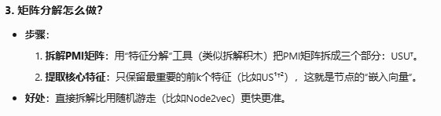
  - 后面关于特征向量没看明白
  - 结论是 PMI 矩阵分解比随机游走快

##### contribution

- an efficient mini-batch training method at the sub-graph level
  - can guarantee parallel training and satisfy the memory restriction for large-scale netlists
- Matrix-factorization based embedding learning  

##### data

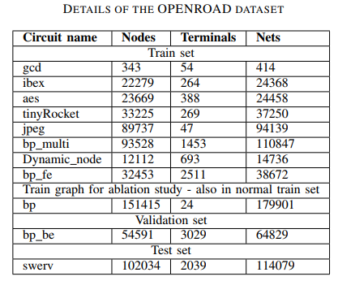

##### task

- during the logic synthesis stage  

- 

  到底是什么时候的 congestion 数据? Routing 后的真实值还是预测 plcament 后的 congestion RUDY 预测值? 应该是 **Global Routing** 后的: 强调了 congestion value = wiring demand/routing capacity

  

  

**contrbution**

##### data

DAC2012 contest benchmark

http://archive.sigda.org/dac2012/contest/dac2012_contest.html

OpenROAD dataset

- place via **DREAMPLACE**  

- 

- Macros and terminals are removed from the graph  

- Nets with degree more than 10 are excluded from the final graph as they introduce cliques too large to work with efficiently.   

- node features (pin number, cell size) , This follows the flow of CongestionNet

- 

- \#### flow

  

- congestion value for each grid cell computed as the wiring demand divided by the routing capacity , The output along the z-axis is reduced by a max function,   

- Our focus is on predicting congestion due to local logic structure, which manifests itself on lower metal layers. Therefore, we use congestion labels from the lower half of the metal layers to train and evaluate the model  

- 推理的时候取所有 cell 的预测平均值

   

**principle**

- 提出相连越近的节点相似度越高,

- 提出 structural node similarity  

  

- Sub-graph partition ? METIS? ClusterGCN?

- Matrix Factorization  ?

##### model

- The key **difference** between this approach and **CongestionNet** lies in **embedding** pipeline 

- graph is undirected complete circuit is too **large** for direct matrix factorization and must be **partitioned** into clusters, use **METIS** partitioning tool   in **ClusterGCN**
- Sub-graph partition: clusters of ≈ 5000 nodes each
- Matrix Factorization  ?

##### experiment

three metrics of correlation to measure performance:   **Pearson, Spearman, Kendall** 

Before evaluation, both the prediction and the label have some (very low) **noise** added to them.   

#### [PGNN-DRVs prediction+Pin Proximity Graph-ICCAD-2022-GNN+UNet(CNN)-Korea]()

##### background

- (1) pin accessibility and (2) routing congestion are two major causes of DRVs (design rule violations)  

- Particularly, the complex design rules put so much burden on physical design, demanding lots of iterations on the time-consuming process of cell placement and net routing to **clean up all DRVs (design rule violations)** before tapping out . Thus, at the placement stage, if we were able to identify, with high confidence, DRC (design rule check) hotspots that would be
  likely to occur at the routing stage, we can pay more attention  

- shortcoming of **image based**:

  local pin accessibility cannot be accurately modeled by pin pattern **image** alone  

  using high-resolution pin pattern images incur significant additional **run-time** as well as **memory** overhead to the prediction models  

- to optimize the placement before routing.  

##### task

a novel ML based DRC hotspot prediction technique,   

- GNN is used to embed pin accessibility information, **U-net** is used to extract routing congestion information from grid-based
  features  
- 
- 
- placement 分割为 grid, 长宽 = G-Cell
- DRVs are extracted as the ground-truth after **detailed routing**  

##### contribution

- GNN model, base pin proximity graph

##### model

PGNN can adopt pin proximity graph as well as grid-based feature map as input feature  

Pin Proximity Graph :

- 无向图， 同构图

U-Net:

featrue:

整体模型:

**数据集**:

以后也可以这么做, 同一个 benchmark 不同的 config 参数就有不同的数据

##### experiment

Nangate 15nm library  

9 groups are used for training and the remaining 1 group for test.   K 折验证

positive 和 negative 是什么意思?

可视化:

消融实验:

以后也可以这样用特征消融?

对比实验(F1-score):

- 注意不需要 GR!

- **GR-Cong** is obtained from ICC2 after global routing stage, and grids with high routing congestion are classified as DRC hotspot. 商用  
- RouteNet 和 J-Net 都是相关的学术工作

时间对比:

#### [LHNN-CongestionPrediction-DAC-2022-GNN-CUHK+Huawei+YiboLin]()

##### background

- 图的节点的设置很新颖
- with the growth of circuit scale and complexity, time consumption
  tends to be unacceptable when utilizing a **global router** in the placement cycle to obtain the **congestion map**.  
- due to the need for the **"shift-left"** in circuit design, researchers begin to seek alternative solutions in machine learning [4] [5] to achieve accurate and fast congestion map prediction  

##### task

- two related tasks, **routing demand regression** and **congestion classification**  

##### data

regard each **G-cell** **as a node** and add an edge between two nodes if the respective two G-cells are adjacent.  

**hypergraphs and heterogeneous  graph** , 两种节点：G-cell 和 G-net

- feature：

  

ISPD 2011 [16] and DAC 2012 [17] contest benchmarks , 

##### model

他这里说 congestion map 是一个二值化(0/1?)的数据集， 所以是分类任务, 但是为了利用数据，同时防止 routing demand 的信息丢失， 还设置了一个预测 routing demand 的任务？

##### experiment

15benchmarks: 10 for training and 5 for testing  

run **DREAMPlace** [18] on each of the designs to generate placement solutions 

**NCTU-GR 2.0** [2] to attain horizontal/vertical **routing demand maps**  , and set the **congestion maps** as a **binary** indicator according to whether the horizontal/vertical routing demand of the G-cell **exceeds the circuit’s capacity**  

对比实验：

可视化：

消融实验：

#### [ClusterNet- -ICCAD-2023--Korea]()

- Netlist as input

#### [MEDUSA-2D&3D-Trans-2023-CNN-Columbia  ](https://dl-acm-org-443.webvpn.scut.edu.cn/doi/pdf/10.1145/3590768)

- Routing congestion is one of the many factors that need to be minimized during the physical design phase of large integrated circuits. 
- compare with `c-DCGAN [33]` , which is GAN-based. One of the drawbacks of GANs, however, is that they are generally difficult to train and so the performance benefits that they may yield comes at a significant computing cost.  

##### background

- feature encoding algorithm.

  Features extracted from the routing topology are stored in a multi-layer hyper-image that preserves the circuit’s structural information

- a customized CNN   

  - takes our proposed hyper-image as inputs and produces congestion maps that are comparable to ground truth
  - simplified customized CNNs  

  

- embedded them with two open source routers

##### contribution

##### flow

##### model

- In 3D routing m = 16;   
- input feature:

  - Vertex related: Pin density and level-one pin density  
- Vertex-east-edge related: Wire density, wire usage, and wire capacity  
  - Vertex-north-edge related: Wire density, wire usage, and wire capacity  
- 3D information: Via usage and capacity.  
- Wire density是pattern routing的结果
  - pattern routing 具体是怎么做的？

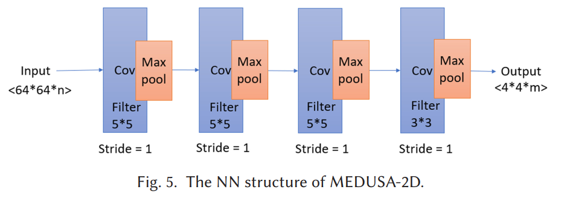

**CU-GR-M and UBC-Route**

- In the case of 2D routing, m = 2 ；
- the via feature is not considered when using MEDUSA-2D  

The cost functions of CU-GR [21] do not take into consideration the estimated via usage produced by MEDUSA-3D  

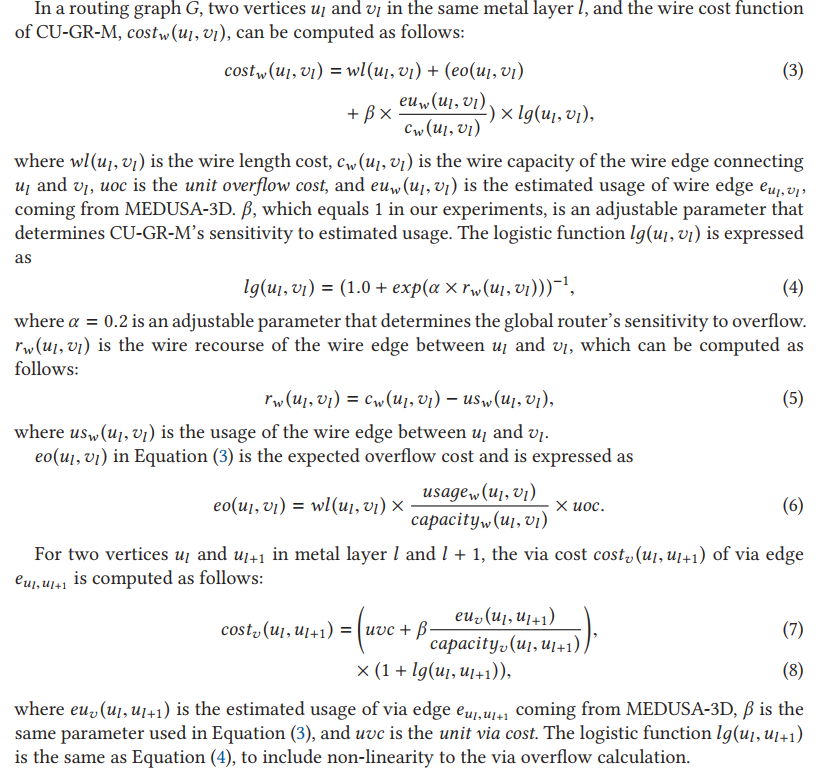

##### data

developed MEDUSA-3D, which is used with `CU-GR [21]` for performing 3D routing on `ICCAD 2019 benchmarks`   

MEDUSA-2D, was also developed to be used for traditional 2D routing using `ISPD 2008 benchmarks `[1].   

##### experiment

PD, NP, ND, LN, GN, and C are abbreviations for pin density, neighborhood pin density, net density, local net, global net, and capacity (both pin capacity and via capacity if applicable), respectively  

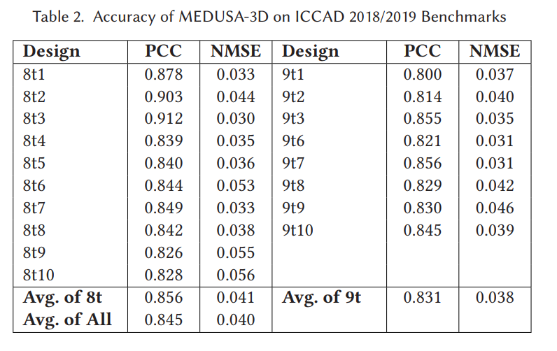

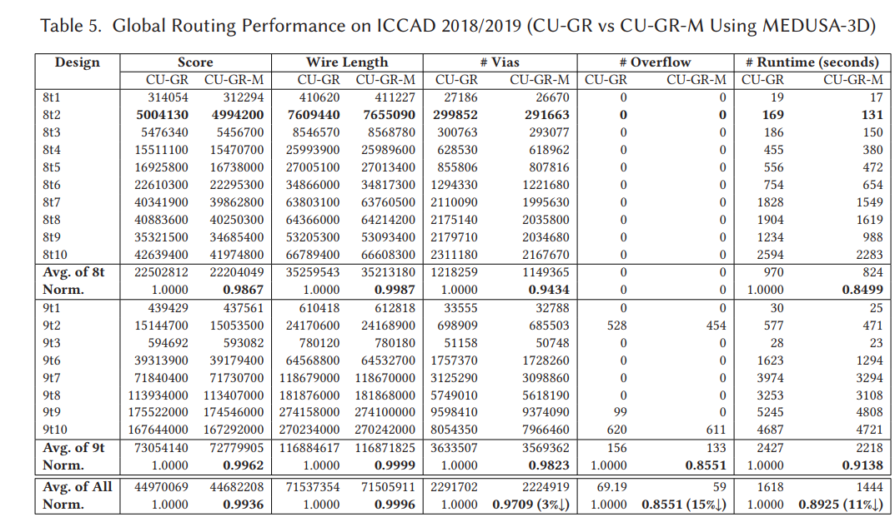

#### [-NN Robustness improve-arXiv-2024- -UC-]()

##### background

- 最近的工作已经证明神经网络通常是容易受到精心选择的输入小扰动的影响 
- Our definition of **imperceptibility** is characterized by a guarantee that a perturbation to a layout will not alter its global routing  
- recent work [10, 18] has demonstrated that image classifiers can be **fooled** by **small, carefully chosen** perturbations of their input  
- 

##### task

- design two efficient methods for finding perturbations that demonstrate brittleness of recently proposed congestion predictors  
- one potential approach to address the issues by modifying the training procedure to promote robustness

##### contribution

[Painting on PIacement-predict the routing congestion-ACM-2019-GAN-](https://ieeexplore.ieee.org/document/8807040)

[-DRC Hotspot Prediction-ISCAS-2021-CNN](https://ieeexplore.ieee.org/stamp/stamp.jsp?tp=&arnumber=9401274)

[-Routing Congestion Prediction-ASPDAC-2020-GAN](https://ieeexplore.ieee.org/stamp/stamp.jsp?tp=&arnumber=9045178)

- slice [FPGACong_ASPDAC20 (yibolin.com)](https://yibolin.com/publications/papers/FPGA_ASPDAC2020_Alawieh.slides.pdf)

[-predict #DRV, a macro placer-DATE-2019-CNN](https://ieeexplore.ieee.org/stamp/stamp.jsp?tp=&arnumber=8715126)

### Timing

#### background

#### [TimingGCN-STA prediction-DAC-2022-GNN](https://dl.acm.org/doi/abs/10.1145/3489517.3530597)

- the first work！
- opensource
- still relies on local net/cell delay prediction as auxiliary tasks  
- no optimization, not fit the real-world scenario where timing **optimization** is taken into account  

[PreRoutGNN-STA prediction-AAAI-2024-GNN](https://github.com/Thinklab-SJTU/EDA-AI/tree/main/PreRoutGNN)

- opensource

#### [Multimodal Fusion-Restructure tolerant+CNN+Endpoint-wise Masking4Layout -DAC-2023-GNN+CNN-7nm RISCV](D:\MyNotes\EDA\Timing\Multimodal Fusion-Pre Route Timing Prediction-DAC-2023-GNN-7nm RISCV.pdf)

[slice](https://www.cse.cuhk.edu.hk/~byu/papers/C167-DAC2023-PathPred-poster.pdf)

- Restructure：预测终点的延时，但是 Timing Opt 会改变网表结构(end point 不变）。对一个 Pre-routing 任务来说，输入的网表和最终的网表不一样

- netlist **restructuring** causes a mismatch between local input features and ground-truth features in the restructured sub-regions  

  

  As a result, prior local-view models can only be trained on the unchanged regions in a **semi-supervised manner**.  

  In other words, the better the models fit on labeled (unreplaced) net/cell delays, the worse they fit on replaced regions and eventually on endpoint arrival time  

- 数据集：基本信息和 Timing 优化导致的网表变化

  - average 40% nets and 21% cells are replaced during timing optimization  
  - timing optimization brings an average change of 59.6% to net delays
    and 33.3% to cell delays  

  

- 为什么用 layout 信息：Since most timing optimization techniques include gate insertion or gate sizing, placement should reserve space for subsequent timing
  optimization. In other words, the timing optimizer’s efficacy is tied closely to global layout information. The layout information plays a dominant role in determining the timing optimizer’s impact since most optimization
  techniques need space to be applied  

- 整体模型

  

  组成：**GNN+CNN+Endpoint-wise Masking**  

  - Netlist(GNN):

  

  和 [TimingGCN-STA prediction-DAC-2022-GNN](https://dl.acm.org/doi/abs/10.1145/3489517.3530597) 很像(没发现不同)

  - Layout(CNN+Endpoint-wise Masking)

    

    

    三个特征：cell density, rectangular uniform wire density (RUDY), and macro cells region  

    

    **Endpoint-wise Masking**  

    

- 对比实验：

  

  

  

- run time 实验

  

  

  

  

##### other

[Ahead RC network-STA prediction-DAC-2022-?](file:///D:/MyNotes/EDA/Timing/aheadRCnetwork.pdf)

[Doomed Run Prediction-TNS prediction-ACM-2021-GNN+RNN](https://ieeexplore.ieee.org/document/9643435)

##### not DL

 The two-stage approaches [2], [3] first predict localnet/cell delays and then apply PERT traversals [5] to evaluate the global timing metrics, i.e., endpoint arrival time.  

## Optimization

### Timing

#### [TSteiner - Steiner Points Opt-DAC-2023-GNN-CUHK]()

##### background

  对于 multi-pin net 需要构建 steiner tree 来进行 routing，故 steiner tree 中 steiner points 也会影响 routing

  FLUTE [[3\]](https://www.zhihu.com/question/579615273/answer/3154651342#ref_3) 是常用的生成 steiner tree 的算法。在生成 steiner tree 后，我们可以通过近一步优化 steiner point 来优化 timing

the previous early-stage timing optimization works only focus on improving
early timing metrics. 提出了诸如 net 加权和可微分时间目标等策略来优化时间, only focus on improving pre-routing timing metrics, which may have a considerable gap to **signoff** timing performance. 斯坦那点更加靠近布线阶段(和布线更加相关)

all the aforementioned works are not directly targeted at sign-off timing performance due to its high acquisition cost  

**任务:**

In this paper, we focus on explicit sign-off timing optimization at the pre-routing stage to reduce the turnaround time

optimization framework is built to adjust Steiner point positions  for better sign-off timing performance iteratively  

The most popular Steiner minimum tree construction algorithms aim to **minimize wirelength**. Moreover, the Steiner point refinement is introduced to update the generated Steiner point positions for specific objectives, e.g., sign-off timing performance, while maintaining the two-pin net connections

**启发:**

we surprisingly find that the signoff timing performance could be significantly affected even by a **random** disturbance on Steiner point positions, as shown in Fig. 2.  

Nevertheless, the impact of random moving is considerately unstable, and its average performance is slight (with a ratio close to 1.0).  所以启发找到一个好的方法来更新斯坦纳点来降低 TNS

在最广泛使用的技术节点中，与 **路径长度** 最相关的定时度量——净延迟，并不能解释大部分的整体定时性能. 这里用的初始化斯泰纳树的方法的优化目标都是路径长度最短

##### contribution:

- first  earlystage timing optimization framework   via Steiner point refinement
- GNN
- TSteiner framework is fully automated with an adaptive stepsize scheme and the auto-convergence scheme  
- improves 11.2% and 7.1% on average (up to 45.8% and 43.9%) for WNS and TNS

**模型:**

Steiner tree construction decomposes each multi-pin net into **a set of two-pin**
**nets** via additional Steiner points before global routing  to reduce the problem complexity

The proposed framework can be divided into two stages, **sign-off timing gradient generation** (Section III-A) and **concurrent Steiner point refinement** (Section III-B)  

  

和 TimingGCN 相比就是多了 Steiner 节点, 然后吧第一部分的的 node embedding 部分加上了 steiner 的部分

实际是: 

优化的指标, WNS 和 TNS 的加权

根据优化指标对斯泰纳点坐标参数做梯度下降

相比简单的梯度下降，只是减小了对不同 benchmark 的手动学习率微调

**数据**

**实验**

### Placement

#### [-Pin Accessibility+DRV prediction-DAC-2019-CNN-NTU]()

##### background

- Standard cells on the lower metal layers severely suffer from low routability due to high pin density, low pin accessibility, and limited routing resources.  

- 

  It can be observed that the access points of pin B are blocked by the metal 2 (M2) routing segments routed from Pin A and Pin C, so an M2 short design rule violation (DRV) will be induced when dropping a via12 on Pin B. pin accessibility is not only determined by cell layout design but also strongly affected by adjacent cells    

- 对于传统方法，两个缺点：

  - Cell libraries provided by foundries should not be considerably redesigned because the optimized cell performance and manufacturability may be highly sensitive to cell layouts  
  - Deterministic approaches based on **human knowledge have been shown to be less effective in advanced nodes** for optimization problems such as DRV prediction and minimization because of the extremely high complexity through the overall design flow  

- 

  It can be observed that most of the congested regions in the layout do not have DRVs, while some regions with DRVs are not so congested. 但是我感觉还是有相关性的。他是想说明 congestion 出现的地方不一定有 DRV，但是没 congestion 的地方可能因为 poor pin accessibility 导致 DRV

- 

  - 也是说明：congestion 出现的地方不一定有 DRV，但是没 congestion 的地方可能因为 poor pin accessibility 导致 DRV
  - the two M2 shorts occur at the locations having **the same pin pattern** in the top cell-row and mid cell-row  

##### task

- DRV prediction, 二分类

  

- pin accessibility optimization, 给一个合法化后的布局结构，通过算法进行减少 bad pin accessibility 的 detailed placement

  

- 其实也是一个预测模型，一个优化模型

##### contribution

- first work to apply pin pattern as the input features of `DRV prediction models`.  

##### flow

**model:**

PPR&DFPPR:

Model-guided Detailed Placement :

Dynamic Programming-based Placement Blockage Insertion  

- 还会改方向？

Cell Displacement Refinement

##### data

Both the width and height of each pixel are set as the **minimum spacing of the M1 layer** in order to prevent a pixel from being occupied by two different pins. 

没看见关于 benchmark 的描述

##### experiment

**shortcoming:**

- flow need routed designs to train, time 
- The trained model is not necessarily applicable to other designs using different cells or different reference cell libraries  
- 对于 VLSI，一行一行，一对一对进行，很慢？

#### [-Pin Accessibility+activ-ISPD-2020- -NTU+Synopsys](https://pdfs.semanticscholar.org/47f1/5e9fa283faddb8a6853398145d33e2ba9ae1.pdf)

##### background

- With the development of advanced process nodes of semiconductor, the problem of ` pin access ` has become one of the major factors to impact the occurrences of design rule violations (DRVs) due to complex design rules and limited routing resource  

- `supervised learning` approaches extract the labels of training data by generating a great number of routed designs in advance, giving rise to large effort on training data preparation. the pre-trained model could hardly predict unseen data    

- Unlike most of existing studies that aim at `design-specific` training, we propose a `library-based` model which can be applied to all designs referencing to the same standard cell library set.   

- Due to the shrinking of modern process nodes of semiconductor, the **pin access problem** of standard cells has become more harder to be coped with, especially on the **lower metal layers**.  

- 

  在这种 placement 下，Metal1 pin A/B 由于各自左右两边在 Metal2 有 pin，而且只能在黄色 track 下横向绕线，（Metal1 不能绕线？），那么 Pin A/B 通过 Via12 后必定会短路

- 19 年工作 [5] 的两个缺点

  - flow need routed designs to train, time 
  - The trained model is not necessarily applicable to other designs using different cells or different reference cell libraries  

##### contribution

- first work of ` cell library-based` pin accessibility prediction (PAP), which can be applied to predict other designs referencing to the same cell library set
- applies **active learning** to train a PAP model  
- the proposed cell library-based PAP model **can be trained at the earlier stage** in a process development flow: once the cell libraries are provided.  

#### [Placement Optimization with Deep Reinforcement Learning- -ISPD-2020-RL+GNN-Google]([dl.acm.org/doi/pdf/10.1145/3372780.3378174](https://dl.acm.org/doi/pdf/10.1145/3372780.3378174))

#### [PL GNN-Affinity Aware for ICC2- ISPD-2021-GNN-Atlanta](https://dl.acm.org/doi/pdf/10.1145/3439706.3447045)

##### background:

- Placement is one of the most **crucial problems**,  placement directly impacts the final quality of a full-chip design

- multiple placement **iterations** to optimize key metrics(WL, timing), which is **time-consuming** and computationally inefficient, VLSI

- the ` logical affinity` among design instancesdominates the quality of the placement

  

  ` logical affinity` 源于这篇文章？

- performing **placement guidance** requires in-depth design-specific knowledge, which is only achievable by **experienced designers** who knows the underlying data flows in Register-Transistor Level (RTL) well  

- 

- K-means 基础：

  - 

  - 

##### task

- 基于网表数据，和 floorplan 结果（marco 已经放好）
- `placement guidance`(grouping information) for commercial placers `ICC2`, by generating **cell clusters** based on **logical affinity** and manually defined attributes of design instances  
- our framework will determine the ` cell clusters` in an **unsupervised** manner which serve as placement guidance in order to guide commercial placers to optimize the key metrics such as **wirelength, power, and timing** by placing cells with a common **cluster** together

##### flow

**Two stages:**

1. GNN do unsupervised node representation learning, (it is generalizable to any design)

2. `weighted K-means clustering algorithm [3]` to group instances into different clusters。To find the optimal number of groups for clustering, we introduce the `Silhouette score [19]` and perform sweeping experiments to find the sweet spot  

   K-means 算法的基本思想是：通过迭代的方式，将数据划分为 **K 个不同的簇**，并使得每个数据点与其所属簇的质心（或称为中心点、均值点）之间的 **距离之和最小**。

##### data

two multi-core CPU designs：

**nf**

- **design hierarchy** : 根据网表层级. top/inst1/sky130_INV/A. (同时 zero-padding)

  

- **logical affinity of memory macros** ：logical levels to memory macros 𝑀 as features. because the logic to memory paths are often the critical timing paths  

**ef:**

##### model

- GraphSAGE-based， two layers

  

  

- Loss Function:

  

  

  

**Silhouette score**  

用于评估分类结果，扫描分类数目，选择最高的分的

##### experiment

**env**:

- 2.40𝐺𝐻𝑍 CPU   
- NVIDIA RTX 2070   
- 16𝐺𝐵 memory.  
- PyTorch Geometric   

**setting:**

- the placement of memory macros is achieved manually based on design manuals provided by the design-house  
- Adam   

**result**

Louvain：比较实验对比模型

**Question**:

benchmark 少

扫描到的就适用所有？

开环？

#### [-Innovus PPA placement optimize-Neurips-2021-RL ](https://www.semanticscholar.org/paper/A-General-Framework-For-VLSI-Tool-Parameter-with-Agnesina-Pentapati/30c644ffa213418182e795ea5e8132cb15e891c2)

##### contribution:

#### [-GP Routability Opt-DAC-2021-FCN-CUHK(SitingLiu BeiYu)+Yibo Lin]()

##### background

##### flow

1. three input features are extracted from the cell placement solution  
2. Through the inference of the pre-trained routability prediction model, we get the predicted congestion map.  
3. take `mean squared Frobenius norm` of this congestion map as the congestion penalty

##### data

##### model

#### [Lay-Net- -ICCAD/TCAD-2023/2025-GNN/ViT-CUHK-](https://ieeexplore-ieee-org-443.webvpn.scut.edu.cn/stamp/stamp.jsp?tp=&arnumber=10323800)

- [OpenSource!](https://github.com/lanchengzou/congPred#)
- heterogeneous message-passing paradigm better embeds the routing demand into the model by considering both connections between cells and overlaps of nets  
- TCAD 比 ICCAD 多了contrastive learning和miniGnet

##### background:

- To accurately model the congestion, placers commonly integrate routing processes [14]–[17] or analytical models [18]–[21] to estimate the congestion. However, the `routing-based methods` are plagued by considerable runtime overhead while the `model-based approaches` suffer from low accuracy

- key module

  - Swin Transformer
    - 详情查看[CNN](../NN/CNN/cnn.md)

  - UperNet[42]

  - feature pyramids[41] and Pyramid pooling module (PPM) [43]  

- motivation:
  - ==multimodal== fusion of layout and netlist features has not been extensively. Existing models cannot effectively aggregate the information given by cell locations and net connectivity.   
  - most methods can only utilize ==local information==  
    - `vision-based models` predict congestion by extracting local features with convolutional layers, which lacks a global view of the routing demand  
    - `over-smoothing problem of GNN` [33] limits the collection of long-range information  
  - existing GNN models(LHNN) overlook the routing demand arising from the ==overlaps of nets==, which is a crucial factor contributing to routing congestion.  
    - the `cell-to-cell` or `cell-to-net` links in existing approaches cannot directly model the physical routing demand in GNNs  

##### contribution

- a ==multimodal== congestion prediction model  

  - gathering diverse information that can indicate routing congestion

- ==hierarchical== feature maps 

  - address the limitation of local information  

- ==net-to-net== message passing

  - Cell-to-cell and cell-to-netconnections can reflect the logical relationships betweenthe circuit components. Net-to-net connections can imply the physical relationships between the nets

- first ==contrastive learning== 

  

##### flow

##### model

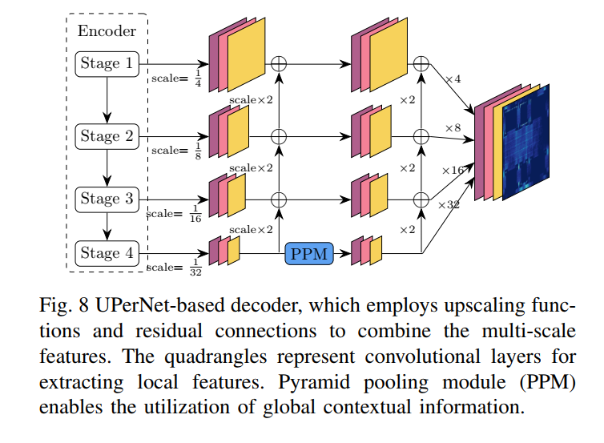

###### task:

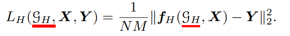

###### Multi-scale Feature Extraction  

Lay-Net extracts multi-scale features via `four stages`, which are based on Vision Transformer (ViT) [34] and Swin Transformer [35].   

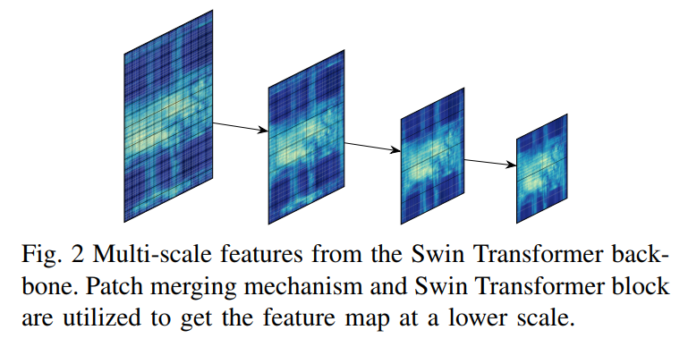

###### `ViT` and `Swin Transformer`

capture ==global information==  

##### graph

!!! note
    边的数量级会很大吧？

!!! note
    少见的

##### feature

###### contrastive learning  

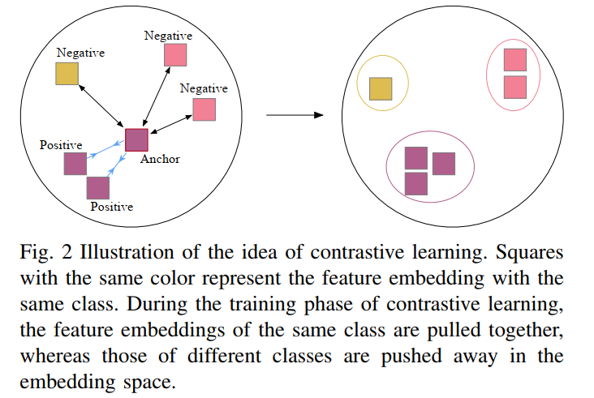

###### experiment

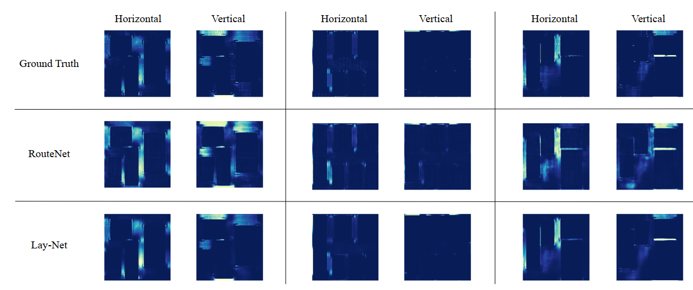

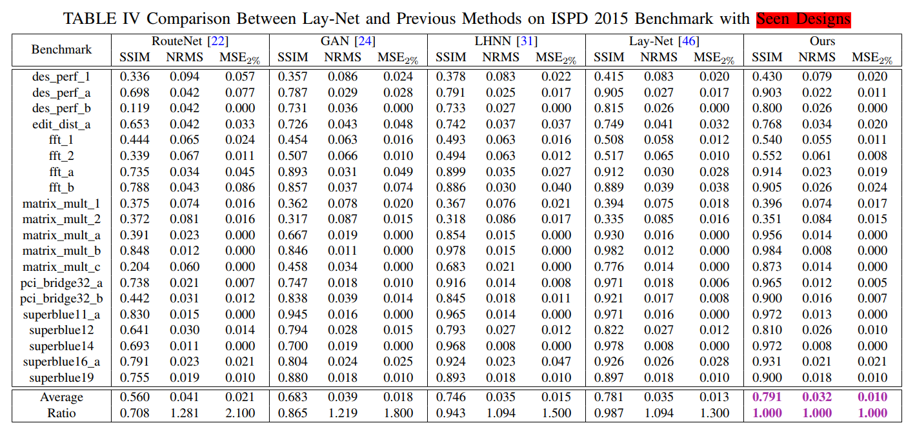

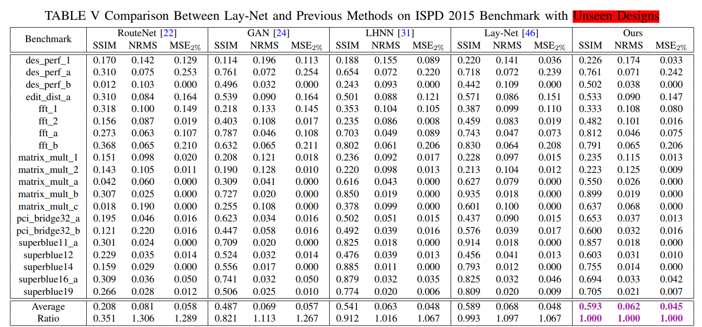

!!! note
    怎么变少了

#### [-Congestion+ViT+GNN-TCAD-2025--Southeast]()

- congestion prediction model-based placer optimizer
- 和`Lay-Net`很像
- HGCN+CNN

##### background

- previous way:

  - static-based  

    directly estimate routing congestion based on placement attributes (such as pin density and net overlap) without performing actual routing  

    such as `RUDY`  

  - probabilistic-based  

    calculate the probability of routing topology of each net based on pattern routing (such as L-shaped or Z-shaped routing) to estimate the congestion  

    such as 

  - tool-based  

    calling global routing tools  

    congestion maps obtained by the first two categories of methods are often not accurate enough  

    precise but time-consuming  

- purely image-based models [4], [9], [13], [14] may fail to incorporate critical netlist information,   

- there have been efforts to address the congestion prediction problem using graph neural network  [15], [16], [17]  

- the homogeneous GNNs may exhibit poor performance when handling diverse netlists simultaneously  

  !!! warning
      
      他没解释这个是为什么，也没引用

- Recently, `multimodal fusion-based models` have attracted much attention due to their ability to provide various perspectives [19], [20], and current multimodal fusion-based congestion prediction models have demonstrated notable performance [8], [12]. However, they still lack the deep multimodal fusion of placement and netlist features  

- `Lay-Net` may still fall short in extracting deep features and restoring congestion maps effectively.   

  `Lay-Net` only utilizes MLP layers to simply connect transformer and HGNN layers, thus may fail to exploit the potential of deep multimodal feature fusion.  

- 其他领域多模态融合的方法[19],[20]

##### contribution

- dual multimodal fusions  
- early `feature fusion (EFF)` method: merge `HGCN+CNN`
- deep `feature fusion (DFF)` method: self attention `(SA)` [22] cross-attention `(CA)` [23] to perform cross-modal feature fusion 

##### flow

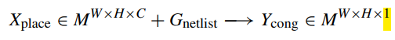

##### model

**CNN** input

**ResNet50**  

**Graph**

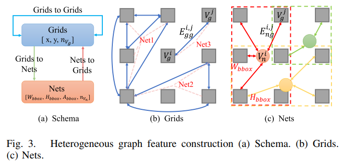

**GAT**:

文章一堆相关公式

**EFF:**

**DFF:**

patch embedding

self attention `(SA)` [22] cross-attention `(CA)` [23]

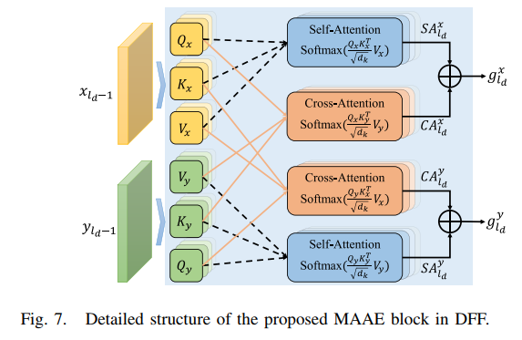

**Cascaded Decoder:**

##### data

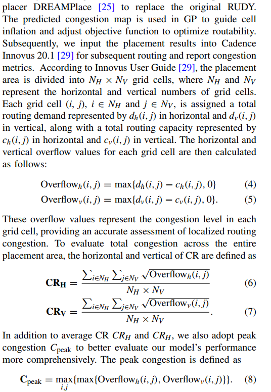

ISPD 2015 Contest

##### experiment

- 基于`DREAMPlace`

- 还在`innovus`做了`routing`

- loss function: `MMD`

  

- dataset augmentation  

- cross-validation

  

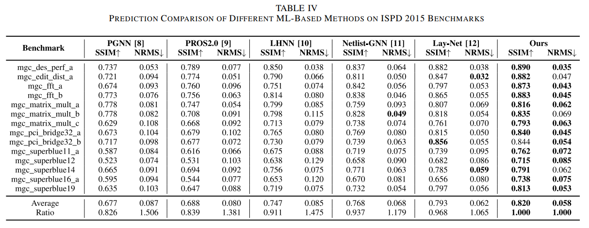

### Gate Sizing

#### [-Differentiable Fusion GP&GS-ICCAD-2024--PEK-Du&Guo&Lin]()

- 最佳论文提名

##### background

- 之前是分开做的， current methodologies typically explore `gate sizing` after the `placement` or `routing` is fixed。

  - restricts the ==exploration space== for `gate sizing`.  
  - Adjustments to gate sizes will sabotage the optimization efforts during earlier stages since the resized gates may not fit the original placement or routing layout.   
  - ==time-consuming==  

-  `gate sizing` has become more challenging due to the ==NP-hard== combinatorial optimization problem [1] for PPA trade-offs required in the large and discrete design space.  

- Innovus and OpenROAD 都是分开做的

- “shift-left” approach [4], suggesting that circuit constraints and performance should be considered in earlier stages of the design flow.   

- 难点：`gate sizing` is ==discrete== in nature  

- 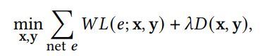

- 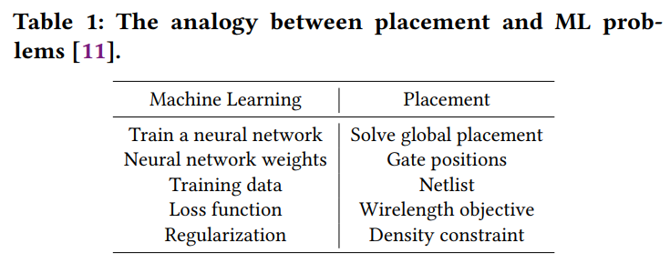

- Previous timing-driven gate sizing methods works' category

  - Dynamic programming-based methods

    - such as [21–23].   
    - only achieve optimal solutions for tree-structured circuit topologies and have limitations with reconvergent paths.  

  - Sensitive-based methods.   

    - Works like [24–26]   
    - entirely heuristic, with outcomes heavily reliant on the feasibility of the initial sensitivity knowledge  

  - Learning-based methods.   

    - reinforcement learningbased methods [27], generative AI-based methods [28], graph convolutional methods [29, 30], and deep learning-based methods [31]   

    - employ the prevailing learning tricks, the performance of these datadriven models may be compromised once they are applied to other cell and timing libraries. Also, a huge amount of retraining time is unbearable for current fast-paced commercial design cycles. 

    - !!! note
    -     感觉以后做非学习的模型都可以这么说？

  - Heuristic methods improved by Lagrangian relaxation (LR)- based formulation 

    - [32–40]
    - achieved remarkable success in the past decade. By relaxing the timing constraints in the objective function and employing the Karush-KuhnTucker (KKT) optimality conditions, the search space can be greatly pruned.     
    - However, they still resort to heuristics and local search to derive a suboptimal solution, which can be ==slow== on large designs due to the sequential nature of gate sizing adjustments.  
    - [39] introduced a learning-driven methodology that reduced the initial heuristic search space to accelerate the algorithm. [35, 37, 38] focused on enhancing the efficiency of these processes.  

##### contribution

- the ==first== framework that fuses the optimizations of gate positions and gate sizes with ==differentiable== objectives
- leverages `interpolation`, `gradient descent`, and `GPU-accelerated` computation to optimize `timing` and `power` objectives efficiently
- making discrete gate sizes continuous 

##### flow

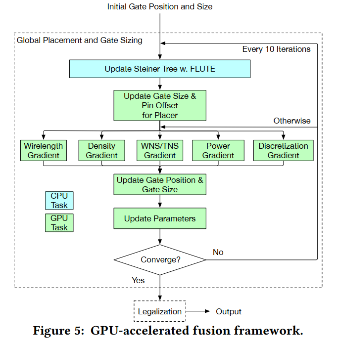

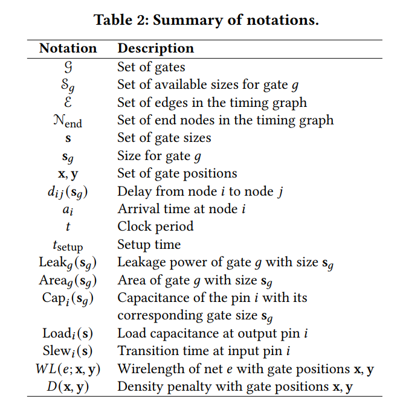

##### model

###### 优化任务：

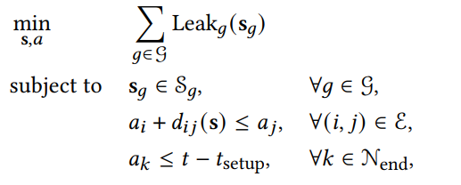

minimize a design’s total `leakage power` while satisfying `timing` constraints  

- 只有静态功耗？

###### problem formulation

Given a set of `gates` and an `initial placement layout`, the objective is to minimize total ==leakage power== and the absolute values  of ==TNS and WNS== by simultaneously determining gate positions `x, y` and gate sizes `s`.  

###### key novelty

加上了s

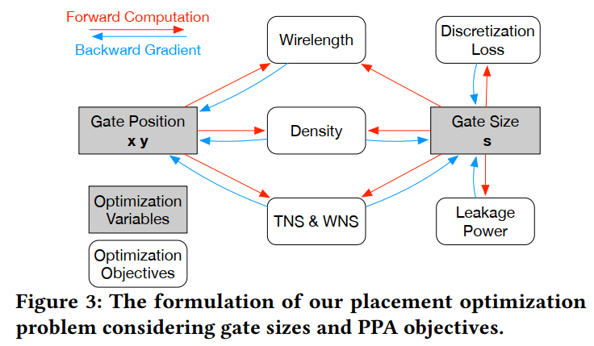

!!! note
    线性的。这里感觉还有开发空间

###### Differentiable Leakage Power

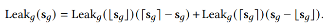

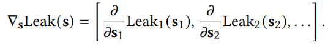

###### Differentiable Timing Objectives  

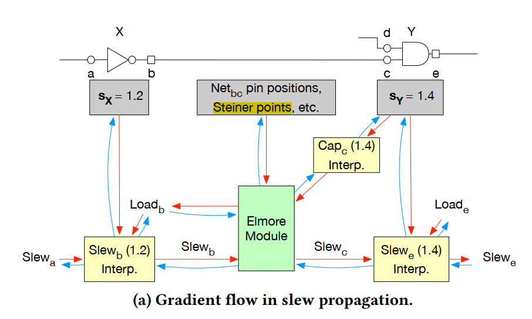

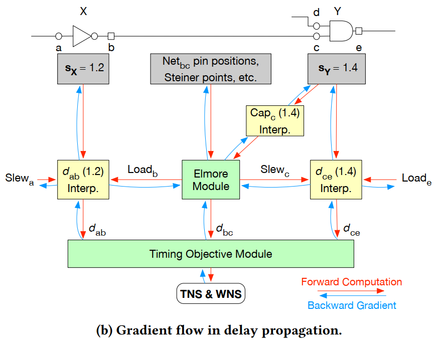

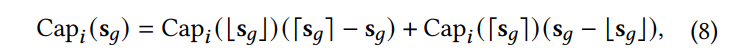

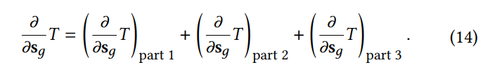

##### dataset

CircuitNet-N28  

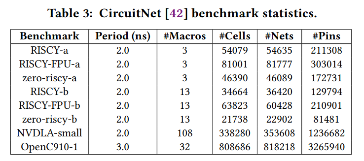

##### experiment

compare our newly developed flow with the open-source OpenROAD [3] flow  

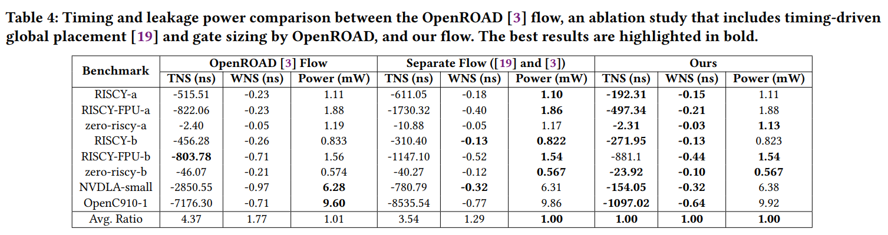

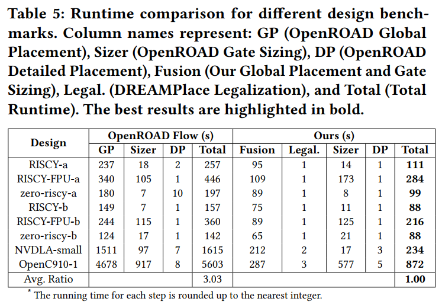

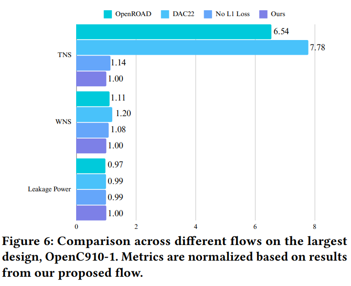

#### [-Gate Sizing Differentiable-ISEDA-2025--PEK]()

- 2024 ICCAD CAD gate sizing contest  

##### background

- `continuity` and `expressivity` limitations  

  - continuity: as almost all core VLSI tasks—such as logic optimization, placement, and routing—require discrete solutions that conflict with the continuous nature of differentiable frameworks.  无法梯度下降

- Prior research on gate sizing generally falls into the following categories:
  - Dynamic programming-based methods  
    - [19]–[21]  
    - falter with general circuits containing reconvergent paths.  
    
  - Sensitivity-based method  
    - [22]–[24]  
    - based on initial sensitivity estimates
    - relies heavily on the quality of heuristics
    
  - Learning-based methods  
    - including RL [25], generative AI [26], and GCN [27]
    - incur time-consuming retraining when transferred to different technology libraries
    
  - Heuristic methods with Lagrangian relaxation (LR)   
    - [30]–[38]
    - reduce the search space using KKT conditions but often rely on slow, local searches and gate-by-gate iterations.
    
  - differentiable methods [5]–[7]   
  
    - their discrete size of gates mismatches with continuous gradient descent method  
    - only guarantee their optimization efforts in their own analyzing model outcomes  
  
    

##### contribution

- a  `gradient clipping strategy` to tackle the `continuity limitation`  
- a  `gradient calibration framework` to address the `expressivity limitation`  

##### flow

###### problem fomulation

- a set of gates and detailed placement layout  
- determine the size `s` of all gates in order to minimize total leakage power while eliminating DRVs and timing violations.   

##### model

###### 优化目标：

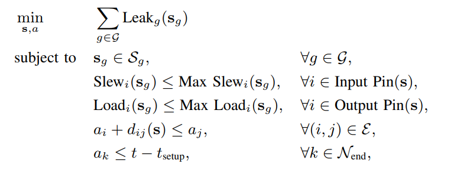

###### quality score  

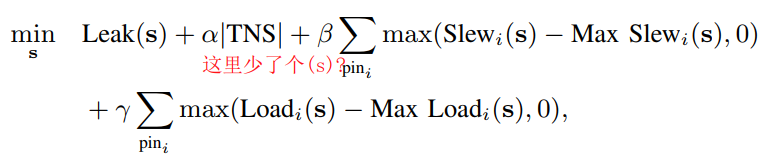

###### Linear interpolation

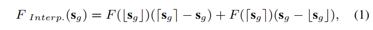

!!! note
    线性的。这里感觉还有开发空间

###### Differentiable Power and Area Objectives

###### Differentiable DRV and Timing Objectives  

##### continuity limitation

With a deeper circuit logic level, this inaccuracy would be amplified  

`Gradient Clipping Solution`  

一个更直观的例子：如果全部gatesize都是四舍，那一定会有很大误差

1. initially, all gate sizes are set to minimal. 
2. In each iteration, we upsize the top k~1~% gates with the smallest gradients, as these gates will ==most likely benefit== from adjustments；
3. Conversely, to mitigate unnecessary area and power consumption, our algorithm also downsizes the top k~2~% gates with the largest gradients, which are supposed to be oversized gates.   这是什么原理？

!!! note
    启发式人工超参数又出现了

###### expressivity limitation

gradient calibration  

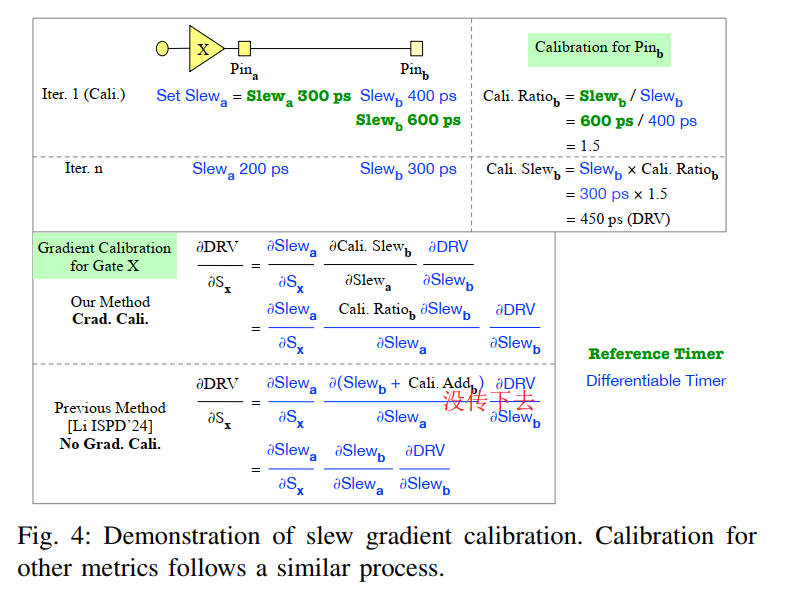

!!! note
    可以用到类似的其他工作中

在第一次迭代的时候使用Reference Timer进行对齐一次，计算一个Calibrate比例参数。通过相乘而不是以前工作的相加，让参数传递，最后对齐商业工具，而不是简单的数学模型

!!! note
    但是迭代越久会越不准？

 

###### data

2024 ICCAD CAD gate sizing contest  

post-placement 之后的数据

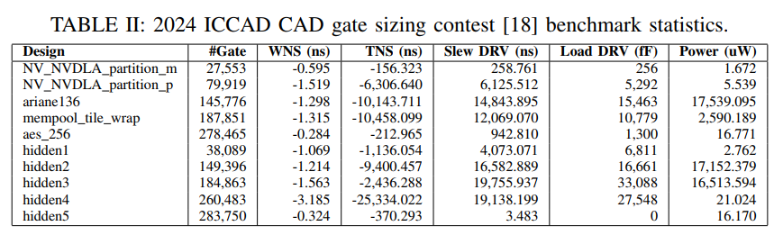

基于以上数据，进行detail placement 和global routing （使用OpenROAD）

##### experiment

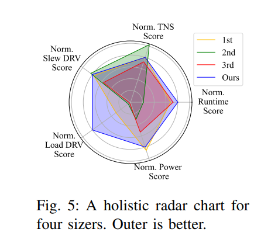

在大规模电路上效果更好：For the first three cases, their smaller scale increases the variability in gate sizing optimization results, thus making it difficult to achieve consistently optimal outcomes  

### GR

#### [PROS-Routability Optimizatio

##### task

- congestion **predictor** and parameter **optimizer**
- only the data from the placement  
- it can optimize the cost parameters before the first routing iteration of GR and thus can give a better GR solution with less congestion.  

##### contribution

- with negligible runtime overhead  
- plug-in
- can be embedded into the state-of-the-art commercial EDA tool (Cadence Innovus v20.1)   

##### model

##### data

19 different industrial designs  

通过 **不同的 placement 参数和旋转**（CNN 原理），一共有 1664 design cases in total.  

**Feature Extraction**  

- Horizontal/Vertical track capacity map  

- Cell density map

- Flip-flop cell density map  

- Fixed cell density map  

- Cell pin density map  

- Pin accessibility map  

  

  - Horizontal/Vertical net density map  

  - Small/Large-net RUDY map  

  

- Pin RUDY map

  a combination of cell pin density map and large-net RUDY
  map  

**Label Generation**  

 PROS does not need very detailed congestion map   

two-step smoothening process to convert raw data to desirable congestion labels  

help to make the prediction task easier  

if there are at least six congested G-cells out of the eight in the surrounding of a center G-cell д, д will be labeled as congested  

**优化原理**

这两个值在 cadence 怎么改的? cadence 企业内部自己弄的（这是 cadence 的文章）？

##### model

##### experiment

#### [PROS 2.0 - Routability Opt+Route WL estimation-Trans-2023-CNN-CNHK+Cadence]()

##### background

- the amount of routing resources on a design is limited.   
- The quality of a GR solution has a great impact on that of the resulted DR routing solution  
- Congestion in a GR solution is one of the major causes of DRC violations in the DR
  solution since most of DRC violations are due to overcrowded wires and vias [1], [2]  
- a better GR solution with less congestion is needed to lower the probability of getting DRC violations in advance. 
- if the initial GR solution is not good and has a lot of congestion, the GR tool can hardly tackle the problem by rip-up and reroute.  
- placement engines **[3]–[5]** which take routing congestion into consideration are applied  
- FCN: FCN 常用于图像中的每像素分类问题。采用 **任意输入大小**，并产生大小完全相同的输出。GR 拥塞预测也可以被视为任意大小的芯片设计上的像素二进制分类问题（拥塞与否）。因此，基于 FCN 的预测器可以自然地应用于 PROS。

##### task

- stage: post-placement, pre-route
- FCN based GR congestion `predictor`, use the predicted GR congestion to optimize the **cost parameters** of GR. 
- predictor based `parameter optimizer` to generate a better GR solution. GR tools are driven by the cost parameters stored in each G-cell. When arriving at a G-cell g, the tool will compute the cost, called `moving cost`, to move to each of its neighboring G-cells and push these costs into a heap. With optimized cost parameters in G-cells, the GR tool can find better paths and allocate the routing resources to each net more smartly. PROS optimizes two types of cost parameters **based on the prediction result**, including `overflow cost` and `wire/via cost  `.  PROS will adjust the cost parameters in the projected congestion regions on **all layers**  
  - overflow cost
  - wire/via cost: divided into two groups (small/large) according to their BBox sizes. 
    - Increasing the wire/via cost for small nets may be **useless** for congestion reduction and it may even increase the wire length or create new congestion due to detours out of the potential congestion region.  
    - In contrast, increasing the wire/via cost for large nets can be helpful since
      they can select another route within its BBox to completely avoid the potential congestion region
- CNN based  `wirelength estimator  `,  By **multiplying** the predicted wirelength ratio and the precomputed `FLUTE ` wirelength  (训练一个系数). The lack of consideration of routing congestion in traditional methods is due to the dif ficulty of quickly obtaining accurate congestion estimation at the placement **stage**

##### contribution

- plug-in for Innovus:  it can avoid extra runtime overhead of feature preparation  
- industrial design suite   
- advanced technology node  
- SOTA
- high accuracy
- first work that 
- utilizes the information of GR congestion to estimate routed wirelength at the placement stage  
- PROS does not change a lot for the original EDA steps  

**Overall Flow** :

分类和回归

- F is the feature number.  
- X~WL~ has two features:  These two features will be resized to 128 × 128 before prediction  
  - the **predicted** congestion map 
  - the cell pin density map   

##### data

feature F 

- Horizontal/Vertical Track Capacity Map  

- Cell Density Map  

- Flip-Flop Cell Density Map

- Fixed Cell Density Map  

- Cell Pin Density Map  

- Pin Accessibility Map  

  

- Horizontal/Vertical Net Density Map

  

- Small/Large-Net RUDY Map  

  

- Pin RUDY Map ?

**label**

**congestion label  pre-process**

PROS does not need a very detailed congestion map

最后还是为了优化服务的

##### model

- DC: get more local information, but more GPU usage(acceptable)
- SUB: w\*h\*4c –> 2w\*2h\*c.
  - Compared with bilinear upsampling which is not trainable, subpixel upsampling can learn to recover the local information.
  - Compared with deconvolution, subpixel upsampling is parameter free, so
    it will not significantly increase the training difficulty.  

**dataset**

industrial benchmark suite and  DAC-2012  benchmark suite(19 个 benchmark)

industrial benchmark suite 通过 11 种不同布局参数，翻转和旋转，制造了一共有 1664 个(约等于 19\*11\*8)benchmark

DAC-2012 20 different placements  

(4, 4, 4, 4, 3)  5 折交叉验证

##### experiment

**env**

- Tensorflow  
- Intel Xeon CPUs at 2.2 GHz  
- 256 GB memory  
- NVIDIA TITAN V GPU  

**setting**

- Adam

- One entire training process of the congestion predictor has 25 training epochs! 这么少（收敛好快）  

  

**congestion classification prediction**

compare with PROBABILISTIC METHODS  

**DR 优化结果**

**线长估计**

**Runtime**

#### DR

#### [-Detailed Router-DATE-2021-RL](https://ieeexplore.ieee.org/document/9474007)

#### [DPRouter-Detail Routing(package design) Opt+net order decision-ASPADC-2023-RL(MARL)-diagonally route]("D:\MyNotes\EDA\Routing\DPRouter-Detail Routing(package design) Opt+net order decision-ASPADC-2023-RL(MARL)-diagonally route.pdf ")

- BackGround

  - most time-consuming stages in the **package design** flow  
  - package designs have fewer layers; thus, we need to prevent net crashing cautiously  

- contrbution:

  - redefine the routing area and shrink the routing problem by dividing the entire design into **non-overlapping boxes**  
  - use DRL, not heuristic
  - prove the number of design rule violations (DRVs), wirelength and layout pattern.  

- task

  - 2-pin nets  

  

  

  Initial routing: ignores the number of bends and allows design rule violations  

  

- Model

  multi-agent deep reinforcement learning (**MARL**) task [15] for **asynchronous** routing planning between nets. We regard each net as an agent, which needs to consider the actions of other agents while making pathing decisions to avoid routing conflict  

  

  

  route and slide the window repeatedly. advantage of box: process every box independently  

  - sequential routing  

    

    

    

    

    the repulsion point will be moved from the inner ring to the outer one until the box is successfully routed.   

    具体算法：

    

  - sequential routing  

    

    - 
    - 

  - Refinement

    

    

#### [-Detail routing+match+Opt-ISPD-2023-RL+GNN-FinFET ]()

##### background:

- cutom circuits: a custom detailed router cannot adopt specialized layout strategies for specific circuit classes like human layout experts  

- 

- 

- 

- 一直在强调 match 的问题：

  

##### contribution

- opt roouting, FinFET, sign-off solution
- 异构图
- A rip-up and re-routing scheme  
- can easily adapt to future design constraints  

**three categories  of routing methodologies**  

1. Template-based methods 
   - manual design  
   - suffers from scalability issues   
2. Simulation-based techniques  
   - provide accurate performance feedback and can be generalized to consider various performance metrics (e.g., phase
     margin, power dissipation) across circuit classes  
   - long execution time and resource-hungry computations  
3. Constraint-based approaches  
   - widely adopted in existing custom routing studies  

## PR Tools

### GP_Trad

#### [NTUplace4h- -TCAD-2014-]()

#### [ePlace- -TODAES-2015- ]()

#### [Replace- -TCAD-2018-]()

#### Generalized augmented lagrangian and its applications to vlsi global placement

#### [Chip Placement with Deep Reinforcement Learning-marcro-arXiv-2020-RL](https://arxiv.org/pdf/2004.10746)

- first explores the application of artificial intelligence in solving placement with the attempt to ease the difficulties of manual effort, which may indicate a new development stage for physical design  

#### [Differentiable-Timing-Driven Global Placement-global placement-DAC-2022-GNN-](https://dl.acm.org/doi/pdf/10.1145/3489517.3530486)

#### [Polar 2.0](https://ieeexplore.ieee.org/document/6881450)

 An effective **routability-driven** placer

cells that are estimated to have high congestion are spread out and inflated to distribute routing demand more evenly.  

#### NTUPlace3

#### [DeepPlace](https://github.com/PKUterran/DeepPlace)

##### flow

#### [RePlAce--TCAD-2018-](https://ieeexplore.ieee.org/abstract/document/8418790)

### GP_Adv

#### [DREAMPlace-GPU Accelerate-DAC+TCAD+ICCAD+DATE-2019~2023](https://github.com/limbo018/DREAMPlace)

##### background

- open up new directions for  GP
- current placement usually takes hours for large designs  
- Although `analytical placement` can produce high-quality solutions, it is also known to be relatively slow  

##### contribution

- a totally new perspective of making analogy between placement and deep learning
- Over `30X` speedup over the CPU implementation ([RePlAce](https://doi.org/10.1109/TCAD.2018.2859220)) is achieved in global placement and legalization on ISPD 2005 contest benchmarks
- DREAMPlace runs on both CPU and GPU. If it is installed on a machine without GPU, only CPU support will be enabled with multi-threading.
- DREAMPlace also integrates a GPU-accelerated detailed placer, ` ABCDPlace`, which can achieve around `16X` speedup on million-size benchmarks over the widely-adopted sequential placer [NTUPlace3](https://doi.org/10.1109/TCAD.2008.923063) on CPU.

**Publications**

- [Yibo Lin](http://yibolin.com/), Shounak Dhar, [Wuxi Li](http://wuxili.net/), Haoxing Ren, Brucek Khailany and [David Z. Pan](http://users.ece.utexas.edu/~dpan), "**DREAMPlace: Deep Learning Toolkit-Enabled GPU Acceleration for Modern VLSI Placement**", ACM/IEEE Design Automation Conference (DAC), Las Vegas, NV, Jun 2-6, 2019 ([preprint](http://yibolin.com/publications/papers/PLACE_DAC2019_Lin.pdf)) ([slides](http://yibolin.com/publications/papers/PLACE_DAC2019_Lin.slides.pptx))
- [Yibo Lin](http://yibolin.com/), Zixuan Jiang, [Jiaqi Gu](https://jeremiemelo.github.io/), [Wuxi Li](http://wuxili.net/), Shounak Dhar, Haoxing Ren, Brucek Khailany and [David Z. Pan](http://users.ece.utexas.edu/~dpan), "**DREAMPlace: Deep Learning Toolkit-Enabled GPU Acceleration for Modern VLSI Placement**", IEEE Transactions on Computer-Aided Design of Integrated Circuits and Systems (TCAD), 2020
- [Yibo Lin](http://yibolin.com/), [Wuxi Li](http://wuxili.net/), [Jiaqi Gu](https://jeremiemelo.github.io/), Haoxing Ren, Brucek Khailany and [David Z. Pan](http://users.ece.utexas.edu/~dpan), "**ABCDPlace: Accelerated Batch-based Concurrent Detailed Placement on Multi-threaded CPUs and GPUs**", IEEE Transactions on Computer-Aided Design of Integrated Circuits and Systems (TCAD), 2020 ([preprint](http://yibolin.com/publications/papers/ABCDPLACE_TCAD2020_Lin.pdf))
- [Yibo Lin](http://yibolin.com/), [David Z. Pan](http://users.ece.utexas.edu/~dpan), Haoxing Ren and Brucek Khailany, "**DREAMPlace 2.0: Open-Source GPU-Accelerated Global and Detailed Placement for Large-Scale VLSI Designs**", China Semiconductor Technology International Conference (CSTIC), Shanghai, China, Jun, 2020 ([preprint](http://yibolin.com/publications/papers/PLACE_CSTIC2020_Lin.pdf))(Invited Paper)
- [Jiaqi Gu](https://jeremiemelo.github.io/), Zixuan Jiang, [Yibo Lin](http://yibolin.com/) and [David Z. Pan](http://users.ece.utexas.edu/~dpan), "**DREAMPlace 3.0: Multi-Electrostatics Based Robust VLSI Placement with Region Constraints**", IEEE/ACM International Conference on Computer-Aided Design (ICCAD), Nov 2-5, 2020 ([preprint](http://yibolin.com/publications/papers/PLACE_ICCAD2020_Gu.pdf))
- [Peiyu Liao](https://enzoleo.github.io/), [Siting Liu](https://lusica1031.github.io/), Zhitang Chen, Wenlong Lv, [Yibo Lin](http://yibolin.com/) and [Bei Yu](https://www.cse.cuhk.edu.hk/~byu/), "**DREAMPlace 4.0: Timing-driven Global Placement with Momentum-based Net Weighting**", IEEE/ACM Proceedings Design, Automation and Test in Eurpoe (DATE), Antwerp, Belgium, Mar 14-23, 2022 ([preprint](https://yibolin.com/publications/papers/PLACE_DATE2022_Liao.pdf))
- Yifan Chen, [Zaiwen Wen](http://faculty.bicmr.pku.edu.cn/~wenzw/), [Yun Liang](https://ericlyun.github.io/), [Yibo Lin](http://yibolin.com/), "**Stronger Mixed-Size Placement Backbone Considering Second-Order Information**", IEEE/ACM International Conference on Computer-Aided Design (ICCAD), San Francisco, CA, Oct, 2023 ([preprint](https://yibolin.com/publications/papers/PLACE_ICCAD2023_Chen.pdf))

**Architecture**

##### flow

##### model

- 优化目标

  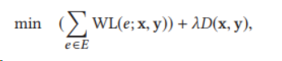

  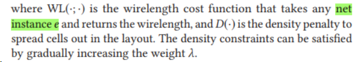

### GR_Tradictional_sequential   

#### [FastRoute1.0—2006]()

- roposed a simple way to construct **congestion driven Steiner tree** and an edge shifting technique to further refine it  

#### [fastroute 2.0-Monotonic–2007]()

- monotonic routing to explore all shortest routing paths for two-pin connections.   

##### task

##### flow

****

#### [fastroute 3.0-virtual capacity-ICCAD-2008-]()

#### [fastroute 4.0-via min tree+3 bending-ASPDAC-2009-]()

**层分配**

?

#### [MaizeRouter-]()

- 2nd place of ISPD 2007 contest 2D GR
- 1st place of ISPD 2007 contest 3D GR

#### [FGR-3d-TCAD-2008-](https://ieeexplore.ieee.org/stamp/stamp.jsp?tp=&arnumber=4526750)

- 1st place of ISPD 2007 contest 2D GR
- 3rd place of ISPD 2007 contest 3D GR
- FGR [6] used maze routing to directly rip up & reroute nets, based on the discrete Lagrangian cost framework.   

#### MGR

- MGR [8] used pattern routing and layer assignment to obtain a 3D initial solution, and then adopted 3D maze routing to rip up & reroute the nets in congestion areas.   

#### [-Layer assignment+Via minization-Trans-2008-DP-NTHU](https://ieeexplore-ieee-org-443.webvpn.scut.edu.cn/document/4603083)

- Congestion-Constrained Layer Assignment for Via Minimization in Global Routing
- CUGR’s rely work
- ISPD07 contest 后的一个跟进工作
- 也没提到 maze routing
- 没定义 wire cost, 在每一对 GCell 之间 layer assignment, 慢？
- 第一次用 DP?

##### background

- there are two main approaches  

  

  - `3D`: route all nets directly on the multilayer solution space. Because this approach directly generates a multilayer global routing result, **it can take the via cost into account during construction**. However, this method may cost **too much CPU time** with a large problem size. (现在都用 GPU 做并行了，这种方法就变多了)

    1. such as 

       

  - `2D + layer assigment`: The other approach is to first **compress** a multilayer grid graph into a one-layer grid graph, then use a **one-layer router** to solve the one-layer global routing problem, and finally perform **layer assignment** to assign each wire in the multilayer grid graph

    

    The edges corresponding to **vias disappear** in the one-layer grid graph. The capacity of each edge in the one-layer grid graph is obtained by **accumulating** the corresponding edge capacities in the three-layer grid graph

    This approach can take advantage of many current full-fledged one-layer routers, e.g., [2]–[4], and use an affordable run time to generate an initial one-layer routing result. 本文主要针对 layer assignment. 注意 layer assignment 是对二维的所有边进行层分配。

- vias not only degrade the reliability and the performance of a design but also increase the manufacturing cost.  

- previous work’s layer assignment use greedy heuristics [8] or time-consuming integer linear programming methods [9]  to minimize the via cost.  

- 像这种串行的还是要考虑 net order, 越早布线的 net 越不会拥塞，net order 很重要

**task and contribution:**

- 这篇没有考虑优先方向（To simplify the presentation of our algorithm, we do not make any assumption about the preferred routing direction for each layer in the layer assignment problem.）不过也说明了这个工作能够很简单引用到考虑优先方向的情况
- follow ISPD07 contest, 假设 via 的 capacity 是无限的（CUGR 中明确了不进行这种假设）
- based on a one-layer routing result
- minimize `via cost`, `WL` and `congestion overflow`
- propose a polynomial-time algorithm: first generate `net order` , then solves the layer assignment problem
- can improve 3 winner of ISPD07 contest

##### model  

- COngestion-constrained Layer Assignment (COLA)’s submodule

  - Net order generation

    1. The net order has a direct influence on the utilization of routing resources, so it is one of the key parts of COLA.   

    2. 对 net 进行打分决定 order

       

       注意，线长越短，分数越高，net 越应该先布线。解释：

       

  - Eemove Cycles

    1.  Arbitrarily remove.

    2. （为什么映射到第一层会有 cycles？初始是怎么连起来的？没说？FLUTE 算法是 08 年才出来，可能当时还没用上）

       

  - Single-net layer assignment  （SOLA+APEC）

    **SOLA**(Singlenet Optimal Layer Assignment)  

    1. determines an optimal layer assignment result **without considering congestion constraints** for a given net  

    2. **dynamic programming** technique

    3. 不考虑拥塞，这个方法能得到最好质量

    4. step:

       !!! note
           01: for tree in layer 1, **random** select a pin as root, then use DFS or DFS to get a **queue**, so get the edge **order**. It become a **DAG**
           
           
           
           02: 定义图 5(c)中, a 的父节点是 p2，定义 mvc(v, r)（minimum via cost）
           
           
           
           03: 
           
           ​	for pins who have not child, mvc:
           
           
           
           ​	for pins who have child and not root:
           
           ​	这个公式其实就是为了确定下每个点下一步的 layer 在哪里。比如算出最小是 mvc(v, 1), 那么 e_(v, ch(e))就在第 r 层
           
           
           
           ​	for root:
           
           
           
           - the difference is excluding r in ∆  
           
           - because mvc(v, r) does not depend on the value of r when v 
           
             is the root, we have mvc (v, 1) = mvc(v, 2) = · · · = mvc(v, k)
           
           

    **APEC**(Accurate and Predictable Examination for Congestion constraints)  

    1. can detect and prevent any **congestion** constraint violation in advance  

    2. prevention condition:

       

       如果存在一个在 layer1 上压缩的边不满足这两个 condition，那么这条边的 layer assignment（SOLA）结果就不可能满足 congesion

  - SOLA+APEC always finds a layer assignment result satisfying both **prevention conditions** for each net  

- COLA

  

  

​	

##### data

six-layer benchmarks from ISPD’07

#### [GRIP-3d+IP-DAC-2009](https://dl.acm.org/doi/pdf/10.1145/1629911.1629999)

基于整数规划

3d: solve the 3D problem directly on the 3D routing grids,  

slow: Although theoretically the direct 3D technique should produce better solutions, in practice it is less successful in both solution quality and runtime than 2D routing with layer assignment  –cite–> [Fastroute4.1]

slow: Although we see solutions with shorter wirelength generated by full-3D concurrent approach like GRIP [21], that solution quality is achieved by impractically long runtime   –cite–> [Fastroute4.1]

#### [BFG~R-3d+Lagrangian-ISPD-2010--UMICH+IBM-](https://dl-acm-org-443.webvpn.scut.edu.cn/doi/10.1145/1735023.1735035)

- 有 net order

##### background

##### contribution

1. a novel branch-free representation (BFR) for routed nets  
2. a trigonometric penalty function (TPF)  
3. dynamic adjustment of Lagrange multipliers (DALM)  
4. cyclic net locking (CNL)  
5. aggressive lower-bound estimates (ALBE) for A*-search, resulting in faster routing.  

##### flow

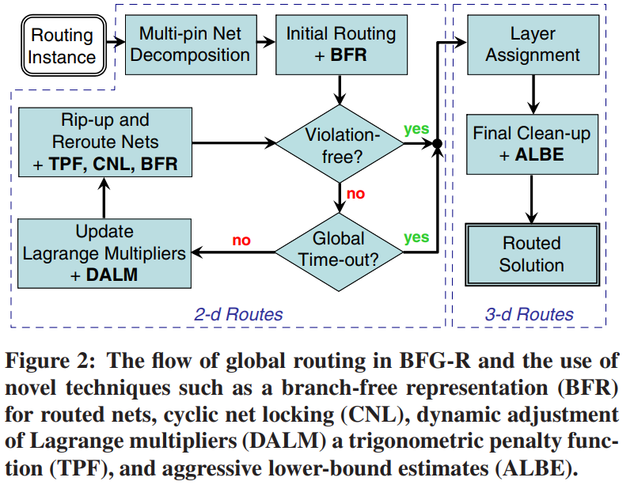

#### [MGR–ICCAD-2011](https://ieeexplore.ieee.org/abstract/document/6105336)

multi-level （coarsened  and fine-gained）

#### [FastRoute4.1-an efficient and high-quality global router-2012](https://home.engineering.iastate.edu/~cnchu/pubs/j52.pdf)

https://dl.acm.org/doi/abs/10.1155/2012/608362

##### background

FastRoute is a global routing tool for VLSI back-end design. It is based on sequential rip-up and re-route (RRR) and a lot of novel techniques. [FastRoute 1.0](http://home.engineering.iastate.edu/~cnchu/pubs/c36.pdf) first uses **FLUTE** to construct **congestion-driven Steiner trees**, which will later undergo the **edge shifting** process to optimize tree structure to reduce congestion. It then uses **pattern routing and maze routing** with **logistic function** based cost function to solve the congestion problem. [FastRoute 2.0](http://home.engineering.iastate.edu/~cnchu/pubs/c40.pdf) proposed **monotonic routing** and **multi-source multi-sink maze routing** techniques to enhance the capability to reduce congestion. [FastRoute 3.0](http://home.engineering.iastate.edu/~cnchu/pubs/c51.pdf) introduced the **virtual capacity** technique to adaptively change the capacity associated with each global edge to divert wire usage from highly congested regions to less congested regions. [FastRoute 4.0](http://home.engineering.iastate.edu/~cnchu/pubs/c52.pdf) proposed **via-aware Steiner tree**, **3-bend routing** and a **delicate layer assignment algorithm** to effectively reduce via count while maintaining outstanding congestion reduction capability. [FastRoute 4.1](http://home.engineering.iastate.edu/~cnchu/pubs/j52.pdf) simplifies the way the **virtual capacities** are updated and applies a single set of tuning parameters to all benchmark circuits.

##### model

##### flow

#### [NTHU Route 1.0- -TVLSI-2010-](https://ieeexplore.ieee.org/document/5703167)

#### [NTHU Route 2.0- -TCAD-2013](https://ieeexplore.ieee.org/document/6504553)

- 2D
- a history-based cost function.  

#### [NCTU GR 1.0-3D-congestion relaxed layer assignment- 2011-](https://ieeexplore.ieee.org/document/5703167)

- it improved the scheme to estimate the realtime congestion more accurately by using a history term that will gradually wear off as the number of iterations  increases if the overflow disappears.   

#### [NCTU GR 2.0-Multithreaded Collision Aware- CAD-2013-](https://ieeexplore.ieee.org/document/6504553)

[people.cs.nycu.edu.tw/~whliu/NCTU-GR.htm](https://people.cs.nycu.edu.tw/~whliu/NCTU-GR.htm)

[PengjuY/NCTU-GR2: This is a binary file of NCTUgr2, which is a global router](https://github.com/PengjuY/NCTU-GR2)

- net-level parallel method 
- RSMT-aware routing scheme  

#### [OGRE- new cost function- -2019- -](https://woset-workshop.github.io/PDFs/2019/a18.pdf)

- [Open source!](https://github.com/AUCOHL/OGRE)
- **LEF/DEF-based**
- 3D
- 用的是老方法，不过解释的挺清楚的
- components by a group of undergraduate students as a course project.

#### [SPRoute 1.0: A Scalable Parallel Negotiation-based Global Router-ICCAD-2019](https://ieeexplore.ieee.org/stamp/stamp.jsp?tp=&arnumber=8942105)

- 基于 `net-level` 多线程的并行加速 `迷宫算法`
- `negotiation-based` rip-up and reroute two-phase maze routing
- resolves livelock issue(CPU)
- open source

- introduced a concept called `soft capacity` to reserve routing space for detailed routing and explored `several parallelization strategies` to speed up global routing. 
- 是 CPU 上的并行，讲了挺多关于锁的问题，没看懂，让我们看 2.0 吧
- 2D

##### background

总体

In many global routers, maze routing is the most time-consuming stage.  

**challenge**

因为这个现象，多线程反而慢了

**原理**

- Galois system  

  

- Net-level Parallelism  

- Fine-grain Parallelism  

##### data

ISPD 2008  contest

#### [CUGR-3D pattern+Multi level maze routing+patching-DAC-2020-CUHK](https://github.com/cuhk-eda/cu-gr)

- ICCAD 2019 Contest First Place

- [open source!](https://github.com/cuhk-eda/cu-gr)

- 3d+多线程+

- 这个文章没有讨论 prefer direction

- 多线程体现在哪里？

- will take more runtime than 2D initial routing  

- 注意：这种格式的 GR 输出可以适配 Innovus

- A probability-based cost scheme   

- CUGR [9] used 3D pattern routing based on dynamic programming to obtain an initial routing, and used multi-level 3D maze routing for rip-up and rerouting to obtain a final global routing solution  

- time-complexity of 3D pattern routing is $\mathcal{O}(L^4|V|)$

  compare with [Trans-2008](# [-Layer assignment+Via minization-Trans-2008-DP-NTHU](https://ieeexplore-ieee-org-443.webvpn.scut.edu.cn/document/4603083)), CUGR reduces the complexity to $\mathcal{O}(L^4|V|)$ by selecting the root carefully so that each vertex will have at most three preceding vertices instead of four.  ~~注意，这里说 相比 [Trans-2008](# [-Layer assignment+Via minization-Trans-2008-DP-NTHU](https://ieeexplore-ieee-org-443.webvpn.scut.edu.cn/document/4603083))的 $\mathcal{O}(L^5|V|)$ ，它的复杂度是 $\mathcal{O}(L^4|V|)$ ，感觉是放在了 [Trans-2008](# [-Layer assignment+Via minization-Trans-2008-DP-NTHU](https://ieeexplore-ieee-org-443.webvpn.scut.edu.cn/document/4603083))进行不转弯的 DP-based layer assignment 方法上了，实际上按照本文说的方法，理论上是 $L * L^{2*3}|V|$，因为 CUGR 每次是对一个 L pattern 为单位计算 `mvc`, 时间复杂度是 $2*L*L$~~.确实是 $L^4$, CUGR 对一个 L pattern 分了两部分计算 `mvc` 没一部分时间复杂度是 $L*2$

##### background

- A common strategy of doing 3D global routing, as adopted by NCTU-GR 2.0 [5], NTHU-Route 2.0 [6], NTUgr [7] and FastRoute 4.0 [8], is to **first compress the 3D grid graph into a 2D grid graph and perform 2D global routing**.   
- directly route the nets in a 3D grid graph：FGR [10] , GRIP [11] , MGR [12]  
- Traditional pattern routing generates 2D topologies only, while **our** proposed 3D pattern routing directly generates 3D topologies without the need of an extra layer assignment stage
- 使用 DR 结果进行多角度 metrics 评估：

##### task

- detailed-routability-driven  directly-3d multi thread GR

##### contibution

- probability-based cost scheme
  - minimizing the possibility of overflow after detailed routing
- `3D pattern routing` technique (2D pattern routing + layer assignment)(前面又说 directly in the 3D space?)
  - without overflow even only L shape patten routing
  - pre-work [15] 是先在 2d 上进行 pattern routing, 然后进行 layer assignment, 这里是直接在 3d 进行 pattern routing. 3d pattern routing can avoid loss of accuracy caused by compressing 3D grid graph to 2D  
- `multi-level maze routing`:
  - coarsened level –> searches for a region with the **best routability**. **first** narrows the search space to a smaller region  
  - fine-grained level –> searches for a **lowest cost** solution within the region
- patching mechanism
  - further improve the detailed routability

##### flow

In `3D pattern routing` (`inital routing`), the nets are broken down into two-pin nets, and a `dynamic programming` based algorithm will route the two pin nets sequentially using Lshape patterns and `stacking vias` at the turns.  

In the `multi-level 3D maze routing` phase, the grid graph is `coarsened` to shrink the routing space, and maze routing is first performed in the coarsened space with an objective to find a routing region with the **highest routability**.   A `fine-grained maze routing` will then search for a lowest cost path within the region.  use its `patching` mechanism here.

##### model

- Gcell 之间的容量等于 track，一般 GR 表征 via 的容量是无限的，但是在本文中不是

- **three base definition:**
  - resource = capacity - demand
  - 这三个变量在 GCell 和 wire_edge 上都有特征，也就是说有 6 个值
  - resource 能够直接表示拥程度
  - 
  - 

- **cost scheme**

  - 主要分成 wire 和 via 两部分：

    

  - wire cost:

    

    1. *`wl`* is wire lenght cost

    2. *`eo`* is expected overflow cost, where *`uoc`* is hyper parameter, The larger  *`d(u, v)`* is, the more likely it is to be congested. is accurate if the **DR** adopts the simplest strategy of picking a track **randomly** to route. However, most well designed detailed routers will do much better than random selection.  

    3. *`lg(u,v)`* is a variable to refine *`d(u, v)`*. “+1” 是为了值域在（0，1）表示概率。 *`slope`* is hyper parameter. When the resources are abundant, there is almost **no congestion cost**, but the cost will increase rapidly as the resources are being used up and will keep increasing almost **linearly** after all the resources are used  

       

  - via cost:

    1. thanks to our **3D pattern routing strategy**, a via cost scheme can be embedded to reflect the impact.  
    2. 
    3. *`uvc`* is hyper parameter. 
    4. 公式（5a）为什么要“+1”

- Initial Routing / 3D Pattern Routing

  1. use `FLUTE` first (not congestion awared)

  2. use `edge shifting` (described in [FastRoute](#[FastRoute1.0—2006]())) to alleviate  congestion.

  3. **randomly** choose one node in net, use DFS to get a queue and then get a DAG

  4. 类似 [15]，动态规划选择 cost 最小的 3d L pattern，每个 L pattern 有(2 * L * L)种可能

     

     最后在 root 处得到最终的结果

- Multi-level 3D Maze Routing  

  - maze route planing

    aims at finding a smaller but highly routable search space

    1. compress a block of G-cells (5x5 in our implementation), use avg to descripe `capacity, demand, resource`

    2. cost function:

       

    3. 得到灰色粗网格：

       

    4. 之后会在这几个 BBox 中分别进行计算 `cost scheme`，得到上图黑色实线

  - fine-grained maze routing within guides

- Postprocessing / Guide Patching  

  - we can add new guides to improve detailed routability. adding new stand-alone guides to alleviate routing hot spots.  

  - three kind of patching:

    1. Pin Region Patching  

       - most effective  

       - the ideal way of improving pin accessibility is to identify those hard-to-access pins and assign more resources to them  

         

       - Our global router will check the upper (or lower) two layers of a pin, which are vital for accessing the pin. use 3 × 3 patching guides. 

       - 没写判断 `hard-to-access pins  ` 的具体的方法

    2. Long Segment Patching:  

       - a longer routing segment often means more wrong way wires and causing more congestion.  
       - If a guide is longer than a specified length I, we’ll consider long segment patching.  

       

       - if a G-cell with resource below a threshold T is encountered, a single G-cell route guide will be patched above or below it, depending on which of them has sufficient resource  

    3. Violation Patching:  

       - For G-cell with inevitable violations, patching will be used again to enable the detailed router to search with more flexibility.   

         

##### data

iccad 2019 dataset

##### experiment

- 他自己又比赛后改进了

- 

- our algorithm’s peak memory is close to the first place and is 1.83 times of that of the second place on average (ours is 8.22 GB on average and is **19.8 GB** for the biggest design)

#### [VGR-3D+via mini-ASPDAC-2024- -FZU+iEDA](https://ieeexplore-ieee-org-443.webvpn.scut.edu.cn/document/10473939)

- a 3D global router with via minimization and multi-strategy ==rip-up and rerouting==  

- CPU-based

  

##### background

- ==Vias== are interconnections between different routing metal layers. A large number of vias can reduce manufacturing yield, cause circuit performance degradation, and increase layout area required for interconnections [1], [2]  In VLSI physical design, meeting the DFM (Design for Manufacturability) constraints is essential, and these constraints often include strict requirements regarding vias.  

- Most academic global routers use pattern routing to obtain initial solution quickly. However, the lack of candidate scheme for pattern routing results in significantly high overflow for the initial solution.  

- However, existing rip-up and rerouting techniques do not fully consider via minimization.  

- 为什么要 3D，3D 的优势：

  

  

##### contribution

- a novel multi-strategy rip-up & rerouting framework  
- first leverages two proprietary routing techniques  
  - via-aware routing cost function  
  - 3D monotonic routing   
  - 3D 3-via-stack routing  
- an RSMT-aware expanded source 3D maze routing algorithm  

##### flow

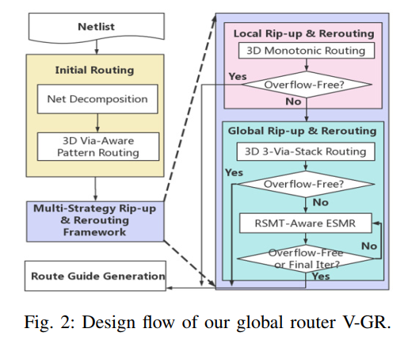

##### model

###### Modified Via-Aware Routing Cost Function

- previous works' via penalties are based on a constant cost function, or, the cost of via may decrease over time.  

- RUDY-based

  

- CUGR:

  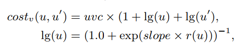

- Ours:

  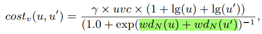

###### Local Rip-up & Rerouting

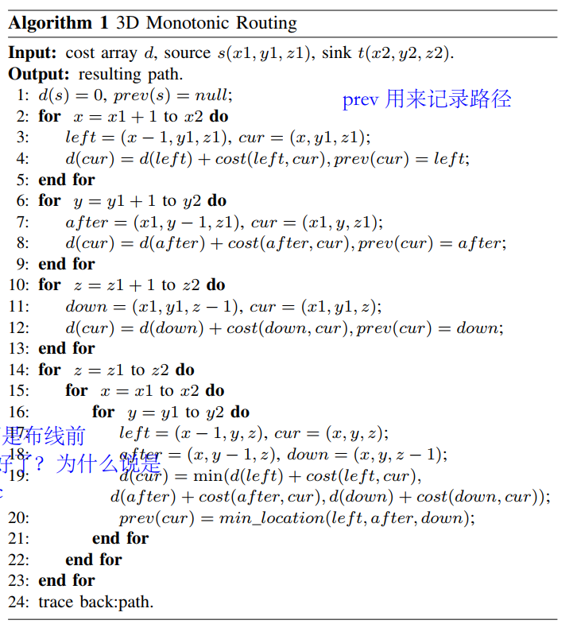

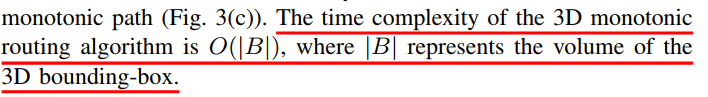

###### Global Rip-Up & Rerouting

1. 3D 3-via-stack routing

   - focuses on adding as few vias as possible  

     

   - A 3D 3-via-stack path consists of three parts:   

     - two 3D Lshape paths
     - a stack of vias  

   - The 3D 3-via-stack routing is faster than 3D maze routing and offers good congestion reduction. We use it before 3D maze routing to reduce the number of overflowed nets, resulting in lower total overflow and via counts  

2. RSMT-aware ESMR(expanded source 3D maze routing ).  

   - increases wire length as less as possible
   - After completing the 3D 3-via-stack routing algorithm, only a small number of nets have congestion, and we need to use 3D maze routing to process these nets  
   - 
   - 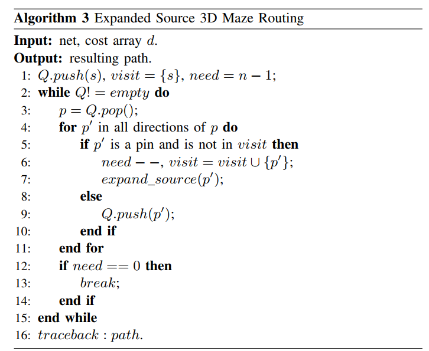

##### experiment

1. Effectiveness of 3D Monotonic Routing and 3D 3-Via-Stack Routing  

   one using 3D monotonic routing, 3D 3-viastack routing and the RSMT-aware ESMR, and another using only the RSMT-aware ESMR  

   

2. Effectiveness of RSMT-Aware ESMR  

   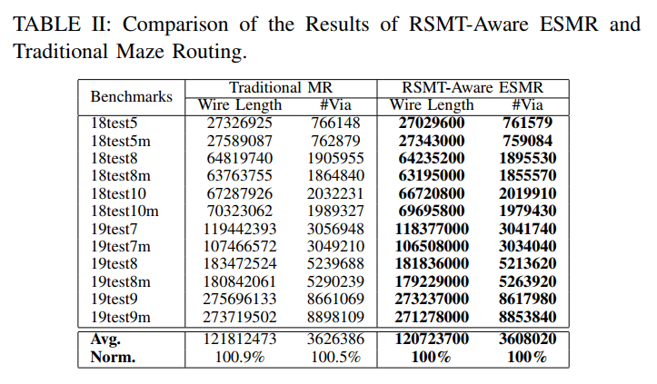

3. Comparison with the State-of-the-Art  

   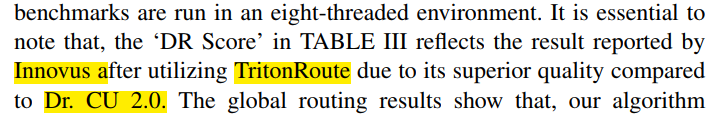

   

4. detailed results of all components of the ‘DR Score’  

   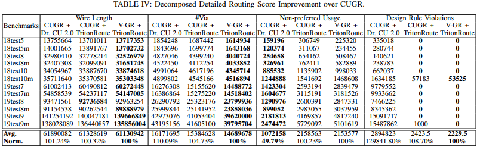

   This demonstrates that V-GR can find a routing scheme with fewer vias and less overflow while maintaining almost the same wire length.  

   

### GR_Concurrent

#### [-Multicommodity Flow-Trans-2001-](https://janders.eecg.utoronto.ca/1387/readings/global_routing.pdf)

- first Multicommodity Flow?

#### [BoxRouter 1.0- -DAC-2006-ILP- -](https://dl-acm-org-443.webvpn.scut.edu.cn/doi/pdf/10.1145/1146909.1147009)

- 3rd place of ISPD 2007 contest 2D GR
- 2nd place of ISPD 2007 contest 3D GR
- integer linear programming (ILP)  based

##### background

##### contribution

- PreRouting step can capture the most ==congested== regions with reasonable accuracy
- key `BoxRouting` idea   
  - BoxRouter progressively expands the routing box and performs routing within each expanded box (BoxRouting), until the expanded box covers the whole circuit (all the wires are routed)  
- efficient progressive integer linear programming  ==(ILP)==   
  - In our ILP, only wires between two successive boxes are considered with L-shape patterns. Thus even with ILP, our runtime is still much faster than existing global routers [1] [2] [16]
  - without rip-up  

##### flow

#### [sidewinder-scalable ILP-SLIP-2008-ILP- -]()

- 只有 10^4^数量级的 net 数据

##### background

##### contribution

- dynamically-updated congestion map  

##### flow

#### [BoxRouter 2.0- - -2008-ILP- -]()

- [OpenSource!](https://github.com/Apodead/BoxRouter)
  - 
  - github 上有两个版本, 貌似都不是作者的
- 是一个 2d 的 GR
- concurrent: 整数线性规划（ILP）

##### background

##### contribution

- dynamic scaling for robust `negotiation-based` A* search
- topology-aware wire ripup 
  - which rips up some wires in the congested regions without changing the net topology.
- integer linear programming (ILP) for via/blockage-aware layer assignment

##### flow

​                               

#### [GRIP-combination opt-Trans-2009-DP- -NTU](https://jlinderoth.github.io/papers/Wu-Davoodi-Linderoth-10-PP.pdf)

- 这个有会议和期刊两个版本
- GRIP [7] determined 3D routing candidate patterns for each net in advance, and then used ILP for optimal selection.   
- 基于组合优化

#### [COALA-concurrent layer assignment -TCAD-2022-]()

- 2d

- capacity 放到了 gcell

  

- M1 is congested and leaves not much routing resource  

- 

  他的 concurrent 是 net 不是 sequencial 进行布线了，但其实还是有进行启发式 sequencial 的部分

  原文还说：`The candidate segments in Sseg of the current layer are sorted according to three criteria and are sequentially assigned.  `

##### background

- Two-dimensional (2-D) global routing followed by layer assignment is a common and popular strategy to obtain a good tradeoff between runtime and routing performance.   

- State-of-the-art (SOTA) studies on layer assignment usually adopt `dynamic programming-based approaches` to `sequentially` find an optimal solution for each net in terms of overflow or/and the number of vias.  However, a fixed assignment ordering severely restricts the solution space, and the distributed overflows can hardly be resolved with any existing refinement approach  

- rip-up and rerouting  spends most of the runtime in the whole global routing process   

- existing layer assignment approaches suffer from two common drawbacks  

  1. First, most of the above works sequentially perform layer assignment for each net based on dynamic programming (DP)-based algorithms. In spite of the ==optimality== of a DP-based method that minimizes the overflow increment and the number of vias for each net, the ==assignment ordering== of all nets severely restricts the solution space, making the overall assignment result ==far from optimal==. 
  2. Second, the DP-based approaches cause difficulties in the assignment refinement process. For a tile with a large overflow, ==deciding or iteratively trying which segments should be ripped up and reassigned/shifted== critically determines the final solution quality and becomes another complicated optimization problem.  
  3. In addition, the resulting overflows are randomly scattered on segments, and thus the existing refinement techniques are only performed on each individual wire segment suffering from overflow, limiting the effectiveness in overflow reduction.  (没看懂)

- 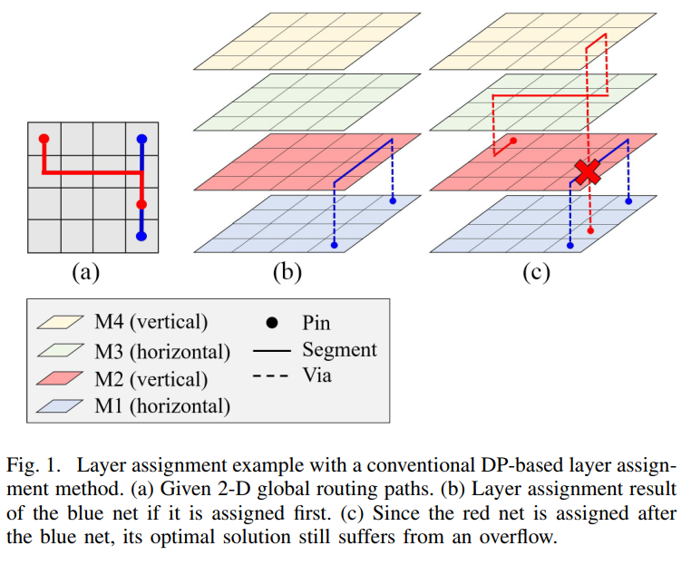

  This overflow can be resolved if the ordering of the blue net and the red net is reversed, while an optimal ordering can hardly be found by using simple heuristics adopted by the above existing works  

- there exist some studies proposing Lagrangian relaxation or integer programming-based approaches to consider the layer assignments of multiple nets  

- sequential layer assignment approaches suffer from limited solution quality  

##### contribution

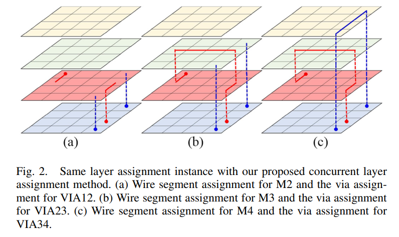

一层一层 assign

- capacity of a tile  

##### flow

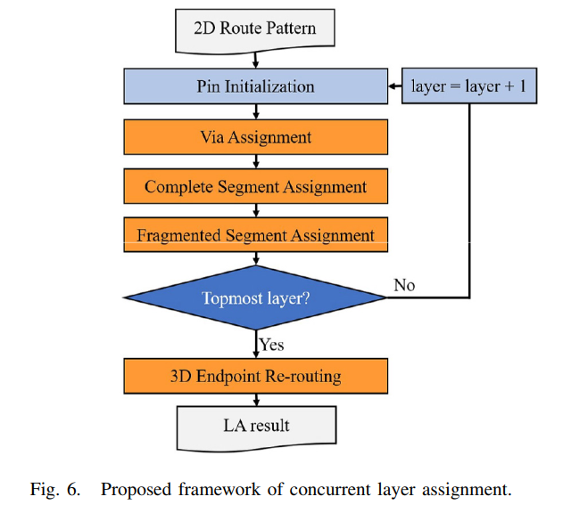

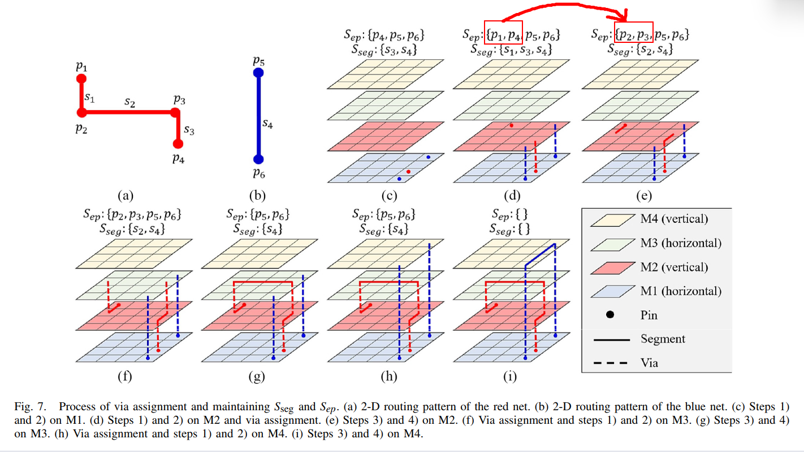

##### model

###### 本文定义的 capacity and demand(都在 GCell 上)

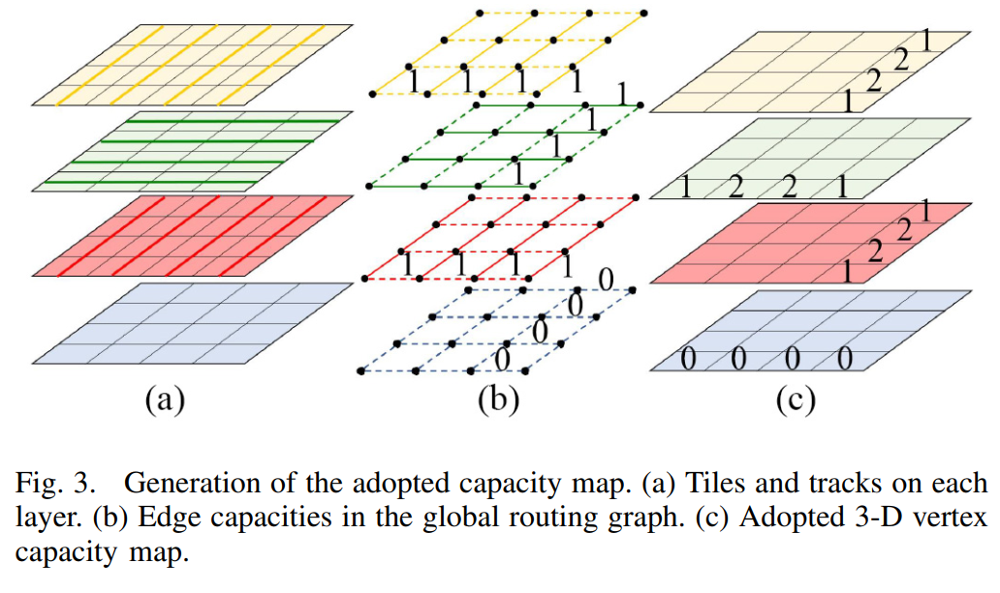

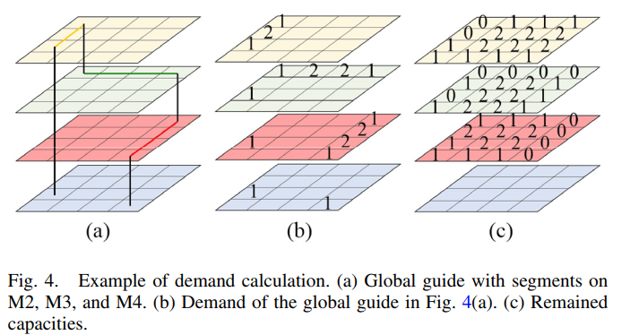

###### demand congestion map

用 2d 的 routing 预测 3d demand

###### Complete Segment Assignment

The complete segments are ==sorted== according to the following three criteria.  

1. Residual Parts of Fragmented Segments：highest priority  

2.   The Degree of Net Completeness  

   $Completeness = N_{assigned}/N_{total}$

3. Segment Length: assign the shorter segment prior to the longer one

   can result in fewer number of vias  

###### Fragmented Segment Assignment

1) Prediction Map Update for Fragmented Segments  

2) Fragmented Segment Ordering and Assignment:  

   A candidate segment can be fragmented and assigned for a subcolumn if the following two conditions are satisfied:  

   - its connected via to the lower layer lies in the subcolumn 
   -  its fragmented subpart (blue part) has to overlap the subcolumn with more than one tile.  
   - 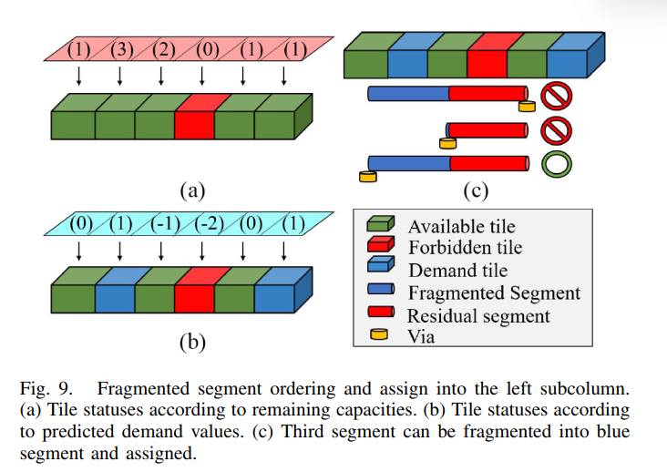
   - 

###### 3-D Endpoint Rerouting  

After assigning wire segments for the topmost layer, some segments may still be left unassigned  because of an inaccurate 2-D capacity and demand model.  

four steps：

1. Redundant Via and Partially Fragmented Segment Removal
2. 3-D Multiendpoint Decomposition  
3. 3-D Net Ordering  
4. 3-D Endpoint Rerouting

###### OBSTACLE-AWARE STRATEGY  

##### data

ISPD18 和 ISPD19

##### experiment

对比的模型 CUGR

#### [-Lagrangian based- DAC-2023-FZU-ILP-](https://ieeexplore-ieee-org-443.webvpn.scut.edu.cn/stamp/stamp.jsp?tp=&arnumber=10247969)

- integer linear programming   
- Lagrangian relaxation method  
- direction-aware weighted A*-algorithm 

##### background

- combine the advantages of the two classes of algorithms  （串并行）
- `BoxRouter 2.0 [5] and Sidewinder [9]` propose a ==maximum routable== ==ILP model==, which routes as many nets as possible without congestion by ==using several routing patterns.==   Due to limited routing patterns for each net, the two routers may cause some nets ==disconnected==, requiring ==post-processing== to produce a legal final result.   `GRIP [6]` proposes an ==ILP formulation== that minimizes the total wire length and the number of vias, which ==includes many routing patterns== . For their ILP, the LP relaxation is ==restricted to a small number of routing patterns== and is solved by the `column generation method`, and then the obtained solution is optimized ==using a local improvement procedure to consider other patterns==.  

##### contricbution

- a novel `ILP based pathfinding model` which does not need to generate candidate routing patterns of nets prior
- We propose a `Lagrangian relaxation method` combined with a `gradient ascent method` to update the multipliers, in which `direction-aware weighted A*-algorithm` is used to quickly solve a subproblem  
- a multi-stage rip-up & rerouting algorithm to optimize the initial routing result, in which each stage uses different routing algorithms and cost functions

##### flow

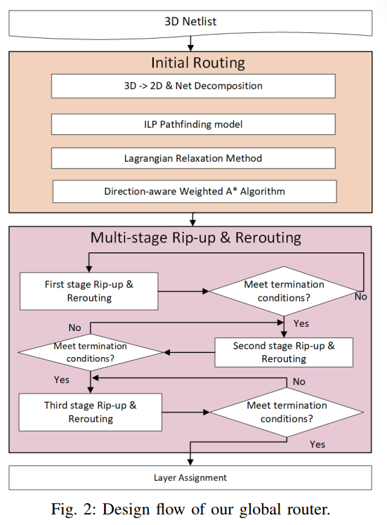

1. FLUTE   
2. Integer Linear Programming (ILP)   
3. Lagrangian relaxation method combining with a direction-aware weighted A* algorithm   
4. monotonic routing and maze routing  

##### model

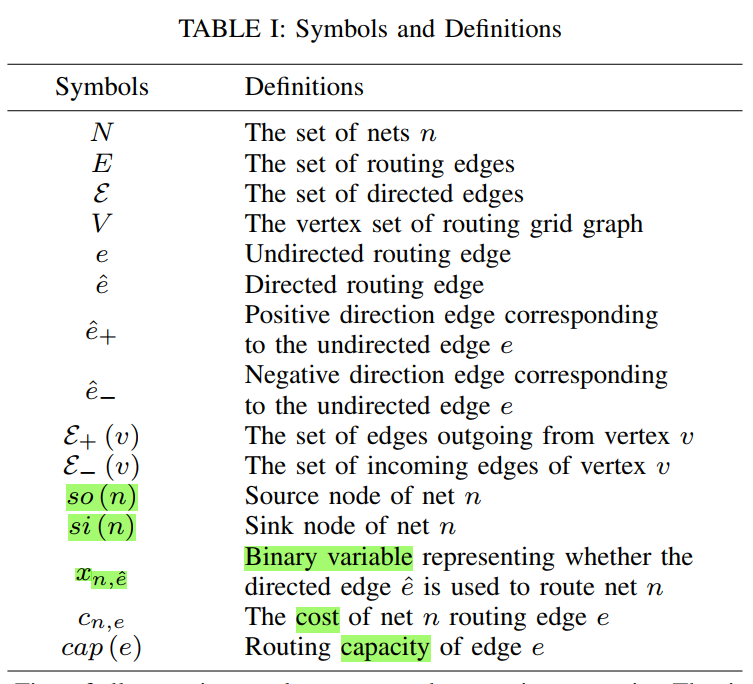

###### ILP Based Pathfinding Model

没看懂 `ILP Pathfinding model`

- an ILP based pathfinding model without considering routing patterns  

- 

  

  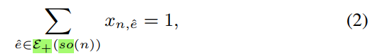

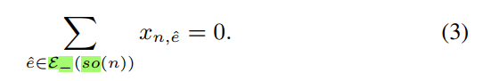

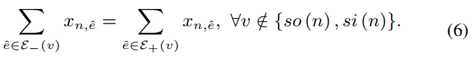

###### Lagrangian Relaxation Method and Initial Routing  

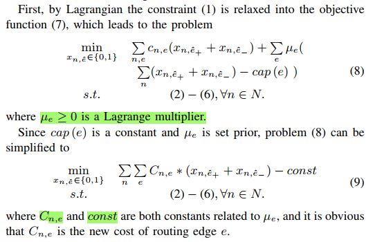

###### Direction-aware Weighted A*-Algorithm  

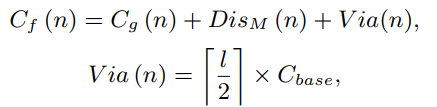

##### Multi-stage Rip-up & Rerouting

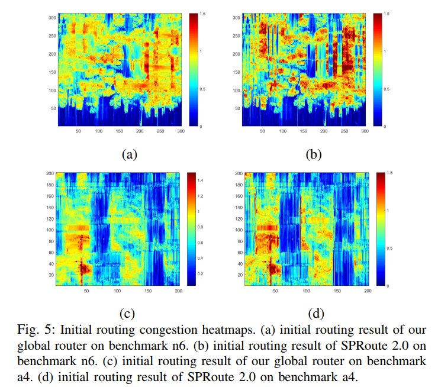

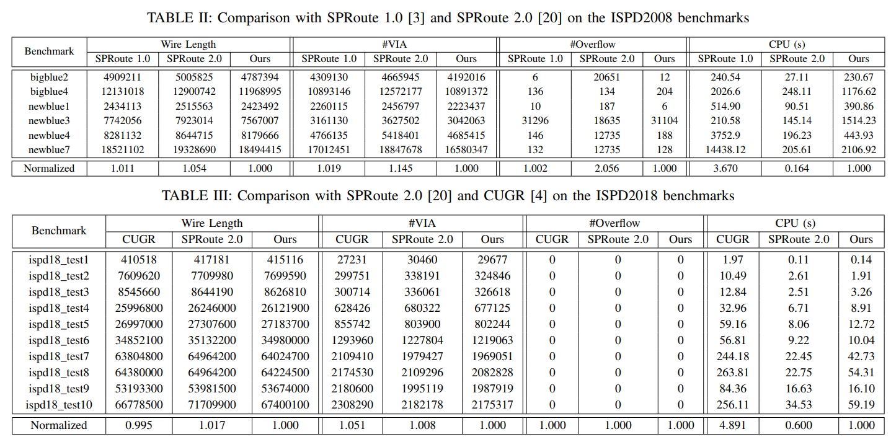

##### data

ISPD18

##### experiment

#### [DGR-DAG Routing Forest+2D-DAC-2024-DP-CMU+NVIDA](https://dl-acm-org-443.webvpn.scut.edu.cn/doi/pdf/10.1145/3649329.3656530)

- [OpenSource!]()

- Directed Acyclic Graph (DAG)-based  

- 2D

- 基于 DP 的 Layer assignment

- 只是选择了更优的 Tree? 并且只是在这部分是 concurrent 的？通过牺牲额外的时间获取更好的 tree

  

##### backgroun

- sequential algorithms do not guarantee optimal solution among all nets because of its sequential heuristic. Moreover, its sequential heuristic falls short in addressing routing congestion from a global perspective, possibly leading to unnecessary iterations of rip-up and reroutes.   
- ==Combinatorial optimization techniques [4, 5]== could concurrently optimize multiple nets. But they are often ==too slow== for modern VLSI circuits  
- concurrent 相比 sequencial 方法 在布线质量的优越性
- 以往 GPU-accelerate 工作其实本质还是 sequencial
- 1.Steiner tree 相同最短长度有多重拓扑

##### contribution

- `concurrent optimization`  for hundreds of thousands of nets  
- a routing DAG forest to represent the search space  
- a GPU-accelerated  differentiable algorithm for scalable and efficient search within the DAG forest.   
  - `Gumbel-Softmax` technique with ==temperature annealing== and ==top-p selection==  

##### flow

##### model

routing DAG forest  

updated through `back-propagation`

1. \##### Routing DAG Forest

   - a mathematical structure to systematically describe the 2D pattern routing space for all the nets.   
   - In contrast to CUGR2 [2], (which addresses one net at a time and focuses on a single Steiner tree topology in each instance,) our routing DAG forest allows ==multiple DAGs for each net== and facilitates the coordination of DAG and DAG edge selection across all nets in a ==global view==.  
   - The construction of the DAG forest has a direct impact on the runtime and quality of DGR outcome  
   - 作为未来的一个方向，我们计划在必要时为拥挤地区的网络引入新的 DAG 和 DAG 边，探索森林的适应性扩展

2. Pattern Routing

   - The dynamic programming-based layer assignment  

   - he objective of 2D pattern routing is to select the best routing DAGs (routing trees) and DAG edges (2-pin paths) for all the nets such that the total wire length, number of vias, and routing overflow are minimized

     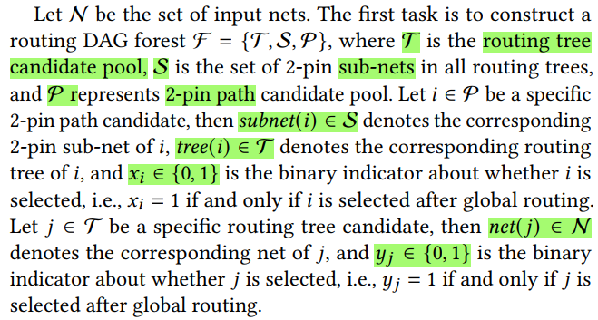

     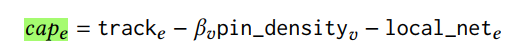

     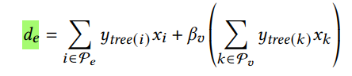

3. Routing DAG Forest Construction  

   - Initially, multiple routing tree candidates are formulated for each net using `FLUTE`. Then, all L-shape pattern paths are enumerated for each 2-pin sub-net and incorporated into the pool as 2-pin path candidates. In the final step, each candidate will be associated with a probability, which is initialized ==randomly==.  
   - its ==fine-tuned version== by CUGR2, which ==moves Steiner points based on congestion==.  
   - It’s worth noting that this is not restricted to just these two techniques; alternative routing tree generation algorithms, such as `SALT [15]` and `TreeNet [16]`, can seamlessly integrate their resulting trees as additional candidates.   

4. Continuous Relaxation and Cost Calculation

   cost = 500 × overflow_cost + 4 × via_cost + 0.5 × wirelength_cost  

   

   

5. Differentiable Optimization  

   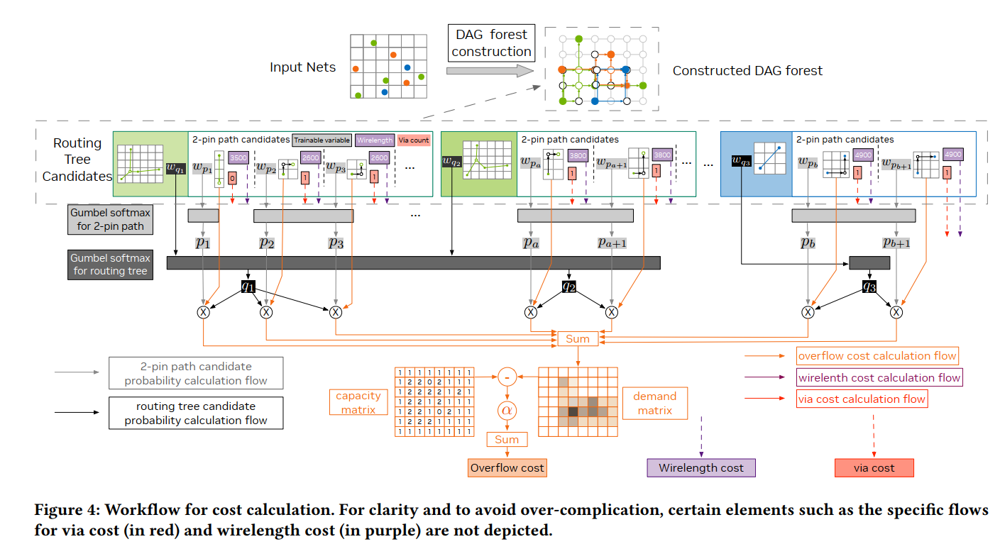

   - gumbel_softmax function   

     - 

       

       1. Gumbel noise (𝑔𝑖)  

          如果只是使用简单的 softmax 比如， softmax deterministically samples a probability distribution. This ==deterministic== nature can inadvertently lead to ==local optima==, especially when the probabilities have ==a bad initialization==. 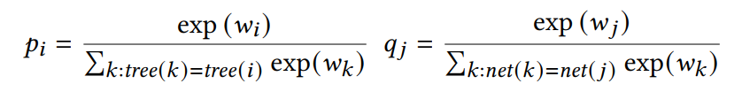

          Gumbel 分布  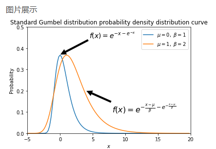

       2. temperature (𝑡)  

          temperature annealing. It ensures that the final probabilities associated with routing tree candidates closely approximate either ==0 or 1==  

6. Deriving Discrete Selection  

   top-p sampling [18]  （什么东西？）

##### data

Synthetic data is utilized for this experiment since the ISPD’18 and ISPD’19 benchmarks are too large for ILP  

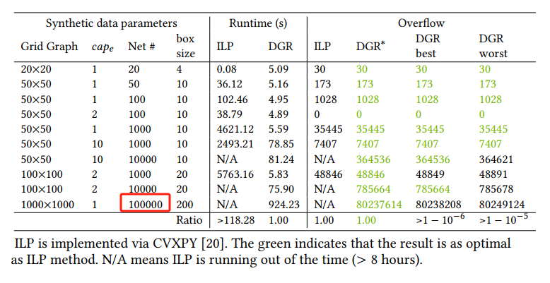

##### experiment

1. \##### 与 ILP 方法的对比

   见上图（data 中）

2. compare result with CUGR2

   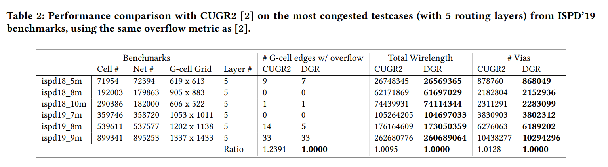

   shows a superior routing quality on all testcases   

3. compare result with other 

   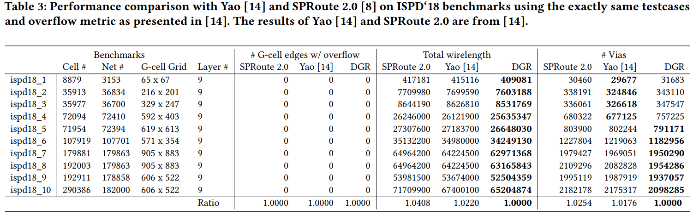

4. cost function 

   

   We can see that the selection of 𝑓 influences the result, especially overflow, significantly, and sigmoid is the best choice, which outperforms CUGR2  

   

   DGR has slightly more runtime overhead than CUGR2 when the number of nets is less than one million, when the design complexity continues increasing, ==DGR becomes more efficient than CUGR2==  

   The memory result is given in Figure 5b, which shows that both CPU and GPU memory overhead is almost ==linear== with the number of nets.  

### GR_Adv_RL

#### [-DRL method-2019-DRL-](https://arxiv.org/pdf/1906.08809)

- first DRL related work?
- RL framework: `DQN` 
- proves its overall performance is better than the sequential A∗ algorithm.   
- This method falls short of practical benchmarks that can involve over 100,000 nets [26] 
- 3D 
- have not use real world design

##### background

- Existing solutions typically consist of `greedy algorithms` and `hard-coded heuristics`.   
- As such, existing approaches suffer from a `lack of model flexibility` and `non-optimum solutions`
- current solutions rely primarily on ==heuristically driven== greedy methods  

##### contribution

- 该生成器能够生成具有不同大小和约束的参数化全局路由问题集中，从而能够评估不同的路由算法，并为未来的数据驱动路由方法生成训练数据集。
- ==the first== attempt to formulate and solve global routing as a deep reinforcement learning problem.   
- It is noted however that our approach, similar to previous approaches, ==does not guarantee global optimum==  
- RL for a ==closed loop== global routing solution  

##### flow

A* is executed first in order to provide `burn-in memory` for the DQN solver  

using A* as burn-in for DRL allows DRL to converge much faster  

##### model

example:

​	from A to B

​	read means over flow

Bold edges have zero capacity  

**state**:

- (pos_x/y/z, distance_x/y/z, 周围的 capacity,  )这种编码方案可以被视为当前状态、导航和本地容量信息的混合

**action**

上下左右前后

**reward**

##### experiment

###### env

- python

###### RESULT

参数选择也许可以借鉴一下大概量级

#### [Alpha PD Router-MCTS-MLCAD-2019- -Canada Ucalgary Gandhi](https://ieeexplore.ieee.org/document/9142109)

- A Reinforcement Learning-Based Framework for Solving Physical Design Routing Problem in the Absence of Large Test Sets
- 相关硕士论文：[Reinforcement Learning-Based Framework to Generate Routing Solutions and Correct Violations in VLSI Physical Design](https://ucalgary.scholaris.ca/server/api/core/bitstreams/870e141b-ac3f-4125-8b8a-f5f125bbcc52/content#page=102.20)
- based on a two-player collaborative game model  
- The proposed model has the potential to be used as a framework to develop RL based routing techniques untethered by the scarce availability of large routing data samples or designer expertise.  
- ==two-player collaborative== game rather than a multiplayer game problem  
- inspired by `Alpha-Go Zero`

##### background

- the lack of a large number of test cases has been a significant hindrance to obtaining high-quality results, the only design benchmark test sets that are available to academics are the ISPD 2018 and ISPD 2019 benchmarks which in total have 27 circuits [21] [22]  

##### contribution

- Development of a reinforcement model for routing  and RRR
- Designing a collaborative game-theory model  

##### flow

##### model

###### two-player

two players have different strategies and reward    

-  `Cleaner` 

  - which detects design rule violations, selects the best net to rip to fix the violation and rips it  
  - 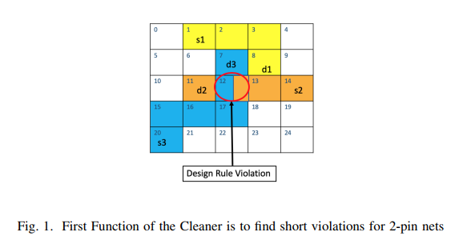
  - 
  - The Cleaner rips all the possible net candidates ==one by one== and sends them to be re-routed by the Router.   (那就慢了)
  - With each re-route, the Router issues a reward to inform Cleaner how good its job was from the Router’s perspective. Cleaner aims to maximize these rewards by ripping the nets that make the Router’s job easier.   

-  `Router` 

  - who performs routing. Router employs a path search algorithm such as A-star  

  - is responsible for re-routing the ripped nets without producing any new violations  

  - The solution from the Cleaner is given to the Router. This solution is a partially routed circuit. 

    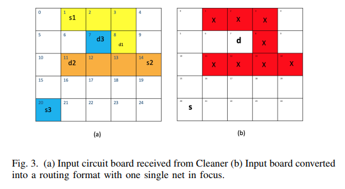

  - The move prediction in Router is optimized by the feedback from the MCTS algorithm to the neural network (NNET) architecture.   

If no violations exists and all the nets are routed, both Router and Cleaner win and a design rule violation free solution is produced.   

###### Min-max Game Framework

这个是什么？不清楚[34-36]

this formulation allows us to cast the routing problem into a potentially tractable two-player game rather than a huge multiplayer game where the players count equals the number of nets (e.g. millions).  

###### experiment

#### [-quasi-Newton method  -arxiv-2021-Double DQN-JP](https://arxiv.org/pdf/2010.09465)

- accelerate the training of deep Q-networks  by introducing a second order Nesterov’s accelerated quasi-Newton method
- 这篇可以说是一个二阶优化器在GR上的应用
- 基于[arxiv-2019]()那篇

##### background

- why DRL: As the state and action space of the problem increases, the estimation of the state-action value can be slow and time consuming and hence estimated as a function approximation.   These function approximations can be represented as a non-convex, non-linear unconstrained optimization problem and can be solved using deep neural networks (known as deep Q-networks).  
- Using ==second order curvature information== have shown to improve the performance and convergence speed for non convex optimization problems   
  - Adam, RMSprop 都是一阶的
  - BFGS  是一阶的
  - Nesterov’s accelerated quasi-Newton (NAQ) method [5] was shown to accelerate the BFGS method using the Nesterov’s accelerated gradient term.  
- Why RL: Conventional routing automation tools are usually based on analytical and path search algorithms which are NP complete. Hence a machine learning approach would be more suitable for this kind of automation problem.  Studies that propose AI techniques such as machine learning, deep learning, genetic algorithms deal with only prediction of routability, short violations, pin-access violations, etc. Moreover, the nonavailability of large labelled training datasets for a supervised learning model is another challenge.  

#### [-Steiner point-ISPD-2022-Monte Carlo-NYMCTU-]()

- 这篇感觉没有在GR上的应用场景

- OARSMT(Obstacle-Avoiding Rectilinear Steiner Tree)

  The input of the OARSMT problem is a set of pins and a set of obstacles on a routing plane. The objective of the OARSMT problem is to find a minimum-length Steiner tree  that connects all the pins following the grids of the routing plane while not crossing any obstacle  

- an OARSMT algorithm represented by an agent can be automatically developed and continually improved by itself  

- basicline: RL framework:`[13]`  (policy-based ), trained by Monte Carlo tree search (MCTS) [14] + UCT formula [15]

- state-of-the-art OARSMT algorithm [7], [8]  

- our developed OARSMT router can be viewed as a policy neural network that can keep on ==evolving== by applying itself to more unseen layouts, as opposed to a conventional OARSMT algorithm built with ==fixed rules predetermined by humans.==  

- Curriculum learning [16]: the convergence of the agent can be speeded up and the quality of selected Steiner points can be improved  

- Sequence version: for a layout with n pins, the policy neural network needs to be inferenced for ==n-2 times== sequentially to obtain all ==n-2 Steiner points.== In our framework, once the initial sequential agent is trained  

##### background

- Recent related works on OARSMT [2-11] can be classified into the following four types of methods:   
  1. ==spanning-graph-based== method [2-5], which builds a routing tree based on a spanning graph containing all pins and corners of obstacles;   
  2. ==Steiner point-based== method [6-8], which focuses on selecting proper Steiner points
  3. ==lookup-table-based== method [9], which extends the lookup-table method for rectilinear Steiner tree to further handle obstacles    
  4. ==exact-algorithm-based== method [10,11], which applies the concept of `GeoSteiner` [12] and further reduce the numbers of full Steiner trees and obstacles to be handled
- a layout with n pins needs at most n-2 Steiner points  

##### flow

this work focus on first step, step 2 use [8]

- two-stage process  
  1. selecting an optimal set of Steiner points, which is still NP-complete  
  2. constructing the actual routing tree by finding an obstacle-avoiding rectilinear minimum spanning tree (OARMST) connecting all the pins and selected Steiner points, which can be done in ==polynomial time== as shown in [6-8]  
     - The job of the agent here is to find an optimal set of Steiner points, which is done by iteratively selecting the best next Steiner point based on the current state, i.e., the layout of the pins, obstacles and already selected Steiner points. 

##### model

###### state

$H \times V \times 3$ binary array in grid graph

- whether the vertex is a pin  
- a selected Steiner point 
- covered by an obstacle   

The input of our policy agent

###### action

add a Steiner point at a vertex  

###### reward

###### MCTS

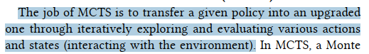

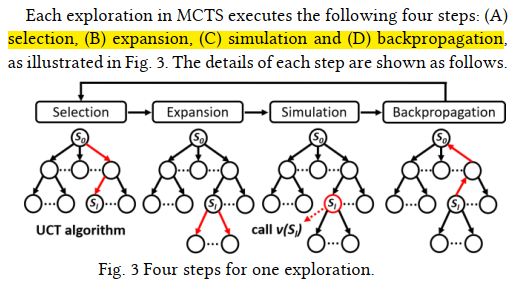

##### data

15x15 and 30x30 grids,  

##### experiment

#### [- -WCMC-2023-DRL-FuZhouU-Genggeng Liu](https://onlinelibrary.wiley.com/doi/epdf/10.1155/2023/6593938)

- most of the existing methods are heuristic algorithms, which cannot conjointly optimize the subproblems of global routing, resulting in congestion and overflow  
- DRL 和 RL 的区别：RL often faces the problem of the excessive number of states when dealing with high-dimensional spaces. With the development of deep learning, the Deep Reinforcement Learning (DRL) algorithm is developed by combining artificial neural networks with RL [10], which makes it possible for RL to solve the policy decision in a high-dimensional space   

##### background

- this paper takes the overflow as the main design goal and optimizes the wire length and congestion based on the overflow as 0.  
- `Serial routing` usually sorts nets in a specific order and routes them one by one; ==this method is fast==（相对并行组合优化的方法？）. However, there is an unfair phenomenon: the routing difficulty of the earlier nets has sufficient routing resources (meaning that the capacity of each edge in the routing area is large), while most of the later nets have tight routing resources, so the serial routing method usually rips up part of the nets and reroutes them  
- The `parallel method` routes multiple nets at the same time [21], solving the unfairness of routing resources in a serial method, but it is ==often very time-consuming and even impossible to solve==, mainly based on the commodity flow model [22] and ==integer linear programming== model [23]  

##### contribution

- use DDQN instead of DQN
- an action reduction method  
- a concurrent training method   
  - solve the unfair resource allocation problem  
- a new reward function  

##### model

输入 state：a 15-bit code is used; the starting point, the ending point, and the agent’s position are all represented by a 3-bit code; and a 6-bit code represents the edge capacities in six directions  

输出 action：action-value of 6 directions. 但是由于每层有优先方向，所以实际上最多 4 个。需要在代理选择动作时，首先消除无法执行的动作，以防止代理在训练过程中执行冗余动作，存储冗余经验，然后学习冗余信息。

reward:

If ed is higher than ec/2, a reward r < 0  is given; otherwise, a reward  r ≥ 0 will be given.  （他公式是不是错了？）

uses a heuristic algorithm to search for the path in advance and burn it into the experience replay buffer  （类似预训练）convergence speedup

#### [-DRL+segment based-ISEDA-2023-DRL+GNN-PEK](https://ieeexplore.ieee.org/abstract/document/10218371)

- DRL(GAT)
- segment-based feature extraction  
- pattern routing  enhance

**enhance:**

- 3d?
- 加上 GCELL 之间的连接？
- 像 InstantGR 做一些水平垂直分层的操作？
- capacity 放边上

##### background

- many traditional global routing methods lack learning ability.  
- more and more problems in physical design are searching for automated solutions based on machine learning. One popular application is to adopt machine learning to help early prediction  

##### contribution

- congestion-aware reinforcement learning model  
- Integrating pattern routing with reinforcement learning  
- Proposing a net segment mode  

##### flow

**model:**

- GNN feature
  - Node embedding.  
  - Pin number.
  - Fly line number.  
  - Capacity value
  - Bounding box number.   
  - Position correlation.  

- DRL(A3C)
  - We set the policy network as a fully connected layer with 200 neurons and the value network as a fully connected layer with 100 neurons.
  - Feature  of net segments
    - Net density value
    - Congestion prediction value
    - Capacity ratio value

##### data

ISPD18 benchmark  

##### experiment

**question:**

- 原文没说 prediction model 的 label 是什么
- RL 怎么做并行？具体是怎么样的，不熟

#### [- -APCCAS-2024-DRL(DDQN)-CYCU](https://ieeexplore-ieee-org-443.webvpn.scut.edu.cn/stamp/stamp.jsp?tp=&arnumber=10808325)

- DRL-based A* search algorithm
- 没有 pattern routing 的环节
- 就是 19 年那一篇，把 DQN 改成 DDQN
- 俗文

##### background

- aim to find better solutions to minimize total wire length (WL) and edge overflow (OF)  
- current solutions mainly rely on heuristic-driven greedy methods, which primarily address situations with strict constraints on the problems to be solved, such as sequential network routing after network sorting [2].   
- The A* algorithm is based on heuristic search, using a heuristic function to estimate the minimum cost from the current node to the target node. It can be used to find the shortest path from the starting point to the target pin.   

#### [RL Ripper-RRR-GLSVLSI-2023- -Canada Ucalgary Gandhi]()

- In this work[8], an RL agent to rip up nets was trained. The benchmark circuits used in this work were taken from the International Conference on Computer-aided Design [33]. However, only training results were provided, highlighting a gap in the literature regarding the scale of benchmarks and the specific problems addressed in proof-of-concept scenarios.  --cite--> [RL Ripper 2.0]()

#### [RL Ripper 2.0-RRR&VIOs Opt-Trans(TODAES)-2024- -Canada Ucalgary Gandhi]()

- incorporates a self-learning model called `RL-Ripper`  

- [previous work]( https://doi.org/10.1145/3583781.3590312  ) 

- compared to the state-of-the-art global router `CUGR`  

- Key point: reduce short violations  

- can be replicated for newer technologies  

- 用了大电路

- 没开源, 可太可惜了

- 感觉只能算一个CUGR的优化

- RL model:`A2C` and `DQN`, 

  - 有一个发现：复杂的大电路要用DQN
  - 
  - 基于`OpenAI Gym`库

  

##### background

- Why RL: heuristic solutions are not adaptable to the ever-changing fabrication demands, and the experience and creativity of designers can limit their effectiveness.   Reinforcement learning (RL) is an effective method to tackle sequential optimization problems due to its ability to adapt and learn through `trial and error`.   
- for net with overflow, the most generic RRR method is to rip all nets with short violations and reroute them. However, this heuristic is not the most efficient way since short violations can highly depend on the respective net routes and the order in which they are ripped and rerouted.  
  - After the first iteration of sequential routing, all the nets causing violations are ripped and re-routed. This can result in several RRR iterations. Furthermore, ripping all the nets can be unnecessary if a net’s route is already optimized. Hence, an intelligent ripping algorithm that pairs well with the order of nets and helps to reduce overall RRR cost is needed.  

##### contribution

- RL-Ripper Framework  
  - a self-learning Ripper agent that relies ==solely on net features==  
  - eliminating the need for externally labeled data  
  
- Evaluation on Large-scale Academic Benchmarks  
  - 以前的RLGR确实都是实验性质的小电路
  
- Pervasive AI Framework
  - fosters collaboration between traditional physical design algorithms (typically coded in `C++`) and machine learning algorithms developed in `Python`.  
  
  - enabling real-time feature extraction without the overhead associated with file read-write operations, such as pickle data exchange
  
  - 基于`Gym`  的`ZMQ client`  interface  
  
    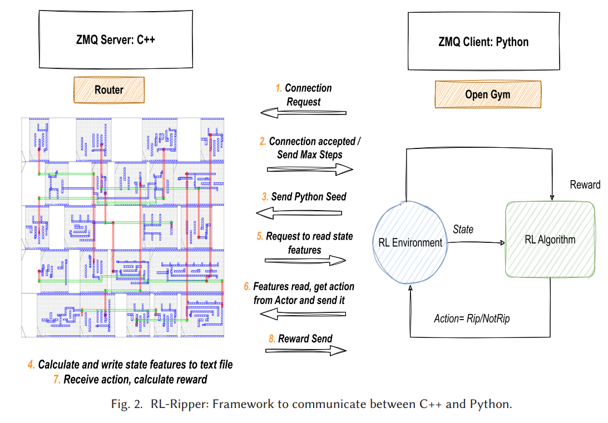

##### flow

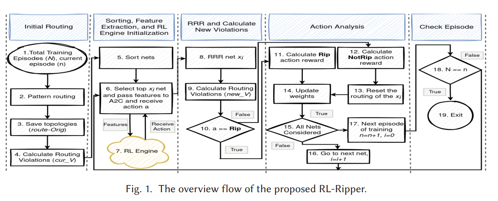

(1) We set the number of total training episodes as N , and the current episode, n, is initialized to 0. 

(2) We obtain initial routing, using the pattern routing generated by CUGR [24]. 

(3) We save the routes under the name `route-Orig`.

(4) We calculate the number of violations from the routed nets and store the results as `cur_V`  

(5), nets that are ==predicted== to have routing violations due to congestion are sorted in a particular sequence. We will elaborate on this sequence in Section 3.2.

(6), we select the top net in the ordered list of nets with violations `xi`, where i indexes the nets with violations.

(7), the RL engine generated ==one of the two possible actions== `Rip` or `NotRip` based on the features of the nets  

(8), the Net `xi` goes through RRR. 

(9), the total number of nets with violations is recalculated (`new_V`). 

(10), an `“if”` condition is processed to examine if the action a is `Rip`  

(11), if the action is a `Rip` action, the net is ripped and re-routed. Based on the new route, a reward is calculated based on `Algorithm 1`.

(12), if the action is `NotRip`, the net is still ripped and re-routed. The reward is recalculated based on the `NotRip` action from `Algorithm 1`. 

(13), we set the routing of xi to that of the initial routing of `route-Orig`. 

(14), the weights of the neural networks are updated. 

(15), the condition is checked to see if all the nets are considered 

(16), to process the next net. 

(17), Otherwise, the flow goes to the next `episode`

##### model

###### State： five net feature:

1. HPWL
2. VIOs 
   - calculated by CUGR's pattern routing
3. VIAs
   - calculated by CUGR's pattern routing
4. \#Pins
5. WL
   - calculated by CUGR's pattern routing

###### Action

- `Rip`
- `NotRip`  

###### Reward

- based on the number of violations resolved by ripping and re-routing nets  

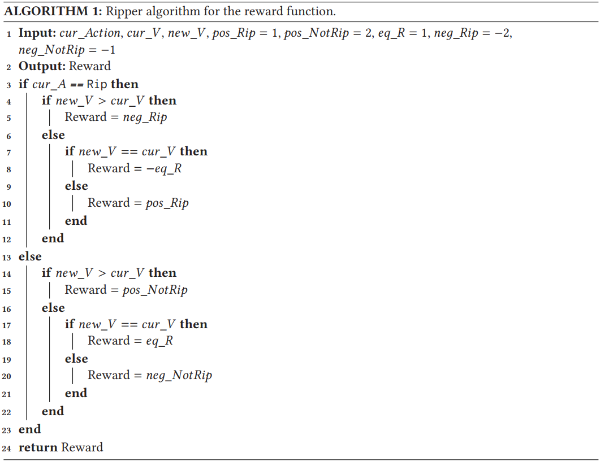

##### data

ISPD'18

- S-set: fewer than 100k cell, (design 1-5)
- L-set: otherwise

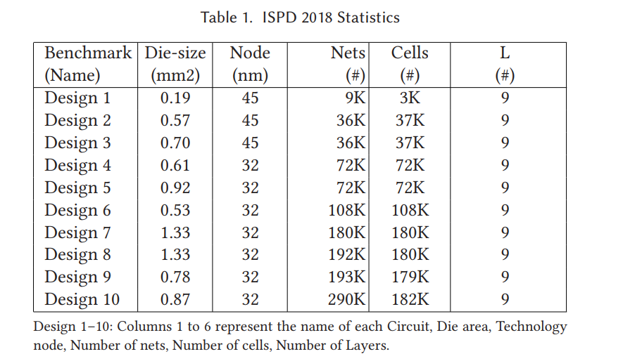

##### experiment

!!! note
    全都只是3次迭代？多一些可能更能让人信服

主要工作：

!!! note
    这里的violation指的是overflow吗？

效果明显！

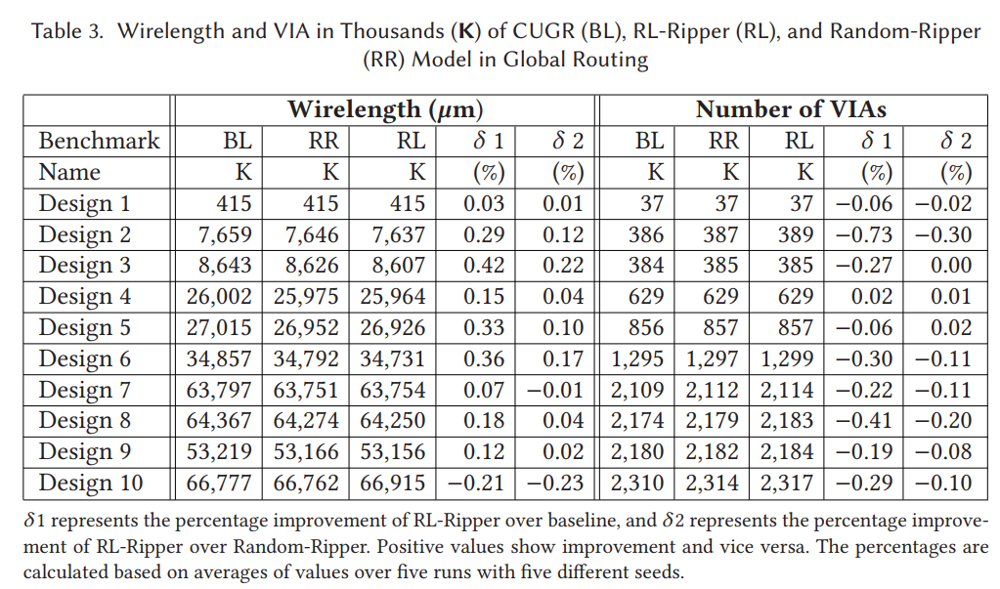

可视化:

Detailed Routing.

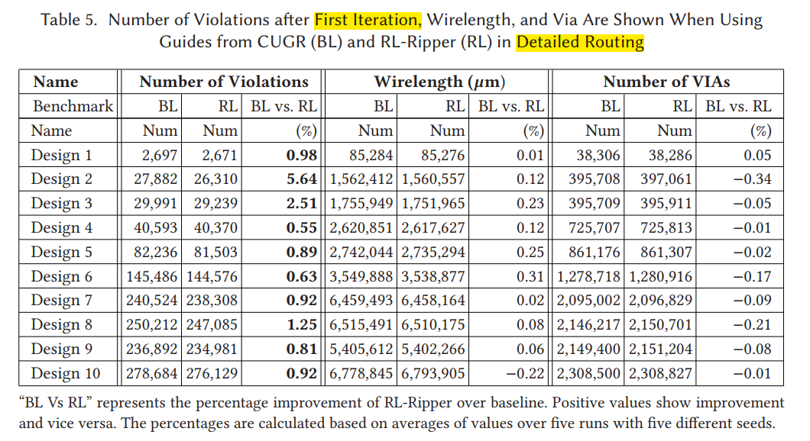

### GR_Adv_Gen

#### [-generative-arXiv-2019-CNN-](https://arxiv.org/pdf/1706.08948)

- first CNN

#### [-only CNN-DAC-2020-CNN(VAE)-](https://ieeexplore-ieee-org-443.webvpn.scut.edu.cn/stamp/stamp.jsp?tp=&arnumber=9218598)

- no experiment!
- 只用 CNN 分类结果不会好吧
- 不知道是什么类型的文章，只用了两页
- evaluates its router on parts of the nets from a public benchmark layout and achieves 96.8% of routability  
- it seems that the router can only route two- and three-pin nets, which may have some limitations for application.   

##### background

- is approach treats the global routing problem as an **image processing** problem and solves it with a deep learning system  

##### data

ISPD’98 ibm01 64x64 circuit  

##### model

#### [PRNet- -NeurIPS-2022- -SJTU+Noah’s Ark]()

- PRNet can generate each route in `one-shot` but **cannot guarantee connectivity** which requires considerable ` post-processing` for failed routes 

- HubRouter 是两阶段框架，PRNet 是端到端框架。 

- the shortest RST like Fig. 1f generated by HubRouter [8] is not practically usable  --cite--> NeuralSteiner  

  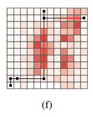

#### [HubRouter-generative model-NeurIPS-2023-GAN+RL-SJTU]()

- [open source!](https://github.com/Thinklab-SJTU/EDA-AI/tree/main/HubRouter)
- [a chinese interpretation](https://picrew.github.io/2024/03/10/HubRouter/)
- a global routing solver that includes a two-phase learning framework
- HubRouter 是两阶段框架，PRNet 是端到端框架。
- 对比 PRNet 生成模型，PRNet 在 CGAN 中使用双向映射将连接约束注入训练目标，将准确率提高了 10%，但在复杂情况下几乎无效。
- clipping all images to the same scale 64 × 64  

##### background

- 全局布线(Global Routing - GR)是 VLSI 设计中最复杂且最耗时的组合问题之一。GR 目标是总线长最小，同时避免拥塞(Congestion)，是个 NP 问题。

  传统采用启发式算法，多样性和规模问题对传统算法有了挑战，机器学习(ML)已经用于全局布线，在芯片设计中从逻辑合成到布局

- 深度强化学习(Deep Reinforcement Learning - DRL )和生成式模型(Generative model)已经被用来解决全局布线。问题在于，**DRL 很受状态空间(State Space)影响，随着网格空间增大，需要花费大量时间生成**。However, DRL methods suffer from large state space and often need to spend enormous time on generating routes as the scale of grids increases on the test instance, i.e., the netlist, which is practically intimidating for real-world global routing  

- 相反，生成式模型有 **一次性生成能力**，在计算上更容易处理。

- 生成式方法在训练时候考虑连通性限制，确保布线满足电路连通性要求。但是问题在于，如果初始生成路径不满足连通性要求时候，后处理阶段会变成一种穷举搜索过程。

- 

- 图一这里上图表示原始布线，下图表示算法生成的布线，生成布线没有正确连接所有应该连接的点(pin)，对于这样的情况，平均连通率很低，低于 20%，意味着超过 80%的生成布线需要经过耗时的后处理才能达到要求。显著的缺点。其实就和 [CNN-based](# [-only CNN-DAC-2020-CNN(VAE)-](https://ieeexplore-ieee-org-443.webvpn.scut.edu.cn/stamp/stamp.jsp?tp =&arnumber = 9218598))这篇一样

- 

##### contribution

-  为了解决上述问题，定义了一个新的概念，叫 `hub`。将 pin - pin 问题 --> hub - pin 问题 。

-  提出了一种新的两阶段全局布线方法 --> HubRouter

   - generation phase（生成阶段）

     `hubs`, `routes`, and `stripe masks` are together generated under a multi-task framework by generative models  

     可以在多个框架下生成，比如 GAN (Generative Adversarial Nets) , VAE (Variational Auto-Encoder) , DPM (Diffusion Probabilistic Models) 。虽然 hub 是生成阶段的主要输出，但为了提升生成质量和准确性，发现生成附加信息是非常有用的。比如感知和掩码(`local perception` and `stripe masks`)，能够去除噪声点。引入 `多任务学习`，布线和掩码一起生成，提高 hub 生成质量

   - pin-hub-connection phase（hub 和 pin 连接阶段）

     将连接视为 `最小斯坦纳树(RSMT)` 问题，使用 `actor-critic ` 模型网络策略。

     is hub generate correcttly, reconstruction time complexity can be reduced to **O(n log n)**  

- SOTA generative global routing models  

**model:**

- Hub

  

  - (virtual) key point in the route  
  - transferring the pin-pin connection problem to the hub-pin connection problem
  - 斯坦纳点(Rectilinear Steiner Point --> RSP)是搜索全局最小总距离，但是 hub 是来确定路径。RSPs are special cases of hubs  
  - RSP 是 Hub 的特例，Hub 可以随意生成不同形状的路径(不仅是最短的)
  - 这里的 `c` 和 `x` 分别代表条件图像和输入图像。条件图像可能包括引脚位置、已经提取的中心点以及条带掩模（stripe mask）。条带掩模是用来指示布线区域的一种方式，它可以帮助模型更好地理解哪些区域可以用于布线

##### flow

- hub 生成阶段

  - Hub 生成可以表示为图像到图像的 `multi-task learning framework`   任务, address the impact of sensitive **noise** points with stripe `mask learning`  

  - `附录 B ` 介绍了将 GAN，VAE，EAN 纳入到生成框架

  - 在这个阶段，模型旨在逼近条件分布 `pθ(x|z, c)` 使其接近先验分布 `p(x|c)`。给定条件 `c` 和从先验分布 `pz(z)` 中采样得到的潜在变量 `z`（通常假设为 **高斯分布**），模型会生成一些“中心点（hubs）”. 这里的 `c` 和 `x` 分别代表条件图像和输入图像。z is a latent variable from a prior distribution   

  - The main objective of hub generation is to minimize the difference between probability distributions  `p(x|c) ` and `pθ(x|z, c)`

  - a noise hub, especially the outermost one, can largely harm the wirelength of routing. Use `stripe mask` to focus on bad cases for hub generation  

    

    

- hub 和 pin 连接阶段

  - 模型连接第一阶段生成的 **中心点**，以获得最终的布线路由。这个过程可以被视为构建矩形稳定最小生成树（Rectilinear Steiner Minimum Tree，RSMT）的一部分。为了完成布线，模型遵循了一个基于强化学习（Reinforcement Learning，RL）的算法 `REST`。
  - 在两阶段的过程中，作者还提出了一个 `多任务学习框架` 来提高生成中心点的质量。特别是，提出了一种新颖的 `条带掩模学习方法`，旨在减轻噪声点案例可能造成的负面影响。算法的具体细节在 `附录 B ` 中给出。

#### [Neural Steiner-AI for Steiner-NeurIPS-2024-Chinese Academy of Sciences-CNN]()

##### background

- the yielded routing paths by the existing approaches often ==suffer from considerable overflow,== thus greatly hindering their application in practice.   
- two advantgages:
  - learning scheme to ensures the connectivity  
  - can effectively scale to large nets and transfer to unseen chip designs   
- Due to the complex and irregular distribution of congestion, the construction of escape graph becomes complicated, while the ==Hanan grid is ineffective at circumventing congestion==  
- `FLUTE` is unaware of congestion  
- `CUGR-2` applies the construction of `augmented graphs` to build candidate paths for nets’ RSTs, adjusting the position of certain Steiner points to circumvent potential congestion  
- 主要是和 HubRouter 做对比
- 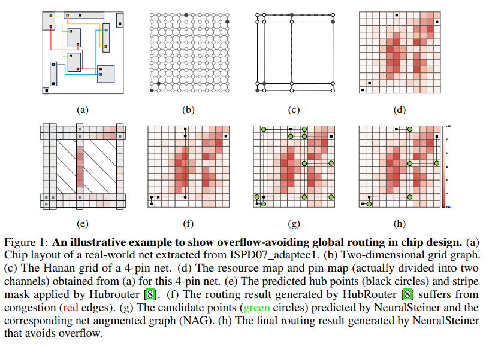

##### contribution

1. `Neural Steiner` can effectively scale to ==large== nets
2. transfer to unseen chip designs without any modifications or fine-tuning without any modifications or fine-tuning  
3. achieves up to a 99.8% ==reduction in overflow== while ==speeding up== the generation  and maintaining a slight ==wirelength loss within only 1.8%==.  
4. ==the first== learning-based approach capable of optimizing both wirelength and overflow and effectively addressing the routing problem of large-scale nets  
5. Moreover, NeuralSteiner can generate overflow-avoiding routes for nets with more than 1000 pins  

##### flow

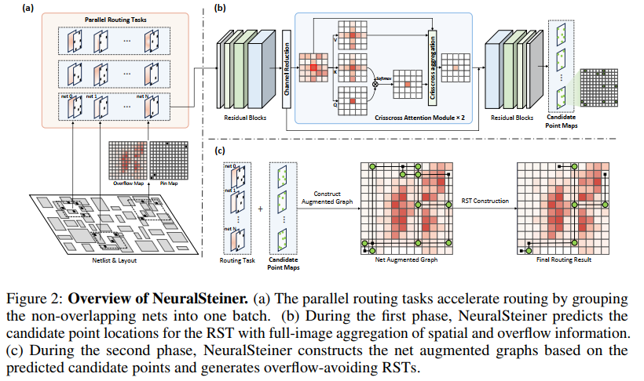

1. Parallel Routing Tasks Construction

   - divides the numerous nets in the design into a set of mutually conflicting routing tasks.   

   - 也就是不重叠的 net 分 batch， 一个 batch 内的布线任务用 t 表示
   - Nets within a task t can be batched together and fed into the neural network for `prediction` and `post-processing`,  这个网络是针对 batch 的

2. Candidate point prediction phase  

   - image segmentation task  
   - we simplify the learning target in RST construction and select Steiner points and corner points in RST as candidate points to learn  
   - 
   - due to the fixed geometric structures, CNN is inherently limited to local receptive fields that face ==difficulties in capturing long-range correlations.== Thus, we introduce the `recurrent crisscross attention mechanism (RCCA)` to aggregate features from all pixels on the feature map  

3. Overflow-  avoiding RST construction phase:  

   - net augmented graph (NAG)   

     1. first merge the predicted candidate point map and pin map  
     2. 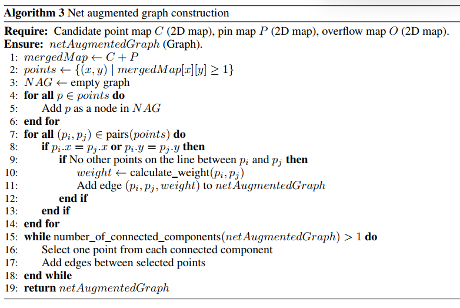
     3. 请注意，在 HubRouter [8] 中，引入了条带掩码作为一种滤波器，用于去除噪声中心点，以限制类似于哈南网格的解空间，从而确保线长度尽可能短。然而，如图 1e 所示，在 HubRouter 中添加条带掩码限制了其生成避开拥塞区域的 RST 的能力。相反，我们在这里 ==保留了模型预测的所有候选点==，并基于它们构建了 `NAG`

   - RST construction

     

   - Since this method ==may generate additional detours==, we use a ==simple== algorithm to detect potential feasible path reuse to shorten the wirelength.  

##### data

- use `CUGR` to perform routing on public benchmarks: `ISPD'07 contest`   

- adopt the `logistic function` in CUGR to calculate the overflow value using resource r(u, v)  

  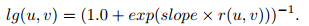

- mark the Steiner points and corner points in the RSTs constructed by CUGR as candidate points and generate the label candidate point map for every net.   

- we maintain `three` maps of every net at the original scale of its bounding box. This preserves the precise spatial and overflow information and does not exclude any large-scale nets.  three map 指的是什么？

- we limit the nets’ Half-perimeter wirelength (HPWL) in the training set to ==HPW L ≤ 128==  

##### experiment

1. Loss:

   

   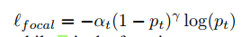

   

   

2. 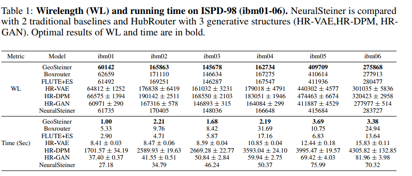

3. 

4. 

5. 

6. 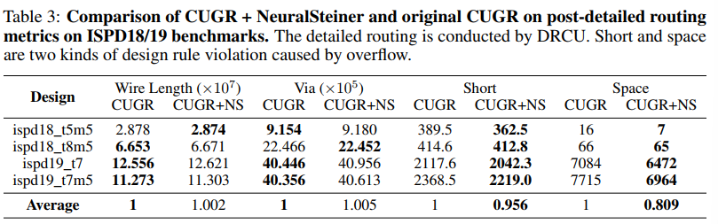

7. 

8. 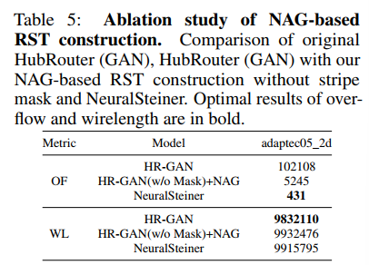

### GR_Adv_Sequential

- GPU-accelerate
- these approaches rely on “parallelizing " traditional sequential algorithms in GPUs. 
- the quality of the routing result is ==still limited== by the traditional sequential-based algorithms  

#### [han-GPU+netlevel parallelism-ICCAD-2011- -]()

#### [A global router on GPU architecture- -ICCAD-2013- -]()

#### [VFGR-Fat via congestion modeling-ASP DAC-2014--THU](https://ieeexplore-ieee-org-443.webvpn.scut.edu.cn/stamp/stamp.jsp?tp=&arnumber=6742945)

- net-level and region-level parallelization  
- 有点偏工业

#### [SPRoute 2.0- detailed routability driven-ASP DAC-2022-](https://ieeexplore.ieee.org/abstract/document/9712557)

- [OpenSource!](https://github.com/asyncvlsi/SPRoute/tree/master)
- 2D
- 可以将 guide 文件输入到 innovus?
- `soft capacity`   The soft capacity is downsized from the hard capacity (number of available tracks), using the pin density and RUDY value of the region.   
- `batch` for ==deterministic== net-level parallelization strategy  
- `bulk-synchronously` maze-routes  
- baseline FLUTE, [FastRoute 4.0](# [fastroute 4.0-via min tree+3 bending-ASPDAC-2009-]()) for pattern routing, [CUGR](# [CUGR-3D pattern+Multi level maze routing+patching-DAC-2020-CUHK](https://github.com/cuhk-eda/cu-gr))

##### background

- In terms of parallelization, maze routing is widely used in global routing and ==is the most time-consuming stage== on hardto-route benchmarks.   

##### contribution

- `soft capacity` to reserve space for detailed routability. 
- parallelize maze routing in a `deterministic bulk synchronous approach`
- design a `scheduler` for the deterministic parallel  execution model  

##### flow

##### model

###### soft capacity

Different layers have different parameters for the ratio function since they are influenced by the congestion in different scales  

###### bulk synchronous deterministic approach

就是分 batch，all threads execute one batch of nets at a time  

在批处理开始时，每个线程从批处理中获取一个网络，读取全局图的使用情况，并在其线程局部图中执行撕裂和重新路由。

还是看不太懂

##### data

ICCAD19 contest

##### experiment

#### [FastGR-GPU pattern routing+ multi thread maze–DATE-2022-PKU+CUHK+HNAL](https://ieeexplore.ieee.org/stamp/stamp.jsp?tp=&arnumber=9774606)

- GPU-accelerated
- accelerated the 3D pattern routing algorithm of [CUGR](# [CUGR-3D pattern+Multi level maze routing+patching-DAC-2020-CUHK](https://github.com/cuhk-eda/cu-gr)) for initial routing by both `net-level` and `path-level` parallelization on GPU

##### background

- The literature has extensively explored shortest path searching with GPU [11], [12]. However, most studies only consider the most basic single-source shortest path problem and assume only to find one path on a large graph. This is impractical for routing since we need to route millions of nets subjecting to various objectives and constraints like wirelength, number of vias, and design rules  

- 

  Fig. 1 shows that it is PATTERN dominated on average since the number of nets which pattern routing stage needs to process is much more than the maze routing stage  

##### contribution

- a novel GPU-accelerated `pattern routing algorithm`
- a high-performance task `graph scheduler` to distribute CPU and GPU tasks for workload balancing and efficiency

##### flow

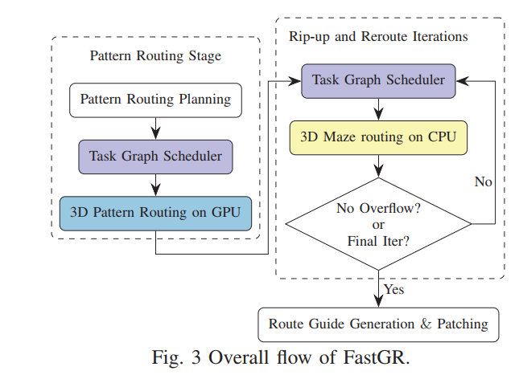

##### model

1. task graph scheduler==(没看懂！！！！！！！)==

   - 是用来指导迷宫布线并行的，用了`taskflow`

   - two-stage task graph scheduler:
     1. construct the task graph from the conflicted relationship between each pair of tasks  
     2. determine the execution order for each conflict edge 

2. Pattern routing stage: Task graph generation  

3. GPU friendly pattern routing

   

   - we apply each block to process one single multi-pin net  
   - 

##### data

ICCAD2019 benchmarks  

##### experiment

1. RTX 2080 GPU.  

2. we choose six different strategies only applied to the rip-up and reroute iterations to show the effect of net ordering  

3. 

4. 不同net order 的实验结果：

   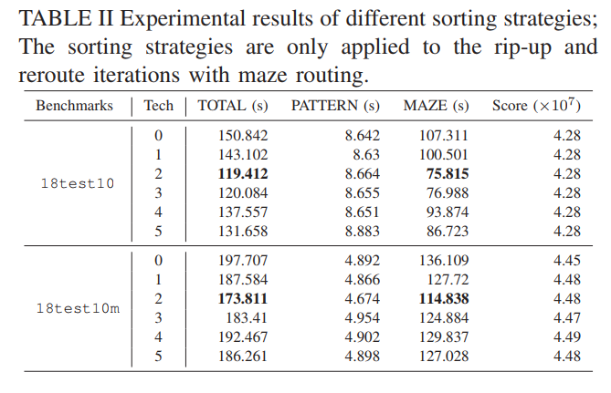

5. 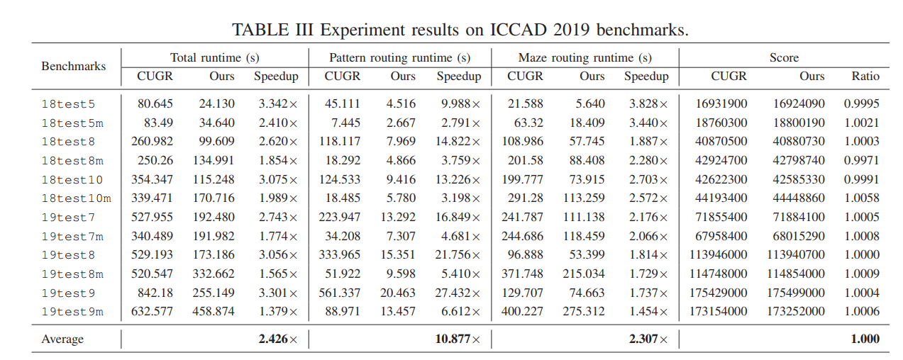

#### [Gamer- -ICCAD/Trans-2021/2023- -CUHK-]()

- GPU-accelerated

- accelerated the two-level maze routing of [CUGR](# [CUGR-3D pattern+Multi level maze routing+patching-DAC-2020-CUHK](https://github.com/cuhk-eda/cu-gr)) for rip-up and reroute by updating vertical and horizontal routing costs alternatively on GPU  

- to accelerate the `multisource–multidestination shortest path problem` for VLSI routing  

  !!! note
      什么是多源多汇最短路径问题？
      
      

- integrating `GAMER` into the state-of-the-art academic global router `CUGR` 

##### background

- Maze routing is usually the most time-consuming step in `global routing` and `detailed routing`
- Many of them adopt the `negotiation-based rip-up and reroute` method introduced in [3]. Hard-to-route nets are ripped-up and rerouted many times with incrementally changing history cost until getting a feasible solution.   
- One way to do this is to separate nets by their bounding boxes and create a task pool. Each thread will search for a net in the `task pool` whose bounding box does not overlap with any other nets being routed at the moment and perform maze routing [6]. However, if the bounding boxes are too big, the level of parallelism for this method is low  
- The approach described in `[7]` attempts to solve this problem by allowing nets with overlapping bounding boxes to be routed together, and fix any possible overflows afterward by rerouting  (这篇也许可以看看)
- `SPRoute [8]` does not forbid routing in the same region if and only if the region has abundant routing resources.   
- `NCTU-GR 2.0 [9]` also allows nets with overlapping bounding boxes to be routed simultaneously, but they adopt a more sophisticated technique to avoid the racing situation  
- However, some extra efforts are needed to resolve `data racing`, which may lead to `unbalanced workloads` and routing performance degradation. Besides, as technology evolves over time, graphics processing units (==GPUs==) are standing out, and can provide better solution to parallelism. There are relatively fewer attempts to load maze routing onto GPUs.  

##### contribution

1. decomposes the shortest path search into `alternating vertical and horizontal sweep operations`,  
2. two parallel algorithms are proposed to accelerate a sweep operation ==from O(n2) to O(log2 n)== on a grid graph of n × n.   

##### flow

##### model

1. SWEEP Operation

   

2. Parallelization With Conditional Partial Sum  

   !!! note
       divide-and-conquer method:
       
       

#### GGR-pattern and maze gpu accelerated-ICCAD-2022

- [Open source!](https://github.com/cuhk-eda/Xplace/tree/main/cpp_to_py/gpugr)

- 第一个pattern routing和maze routing都是GPU-accelerate的
- The solution space of pattern routing is intentionally ==restricted== to shorten running time by only allowing certain routing topologies such as ==L-shape, Z-shape and 3-bend routing==
- 用的`FLUTE`

##### background

- Routability-driven placement relies on global routing for accurate routability estimation,  and faster global routing can significantly improve both the running time and the quality of routability-driven placement.   他把应用场景明确了，是给placement用的。开源工程中也是这么放的，放到`Xpalce`中
- Compared to multi-threading with CPU, GPU has more cores and is potentially a good platform for fast global routing.  
- 
- The computations of the ==DP== framework can be performed very efficiently, but the ==most time-consuming part== comes from computing the minimum costs connecting two points using 3D L/Z-shape routing

##### contribution

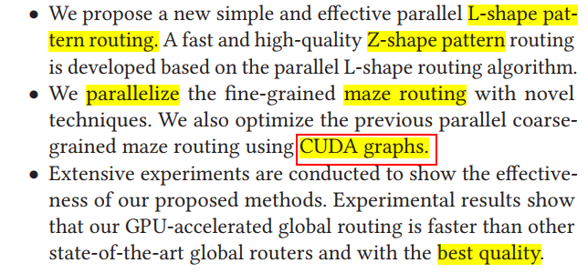

##### flow

##### model

- An efficient way to calculate the total cost of a long wire segment is to use `prefix sum`.
- Parallel L-Shape Routing  
  - 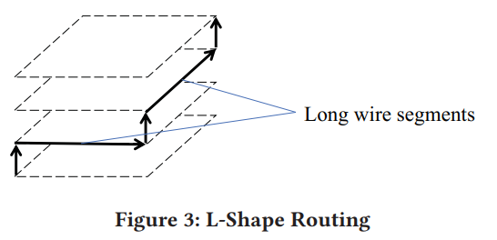
  - Our L-shape routing for a single 2-pin connection can be divided into ==5 steps== as shown by the 5 arrows in Fig. 3  
  - Every step can be done sequentially in ==𝑂(𝐿) time==  

##### data

##### experiment

- a The global routing quality is evaluated using an academic detailed router Dr. CU[8]  

#### [CUGR 2.0-DAG-based-DAC-2023- -CUHK](https://ieeexplore.ieee.org/stamp/stamp.jsp?tp=&arnumber=10247702)

- [open source! ](https://github.com/cuhk-eda/cu-gr-2)

##### background

- many of the aforementioned global routers is that most of them rely heavily on **time-consuming path search algorithms** like maze routing to resolve overflows. These approaches are not efficient enough even with parallilization and may cause lots of unnecessary detours  

##### contribution

- a ==DAG-based== generalized pattern routing algorithm
- a new ==dynamic programming-based== algorithm to calculate the routing cost time complexity from $\mathcal{O}(L^4|V|)$ to $\mathcal{O}(L^2|V|)$
- a DAG ==augmentation algorithm== that enables the creation of alternative paths in a routing DAG.   can even shift or create Steiner points. over 99% nets can be successfully routed ==without the need of maze routing==
- a new sparse graph ==maze routing algorithm== creation of alternative paths in a  routing DAG

##### flow

1. RSMT 

   

2. DFS and ` Routing DAG` with L pattern

   注意多了节点 g, f, i, h, 现在每条都是直线

   

   `Routing DAG` with other patterns，但是在这里没用做初始布线，初始只用了 L-shape。文章也就这里提了一下，后面都和这个无关，得去源码仔细看看。

   

3. Dynamic Programming-based DAG routing(L-shape + Layer assignment)

   没说怎么舍弃的？

4. DAG-based pattern routing with **augmentation**  

5. sparse graph **maze** routing algorithm

##### model

- cost 

  - Dynamic Programming-based  

    

  - DAG Augmentation for Congestion  

    

    1. create alternative paths   

       

    2. Steiner point movement

       具体怎么移动的文章也没说

##### experiment

- compare with CUGR [12] and SPRoute 2.0 [13]  

  

  

  

  only one thread  for run time

- 

- Effectiveness of  steiner point augmentation  

- 

- run time compare with GPU-accelerated GR

  - compare with FastGR [14] and GAMER [15]  

  - GPU 的好坏也有关系吧。本实验用的 RTX 3090  

  - slightly faster than FastGR for initial routing 

    

  - around 5.2× as fast as GAMER

    

#### [InstantGR-Scalable GPU Parallelization-ICCAD-2024-CUHK](https://shijulin.github.io/files/1239_Final_Manuscript.pdf)

- [open source! ](https://github.com/cuhk-eda/InstantGR)
- second place of ISPD25 contest
- GPU Parallelization  
- parallel algorithm is mainly based on the DAG-based global routing algorithm in [CUGR2](# [CUGR2.0 EDGE- -DAC-2023-](https://ieeexplore.ieee.org/stamp/stamp.jsp?tp=&arnumber=10247702)).  应该是 3D pattern routing DP 的部分和 maze routing 的部分
- parallel while do initial routing  and RRR
- 提高了并行度，但是还是有串行的部分
- 也用了 FLUTE
- 一定要以 net 为单元吗？是为了用 DP

##### background

-  GPU memory is limited  
   - This requires memory-efficient solutions that can minimize CPU-GPU communication while maximizing GPU utilization  
   - large designs have more nets with bigger routing graphs, providing many new parallelization opportunities that are not yet explored  
-  nets in a batch can be routed in parallel

##### task

- parallelism for large-scale
- partitioned  design

##### contribution

- a new method for `net-level batch generation`. based on 3D fine-grained overlap checking and explores more parallelism by increasing the number of nets per batch
- `node-level` parallel routing approach. achieves much higher parallelism compared to traditional net-level parallel routing.

##### flow

- In initial routing, we construct a basic `routing DAG` to perform **L-shape pattern routing**.  

**key points**

specific explanation show in [routing2](../routing/routing2.md)

- NET-LEVEL PARALLELISM  

  - simultaneous routing of a `batch` of nets that do not “`overlap`”  

  - [2, 3, 14, 19, 20, 22, 26]  19 年开始的，cugr2 和 fastgr 都用了

  - **Typical** Batch Generation Algorithm  

    used in [2, 3, 14, 19, 20]  

    

    `R-trees ` 是实现 `line 4` 的常用做法

    `pessimistically approximates`  significantly lowers the degree of parallelism  

  - define and graph model

    

    

    以 `segment` 为单位，同时分开了水平和垂直两个部分，假设全部为 L-shape，同时对于不在一条线上的两个节点，有两个 L

    These four nets will be divided into just `one batch` based on our exact representation of routing graphs for overlap checking, while into `four batches` by the traditional bounding box-based pessimistic approximation  

    via model:

    

    

    

    via 用一个十字表示

  - Overlap Checking Algorithms  

    1. 以水平子图进行展示，垂直同理

    2. 以水平 segment 为单位进行 checking

    3. 首先判断是不是 y 坐标相等：group the segments with the same 𝑦  

    4. tradictional algorithm:

       This is a classical computational geometry problem that can be efficiently solved by `segment trees` [1] in 𝑂(log𝑛) time for both operations,   

       

    5. new algorithm motivation:

       

       segments are very short

    6. new algorithm: `Point Exhaustion`

       simply use a Boolean array to record whether each point in [1, 𝑛] is covered by some segment 𝑠 ∈ 𝑆. We mark every point 𝑥 ∈ [𝑙, 𝑟] when a segment [𝑙, 𝑟] is inserted, and check every point 𝑥 ∈ [𝑙𝑞, 𝑟𝑞] for overlap query of a segment [𝑙𝑞, 𝑟𝑞].   

       further improve the efficiency of this point exhaustion by using bit arrays  

    7. another improvement: `representative point exhaustion  `

       - allowing a little bit of overlap.   
       - it only checks the two end points of a query segment. ??什么意思  
       - covering most overlap scenarios in practice.   
       - The only scenario that this algorithm fails to find the overlap of two overlapping segments is when the query segment [𝑙𝑞, 𝑟𝑞] contains the overlapping segment [𝑙, 𝑟], [𝑙, 𝑟] ⊂ [𝑙𝑞, 𝑟𝑞]  

       

- NODE-LEVEL PARALLELISM

  

  - 还是以 net 为单位分到不同的 batch？

  - routing nodes of the same depth in parallel  

    

    Suppose we have 4 nets, Net A, B, C and D in our grid graph. Since nets with overlap cannot be routed together, Net A and B are distributed to batch 0, as shown in Figure 7a, and nets C and D are distributed to batch 1.  

    

##### experiment

- 4 NVIDIA A800 GPUs and 8 CPU threads.

-   compare different overlap checking methods  

    

    The number of nets per batch is limited to 1000  

- compare 2 largest benchmark

  

- compare with Top-3 Global Routers of ISPD2024 Contest   

  

- Runtime (s) of DAG-Based Augmented Routing with and without Node-Level Parallelism  

  

  acceleration 那一行好像是加速倍率才对

#### [HeLEM-GR-Heterogeneous+Linearized Exponential Multiplier Method-ICCAD-2024- -PEK]()

- first place of ISPD25 contest
- not open source 2025/2/6
- 2D routing algorithm  

background

##### contribution:

- `LEM`(linearized exponential multiplier) method for ==2D routing problem== to minimize wirelength and overflow. This LEM framework is ==general to integrate any routing kernels.==  
- `batched routing kernels`  including ==L shape and 3-bend routing== for GPU parallelization.  
- `sweep operations`  for GPU-accelerated layer assignment.

##### flow

- preparation  
  - run on CPU
  - use FLUTE
  - use ` SPRoute 2.0`  to compact 3D graph to 2D graph  
- 2D routing  
  - run on GPU
- layer assignment
  - run on GPU

### RSMT

#### [Hannan grid- - -1966- -]()

- has proven that an optimal RSMT can always be constructed on the Hanan grid  

#### [GeoSteiner- - -1998- -]()

- [GeoSteiner Homepage](http://geosteiner.com/), 一直有更新，5.x版本貌似比FLUTE更好了。97年搞到现在（2025）。4.0版本是商用的。

- an efficient optimal algorithm that ==enumerates== all possible full Steiner tree to form an RSMT
- It is proven that an optimal RSMT can always be found by combining full Steiner trees only, which are Steiner trees with a special structure.   
- The running time of GeoSteiner inevitably goes to exponential

#### [-Multilayer Obstacle Avoiding+Spanning Graphs-Trans-2008- -](https://ieeexplore-ieee-org-443.webvpn.scut.edu.cn/stamp/stamp.jsp?tp=&arnumber=6930811)

#### [FLUTE- - -2008- -]()

- [OpenSource!](https://home.engineering.iastate.edu/~cnchu/flute.html)
- The runtime complexity of FLUTE with fixed accuracy is O(n log n) for a net of degree n  
- FLUTE is an RSMT construction algorithm adopting a look-up table approach, which is both fast and optimal for low-degree nets. However, FLUTE is unaware of routing **congestion**.  

下面是一系列 FLUTE 和基于 FLUTE 的改进

##### background

- RSMT problem is NP-complete [1].  
- Most signal nets in VLSI circuits have a low degree. Therefore, in VLSI applications, rather than having a low runtime complexity, it is more important for RSMT algorithms to be simple so that they can be efficient for small nets.   
- Hanan [16] pointed out that an optimal RSMT can always be constructed based on the Hanan grid.  
- 基本定义

  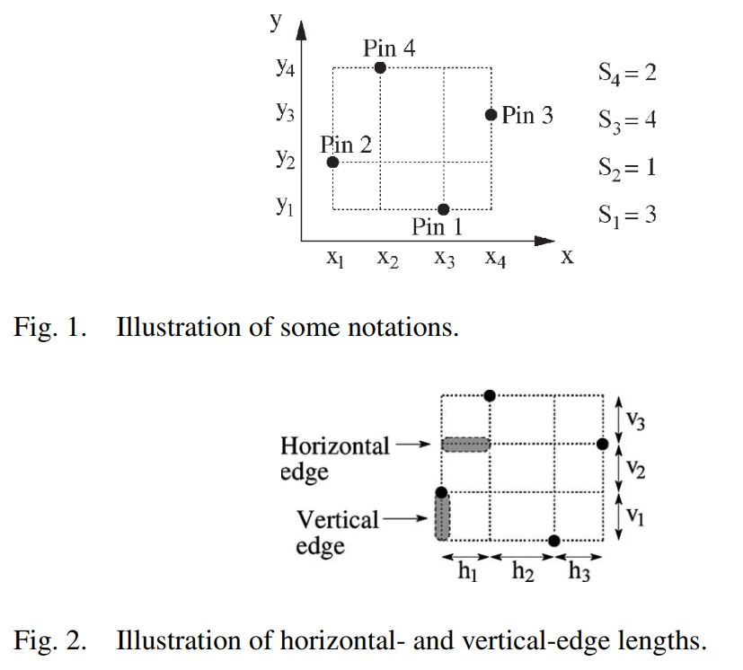

  x, y, s, h, v

  `position sequence`: s1, s2, s3, s4 = 3142

  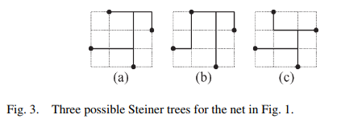

  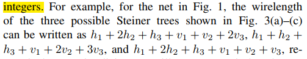

  wirelength vectors are: (1, 2, 1, 1, 1, 2), (1, 1, 1, 1, 2, 3), and (1, 2, 1, 1, 1, 1)  
- POWV and POST for net(degree < 9)

  - For each group, the optimal wirelength of any net can be found based on a few vectors called potentially optimal ==wirelength vectors== ==(POWVs)==.  
  - We also store one corresponding Steiner tree, which we called potentially optimal ==Steiner tree== ==(POST)== associated with each POWV. 

##### contribution

- We show that the set of all ==degree-n nets can be partitioned into n! groups== according to the relative positions  of their pins.   

##### model

1. \##### 制表枚举化简：

- Note that, although the number of the possible Steiner trees is huge, the number of the possible wirelength vectors is much less. And we notice that not all the wirelength vectors have the potential to produce the optimal wirelength
- Most vectors are redundant because they have a larger or equal value than that of another vector in all coefficients.  For example, we can ignore the wirelength vector (1, 2, 1, 1, 1, 2) because the wirelength produced by the vector (1, 2, 1, 1, 1, 1) is always v3 less.  
- We called a vector that can potentially produce the optimal wirelength (i.e., cannot be ignored) a ==POWV==  
- for every low-degree net, there are only a few POWVs. For example, for all degree-3 nets, the only optimal wirelength vector is (1, 1, 1, 1), which corresponds to the half-perimeter wirelength (HPWL).   

###### group the nets which can share the same set of POWVs

- 如果每一种 POST 对应一些 POSTs，会有太多种可能，浪费空间

- 定义：topologically equivalent

  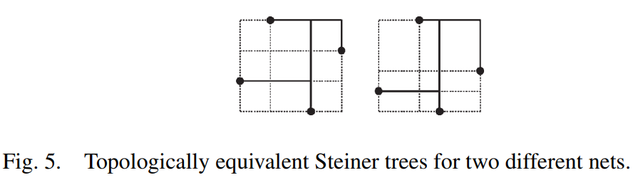

  have the same `position sequence`

- Theorem 1: the set of all degree-n nets can be divided into ==n!== groups according to the position sequence such that all nets in each ==group== share the same set of POWVs. (9!= 362,880)

  

2. \##### LUT generateion

- 如果使用遍历的方法，慢。Even for degree 5, we need to enumerate a Hanan grid consisting of 40 edges（$4 \times 5 \times 2$） for each of the 120 groups(5!)

- `boundary-compaction technique` for efficient:

  By compacting the four boundaries in a different order, a set of different Steiner trees with different wirelength vectors can be generated

  - 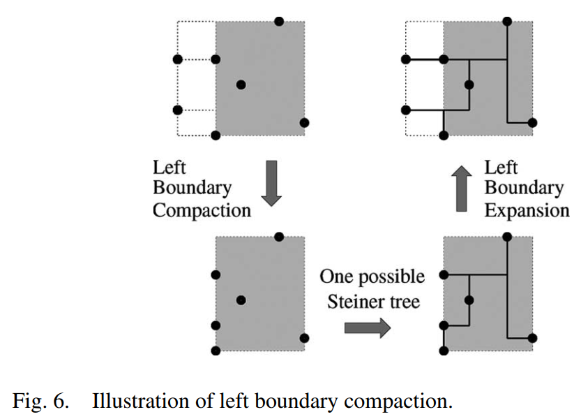

  - 边界压缩技术通过压缩四个边界中的一个来减小网格大小，即，将边界上的所有引脚移到与该边界相邻的网格线上。

    
  
  - 
  
  - 还是没看懂 0.0
  
  - 结果：number of POWVS in a Group:
  
    

3. REDUCTION OF LOOKUP TABLE SIZE  

   - The POST associated with each POWV should have up to seven Steiner nodes and 9 + 7 - 1 = 15 branches. If 1 byte is used to store each branch in a POST, the POST storage requirement for degree 9 will be 155.9 MB  

   - 

   - 

   - Groups are equivalent for two reasons  

     - First:

       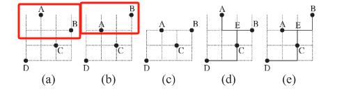 Therefore, up to 2^4^ = 16 different groups can share a set of POWVs and POSTs  (the number of equivalent groups may be less than 16 because pins can be shared by adjacent boundaries, and therefore, not all combinations exist).   

     - Second, if two nets are symmetrical horizontally, vertically, or diagonally, the POWVs and POSTs of one group can be transformed to those of the other.   

   - The total table size is only 9.00 MB in the end  

4. SPEEDUP OF MINIMUM-WIRELENGTH COMPUTATION  

   - Since entries in POWVs are typically small integers and addition is computationally much less expensive than multiplication, it is more efficient to add the edge length several times instead of using multiplication (加法比乘法好)
   - Many of them differ from others in only one or two entries. Hence, some POWVs can be efficiently evaluated by adding or subtracting some terms from some other previously computed POWVs.   

5. NET BREAKING  

   - Nets with a degree ==higher than D (D 一般等于 9)== are broken into several subnets with a degree ranging from 2 to D to which the table lookup estimation can be applied  
   - ==four heuristics== are applied to collectively determine a score for each way of breaking.   
   - In this technique, a scheme is also introduced to allow users to control the ==tradeoff between accuracy and runtime==  
   - 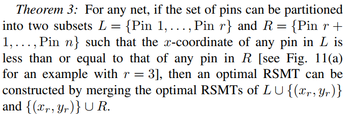
   - 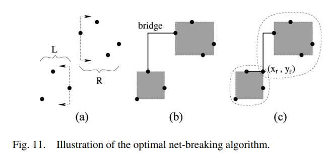
   - 
   - 

##### data

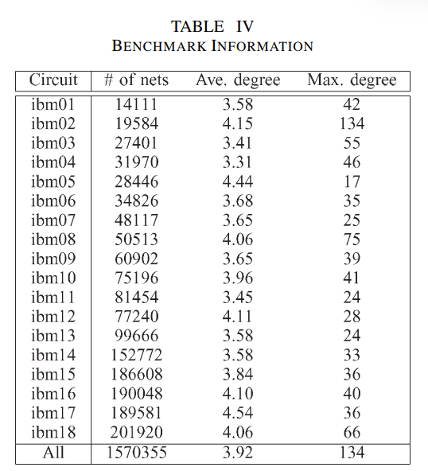

##### experiment

1. 模型对比 

   GeoSteiner 作为标准

   

2. 不同度的图对比

   

3. runtime

   

   The runtime is increasing at a rate much slower than A(log A+1)/2 because most nets have a low degree  

   because the redundant edge removal and the local refinement techniques described at the end of Section VI-B cannot be used, the error is increased.  

4. 更大的 degree

   

#### [-obstacle avoiding+parallel -ICCAD-09- -CUHK-](https://www.cse.cuhk.edu.hk/~fyyoung/paper/iccad09_geosteiner.pdf)

#### [-Obstacle avoiding-Science Direct-2013- -CUHK](https://www.sciencedirect.com/science/article/pii/S0167926013000424)

#### [REST-attention mechanism-ICCAD-2021-RL(AC)-CUHK](https://ieeexplore-ieee-org-443.webvpn.scut.edu.cn/stamp/stamp.jsp?tp=&arnumber=9586209)

- [OpenSource!](https://github.com/cuhk-eda/REST)
- [github 上有个相关的复现](https://github.com/fugjgjguhih/Solving-VLSI-DRL/tree/40b6c6324927a8ef875558ab6d229a3545a451e6)
- the first successful attempt to solve this problem using a machine learning approach  

##### background

- machine learning based approaches have shown several advantages over the traditional heuristics, e.g., shorter time for development, superior quality and speed for small to middle size instances.  
- previous ML-based combinatorial problem (TSP) work: RNN-based pointer network [6] --> RL-based work [8] --> multi-hand atttention+[8] work [9]

##### model

###### Rectilinear Edge Sequence (RES)

- designed for bridge the gap between machine learning output and RSMT structure.  

- 

- res = ((2; 1); (2; 4); (3; 4))  ,(vi, hi)分别表示在点 vi 上做垂线，在 hi 上做水平线

- overlapping edges indicated by an RES are merged automatically, with Steiner points created

- 原文证明了 res 一定可以找到最优的 RSMT

- **Good Properties of RES**  

  - Fixed Length Sequence: Determining the number of pairs to output is non-trivial for a neural network model. Fortunately, this will not be a problem with RES, since the length of the RES for any set of n points is always n - 1  

  - The evaluation process is often the bottleneck of reinforcement learning, as it usually requires lots of computations or even simulations. The RES can be evaluated in linear time by finding the length of the horizontal and vertical segments over each point.   

    

    

###### AC model

- 输入是 n 个节点的(x, y)坐标

##### experiment

- 好像没什么提升

#### [-GPU-Accelerated-ICCAD-2022--PEK](https://ieeexplore-ieee-org-443.webvpn.scut.edu.cn/stamp/stamp.jsp?tp=&arnumber=10069158)

- first GPU-accelerated RSMT generation algorithm  

##### background

- Rectilinear Steiner minimum tree (RSMT) generation is a fundamental component in the VLSI design automation flow. Due to its extensive usage in circuit design iterations at early design stages like ==synthesis, placement, and routing==, the performance of RSMT generation is critical for a reasonable design turnaround time.   

- previous work are CPU-based

- 在 GPU 上加速 RSMT 生成是一项重要但极具挑战性的任务，主要原因在于其复杂的、非平凡(non-trivial)的分治(divide-and-conquer)计算模式与递归操作。

- NP-completeness of RSMT generation --cite--> [1]

- the current most efficient and widely-adopted heuristic is FLUTE [9], 

- Although most of the nets in a typical circuit design have only a small degree (≤ 9), larger nets are exponentially harder to solve

  

- RSMT algorithms, such as FLUTE, are based on a ==divide-and-conquer== strategy with deep recursions, which are impossible to be executed on GPU threads with very limited stack memory

- The sizes of nets in a circuit netlist are ==highly uneven==, from 2-pin nets to nets with 40 pins or more, which leads to an extremely ==imbalanced workload== and harms the parallelism.   

- 基于汉南网格：

  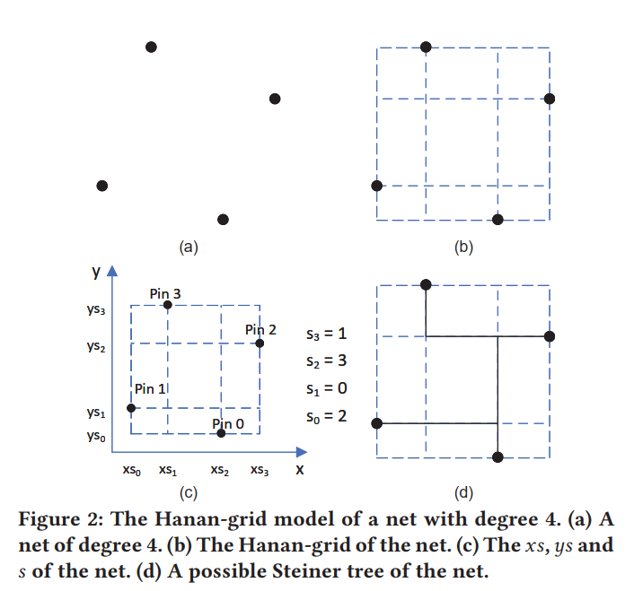

  - 每个点三个特征：(x, y)坐标(sort according to y coordinate)，排序 s(sort according to x coordinate)

- R-MST does not insert any Steiner points and can be efficiently constructed in 𝑂 (𝑛 log𝑛) time for a net with 𝑛 pins [4], but at the cost of up to 50% worse result than RSMT [5]  

- 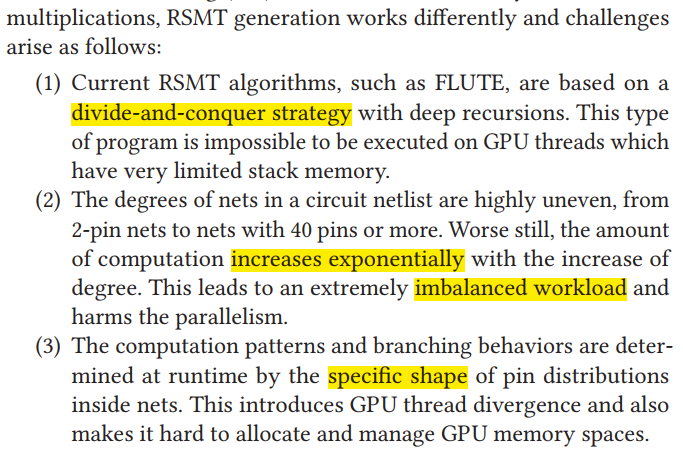

##### contribution

- propose a `levelized task decomposition strategy`
  - ensures a balanced workload and enables high-performance data parallelism  
- a algorithmic transforms  
  - eliminate the recursion patterns of FLUTE  
- GPU-efficient kernels   

##### flow

- break and merge stages work in an `iterative` way rather than the `recursive` mode in FLUTE  
- There is no extensive data copy between CPU and GPU during the inner algorithm loops which ensures minimal overhead of CPU-GPU communication  

#### [-Obstacle avoiding-ISCAS-2024--SYSU](https://ieeexplore-ieee-org-443.webvpn.scut.edu.cn/stamp/stamp.jsp?tp=&arnumber=10558430)

#### [A_Simple_Fast_and_GPU-friendly_Steiner-Tree_Heuristic](https://ieeexplore-ieee-org-443.webvpn.scut.edu.cn/stamp/stamp.jsp?tp=&arnumber=9835675)

#### [NN Steiner-Mixed Neural-AAAI-2024-California-]()

- [OpenSource!](https://github.com/ABKGroup/NN-Steiner)
- we develop NN-Steiner1, a mixed neural-algorithmic framework that leverages the ideas behind Arora’s PTAS for RSMT (Arora 1998). The costly `DP step` is replaced by a single NN component that outputs a learned embedding of the solutions to the DP subproblems.   
- solving ==large-scale== RSMT problems。这篇原理看很难看，也比较偏RSMT算法在多Point上的实现，在GR上的应用场景感觉倒是不大

##### background

- there has been a surge in use of NNs to help tackle `combinatorial optimization  problems`  

- `REST (Liu, Chen, and Young 2021)` achieved the first NN-based approach for RSMT by finding so-called rectilinear edge sequences using `RL`.  (Chen et al. 2022) designed an RL framework to find obstacleavoiding Steiner minimum trees.   Significant challenges in ==neural combinatorial optimization== (NCO) remain. NNs are often used in an `ad-hoc manner` with limited theoretical understanding of the resulting framework. It is also often not known if machine-learning pipelines have the capacity to solve a given combinatorial optimization problem, or how network-architecture design could leverage problem structure to design more effective and efficient neural models.  

  !!! note
      在神经网络和机器学习领域，**"ad-hoc manner"（临时性/特定场景性方式）** 通常指一种 **缺乏系统性理论指导、依赖经验或直觉的设计和调整方法**
      
      神经网络的设计和优化往往依赖实验结果而非数学证明（例如，无法严格证明某网络结构对组合优化问题的收敛性）。
      
      - 例如：Transformer 的注意力机制最初是启发式设计，后续才逐渐有理论分析其表达能力。
      
       **为什么神经网络常被批评为 "ad-hoc"？**
      
      **历史原因**：
      
      - **黑箱性质**：神经网络的函数逼近能力强大，但内部工作机制难以解释。
      - **工程实践优先**：深度学习的发展长期由实验结果推动（如ImageNet竞赛），理论滞后于应用。
      - **灵活性与代价**：神经网络的通用性使其能适应多种任务，但这也导致设计时缺乏严格约束。
      
      **典型案例**：
      
      - **ResNet 的跳跃连接**：最初是实验发现“深度增加导致训练误差上升”后提出的解决方案，后续才有理论分析其梯度传播性质。
      - **激活函数选择**：ReLU 的普及源于实验中发现其训练效率优于Sigmoid，而非先验理论推导。

- Arora’s PTAS  1998

  

##### contribution

- the first neural architecture of `bounded size` that has capacity to approximately solve the RSMT problem  
- leads to better practical performance than existing SOTA methods for ==large instances==  
- one of the first NCO(neural combinatorial optimization) frameworks to use algorithmic alignment to ==remove dependence on problem size==. 
  - Training on large instances is prohibitively expensive: for supervised learning this requires computation of exact solutions to large instances, and for RL and unsupervised learning, training becomes exponentially more challenging as size increases. Thus, size generalization is essential for performance on large instances  
- pin可以拓展到多维（不只是2,3维空间）, 还可以不用直线（欧几里得空间）

##### flow

##### model

##### data

##### experiment

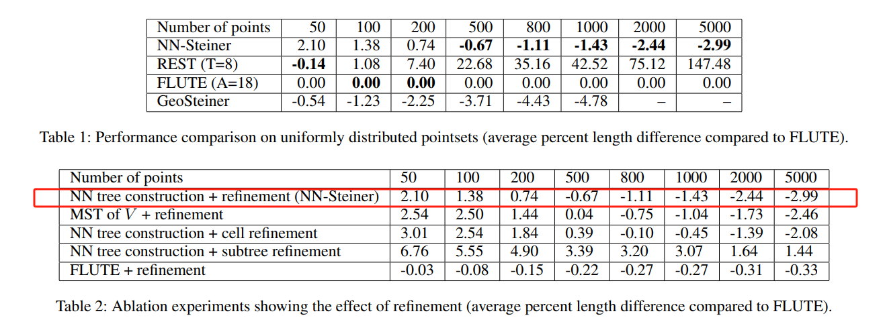

#### [-Delay Driven-Trans-2024- - ](https://ieeexplore-ieee-org-443.webvpn.scut.edu.cn/stamp/stamp.jsp?tp=&arnumber=10756606)

### DR outdated

#### [TritonRoute- - - -ILP-]()

#### [DRCU]()

- academic DR  

### DR adv

## Adv-Node

#### -Multi Row Standard Cell Layout Synthesis with Enhanced Scalability-ISEDA-2025--PEK

##### background

- Multi-row standard cells are widely adopted in advanced technology nodes, especially for complicated and large cells like multi-bit flip-flops(MBFFs).   

  

- In advanced technology nodes, standard cell libraries have expanded to include a larger variety and number of cells, which makes manual design more time-consuming.   

- the height of standard cells in advanced nodes has been steadily reduced  

  

- multi-row standard cells typically contain a higher number of transistors  

- 

- 相关工作比较少，之前解决这个问题使用的基于one-row的算法然后通过折叠等方式变成multi-row, 难以获得全局最优解

## Circuit Representation

#### [NetlistGNN-GNN Congestion-NIPS-2022-GNN-Ark]()

- [OpenSource!](https://github.com/PKUterran/NetlistGNN)
- can be a post-placement congestion predictor, also for some other task, not like LHNN。也做了Net WL预测的实验
- 这篇文章的 geometrical 信息也是用GNN实现的
- 貌似推理很快，可以看看
- 强调了这是一个general的Circuit Representaion的工作
- 他的公式写的很好看，可以借鉴一下

##### background

- the two most informative ones: the netlist and the design layout; handling each information source independently is sub-optimal  

- categorize  into `topological methods`[4, 5, 6]   and `geometrical methods.`   [7, 8, 9]  

  topological methods only consider the topological information in netlists and cannot effectively perceive geometrical structure introduced ==after the placement== stage, so their performance on circuits after placement is greatly stifled.   

  the geometrical models heavily rely on geometrical information and neglect the topology underlying the netlists, so they cannot handle circuits in stages earlier than global placement where geometry is not available.   

  

##### contribution

- `Circuit Graph`: a heterogeneous graph  with a linear time consumption to the scale of the design  
- `Circuit GNN`:  

##### flow

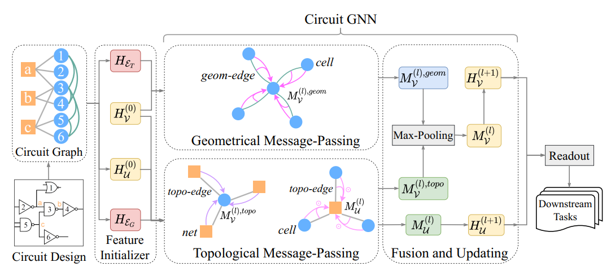

##### model

graph：

!!! note
    shift-window的线性复杂度实现！

##### data

Congestion Prediction  [ISPD2011  Contest](http://www.ispd.cc/contests/11/ispd2011_contest.html )

Net Wirelength Prediction  [DAC2012  contest](http://archive.sigda.org/dac2012/contest/dac2012_contest.html  )

##### experiment

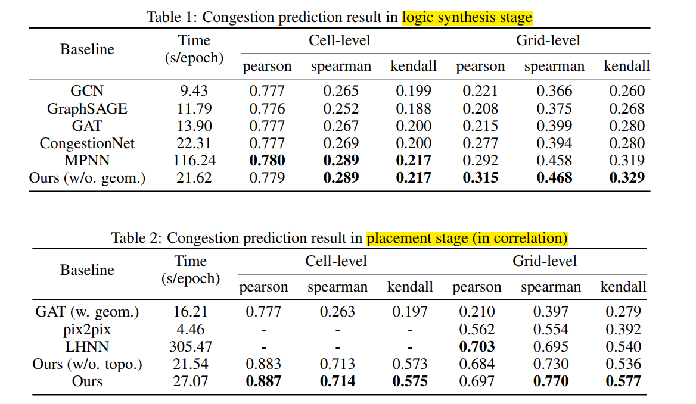

!!! warning
    
    但是没有说这些对比模型是怎么设计的

## Floorplan

#### [IncreDFlip-dataflow driven Macro filp-ISEDA-2025-SJTU-]()

- a methodology that leverages dataflow information to narrow the search space and utilizes dataflow decomposition from the synthesized netlist to guide flipping decisions.  

##### background

- 传统macro都是用手摆的, macro 越来越多
- Typically, mixed-size placers [2], [8], [9] or macro placers [10], [7], [11] consider flipping as one among several co-optimization strategies during placement which will lead to sub-optimal placement outcomes.   

##### contribution

- a ==dataflow-driven== flipping approach to reduce the ==search space== and ==time complexity==

##### flow

##### model

##### data

##### experiment

## toread

#### [Algorithms_and_data_structures_for_fast_and_good_VLSI_routing](https://ieeexplore-ieee-org-443.webvpn.scut.edu.cn/stamp/stamp.jsp?tp=&arnumber=6241546)

#### 一堆关于 RSMT 的论文

#### DR ISPD contest: TritonRoute, Dr. CU, DRAPS, RDTA

TritonRoute [15] adopted integer linear programming (ILP) for parallel intralayer routing. DRAPS [18] developed an A*-interval-based path search algorithm to handle complicated design rules. Dr. CU [16], [17], [21] proposed an optimal correct-by-construction path search algorithm and a two-level sparse data structure for runtime and memory efficiency. RDTA [19] developed an analytical approach to solve the track assignment problem following the global routing guides.   

#### DR Pin Acess: A multithreaded initial detailed routing algorithm considering global routing guides

#### [SALT- -TCAD-2020- -CUHK](https://ieeexplore-ieee-org-443.webvpn.scut.edu.cn/stamp/stamp.jsp?tp=&arnumber=8624460)

#### [Timing-Driven Routing-ICCAD-2023-USTC](https://ieeexplore-ieee-org-443.webvpn.scut.edu.cn/stamp/stamp.jsp?tp=&arnumber=10323981)

#### [TIMING-ICCAD-2024_Guo](..\..\..\Download\TIMING_ICCAD2024_Guo.pdf)

#### [GPU-Accelerated_Static_Timing_Analysis](https://ieeexplore-ieee-org-443.webvpn.scut.edu.cn/stamp/stamp.jsp?tp=&arnumber=9256516)

#### [An Optimization-aware Pre-Routing Timing Prediction Framework Based on Multi-modal Learning](https://ieeexplore-ieee-org-443.webvpn.scut.edu.cn/stamp/stamp.jsp?tp=&arnumber=10909720)

#### [-Chip Placement-arxiv-2020-GNN+RL-Google](https://arxiv.org/pdf/2004.10746)

#### [-DRL ROSMT-Trans-2023-DRL-FZU+PEK](https://ieeexplore-ieee-org-443.webvpn.scut.edu.cn/stamp/stamp.jsp?tp=&arnumber=10816669)

#### [-Adaptive Route Guides-ASP DAC-2024-XU](https://ieeexplore-ieee-org-443.webvpn.scut.edu.cn/stamp/stamp.jsp?tp=&arnumber=10473934)

#### [-Asynchronous RL+Knowledge Transfer-Trans-2023-RL-PEK](https://ieeexplore-ieee-org-443.webvpn.scut.edu.cn/stamp/stamp.jsp?tp=&arnumber=9557780)

##### background

- 串行布线下的 net order 对布线收敛结果影响很大，尤其在先进工艺节点下，设计规则愈加复杂且布线规模庞大，到时 net order 的影响更大

- 以往的工作往往使用简单的启发式方法对特定的 benchmark 进行优化

- 传统方法依赖于简单的 ==启发式规则==（如网络覆盖区域大小、引脚数量等）确定布线顺序，比如：the number of pins in a net; 2) the number of DRC violations caused by a net [23]; 3) the region size covered by a net [17]; and 4) the distance from a certain point [24] 。但由于不同设计差异大，这类固定策略难以通用化，导致布线质量（如 DRC 违规、绕线长度等）不稳定。现有方法在应对大规模、多样化设计时缺乏灵活性，因此亟需一种自动化、可泛化的网络顺序优化方案。

- DRC

  

- In this work, we adopt Dr.CU as the target detailed routing framework for studying, while the methodology can work on other routers as well.   

- 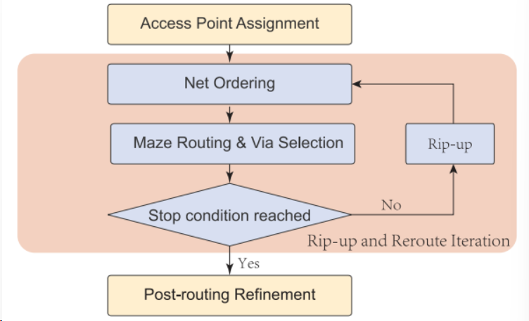

- 

  Although the wirelength does not change much, the order affects both via count and the number of `DRC violations`.  

- `Dr.CU` sorts nets by the routing region sizes (half-perimeter of the bounding box) of each net in descent order. In other words, ==nets covering large routing regions are routed first.==  However, we observe that the routing region sizes of different nets can be very similar, leading to random orders between these nets, and eventually causing high variations in the final violations.   For example, Fig. 3 shows that 5293 nets have the same routing region size, accounting for 14.4 % of the total number of nets in benchmark ispd18_test3.   Therefore, there is a potential to improve the routing performance by developing an ordering strategy considering more features  

  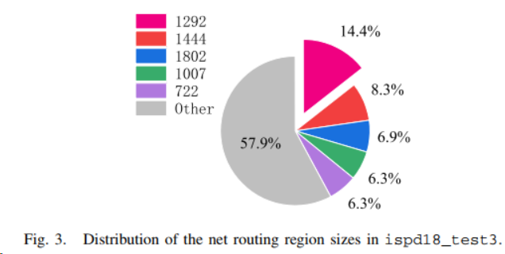

- RL: One of the main obstacles in using supervised ML-based techniques for solving routing problems, especially the net ordering problems, is the lack of golden labeled datasets to learn.   

- metrics：

  - the total wirelength of all nets;  
  - the number of the total used vias  
  - the number of DRC violations.  

##### contribution

1. **异步强化学习框架**：
   - 提出基于 **A3C（异步优势演员-评论家）** 的异步 RL 框架，支持多智能体并行训练，加速策略搜索。 
   - **状态特征**：定义 7 维网络级特征（如布线区域尺寸、相邻网络重叠度、历史重布次数等），输入策略网络生成排序评分。
   - **奖励机制**：结合总成本（线长、通孔数、DRC 违规）与基线策略，引入 **不匹配惩罚项**，引导智能体学习优于默认启发式策略的排序策略。
2. **基于策略蒸馏的迁移学习算法**：
   - 通过 **小区域剪裁**（从目标设计截取约 500 个网络的密集子区域）进行微调，避免全设计训练的高开销。 
   - 利用教师网络（已预训练的通用策略）指导学生网络（针对目标设计的定制策略），最小化两者策略分布的 KL 散度，实现高效知识迁移。 
3. **模型无关的灵活架构**：
   - 网络结构 **解耦设计规模**，通过独立编码每个网络的局部特征再拼接，支持不同设计间策略共享，避免输入尺寸约束。

##### model

###### enviroment

`Dr. Cu`

每一个 step 就要跑一次 `Dr.Cu`，训练不是很慢？

而且什么时候 episode 结束？

###### state

is the collective representation of features for ==all nets==.

 

`Cost` 具体是指什么？

state 很大啊

###### action

An action a is a real number vector. Each number is defined as an ordering score of a net.  

`之前做的都是很少个的action`

###### reward

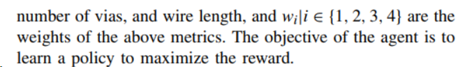

可以使用 `Dr.Cu` 的 net order 进行初始的排序，而不是从随机开始，提高模型收敛速度。尤其是这个难收敛的任务，很重要

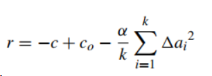

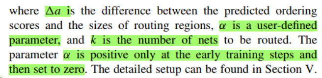

it will speed up the training, but not limit the exploration space to the heuristic ordering strategy used in `Dr.CU`.   

###### A3C

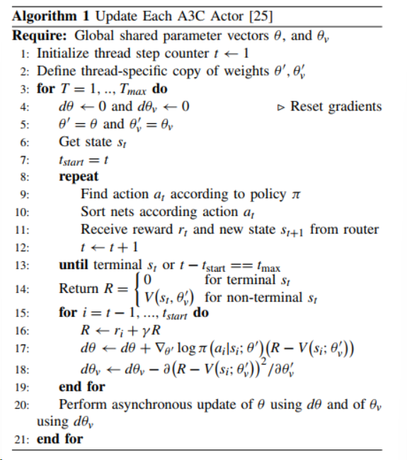

Intuitively, the policy network tells us the ordering scores of the nets and the value network evaluates the scores in the sense of future rewards  

输出的不是一个具体的 action，而是一个分布。 We pick the action by sampling from this normal distribution p.   

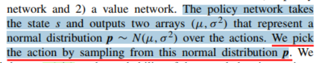

这样有什么效果？：（没理解）

###### TRANSFER LEARNING ALGORITHM  

- Our task is to mine the knowledge from the pretrained policy and adapt to a target design to improve the performance  
- If we can customize the policy for each design with low overhead, there is an opportunity to improve the performance further.  
- To reduce the overhead of customization, we fine-tune the well-trained policy from the previous section using a ==small region clipped==  

#### [DieRouter+- FPGA Die Routing-DP-ShanDong-]()

##### background

- 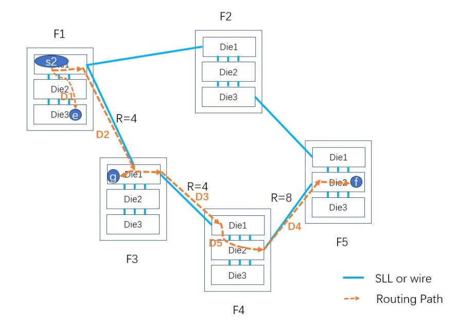
- 大型数字设计往往需要使用多块`FPGA（MFS）`进行原型验证
- `2.5D FPGA` integrates ==multiple dies== and offers significantly higher capacity than a traditional ==single-die== FPGA  
- Super Long Lines (SLLs)  
- Time-Division Multiplexing (TDM)  多路分时复用，是一种串并-并串转换IP. 缓解FPGA的外部Pin不够问题。这个IP可以调节等效Pin个数，Ratio越大，延时越大。

##### contribution

- a simpler yet more effective initial routing method based on `shortest path trees`
- a `Second-Order Cone Programming formulation` of an extended relaxed TDM assignment problem to compute ==optimal continuous TDM ratios==
- a `scheduler-driven Dynamic Programming (DP)`- based legalization technique that adaptively schedules state evaluations

##### flow

##### data

2023 EDA Elite Design Challenge  

## 综述

### ML4PR

[Towards Machine Learning for Placement and Routing in Chip Design: a Methodological Overview](https://blog.csdn.net/SP_FA/article/details/134063224)

放置和布线是两个不可或缺且具有挑战性的 NP-hard 问题

机器学习凭借其数据驱动的性质显示出了广阔的前景，它可以减少对知识和先验的依赖，并且通过其先进的计算范式具有更大的可扩展性 (例如 GPU 加速的深度网络)

**挑战:**

placement:

- 在路由完成之前，无法评估诸如可达性之类的放置目标；因此，在优化循环中可能需要花费数小时才能获得反馈，这对于进行数千次查询来说是负担不起的
- 现代的放置器需要在几个小时内处理数万个宏和数百万个标准单元。这种可扩展性的要求仍然超出了现有 ML 方法的能力

routing:

- 在公平的比较下，现有技术很难在效率和求解质量上系统地优于经典布线算法
- 大多数基于学习的技术在具有数千个网络的小型电路上工作得很好，而实际的布线引擎需要在超大型 3D 网格图 ( > 1000 × 1000 × 10 ) (> 1000 × 1000 × 10)(> 1000×1000×10) 上有效地处理数百万个网络并产生高质量的解决方案

相关工作

- placement

  - 
  - 
  - 

- Routing

  - 

    

    

  - 

  - 

### 超大规模集成电路布线算法综述  

[超大规模集成电路布线算法综述](https://www.sciengine.com/MNEIM/doi/10.19816/j.cnki.10-1594/TN.2021.02.086)

##### background

布线相关详细看 routing2.md, 详细布线、面向可制造性设计的布线算法 还没记录

### EDA+GNN

详细看 [A Comprehensive Survey on Electronic Design Automation and Graph Neural Networks](.\notebak\EDA+GNN.md)

## 参考

1. [AI 技术带给 EDA 的机遇和挑战](AI技术带给EDA的机遇和挑战-Yibo Lin.pdf)
1. [Towards Machine Learning for Placement and Routing in Chip Design: a Methodological Overview]([[读论文\] Towards Machine Learning for Placement and Routing in Chip Design: a Methodological Overview_toward machine learning....lake-CSDN博客](https://blog.csdn.net/SP_FA/article/details/134063224))
1. [【阅读】A Comprehensive Survey on Electronic Design Automation and Graph Neural Networks——EDA+GNN 综述翻译_ppaml-CSDN 博客](https://blog.csdn.net/sxf1061700625/article/details/127865492)

## bak

[CongestionNet-Congestion Prediction-IFIP-2019-GNN]()

[-placement Congestion prediction-arXiv-2021-GNN]()

输入：网表

输出：congestion at placement stage

[EDA-ML: Graph Representation LearningFramework for Digital IC Design Automation](https://ieeexplore.ieee.org/stamp/stamp.jsp?tp=&arnumber=10528675)

德雷塞尔大学电气与计算机工程系 Pratik Shrestha 和 Ioannis Savidis

##### background

VLSI : traditional methodologies -> ML, Graph representation learning  ability to capture complex relationships in graph-structured data  

GNN：

##### task

##### flow

##### data

**模型**

**实验**

