# EDA4PR-LCM

## Agent

### Codex

- rust
- [OpenSource](https://github.com/openai/codex)

### Claude code

- [OpenSource](https://github.com/anthropics/claude-code)
- python

### Gemini CLI

- typscript

### OpenCode

- [OpenSource](https://github.com/anomalyco/opencode?tab=readme-ov-file)
- typescript
- OpenCode can be used with Claude, OpenAI, Google or even ==local models==. 
-  also available as a desktop application
- two built-in agents
- Out of the box ==LSP support==
- A focus on ==TUI==

### Aider

- [OpenSource](https://github.com/Aider-AI/aider)
- Aider works best with Claude 3.7 Sonnet, DeepSeek R1 & Chat V3, OpenAI o1, o3-mini & GPT-4o, but can connect to almost any LLM, including ==local models==.
- Use aider from within your favorite IDE or editor. 

### DeepCode

- HKU

- python

- paper code gen

### Kiro

- [closed]()

### GitHub Copilot

## RAG

### PageIndex

https://github.com/VectifyAI/PageIndex?tab=readme-ov-file

## Circuit-Gen

### [AnalogCoder- -AAAI-2025--CUHK]()

- [OpenSource!](https://github.com/laiyao1/AnalogCoder)
- the ==first== training-free LLM agent for designing analog circuits through Python code generation  
- users can describe their desired analog circuit functionalities in ==natural language==. AnalogCoder automatically generates the corresponding ==Python== code for the designed circuit, leveraging the LLM’s strong Python programming capabilities.   

#### background

- Existing ==LLM-related research== primarily focuses on two tasks

  - the generation and correction of Verilog codes  

  - writing of design scripts 

    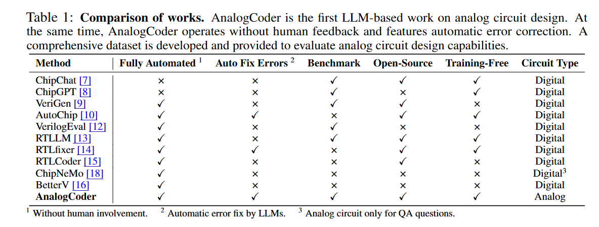

- Analog circuit design presents significantly more challenges than digital circuit design  

  - Complexity.  
    - Unlike digital circuit design, which predominantly employs simple logic gates, analog circuits comprise diverse components such as voltage and current sources, MOSFETs, resistors, and capacitors. The complexity is further compounded by the intricate interconnections and settings required (Poddar et al. 2024)  
  - Abstraction level.
    - For example, while a digital adder can be succinctly implemented in a single line of Verilog code, constructing an analog adder requires meticulous configuration and connection of approximately five MOSFETs and three resistors (Chaoui 1995).   
  - Corpus data volume  
    - Although Verilog, used for digital circuit design, constitutes a small fraction (less than 0.1%) of the repositories on GitHub, SPICE (Simulation Program with Integrated Circuit Emphasis) (Vladimirescu 1994), the predominant language for analog design, is even less common.  

#### contribution

- the first LLM-based agent for analog integrated circuit design
  - establishes a new paradigm by generating Python code to design analog circuits.   
- develop a feedbackenhanced design flow and a circuit tool library, significantly improving the LLM’s ability to design functional analog circuits  
- the first benchmark specifically designed to evaluate the ability of LLMs in designing analog circuits.   
  - benchmark comprises 24 unique circuits, three times the number included in the ChipChat benchmark (Chang et al. 2023) and offers 40% more circuits than the VeriGen benchmark (Thakur et al. 2023a).   

#### flow

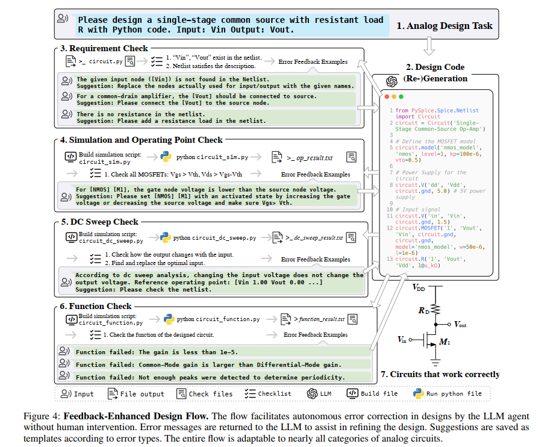

SPICE code: 软件识别

PySpice: python转SPICE?

#### Model

##### Prompt Engineering

Our approach to prompt engineering encompasses three main aspects: 

- (1) programming language selection
- (2) in-context learning (Dong et al. 2022a)
- (3) Chain-ofThought (Wei et al. 2022)

circuit tool library: 

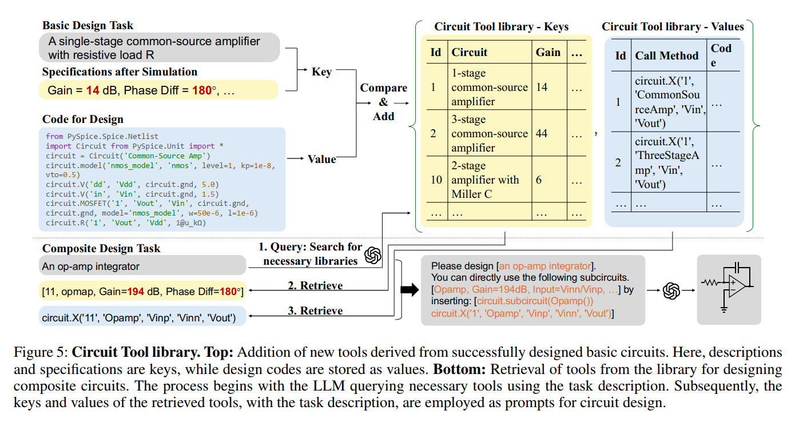

#### data

#### experiment

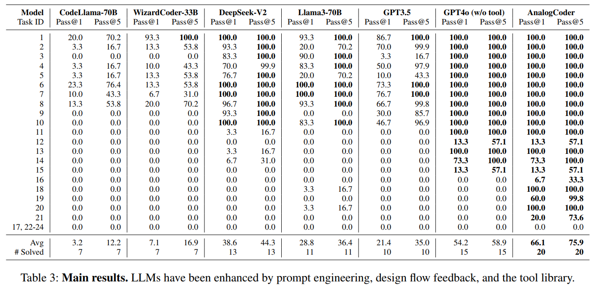

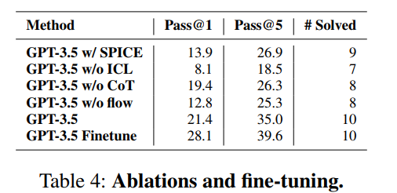

### [ANALOGGENIE--ICLR-2025--NEU]()

- [OpenSource!](https://github.com/xz-group/AnalogGenie?tab=readme-ov-file)

#### background

## Layout

### [LayoutCopilot-Multi Agent-TCAD-2025--PEK]()  

- LayoutCopilot框架中的每个智能体都配备了针对其指定任务量身定制的Prompt。能够接收设计人员用自然语言表达的高层设计意图和具体需求，并将其转化为==精确可执行的指令==。这些指令旨在直接操控版图设计工具，确保设计意图被准确转化为版图调整。
- integrates various ==Prompt Engineering== techniques  
  - Chain-of-thought  
  - Least-to-most prompting  
  - Self-refine strategy  

#### background

- Prompt Engineering :提示工程为利用大模型解决现实问题提供了轻量级解决方案。不同于需要创建海量数据集、进行微调和重复调整参数的传统方法，提示工程允许实践者通过精心设计的提示词来引导模型行为。这种方法在数据采集与清洗成本高昂的场景中尤为适用。

- 提示词工程：

  - Chain-of-thought  
  - Least-to-most prompting  
  - Self-refine strategy  

- retrieval-augmented generation (RAG)   

- multi agent:

  

  采用多智能体分工而非单智能体方案的核心原因在于==缓解提示词稀释效应==，避免大语言模型的注意力分散。

  

#### contribution

- ==the first== LLM-powered interactive analog layout design framework
- a multiagent collaborative framework  

#### flow

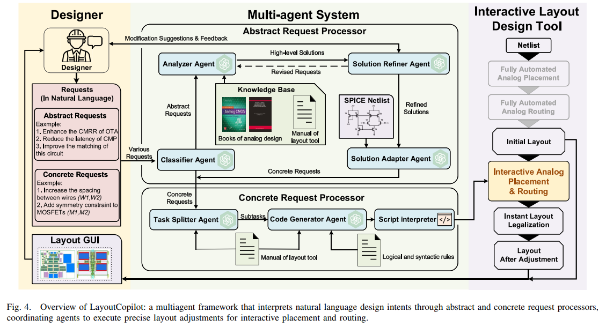

该系统包含两个核心组件：抽象请求处理器和具体请求处理器。抽象请求处理器启动请求处理流程，将其转换为符合布局工具手册规范的具体请求。这些具体请求随后传递至具体请求处理器，该组件生成可执行命令以促进版图编辑。

 分类器代理：作为过滤器的作用是根据版图工具手册判断设计需求属于具体请求还是抽象请求。

分析器代理：分析与知识检索任务. 这个智能体专注于知识检索，The Analyzer Agent operates within a vast knowledge base that 涵盖模拟电路与版图设计的专业文献、布局工具手册以及历史任务与解决方案档案。在向大语言模型传输知识库时，可通过两种方式输入：直接作为提示词组成部分，或经由大语言模型供应商提供的检索接口。

解决方案精炼代理（Solution Refiner Agent）最复杂的代理. 根据设计者的修改建议进行细化调整。若设计者对结果不满意，系统将重新调用分析器代理。包含设计者修改建议的修订请求会从解决方案精炼代理发回，作为分析器代理生成优化后高层解决方案的新输入。该机制确保系统能够融合设计者反馈，通过迭代改进设计方案以获得更精确且更具针对性的结果。这使得设计师能够理解每个解决方案背后的逻辑依据，评估其可行性并做出明智决策。

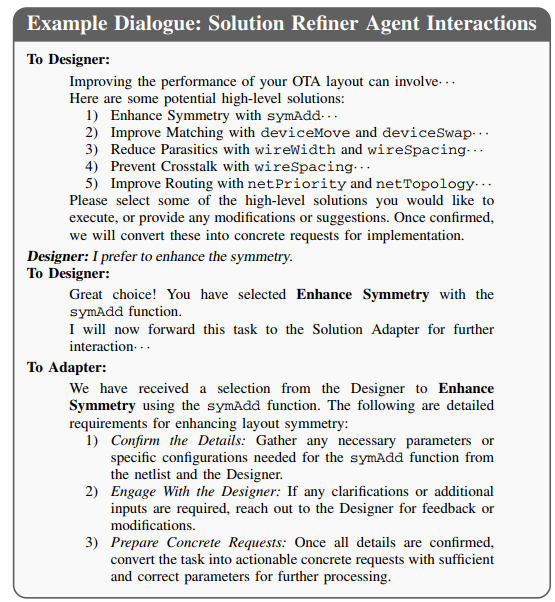

Solution Adapter Agent  

##### model

##### 支持的指令

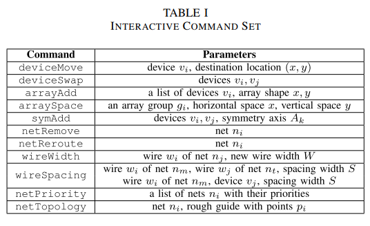

> 只支持这些？感觉也不多

#### experiment

实验中采用成熟的交互式模拟电路布局设计工具[Interactive Analog Layout Editing with Instant Placement
Legalization]()进行演示

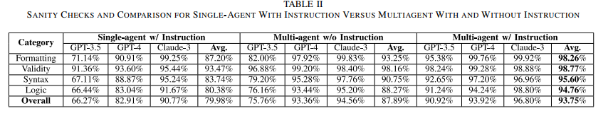

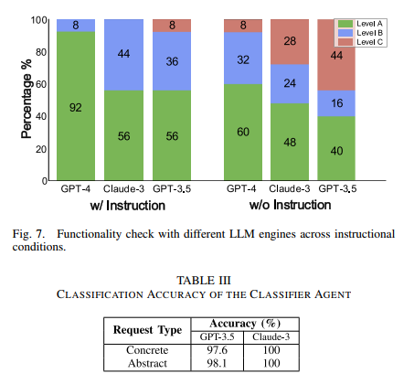

##### 实验二

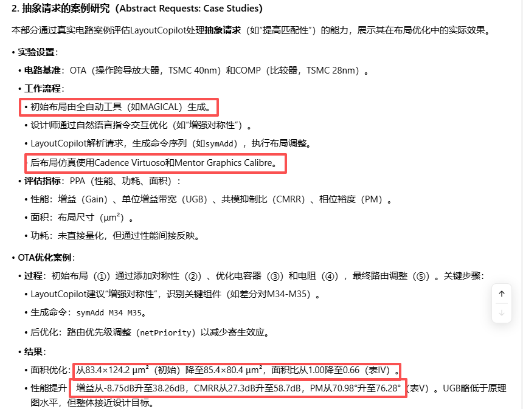

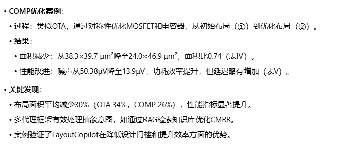

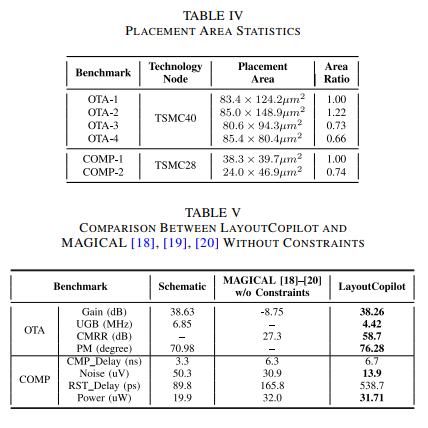

> 怎么把Magical的版图搬到Virtuoso做后仿的？

## Dataset

### [DeepCircuitX-RTL code understanding, Generation, PPA analysis-arXiv-2025- -CUHK-]()

- [Open Source](https://zeju.gitbook.io/lcm-team)
- a multimodal and comprehensive repository-level circuit dataset for deep learning in EDA  
- more than 4,000 circuit design   

#### background-

- existing datasets that are limited to either filelevel RTL code or physical layout data  
- 已经有相关工作：employs large language models (LLMs) to understand and describe RTL designs in natural language to assist engineers.  
- the effectiveness of deep learning models is heavily contingent upon the quality of the training data [4]. However, we observe that existing RTL datasets suffer from notable limitations, hindering the application of AI-based solutions in practical RTL modeling and verification  
- semiconductor ecosystem is far inferior to software openness, the accessible designs are limited.  [Circuitnet, RTL-Repo, Eda corpus, Benchmarking large language models for automated verilog rtl code generation]

#### contribution

- DeepCircuitX provides a holistic, multilevel resource that spans repository, file, module, and block-level RTL code.   
- Enables more nuanced training and evaluation of large language models (LLMs) for RTL-specific tasks  
- propose a Chain of Thought (CoT) [9] detailed annotation method to generate descriptions and comments for each of the four levels, namely, repo-level, file-level, module-level and block-level.  

 