# 研究背景


## EDA 软件研发难点


### 参考

[EDA软件研发有哪些难点？ - 知乎](https://www.zhihu.com/question/528984827)

## EDA 重要性


### 参考

*超大规模集成电路物理设计：从图分割到时序收敛*

## EDA 发展历史


## EDA国产替代

由于1994年至2008年，中国大陆在EDA领域有差不多十五年的低迷期。很多高校失去了EDA的研究条件和生存环境，使得很多项目搞不下去，老师开始转型，导致高校从事EDA研究的人员越来越少。


## AI 4 Science


## AI4EDA

**典型的芯片设计流程是先做前端、后端设计，再去验证性能、功耗和面积。**但由于流程太长，在前端设计的时候，无法保证后端设计的效果，所以很多时候需要进行跨环节建模，在早期设计环节预测后续环节的求解质量，这当中就很适合AI算法来进行辅助。

除了建模之外，另外一个关键问题是优化。EDA中经常要求解各种各样的组合优化问题。这些问题往往是 NP难题，比如经典的旅行商问题。传统上，我们会通过一些启发探索的方法来求解。但随着规模不断增大、设计约束越来越多，这种探索往往遇到效率瓶颈，所以我们需要通过机器学习技术进行辅助，寻找有效策略，提高效率。


### 传统 EDA 缺点

**(1) 它依赖于硬件设计人员的专业知识来选择合适的 EDA 工具配置**，**(2) RTL 的设计空间探索，逻辑综合和物理综合是手动的，因此是有限且耗时的**，**(3) 设计中的更正将重新初始化流程**，**(4) 没有早期分析或结果的可预测性。**


### GNN4EDA

近年来，随着深度学习技术的广泛应用，越来越多的研究将其引入EDA领域。特别是图神经网络（Graph Neural Networks, GNN），凭借其在处理复杂图结构数据方面的显著优势，逐渐成为EDA后端设计中物理验证的重要工具。–cite–>[专题解读 | GNN在EDA后端设计物理验证环节中验证应力的应用](https://mp.weixin.qq.com/s/DTyRuFTws49WtwWEJaL8fQ)

由于考虑了特征和拓扑信息，GNN 已被证明优于其他 ML 模型

[41] 中的研究 **首次认识到 GNN 在 EDA 中的巨大潜力**。他们表示，**图形结构是表示布尔函数、网表和布局的最直观方式**，这些是 EDA 流程的主要关注点。他们 **将 GNN 视为 EDA 改进 QoR 并取代使用的传统浅层方法或数学优化技术的机会**。

**基于 GNN 的架构优于其他模型和解决方案**。上面列出的工作将他们的结果与浅层 ML、深度学习方法或特定任务的基线进行了比较。毫无疑问，**GNN 的优越性是由于对拓扑和特征信息的考虑，这是以构建训练数据集的更大努力和更高的训练时间为代价的**

GNN 的优势与两个因素有关：**定义明确的初始特征和图学习能力** [39]。**定义明确的特征捕捉任务的基本特征，并为图学习提供宝贵的信息。 GNN 捕获特征和拓扑信息。** 这与仅考虑图形连通性的方法相比，它具有明显的优势。


G =(V, E) 分别不同的任务

是否有向

是否有环

是否异构

是否动态

其他特殊图：二分图，正交图，超图


### GPU

Heterogeneous computing systems consisting of CPUs and GPUs, as shown in Figure 5, have brought huge performance benefits to all kinds of scientific computing applications, thanks to the architectural difference between CPUs and GPUs that caters their advantages in different types of workloads. CPUs have a few large and powerful cores, with high performance single-thread computation as well as branching prediction capability. This makes CPUs suitable for general purpose computation tasks with complex control structures. Multi-threading on CPUs is also promising provided with a limited number of concurrent tasks. Given massively parallel tasks consisting of possibly thousands to even millions of threads, CPUs incur high multitasking and thread switching overhead, as well as low data bandwidth and cache storage. On the contrary, GPU architecture is designed from the ground to fit the need of massive parallelism. A GPU has hundreds to thousands of small cores running in parallel. These cores can switch between threads with almost no runtime cost,  thus effectively hiding memory latency when one group of threads is waiting for a memory request to complete.  


# 难点


1. 大图-->
2. 数据集-->
3. 泛化能力-->
4. 非DAG?
5. route: 3D，45°，30°
6. 先进的工艺：7nm
7. 很多Placer and Router还是有很多人工定义的超参数？（不general）
8. 现在真的还有必要把Router分成Global 和Detail 吗？
9. GR: total maze routing
10. Consider **timing** and **power** consumption
12. 2.5D/3D package
    - [VLSI Placement and Routing — From 2D to 3D](# VLSI Placement and Routing — From 2D to 3D)


### future work

- [2.5d/3d](# Future direction)
- 晶圆级
- 多物理场


# 研究方向

## Digtal

[数字后端EDA入门](https://mp.weixin.qq.com/s/vbegGznsJe0xq4FIawrrVQ)

详细查看[EDA4PR-Digtal](./EDA4PR-Digtal.md)

## Analog

详细查看[EDA4PR-Analog](D:\MyNotes\Analog\WorkFlow\EDA4PR-Analog.md)

# 相关数据集

## rtl only 

### [Home :: OpenCores](https://opencores.org/)


### [IWLS 2005 Benchmarks](https://iwls.org/iwls2005/benchmarks.html)


### [openlane-examples: Examples from the Openlane repository](https://github.com/klasnordmark/openlane-examples)


## Global route

### ISPD-2007


- the first published multilayer global routing benchmarks and the sizes of these benchmarks are large enough as compared to real industry cases  
- has a two-layer and a six-layer version.  
- 


### ISPD-2008 


### ICCAD-2019

[2019 CAD Contest @ ICCAD](https://www.iccad-contest.org/2019/problems.html)


### ISPD-2024

Dockerfile无法创建镜像了，401，Github也找不到benchmarks


### ISPD-2025


## Detail Route

### ISPD-2018/2019

[Initial Detailed Routing Contest at ISPD 2018](https://www.ispd.cc/contests/18/)

[Initial Detailed Routing Contest at ISPD 2019](https://ispd.cc/contests/19/#finalfiles)

[一个别人写的parse脚本：Handling-the-ISPD19-benchmark-dataset](https://github.com/nithyashreesenguttuvan/Handling-the-ISPD19-benchmark-dataset)

https://ispd.cc/contests/19/ispd19eval.tgz：一个结果验证工具


还可以看看被人的结果


## CircuitNet

4部分数据：congestion，DRV, IR drop, Net delay

[circuitnet/CircuitNet: CircuitNet: An Open-Source Dataset for Machine Learning Applications in Electronic Design Automation (EDA)](https://github.com/circuitnet/CircuitNet)

背景：

- [f.daixianiu.cn/csdn/14209355328255857.html](https://f.daixianiu.cn/csdn/14209355328255857.html)在研究过程中，我们发现AI+EDA的研究常常受限于公开数据集，不像计算机视觉领域有ImageNet这样的大数据集可以很方便地验证算法。针对这一问题，我们近期跟黄如院士、王润声教授等合作，发布了首个致力于芯片设计AI for EDA应用的开源数据集——CircuitNet，包含1万以上的数据样本，涵盖从实际制造工艺PDK下数字设计流程不同阶段中提取到的各类特征。


[TimingPredict/TimingPredict: Official open source repository for "A Timing Engine Inspired Graph Neural Network Model for Pre-Routing Slack Prediction" (DAC 2022)](https://github.com/TimingPredict/TimingPredict)


## EDA-schema

GLSVLSI'24上发布的一个数字后端全流程数据集，规模比较小，但是很全

[drexel-ice/EDA-schema](https://github.com/drexel-ice/EDA-schema)


## OCB: Open Circuit Benchmark

[zehao-dong/CktGNN: Open Circuit Benchmark OCB and source code for CktGNN (https://openreview.net/forum?id=NE2911Kq1sp).](https://github.com/zehao-dong/CktGNN?tab=readme-ov-file#ocb-open-circuit-benchmark)

- OCB is the first open benchmark dataset for analog circuits (i.e. operational amplifiers (Op-Amps))
- contains ==10K distinct operational amplifiers (circuits)== whose topologies are modeled as graphs and performance metrics are carefully extracted from circuit simulators.  
-  equipped with circuit generation code, evaluation code, and transformation code that converts simulation results to different graph datasets (i.e. igraph, ptgraph, tensor.) 
- Currently, OCB collects two datasets, Ckt-Bench-101 and Ckt-Bench-301 for the general-prpose graph learning tasks on circuits.


## CV

- ImageNet
- multi-modal   
- ADE20K  
  - Semantic Segmentation 
  - [详细解读：MIT经典的语义分割数据集ADE20K，附下载链接-CSDN博客](https://blog.csdn.net/OpenDataLab/article/details/125293382)
  - 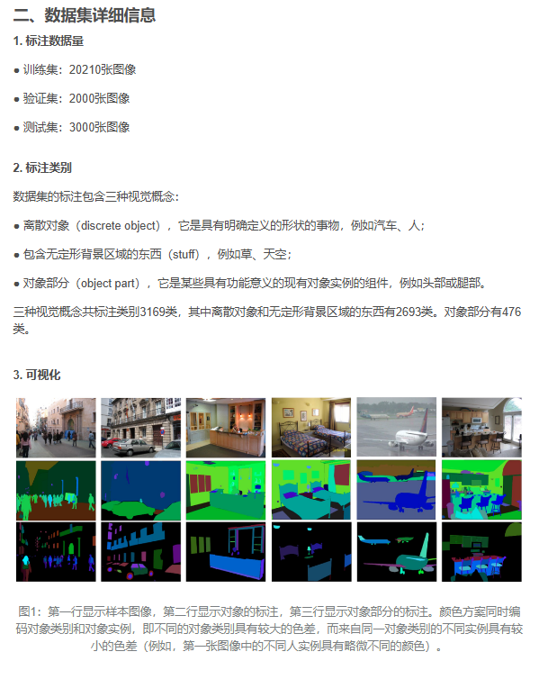

# 相关会议/期刊

> 一个查找会议期刊相关新文章的好方法：
>
> 在[dblp](https://dblp.org/db/conf/dac/index.html)搜到相关会议/期刊以后，
>
> 

## EDA应用

### 会议

#### [DAC](http://www.dac.com/):

- 每年举办一次学术论坛和工业贸易展览
- 一般11月截止


#### [ICCAD](http://www.iccad.com/)：

- International Conference on Computer-Aided Design
- 由电气电子工程师学会（IEEE）和美国计算机学会（ACM）共同举办的国际计算机辅助设计会议（ICCAD）被公认为EDA领域最重要的会议之一，享有很高的国际学术地位和广泛的影响力。该会议是探索EDA研究领域新挑战、展示前沿创新解决方案和识别新兴技术的重要论坛，涵盖了从器件和电路级到系统级的所有设计与自动化主题、以及后CMOS设计等新型方向。着重于学术研究，论文涉及专门的算法的研究进展。
- 一般4月截止


#### [DATE](https://www.date-conference.com/)

- Design, Automation and Test in Europe Conference
- 欧洲设计自动化和测试会议
- 一般9月截止


#### [ASP-DAC](https://www.aspdac.com/aspdac/)

- 亚洲、南太平洋设计自动化会议
- 一般7月截止
- CCF-C, 但是是计算机体系结构领域顶会
- EDA相关内容相对较少


#### [ISPD](https://ispd.cc)

- International Symposium on Physical Design

- 国际**物理设计**会议。是专注集成电路**物理设计**的国际研讨会，主题涵盖从ASIC和FPGA的传统物理设计到新兴半导体技术的物理设计**自动化方法**。

- CCF-C. 

- 9月份左右

- 每年ISPD会议同步举办国际物理设计竞赛，通常由国际知名芯片企业命题和组织，竞赛历时3个多月，结果在ISPD会议上揭晓。


#### [GLSVLSI](https://www.glsvlsi.org/)

- CCF-C
- 大湖区超大规模集成电路设计国际会议
- 一般2月截止
- 25年为第35届
- EDA方向内容较多


#### [MLCAD](https://mlcad.org/symposium/2025/)

- 5月
- 不在CCF？

#### [ICCD](https://www.iccd-conf.com/home.html)

- CCF-B
- ICCD涵盖了计算机系统及其组件的研究、设计和实现中的广泛主题。ICCD的多学科重点为开发人员和研究人员提供了一个理想的环境，可以讨论涵盖系统和应用、计算机体系结构、验证和测试、设计工具和方法、电路设计和技术的实践和理论工作。
- 5月


#### [CICC](https://www.ieee-cicc.org/)

- Custom Integrated Circuits Conference
- Area:[2026 Call for Papers - 2026 IEEE CICC](https://www.ieee-cicc.org/2026-call-for-papers/)
- 不在CCF


#### [VLSI](https://www.vlsisymposium.org/)

- 有个DTCO?
- 一般1月


#### [ISEDA](https://www.eda2.com/iseda/index.html)

- 由IEEE和ACM主办，EDA²和CIE EDA委员会联合主办的ISEDA （EDA国际研讨会）是一个致力于VLSI设计自动化的年度顶级论坛。研讨会旨在探索新的挑战，展示前沿技术，并为EDA社区提供预测EDA研究领域未来发展方向的机会。ISEDA涵盖了从器件和电路级到系统级的所有EDA主题，从模拟到数字设计以及制造。会议的形式旨在培养富有成效和新颖
- 二月
- 25年第三届
- 
- 
- 不在CCF, 论文质量目前一般
- 国内EDA圈在推
- 是学院的主流会议，分还挺高0.0


#### [SMACD](https://smacd-conference.org/)

- 7月
- 不在ccf


#### [APCCAS](https://ieee-cas.org/event/conference/2024-ieee-asia-pacific-conference-circuits-and-systems#documents)

- E Asia Pacific Conference on Circuits and Systems
- 
- ddl: 6-7月
- 不在CCF, 论文质量好像一般


#### [ICORES](https://icores.scitevents.org/)

- International Conference on Operations Research and Enterprise Systems
- 11月
- 运筹学
- routing
- 不在CCF

#### [ISCAS](https://ieeesystemscouncil.org/event/symposium/2025-ieee-international-symposium-circuits-and-systems#:~:text=The IEEE International Symposium on Circuits and Systems,theory%2C design and implementation of circuits and systems.)

- International Symposium on Circuits and Systems
- 计算机体系结构/并行与分布计算/存储系统
- ddl: 10月
- CCF-C


#### [ECCTD](https://www.bing.com/ck/a?!&&p=b4c882ef8ec83ce8cd7b7e1ff04bf54cc8b043f810f16fd6bc9ebcb5e08789c9JmltdHM9MTc2MDA1NDQwMA&ptn=3&ver=2&hsh=4&fclid=22516850-a084-67d2-0b26-7e1ca1b5666f&psq=+European+Conference+on+Circuit+Theory+and+Design&u=a1aHR0cHM6Ly9pZWVleHBsb3JlLmllZWUub3JnL3hwbC9jb25ob21lLzEwMDE3MDYvYWxsLXByb2NlZWRpbmdz&ntb=1)

- 现在貌似没了？


#### [CFTC]()

- ddl: 5月15

[CCF CFTC 2025征文开始！CCF容错专委40周年！第二十一届CCF全国容错计算学术会议正式启航！](https://mp.weixin.qq.com/s/ruOdGFPUJDGZxFiTvBeYiA)

- 


#### [CCF Chip]()

- 7月份
- 貌似只是个论坛


#### [CCFDAC]()

- 7月份
- 
- 


#### [ICML]()


#### [NeurIPS]()


#### [CVPR]()


#### [SLIP](http://www.sliponline.org/)

- System Level Interconnect Prediction
- 2022年后没了？


### 期刊

#### 1. TCAD

- **全称**: *IEEE Transactions on Computer-Aided Design of Integrated Circuits and Systems*
- **领域**: 计算机辅助设计（CAD）、集成电路与系统设计
- **简介**: TCAD 是 IEEE（电气与电子工程师协会）旗下的一本顶级期刊，专注于集成电路和系统的计算机辅助设计技术。它涵盖了从算法、工具到实际应用的研究，是电子设计自动化（EDA）领域的重要期刊。
- **影响因子**: 
- **出版频率**: 月刊
- 中科院 2 区?有些地方又说是3/4区
- h-index: 48
- IF: 1.9

-----

#### 2. TODAES

- **全称**: *ACM Transactions on Design Automation of Electronic Systems*
- **领域**: 电子系统设计自动化（Design Automation for Electronic Systems）
- **简介**: TODAES 是 ACM（计算机协会）旗下的一本学术期刊，专注于电子系统的设计自动化技术。它涵盖了从硬件设计、软件工具到系统级优化的研究，是电子设计自动化（EDA）和嵌入式系统领域的重要期刊。
- 研究主题:
  - 硬件/软件协同设计
  - 系统级设计方法
  - 设计验证与测试
  - 低功耗设计
  - 嵌入式系统优化
- **影响因子**: 较高，是 EDA 和电子系统设计领域的权威期刊之一。
- **出版频率**: 季刊（每年四期）
- It publishes innovative work documenting significant research and development advances on the specification, design, analysis, simulation, testing, and evaluation of electronic systems, emphasizing a computer science/engineering orientation. Design automation for machine learning/AI and machine learning/AI for design automation are very much welcomed. For topics of interest please see https://dl.acm.org/journal/todaes/about.
- IF: 1.9
- H-index: 48
- 4区？

----

#### **3. Journal of the Royal Society Interface**

IF: 3.8

h-index: 114


#### **4. Journal of Computational Design and Engineering**

IF: 5.2


#### 5. IEEE Transactions on Very Large Scale Integration


#### 6. [IEEE TRANSACTIONS ON CIRCUITS AND SYSTEMS II-EXPRESS BRIEFS](https://www.letpub.com.cn/index.php?page=journalapp&view=detail&journalid=3371)

- IF: 4.9
- h-index: 105
- CS: Q1
- JCR: 1
- 中科院: 2


#### 7. [IEEE Access](https://www.letpub.com.cn/index.php?page=journalapp&view=detail&journalid=10017)

- IF: 3.9
- h-index: 56


## 算法理论

#### [SODA](https://www.siam.org/conferences-events/siam-conferences/soda26/)


[JACM](https://dl.acm.org/journal/jacm)


#### [STOC](https://acm-stoc.org/)

- 偏计算机算法，理论

[PLDI](https://www.sigplan.org/Conferences/PLDI/)


## CV

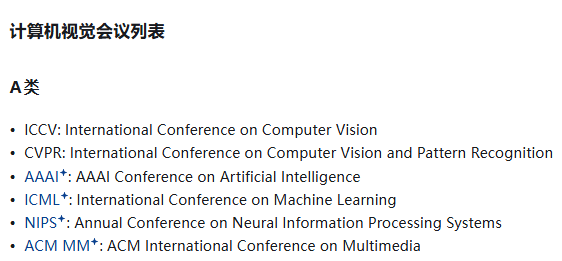


[CV顶刊顶会 - 知乎](https://zhuanlan.zhihu.com/p/265192024)

## 参考

- [(99+ 封私信 / 81 条消息) 集成电路设计的学术会议含金量排名如何？ - 知乎](https://www.zhihu.com/question/559252881/answer/2849452833?utm_campaign=shareopn&utm_medium=social&utm_psn=1875695916662534144&utm_source=wechat_session)
- 


# 相关科研实验室

## 清华

清华大学是国内较早从事EDA研究的高校，**洪先龙教授**和**边计年教授**做`物理实现`和`逻辑综合`，两位老先生的学生大部分去了三大EDA公司


## 北大-无锡EDA研究院

[无锡北京大学电子设计自动化研究院](http://pkueda.org.cn/index.htm)

[北京大学无锡电子设计自动化研究院-开源工具整合](http://pkueda.org.cn/xgzy/dwfw/open.htm)


北京大学集成电路学院成立了国内唯一聚焦EDA技术的“设计自动化与计算系统系”，打造先进的教学与人才培养体系，并与国内外领先的企业深入合作，部分成果已经成功得到转化应用，相关技术是业内目前唯一的解决方案；近期依托院系新成立了`无锡北京大学EDA研究院`，加上此前与EDA及设计方向头部企业共建的多个联合实验室，形成了教育、科技和人才三位一体的布局。

研究方向包括`布局布线`、`FPGA设计自动化的可重构算法`


林亦波[Yibo Lin](https://yibolin.com/)

- [Publications - Yibo Lin](https://yibolin.com/publications/)

- yibolin@pku.edu.cn

- `Contest@ISPD 2024第一名`指导的本科生赵春源提出的高效`GPU异构并行布线算法`

- `CADathlon@ICCAD 2024第一名`指导**郭资政（毕设开源项目作者）、麦景**。在9小时内，运用自己的编码和分析技巧来解决6道集成电路与系统中电子设计自动化问题

- `CAD Contest@ICCAD第一名`指导**杜宇凡、郭资政**。C赛题《Scalable Logic Gate Sizing Using ML Techniques and GPU Acceleration》

- `DreamPlace`, `Limbo`开源项目作者

- 相关采访[北大林亦波：探索AI+EDA新路径 | 青源专栏 2022-09](https://blog.csdn.net/BAAIBeijing/article/details/126944929)

- 

- 一个现象：

  
  
  


## 复旦

集成芯片与系统国家重点实验室

研究方向包括`物理实现`、`参数提取`、`逻辑综合`、`可制造性设计`等方向

陈建利教授

- 指导蔡志杰、魏民、邹鹏，ISPD 2024 contest 第三名

## 北航


## 港中文-EDA Center

[CUHK EDA Center官网](https://cueda-center.github.io/index.html)

[CUHK EDA Github](https://github.com/cuhk-eda)


[Bei Yu(余备)@CUHK-CSE](https://www.cse.cuhk.edu.hk/~byu/)

- [byu@cse.cuhk.edu.hk](mailto:byu@cse.cuhk.edu.hk)

- [Research Topics](https://www.cse.cuhk.edu.hk/~byu/topics.html)

- `CAD Contest@ICCAD 2012`第二名获得者

- [Siting Liu(刘思婷)@CUHK-CSE](https://lusica1031.github.io/)

- lusicaliu@outlook.com

- [Su ZHENG -- CSE CUHK](https://shelljane.github.io/)


[F.Y. Young](https://www.cse.cuhk.edu.hk/~fyyoung/)


- [Jinwei Liu (PhD) - Postdoc (CUHK)](https://anticold.github.io/)
- [Lixin Liu (PhD) - Postdoc (CUHK)](http://www.cse.cuhk.edu.hk/~lxliu/)
  - 本科也是华工的


[陈廷欢CHEN, Tinghuan](https://sse.cuhk.edu.cn/en/faculty/chentinghuan)

- 方向：VLSI CAD and deep learning accelerators for edge devices
- chentinghuan@cuhk.edu.cn


## The University of Texas at Austin 

[David Z. Pan](https://users.ece.utexas.edu/~dpan/)

[朱可人](https://krz.engineer/)


## 中科大

USTC

School of Computer Science and Technology, School of Data Science


## 福大

中国科学院网络计算与智能信息处理重点实验室(Key Laboratory of Network Computing and Intelligent Information Processing)

福州大学早期EDA研究始于**范更华教授**和**朱文兴教授**，当前的研究方向主要是**物理实现**。福州大学团队曾连续三年在`CAD Contest@ICCAD`夺冠。


`福州大学团队`在`CAD Contest@ICCAD`大赛中提出的`6T&6T PPNN单元布局方法`已转让给`华大九天`


林智锋教授

- 指导陈忆鹭、吴昭怡， ISPD 2024 contest 第三名


[刘耿耿](https://ccds.fzu.edu.cn/info/1207/8297.htm)


## 上海交大

[首页_上海人工智能实验室](https://www.shlab.org.cn/)


## 东南大学-国家ASIC工程中心

研究方向是`亚阈值和近阈值相关的时序分析`

`CAD Contest@ICCAD 2017第一名`获奖者福州大学的**朱自然**（Ziran Zhu）毕业后任教于`东南大学ASIC`中心

2020年和**国微集团**成立**EDA联合实验室**，瞄准EDA共性技术研发


[时龙兴](https://ic.seu.edu.cn/shilongxing/main.psp):

- 老所长

[闫浩](https://ic.seu.edu.cn/yanhao/main.psp):

- yanhao@seu.edu.cn
- 领域：智能EDA，面向先进工艺、高能效电路设计中存在的问题，应用人工智能算法辅助电路设计；先进制程/低电压下的**时序**分析与优化

## 华中科技大学


## 西安电子科技大学

在国内较早开始从事成品率分析算法的研究，并且一直在宽禁带半导体的器件建模、可靠性分析等领域有深入的研究和突出的成果

在2019年和**囯微集团**建立**EDA研究院**之后，开始进入`布局布线`和`原型验证`领域


## 中石油-超级科学软件实验室

## [Zhou Jin](https://www.ssslab.cn/people/zhoujin.html)


## 中山大学

[孟祥雨](https://seit.sysu.edu.cn/teacher/MengXiangyu)

- mengxy26@mail.sysu.edu.cn
- 硅基毫米波及太赫兹通信集成电路技术
- 集成电路EDA技术


## 华南理工大学

赖晓铮

- laixz@scut.edu.cn
- PyChip
- 


## 广东工业大学

[电子设计自动化（EDA）科研团队-广东工业大学集成电路学院](https://sme.gdut.edu.cn/info/1163/1478.htm)

电子设计自动化（EDA）科研团队依托广东工业大学集成电路学院成立。面向人工智能辅助集成电路设计EDA工具开发、应用等国家重大战略与行业重大需求，以人工智能辅助EDA为研究核心，聚焦于数字集成电路设计后端工具、FPGA设计工具优化等领域的前沿基础理论和关键技术研究。团队主要开展“数据驱动机器学习的集成电路智能设计”、“人工智能方法实现集成电路的敏捷设计”、“基于传统的分析和优化技术的集成电路辅助设计”等研究


1. 数据驱动机器学习的集成电路智能设计
2. 人工智能方法实现集成电路的敏捷设计
3. 基于传统的分析和优化技术的集成电路辅助设计


## 国立清华大学


## University of California  

[Design Automation Laboratory](http://eda.ee.ucla.edu/) Department of Electrical and Computer Engineering, University of California San Diego  

Andrew B. Kahng  

- akahng@ucsd.edu
- [Andrew B. Kahng | Jacobs School of Engineering](https://jacobsschool.ucsd.edu/people/profile/andrew-b-kahng)


## iEDA

- [ieda](https://ieda.oscc.cc/en/)
- 一个做开源数字后端工具`iEDA`的组织
- 鹏程实验室，一生一芯


## 参考

- https://wadmes.github.io/2019/12/11/EDA-family-tree/
- [全国高校EDA研究全景图_哔哩哔哩_bilibili](https://www.bilibili.com/video/BV1UfMpzSEKH/?buvid=XUFC626F59C51B48BCBC4A41057611D79C17D&is_story_h5=false&mid=OVLsgEqbjDFgev4KMYtmeQ%3D%3D&plat_id=193&share_from=ugc&share_medium=android&share_plat=android&share_session_id=e1271216-2f7a-45fd-99ba-7777c86dfb1e&share_source=WEIXIN&share_tag=s_i&spmid=dt.dt.0.0&timestamp=1749785783&unique_k=KbJDjRW&up_id=3546575322221318&vd_source=ea5f077dc692dc32725d05ff92da61a5)


# 相关企业/机构


## 华为诺亚方舟 & 海思

Huawei Noah’s Ark Lab [AI4EDA](https://noahai4eda.github.io/)

`CAD Contest@ICCAD 2018第一名`获奖者`香港中文大学`的**陈劲松**（Jingsong Chen，2021年博士毕业）毕业后加入`华为`


## EDA国创中心

与东南大学[有关联](https://ic.seu.edu.cn/2024/0509/c47774a489994/page.htm)

[中心介绍—国家集成电路设计自动化技术创新中心，EDA国创中心【官方网站】](https://www.nctieda.com/AboutUs.html)


## [芯行纪](https://www.xtimes-da.com/)


### AmazeSys

应用于数字芯片物理设计领域的**布局布线**工具

包含宏单元布局规划、电源规划、布局、时钟树综合、布线、优化、寄生参数提取以及时序功耗分析等全功能模块，支持先进工艺制程下的超大规模设计，可完成数字芯片从**Netlist到GDS**的完整设计流程，快速达成性能、功耗、面积优化等设计目标

基于强大的**机器学习引擎内核**，AmazeSys具备自适应超高质量优化能力。该引擎智能提取设计本身特点进行样本训练，综合性能、功耗、面积和布线拥塞等多项关键指标，快速获取量身定制的最佳优化方案，可有效帮助用户降低调整大量工具设置的时间成本。

### AmazeFP

智能布局规划工具**AmazeFP**将**机器学习**技术与**布局规划**引警结合，在兼顾性能、功耗和面积(**PPA**)的同时，提供了高度智能的**拥塞感知**、便捷的数据流分析和**宏单元自动整理对齐功能**，有效解决当前数字芯片在后端设计阶段的布局规划节点面临的经验值需求高、手工耗时长、数据流结构分析不够深入、设计目标收敛性差等难题，助力用户在后端设计初期快速有效地获取高质量布局规划方案，减少迭代次数，从而节约大规模设计的研发成本，提速产品上市时间。

### AmazeFP-ME

作为一款EDA机器学习的工具，AmazeFP-ME在AmazeFP的基础上，能够快速探索数百倍甚至更多的庞大解空间，无需用户手动调参，同时配备优异且精准的数据、图形分析功能，可为用户提供高效便捷的设计体验

AmazeFP-ME作为AmazeFP的AI配套工具，将机器学习技术引入到AmazeFP的解空间探索中，不仅进一步显著地提升了PPA，还为用户创造全新的自动化使用体验。


### AmazeDRCLite


### 云


## 华大九天


东南大学-华大九天-NiiCEDA联合实验室

### PyAether

Aether就是全定制电路（例如模拟、存储、射频、平板等）设计平台，包括原理图，版图，仿真环境，以及数据版本管理工具和Python接口等。

**Python拥有众多针对****数据科学和人工智能的强大的开源库**，例如NumPy和Pandas用于数据处理，Matplotlib用于数据可视化，Scikit-Learn提供了大量的预处理方法和机器学习算法，TensorFlow和PyTorch则是深度学习领域的重要工具。这些库大大降低了开发难度，使得Python在AI领域的地位无可替代。所以无论是数据清洗和预处理，还是模型建立，例如决策树，神经网络，贝叶斯优化等，以及模型训练和测试，对模型结果的解读等，**都会**天然的**使用Python**。


所以Python的开放性生态、天然的数据挖掘、包括机器学习的人工智能（AI）以及各类算法优化包，友好的web开发，使用户可以在更开放、更强大的生态体系里开展设计。可以用它来构建电路与版图的自动化任务，快速进行数据处理和分析。例如，PyAether可以赋能IC CAD，更好得响应IC 设计和版图各种要求。


- [10月18日深度解析 PyAether EDA 生态系统，带您探索电路设计自动化的秘籍！ - 华大九天PyAether - EETOP 创芯网论坛 (原名：电子顶级开发网) -](https://bbs.eetop.cn/thread-977456-1-1.html)


```python
import pyAether


class InvLe:

    def __init__(self, lib, cell, tech_lib, view="layout", mode="a"):
        r"""InvLe init function, receive the specified layout information.

        Parameters
        ----------
        lib : str
            Library name.
        cell : str
            Cell name.
        tech_lib : str
            Attach tech library name.
        view : str
            View name, the default value is 'layout'.
        mode : str
            Mode for open design, the default value is 'a'.
        """
        pyAether.emyInitDb()
        pyAether.emyInitLog()
        self.pnt_x = 0
        self.pnt_y = 0
        self.namespace = pyAether.emyUnixNS()
        self.design = self.open_design(lib, cell, view, mode=mode)
        self.block = self.design.getTopBlock()
        if self.block is None:
            self.block = pyAether.emyBlock.create(self.design)
        self.uu2dbu = self.block.getDBUPerUU()
        oplib = self.design.getLib()
        tech_scl = pyAether.emyScalarName(self.namespace, tech_lib)
        tech = pyAether.emyTech.open(tech_scl)
        tech.attach(oplib, tech_scl)

    def open_design(self, lib, cell, view, view_type="maskLayout", mode="r"):
        r"""This function is used to open design and return an emyDesign object.

        Parameters
        ----------
        lib : str
            Library name.
        cell : str
            Cell name.
        view : str
            View name.
        view_type : str
            Type of view, the default value is 'layout'.
        mode : str
            Mode for open design, the default value is 'r'.

        Returns
        -------
        design : emyDesign
            An emyDesign object opened by given parameters.
        """
        lib_scl = pyAether.emyScalarName(self.namespace, lib)
        cell_scl = pyAether.emyScalarName(self.namespace, cell)
        view_scl = pyAether.emyScalarName(self.namespace, view)
        reserved_view = pyAether.emyReservedViewType(view_type)
        view_type = pyAether.emyViewType.get(reserved_view)
        design = pyAether.emyDesign.open(lib_scl, cell_scl, view_scl,
                                         view_type, mode)

        return design

    def create_inst(self, master_lib, master_cell, master_view, inst_name,
                    point, params, **kwargs):
        r"""This function creates an emyScalarInst object on specified block.

        Parameters
        ----------
        master_lib : str
            Library name of instance.
        master_cell : str
            Cell name of instance.
        master_view : str
            View name of instance.
        inst_name : str
            Text string of instance.
        point : tuple
            Point to create an emyTransform object, such as (0, 0).
        params: emyParamArray
            emyParamArray
        kwargs
            Other keyword arguments,
            here specifies view_type, mode, view, status.
        """
        view_type = kwargs.get("view_type", "maskLayout")
        mode = kwargs.get("mode", "r")
        view = kwargs.get("view", pyAether.emcInheritFromTopBlock)
        status = kwargs.get("status", pyAether.emcNonePlacementStatus)
        master = self.open_design(master_lib, master_cell, master_view,
                                  view_type, mode)
        inst_scl_name = pyAether.emyScalarName(self.namespace, inst_name)
        pnt_x0, pnt_y0 = point
        point_1 = pyAether.emyPoint(int(pnt_x0 * self.uu2dbu),
                                    int(pnt_y0 * self.uu2dbu))
        trans = pyAether.emyTransform(point_1)
        pyAether.emyScalarInst.create(self.block, master, inst_scl_name, trans,
                                      params, view, status)

    def create_net(self, net_name, path, **kwargs):
        r"""This function creates an emyScalarNet object on specified block.

        Parameters
        ----------
        net_name : str
            It specifies the net name string.
        path : list
            It specifies path list.
        kwargs
            Other keyword arguments,
            here specifies sigType, isGlobal, view.

        Returns
        -------
        scl_net : emyScalarNet
            An emyScalarNet object created by given parameters.
        """
        sig_type = kwargs.get("sigType",
                              pyAether.emySigType(pyAether.emcSignalSigType))
        is_global = kwargs.get("isGlobal", False)
        view = kwargs.get(
            "view",
            pyAether.emyBlockDomainVisibility(pyAether.emcInheritFromTopBlock))
        net = pyAether.emyScalarName(self.namespace, net_name)
        scl_net = pyAether.emyScalarNet.create(self.block, net, sig_type,
                                               is_global, view)
        path.addToNet(scl_net)

        return scl_net

    def create_path(self, layer, purpose, width, start_point, end_point):
        r"""This function creates an emyScalarNet object on specified block.

        Parameters
        ----------
        layer : str
            It specifies the layer name string.
        purpose : str
            It specifies the purpose name string.
        width : float
            Define the width of the path.
        start_point : tuple
            Path start point, such as (0, 0).
        end_point : tuple
            Path end point, such as (1, 1).

        Returns
        -------
        path : emyPath
            A path object created by given parameters.
        """
        (sta_x0, sta_y0), (end_x0, end_y0) = start_point, end_point
        sta_pnt = pyAether.emyPoint(
            int(self.pnt_x * self.uu2dbu) + int(sta_x0 * self.uu2dbu),
            int(self.pnt_y * self.uu2dbu) + int(sta_y0 * self.uu2dbu))
        end_pnt = pyAether.emyPoint(
            int(self.pnt_x * self.uu2dbu) + int(end_x0 * self.uu2dbu),
            int(self.pnt_y * self.uu2dbu) + int(end_y0 * self.uu2dbu))
        points = [sta_pnt, end_pnt]
        layernum = pyAether.emyGetLayerNumByName(self.design, layer)
        purposenum = pyAether.emyGetPurposeNumByName(self.design, purpose)
        wid = int(width * self.uu2dbu)
        path = pyAether.emyPath.create(self.block, layernum, purposenum, wid,
                                       points)
        return path

    def create_gr(self, centerLine, templateName, **kwargs):
        r"""This function creates an emyScalarNet object on specified block.

        Parameters
        ----------
        centerLine : emyPointArrayF
            Set the drawing route of the guard ring.
        templateName : str
            Set the template name of the guard ring.
        kwargs
            Other keyword arguments,
            here specifies type, justify, offset, topLayer, stackMode, maxContPattern,
            isBodyMode, bodyWidth, contRow, contSpaceX, contSpaceY, contSizeX, contSizeY,
            bIsChamfer, chamferAmount, metalSameBody, stackSameMetal, cornerContact.

        Returns
        -------
        rect_nwgr : emyRect
            Build nwGuardRings.
        """

        type = kwargs.get("type", "Polygon")
        justify = kwargs.get("justify", "Center")
        offset = kwargs.get("offset", 0)
        topLayer = kwargs.get("topLayer", None)
        stackMode = kwargs.get("stackMode", False)
        maxContPattern = kwargs.get("maxContPattern", False)
        isBodyMode = kwargs.get("isBodyMode", True)
        bodyWidth = kwargs.get("bodyWidth", 0.5)
        contRow = kwargs.get("contRow", 0)
        contSpaceX = kwargs.get("contSpaceX", 0)
        contSpaceY = kwargs.get("contSpaceY", 0)
        contSizeX = kwargs.get("contSizeX", 0)
        contSizeY = kwargs.get("contSizeY", 0)
        bIsChamfer = kwargs.get("bIsChamfer", False)
        chamferAmount = kwargs.get("chamferAmount ", 0)
        metalSameBody = kwargs.get("metalSameBody", False)
        stackSameMetal = kwargs.get("stackSameMetal", False)
        cornerContact = kwargs.get("cornerContact", True)

        pyAether.aeCrtGuardring(self.design,
                                centerLine,
                                templateName,
                                type=type,
                                justify=justify,
                                offset=offset,
                                stackMode=stackMode,
                                maxContPattern=maxContPattern,
                                isBodyMode=isBodyMode,
                                contRow=contRow,
                                contSpaceX=contSpaceX,
                                topLayer=topLayer,
                                contSpaceY=contSpaceY,
                                contSizeX=contSizeX,
                                contSizeY=contSizeY,
                                bIsChamfer=bIsChamfer,
                                chamferAmount=chamferAmount,
                                metalSameBody=metalSameBody,
                                stackSameMetal=stackSameMetal,
                                cornerContact=cornerContact,
                                bodyWidth=bodyWidth)

    def close(self):
        r"""This function save and close the emyDesign object which is opened.

        """
        self.design.save()
        self.design.close()

    def create(self, x_0, y_0):
        r"""This function creates an inverter.

        """
        self.pnt_x = x_0
        self.pnt_y = y_0
        # Create scalar instances
        params_p18 = pyAether.emyParamArray()
        params_p18.append(pyAether.emyParam('Single_Width', '1u'))

        self.create_inst("reference_pdk", "p18", "layout", "M0", (0.43, 3.15),
                         params_p18)

        # pyAether.emyArray()
        params_n18 = pyAether.emyParamArray()
        params_n18.append(pyAether.emyParam('Single_Width', '600n'))
        params_n18.append(pyAether.emyParam('SD_Metal_Width', '370n'))
        self.create_inst("reference_pdk", "n18", "layout", "M1", (0.29, 1.17),
                         params_n18)

        # Create path
        path1 = self.create_path("GT", "drawing", 0.18, (1.0, 3.15),
                                 (1.0, 1.77))
        path2 = self.create_path("M1", "drawing", 0.23, (1.36, 3.47),
                                 (1.36, 1.21))
        path3 = self.create_path("M1", "drawing", 0.23, (0.64, 1.21),
                                 (0.64, 0.18))
        path4 = self.create_path("M1", "drawing", 0.23, (0.64, 4.11),
                                 (0.64, 5.14))

        # Create net
        self.create_net("Y", path1)
        self.create_net("A", path2)
        self.create_net("vss", path3)
        self.create_net("vdd", path4)

        # create GR
        self.create_gr([(0.53, 4.89), (1.47, 4.89)], "NWGR", bodyWidth=0.4)

        # create PGR
        self.create_gr([(0.52, 0.41), (1.48, 0.41)], "PGR", bodyWidth=0.4)


if __name__ == '__main__':
    example = InvLe("lib01", "test", "reference_pdk", "layout", mode="w")
    example.create(0, 0)
    example.close()

```


## 概伦电子


收购了Entasys


## 鸿芯微纳


## 立芯


布局布线全流程设计工具LeCompiler

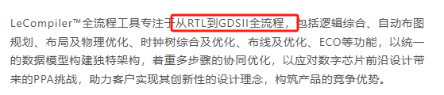

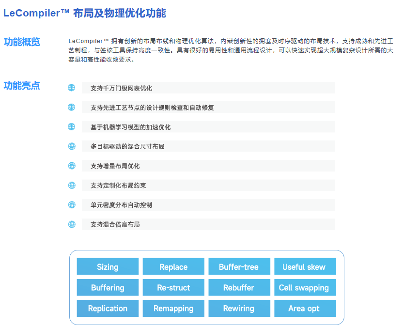

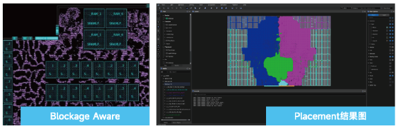


## 伴芯


## 华芯巨数


浙江


## 嘉立创

PCB


# 相关竞赛

## CADathlon@ICCAD

[CADathlon@ICCAD 2024 | ICCAD 2024](https://2024.iccad.com/cadathlon-iccad-2024)

- EDA领域的**“奥林匹克运动会”**，始于**2002年**
- **in-person** event, **all-day programming** competition, **9 hours**, two-person teams, information about the problems and relevant research papers will be released online one week before the competition. 
- 一般在10月份举办
- six problems
  - Circuit Design & Analysis
  - **Physical Design** & Design for Manufacturability
  - Logic & High-Level Synthesis
  - System Design & Analysis
  - Functional Verification & Testing
  - Future technologies (Bio-EDA, Security, AI, etc.)


## Contest@ISPD

[International Symposium on Physical Design (ISPD)](https://ispd.cc/ispd2025/index.php?page=contests)

- 于**2005年**首次举办
- Contest@ISPD作为**ISPD研讨会**的一部分，是全球三大顶尖国**际物理设计**学术竞赛之一，由全球研究计算机科学的权威学会**ACM**（Association for Computing Machinery）所举办
- 每年**12月份**由业界一流公司（IBM、Intel、Xilinx等）公布学术竞赛题目，**3月份**提交研发成果和软件系统，由业界公司负责提供测试电路，并测试参赛队伍所提交的软件系统，最后于3月底或4月初**在年度ACM ISPD会议上公布竞赛结果**。

|      |                             题目                             | First Place |
| ---- | :----------------------------------------------------------: | :---------: |
| 2015 | Blockage-Aware Detailed Routing-Driven **Placement** Contest | NTUPlacerDR |


## CAD Contest@ICCAD

- 始于 2012年
- 覆盖了EDA前端（front-end）和后端（back-end）
- 由**IEEE CEDA、ACM SIGDA**和工业界**Cadence、Synopsys**等共同赞助
- **Each year** the organizing committee announce **three challenging problems** in different topic, can participate in one or more problems

Blockage-Aware Detailed Routing-Driven Placement Contest


### 历年相关赛题

|        |                             题目                             | Sponsor |
| ------ | :----------------------------------------------------------: | ------- |
| 2024-C | Scalable Logic **Gate Sizing** Using **ML** Techniques and **GPU Acceleration** | Nvidia  |
|        |                                                              |         |
|        |                                                              |         |
| 2011   | **Routability-driven Placement** Contest and Benchmark Suite |         |
|        |                                                              |         |


## 侠客岛


## EDA精英挑战赛


## TAU Contest

[Tau 2021 Contest](https://sites.google.com/view/tau-contest-2021/home)

- 数字电路**时序分析**竞赛（TAU）
- 始于**2011年**，是由**国际计算机协会ACM**所举办的专业赛事
- 一般由**IBM、Cadence、Synopsys、TMSC**等国际顶尖公司参与命题
- 好像到21年就没了。。。


## [Programming Contest@IWLS](https://www.iwls.org/contest/)

[IWLS Contest](https://www.iwls.org/contest/)

- 始于2017年
- 是由IEEE/ACM International Workshop on Logic & Synthesis（IWLS）举办
- 由业界一流公司（Synopsys、Xilinx、Google等）公布竞赛题目
- 以**逻辑综合（Logic Synthesis）和工具研发**为竞赛主题


## “全国大学生集成电路创新创业大赛”的华大九天赛道


[全国大学生集成电路创新创业大赛](http://univ.ciciec.com/)

[第八届集创赛杯赛题目——华大九天杯 - 全国大学生集成电路创新创业大赛](http://univ.ciciec.com/nd.jsp?id=733#_jcp=1)


## LLM4HWDesign Contest

2024年ICCAD新设立**LLM** for **Hardware** Design Contest

LLM4HW Design竞赛旨在为硬件代码生成构建大规模、高质量的Verilog代码生成数据集。在基于LLM的硬件代码生成中引发一场类似ImageNet的革命。为了实现这一目标，LLM4HWDesign竞赛鼓励参与者收集数据样本，并开发创新的数据清理和标记技术，以有效提高硬件代码生成数据集的规模和质量，为推进LLM辅助硬件设计工作流程建立关键基础设施。


## [**DAC System Design Contest** ](https://pku-sec-lab.github.io/dac-sdc-2024/)

**DAC 2012 Routability-Driven Placement Contest and Benchmark Suite**


## 参考

- [盘点全球顶级EDA竞赛及中国大陆获奖情况|清华大学|福州大学|iccad|上海交通大学|eda_网易订阅](https://www.163.com/dy/article/GQS44UUR0531PW97.html)


# 相关PDK

详细查看[flow.md](./flow.md)


# 社区

- [OSCC: Open Source Chip Community](https://gitee.com/oscc-project)
- [EDA知识](https://ieda.oscc.cc/train/eda/)
- [ieda.oscc.cc](https://ieda.oscc.cc/)


# 其他

### 


### VLSI Placement and Routing — From 2D to 3D

- --Hailong Yao （University of Science and Technology Beijing  ）
- report at ISEDA'25
- Great summary of the problem of P&R of 2D/2.5D/3D


#### Package

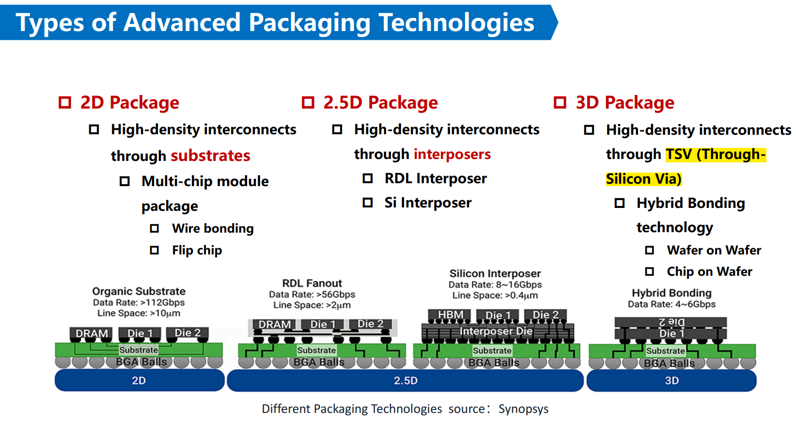


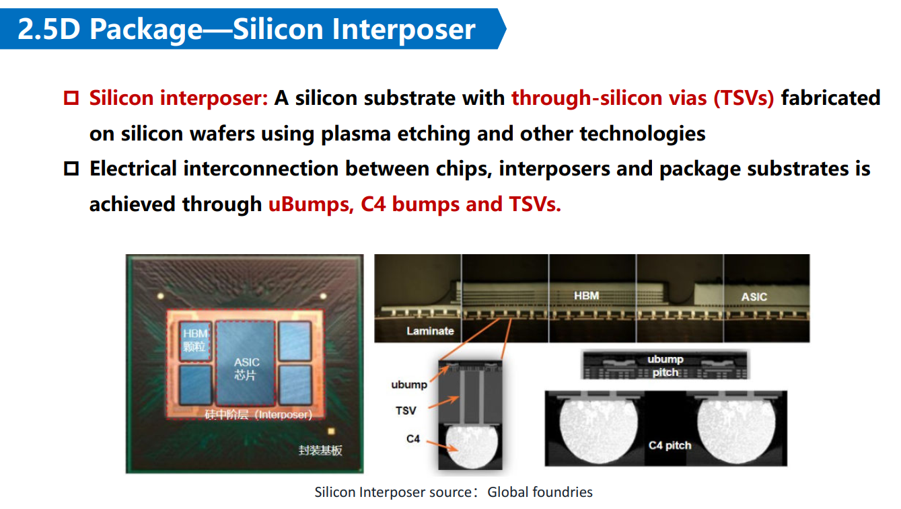

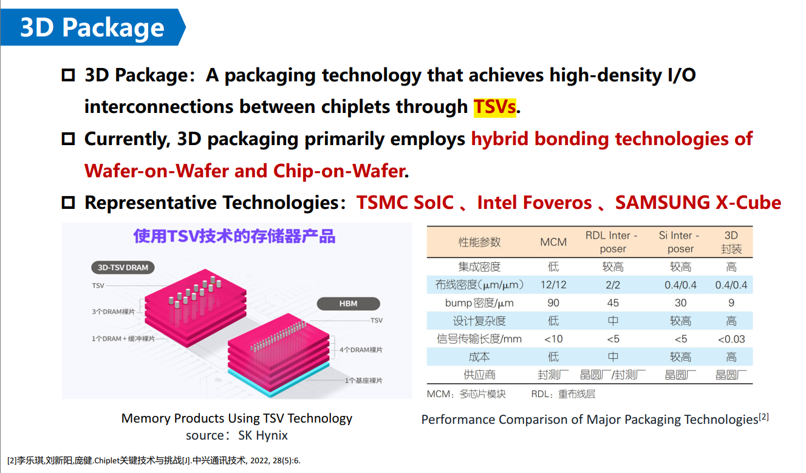


#### Placement  

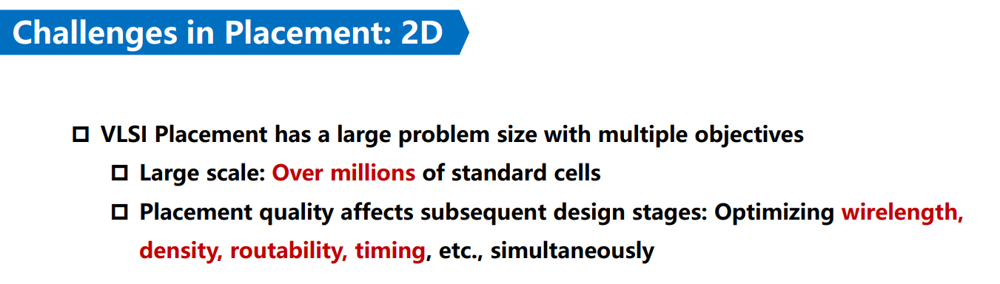


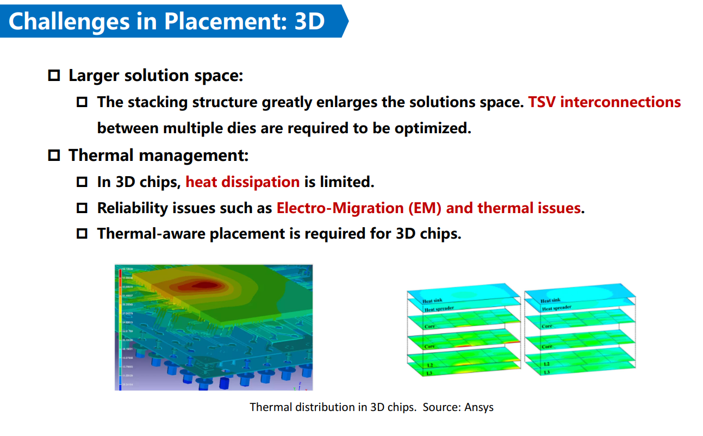

#### Routing

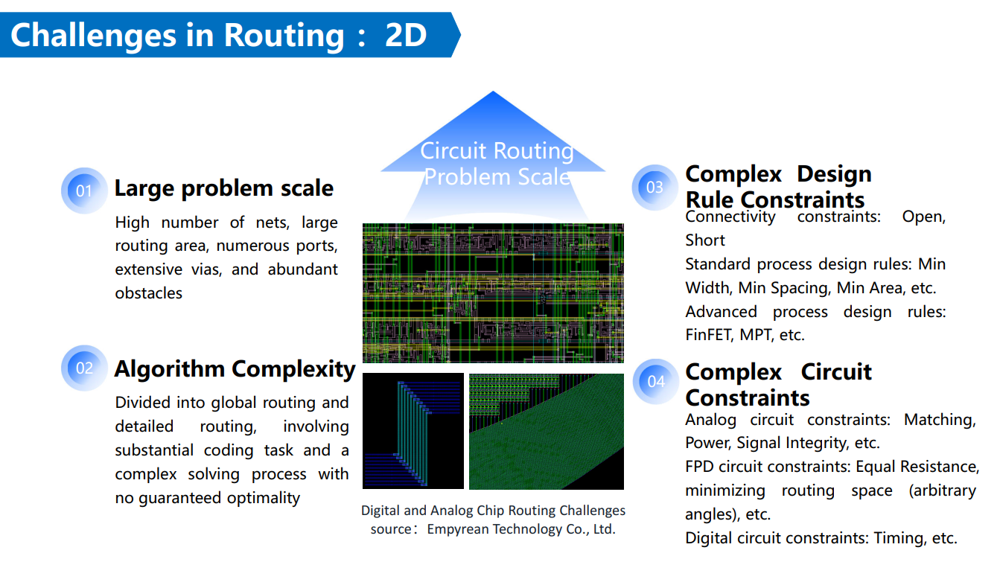


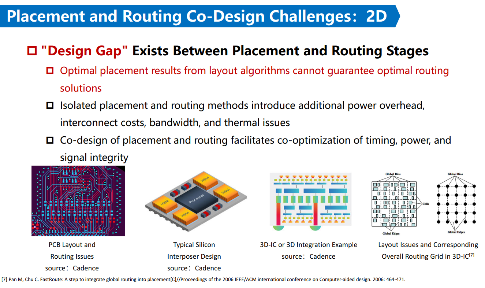

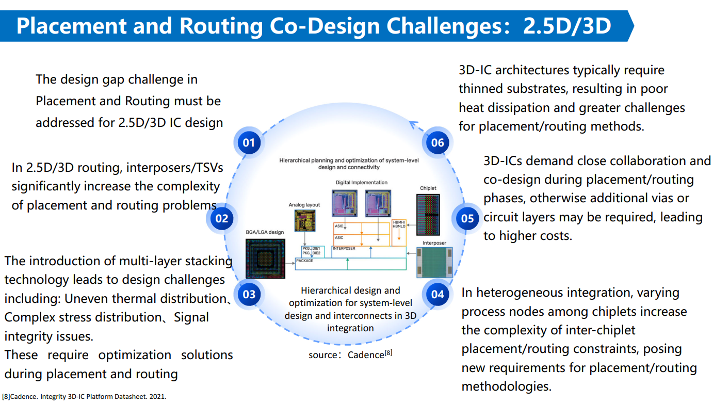

#### Existing P&R Methods

##### placement


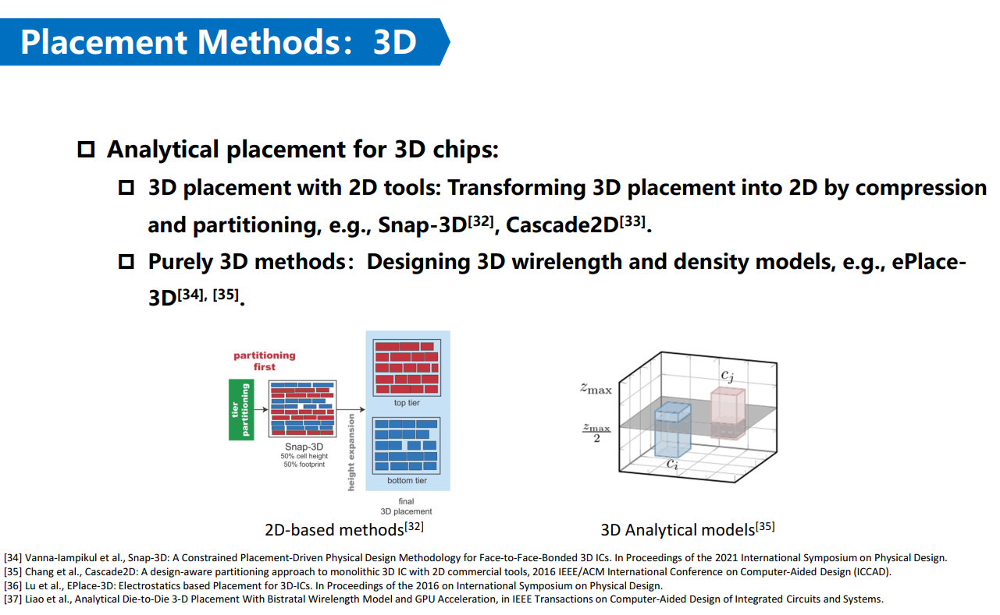

##### routing


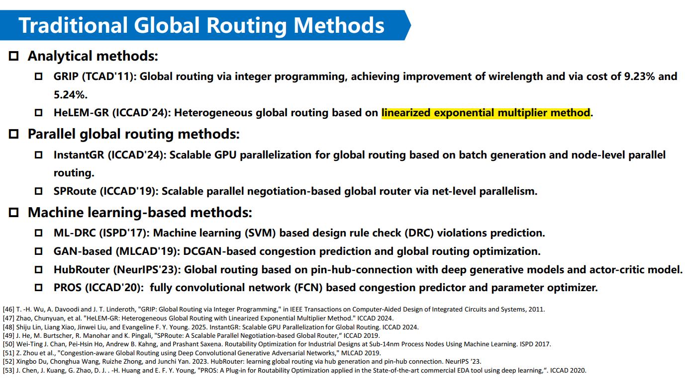

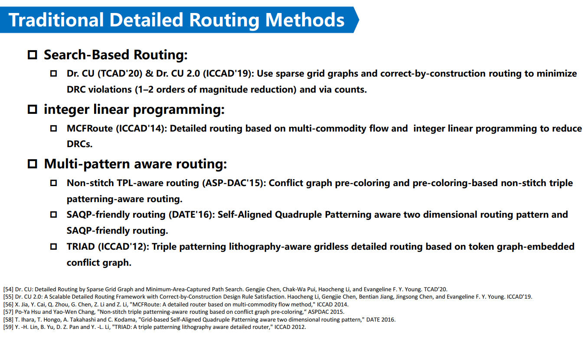

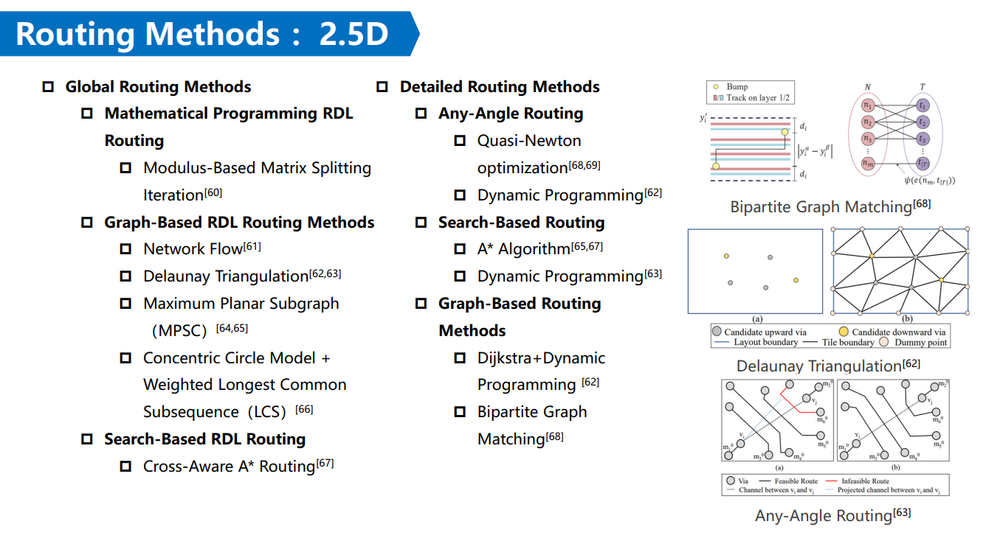


#### 3D商业工具

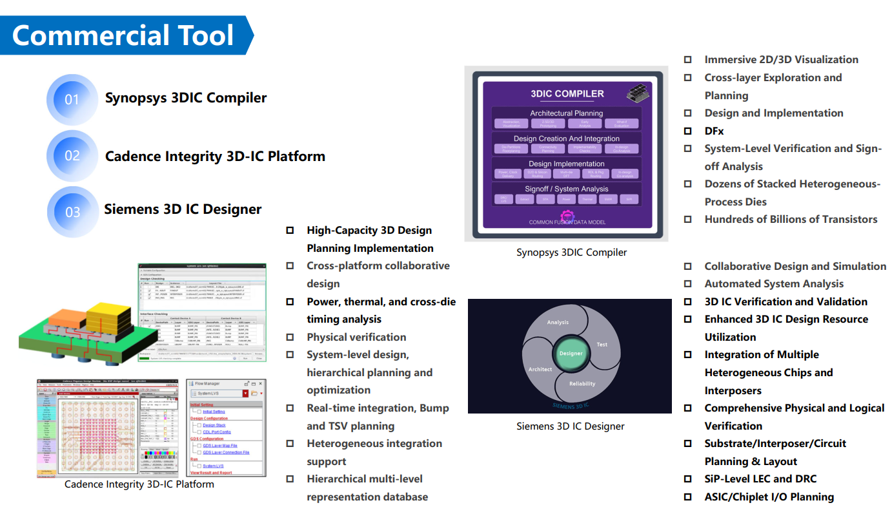

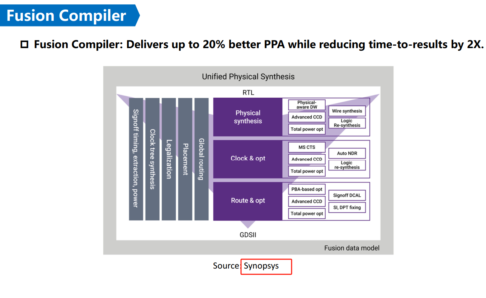


#### Future direction

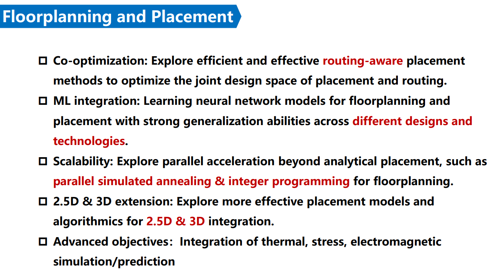

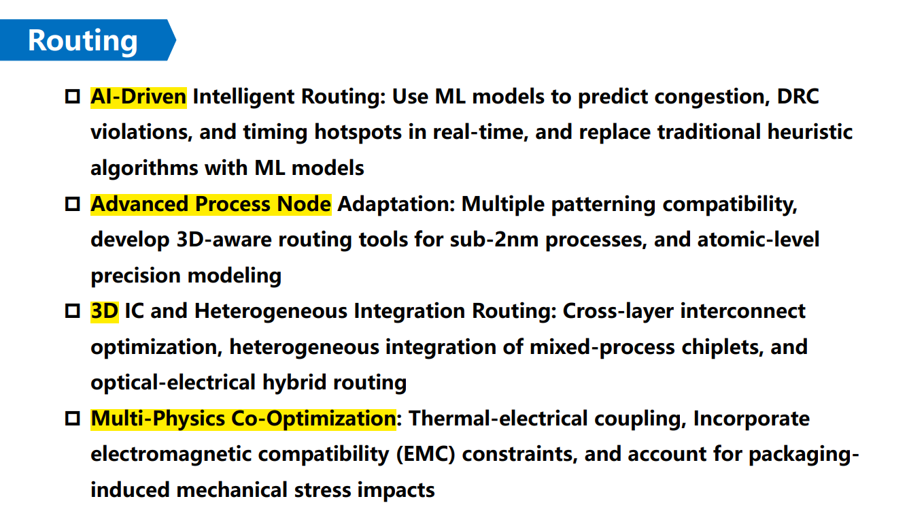

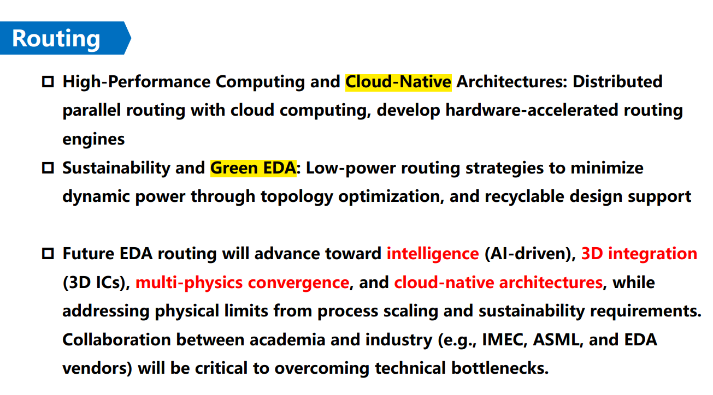

#### conclusion

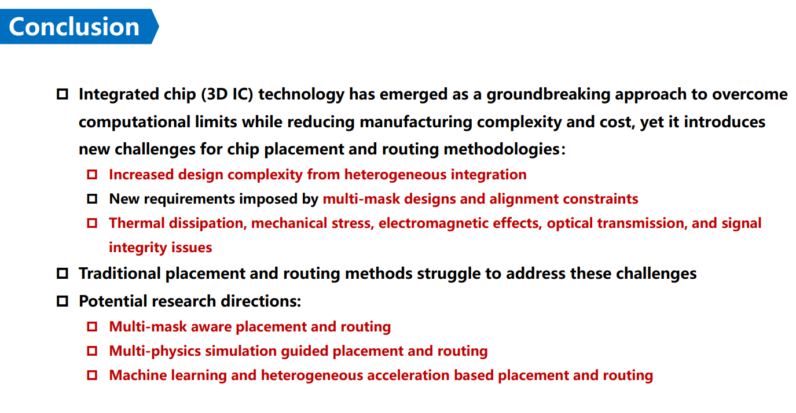
