# 计算机组成与体系结构

## 发展历史

- ENIAC  约翰 • 莫克利教授  1943 年  

- EDVAC  冯 ・ 诺伊曼  1945 年  存储程序概念  IAS 计算机

  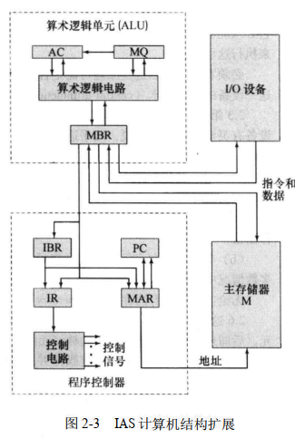

  

- 1947 年贝尔实验室发明了晶体管  

- UNIVAC I 是第一台成功的商用计算机  

- IBM701 1953 年    IBM 702  1955 年  

- 1958 年出现了电子学革命性的成就， 开创了微电子时代： 集成电路的发明  

- System/360 ，  1964 年， IBM   

- PDP-8    1964 年 足够小， 以至于可以放在实验室的工作台上  总线结构  

  由于所有的系统元件都分享同一套信号通路， 因此它们的使用必须由 CPU 来控制。 这种结构具有高度的灵活性,. 允许将模块插入总线以形成各种配置。  

  

- Intel 4004  1971 年  第一个将 CPU 的所有元件都放在同一块芯片内的产品—— 微处理器诞生

- Intel 8008  1972 年  第一个 8 位的微处理器  

- Intel 8080  1974 年  第一个通用微处理器。 

- 32 位单片微处理器  贝尔实验室和 HP 公司  1981 年    

- Intel 32 位微处理器  80386  1985 年  

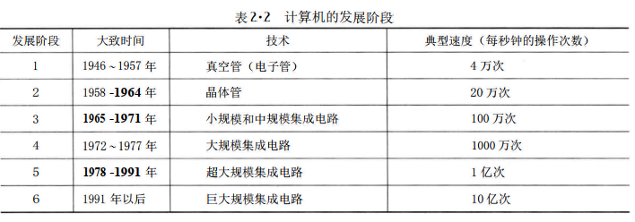

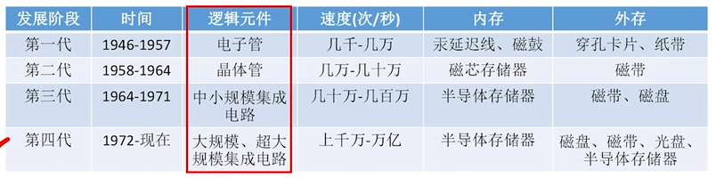


机器字长：一次整数运算所能处理的二进制位数

### 存储墙


## 计算机系统

### 早期冯诺依曼机


效率低

### 现代冯罗伊曼机

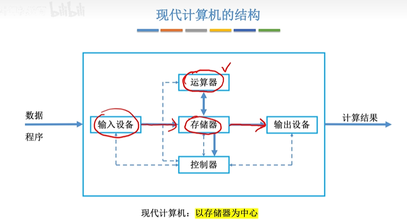


处理器CPU = 运算器+控制器

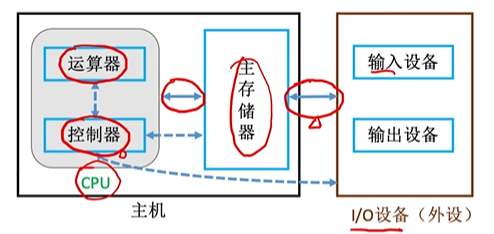

数据给运算器
指令给控制器

计组的主机是CPU+内存，不包括硬盘，硬盘属于IO设备


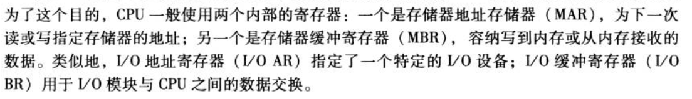


### 数的表示

#### 原码/反码/补码/移码

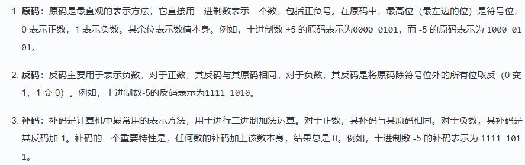

补码的使用可以简化计算机中的算术运算，因为==加法和减法可以统一为加法运算==。当进行减法运算时，可以将减数的补码与被减数相加，从而得到结果


移码:补码的基础上将符号位取反。注意:移码只能用于表示整数


[原码、反码、补码 | 菜鸟教程](https://www.runoob.com/w3cnote/sign-magnitude.html)

### 定点数/ 浮点数

> 浮点数就是小数点位置是变的

`定点数`也有反码和补码


####    IEEE 754标准浮点数

  科学计数法

 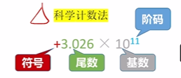


##### float


注意小数点前一定为1，所以不用记录这个数据到尾数 

 

##### double


阶码偏置值为1023 

##### 表示范围

规格化浮点数的阶码不全为0、也不全为1


### 中断

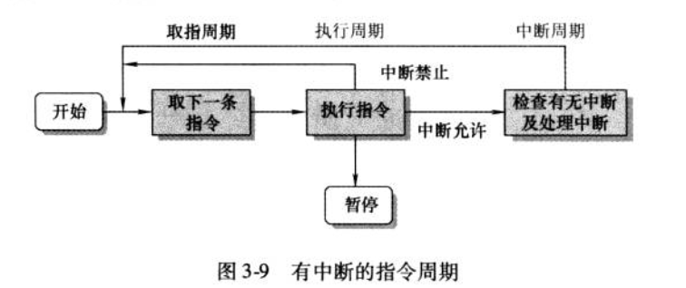

与3-3对比

中断优先级


### 总线互联


总线中包含三类：

- 数据线

- 地址线

  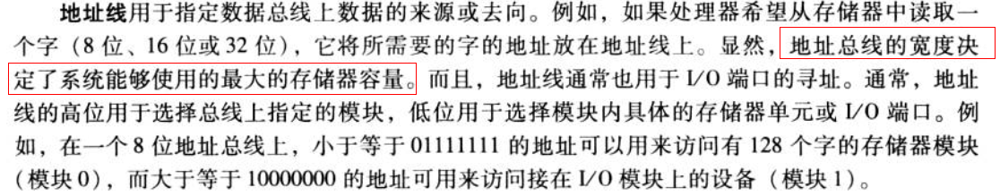

- 控制线

  


## 处理器/CPU

### 综述


**CPU内部总线结构**


> [!TIP]
>
> 橙色框为用户可见的寄存器，灰色不可见
>
> 这里的R0,R1...表示的是ALU输入的通用寄存器


### 最简程序


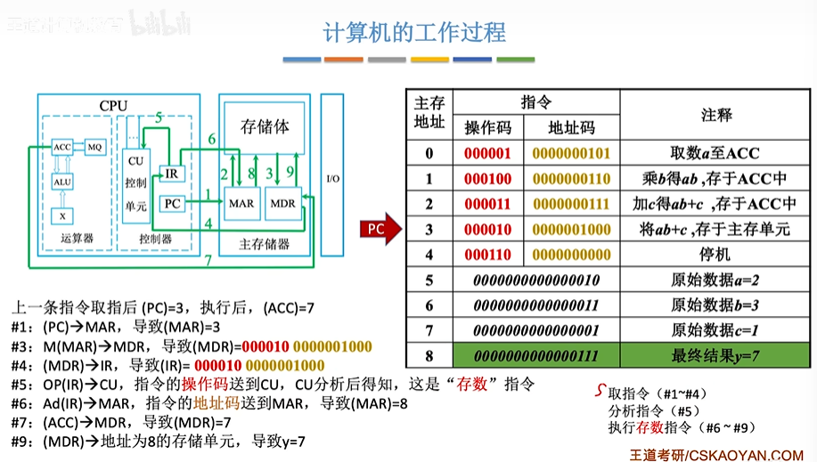


### 运算器


还有一个PSW寄存器,也叫FR(标志寄存器)

####  ALU

ALU的核心是一个加法器，加减乘数都使用加法器实现


- 如果ALU支持k种功能，则控制信号位数m≥log~2~k

- ALU的运算数、运算结果位数与计算机的器字长相同

- ZF/OF/SF/CF标志位，用于表示本次运算结果的特征。这些标志信息通常会被送入`PSW（FR）程序状态字寄存器`

  ZF表示运算结果是否为零

  0F表示有符号数运算结果是否溢出

  SF表示有符号数运算结果的正负性

  CF表示无符号数运算结果是否溢出

##### ALU的输入连接的寄存器


三种连线方式：


### 指令

x86/ARM

#### 分类

##### 按访问地址数量分类


> [!WARNING]
>
> 注意，一个指令中需要访问的地址越多，寻址能力越差

**零地址指令**

空操作/停机/关中断

堆栈操作

**一地址指令**

单操作数（三次访存）：加减==1==/取反/求补码

双操作数（两次访存）：加减法，但是被加数已经在ACC里面了

**二地址指令**：

（四次访存）加减，结果放在被加数覆盖

**三地址指令**：

（四次访存）加减结果指定存放到某地址

**四地址指令**：

（四次访存）加减结果指定存放到某地址,同时PC的值指向另一个地址


##### 按指令长度分类


##### 按操作码长度分类


一种可变操作码指令：


> [!TIP]
>
> **设地址长度为n，上一层留出m种状态，下一层可扩展出mx2"种状态**
>
> 

##### 按操作类型分类


#### 指令寻址

PC实际上并不一定是+1。如果主存按字节（Byte）编址的（也就是说一个地址只有1Byte数据），而指令长度为2Byte，那么PC每次就要+2了

如果是变长指令：

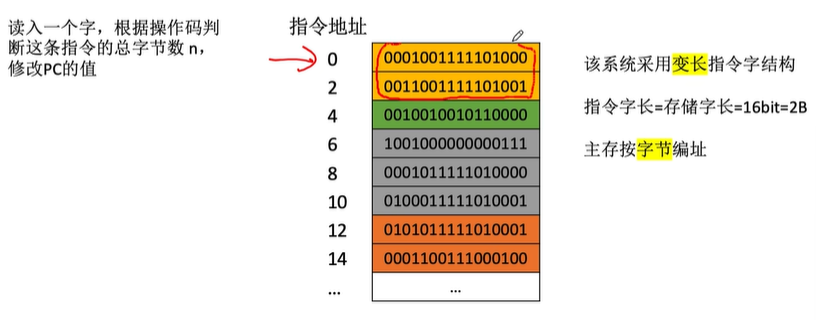

##### 顺序寻址


##### 跳跃寻址

比如汇编中的JUMP

十种类型


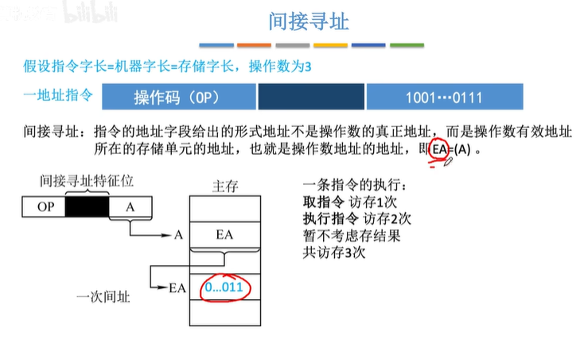


 


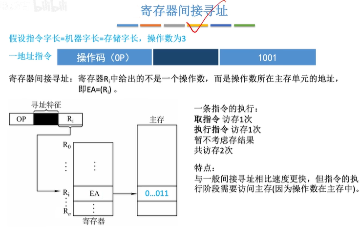

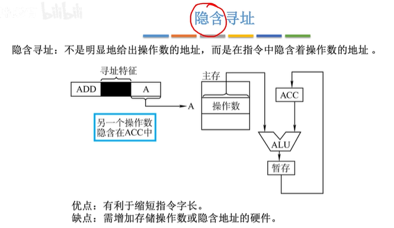


 

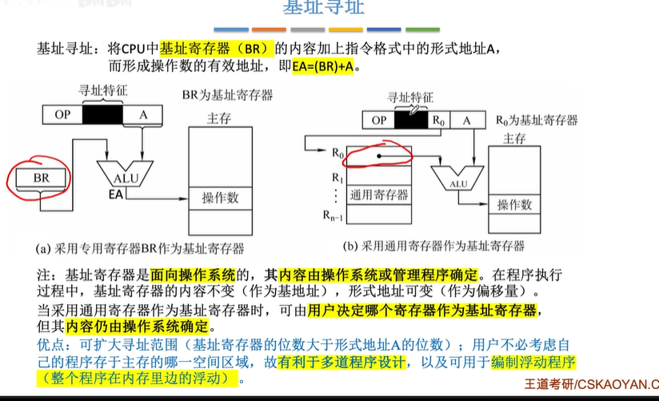


变址的作用，有无IX的比较：


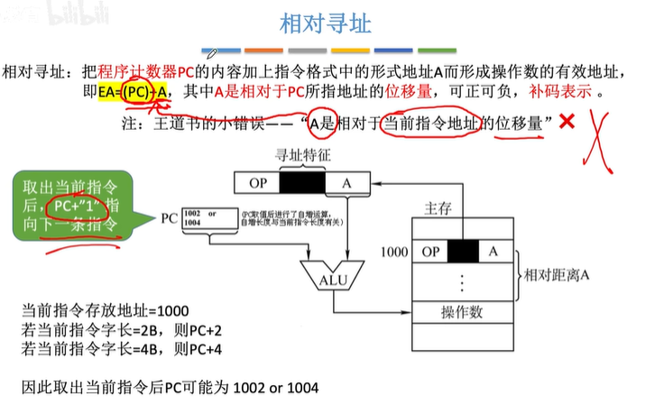


##### 堆栈寻址

堆栈指针：SP


#### 指令集

CISC 和 RIS 


### 控制器

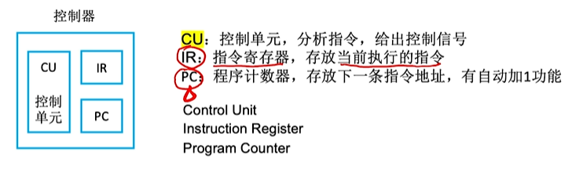

####   指令周期

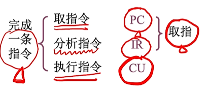


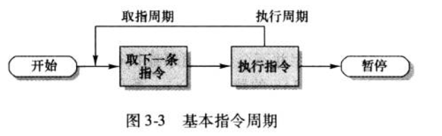

读取指令，然后执行指令。这两部为一个指令周期

`PC`寄存器保存下一条指令`地址`

`IR`保存指令

##### 取址周期


##### 间址周期 


##### 执行周期


##### 中断周期


#### 指令周期和机器周期


> [!TIP]
>
> 关于间址周期，详情可看[指令寻址](#指令寻址)

#### 控制器的内部总线结构


#### 控制器中的设计


##### 硬布线


举例：


各阶段微操作时序安排原则：


> [!TIP]
>
> 可以并行


> [!TIP]
>
> 假设都只有3个节拍

**组合逻辑电路设计**


[5.4.1_硬布线控制器_哔哩哔哩_bilibili](https://www.bilibili.com/video/BV1ps4y1d73V?spm_id_from=333.788.player.switch&vd_source=ea5f077dc692dc32725d05ff92da61a5&p=66)

**特点：**

指令越多，设计和实现就越复杂，因此一般用于RISC(精简指令集系统)

如果扩充一条新的指令，则控制器的设计就需要大改，因此扩充指令较困难。

由于使用纯硬件实现控制，因此执行速度很快。微操作控制信号由组合逻辑电路即时产生。


##### 微程序


> 类似程序

 **结构：**


CM/CMDR/CMAR

> [!TIP]
>
> ROM读取比RAM快


###### **微指令（微控制器的输出）格式**


水平型 

> [!TIP]
>
> Intel的CPU就是这种方式？
>
> 面积占整个CPU的一半


[5.4.3_微指令的设计_哔哩哔哩_bilibili](https://www.bilibili.com/video/BV1ps4y1d73V?spm_id_from=333.788.player.switch&vd_source=ea5f077dc692dc32725d05ff92da61a5&p=68)

###### 下地址的确认

 

##### 对比


[5.4.4_微程序控制单元的设计_哔哩哔哩_bilibili](https://www.bilibili.com/video/BV1ps4y1d73V?spm_id_from=333.788.player.switch&vd_source=ea5f077dc692dc32725d05ff92da61a5&p=69)


#### 指令流水线

#####  综述


性能指标：

- 吞吐率

  

  > [!WARNING]
  >
  > 注意这种图纵坐标是stage

- 加速比

  

- 效率

  

#####  机器周期的设置


流水线每一个功能段部件后面都要有一个**缓冲寄存器**，或称为锁存器其作用是保存本流水段的执行结果，提供给下一流水段使用

> [!TIP]
>
> 注意 I Cache 和 D Cache 
>
> Imm 模块存的是立即数
>
> 
>
> 

##### 影响流水线的因素

- 结构相关(资源冲突)

  

  

- 数据相关（数据冲突）

  

  

  - 硬件阻塞

    

  - 软件阻塞

    

    旁路优化

    

    编译优化：调整其他指令的顺序

    

- 控制相关（控制冲突）

  

##### 举例 

[5.6_3_五段式指令流水线_哔哩哔哩_bilibili](https://www.bilibili.com/video/BV1ps4y1d73V?spm_id_from=333.788.player.switch&vd_source=ea5f077dc692dc32725d05ff92da61a5&p=72)


##### 流水线分类

[5.6_2_指令流水线的影响因素和分类_哔哩哔哩_bilibili](https://www.bilibili.com/video/BV1ps4y1d73V?spm_id_from=333.788.player.switch&vd_source=ea5f077dc692dc32725d05ff92da61a5&p=71)


##### 流水线的多发技术


### CPU内部总线数据通路

#### 单总线方式


#### 多总线方式

#### 专用数据通路方式


[5.3_2_数据通路-专用通路结构_哔哩哔哩_bilibili](https://www.bilibili.com/video/BV1ps4y1d73V?spm_id_from=333.788.player.switch&vd_source=ea5f077dc692dc32725d05ff92da61a5&p=65)


### 多处理器

#### SISD


#### SIMD


> [!TIP]
>
> 显卡


#### MIMD


> [!TIP]
>
> 现在的CPU都是这种架构
>
> 注意有一个共享的Cache，一般是L3


#### 向量处理器


### 硬件多线程


#### 细粒度多线程

#### 粗粒度多线程

#### 同时多线程

### 参数

- 主频
- CPI: 执行一条指令所需时钟周期数。不同指令，CPI不同；相同指令，CPI可能也有变化
- IPS: 每秒执行多少条指令
- FLOPS: 每秒执行多少次浮点


## 存储器

### 综述


#### 存取方法


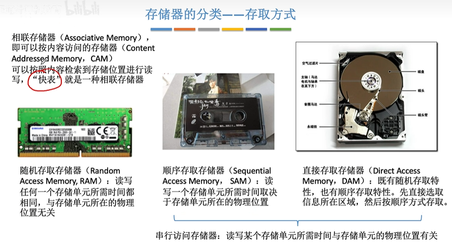

##### 大小端 


##### 边界对齐

字：word

字节：byte


边界对齐 ：性能好，但是浪费空间

边界不对齐：性能差，节约空间

#### 性能参数


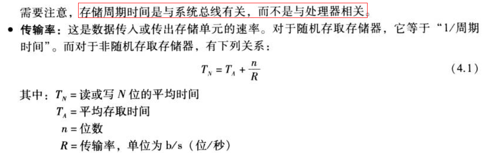

 

#### 层次结构


- 存取时间越短，平均每位的花费就越大。
- 存储容量越大，平均每位的花费就越小。
- 存储容量越大，存取时间就越长。

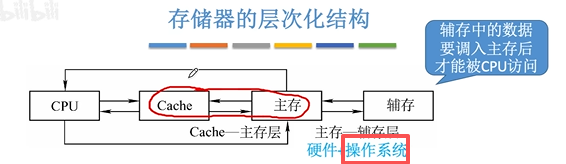


#### 分类

##### 是否只读

##### 是否易失

##### DRAM（主存（内存））和SRAM（Cache）的区别

SRAM


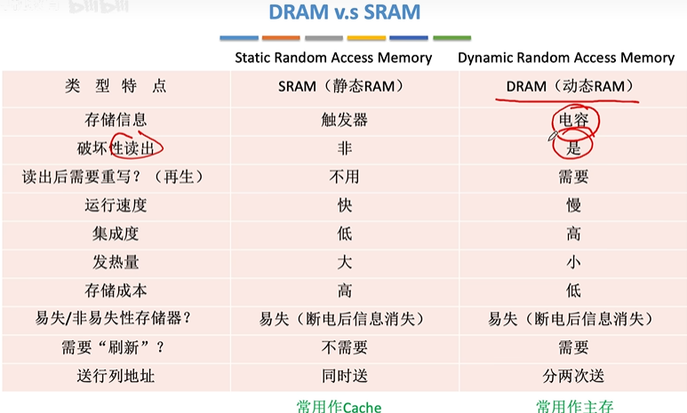


#### Tips


### Cache/SRAM

#### 为什么要Cache?

- 主存读取速度比不上CPU计算速度

- 局部性原理

  

- 性能提升案例：

  


#### 运行逻辑 

- 将主存数据分块，主存和Cache之间以块为单位进行数据交换
- Cache和主存有地址映射
- cache溢出替换算法


#### 地址映射


 ==Cache中使用Tag和有效位来标记对应的主存的块==


相比全相联映射，直接映射可以省略一些Tag（橙色）


组相联映射是前面两种方法的结合

全相联映射相当于Cache的所有行都在一个组中

直接映射无需替换算法，直接替换接可以了

#### 替换算法

目的：提高Cache命中率

##### 随机（RAND） 

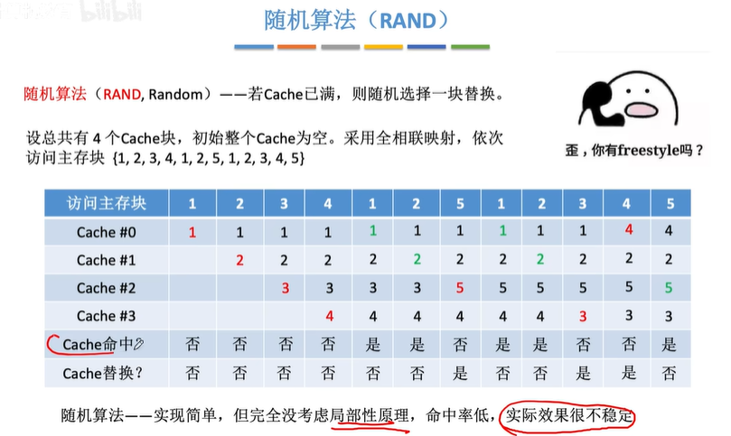

##### 先进先出（FIFO）


抖动现象

##### 近期最少使用（LRU）


多需要一个计数器

##### 最近不经常使用（LFU）


[（中文配音）缓存替换策略：当您的 CPU 耗尽缓存内存时会发生什么？_哔哩哔哩_bilibili](https://www.bilibili.com/video/BV1P3zpYGEJd?spm_id_from=333.788.player.switch&vd_source=ea5f077dc692dc32725d05ff92da61a5)


#### 写策略


##### 写回法


脏位

##### 全写法


有写缓冲

##### 写分配法


##### 非写分配法


##### 多级cache的写策略常见搭配


### 主存储器/SDRAM/内存

DRAM(老)/SDRAM

#### 结构

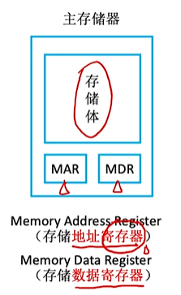
MAR: 存地址
MDR：存数据


为了减少译码器输出信号数，实际上使用的是二维的（行列）地址译码器

#### DRAM的充电/刷新

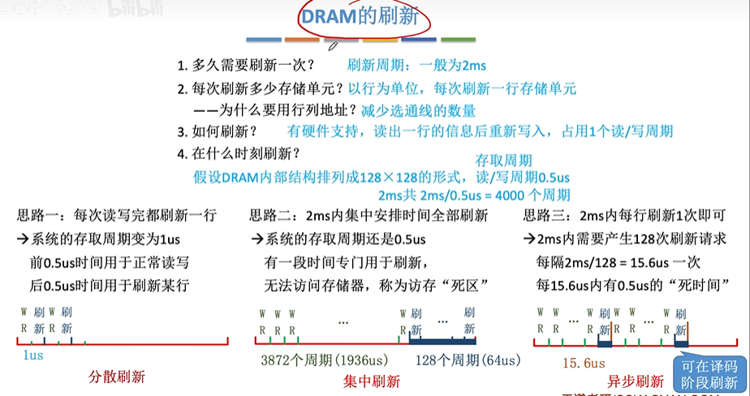

#### 地址线服用技术

#### 双端口RAM技术


#### 多体并行存储器

注意存取之后有恢复时间需要等待


### 硬盘/ROM/SSD/FLASH

#### 分类


> [!TIP]
>
> 实际上主板上的BIOS（ROM）也属于主存的一部分，二值常常同意编址


#### SSD

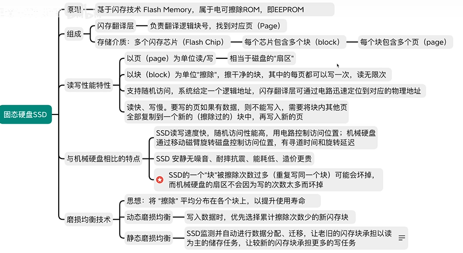


Block(擦除单位)->Page(读写单位)


## 软件

### 软件语言区别与分类

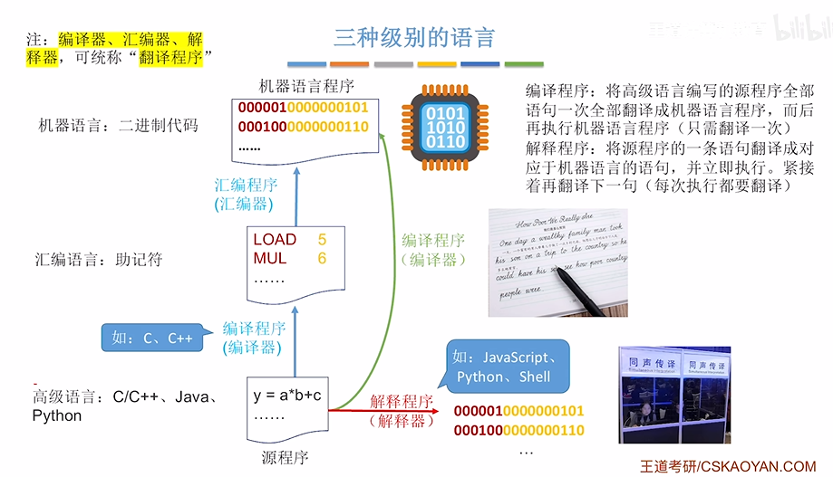

> 汇编指令和机器码是一一对应的
>
> HDL语言属于硬件语言
>
> 软硬件可以实现相同功能，只是过程不同

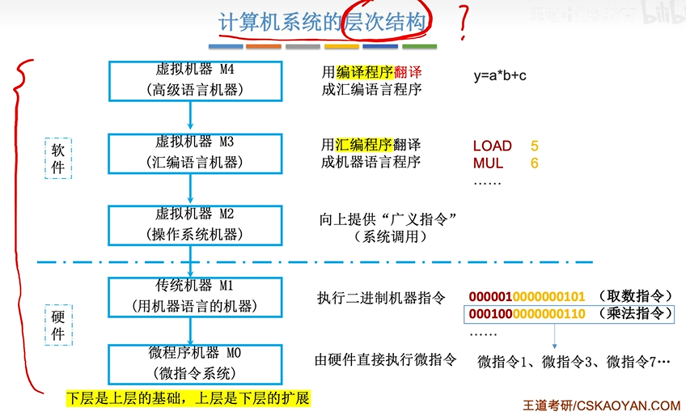

> 微指令：就是一个指令流程中的每一个小步骤，比如PC+1

### 系统软件/应用软件

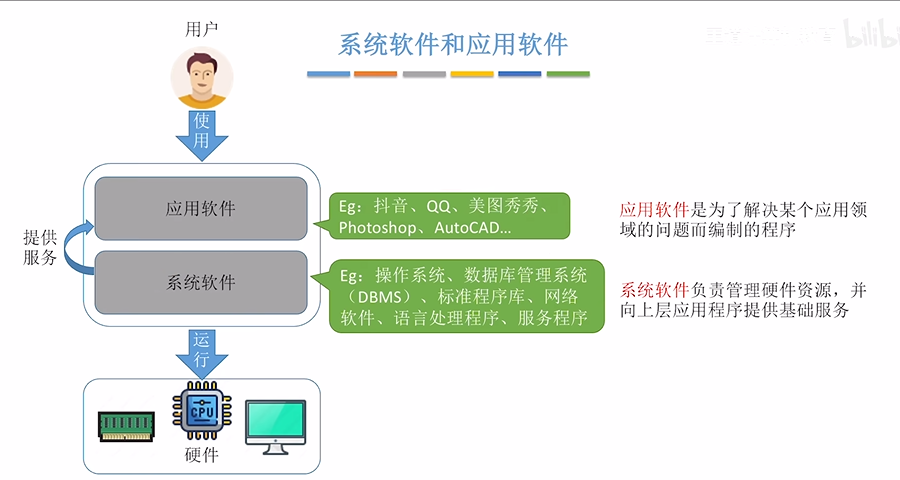

### 指令集体系结构（ISA）


## 专业术语

PC 程序计数器(指令地址)

IR 指令寄存器（指令内容（数据））

MAR 存储器地址存储器（地址）

MBR 存储器缓冲寄存器（数据）

MDR 存储器数据存储器（数据）

CPI 每条指令的平均周期数

MIPS 每秒百万条指令

MFLOPS 每秒百万条浮点操作

ISR 中断服务程序

ISA 指令集体系结构

SP (Stack Pointer) 堆栈指针

## 参考

- 计算机组成与体系结构性能设计(美)William Stallings 


# 综述


# CPU


## CPU类型


**复杂指令集(CISC)**: x86, Zen

**精简指令集(RISC)**：ARM，MIPS, PowerPC

- 针对性更强，可以根据不同的需求进行专门的优化，能效更高
- 调用速度快
- 服务器上往往使用RISC
- 服务器CPU往往应用了最先进的工艺和技术，并且配备了一二三级缓存，运行能力更强，服务器CPU很早就用上了3级缓存，普通cpu是近几年才用上了缓存技术


与 CISC 相比，RISC 方法有几个优点：

1. **简化硬件实现**：它简化了处理器的硬件实现，因为需要解码和执行的指令更少。这可加快执行时间，降低功耗。
2. **更高的指令级并行性**：RISC 处理器通常具有更高的指令级并行性，可同时执行多条指令，从而进一步提高性能。
3. **简易性**：RISC 指令集的简易性使得开发可为处理器生成高效代码的编译器和其他软件工具变得更加容易。


### ARM

是一个**32位精简指令集（RISC）**处理器架构

优势：**价格低；能耗低**

由于**节能**的特点，ARM处理器非常适用于行动通讯领域，符合其主要设计目标为低耗电的特性。

其广泛地使用在许多[嵌入式系统设计](https://zhida.zhihu.com/search?content_id=106234547&content_type=Article&match_order=1&q=嵌入式系统设计&zhida_source=entity)。

### x86/Atom

`x86`是英代尔Intel首先开发制造的一种[微处理器体系结构](https://zhida.zhihu.com/search?content_id=106234547&content_type=Article&match_order=1&q=微处理器体系结构&zhida_source=entity)的泛称。[x86架构](https://zhida.zhihu.com/search?content_id=106234547&content_type=Article&match_order=1&q=x86架构&zhida_source=entity)是重要地**可变指令长度**的CISC（复杂指令集电脑，Complex Instruction Set Computer）。

Intel `Atom`（中文：凌动，开发代号：Silverthorne）是Intel的一个[超低电压处理器](https://zhida.zhihu.com/search?content_id=106234547&content_type=Article&match_order=1&q=超低电压处理器&zhida_source=entity)系列

### MIPS

一种[RISC处理器](https://zhida.zhihu.com/search?content_id=106234547&content_type=Article&match_order=1&q=RISC处理器&zhida_source=entity)（精简指令集）


### RISC-V

*RISC-V（读作 risk-five）架构是一种开源指令集架构（ISA），近年来因其灵活性、模块化和可扩展性而备受关注*

模块化是指将 ISA 划分为不同的独立组件，这些组件可以通过各种方式组合在一起，从而创建一个定制的处理器。另一方面，可扩展性是指在不破坏现有功能的情况下，向 ISA 添加新指令、功能或扩展的能力。

#### 历史


专有 ISA (例如 ARM) 受到特定公司的严格控制，限制了对其架构的访问，并征收许可费。这种缺乏开放性的做法阻碍了创新，打击了竞争，使小公司或学术机构在试验和开发定制处理器方面面临挑战。这导致了 RISC-V 的兴起。

在 RISC-V 之前，市场上有几种 RISC（精简指令集计算机）处理器。著名的例子包括 MIPS、SPARC 和 PowerPC。这些架构被认为是高效的，也有它们的应用，但它们往往需要支付许可费用，而且对其内部工作原理的访问也受到限制。

RISC-V 的起源可以追溯到 加利福尼亚大学伯克利分校，最初是作为 2010 年的一个研究项目开发的。该项目旨在创建一种全新的开源 ISA，以解决现有专有 ISA 的局限性，并为未来的处理器设计奠定基础。RISC-V 项目由计算机科学家 Krste Asanović、Yunsup Lee 和 Andrew Waterman 领导，他们受到开源软件成功的启发，希望为硬件领域带来类似的好处。

第一版 RISC-V ISA 于 2011 年发布，被称为 "RV32I " 基本整数指令集。最初的版本遵循精简指令集计算（RISC）原则，注重简洁和高效。多年来，RISC-V ISA 经历了多次迭代，增加了新的扩展和功能，以增强其功能，满足更广泛的应用需求。

2015 年，RISC-V 基金会成立，旨在促进 RISC-V ISA 的采用和标准化。该基金会汇集了行业领导者、学术机构和个人贡献者，共同合作开发和推广 RISC-V 技术。自成立以来，RISC-V 基金会已发展了 200 多个成员组织，RISC-V ISA 已被众多公司采用，应用于从微控制器和嵌入式系统到高性能计算和数据中心处理器等各种领域。


## 核心和线程

> CPU可以想象成是一个银行，CPU核心就相当于柜员，而线程数就相当于开通了几个窗口，柜员和窗口越多，那么同时办理的业务就越多，速度也就越快。
>
> 通常情况下，一个柜员对应的是一个窗口，通过超线程技术相当于一个柜员管理着两个窗口，使用左右手同时办理两个窗口的业务，大大提高了核心的使用效率，增加了办理业务的速度。

```bash
#查看物理 cpu 数：
cat /proc/cpuinfo| grep "physical id"| sort| uniq| wc -l

#查看每个物理 cpu 中 核心数(core 数)：
cat /proc/cpuinfo | grep "cpu cores" | uniq

#查看总的逻辑 cpu 数（processor 数）：
cat /proc/cpuinfo| grep "processor"| wc -l

#查看 cpu 型号：
cat /proc/cpuinfo | grep name | cut -f2 -d: | uniq -c

#判断 cpu 是否 64 位：
#检查 cpuinfo 中的 flags 区段，看是否有 lm （long mode） 标识

```

>2
>
>48
>
>96
>
>Intel(R) Xeon(R) Platinum 8255C CPU @ 2.50GHz
>
>Thread(s) per core:    1

`lscpu `命令可以同时看到上述信息。比如：

> CPU(s):                24
> On-line CPU(s) list:   0-23
> Thread(s) per core:    2
> Core(s) per socket:    6
> Socket(s):             2

### 核心（core)

一开始，每个物理 cpu 上只有一个核心（a single core），对操作系统而言，也就是同一时刻只能运行一个进程/线程。

总的逻辑 cpu 数 = 物理 cpu 数 * 每颗物理 cpu 的核心数 * 每个核心的超线程数

#### 同时多线程技术（simultaneous multithreading）

SMT


#### 超线程技术(hyper–threading/HT)

可以认为HT是 SMT 的一种具体技术实现

一般一个核心对应了一个线程，而intel开发出了**超线程技术**，1个核心能够做到2个线程计算，而6个核心则能够做到12个线程，超线程技术的好处就是无需增加物理核心就可以明显的进步CPU多线程功能，毕竟增加物理核心是需要占据非常大的核心面积，成本也随之增加


### 多核CPU


# GPU

## GPU主要参数


## 结构


### CUDA Context（上下文）

context类似于CPU上的进程上下，表示了，管理了由Driver层分配的资源的生命周期。多线程分配调用的GPU资源同属一个context下，通常与CPU的一个进程对应

与CPU进程的管理类似，每个Context有自己的地址空间，之间是隔离的，在一个Context中有效的东西（例如某个指针，指向一段显存；或者某个纹理对象），只能在这一个Context中使用。但一个CUDA Context中的任何一个kernel，挂掉后，则整个Context中的所有东西都会失效（例如所有的缓冲区，kernel对象，纹理对象，stream等等）。在同一个GPU上，可能同时存在1个或者多个CUDA Context的。


>对于context的创建与管理，CUDA runtime和CUDA driver API的方式稍有不同：
>
>CUDA runtime软件库通过***延迟初始化\***（deferred initialization）来创建context，也就是lazy initialization。具体意思是在调用每一个CUDART库函数时，它会检查当前是否有context存在，假如需要context，那么才自动创建。也就是说需要创建上面这些对象的时候就会创建context。runtime也可以通过调用cudaFree(0)来强制显式地初始化context。cuda runtime将context和device的概念合并了，即在一个gpu上操作可看成在一个context下。
>
>而在驱动这一层的Driver API里，创建的context是针对一个线程的，即一个device，对应多个context，每个context对应多个线程，线程之间的context可以转移。在driver API中，每一个cpu线程必须要创建 context，或者从其他cpu线程转移context。如果没有创建context，直接调用 driver api创建上面那些对象，就会报错。

>CUDA runtime软件库和driver API的区别：
>
>我们平常安装使用的CUDA，即runtime软件库，是构建在Driver API上的另一层封装，所有的API都是以4个字母cuda开头。在编译时其cu代码可以和C/C++代码混合编译。而CUDA还有另外一个功能更强大，当然使用起来也更麻烦的API接口Driver API。Driver API将完整的CUDA功能展现给用户，功能更加强大，但是用起来较为繁琐，所有的Driver API，则都是2个字母cu开头。

### CUDA Stream

CUDA Stream是指一堆异步的CUDA操作，他们按照host代码调用的顺序执行在device上。

当我们使用CUDA异步函数与多流（Multi Stream）时，多线程间既可以实现并行进行数据传输与计算，如下图所示。不过需要注意的是， CUDA runtime API默认的default stream是同步串行的，且一个进程内的所有线程都在default stream下，需要显式声明default之外的Stream才可以实现多流并发。


### Hyper-Queue

#### 多流

利用CUDA异步函数以及多流的声明，既可以实现在多个线程的计算与数据传输的并行，增加GPU利用率。

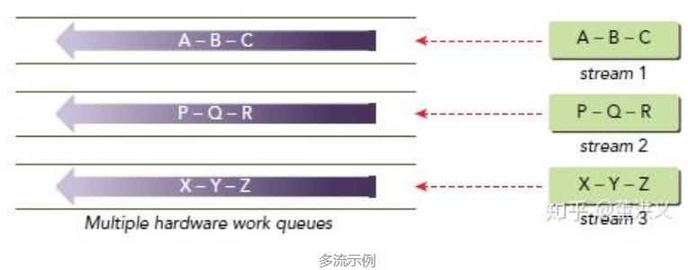

#### MPS

多进程时使用MPS（Multi Process Service）。我们知道，每个进程默认对应一个context，而GPU在同一时刻只会运行一个context，因此进程间实际是无法并发的。

MPS是一个二进制兼容的客户端-服务器运行时实现的CUDA API，允许多个CPU进程共享同一GPU context，不同进程的kernel和memcpy操作在同一GPU上并发执行，以实现最大化 GPU利用率、减少GPU上下文的切换时间与存储空间。在CUDA 7.0后，我们只需要执行如下指令就可以打开MPS服务：

```text
nvidia-cuda-mps-control -d
```


### 显卡硬件架构：SM、SP、Warp


#### `SP(Streaming Processor)/CUDA core`

流处理器， 是GPU最基本的处理单元，。相当于一个thread

#### `SM(Streaming MultiProcessor)`

一个`SM`(也叫GPU大核)由多个`SP`加上其他的一些资源组成，**每个SM根据GPU架构不同有不同数量的CUDA core**，Pascal架构中一个SM有128个CUDA core。
SM还包括特殊运算单元(SFU)，共享内存(shared memory)，寄存器文件(Register File)和==调度器==(Warp Scheduler)等。==register和shared memory是稀缺资源==，这些有限的资源就使每个SM中active warps有非常严格的限制，也就限制了并行能力。

当一个kernel启动后，thread会被分配到很多SM中执行。大量的thread可能会被分配到不同的SM，但是同一个block中的thread必然在同一个SM中并行执行。


#### `warp`

一个SP可以执行一个thread，但是==实际上并不是所有的thread能够在同一时刻执行==。Nvidia把32个threads组成一个warp，**warp是调度和运行的基本单元**。

==warp中所有threads并行的执行相同的指令==。warp由SM的硬件warp scheduler负责调度，==一个SM同一个时刻可以执行多个warp==，这取决于warp scheduler的数量。==目前每个warp包含32个threads==（Nvidia保留修改数量的权利）。


尽管warp中的线程从同一程序地址，但可能具有不同的行为，比如分支结构，因为==GPU规定warp中所有线程在同一周期执行相同的指令==，warp发散会导致性能下降。**一个SM同时并发的warp是有限的**，因为资源限制，SM要为每个线程块分配共享内存，而也要为每个线程束中的线程分配独立的寄存器，所以SM的配置会影响其所支持的线程块和warp并发数量。**由于warp控制的thread的大小一般为32，所以block所含的thread的大小一般要设置为32的倍数**

每个block的warp数量:


一个warp中的线程必然在同一个block中，如果block所含线程数目不是warp大小的整数倍，那么多出的那些thread所在的warp中，会剩余一些inactive的thread


### 参考

- [详解CUDA的Context、Stream、Warp、SM、SP、Kernel、Block、Grid - 知乎](https://zhuanlan.zhihu.com/p/266633373)


## 相关厂商和产品

### 英伟达

#### 常见计算卡(AI生成)

##### **计算卡对比**

对比维度：

1. **架构先进性**: Hopper > Ada ≈ Ampere > Volta。
2. **显存带宽**: HBM3（H100） > HBM2e（A100） > GDDR6X（4090） > HBM2（V100）。
3. **稀疏计算支持**: H100/A100/4090显著优于旧架构。
4. **多卡扩展**: H100/A100支持NVLink，4090/3090仅支持PCIe。

综合来看：H100 > A100 ≈ A800 > RTX 4090 > A40 > V100 > RTX 3090 > A30


实际场景中，H100/A100更适合企业级训练，4090/3090适合个人或小规模任务，A40/A30侧重推理和边缘计算


##### H100 (Hopper架构)

- **架构**: Hopper (2022)
- **制程**: 4nm
- **显存**: 80GB HBM3 | 带宽 3TB/s
- **计算性能**: FP32 60 TFLOPS | FP16/TF32 2,000 TFLOPS（稀疏）
- **核心数**: 18,432 CUDA + 576 Tensor Core（第四代）
- **特性**: 支持NVLink 4.0（900GB/s）、PCIe 5.0、Transformer引擎优化
- **功耗**: 700W
- **定位**: 超大规模模型训练、HPC
- **优势**: Hopper架构 + **第四代Tensor Core** + **Transformer引擎**，FP16稀疏算力高达 **2,000 TFLOPS**，HBM3显存带宽 **3TB/s**，支持NVLink 4.0，专为超大规模模型优化。
- **场景**: 大规模训练（如GPT-4/LLaMA）、HPC。


##### **A100 (Ampere架构)**

- **架构**: Ampere (2020)
- **显存**: 40GB/80GB HBM2e | 带宽 1.6TB/s
- **计算性能**: FP32 19.5 TFLOPS | FP16/TF32 312 TFLOPS（稀疏）
- **核心数**: 6,912 CUDA + 432 Tensor Core（第三代）
- **特性**: NVLink 3.0（600GB/s）、多实例GPU（MIG）
- **功耗**: 400W
- **定位**: 主流AI训练、科学计算


##### **A800 (Ampere架构)**

- **简介**: A100的出口限制版，NVLink带宽降至400GB/s，其他参数与A100一致。
- **定位**: 替代A100的中国市场专用型号。


##### **A40 (Ampere架构)**

- **架构**: Ampere (2021)
- **显存**: 48GB GDDR6 | 带宽 696GB/s
- **计算性能**: FP32 37.4 TFLOPS | FP16 149.8 TFLOPS
- **核心数**: 10,752 CUDA + 336 Tensor Core
- **特性**: 支持虚拟化、RT Core（光追）、被动散热
- **功耗**: 300W
- **定位**: 混合渲染与AI推理（如云游戏、虚拟化）。
- **优势**: Ampere架构 + **第三代Tensor Core**，FP16算力 **149.8 TFLOPS**，48GB GDDR6显存，支持虚拟化和光追。
- **局限**: 显存带宽（696GB/s）低于HBM系列，适合混合渲染与推理。
- **场景**: 云推理、虚拟化、轻量级训练。


##### **V100 (Volta架构)**

- **架构**: Volta (2017)
- **显存**: 16GB/32GB HBM2 | 带宽 900GB/s
- **计算性能**: FP32 14 TFLOPS | FP16 112 TFLOPS（Tensor Core）
- **核心数**: 5,120 CUDA + 640 Tensor Core（第一代）
- **特性**: NVLink 2.0（300GB/s）
- **功耗**: 250W
- **定位**: 经典深度学习卡，仍广泛用于推理和小规模训练。
- **优势**: Volta架构 + **第一代Tensor Core**，FP16算力 **112 TFLOPS**，HBM2显存带宽 **900GB/s**。
- **局限**: 架构较老，稀疏计算支持有限。
- **场景**: 经典推理任务、兼容性要求高的场景。


##### **RTX 4090 (Ada Lovelace架构)**

- **架构**: Ada Lovelace (2022)
- **显存**: 24GB GDDR6X | 带宽 1TB/s
- **计算性能**: FP32 82.6 TFLOPS | FP16 1321 TFLOPS（稀疏）
- **核心数**: 16,384 CUDA + 512 Tensor Core（第四代）
- **功耗**: 450W
- **定位**: 单卡最强FP32性能，适合本地AI开发，但无ECC显存和NVLink。
- **优势**: Ada架构 + **第四代Tensor Core**，FP16算力 **1,321 TFLOPS**（稀疏），GDDR6X显存带宽 **1TB/s**，单卡FP32性能最强（82.6 TFLOPS）。
- **局限**: 无ECC显存、不支持NVLink，显存容量（24GB）和带宽弱于H100/A100。
- **场景**: 小规模训练、本地AI开发。


##### **A30 (Ampere架构)**

- **架构**: Ampere (2021)
- **显存**: 24GB HBM2 | 带宽 933GB/s
- **计算性能**: FP32 10.3 TFLOPS | FP16 82.5 TFLOPS
- **核心数**: 3,584 CUDA + 112 Tensor Core
- **特性**: 支持MIG、低功耗
- **功耗**: 165W
- **定位**: 高密度推理、边缘服务器。
- **优势**: Ampere架构 + **第三代Tensor Core**，FP16算力 **82.5 TFLOPS**，24GB HBM2显存，低功耗（165W）。
- **局限**: 算力较低，适合高密度推理。
- **场景**: 边缘服务器、批量推理。


#### 架构


#### 消费级显卡


### 国产


| Parameter                               | MTT S4000                                                    | NVIDIA H100                                    |
| :-------------------------------------- | :----------------------------------------------------------- | :--------------------------------------------- |
| **Architecture**                        | 3rd generation MUSA architecture                             | Hopper architecture                            |
| **Manufacturing Process**               | ==16nm== process technology                                  | 4N custom process from TSMC                    |
| **Memory Capacity**                     | 48GB GDDR6                                                   | 80GB HBM3 (SXM) / 94GB HBM3 (NVL)              |
| **Memory Bandwidth**                    | 768GB/s                                                      | 3.35TB/s (SXM) / 3.9TB/s (NVL)                 |
| **Compute Performance (FP32)**          | 25 TFLOPs                                                    | 67 TFLOPs                                      |
| **Tensor Core Performance (FP16/BF16)** | 1,979 TFLOPs                                                 | 1,979 TFLOPs (with sparsity)                   |
| **Interconnect Technology**             | MTLink technology (240GB/s data link from one card to another) | NVIDIA NVLink™ (900GB/s) / PCIe Gen5 (128GB/s) |

## CPU和GPU区别


相比CPU，GPU将更多的晶体管用于数值计算，而不是缓存和流控（Flow Control）。这源于两者不同的设计目标，CPU的设计目标是并行执行几十个线程，而GPU的目标是要并行执行几千个线程

GPU的Core数量要远远多余CPU，但是有得必有失，可以看到GPU的Cache和Control要远远少于CPU，这使得GPU的单Core的自由度要远远低于CPU，会受到诸多限制，而这个限制==最终会由程序员承担==。这些限制也使得GPU编程与CPU多线程编程有着根本区别。


这其中最根本的一个区别可以在上右图中看出，每一行有多个Core，却只有一个Control，这代表着==多个Core同一时刻只能执行同样的指令==，这种模式也称为 [SIMT](https://zhida.zhihu.com/search?content_id=179940325&content_type=Article&match_order=1&q=SIMT&zhida_source=entity) (Single Instruction Multiple Threads). 这与现代CPU的SIMD倒是有些相似，但却有根本差别


## 集显和独显


# ASIC


## TPU


## NPU


## DPU


## 华为昇腾（Ascend）


# FPGA


# 参考

- [AI芯片基础知识](https://mp.weixin.qq.com/s/z2C_3D_PapWpUnIMLN5M0Q)
- [英伟达GPU架构演进近十年，从费米到安培 - 知乎](https://zhuanlan.zhihu.com/p/413145211)
