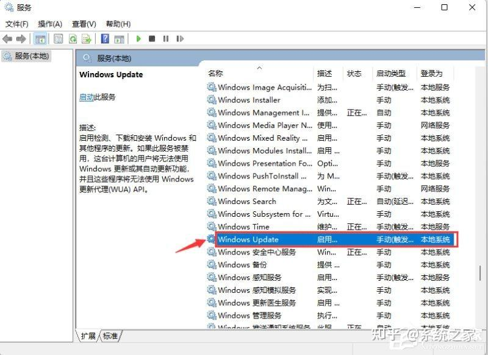
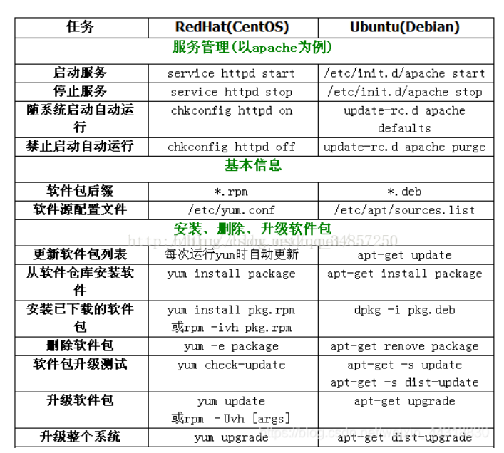
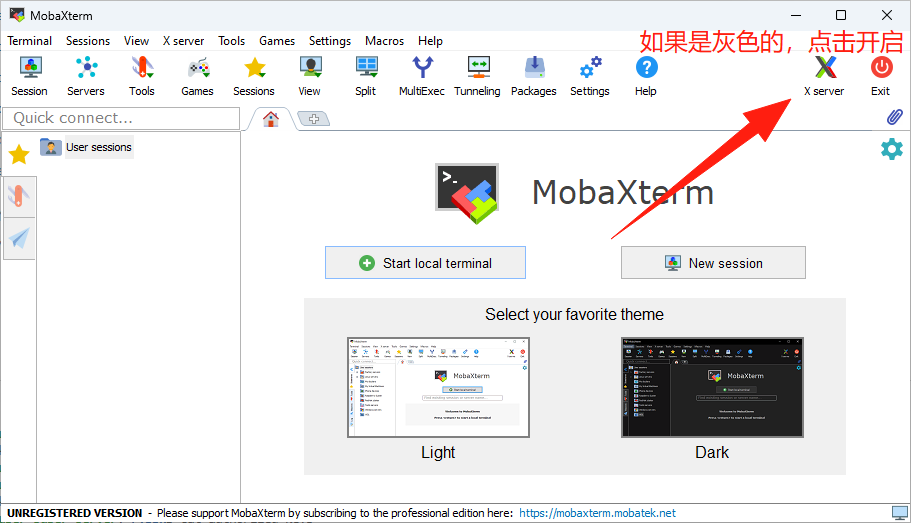
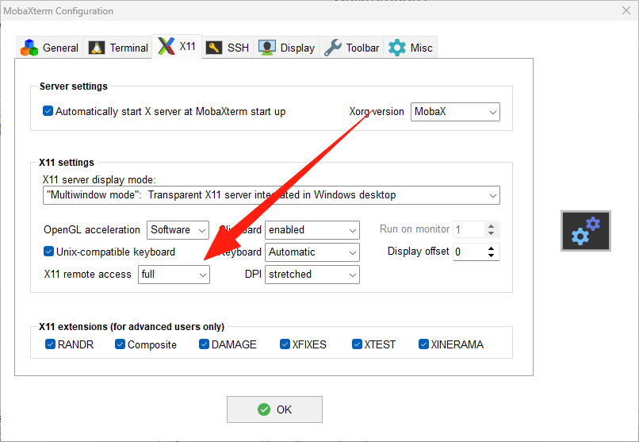
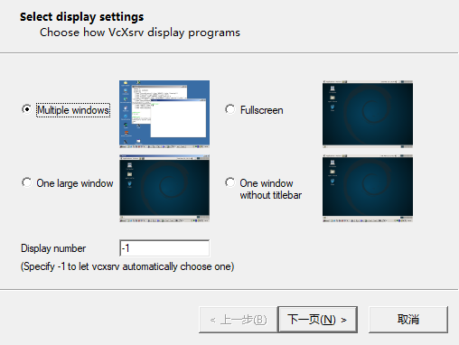
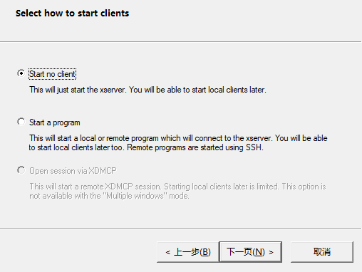
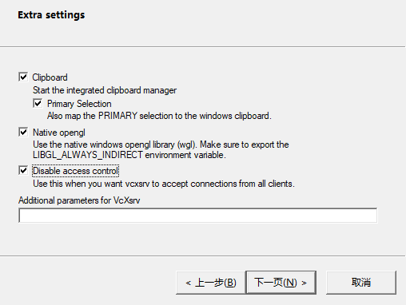
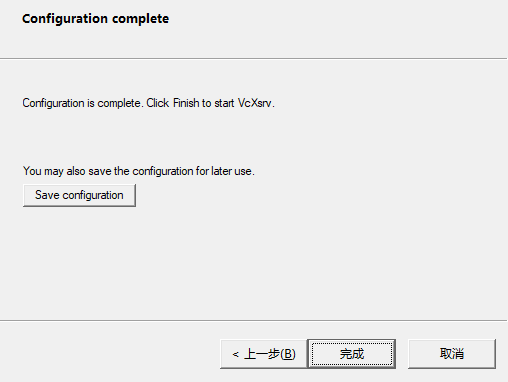

# OS

## Windows

### 系统重装

#### 下载ISO

[Windows 11 ISO Download – Official Direct Download Links - TechPP](https://techpp.com/2024/09/02/windows-11-iso-download/)

[原版软件 (itellyou.cn)](https://next.itellyou.cn/Original/)

#### 制作PE

[纯净无广告，又强又趁手的维护工具，FirPE使用和DIY指南_哔哩哔哩_bilibili](https://www.bilibili.com/video/BV1Ez421R7iY/?spm_id_from=333.337.search-card.all.click)

FirPE:默认,全新制作

#### 跳过联网

（Fn+）Shift+F10快捷键调出命令提示符窗口

输入：OOBE\BYPASSNRO

!!! note
    如果一开始就连了网线就没有这个步骤

#### windows激活&office激活

office安装直接去官网

power shell 下打开输入`irm win.zyqq.top | iex`,然后根据提示

或者`irm https://get.activated.win | iex`

#### 相关初始化设置

使用[dism++](https://github.com/Chuyu-Team/Dism-Multi-language/releases)

!!! note
    貌似很久没更新了


#### 系统备份及还原方法

[win11一键备份还原系统方法_系统之家一键重装系统官网 (163987.com)](https://chongzhuang.163987.com/faq/17160.html)


#### 桌面右键改回win10

[修改win11右键菜单、右键选项、还原win10右键菜单-CSDN博客](https://blog.csdn.net/dancehole/article/details/135852853)

win+r打开运行

输入cmd，按下ctrl+shift+enter以管理员身份运行

在命令行里输入`reg.exe add "HKCU\Software\Classes\CLSID\{86ca1aa0-34aa-4e8b-a509-50c905bae2a2}\InprocServer32" /f /ve`

重启（重启电脑或File Explorer）

重启后即可使用win10风格右键菜单

恢复方法：如果想回到win11风格，在命令行输入`reg.exe delete "HKCU\Software\Classes\CLSID\{86ca1aa0-34aa-4e8b-a509-50c905bae2a2}\InprocServer32" /va /f` .重启后恢复win11右键


#### 关闭自动更新

在运行中输入“services.msc”回车确定打开服务栏。


　　3、在服务中找到“windows update”，双击打开它。



　　4、然后将启动类型更改为“禁用”，再点击一下“停止”即可。


### win11配置windows ssh server

[Windows 上的 OpenSSH：安装、配置和服务器连接指南 - 系统极客](https://www.sysgeek.cn/openssh-windows/)


### 体验优化插件

#### [dism++](https://github.com/Chuyu-Team/Dism-Multi-language/releases)

!!! note
    貌似很久没有更新了

#### [PowerToy](https://github.com/microsoft/PowerToys?tab=readme-ov-file#-installation)

!!! note
    看了一下感觉作用不大

#### Geek

#### Everything

## Linux

### SHELL

命令解释器

查看SHELL类型 `echo $SHELL`

如果想知道自己系统安装了哪些shell : `cat /etc/shells`


#### 分类

参考：https://www.jianshu.com/p/a891af6f87e0

- zsh

  很多人的 mac 中会使用 zsh 而不是 bash，一大半是因为 oh-my-zsh 这个配置集，它兼容 bash，还有自动补全等好用的功能。

- sh 

  sh的全称是 Bourne shell，由 AT&T 公司的 Steve Bourne开发，为了纪念他，就用他的名字命名了。sh 是 UNIX 上的标准 shell，很多 UNIX 版本都配有 sh。sh 是第一个流行的 shell。

- csh

  sh 之后另一个广为流传的 shell 是由柏克莱大学的 Bill Joy 设计的，这个 shell 的语法==有点类似C语言==，所以才得名为 C shell ，简称为 csh。

- tcsh

  tcsh 是 csh 的增强版，加入了命令补全功能，提供了更加强大的语法支持。

- ash一个简单的==轻量级==的 Shell，占用资源少，适合运行于低内存环境，但是与下面讲到的 bash shell 完全兼容。

- bash

  bash由 GNU 组织开发，保持了对 sh shell 的兼容性，是各种 Linux 发行版默认配置的 shell。bash 兼容 sh 意味着，==针对 sh 编写的 shell 代码可以不加修改地在 bash 中运行==。尽管如此，bash 和 sh 还是有一些不同之处：一方面，bash 扩展了一些命令和参数；另一方面，bash 并不完全和 sh 兼容，它们有些行为并不一致，但在大多数企业运维的情况下区别不大，特殊场景可以使用 bash 代替 sh。

#### csh和bash的语法区别

[csh和bash的语法对比_bash csh-CSDN博客](https://blog.csdn.net/u013082364/article/details/117397037)


### centos和ubuntu的命令区别

[一图看懂centos和ubuntu命令区别-腾讯云开发者社区-腾讯云](https://cloud.tencent.com/developer/article/1779433)




### FileSystem

- /：根目录，所有其他目录和文件的起始点。

- /bin：存放基本二进制文件，如ls、cp、mv等命令。

- /sbin：存放系统二进制文件，通常是系统管理员使用的命令，如fdisk、ifconfig等。

- /etc：存放系统配置文件，如passwd、fstab、hosts等。

- /dev：包含设备文件，这些文件代表硬件设备，如/dev/sda表示第一个SATA硬盘。

- /proc：虚拟文件系统，提供关于系统硬件和运行进程的信息。

- /var：包含经常变化的文件，如日志文件/var/log和邮件系统/var/mail。

- /tmp：临时文件目录，用于存放临时文件，通常在系统重启时清空。

- /usr：用户相关的应用程序和文件。/usr下的子目录通常包括：

  /usr/bin：用户级别的程序。
  /usr/sbin：系统管理员程序。
  /usr/share：共享数据文件，如文档、图标等。
  /usr/local：本地安装的程序和文件。

- /lib：存放共享库文件，这些文件通常由/bin和/sbin中的程序使用。

- /opt：附加应用程序的安装目录。

- /boot：包含Linux内核和引导程序文件。

- /home：用户的主目录，每个用户的家目录都挂载在/home/username。

- /root：系统管理员（root用户）的家目录。

- /mnt和/media：挂载临时文件系统，如USB驱动器、CD-ROM等。

- /srv：服务相关的数据文件，如Web服务器的内容。

- /sys：与/proc类似，是一个虚拟文件系统，提供对系统硬件的访问。

- /lost+found：文件系统检查工具（如fsck）存放恢复的文件。


### 文件权限

7 代表 rwx（读、写、执行）
6 代表 rw-（读、写）
5 代表 r-x（读、执行）
4 代表 r--（读）

### 无sudo权限安装软件到个人目录下

两种方法：

- 自己 build
- 安装到local, 但是往往有很多其他依赖也需要安装到对应位置，麻烦


### .sh脚本

#### shebang开头特殊行

这行告诉系统应该使用哪个解释器来执行脚本

```bash
#!/bin/bash
```

 `#!` 是shebang的标识符，后面跟着解释器的路径

对于Python脚本`#!/usr/bin/env python3`.使用 `/usr/bin/env` 是为了确保系统能够在任何安装了Python的位置找到Python解释器，而不是硬编码路径。

!!! note
    类似的，也可以使用 `#!your/python/path`处理python脚本


### 环境变量

#### 设置环境变量

```bash
export var
var='值' 
#或export var='值'

#在.bashrc等文件中写了后，需要source再能生效
```

如果环境变量的值没有空格等特殊符号，可以不用单引号包含。

采用export设置的环境变量，在退出Shell后就会失效，下次登录时需要重新设置。如果希望环境变量永久生效，需要在登录脚本文件中配置。

```
变量名='值' 

export 变量名
或export 变量名='值'
```


#### 设置系统环境变量

##### 在/etc/profile文件中设置

用户登录时执行/etc/profile文件中设置系统的环境变量。但是，Linux不建议在/etc/profile文件中设置系统环境变量。

##### 在/etc/profile.d目录下设置

可以对不同的项目用.sh/.csh文件设置环境变量

这是Linux推荐的方法，不想要什么变量直接删除 /etc/profile.d下对应的 shell 脚本即可

##### 在/etc/bashrc文件中设置环境变量

该文件配置的环境变量将会影响全部用户使用的bash shell。但是，Linux也不建议在/etc/bashrc文件中设置系统环境变量。

#### 设置用户环境变量

- .bash_profile
  - 当用户登录时执行，每个用户都可以使用该文件来配置专属于自己的环境变量。
  - 但是现在没了？
- .bashrc
  - 当用户登录时以及每次打开新的Shell时该文件都将被读取，不推荐在里面配置用户专用的环境变量，因为**每开一个Shell，该文件都会被读取一次**，效率肯定受影响。
  - 但是现在都这么做0.0

#### PATH

- ==可执行程序的搜索目录==，可执行程序包括Linux系统命令和用户的应用程序。如果可执行程序的目录不在PATH指定的目录中，执行时需要指定目录。
- PATH环境变量存放的是目录列表，目录之间==用冒号`:`分隔==
- 最后的圆点.表示当前目录(加入了当前补录到PATH),如果PATH变量中没有包含圆点.，执行当前目录下的程序需要加./或使用绝对路径
- PATH缺省包含了Linux系统命令所在的目录（/usr/local/bin:/usr/bin:/usr/local/sbin:/usr/sbin），如果不包含这些目录，Linux的常用命令也无法执行（要输入绝对路径才能执行）
  - /usr/bin里面有很多可执行文件
- 在用户的.bashrc文件中，会对PATH进行扩充
  - 比如：`export PATH=$PATH:$HOME/bin`

#### LD_LIBRARY_PATH

C/C++语言**动态链接库文件搜索的目录**

与PATH的格式相同

#### 参考 

[linux环境变量 - a龙 - 博客园 (cnblogs.com)](https://www.cnblogs.com/wusl123/p/18009598)


### 安装方式的不同

#### ubuntu

1. 使用`apt`：

   更新软件包列表：`sudo apt update`

   安装软件包：`sudo apt install package_name`

   卸载软件包：`sudo apt remove package_name`

   查看安装过的包：`apt list --installed`

2. 使用`apt-get`（较旧的Ubuntu版本中常用）：

   更新软件包列表：`sudo apt-get update`

   安装软件包：`sudo apt-get install package_name`

   卸载软件包：`sudo apt-get remove package_name`

3. 使用`dpkg`（直接操作`.deb`包）：

   安装`.deb`文件：`sudo dpkg -i package_name.deb`

   卸载软件包：`sudo dpkg -r package_name`

4. 使用`pip`（Python包管理工具）：

   安装Python包：`sudo pip install package_name`

   卸载Python包：`sudo pip uninstall package_name`

5. 使用`make`和源代码（用于安装从源代码编译的软件）：

   通常需要先`./configure`，然后`make`，最后`sudo make install`


### bsub

`bsub` 是一个在许多 Unix-like 系统中用于提交作业到批处理系统（如 LSF、PBS 或 Slurm）的命令。它允许用户在后台运行程序，而不会占用终端。

```bash
bsub < job_script.sh #提交任务
bsub -n 4 < job_script.sh	#指定使用的节点数
bsub -R "span[hosts=1]" < job_script.sh #指定使用的CPU核心数

bkill <job_id> #终止

bjobs 	#查看作业状态
bjobs -l	#详细信息
bqueues #查看队列状态
bhosts	#查看系统资源

bsub -W 01:00 < job_script.sh #设置作业的运行时间限制

```


### 虚拟内存

之前说的程序的堆栈都是和虚拟内存交互的，具体的虚拟内存又依赖于操作系统


#### /proc

/proc 是内核在运行时导出的==虚拟文件系统==（procfs），用于呈现内核和进程的实时状态信息。它==不是磁盘上的真实文件==，而是内存中由内核动态生成的视图，常用于系统监控与调试。


#### 参考

[深入理解虚拟内存和malloc原理 | 图解内存分配全过程 | C++ 编程指南](https://chengxumiaodaren.com/docs/c-basic/c-malloc/)


### 后台程序返回前台

```
jobs –l 查看后台运行的进程
fg %n 让后台运行的进程n到前台来
#command  &让进程在后台运行
#bg %n 让进程n到后台去
```


### core文件

在一个程序崩溃时，它一般会在指定目录下生成一个core文件。core文件仅仅是一个内存映象(同时加上调试信息)，主要是用来调试的。

- 阻止系统生成core文件:`ulimit -c 0`

!!! note
    当您收到 `ulimit: command not found`错误时，这是因为 `ulimit`是 **bash 和 sh 等 shell 的内置命令**，而您可能正在使用 **csh 或 tcsh** 等不同的 shell。在 csh 中，对应的命令是 `limit`。
    
    ```bash
    # 查看所有资源限制
    limit
    
    # 查看特定资源限制（如 core 文件大小）
    limit coredumpsize
    # 设置 core 文件大小为 0
    limit coredumpsize 0
    
    ```
    
    [!CAUTION]
    
    永久生效要写到`.cshrc`

#### ref

- [linux下core文件详解 - 知乎](https://zhuanlan.zhihu.com/p/144648339)

## WSL

### cmd

```bash
wsl -l -v
wsl --shutdown	#关闭
wsl --list --verbose # 查看已安装的发行版、WSL 版本信息和当前状态
wsl --set-default <DistroName> # 重新指定默认发行版
wsl --export Ubuntu-22.04 e:\Ubuntu-22.04.tar#导出
wsl --unregister Ubuntu-22.04 #注销并卸载
wsl --import Ubuntu-22.04 E:\ubuntu2204 E:\Ubuntu-22.04.tar#导入
wsl --set-default <DistroName> # 重新指定默认发行版
```


### 环境配置

- windows 设置打开： **适用于 Linux 的 Windows 子系统** 和 **虚拟机平台** 


- Linux 内核更新包：https://wslstorestorage.blob.core.windows.net/wslblob/wsl_update_x64.msi


-   ```bash
  wsl --list --verbose # 查看已安装的发行版、WSL 版本信息和当前状态
  wsl --set-default <DistroName> # 重新指定默认发行版
  ```


[Windows 11：WSL 2 安装和管理指南，3 种方法任你选 - 系统极客 (sysgeek.cn)](https://www.sysgeek.cn/install-wsl-2-windows/)

[Win11 安装 Docker Desktop 和 WSL2 并进行安装位置迁移_windows 11 wsl 修改安装位置-CSDN 博客](https://blog.csdn.net/cn_ljr/article/details/132047516)

### 常见问题

#### VmmemWSL 占用 CPU 或内存资源过高

[Vmmem 进程(WSL)占用 CPU 或内存资源过高的解决办法-CSDN 博客](https://blog.csdn.net/Power_Blogger/article/details/128158694)

#### 代理问题

[WSL2 如何解决 clash 代理问题 - VariantConst](https://blog.variantconst.com/posts/wsl2-clash/)


## 远程

### 公网远程

UU远程/向日葵/ToDesk

!!! note
    ToDesk越来越垃圾了——2025/12/12


### VNC

#### 常用软件

- TigerVNC(开源免费)
- RealVNC (个人免费)


#### 设置

[windows环境安装VNC及远程连接linux(centos7) - 银河星光 - 博客园 (cnblogs.com)](https://www.cnblogs.com/dkblogs/p/15955305.html)


#### vnc和ssh的区别

主要**区别：VNC**服务器**和SSH**服务器有一些显著的区别。 首先，VN**C**服务器提供图形界面的远程访问和控制，可以让用户直观地操作计算机。 而**SSH**服务器主要用于远程命令行访问和文件传输，对于不需要图形界面的操作更为适用。 其次，**VN**C服务器在传输图形界面时消耗较多的网络带宽，因为它需要传输图像数据。 相比之下，**SSH**服务器的传输开销较小，因为它主要传输文本和命令。 此外，**SSH**服务器采用了加密和身份验证机制，提供了更高的安全性，而**VN**C服务器的安全性相对较弱，需要通过额外的措施来增强其安全性。 使用场景：**VN**C服务器适合需要通过==图形界面==进行远程操作的场景，例如远程协助、远程教学和讲座、远程演示等


### ssh+设置DISPLAY可视化

#### mobaxterm启用X11 server

MobaXterm上






MobaXterm的Xserver是在win上的，而服务器的ip和win不一样，所以不能通过直接设置`DISPLAY=0.0`或者`DISPLAY=localhost:0.0`来指定Xserver

```bash
#bashrc
export windows_host=`ipconfig.exe | grep -n4 WSL  | tail -n 1 | awk -F":" '{ print $2 }' | sed 's/^[ \r\n\t]*//;s/[ \r\n\t]*$//'`
export DISPLAY=$windows_host:0
#也可以直接export DISPLAY=${window_ip}:0
#比如export DISPALY=192.168.1.28:0.0 # 192.168.1.28为windows当前ip，如果windows系统重装需要重新设置

#还看到以下这个，没验证过
#export DISPLAY=$(awk '/nameserver / {print $2; exit}' /etc/resolv.conf 2>/dev/null):0 # in WSL 2
#export LIBGL_ALWAYS_INDIRECT=1
```

#### xlaunch(VcXsrv/xming)

VcXsrv是实际的X11服务器，而Xlaunch是一个用于配置和启动VcXsrv的工具。









然后登陆就行了（登陆以后再打开也可以）。不需要在 `.bashrc`中定义 `DISPLAY`

详细参考：

[Windows通过X11转发显示远程Linux上的图形界面-CSDN博客](https://blog.csdn.net/chentuo2000/article/details/144892375)

#### Pycharm设置DISPLAY


### 文件传输与同步

#### 将本地文件复制到另一台服务器

scp/sftp/ftp

[Linux sftp 命令 | 菜鸟教程](https://www.runoob.com/linux/linux-comm-sftp.html)

[【教程】通过SFTP将本地文件复制到另一台服务器](https://ismc.yuque.com/kldg3t/nrg97r/dnmutswe6lnfuqor)


#### 主机和服务器文件同步

[使用rsync命令同步两台服务器之间的文件_rsync -avpz-CSDN博客](https://blog.csdn.net/yxyc666/article/details/142331896)


### 通过ssh让远程主机使用本地主机的网络代理

#### 使用场景

为了使内网中的服务器访问到github,我需要通过ssh的远程端口转发，让服务器使用本地的网络代理

#### 使用命令

##### 主机登陆

 `ssh -R remote_proxy_port:localhost:local__proxy_port user_name@remote_ip -p remote_ssh_port`
我的remote_proxy_port和local__proxy_port均设置为`7897`

`-p`指定端口，一般 `remote_ssh_port`为默认值 22

!!! note
    貌似`clash`是7890， `clash verge`是 7897

##### 服务器配置

比如放到`.bashrc`

```bash
export http_proxy="http://127.0.0.1:7897"
export https_proxy="http://127.0.0.1:7897"
export no_proxy="localhost,127.0.0.1,.local"
```


#### ref

- [通过ssh让远程主机使用本地主机的网络代理 | 彩虹岛](https://mill413.github.io/posts/通过ssh让远程主机使用本地主机的网络代理/)
