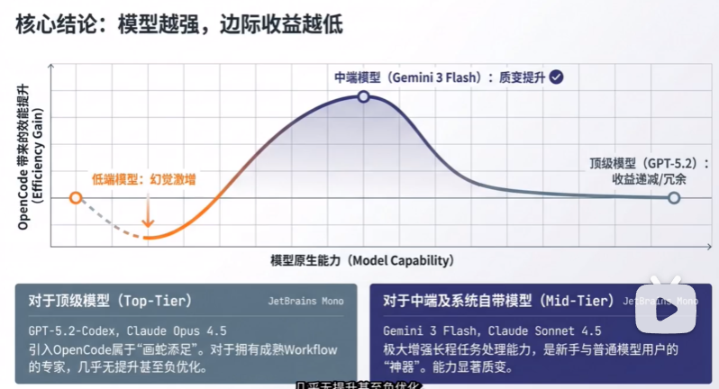
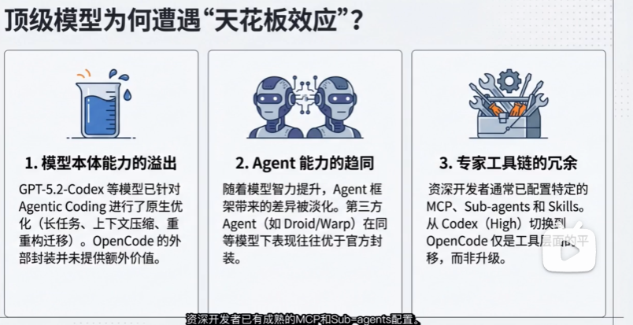
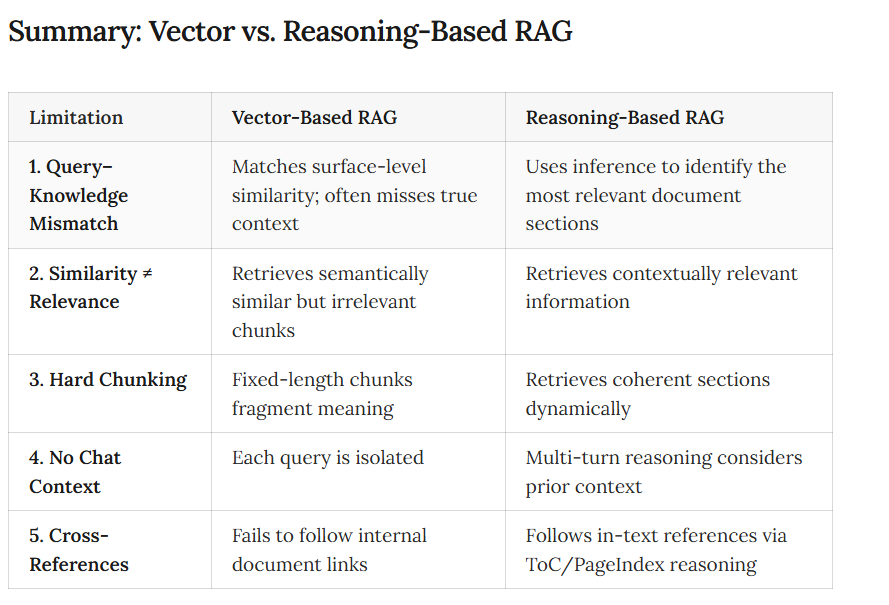
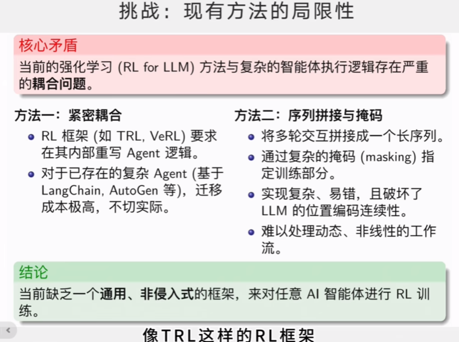
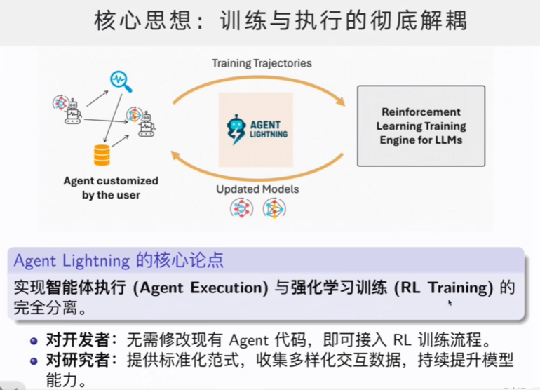
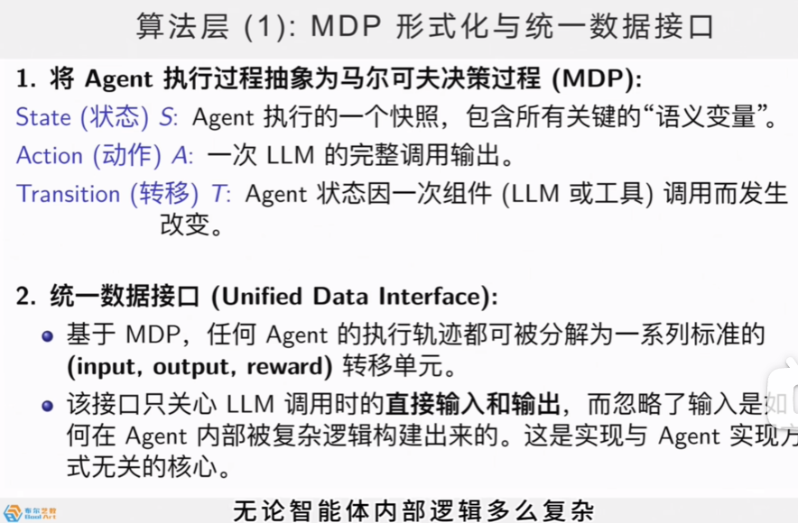
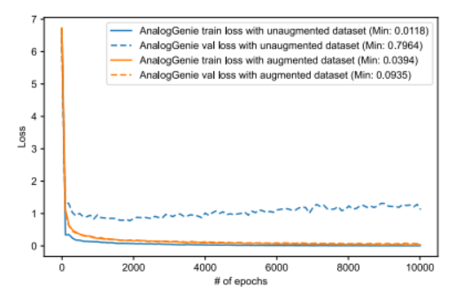
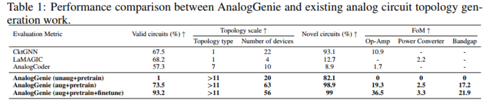
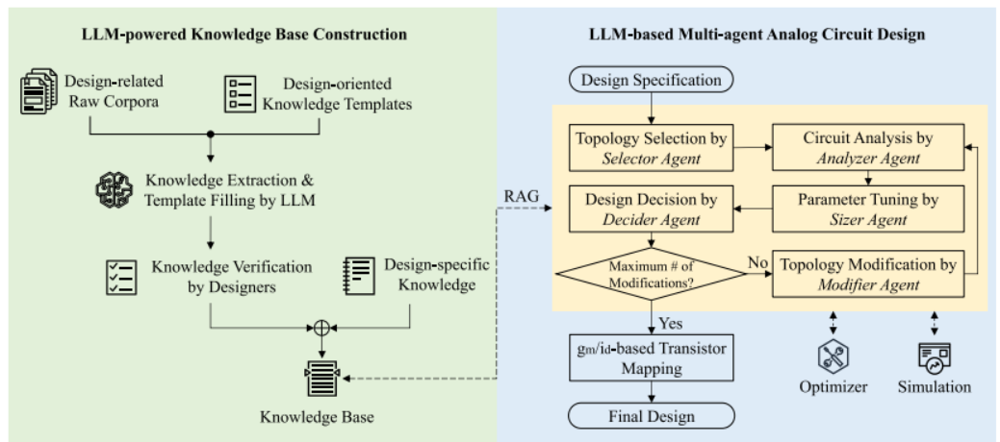

# PR-LCM

## Tools

### Agent

#### Codex

- rust
- [OpenSource](https://github.com/openai/codex)
- 诟病推理相对慢 GPT 5.2 26/01/19 

#### Claude code

- [OpenSource](https://github.com/anthropics/claude-code)
- python

#### Gemini CLI

- typscript

#### OpenCode

- [OpenSource](https://github.com/anomalyco/opencode?tab=readme-ov-file)
- [Docs | OpenCode](https://opencode.ai/docs)
- [Zen | OpenCode](https://opencode.ai/docs/zen) (for model id config)
- typescript
- OpenCode can be used with Claude, OpenAI, Google or even ==local models==. 
-  also available as a desktop application
- two built-in agents
- Out of the box ==LSP support==
- A focus on ==TUI==

##### Oh my open code

- plug in of OpenCode
- ==multi-agent== 并行
- 

 

###### 参考

- [OpenCode + oh-my-opencode 深度技术评估报告_哔哩哔哩_bilibili](https://www.bilibili.com/video/BV1jL69BVEFW/?spm_id_from=333.337.search-card.all.click&vd_source=ea5f077dc692dc32725d05ff92da61a5)

#### Aider

- [OpenSource](https://github.com/Aider-AI/aider)
- Aider works best with Claude 3.7 Sonnet, DeepSeek R1 & Chat V3, OpenAI o1, o3-mini & GPT-4o, but can connect to almost any LLM, including ==local models==.
- Use aider from within your favorite IDE or editor. 

#### DeepCode

- HKU

- python

- paper code gen

#### Kiro

- [closed]()

#### GitHub Copilot

### RAG

#### PageIndex

https://github.com/VectifyAI/PageIndex?tab=readme-ov-file

The first human-like document-analysis agent [platform](https://chat.pageindex.ai/) built for professional long documents. Can also be integrated via [MCP](https://pageindex.ai/mcp) or [API](https://docs.pageindex.ai/quickstart) (beta).

#### LEANN

https://github.com/yichuan-w/LEANN

### Prompt Engineering

#### Skill

总的来说还是提示词工程，只是一种通用接口，优化上下文。

### Plug-in

#### claude-mem

- claude code only

https://github.com/thedotmack/claude-mem

#### superpowers

- CC, Codex, OpenCode

[obra/superpowers: Claude Code superpowers: core skills library](https://github.com/obra/superpowers?tab=readme-ov-file)

#### ralph-claude-code

- claude code only

[frankbria/ralph-claude-code: Autonomous AI development loop for Claude Code with intelligent exit detection](https://github.com/frankbria/ralph-claude-code?tab=readme-ov-file)

#### Agent Lightning

- [Repo | Agent Lightning](https://github.com/microsoft/agent-lightning?tab=readme-ov-file)
- 微软亚洲研究院

 

##### ref

- [【零代码强化学习】 Agent Lightning 开源！ 让任何 AI 智能体瞬间变强_哔哩哔哩_bilibili](https://www.bilibili.com/video/BV1njJDzVEWG/?spm_id_from=333.337.search-card.all.click&vd_source=ea5f077dc692dc32725d05ff92da61a5)

#### compound-engineering-plugin

https://github.com/EveryInc/compound-engineering-plugin

### others

#### ChatDev

[OpenBMB/ChatDev: ChatDev 2.0: Dev All through LLM-powered Multi-Agent Collaboration](https://github.com/OpenBMB/ChatDev)

## Paper

### Schematic

#### [AnalogCoder- -AAAI-2025--CUHK]()

- [OpenSource!](https://github.com/laiyao1/AnalogCoder)
- the ==first== training-free LLM agent for designing analog circuits through Python code generation  
- users can describe their desired analog circuit functionalities in ==natural language==. AnalogCoder automatically generates the corresponding ==Python== code for the designed circuit, leveraging the LLM’s strong Python programming capabilities.   
- AnalogCoder-==Pro==
  - [OpenSource!](https://github.com/laiyao1/AnalogCoderPro)
  - add sizing
  - add multi modal (image)

##### background

- Existing ==LLM-related research== primarily focuses on two tasks

  - the generation and correction of Verilog codes  

  - writing of design scripts 

    

- Analog circuit design presents significantly more challenges than digital circuit design  

  - Complexity.  
    - Unlike digital circuit design, which predominantly employs simple logic gates, analog circuits comprise diverse components such as voltage and current sources, MOSFETs, resistors, and capacitors. The complexity is further compounded by the intricate interconnections and settings required (Poddar et al. 2024)  
  - Abstraction level.
    - For example, while a digital adder can be succinctly implemented in a single line of Verilog code, constructing an analog adder requires meticulous configuration and connection of approximately five MOSFETs and three resistors (Chaoui 1995).   
  - Corpus data volume  
    - Although Verilog, used for digital circuit design, constitutes a small fraction (less than 0.1%) of the repositories on GitHub, SPICE (Simulation Program with Integrated Circuit Emphasis) (Vladimirescu 1994), the predominant language for analog design, is even less common.  

##### contribution

- the first LLM-based agent for analog integrated circuit design
  - establishes a new paradigm by generating Python code to design analog circuits.   
- develop a feedbackenhanced design flow and a circuit tool library, significantly improving the LLM’s ability to design functional analog circuits  
- the first benchmark specifically designed to evaluate the ability of LLMs in designing analog circuits.   
  - benchmark comprises 24 unique circuits, three times the number included in the ChipChat benchmark (Chang et al. 2023) and offers 40% more circuits than the VeriGen benchmark (Thakur et al. 2023a).   

##### flow

SPICE code: 软件识别

PySpice: python转SPICE?

##### Model

###### Prompt Engineering

Our approach to prompt engineering encompasses three main aspects: 

- (1) programming language selection
- (2) in-context learning (Dong et al. 2022a)
- (3) Chain-ofThought (Wei et al. 2022)

circuit tool library: 

##### data

##### experiment

#### [ANALOGGENIE--ICLR-2025--NEU]()

- [OpenSource!](https://github.com/xz-group/AnalogGenie?tab=readme-ov-file)
- not LLM
- Eulerian circuit（欧拉回路）， 结合token，很棒的建模！
  - 序列化欧拉回路：将图转换为序列，支持高效自回归生成

##### background

- 论文针对模拟集成电路（Analog IC）设计中最具挑战性的部分——电路拓扑自动生成。模拟IC拓扑定义器件（如晶体管、电阻）之间的连接关系，传统上依赖人工设计，耗时且缺乏自动化。
- 现有生成AI方法（如CktGNN、LaMAGIC、AnalogCoder）存在缺陷：

  - 局限于==小规模电路（==如器件数少于10）或单一类型（如仅运算放大器）。
  - 电路表示模糊（如基于代码生成易出错，或图表示忽略引脚细节导致连接不明确）。
  - 缺乏大规模、多样化的==数据集==支持可扩展生成。

##### contribution

- 可扩展的序列化图表示，将电路拓扑编码为欧拉回路，避免邻接矩阵的空间浪费
- 基于GPT的自回归生成，支持从零生成大规模、多样拓扑，而非局限于预定义模板。
- 解决EDA特有挑战——模拟电路缺乏层次化抽象和系统数据集，通过引脚级表示消除连接模糊性，并通过数据增强缓解数据稀缺。

##### flow

数据接口：

- 输入：电路拓扑数据（从教科书、论文收集的示意图），经手工绘制为SPICE网表用于仿真。
- 输出：生成的电路拓扑（序列形式），可转换为SPICE网表进行性能验证。

关键步骤：

- 数据准备：收集3350个独特拓扑，增强70倍序列数据（文档3.3节）。
- 图表示转换：将拓扑转换为引脚级无向图，再序列化为欧拉回路（文档3.2节）。
- 模型训练：预训练GPT模型预测序列中下一个引脚连接，后微调针对特定电路类型。
- 生成与验证：从起始节点"VSS"自回归生成序列，通过SPICE仿真检查正确性（文档4.1节）。

##### model

模型超参数：GPT架构包含6隐藏层、6注意力头、1182万参数；词汇量1029；序列最大长度1024

##### data

基准电路：自建数据集包含==3350个独特模拟电路拓扑，涵盖11种类型（如运算放大器、LDO、PLL等）==，从公开资源（Razavi等教科书）收集（文档3.3节和附录A.1）。

电路尺度：最大电路包含54个器件

数据分布：

数据增强：通过==欧拉回路排列和BFS排序==，减少排列不变性偏差，提升模型泛化（文档3.3节）。

数据增强作用：

##### experiment

###### compare

#### [Atelier-Multi Agent+GoT-TCAD-25--Fudan]()

- Multi Agent
- SOTA BlackBox method (compare with BO/RL)
- **GoT（Graph of Thoughts）**：思维图，将多代理推理组织为图结构，支持回溯和协作。
- pycma调用CMA-ES优化器
- LangChain框架管理代理

##### background

- In the case of commonly utilized analog circuit modules, experts often need to invest substantial time and effort into iterative trial-and-error procedures to tailor these components for specific applications.
- 论文针对模拟电路设计自动化中的拓扑合成（topology synthesis）问题，包括拓扑设计和参数调优（sizing）。模拟电路设计依赖大量领域知识，且设计空间巨大（如三阶段运放有25^10种可能拓扑），传统方法效率低下。
- 现有黑盒优化方法（如贝叶斯优化BO、强化学习RL）存在两大缺陷：
  - **低效性**：缺乏领域知识引导，在稀疏解空间中易陷入局部最优，需大量试错（模拟次数超10万次）。
  - **不可解释性**：设计决策不透明，工程师难以信任自动化结果

##### contribution

- 传统方法需大量数据训练领域专用LLM（如Artisan需1.9亿令牌），而Atelier仅用通用LLM（如GLM-4）结合紧凑知识库（1082令牌），无需微调，解决数据稀缺问题。
- 首次将多LLM代理与GoT架构结合，实现自反（self-reflection）、回溯（backtracking）和工具集成（如CMA-ES优化器）。

##### flow

##### model

##### dataset

- 运放（opamp）设计：采用SMIC 180nm工艺，5组规格（S-1至S-5，见表III），负载电容10pF-1000pF。
- 比较器（comparator）设计：SMIC 40nm工艺，目标延迟<100ps、功耗<100μW。

##### experiment

### Layout

### Dataset

#### [DeepCircuitX-RTL code understanding, Generation, PPA analysis-arXiv-2025- -CUHK-]()

- [Open Source](https://zeju.gitbook.io/lcm-team)
- a multimodal and comprehensive repository-level circuit dataset for deep learning in EDA  
- more than 4,000 circuit design   

##### background-

- existing datasets that are limited to either filelevel RTL code or physical layout data  
- 已经有相关工作：employs large language models (LLMs) to understand and describe RTL designs in natural language to assist engineers.  
- the effectiveness of deep learning models is heavily contingent upon the quality of the training data [4]. However, we observe that existing RTL datasets suffer from notable limitations, hindering the application of AI-based solutions in practical RTL modeling and verification  
- semiconductor ecosystem is far inferior to software openness, the accessible designs are limited.  [Circuitnet, RTL-Repo, Eda corpus, Benchmarking large language models for automated verilog rtl code generation]

##### contribution

- DeepCircuitX provides a holistic, multilevel resource that spans repository, file, module, and block-level RTL code.   
- Enables more nuanced training and evaluation of large language models (LLMs) for RTL-specific tasks  
- propose a Chain of Thought (CoT) [9] detailed annotation method to generate descriptions and comments for each of the four levels, namely, repo-level, file-level, module-level and block-level.  

 