# C++

## C++ 版本

以下是自 **C++11** 以来各版本 C++ 标准的主要特点和重要改动的总结(AI 生成)：

---

### **1. C++11（2011 年）**

**现代 C++ 的里程碑**，引入大量革命性特性：  

- **核心语言**  
  - `auto` **类型推导**：自动推断变量类型（`auto x = 42;`）。  
  - **右值引用**（`&&`）和 **移动语义**（`std::move`）：优化资源管理，减少拷贝开销。  
  - **范围 for 循环**：简化容器遍历（`for (auto& x : vec) { ... }`）。  
  - **Lambda 表达式**：支持匿名函数（`auto f = [](int x) { return x*2; };`）。  
  - **强类型枚举**（`enum class`）：避免传统枚举的命名冲突。  
  - `nullptr`：替代 `NULL`，明确表示空指针。  
  - **可变参数模板**（Variadic Templates）：支持任意数量模板参数。  
  - `constexpr`：编译时计算常量表达式。  

- **标准库**  
  - **智能指针**：`std::unique_ptr`, `std::shared_ptr`, `std::weak_ptr`（自动内存管理）。  
  - **多线程支持**：`std::thread`, `std::mutex`, `std::future` 等。  
  - **正则表达式库**（`<regex>`）。  
  - **哈希容器**：`std::unordered_map`, `std::unordered_set`。  

---

### **2. C++14（2014 年）**  
**C++11 的补充版本**，优化语言细节：  
- **核心语言**  
  - **泛型 Lambda**：Lambda 支持 `auto` 参数（`auto f = [](auto x) { ... };`）。  
  - **返回类型推导**：函数返回值可通过 `auto` 推导。  
  - **二进制字面量**：`0b1010` 表示二进制数。  
  - **数字分隔符**：`1'000'000` 提高可读性。  
  - **constexpr 扩展**：支持循环和局部变量。  

- **标准库**  
  - `std::make_unique`：创建 `unique_ptr` 的工厂函数。  
  - **运行时大小数组**（`std::dynarray`，后因争议被移除）。  

---

### **3. C++17（2017 年）**

**进一步简化代码，增强标准库**：  

- 构造函数模版推导

  

- **结构化绑定**：解包元组或结构体。  

  

- `if`/`switch` **初始化语句**：`if (int x = foo(); x > 0) { ... }`。  

  以前：

  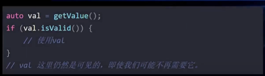

  现在

  

  

- **constexpr if**：编译时条件分支（简化模板元编程）。  

- **折叠表达式**：简化可变参数模板展开（`(args + ...)`）。

  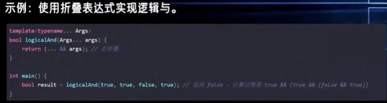  

- **内联变量**？：允许头文件中定义全局变量。

  以前  

  

  现在

  

- **文件系统库**（`std::filesystem`）：跨平台文件操作。

  filesystem 源自boost.filesystem库，在C++17合并进C++标准库中  

- `std::optional`：表示可选值（替代 `nullptr` 或错误码）。  

- `std::variant`：类型安全的联合体。  

- `std::any`：存储任意类型值。  

- `constexpr lambda`

- `std::apply`, std::pair/tuple/[ ]

  ```
  #include <iostream>
  #include <tuple>
  #include <functional>
  
  void print(int a, int b, int c) {
      std::cout << a << ", " << b << ", " << c << std::endl;
  }
  
  int main() {
      std::tuple<int, int, int> t = {1, 2, 3};
      std::apply(print, t);
      return 
  
  0;
  }
  
  ```

  

- **并行算法**：`std::for_each`、`std::sort` 等支持并行执行策略。  

- `__has_include("my_header.h")`

  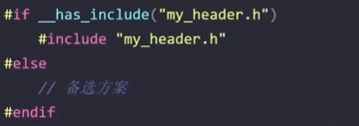

- namespace 嵌套

  以前

  

  现在

  

- std::shared_mutex

---

### **4. C++20（2020 年）**  
**重大更新，迈向现代编程范式**：  

- **核心语言**  
  - **概念（Concepts）**：约束模板参数（`template <std::integral T>`）。  
  - **协程（Coroutines）**：支持异步编程（`co_await`, `co_yield`）。  
  - **模块（Modules）**：替代头文件，提升编译速度（`import std.core;`）。  
  - **三路比较运算符**（`<=>`）：简化比较操作。  
  - **范围库（Ranges）**：链式操作容器（`std::ranges::sort(vec)`）。  
  - **constexpr 增强**：支持虚函数、动态内存分配等。  

- **标准库**  
  - `std::span`：轻量级连续内存视图。  
  - `std::format`：类型安全的格式化输出（类似 Python 的 `f-string`）。  
  - `std::jthread`：自动加入的线程类。  
  - **日历和时区支持**（`<chrono>` 扩展）。  

---

### **5. C++23（2023 年）**  
**当前最新标准**（部分特性仍在完善）：  
- **核心语言**  
  - **多维数组视图**（`std::mdspan`）：科学计算优化。  
  - **静态异常规范**（`[[throws_nothing]]`）。  
  - **标准网络库**（`std::network`）：异步网络编程支持。  
  - **反射和元类**（提案阶段）。  

- **标准库**  
  - `std::expected`：表示可能失败的操作（替代异常）。  
  - `std::hive`：高效的非连续容器。  
  - `std::print`：简化输出（`std::print("Hello {}!", name)`）。  

---


## install

安装特定版本

```bash
conda install -y -c conda-forge gcc_linux-64=10 gxx_linux-64=10 cmake make gdb 
#pip install setuptools wheel pybind11 scikit-build cmake ninja
# conda install -c conda-forge libboost	#boost库
```

使用环境中新建的编译环境
```bash
export PATH=$CONDA_PREFIX/bin:$PATH  #make sure using conda env first
export CC=$CONDA_PREFIX/bin/x86_64-conda-linux-gnu-gcc
export CXX=$CONDA_PREFIX/bin/x86_64-conda-linux-gnu-g++
alias g++="$CONDA_PREFIX/bin/x86_64-conda-linux-gnu-g++"
alias gcc="$CONDA_PREFIX/bin/x86_64-conda-linux-gnu-gcc"
```


## 书写规范（推荐）

### 文件命名

#### 源代码文件

##### .cpp (C Plus Plus)

- 最常见的C++源代码文件扩展名

- 包含类、函数等的实现代码

- 大多数项目和IDE默认使用此扩展名

##### .cc (C Code)

- .cpp的替代扩展名，功能完全相同

- 在某些组织和项目中更为常用（如Google的C++代码标准）

- 在Unix/Linux环境中比较流行

#### 头文件

##### .h (Header)

- 传统的头文件扩展名，可用于C和C++

- 包含函数声明、类声明、常量、宏等

- 通过#include指令被源文件引用

- 可以包含C或C++代码

##### .hpp (Header Plus Plus)

- 专用于C++的头文件扩展名

- 功能上与.h相同，但名称明确表示内容是C++

- 用于区分纯C++头文件和C兼容头文件

- 一些编码标准推荐C++项目使用此扩展名

##### .hh (Header Header)

- C++头文件的另一种扩展名

- 通常与.cc源文件配对使用

- 不如.h或.hpp常见

- 一些项目使用.hh与.cc源文件匹配

#### 使用约定

这些扩展名的区别主要体现在不同项目和组织的编码规范中：

1. Google风格: 源文件用.cc，头文件用.h

1. 传统C++风格: 源文件用.cpp，头文件用.h

1. 明确C++区分风格: 源文件用.cpp，头文件用.hpp


### 函数/变量/类/常量/宏定义/环境变量/文件命名

- Use PascalCase for classes and structures.
- Use camelCase for variables, functions, and methods.
- Use ALL_CAPS for constants and macros.
- Use snake_case for file and directory names.
- Use UPPERCASE for environment variables.


### 注释

Doxygen


## C/C++环境变量

### LD_LIBRARY_PATH

#C/C++语言动态链接库文件搜索的目录，它不是Linux缺省的环境变量


##### 核心定义
`LD_LIBRARY_PATH` (Load Dynamic Library Path) 是告诉操作系统（动态链接器）**去哪里寻找程序运行所需的 `.so` 动态库文件** 的环境变量。

##### 为什么需要它？
当你运行一个程序（如 `./my_app`）时，系统需要找到它依赖的动态库（如 `libssl.so`）。操作系统的**默认查找顺序**如下：

1.  =程序的 RPATH= （编译时写死在程序里的路径）。
2.  =`LD_LIBRARY_PATH` 环境变量指定的路径=。
3.  =系统默认路径= （`/lib`, `/usr/lib`, `/etc/ld.so.conf`）。

**结论**：如果你把库安装在了非标准目录（如 `/home/user/mylib` 或 Conda 环境），系统默认找不到。此时必须设置 `LD_LIBRARY_PATH`。

##### 典型应用场景

解决 "error while loading ==shared libraries=="

**问题**：编译通过，但运行时报错：
```bash
./my_program: error while loading shared libraries: libcustom.so: cannot open shared object file: No such file or directory
```
**原因**：编译时用 `-L` 告诉了编译器库在哪，但**运行时**操作系统不知道。
**解决**：

```bash
export LD_LIBRARY_PATH=/path/to/your/library:$LD_LIBRARY_PATH
./my_program
```

>编译时和运行时：
>
>| 阶段                      | 变量/参数                    | 作用                                                         |
>| :------------------------ | :--------------------------- | :----------------------------------------------------------- |
>| **编译时 (Compile Time)** | `LIBRARY_PATH` (GCC) 或 `-L` | 告诉**编译器/链接器**去哪里验证符号（函数名等）以生成可执行文件。 |
>| **运行时 (Runtime)**      | `LD_LIBRARY_PATH`            | 告诉**操作系统**在程序启动后，去哪里**加载真正的库文件**。   |


##### 优缺点

*   **好处**：=灵活=。无需管理员权限即可让程序加载自定义路径的库。
*   **坏处**：=隐患=。滥用（如全局设置）可能导致 **Dependency Hell**（依赖地狱），即程序意外加载了同名但不兼容的错误库。


### CPPFLAGS (C Preprocessor Flags)
*   **含义**：**C 预处理器**标志。
*   **用途**：用于编译的第一阶段（预处理）。主要用于**定义宏**和**指定头文件路径**。
*   **常见值**：
    *   `-DNDEBUG`：定义非调试宏，禁用 `assert()`，=提高性能=。
    *   `-D_FORTIFY_SOURCE=2`：开启缓冲区溢出检测，增强=安全性=。
    *   `-isystem .../include`：将指定目录设为“系统头文件目录”（优先级高于 `-I`，且忽略其中的警告）。

### CFLAGS (C Compiler Flags)

*   **含义**：**C 语言编译器**标志。
*   **用途**：仅用于编译 =`.c`= 文件。
*   **常见值**：
    *   `-O2`：开启二级优化（性能与速度的平衡）。
    *   `-march=native` / `-mtune=haswell`：针对特定 CPU 架构优化指令集。
    *   `-fPIC`：生成**位置无关代码** (Position Independent Code)，编译 `.so` 动态库=必须=。
    *   `-fstack-protector-strong`：开启栈保护，防止栈溢出攻击。

### CXXFLAGS (C++ Compiler Flags)
*   **含义**：**C++ 语言编译器**标志。
*   **用途**：仅用于编译 =`.cpp`, `.cc`, `.cxx`= 文件。
*   **常见值**：
    *   通常包含 `CFLAGS` 的内容。
    *   `-std=c++17` / `-std=c++20`：指定 **C++ 标准**。
    *   `-fvisibility-inlines-hidden`：隐藏内联函数符号，减小库体积并提升加载速度。


## struct & class & union

> [!NOTE]
>
> 什么时候用struct和什么时候用class？
>
> struct 默认全部public，class可以使用继承等特性，默认是private。

```c++
#include <iostream>
#include <string>
using namespace std;

class Person {
private://私有成员只能在类内部访问。
    string name;
    int age;

public://公有成员可以在类外部访问。
    //static 关键字可以用于类成员变量或成员函数，表示它们属于类本身，而不是类的某个特定对象
     static int totalPopulation;
    
    //构造函数是一种特殊的成员函数，用于初始化对象。它与类同名，没有返回类型，也不返回任何值。
    Person(string n, int a) : name(n), age(a) {
        totalPopulation++; // 每次创建新对象时增加人数
    } // 构造函数

    virtual void display() const {//如果你想在派生类中重写基类的虚函数，基类的函数必须被声明为 virtual
        cout << "Name: " << name << ", Age: " << age << endl;
    }
    
    friend void displayPerson(const Person &p);//友元函数是类外部的函数，可以访问类的私有和保护成员。
    
    //操作符重载
    Person& operator++() { // 前置++
        ++age;
        return *this;
    }
	//操作符重载
    Person operator++(int) { // 后置++
        Person temp = *this;
        ++(*this);
        return temp;
    }

    //静态函数
    static void displayTotalPopulation() 
    {
        cout << "Total population: " << totalPopulation << endl;
    }

    ~Person() 
    {
        totalPopulation--; // 每次析构对象时减少人数
    } // 析构函数用于在对象生命周期结束时进行清理工作。它与类同名，前面加上 ~，没有参数，也没有返回类型。
};

int Person::totalPopulation = 0; // 静态成员变量的初始化!

void displayPerson(const Person &p) {//友元函数, 在类内声明过了，可以访问类的私有和保护成员。
    cout << "Name: " << p.name << ", Age: " << p.age << endl;
}


//继承
class Student : public Person {
private:
    string school;

public:
    Student(string n, int a, string s) : Person(n, a), school(s) {}

    void display() const override {
        Person::display();
        cout << "School: " << school << endl;
    }
};


int main() {

    Person person("Alice", 30);
    person.display();
    
    //通过基类指针或引用调用派生类
    Person *p1 = new Person("Alice", 30);
    Person *p2 = new Student("Bob", 20, "MIT");

    p1->display();
    p2->display();

    cout<< "total population = " << Person::totalPopulation <<endl;
    Person::displayTotalPopulation();


    delete p1;
    delete p2;
    
    ++person;
    person.display();
    person++;
    person.display();
    displayPerson(person);//友元函数
    
    return 0;
}
```

关于Union: [C/C++中的联合体union介绍_c++ union-CSDN博客](https://blog.csdn.net/mooneve/article/details/92703036)

### public/private/protected

• - public: 外部可访问和继承可见。任何对象都能直接调用/读取。

```c++
class Foo { public: void greet() { std::cout << "hi\n"; } };
Foo f; f.greet(); // ok
```
  - private: 仅类自身可见，外部和子类都看不到。典型用于封装内部状态。

    ```c++
    class Foo {
        int secret = 42;           // private
    public:
        int getSecret() const { return secret; } // 暴露只读接口
    };
    // Foo f; f.secret; // 编译错误
    ```
    
  - protected: 对外不可见，但子类可见。用于让派生类复用/扩展基类的内部实现。

    ```c++
    class Base {
    protected:
        void log(const std::string &msg) { std::cout << msg << "\n"; }
    };
    class Derived : public Base {
    public:
        void run() { log("from derived"); } // 可以访问 protected
    };
    // Derived d; d.log("x"); // 编译错误，外部仍不可见
    ```

  简单总结：public 对所有人开放，protected 对外隐藏但子类可见，private 只限类自身。


### 虚函数

- 虚函数的调用需在运行时确定，编译器无法提前内联（除非能确定具体类型，如通过对象直接调用而非指针 / 引用）
- dynamic_case< >, 从基类转成子类需要用虚函数

### 什么时候使用继承？什么时候只需要把基类作为一个成员变量就行？

## 指针

### 野指针和空指针

**空指针**: 如 int *p = NULL 这就定义了一个指针，通常NULL是一个零值，操作系统定义内存64kb以下的内存单元是不可访问的，所以像如 *p = 9 这样给他赋值是系统不允许的，将会发生内存报错。

**野指针**: 如 int *p就是一个野指针，可以看到它在创建时没有赋初值，所以它的值是一个随机数，也就是乱指一气，通常都是指向了不合法的内存段，所以使用它也会内存报错。还有指针p被free或者delete之后也会成为野指针，因为它所指的内存空间被释放之后，变成了一个不合法内存段。野指针，它顾名思义它就是一个野指针，它是没有主人领养的野兽，凶猛残暴，用它你就得自食其果。


### 内存泄漏&悬空指针

#### 举例

```c++
void foo(int n) {
    int* ptr = new int(42);
    ...
    if (n > 5) {
        return;
    }
    ...
    delete ptr;
}
void other_fn(int* ptr) {
    ...
};
void bar() {
    int* ptr = new int(42);
    other_fn(ptr);
    // ptr == ?
}
```

在`foo`函数中，如果入参`n` > 5, 则会导致指针`ptr`的内存未被正确释放，从而导致**内存泄漏**。

在`bar`函数中，我们将指针`ptr`传递给了另外一个函数`other_fn`，我们无法确定`other_fn`有没有释放`ptr`内存，如果被释放了，那`ptr`将成为一个**悬空指针**，`bar`在后续还继续访问它，会引发未定义行为，可能导致程序崩溃。


### 智能指针

#### share_ptr

只要有一个指针占用了同一块地址，对应的内存都不会被释放

```c++
    vector<shared_ptr<int>> v_ptr;
    {   
        std::shared_ptr<int> shared_p = std::make_shared<int>(42);
        int *p = new int(42);
        // cout << *p << endl;
        cout << hex << shared_p.get() << endl;
        v_ptr.push_back(shared_p);
        cout << hex << shared_p.get() << endl;
        cout << hex << v_ptr[0].get() << endl;
    }
    cout << hex << v_ptr[0].get() << endl;
```

##### 循环引用问题

A 持有 B 的 shared_ptr，B 持有 A 的 shared_ptr，双方 use_count 永不归零，以前就永远不会被释放


堆空间里的 Person对象 与 Car对象互相使用着，导致双方的 shared_ptr 强引用数量不会为0，所以不会自动释放内存，产生了内存泄漏

#### unique_ptr

只能有一个指针占用对应的内存


#### weak_ptr

std::weak_ptr 是 C++11 引入的一种非拥有型智能指针，它与 std::shared_ptr 配合使用，用于解决共享所有权场景下的==循环引用问题==

我们可以将 weak_ptr 类型指针视为 shared_ptr 指针的一种辅助工具，借助 weak_ptr 类型指针， 我们可以获取 shared_ptr 指针的一些状态信息，比如有多少指向相同的 shared_ptr 指针、shared_ptr 指针指向的堆内存是否已经被释放等等

std::weak_pt==r只有指向对象的使用权，而没有管理权。==

> 所以不会造成循环引用

当 weak_ptr 类型指针的指向和某一 shared_ptr 指针相同时，weak_ptr 指针并不会使所指堆内存的引用计数加 1；同样，当 weak_ptr 指针被释放时，之前所指堆内存的引用计数也不会因此而减 1。也就是说，weak_ptr 类型指针并不会影响所指堆内存空间的引用计数。

weak_ptr 指针更常用于指向某一 shared_ptr 指针拥有的堆内存，因为在构建 weak_ptr 指针对象时，可以利用已有的 shared_ptr 指针为其初始化。例如：

```C++
std::shared_ptr<int> sp (new int);
std::weak_ptr<int> wp3 (sp);
```

由此，wp3 指针和 sp 指针有相同的指针。再次强调，weak_ptr 类型指针不会导致堆内存空间的引用计数增加或减少。

```c++
#include <iostream>
#include <memory>
using namespace std;

int main()
{
    std::shared_ptr<int> sp1(new int(10));
    std::shared_ptr<int> sp2(sp1);
    std::weak_ptr<int> wp(sp2);
    //输出和 wp 同指向的 shared_ptr 类型指针的数量
    cout << wp.use_count() << endl;
    //释放 sp2
    sp2.reset();
    cout << wp.use_count() << endl;
    //借助 lock() 函数，返回一个和 wp 同指向的 shared_ptr 类型指针，获取其存储的数据
    cout << *(wp.lock()) << endl;
    return 0;
}
//result:
//2
//1
//10
```


##### 应用场景

-  避免循环引用

  https://blog.csdn.net/weixin_45880571/article/details/119345415

  ```c++
  struct Node : std::enable_shared_from_this<Node> {
      explicit Node(std::string name) : name_(std::move(name)) {}
  
      void add_child(const std::shared_ptr<Node>& child) {
          child->parent_ = weak_from_this();  // parent is non-owning; avoids cycle with children
          children_.push_back(child);
      }
  
      void print() const {
          std::cout << "node " << name_;
          if (auto p = parent_.lock()) {
              std::cout << " parent=" << p->name_;
          } else {
              std::cout << " parent=<expired>";
          }
          std::cout << " children=" << children_.size() << "\n";
      }
  
      std::vector<std::shared_ptr<Node>> children_;
      std::weak_ptr<Node> parent_;
      std::string name_;
  };
  ```

- 缓存

  https://zhuanlan.zhihu.com/p/667078179

- 单例

- https://zhuanlan.zhihu.com/p/667078179


#### 总结

| 特性             | 普通指针      | unique_ptr      | shared_ptr       | weak_ptr           |
| ---------------- | ------------- | --------------- | ---------------- | ------------------ |
| **内存管理**     | 手动          | 自动            | 自动             | 不管理内存         |
| **所有权**       | 无明确所有权  | 独占所有权      | 共享所有权       | 无所有权，仅观察   |
| **可复制**       | 是            | 否（删除拷贝）  | 是               | 是                 |
| **可移动**       | 是            | 是              | 是               | 是                 |
| **引用计数**     | 无            | 无              | 有（强引用计数） | 有（弱引用计数）   |
| **性能开销**     | 最小          | 很小            | 较大（原子操作） | 中等（检查有效性） |
| **线程安全**     | 否            | 否              | 引用计数线程安全 | 引用计数线程安全   |
| **循环引用**     | 手动处理      | 无此问题        | 可能导致内存泄漏 | 可解决循环引用     |
| **空指针检查**   | 手动检查      | 自动析构        | 自动析构         | 需 lock() 检查     |
| **解引用安全**   | 悬垂指针风险  | RAII 保证       | RAII 保证        | 必须先 lock()      |
| **自定义删除器** | 不支持        | 支持            | 支持             | 不适用             |
| **数组支持**     | 手动 delete[] | unique_ptr<T[]> | 需自定义删除器   | 不适用             |


```c++
// 普通指针
void rawPointerExample() {
    int* ptr = new int(42);
    // 必须手动删除
    delete ptr;
}

// unique_ptr
void uniquePointerExample() {
    std::unique_ptr<int> ptr = std::make_unique<int>(42);
    // 自动删除
    // 不能复制
    // std::unique_ptr<int> ptr2 = ptr; // 错误
    std::unique_ptr<int> ptr2 = std::move(ptr); // 正确
}

// shared_ptr
void sharedPointerExample() {
    std::shared_ptr<int> ptr1 = std::make_shared<int>(42);
    std::shared_ptr<int> ptr2 = ptr1; // 可以复制
    // 当ptr1和ptr2都销毁时，内存自动释放
}
```


### 深拷贝

当一个对象的有一个指针的时候，复制对象需要特别注意，要看是否两个对象管理同一片内存！如果不要，需要使用深拷贝，创建新的内存空间和指针

```c++
#include <bits/stdc++.h>

class Foo {
public:
    Foo() = default;

    /**
     * @brief Construct with an initializer list of values.
     */
    Foo(std::initializer_list<int> values) {
        data_.reserve(values.size());
        for (int v : values) {
            data_.push_back(std::make_unique<int>(v));
        }
    }

    /**
     * @brief Deep-copy constructor: allocate new ints with the same values.
     */
    Foo(const Foo& other) {
        data_.reserve(other.data_.size());
        for (const auto& p : other.data_) {
            if (p) {
                data_.push_back(std::make_unique<int>(*p));
            } else {
                data_.push_back(nullptr);
            }
        }
    }

    /**
     * @brief Deep-copy assignment via copy-and-swap for strong exception safety.
     */
    Foo& operator=(const Foo& other) {
        if (this == &other) return *this;
        Foo tmp(other);
        swap(tmp);
        return *this;
    }

    Foo(Foo&&) noexcept = default;
    Foo& operator=(Foo&&) noexcept = default;
    ~Foo() = default;

    /**
     * @brief Append a new value by allocating a fresh int.
     */
    void Add(int value) { data_.push_back(std::make_unique<int>(value)); }

    /**
     * @brief Overwrite a value at the given index.
     */
    void SetValue(std::size_t idx, int value) {
        CheckIndex(idx);
        *data_[idx] = value;
    }

    /**
     * @brief Return number of stored elements.
     */
    std::size_t Size() const noexcept { return data_.size(); }

    /**
     * @brief Read a value at the given index.
     */
    int ValueAt(std::size_t idx) const {
        CheckIndex(idx);
        return *data_[idx];
    }

    /**
     * @brief Expose the raw pointer at index (for tests).
     */
    const int* PtrAt(std::size_t idx) const {
        CheckIndex(idx);
        return data_[idx].get();
    }

private:
    std::vector<std::unique_ptr<int>> data_;

    void swap(Foo& other) noexcept { data_.swap(other.data_); }

    void CheckIndex(std::size_t idx) const {
        if (idx >= data_.size()) {
            throw std::out_of_range("Foo index out of range");
        }
    }
};

static void Require(bool ok, std::string_view msg) {
    if (!ok) {
        std::cerr << "Test failed: " << msg << "\n";
        std::exit(1);
    }
}

int main() {
    std::cout << "Case 1: copy constructor deep-copies values.\n";
    Foo a{1, 2, 3};
    Foo b = a;
    Require(a.Size() == b.Size(), "copy size matches");
    for (std::size_t i = 0; i < a.Size(); ++i) {
        Require(a.ValueAt(i) == b.ValueAt(i), "copy value matches");
        Require(a.PtrAt(i) != b.PtrAt(i), "copy pointer differs");
    }
    b.SetValue(0, 99);
    Require(a.ValueAt(0) == 1, "copy isolation after mutation");

    std::cout << "Case 2: copy assignment deep-copies values.\n";
    Foo c{7, 8};
    c = a;
    Require(c.Size() == a.Size(), "assign size matches");
    for (std::size_t i = 0; i < c.Size(); ++i) {
        Require(c.ValueAt(i) == a.ValueAt(i), "assign value matches");
        Require(c.PtrAt(i) != a.PtrAt(i), "assign pointer differs");
    }

    std::cout << "Case 3: self-assignment keeps identity.\n";
    std::vector<const int*> before;
    before.reserve(a.Size());
    for (std::size_t i = 0; i < a.Size(); ++i) {
        before.push_back(a.PtrAt(i));
    }
    a = a;
    for (std::size_t i = 0; i < a.Size(); ++i) {
        Require(a.PtrAt(i) == before[i], "self-assign pointer unchanged");
    }

    std::cout << "Case 4: move transfers ownership.\n";
    Foo moved = std::move(a);
    Require(moved.Size() == 3, "moved size preserved");
    std::cout << "moved-from size (unspecified) = " << a.Size() << "\n";

    std::cout << "All tests passed.\n";
    return 0;
}

```

>  basic/ptr/copy.cpp 里的 operator= 用的是 copy-and-swap：
>
>   Foo tmp(other);
>   swap(tmp);
>
>   原因是：
>
>   - 强异常安全：先构造 tmp，如果拷贝分配抛异常，原对象完全不变；只有 tmp 成功后才 swap。
>   - 复用拷贝构造：只写一套深拷贝逻辑，避免重复代码。
>   - 自赋值安全：即使没有显式 if (this == &other)，也不会出错（只是多一次拷贝）。
>
>   如果你不关心强异常安全，确实可以直接清空再逐个复制，但一旦中途失败对象就处于部分修改状态。复制后再 swap 可以避免这一点。
>
> • 举个具体例子：
>
>   假设 Foo 里有很多元素，正在做 a = b;。
>   如果你用“直接复制”的写法（先清空再逐个 new）：
>
>   // 伪代码
>   clear(a);
>   for (p in b) {
>       a.push_back(new int(*p));  // 这里可能抛异常
>   }
>
>   如果在中途分配失败（std::bad_alloc），a 已经被清空了一半，对象状态被破坏。
>
>   而 copy-and-swap：
>
>   Foo tmp(b);   // 先完整拷贝到临时对象
>   swap(tmp);    // 再一次性交换
>
>   如果拷贝时抛异常，tmp 构造失败，a 完全没动；
>   拷贝成功后再 swap，操作是常量时间且不会抛异常，a 要么旧值，要么新值，永远不会处于“半成品”状态。
>
>   这就是 copy-and-swap 的核心价值：强异常安全 + 代码复用。
>
>   如果你确定拷贝过程不会抛异常（比如全是 int），直接复制也没问题；但有动态分配时，copy-and-swap 更稳。


## STL/Iterator

| 容器                                    | 头文件               | 类别                   | 简要特性 / 典型复杂度 / 备注                                 |
| :-------------------------------------- | -------------------- | ---------------------- | ------------------------------------------------------------ |
| std::array<T,N>                         | <array>              | 顺序容器（静态）       | 固定大小、连续内存、O(1) 随机访问（C++11）                   |
| std::vector<T>                          | <vector>             | 顺序容器（动态）       | 动态数组、连续内存、随机访问 O(1)、push_back 摊还 O(1)       |
| std::deque<T>                           | <deque>              | 顺序容器（双端）       | 双端队列、两端 O(1) 插入/删除、非单段连续                    |
| std::forward_list<T>                    | <forward_list>       | 顺序容器（单链表）     | 单向链表、O(1) 在任意点插入（在前驱处）、较低开销（C++11）   |
| std::list<T>                            | <list>               | 顺序容器（双链表）     | 双向链表、迭代器稳定、任意位置 O(1) 插入/删除                |
| std::string                             | <string>             | 顺序容器（字符序列）   | 专门化的连续字符序列，常用文本操作                           |
| std::valarray<T>                        | <valarray>           | 数值数组（向量化）     | 面向数值计算的数组，支持元素级操作                           |
| std::bitset<N>                          | <bitset>             | 固定位集合             | 编译期固定大小位集合，高效位操作                             |
| std::span<T>                            | <span>               | 非拥有视图             | C++20，非拥有的连续区间视图（零拷贝）                        |
| std::stack<T,Cont>                      | <stack>              | 容器适配器             | LIFO，默认底层容器 deque，接口有限                           |
| std::queue<T,Cont>                      | <queue>              | 容器适配器             | FIFO，默认底层容器 deque                                     |
| std::priority_queue<T,Cont,Comp>        | <queue>              | 容器适配器 / 堆        | 默认用 vector + push_heap/pop_heap（binary heap），top O(1)，push/pop O(log n) |
| std::set<Key> / std::multiset<Key>      | <set>                | 有序关联容器           | 基于平衡树（通常红黑树），按键排序，查找/插入/删除 O(log n)  |
| std::map<Key,T> / std::multimap<Key,T>  | <map>                | 有序关联容器           | 键→值映射，按键有序，O(log n)                                |
| std::unordered_set / unordered_multiset | <unordered_set>      | 无序关联容器（哈希）   | 哈希表实现，平均 O(1) 查找/插入，最坏 O(n)                   |
| std::unordered_map / unordered_multimap | <unordered_map>      | 无序关联容器（哈希）   | 哈希映射，平均 O(1)                                          |
| （pmr）std::pmr::vector / containers    | <memory_resource> 等 | 使用多态内存资源的容器 | C++17/20 相关，便于自定义内存分配策略                        |

简短补充说明：

- “顺序容器”强调元素按序存储，支持迭代；“关联容器”按键组织并支持按键查找；“无序”版本使用哈希表。
- std::priority_queue 是容器适配器，典型实现是二叉堆（通过 std::push_heap / pop_heap 操作实现），不是斐波那契堆。
- 迭代器失效规则、稳定性（是否保持相等元素相对顺序）和具体常数项在不同容器间差异较大，使用时参照文档即可。
- 还有一些非“容器”但常与容器混用的类型（如 ==std::pair/std::tuple==、迭代器适配器、ranges/view 等）及 C++20+ 的 ranges/span/小工具，不再逐一列出。


### begin/end/prev/next/advance/rbegin/rend

```c++
#include <iostream>     // std::cout
#include <iterator>     // std::next
#include <list>         // std::list
using namespace std;
int main() {
    //创建并初始化一个 list 容器
    std::list<int> mylist{ 1,2,3,4,5 };
    std::list<int>::iterator it = mylist.end();
    //获取一个距离 it 迭代器 2 个元素的迭代器，由于 2 为正数，newit 位于 it 左侧
    auto newit = prev(it, 2);
    cout << "prev(it, 2) = " << *newit << endl;
   
    //n为负数，newit 位于 it 右侧
    it = mylist.begin();
    newit = prev(it, -2);
    cout << "prev(it, -2) = " << *newit;
    return 0;
}
```

>prev(it, 2) = 4
>prev(it, -2) = 3

```c++
#include <iostream>     // std::cout
#include <iterator>     // std::next
#include <list>         // std::list
using namespace std;
int main() {
    //创建并初始化一个 list 容器
    std::list<int> mylist{ 1,2,3,4,5 };
    std::list<int>::iterator it = mylist.begin();
    //获取一个距离 it 迭代器 2 个元素的迭代器，由于 2 为正数，newit 位于 it 右侧
    auto newit = next(it, 2);
    cout << "next(it, 2) = " << *newit << endl;
   
    //n为负数，newit 位于 it 左侧
    it = mylist.end();
    newit = next(it, -2);
    cout << "next(it, -2) = " << *newit;
    return 0;
}
```

>next(it, 2) = 3
>next(it, -2) = 4

```c++
#include <iostream>     // std::cout
#include <iterator>     // std::advance
#include <vector>
using namespace std;
int main() {
    //创建一个 vector 容器
    vector<int> myvector{ 1,2,3,4 };
    //it为随机访问迭代器，其指向 myvector 容器中第一个元素
    vector<int>::iterator it = myvector.begin();
    //输出 it 迭代器指向的数据
    cout << "移动前的 *it = " << *it << endl;

    //借助 advance() 函数将 it 迭代器前进 2 个位置
    advance(it, 2);
    cout << "移动后的 *it = " << *it << endl;
    return 0;
}
```

>移动前的 *it = 1
>移动后的 *it = 3

```c++
// 反向迭代，注意不要用(auto it = v.end(); it!=v.begin; it--), v.end()是UB  
std::vector<int> v{1,2,3,4};
for (auto it = v.rbegin(); it != v.rend(); ++it) {
    std::cout << *it << "\n";
}
```


### find

 - 有序/无序关联容器（std::map / std::unordered_map / std::set / std::unordered_set）：

    ```c++
    std::unordered_map<std::string, int> m{{"a",1},{"b",2}};
    auto it = m.find("b");
    if (it != m.end()) {
        // it->first / it->second
    } else {
        // 不存在
    }
    ```
    
      - 平均复杂度：unordered_* O(1)，map/set O(log N)。
      - set/unordered_set 的 find 返回迭代器，指向元素值本身。
  - 顺序容器（std::vector/std::list 等）==没有成员 `find`, 使用std::find()，==用算法：

    ```c++
    std::vector<int> v{1,3,5};
    auto it = std::find(v.begin(), v.end(), 3);
    if (it != v.end()) { /* *it == 3 */ }
    ```
    
      - 复杂度 O(N)。
  - ==自定义==判定（例如在 vector 里找奇数）用 `std::find_if`：

    ```c++
    #include <algorithm>
    #include <iostream>
    #include <string>
    #include <tuple>
    #include <vector>
    
    int main() {
        std::vector<std::tuple<std::string, int, double>> samples{
            {"apple", 3, 1.1},
            {"banana", 5, 2.3},
            {"cherry", 2, 0.8},
        };
    
        // lambda 函数：输入字符串，若找到则返回对应的 double，否则返回 0
        auto getDouble = [&](const std::string &key) -> double {
            auto it = std::find_if(samples.begin(), samples.end(),
                                   [&](const auto &t) { return std::get<0>(t) == key; });
            if (it != samples.end()) {
                return std::get<2>(*it);
            }
            return 0.0;
        };
    
        std::string curr_sample = "banana";
        double value = getDouble(curr_sample);
        if (value != 0.0) {
            std::cout << "found " << curr_sample << " -> " << value << "\n";
        } else {
            std::cout << curr_sample << " not found\n";
        }
    
        return 0;
    }
    
    ```

> 注意：find 返回 end 表示未找到；访问前先检查。


### std::pair/std::tuple

 tuple是一个固定大小的不同类型值的集合，是泛化的std::pair

std::tuple理论上可以有无数个任意类型的成员变量，而std::pair只能是2个成员，因此在需要保存3个及以上的数据时就需要使用tuple元组了。

```c++
 
std::tuple<T1, T2, TN> t1;            //创建一个空的tuple对象（使用默认构造），它对应的元素分别是T1和T2...Tn类型，采用值初始化。
std::tuple<T1, T2, TN> t2(v1, v2, ... TN);    //创建一个tuple对象，它的两个元素分别是T1和T2 ...Tn类型; 要获取元素的值需要通过tuple的成员get<Ith>(obj)进行获取(Ith是指获取在tuple中的第几个元素，请看后面具体实例)。
std::tuple<T1&> t3(ref&); // tuple的元素类型可以是一个引用
std::make_tuple(v1, v2); // 像pair一样也可以通过make_tuple进行创建一个tuple对象
```


### custom hash for map

```c++
struct Point {
    int x{};
    int y{};
    bool operator==(const Point &other) const { return x == other.x && y == other.y; }
};

struct PointHash {
    std::size_t operator()(const Point &p) const noexcept {
        std::size_t h1 = std::hash<int>{}(p.x);
        std::size_t h2 = std::hash<int>{}(p.y);
        return h1 ^ (h2 + 0x9e3779b97f4a7c15ULL + (h1 << 6) + (h1 >> 2));
    }
};

void DemoCustomKeyHash() {
    std::unordered_map<Point, std::string, PointHash> grid_name;
    grid_name[{0, 0}] = "origin";
    grid_name[{1, 2}] = "A";
    grid_name[{2, 1}] = "B";

    std::cout << "[unordered_map with custom key/hash]\n";
    Point query{1, 2};
    if (auto it = grid_name.find(query); it != grid_name.end()) {
        std::cout << "found (" << query.x << ", " << query.y << "): " << it->second << '\n';
    }
    std::cout << '\n';
}
```


### priority_queue 和 vector+sort 相比有什么区别

  - 接口与用途：priority_queue 提供“始终能取当前最大/最小值”的堆接口；vector+sort 是一次性排序后顺序访问的容器组合。
  - 复杂度：priority_queue 的 push/pop/top 都是 O(log N)/O(log N)/O(1)，适合动态插入+反复取极值；vector 初始乱序时 sort
    一次 O(N log N)，之后按序读取是 O(1) 前进。
  - 数据更新：若频繁插入/删除同时要保持有序，priority_queue 更高效；vector+sort 每次打乱后需重新排序。
  - 遍历顺序：priority_queue 只能访问堆顶（或依次弹出）；无法直接有序遍历不破坏结构。vector+sort 得到完整有序序列，可随
    机访问。
  - 额外控制：priority_queue 支持自定义比较器决定大顶/小顶；vector+sort 也可自定义比较器，且能稳定排序（配合
    stable_sort）或按多条件排序。
  - 内存与常数：两者都基于 contiguous storage；priority_queue 封装了堆操作，常数因子小，避免多次全量排序；vector+sort 在
    数据静态或批量处理时简单直接。


### push_back 和 emplace_back 区别


```c++
class Person {
    int _age;

public:
    Person(int age) : _age(age) {
        cout << "Construct a person." << _age << endl;
    }

    Person(const Person &p) : _age(p._age) {
        cout << "Copy-Construct" << _age << endl;
    }

    Person(const Person &&p) noexcept: _age(p._age) {
        cout << "Move-Construct" << _age << endl;
    }
};
```

> [!CAUTION]
>
> 移动构造形参是传右值`&&`
>
> `noexcept` 告诉编译器“这个移动构造不会抛异常”。作用：
>
>   - 标记后可以让标准容器在需要搬移元素时选择移动而非退回到拷贝（因为它保证不抛，容器可以安全移动已有元素）。
>   - 语义：承诺不会抛出异常；若仍抛出，将调用 std::terminate。

```c++
#include <bits/stdc++.h>
using namespace std;

class Person {
    int _age;

public:
    Person(int age) : _age(age) {
        cout << "Construct a person." << _age << endl;
    }

    Person(const Person &p) : _age(p._age) {
        cout << "Copy-Construct" << _age << endl;
    }

    Person(const Person &&p) noexcept: _age(p._age) {
        cout << "Move-Construct" << _age << endl;
    }
};


int main() {
    vector<Person> persons1;
    auto p = Person(1); // >: Construct a person.1
    persons1.push_back(p);

    std::cout << " -------------------- " <<std::endl;
    vector<Person> persons2;
    auto p2 = Person(2); // >: Construct a person.1
    persons2.emplace_back(move(p2)); // >: Move-Construct1
    persons2.emplace_back(4);
    std::cout << " -------------------- " <<std::endl;
    vector<Person> persons3;
    persons3.reserve(999); // Reserve space to avoid reallocation
    auto p3 = Person(3); // >: Construct a person.1
    persons3.emplace_back(move(p3)); // >: Move-Construct1
    persons3.emplace_back(5);
}
```

> Construct a person.1
>
> Copy-Construct1
>
> \--------------------
>
> Construct a person.2
> Move-Construct2
> Construct a person.4
>
> Move-Construct2
>
> \--------------------
>
> Construct a person.3
> Move-Construct3
> Construct a person.5
> Move-Construct3

>emplace_back() 函数在原理上比 push_back() 有了一定的改进，包括在内存优化方面和运行效率方面。内存优化主要体现在使用了==就地构造==（直接在容器内构造对象，不用拷贝一个复制品再使用）+强制类型转换的方法来实现，在运行效率方面，由于==省去了拷贝构造过程==，因此也有一定的提升。


eg2:

```c++
#include <algorithm>
#include <iostream>
#include <string>
#include <utility>
#include <vector>

struct Tracker {
    std::string name;

    explicit Tracker(std::string label) : name(std::move(label)) {
    // Tracker(std::string label) : name(std::move(label)) {
        std::cout << "ctor   " << name << '\n';
    }

    Tracker(const Tracker &other) : name(other.name) {
        std::cout << "copy   " << name << '\n';
    }

    Tracker(Tracker &&other) noexcept : name(std::move(other.name)) {
        std::cout << "move   " << name << '\n';
    }

    Tracker &operator=(const Tracker &other) {
        name = other.name;
        std::cout << "copy=  " << name << '\n';
        return *this;
    }

    Tracker &operator=(Tracker &&other) noexcept {
        name = std::move(other.name);
        std::cout << "move=  " << name << '\n';
        return *this;
    }
};

int main() {
    std::vector<Tracker> v;
    v.reserve(4);
    std::cout << "v.size = " << v.size() << "\n\n";

    std::cout << "push_back temporary:\n";
    v.push_back(Tracker("tmp"));  // ctor for temporary, move into vector

    std::cout << "\nemplace_back in place:\n";
    v.emplace_back("emplaced");  // constructs directly in-place, no move/copy

    // std::cout << "\npush right value:\n";
    // v.push_back("pushed_rvalue");  // error, due to `explicit`

    std::cout << "\npush_back lvalue:\n";
    Tracker t("local");
    v.push_back(t);  // copies from lvalue
    std::cout << "t address before move: " << &t << '\n';

    std::cout << "\nemplace_back move lvalue:\n";
    v.emplace_back(std::move(t));  // moves from lvalue
    std::cout << "\ncurrent names in vector:\n";
    for (const auto &item : v) {
        std::cout << item.name << ' ';
    }
    std::cout << "\ncurrent t.name after move: " << (t.name.empty() ? "<moved-from>" : t.name) << '\n';
    std::cout << '\n';
    std::cout << "t address after move : " << &t << '\n';

    std::vector<Tracker> copied;
    copied.reserve(2);
    std::cout << "\ncopy slice [0, 2):\n";
    copied.insert(copied.end(), v.begin(), v.begin() + 2);  // copies two elements

    std::vector<Tracker> moved;
    moved.reserve(2);
    std::cout << "\n\nmove slice [2, 4):\n";
    std::move(v.begin() + 2, v.begin() + 4, std::back_inserter(moved));  // moves two elements
    std::cout << "\noriginal names after move slice:\n";
    for (const auto &item : v) {
        std::cout << (item.name.empty() ? "<moved-from>" : item.name) << ' ';
    }
    std::cout << '\n';

    return 0;
}

```

> v.size = 0
>
> push_back temporary:
> ctor   tmp
> move   tmp
>
> emplace_back in place:
> ctor   emplaced
>
> push_back lvalue:
> ctor   local
> copy   local
> t address before move: 0x7ffe2e3461f0
>
> emplace_back move lvalue:
> move   local
>
> current names in vector:
> tmp emplaced local local 
> current t.name after move: <moved-from>
>
> t address after move : 0x7ffe2e3461f0
>
> copy slice [0, 2):
> copy   tmp
> copy   emplaced
>
> move slice [2, 4):
> move   local
> move   local
>
> original names after move slice:
> tmp emplaced <moved-from> <moved-from> 

- https://zhuanlan.zhihu.com/p/213853588


### 参考

[C++ 迭代器(iterator)超详解+实例演练_c++ iterator-CSDN博客](https://blog.csdn.net/qq_52324409/article/details/121048486)


## 字符串

### 基本对象

#### std::string

`std::string` 保证其字符存储在内存中的一个连续区域内，从而实现了通过索引对单个字符进行高效的随机访问，其时间复杂度为 O(1) 

#### std::string_view

`c++17`引入

[【80】如何让C++字符串更快_哔哩哔哩_bilibili](https://www.bilibili.com/video/BV1Dk4y1j7oj?spm_id_from=333.788.videopod.episodes&vd_source=ea5f077dc692dc32725d05ff92da61a5&p=81)


### 小字符串优化

[【83】C++的小字符串优化_哔哩哔哩_bilibili](https://www.bilibili.com/video/BV1Dk4y1j7oj?spm_id_from=333.788.videopod.episodes&vd_source=ea5f077dc692dc32725d05ff92da61a5&p=84)

## 模版Template

### 背景

有时，有两个或多个类，其功能是相同的，仅仅是数据类型不同

一个类似std::array 的案例：

```c++
template<typename T, int N>
class Array {
private:
    T m_Array[N];
public:
    int GetSize() const {return N;}
}
```


### 参考

- [【53】C++的模板_哔哩哔哩_bilibili](https://www.bilibili.com/video/BV1Dk4y1j7oj?spm_id_from=333.788.videopod.episodes&vd_source=ea5f077dc692dc32725d05ff92da61a5&p=54)


## static & extern

### static

- 修饰局部变量，修改变量的存储区域和生命周期，使变量存储在静态区，==在 main 函数运行前就分配了空间==，如果有初始值就用初始值初始化它，如果没有初始值系统用默认值初始化它。
- 修饰成员变量，修饰成员变量使==所有的对象只保存一个该变量==，而且不需要生成对象就可以访问该成员。静态成员变量的初始化必须在函数声明体之外。
- 修饰成员函数，修饰成员函数使得==不需要生成对象就可以访问该函数==，但是在 static 函数内不能访问非静态成员。
- 修饰全局变量，使全局变量的作用域==限制在cpp内部==。当头文件定义static全局变量后，会在每个cpp生成一个常量区变量地址。
- 修饰普通函数，表明函数的作用范围，==仅在定义该函数的文件内才能使用==。在多人开发项目时，为了防止与他人命名空间里的函数重名，可以将函数定位为 static。功能与匿名命名空间类似，但符号上不同。


#### 使用场景

- 修饰成员变量，作为类的对象计数器

- 设置公共变量

  ```c++
  // Static factory/singleton pattern via static local variable.
  class Logger {
  public:
      static Logger &Instance() {
          static Logger inst{"main"};  // constructed once, thread-safe since C++11, singleton
          return inst;
      }
      void Log(const std::string &msg) { std::cout << "[" << name_ << "] " << msg << '\n'; }
  
  private:
      explicit Logger(std::string name) : name_(std::move(name)) {}
      std::string name_;
  };
  
  int main(){
      Logger::Instance().Log("first log line");
  	Logger::Instance().Log("reuse same logger");
  }
  ```

  > 单例模式是指在整个系统生命周期内，保证一个类只能产生一个实例，确保该类的唯一性。
  >
  > [【C++】C++ 单例模式总结（5种单例实现方法）_单例模式c++实现-CSDN博客](https://blog.csdn.net/unonoi/article/details/121138176)

#### 参考

https://zhuanlan.zhihu.com/p/605741092


### extern

extern其实就是一个声明，明确指出一个语句是声明，比如extern int i ;这是声明变量i，而不是定义i，定义i则是int i（声明不开辟内存空间，而定义是要开辟内存空间的）


#### 使用场景

- 适用于简单项目，几个文件之间的调用

  ```c++
  //test.c文件
  int i =5;
  ```

  ```c++
  //main.c文件
  #include <stdio.h>
  extern int i;
  int main()
  {
  	printf("i=%d\n",i);
      return 0;
  }
  
  ```

- 适合用于大工程

  假如我一个大工程，这个工程由超级多的文件，这些文件假如都要访问test.c文件的 变量 i,那么，只能在这些文件中，每个文件的开头都 声明变量 i,并且，假如我的test.c，不止一个定义一个变量i,有好多其他变量呢？在其他文件访问时候，都要声明好多变量，这会使得书写难度很繁琐，并且维护成本也大。

  所以，可以把声明语句放到一个头文件中去使用，即定义一个test.h的头文件，在该头文件中添加声明，然后当有其他文件需要调用这些变量时，之间调用此头文件即可。
  ```c++
  //test.c文件
  int i = 5;
  int b = 6;
  int b = 7;
  ```

  ```c++
  //test.h
  extern int i = 5;
  extern int b = 6;
  extern int b = 7;
  ```

  ```c++
  //main.c文件
  #include <stdio.h>
  #include "test.h"
  //extern int i;不再需要用此方式，改为调用test.h头文件即可
  int main()
  {
  	printf("i=%d\n",i);
      return 0;
  }
  ```

- extern “C” 

  `extern "C"`修饰的语句是为了==编译器按照c的方式去进行编译==的，为什么需要这样呢，是因为，如果在cpp文件中调用了c函数，那么就需要对这些c函数进行extern "C"操作，从而在编译cpp程序时，调用这些函数的时候，这些函数要按照c编译。

#### 参考

https://blog.csdn.net/ytt999/article/details/139352522


## 引用

### 常见应用场景

1. 减少拷贝
2. 函数传参
3. 代码简洁


#### 注意

```c++
std::vector<int> numbers = {1, 2, 3};
int &a = numbers[2];
numbers.pop_back();
std::cout << "a = " << a << "\n";
```

>这是未定义行为。int &a = numbers[2]; 绑定到最后一个元素，pop_back() 会析构并移除该元素，引用变成悬空。刚好内存还没被覆
>盖，所以打印出了旧值 3，但这只是偶然：换个编译器/优化/场景可能是任意值甚至崩溃。

### 左值与右值

`左值`指既能够出现在等号左边，也能出现在等号右边的变量；


`右值`则是只能出现在等号右边的变量

```c++
int a; // a 为左值
a = 3; // 3 为右值
```

右值一般是不可寻址的常量

区别之一是左值可以被修改，而右值不能


### 左值引用&


### 右值引用&&

- **一次性使用**：右值引用只能绑定到右值上，一旦绑定，原始的右值就不能再被使用。
- **移动语义**：右值引用允许你转移资源的所有权，而不是复制资源。这是通过移动构造函数和移动赋值运算符实现的(std::move)。
- **临时对象**：右值引用可以用来延长临时对象的生命周期，使其可以被多次使用。
- **完美转发**：右值引用在模板编程中用于完美转发参数，这样可以保留参数的左值或右值性质。

```c++
int x = 6; // x是左值，6是右值
int &y = x; // 左值引用，y引用x

int &z1 = x * 6; // 错误，x*6是一个右值
const int &z2 =  x * 6; // 正确，可以将一个const引用绑定到一个右值

int &&z3 = x * 6; // 正确，右值引用
int &&z4 = x; // 错误，x是一个左值
```


>[!WARNING]
>
> 这个时候`PrintName(firstName)`是可以的
>
> 但是`PrintName(firstName+lastName)`是不行的
>
> 如果函数声明为`void PrintName(const std::string& name)`，那么两种都可以了就可以了
>
>
> 
> 如果声明为右值引用`void PrintName(std::string&& name)`, 那么输入参数只能是右值`firstName+lastName`

那么右值引用有什么用？可以在函数里面用`move`了

```c++
    std::vector<std::string> v{"hello", "world"};

    // 取末尾元素的右值引用，并把它移动到新字符串
    std::string &&ref = std::move(v.back());
    std::cout << "v.back() before move = '" << v.back() << "' (size=" << v.back().size() << ")\n";
    std::string moved = std::move(ref);

    std::cout << "moved = '" << moved << "'\n";
    std::cout << "v.back() after move = '" << v.back() << "' (size=" << v.back().size() << ")\n";
```

>v.back() before move = 'world' (size=5)
>moved = 'world'
>v.back() after move = '' (size=0)

```c++
    std::vector<std::pair<std::string, int>> v{{"hello", 1}, {"world", 2}};
    std::string &&ref = std::get<0>(std::move(v.back()));
    // std::string &&ref = std::get<0>(v.back());  // error: cannot bind rvalue reference of type 'std::string&&' to lvalue of type 
    std::cout << "v.back() before move = '" << v.back().first << "' (size=" << v.back().first.size() << ")\n";
    std::cout << "v.back().second = " << v.back().second << "\n";
    std::string getRight = std::move(ref);
    std::cout << "getRight = '" << getRight << "'\n";
    std::cout << "v.back() after move = '" << v.back().first << "' (size=" << v.back().first.size() << ")\n";
    std::cout << "v.back().second = " << v.back().second << "\n";

    std::cout << "-------------------\n";

    std::vector<std::pair<std::string, int>> v2{{"hello", 1}, {"world", 2}};
    std::string &&ref2 = std::get<0>(std::move(v2.back()));
    std::cout << "v.back() before move = '" << v2.back().first << "' (size=" << v2.back().first.size() << ")\n";
    std::cout << "v.back().second = " << v2.back().second << "\n";
    std::string getRight2 = ref2;     // if not move
    std::cout << "getRight = '" << getRight2 << "'\n";
    std::cout << "v.back() after move = '" << v2.back().first << "' (size=" << v2.back().first.size() << ")\n";
    std::cout << "v.back().second = " << v2.back().second << "\n";
```

> v.back() before move = 'world' (size=5)
> v.back().second = 2
> getRight = 'world'
> v.back() after move = '' (size=0)
>
> v.back().second = 2
>
> \--------------------------------
>
> v.back() before move = 'world' (size=5)
> v.back().second = 2
> getRight = 'world'
> v.back() after move = 'world' (size=5)
> v.back().second = 2


[【85】C++的左值与右值_哔哩哔哩_bilibili](https://www.bilibili.com/video/BV1Dk4y1j7oj?spm_id_from=333.788.videopod.episodes&vd_source=ea5f077dc692dc32725d05ff92da61a5&p=86)


### std::move

[C++ std::move深入解析 | 移动语义与性能优化 | C++ 编程指南](https://chengxumiaodaren.com/docs/cpp-advanced/cpp-move/)

std::move 可以告诉编译器将一个对象视为右值，从而触发移动语义的操作

只是将对象状态或者所有权从一个对象转移到另一个对象，没有涉及内存的搬迁或者内存拷贝，从而==极大地提高代码效率==。

对于C++的类来说，通常有`构造函数`、`赋值构造函数`、`拷贝构造函数`等适用于在不同的条件下创建新对象，从C++11开始，还有了`移动构造函数`，它==不同于拷贝构造函数，通常不会进行资源的复制==（除非在自定义的移动构造函数中非要进行资源的复制，相信大家不会这么做），当进行参数传递等一些操作时，巧妙利用std::move实现移动语义，就可以减少之前==不必要的拷贝构造==，从而大幅提高程序效率，下面看代码有助于加深理解。


移动构造函数就是右值引用：[【90】stdmove与移动赋值操作符_哔哩哔哩_bilibili](https://www.bilibili.com/video/BV1Dk4y1j7oj?spm_id_from=333.788.videopod.episodes&vd_source=ea5f077dc692dc32725d05ff92da61a5&p=91) 

#### 案例

```c++
#include <stdio.h>
#include <unistd.h>
#include <iostream>
#include <vector>

class MyClass {
public:
    MyClass(int value)
            :ptr_(new int(value)) {    // 构造函数，存在开辟内存、复制资源的操作
        std::cout << "Default constructor called: MyClass(int value)" << std::endl;
    }
    MyClass(const MyClass& other)   // 拷贝构造函数，存在开辟内存、复制资源的操作
            : ptr_(new int(*other.ptr_)) {
        std::cout << "Copy constructor called: MyClass(const MyClass& other)" << std::endl;
    }
    MyClass(MyClass&& other) noexcept       // 移动构造函数，只是地址的复制，没有新开内存、资源复制
            : ptr_(other.ptr_) {
        other.ptr_ = nullptr;
        std::cout << "Move constructor called: MyClass(MyClass&& other)" << std::endl;
    }
    MyClass& operator=(const MyClass& other) {  // 赋值构造函数，也存在开辟内存、复制资源的操作
        if (&other == this) {
            return *this;   // 自我赋值，直接返回
        }
        if (ptr_) {
            delete ptr_;                    // 释放原有内存
        }
        // 逐个赋值
        ptr_ = new int(*other.ptr_);
        return *this;
    }
    ~MyClass() {
        if (ptr_) {
            delete ptr_;
        }
        std::cout << "Destructor called." << std::endl;
    }
    int GetValue(void) { return *ptr_; }
    // 打印数据
    void PrintData() const {
        std::cout << "Data: " << *ptr_ << std::endl;
    }
private:
    int* ptr_;   // 相当于Class内部管理的资源
};
下面我们看一下如何通过std::move触发移动构造函数：

int main (void)
    MyClass obj1(10);                     // 调用默认构造函数
    MyClass obj2 = std::move(obj1);       // 调用移动构造函数

    MyClass obj3(30);                     // 调用默认构造函数
    MyClass obj4(std::move(obj3));        // 调用移动构造函数
    return 0;
}

int main (void)
    MyClass obj1(10);                     // 调用默认构造函数
    MyClass obj2 = std::move(obj1);       // 调用移动构造函数

    MyClass obj3(30);                     // 调用默认构造函数
    MyClass obj4(std::move(obj3));        // 调用移动构造函数
    return 0;
}
```


可以直观地看到利用obj1创建obj2时以及利用obj3创建obj4时，均调用了移动构造函数而不是赋值构造函数或拷贝构造函数


### 完美转发（std::forward）

[(73 封私信 / 80 条消息) C++编程系列笔记（3）——std::forward与完美转发详解 - 知乎](https://zhuanlan.zhihu.com/p/645328162)

主要用于以下场景：**提高模板函数参数传递过程的转发效率**。

#### 引用折叠

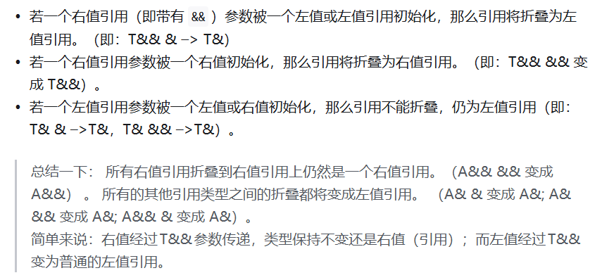

```c++
template<typename T>
void func(T&& arg);

int main() {
  int a = 5;
  func(a);  // arg为int&，引用折叠为左值引用

  func(10);  // arg为int&&，引用折叠为右值引用

  int& ref = a;
  func(ref);  // arg为int&，引用不能折叠
}
```


### 参考

[【85】C++的左值与右值_哔哩哔哩_bilibili](https://www.bilibili.com/video/BV1Dk4y1j7oj?spm_id_from=333.788.videopod.episodes&vd_source=ea5f077dc692dc32725d05ff92da61a5&p=86)

[【89】C++移动语义_哔哩哔哩_bilibili](https://www.bilibili.com/video/BV1Dk4y1j7oj?spm_id_from=333.788.videopod.episodes&vd_source=ea5f077dc692dc32725d05ff92da61a5&p=90)

[【90】stdmove与移动赋值操作符_哔哩哔哩_bilibili](https://www.bilibili.com/video/BV1Dk4y1j7oj?spm_id_from=333.788.videopod.episodes&vd_source=ea5f077dc692dc32725d05ff92da61a5&p=91) 

[ C++编程系列笔记（3）——std::forward与完美转发详解 - 知乎](https://zhuanlan.zhihu.com/p/645328162)

[完美转发与万能引用详解 | C++高级特性 | C++ 编程指南](https://chengxumiaodaren.com/docs/cpp-advanced/cpp-forward/)


## 类型转换

在C语言中，如果赋值运算符左右两侧类型不同，或者形参与实参类型不匹配，或者返回值类型与接收返回值类型不一致时，就需要发生类型转化

编译器在编译阶段自动进行，能转就转，不能转就编译失败。

  需要注意的是，只有相近类型之间才能发生隐式类型转换，比如int和double表示的都是数值，只不过它们表示的范围和精度不同。而指针类型表示的是地址编号，因此整型和指针类型之间不会进行隐式类型转换，如果需要转换则只能进行显式类型转换

> 显示类型转换: 需要用户自己处理，以(指定类型)变量的方式进行类型转换
>
> ```c++
> int a = 0;
> short b = a;
> float c = 1.2;
> b = c;//隐式转换
> int* p = &a;
>  
> int d = (int)p;//显示类型转换，强转 //c风格
> ```


c++ 风格四种配型转换

静态转换：static_cast 、const_cast 、reinterpret_cast

动态转换： dynamic_cast

### static_cast

`static_cast<type_name>(expression)`

该运算符把`expression`转换为`type_name`类型，在编译时使用类型转换信息执行转换

- 基本数据类型之间的转换

  > 只能转换相近的数据类型，如int转short,float,double

- 对指针的类型转化无效（除void*)

  ```c++
  int a = 0;
  float c = 1.2;
   
  //用于基本数据类型之间的转换
  int d = static_cast<int>(c);//c转换为 int 类型 
  double t = static_cast<double>(c);
   
  //对指针之间的类型转换无效
  int* p = &a;
  short* s = static_cast<short*>(p);//error
  int* s = static_cast<int*>(a);//error
  ```

- `void *`转换为其他任何类型

  ```c++
  #include<iostream>
  using namespace std;
  int main()
  {
  	int a = 0x61626364;
  	char ch = 'a';
  	void* p = &a;
  	char* cp = nullptr;
  	int* ip = nullptr;
  	cp = static_cast<char*>(p);
  	ip = static_cast<int*>(p);
  	cout << *cp << endl;
   
     //void*指针是常性时，在类型转换时也需要加上const
  	// const void* ptr = &a;
  	// const int* ip = static_cast<const int*>(ptr);
  }
  ```

- 枚举转换为int(一般不建议用)

- 左值转换为右值

  ```c++
  int a = 10;
  int& ca = a;
  int&& ra = a;//error
  int&& ra = static_cast<int&&>(a);
  ```

### dynamic_cast

#### 条件

（1）必须是==公有继承==，==基类要有虚函数==（这样基类才会有虚函数表，从而支持运行时类型识别 RTTI）

（2）==运行时==进行类型转换

（3）对指针类型转换失败，dynamic_cast 的结果是nullptr

（4）对引用类型转换失败，dynamic_cast 会抛出异常

（5）在类层次间进行向上转换时，dynamic_cast 与 static_cast 的效果一样

（6）在==向下转换==时，==dynamic_cast 具有类型检查的功能，比 static_cast 更安全==

>向上转换: 子类的指针（或引用）→ 父类的指针（或引用）
>
>向下转换:  父类的指针（或引用）→ 子类的指针（或引用）
>
>使用==C风格==的强制类型转换进行向下转型是==不安全==的，因为此时无论父类的指针（或引用）指向的是父类对象还是子类对象都会进行转换
>
>而使用dynamic_cast进行向下转型则是安全的，如果父类的指针（或引用）指向的是子类对象那么dynamic_cast会转换成功，但如果父类的指针（或引用）指向的是父类对象那dynamic_cast会转换失败并返回一个空指针

```c++
#include<iostream>
using namespace std;
class Object
{
private:
	int val;
public:
	Object(int x = 0) :val(x)
	{
 
	}
	virtual void func()
	{
 
	}
 
};
 
class Base :public Object
{
private:
	int sum;
public:
	Base(int x = 0) :Object(x + 10), sum(x)
	{
 
	}
	virtual void func()
	{
 
	}
};
 
class Test :public Object
{
private:
	int num;
public:
	Test(int x = 0) :Object(x + 20), num(x + 20)
	{
 
	}
	virtual void func()
	{
 
	}
};
 
int main()
{
	Base base;
	Test test;
 
	Object* op = &base;
	Base* bp = nullptr;
	Test* tp = nullptr;
	bp = dynamic_cast<Base*>(op);//基类指针转换为派生类指针，且基类指针指向派生类对象
	tp = dynamic_cast<Test*>(op);
    cout << bp << endl;
    cout << tp << endl;
	return 0;
 
}
```

```c++
#include <iostream>
/*
static_cast 不会做运行时类型检查，因此如果转换不正确，可能导致未定义行为（UB）。
*/
class basic_class {
public:
    explicit basic_class(int x) : x(x) {}
    int x;
};

class inherited_class : public basic_class {
public:
    inherited_class(int x, int y) : basic_class(x), y(y) {}
    int y;
};

int main() {
    basic_class plain(42);       // error
    // inherited_class plain(42, 3208);    // ok
    basic_class* basePtr = &plain;  // 实际上只指向 basic_class

    // 没有虚函数的情况下，static_cast 不会做运行时检查。
    auto derivedPtr = static_cast<inherited_class*>(basePtr);

    std::cout << "basic.x = " << derivedPtr->x << '\n';
    std::cout << "derived.y (UB) = " << derivedPtr->y << '\n';

    derivedPtr->y = 100;  // 修改内存，其实覆盖了 plain.x 附近的字节
    std::cout << "plain.x (after UB write) = " << plain.x << '\n';

    return 0;
}


/****************************************************************************************************** */
/****************************************************************************************************** */
/****************************************************************************************************** */
/****************************************************************************************************** */
/****************************************************************************************************** */

#include <iostream>
/*
虚函数 + dynamic_cast 实现安全的向下转换：
*/
class basic_class {
public:
    explicit basic_class(int x) : x(x) {}
    virtual ~basic_class() = default;       // 关键：让类变成多态
    virtual void dump() const { std::cout << "basic(" << x << ")\n"; }
    int x;
};
class inherited_class : public basic_class {
public:
    inherited_class(int x, int y) : basic_class(x), y(y) {}
    void dump() const override { std::cout << "derived(" << x << "," << y <<
")\n"; }
    int y;
};
int main() {
    basic_class plain(42);
    basic_class* basePtr = &plain;
    if (auto derivedPtr = dynamic_cast<inherited_class*>(basePtr)) {
        std::cout << "derived.x = " << derivedPtr->x
                  << ", derived.y = " << derivedPtr->y << '\n';
    } else {
        std::cout << "basePtr 不指向 inherited_class\n";
    }
    
    inherited_class obj(10, 20);
    basePtr = &obj;
    if (auto derivedPtr = dynamic_cast<inherited_class*>(basePtr)) {
        derivedPtr->y = 100;  // 只有当检查成功才会执行
        derivedPtr->dump();
    }
    return 0;
}
```


> 使用多态和虚函数会导致性能下降吗？有多严重？
>
> > • 会带来一些开销，但通常很小，在绝大多数工程场景里不值得为此牺牲灵活性。具体影响：
> >
> >   - 虚表访问：调用虚函数会多一次指针间接寻址（从对象读取 vptr，再索引 vtable）。相比
> >     内联或非虚函数的直接调用，多了1~2次内存访问，加上 CPU 分支预测。成本大约几个指令
> >     周期，除非此函数在极度频繁、毫秒级热点循环里才会显现。
> >   - 无法内联：编译器通常不能内联虚函数（除非知道确切类型）。这意味着错失部分编译期优
> >     化，不过现代编译器仍能在一些情况下去虚化（devirtualize）。
> >   - 内存占用：每个多态对象通常多一个指针大小的 vptr（8 字节），虚表本身也存储在只读
> >     段，但多个对象共享同一份虚表，成本可忽略。
> >
> >   严重程度？绝大多数应用（GUI、网络、业务逻辑、工具链）几乎感觉不到。只有在超低延
> >   迟、高性能数值核心里（如图形渲染内核、游戏引擎核心循环、音频 DSP）才会考虑手动避免
> >   虚函数，取而代之的常见手段有 CRTP、函数对象、静态多态等。总之，除非 profiler 指出
> >   虚调用是瓶颈，否则优先写清晰的面向对象代码，性能问题再针对性优化。

### reinterpret_cast

`reinterpret_cast`用于两个不相关类型之间的转换，表示重新解释的含义。类似于C语言中的强转


```c++
int a = 1;
int* ra = &a;
int c = ra;//error
int c = reinterpret_cast<int>(ra);
```


### const_cast

删除变量的const属性


- 对内置类型无作用（内置类型会直接覆盖替换）

  ```c++
  int main()
  {
  	const int a = 2;
  	int* p = const_cast<int*>(&a);
  	*p = 3;
  	cout << a << endl;  //2
  	cout << *p << endl; //3
  	return 0;
  }
  ```

  > ​	代码中用const_cast删除了变量a的地址的const属性，这时就可以通过这个指针来修改变量a的值。由于编译器认为const修饰的变量是不会被修改的，因此会将const修饰的变量存放到==寄存器==当中，当需要读取const变量时就会直接从寄存器中进行读取，而我们修改的实际上是==内存==中的a的值，因此最终打印出a的值是未修改之前的值。（直接覆盖替换）
  > ​	如果不想让编译器将const变量优化到寄存器当中，可以用==volatile==关键字对const变量进行修饰，这时当要读取这个const变量时编译器就会从内存中进行读取，即保持了该变量在内存中的可见性
  >
  > > 在 C++ 中，==volatile== 是一个类型修饰符，用于告诉编译器该变量的值可能以不可预测的方式被改变（例如：由硬件或其他线程修改）。这会阻止编译器对该变量进行优化，确保每次访问都直接从==内存==读取，而不是使用==寄存器==中的缓存值。

- 对自己设计的类型去常性

  

### ref

- https://blog.csdn.net/2401_83282433/article/details/148365850
- [【C++】深度解析C++的四种强制转换类型（小白一看就懂！！）_c++强制类型转换-CSDN博客](https://blog.csdn.net/weixin_45031801/article/details/142147962)

## lamda/std::function/函数指针

### auto

关键字 `auto` 允许编译器自动推导变量的类型，从而使程序员不必显式地指定它们。这一特性在处理复杂类型或[模板编程](https://zhida.zhihu.com/search?content_id=240865199&content_type=Article&match_order=1&q=模板编程&zhida_source=entity)时尤为有用，能够使代码==更加简洁明了==。

**应用场景**

for

```c++
std::vector<int> vec = {1, 2, 3, 4, 5};
for(auto elem : vec) {
    std::cout << elem << " ";
}
```

泛型编程

```c++
#include <iostream>
using namespace std;

class A{
public:
    static int get(void){
        return 100;
    }
};

class B{
public:
    static const char* get(void){
        return "https://kangxishuo.com/";
    }
};

template <typename T>
void func(void){
    auto val = T::get();
    cout << val << endl;
}

int main(void){
    func<A>();
    func<B>();
    return 0;
}

// 运行结果
// 100
// https://kangxishuo.com/
```

C++14 进一步扩展了 `auto` 的用法，允许用它来指定函数的返回类型

```c++
auto add(int x, int y) -> int {
    return x + y;
}
```

 与 `const` 结合

- 当类型不为引用时，==auto 的推导结果将不保留表达式的 const 属性==；
- 当类型为引用时，auto 的推导结果将保留表达式的 const 属性。

```c++
int x = 0;
const auto n = x;  //n 为 const int ，auto 被推导为 int
auto f = n; //f 为 const int，auto 被推导为 int（const 属性被抛弃）
const auto &r1 = x; //r1 为 const int& 类型，auto 被推导为 int
auto &r2 = r1; //r1 为 const int& 类型，auto 被推导为 const int 类型`在这里插入代码片`
```

化简

```c++
std::map<std::string, std::vector<int>> complexFunction() {
    return {{"key", {1, 2, 3, 4, 5}}};
}

auto result = complexFunction(); // 自动推导为std::map<std::string, std::vector<int>>
```


### decltype

语法格式的区别

```c++
auto varname = value; // auto的语法格式
decltype(exp) varname [= value]; // decltype的语法格式
```

其中，`varname` 表示变量名，`value` 表示赋给变量的值，`exp` 表示一个表达式，方括号`[]`表示可选。

`auto` 要求变量必须初始化，也就是在定义变量的同时必须给它赋值；而 `decltype` 不要求，初始化与否都不影响变量的类型。

在推导变量类型时，auto 和 decltype 对 `cv 限制符` 的处理是不一样的。decltype 会保留 `cv 限定符`，而 auto 有可能会去掉 `cv 限定符`。

>`cv 限定符`是 `const` 和 `volatile` 关键字的统称：

 `auto` 关键字对 `cv 限定符`的推导规则：

- 如果表达式的类型**不是指针或者引用**，auto 会把 `cv 限定符`直接抛弃，==推导成 non-const 或者 non-volatile 类型==。

- 如果表达式的类型**是指针或者引用**，auto 将保留 cv 限定符。

- ```c++
  // const
  int main() {
      // 非指针非引用类型
      const int n1 = 0;
      auto n2 = 10; // n2 是 int
      n2 = 99;// correct
      decltype(n1) n3 = 20; // n3 是 const int
      n3 = 5;  // 错误
      // 指针类型
      const int *p1 = &n1;
      auto p2 = p1; // p2 是 const int *
      *p2 = 66;  // 错误
      decltype(p1) p3 = p1; // p3 是 const int *
      *p3 = 19;  // 错误
  }
  
  // ref
  int main() {
      int n = 15;
      int &r1 = n;
      //auto推导
      auto r2 = r1;
      r2 = 20;
      std::cout << n << ", " << r1 << ", " << r2 << std::endl;
      //decltype推导
      decltype(r1) r3 = n;
      r3 = 115;
      std::cout << n << ", " << r1 << ", " << r3 << std::endl;
      return 0;
  }
  > output:
  > 15, 15, 20
  > 115, 115, 115
  ```


#### 使用场景

```c++
// decltype usage examples.
#include <iostream>
#include <type_traits>
#include <utility>
#include <vector>

// 1) Trailing-return with decltype to mirror expression type.
template <typename L, typename R>
auto add(L lhs, R rhs) -> decltype(lhs + rhs) {
    return lhs + rhs;
}

// 2) decltype(auto) forwarding helper preserves value category.
template <typename T>
decltype(auto) forward_value(T&& v) {
    return std::forward<T>(v);
}

int main() {
    std::vector<int> numbers = {1, 2, 3};

    // Mirror a variable's type.
    decltype(numbers)::value_type first = numbers.front();  // int
    std::cout << "first=" << first << "\n";

    // Use trailing return to deduce result of an expression.
    auto sum = add(1, 2.5);  // deduced double
    std::cout << "sum=" << sum << " (type is double? "
              << std::boolalpha << std::is_same_v<decltype(sum), double> << ")\n";

    // deducing lambda return type.
    auto twice = [](int x) { return x * 2; };
    using TwiceRet = decltype(twice(1));  // int
    TwiceRet v = twice(5);
    std::cout << "twice(5)=" << v << "\n";

    // decltype(auto) preserves reference/value.
    int x = 42;
    int& ref = x;
    auto by_value = forward_value(x);       // int
    auto&& by_ref = forward_value(ref);     // int&
    std::cout << "by_value=" << by_value << ", by_ref=" << by_ref << "\n";

    return 0;
}

```


[C++11 新特性：自动类型推导 auto 和 decltype（下） - 知乎](https://zhuanlan.zhihu.com/p/687411666)

### lambda

[【58】C++的函数指针_哔哩哔哩_bilibili](https://www.bilibili.com/video/BV1Dk4y1j7oj?spm_id_from=333.788.videopod.episodes&vd_source=ea5f077dc692dc32725d05ff92da61a5&p=59)

```cpp
[capture list] (parameters) -> return_type { 
    // 函数体 
}
```

- **捕获列表（Capture List）**：指定外部变量的访问方式（按值或引用），例如 `[=]`、`[&x]`。
  - **`[ ]`**：不捕获任何变量。
  - **`[=]`**：按值捕获所有外部变量（副本）。
  - **`[&]`**：按引用捕获所有外部变量。
  - **`[x, &y]`**：按值捕获 `x`，按引用捕获 `y`。
  - **`[this]`**：捕获当前类的 `this` 指针，可访问成员变量。
- **参数列表（Parameters）**：与普通函数参数类似，例如 `(int a, int b)`。
- **mutable**：允许修改按值捕获的变量（默认不可修改）。
- **返回类型（Return Type）**：可省略，编译器自动推断。
- **函数体（Function Body）**：实现具体逻辑。


### 典型应用场景

```c++
int i = 0, j = 1;
auto func = [i, &j](bool b, float f){ ++j; cout << i << ", " << b << ", " << f << endl; };
func(true, 1.0f);

```


```c++
std::vector<int> vec{3, 1, 4, 1, 5};
// 按降序排序
std::sort(vec.begin(), vec.end(), [](int a, int b) { return a > b; });

// 遍历并计算平方
std::for_each(vec.begin(), vec.end(), [](int x) { 
    std::cout << x * x << " "; 
});

//捕获局部变量，形成闭包，避免全局变量
int threshold = 10;
auto filter = [threshold](int x) { return x > threshold; };
```


## Keywords

### inline

在 c/c++ 中，为了解决一些频繁调用的小函数==大量消耗栈空间（栈内存）的问题==，特别的引入了 inline 修饰符，表示为内联函数。

inline本质是编译器==优化建议==，而非指令。

编译器会根据函数体大小、调用频率、递归 / 分支复杂度等因素决定是否内联：

- 简单函数（如 getter/setter、算术运算）：编译器大概率采纳inline建议；
- 复杂函数（如包含循环、递归、大量分支）：编译器可能忽略inline，仍按普通函数处理；
- 递归函数：几乎无法内联（除非编译器支持尾递归优化，但极少）。

#### C 与 C++ 中inline的核心差异

C 语言（C99 及之后）：inline仅表示 “内联建议”，且inline函数的定义需满足多处声明一致，若函数在多个编译单元中被调用，需确保有且仅有一个编译单元提供该函数的 “外部定义”（非inline的定义），否则会导致链接错误。
C++ 语言：inline除了内联建议，还隐含 **“外部链接” 且允许重复定义 ** 的特性 —— 只要多个编译单元中的inline函数定义完全一致，编译器会自动合并为一个实例，避免链接冲突。

#### 使用场景

- 短小且频繁调用的函数：如数值计算、简单的成员访问器（getter/setter）、工具类小函数（如判断奇偶、求绝对值）。

  ```c++
  // C++示例：类内inline成员函数
  class Point {
  private:
      int x, y;
  public:
      // 类内定义的成员函数默认inline
      int getX() const { return x; }  
      int getY() const { return y; }
  };
  ```

- 模板函数：模板函数通常在头文件中定义，inline可辅助编译器优化，且避免链接冲突。

- 


#### Tips

- `constexpr`函数：默认隐含inline特性，可在编译期求值，也可在运行时调用并被内联。
- `consteval`函数（C++20）：强制编译期求值，本质也是内联的。
- 避免过度内联：频繁内联大函数会导致可执行文件体积增大（代码膨胀），降低 CPU 缓存利用率，反而影响性能。
- 编译器优化级别影响：inline的效果依赖编译器优化（如 GCC 需加-O2/-O3），Debug 模式下编译器通常忽略inline以方便调试。
- 链接属性问题：C 语言中若未用static修饰头文件中的inline函数，需确保只有一个编译单元提供该函数的非inline定义，否则会报 “multiple definition” 错误。
- **调试难度增加**：内联函数的代码被嵌入调用处，调试时无法直接断点到函数内部（需禁用优化）。

#### ref

https://www.cnblogs.com/Kakakak/p/19278174


### constexpr/consteval/constinit

- `constexpr` 表示“可以在==编译期==求值”（但并不强制）——它允许把表达式/函数/构造在编译期计算，从而用于需要常量表达式的场景（如数组大小、模板参数、static_assert 等）。
- `constexpr` ==修饰变量==时意味着其初始值必须是常量表达式（而且该变量本身是不可变的）。
- `constexpr` 修饰==函数/构造函数==时，表示该函数可以在编译期被调用；在运行时也可以被正常调用。
- C++17 引入了 `if constexpr`（编译期分支），C++20 又加入了 `consteval` 与 `constinit` 等扩展，整体上 `constexpr` 能做的事情随着 C++ 标准演进越来越多。

#### consteval

若你需要==强制在编译期求值==，用 `consteval`（C++20）。

`consteval` 表示“立即函数”：函数被标记为 `consteval` 时，所有“可能被求值”的调用必须在编译期产生常量表达式；否则就是编译错误。换句话说：调用时强制在编译期执行（不能在运行时执行）。这是 `constexpr` 的补充：`constexpr` 是“可编译期求值”，`consteval` 是“必须编译期求值”。

```c++
consteval int make_magic() { return 42; }
constexpr int id = make_magic(); // OK
int x = make_magic(); // 编译错误：不能在运行时调用 consteval 函数
```

当你想确保某些值在编译期就确定（例如生成编译期常量配置、生成类型相关的常量），用 consteval 很合适

#### constinit

`constinit` 并不会使变量成为常量（它==并不隐含 const==），它的目的是 保证具有静态/线程存储期的变量进行“静态（`constant`）初始化”而不是动态初始化；==如果其初始化不是常量初始化，程序就是 ill-formed（违例）==。因此 constinit 常用于防止“静态初始化顺序混乱”（static initialization order fiasco）。简而言之：==constinit 是关于“初始化时机”的断言==，而非关于是否常量。

```c++
constexpr int compile_time_val = 10; // 常量初始化
constinit int runtime_global = compile_time_val; // OK（保证为常量初始化）
```

#### 使用场景

- 经典例子：用 constexpr 写一个阶乘函数，然后在编译期求值并用于数组大小或静态断言。

  ```c++
  // 递归阶乘（C++14 及以后更宽松的 constexpr 允许此类写法）
  constexpr int factorial(int n) {
      return n <= 1 ? 1 : (n * factorial(n - 1));
  }
  static_assert(factorial(5) == 120); // 在编译期验证
  int x = 6;
  int r = factorial(x); // 运行时调用（如果 x 不是常量表达式）
  ```

- constexpr 变量必须在定义处被常量表达式初始化（编译器必须能在编译期求出它的值）。

  ```c++
  constexpr int square(int x) { return x * x; } 
   
  constexpr int val = square(4); // 编译期已知为 16
  // val = 5; // 错误：val 是常量
  ```

- `if constexpr(){}`:

  C++17 的编译期条件分支

  - 条件必须是常量表达式（true/false在编译期已知）。编译器会在语义分析阶段直接删除不成立的分支，

  - 连类型检查也不会做。

  - 用途：根据模板参数/类型特性选择不同实现，而不要求所有分支都对所有类型合法。

  - 和普通 if 的区别：普通 if 只是运行时选择，两个分支都要先通过编译（类型要合法）；if constexpr
    在编译期裁剪无效分支，避免硬错误。

  - 例子：

    ```c++
      template <typename T>
      void print(T v) {
          if constexpr (std::is_integral_v<T>) {
              std::cout << "int-like: " << v << '\n';
          } else if constexpr (std::is_floating_point_v<T>) {
              std::cout << "float-like: " << std::fixed << v << '\n';
          } else {
              std::cout << "something else\n";
          }
      }
    //  调用 print("hi") 时，整数/浮点分支被编译器移除，不要求对字符串也能做整数操作，这就是它的价值
    ```

#### ref

https://blog.csdn.net/Ethan_Rich/article/details/151958218


### volatile

- `volatile` 表示数据是可变的、易变的，目的是不让 CPU 将数据缓存到寄存器，而是从原始的内存中读取。


### mutable


## assert


><assert.h>是c写的
>
><cassert> C++
>
>• 二者功能上基本一样，都提供 assert 宏；差别在于风格和可移植性：
>
>  - <assert.h> 是 C 头文件；在 C++ 中也能用，但属于旧式接口。
>  - <cassert> 是 C++ 版本的头文件；按标准库风格引入 C 头，推荐在 C++ 中使用它。
>  - 即便用 <cassert>，assert 仍然是==宏==，不在 std 命名空间（标准没有 std::assert）。
>  - 行为（NDEBUG 关闭断言等）完全一致。
>
>  在 C++ 代码里用 <cassert>，在纯 C 代码里用 <assert.h> 即可。


### static_assert

```c++
#include <cassert>
assert(condition)
static_assert(sizeof(void *)==4,"64位系统上不支持！", "ERROR Condition!"); //该static_assert用来确保编译仅在32位的平台上进行，不支持64位的平台，该语句可以放在文件的开头处，这样可以尽早检查，以节省失败情况下的编译时间。

```

`static_assert`==编译期间==断言，不生成目标代码

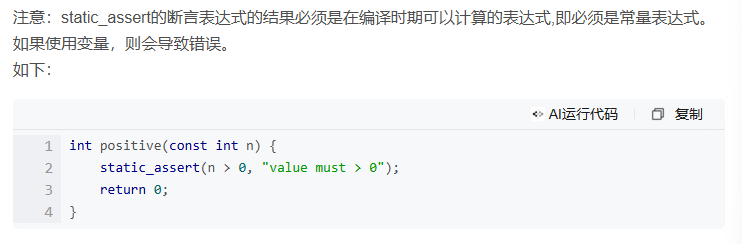


#### 参考

[c++11：static_assert 与assert_c++assert和static assert-CSDN博客](https://blog.csdn.net/drdairen/article/details/76689014)

## try-catch-throw

程序的错误大致可以分为三种，分别是语法错误、逻辑错误和运行时错误：
1) 语法错误在编译和链接阶段就能发现，只有 100% 符合语法规则的代码才能生成可执行程序。语法错误是最容易发现、最容易定位、最容易排除的错误，程序员最不需要担心的就是这种错误。

2) 逻辑错误是说我们编写的代码思路有问题，不能够达到最终的目标，这种错误可以通过调试来解决。

3) 运行时错误是指程序在运行期间发生的错误，例如除数为 0、内存分配失败、数组越界、文件不存在等。C++ 异常（Exception）机制就是为解决运行时错误而引入的。

运行时错误如果放任不管，系统就会执行默认的操作，终止程序运行，也就是我们常说的程序崩溃（Crash）。C++ 提供了异常（Exception）机制，让我们能够捕获运行时错误，给程序一次“起死回生”的机会，或者至少告诉用户发生了什么再终止程序。


```c++
try{
    // 可能抛出异常的语句
    ...
    if (...)
    	throw ...
	...
}catch(exceptionType variable){
    // 处理异常的语句
}
```

> 这就好比，catch 告诉 try：你去检测一下程序有没有错误，有错误的话就告诉我，我来处理，没有的话就不要理我！

```c++
#include <iostream>
#include <string>
#include <exception>
using namespace std;

int main(){
    string str = "http://c.biancheng.net";
  
    try{
        char ch1 = str[100];
        cout<<ch1<<endl;
    }catch(exception e){
        cout<<"[1]out of bound!"<<endl;
    }

    try{
        char ch2 = str.at(100);
        cout<<ch2<<endl;
    }catch(exception &e){  //exception类位于<exception>头文件中
        cout<<"[2]out of bound!"<<endl;
    }

    return 0;
}
```

> output:
>
> 
>
> [2]out of bound!
>
> > [1]不会throw
> >
> > [2]会throw
> >
> > string.at()源码：
> >
> > ```c++
> >       at(size_type __n)
> >       {
> > 	if (__n >= size())
> > 	  __throw_out_of_range_fmt(__N("basic_string::at: __n "
> > 				       "(which is %zu) >= this->size() "
> > 				       "(which is %zu)"),
> > 				   __n, this->size());
> > 	return _M_data()[__n];
> >       }
> > ```


### 场景

```c++
#include <iostream>
#include <string>
#include <exception>
using namespace std;

int main(){
    try{
        throw "Unknown Exception";  //抛出异常
        cout<<"This statement will not be executed."<<endl;
    }catch(const char* &e){
        cout<<e<<endl;
    }

    return 0;
}
```

自定义 `exception`

```c++
```


### ref

- https://c.biancheng.net/view/2330.html

## 堆栈内存管理

### 程序内存分区

栈：是由编译器在需要时自动分配，不需要时自动清除的变量存储区。通常存放局部变量、函数参数等。

堆：是由`new/malloc`（`new`底层实现代码中调用了`malloc`，`new`可以看成是`malloc`智能化的高级版本）分配的内存块，由程序员释放（==编译器不管==, 但是`STL`遵循`RAII`原则，会自行管理内存）。一般一个new与一个delete对应，一个new[]与一个delete[]对应。如果程序员没有释放掉， 资源将由操作系统在程序结束后自动回收。

全局/静态存储区：全局变量和静态变量被分配到同一块内存中。

> 在C语言中，全局变量又分为初始化的和未初始化的，C++中没有这一区

常量存储区：这是一块特殊存储区，里边存放常量(和代码？），不允许修改


程序的==内存布局和组织可能会根据所使用的操作系统和体系结构而有所不同==。然而，一般来说，内存可以分为以下几个部分:

- **全局段**（ Global segment ）：负责存储全局变量和静态变量，这些变量的生命周期等于程序执行的整个持续时间。
- **代码段**（ Code segment ）：也称为文本段，包含组成我们程序的实际机器代码或指令，包括函数和方法。
- **堆栈**（ Stack ）：用于管理==局部变量、函数参数和控制信息==（例如返回地址）
- **堆**（ Heap ）：提供了一个灵活的区域来存储==大型数据结构==和具有==动态生命周期==的对象。堆内存可以在程序执行期间==分配或释放==

> [!NOTE]值得注意的是，**内存分配**上下文中的堆栈和堆不应与**数据结构**堆栈和堆混淆。

### 栈(**Stack**)

**堆栈简称为堆栈**。

#### 特点

- ==固定大小==： 当涉及到堆栈内存时，其大小保持固定，并在程序执行开始时确定。
- 速度优势： 堆栈内存帧是==连续==的。因此，在==堆栈内存中分配和释放内存的速度非常快==。这是通过操作系统管理的堆栈指针对引用进行简单调整来完成的。

- 控制信息和变量的存储： 堆栈内存负责容纳控制信息、局部变量和函数参数，包括返回地址。
- 有限的可访问性： 请务必记住，存储在堆栈内存中的数据==只能在活动函数调用期间访问==。
- 自动管理： 堆栈内存的高效管理由系统==本身完成==，不需要我们额外的工作(不需要free)。


#### 举例


初始堆栈段为空


为主函数创建一个新的堆栈帧


在 main 函数的堆栈帧中，局部变量 x 现在的值为 5


调用 `add` 函数，实际参数为 (5, 10)


控制权转移到 `add` 函数，为 `add` 函数创建一个==新的堆栈帧==，其中包含局部变量 `a、b` 和 `sum`


add 函数的堆栈帧上的 `sum` 变量被分配 `a + b` 的结果

6共 9 个


`add` 函数完成其任务并且==其堆栈帧被销毁==


具有可变结果的主函数的堆栈帧存储从 add 函数返回的值


在显示结果值（此处未显示）后，==主功能块也被销毁==，并且堆栈段再次为空

### 堆(Heap)

也称为`动态内存`

#### 特点

- 大小的灵活性： 堆内存大小可以在程序执行过程中发生变化。
- 速度权衡： 在堆中==分配和释放内存速度较慢==(索引速度呢？)，因为它==涉及寻找合适的内存帧和处理碎片==。
- 持久数据： 存储在堆内存中的数据将==一直保留==在那里，直到我们==手动释放它或程序结束==。
- 手动管理： 在某些编程语言（例如C和C++）中，必须手动管理堆内存。如果处理不当，可能会导致==内存泄漏或资源使用效率低下==。


#### 举例


栈段和堆段为空


为主函数创建一个新的堆栈帧

2共 7 个


局部变量值被赋予值 42


在堆上分配了一个指针变量`ptr`，指针`ptr`中存放的是分配的堆内存的地址（即0x1000）！


`value`变量中存储的值（即42）被赋值给`ptr`指向的内存位置（堆地址0x1000）


堆上地址 0x1000 处分配的内存被释放，ptr 成为悬空指针


main函数的栈帧从栈中弹出（显示result的值后），栈段和堆段再次清空

> 注意：C++ 标准库还提供了一系列智能指针，可以帮助自动化堆中内存分配和释放的过程。


### 申请后系统的响应

#### 栈

只要栈的剩余空间大于所申请空间，系统将为程序提供内存，否则将报异常提示栈溢出。

#### 堆

首先应该知道==操作系统有一个记录空闲内存地址的链表==，当系统收到程序的申请时，会==遍历该链表==，寻找第一个空间==大于==所申请空间的堆结点，然后将该结点从空闲结点链表中删除，并将该结点的空间分配给程序

由于找到的堆结点的大小不一定正好等于申请的大小，系统会自动的将多余的那部分重新放入空闲链表中

对于大多数系统，会在这块内存空间中的首地址处记录本次分配的大小，这样，代码中的delete语句才能正确的释放本内存空间

### 申请大小的限制

#### 栈

在`Windows`下,栈是==向低地址扩展==的数据结构，是一块==连续的内存的区域==。这句话的意思是栈顶的地址和栈的最大容量是系统预先规定好的，在`Windows`下，栈的大小是2M（也有的说是1M，总之是一个==编译时就确定的常数==），如果申请的空间超过栈的剩余空间时，将提示`overflow`。因此，能从栈获得的==空间较小==。

#### 堆

堆是==向高地址扩展==的数据结构，是==不连续==的内存区域。这是由于系统是用==链表==来存储的空闲内存地址的，自然是不连续的，而链表的遍历方向是由低地址向高地址。堆的大小==受限于计算机系统中有效的虚拟内存==。由此可见，堆获得的空间==比较灵活，也比较大==。


### 申请和释放效率的比较

#### 栈

由系统自动分配，速度较快。但程序员是无法控制的。

无需操作系统接入

分配和释放顺序进行，不会产生内存碎片。

分配连续，具有良好的缓存局部性，CPU缓存可高效预取数据，提高访问速度。

#### 堆

由new分配的内存，一般速度比较慢，而且容易产生内存碎片,不过用起来最方便

分配和释放可能涉及操作系统介入(如通过 `brk` 或 `mmap` 系统调用扩展堆空间)

可能设计用户态和内核态的切换，增加额外开销。

分配和释放随机进行，可能导致内存碎片，降低内存分配器效率，增加分配和释放时间。

分配分散，缓存局部性较差，CPU缓存可能无法高效预取数据，导致访问速度较慢。

### 线程安全性

#### 栈

每个线程有独立栈，分配和释放线程私有，==无需考虑线程同步==。

#### 堆

==全局共享==，分配和释放可能涉及==线程同步==(如锁机制)，增加额外开销。


### 参考

- [堆栈与堆（Stack vs Heap）：有什么区别？图文并茂拆解代码解析！_内存_存储_函数 (sohu.com)](https://roll.sohu.com/a/709585652_121124377)
- [【笔记】C++的内存管理:堆和栈 - 知乎](https://zhuanlan.zhihu.com/p/448259227)


## 标准库

### 系统库

```bash
   1. `/usr/include/c++/7`: The standard C++ library (like <vector>, <iostream>).
   2. `/usr/include/x86_64-linux-gnu/c++/7`: Architecture-specific C++ headers.
   3. `/usr/include/c++/7/backward`: Backward compatibility headers.
   4. `/usr/lib/gcc/x86_64-linux-gnu/7/include`: GCC-specific headers.
   5. `/usr/local/include`: Third-party libraries you installed manually (often empty by
      default).
   6. `/usr/include/x86_64-linux-gnu`: System architecture specific headers.
   7. `/usr/include`: The standard Linux system headers (like <stdlib.h>, <unistd.h>).
```

##### include "*" 和 \<*> 的区别

   1. `#include "filename"` (Quoted form):
       * Priority: Checks the current directory (where the source file is located) first.
       * Fallback: If not found, it searches the standard system/include paths (same as <>).
       * Usage: Best for your own project's local header files (e.g., #include "my_class.h").

   2. `#include <filename>` (Angle-bracket form):
       * Priority: Searches ==only the standard system directories== and include paths specified by
         the compiler (e.g., via -I flags).
       * Usage: Best for standard libraries (e.g., #include <iostream>, #include <vector>) or
         third-party libraries installed system-wide.


#### GNU C Library

GNU 是由 Richard Stallman（理查德·斯托曼）在 1983 年发起的，其核心思想是 自由（Freedom）

Linux 其实只是一个内核（系统的核心引擎，负责管理硬件）。GNU 提供了运行在这个内核之上的所有外壳（编译器、图形界面、命令行工具、库文件等）。

GNU C Library（通常简称为glibc）是一个按照GNU通用公共许可证（GPL）发布的自由软件，它是C语言的标准库在GNU系统和其他类Unix系统中的实现。它是Linux操作系统中最广泛使用的C库之一，提供了程序与系统接口之间的接口。

特点：
兼容性：glibc遵循ISO C和POSIX标准，确保编写的C程序可以在多种系统上运行。
性能：glibc经过优化，提供了高效的系统调用和库函数。
稳定性：作为一个长期维护的项目，glibc强调稳定性和安全性。
扩展性：支持多种架构和平台，且允许开发者通过添加自己的代码来扩展库。
自由软件：遵循GPL许可，允许用户自由使用、修改和分发。

应用场景：
系统编程：glibc提供了文件I/O、进程控制、信号处理等系统级操作的功能。
应用开发：任何使用C语言的软件开发项目都可以使用glibc作为其基础库。
教育和科研：作为自由软件，glibc常用于教育和科研领域，以便学习和研究操作系统和编程语言。
嵌入式系统：虽然glibc相对较大，但它的某些部分也可以用于嵌入式系统，尤其是需要标准化和兼容性的场合


### algorithm库

#### 1. 排序算法

**sort**(container.begin(), container.end(), compare_function);

**std::partial_sort**: 对部分区间排序，前 n 个元素为有序。

**std::stable_sort**: 稳定排序，保留相等元素的相对顺序。

#### 2. 搜索算法

auto it = **find**(container.begin(), container.end(), value);

> 如果找到，it 将指向匹配的元素；如果没有找到，it 将等于 container.end()。

**std::binary_search**: 对有序区间进行二分查找。

**std::find_if**: 查找第一个满足特定条件的元素。

#### 3. 复制算法

**copy**(source_begin, source_end, destination_begin);

#### 4. 比较算法

bool result = **equal**(first1, last1, first2, compare_function);

#### 5. 修改算法

**std::reverse**: 反转区间内的元素顺序。

```
std::reverse(vec.begin(), vec.end());
```

**std::fill**: 将指定区间内的所有元素赋值为某个值。

```
std::fill(vec.begin(), vec.end(), 0);  // 所有元素设为 0
```

**std::replace**: 将区间内的某个值替换为另一个值。

```
std::replace(vec.begin(), vec.end(), 1, 99);  // 将所有 1 替换为 99
```

**std::copy**: 将区间内的元素复制到另一个区间。

```
std::vector<int> vec2(6);
std::copy(vec.begin(), vec.end(), vec2.begin());
```

#### 6. 排列算法

**std::next_permutation**: 生成字典序的下一个排列，如果没有下一个排列则返回 false。

```
std::vector<int> vec = {1, 2, 3};
do {
    for (int n : vec) std::cout << n << " ";
    std::cout << std::endl;
} while (std::next_permutation(vec.begin(), vec.end()));
```

**std::prev_permutation**: 生成字典序的上一个排列。

```
std::prev_permutation(vec.begin(), vec.end());
```

#### 7. 归并算法

**std::merge**: 将两个有序区间合并到一个有序区间。

```
std::vector<int> vec1 = {1, 3, 5};
std::vector<int> vec2 = {2, 4, 6};
std::vector<int> result(6);
std::merge(vec1.begin(), vec1.end(), vec2.begin(), vec2.end(), result.begin());
```

**std::inplace_merge**: 在单个区间中合并两个有序子区间。

```
std::inplace_merge(vec.begin(), middle, vec.end());
```


#### 8. 集合算法

**std::set_union**: 计算两个有序集合的并集。

```
std::vector<int> result(10);
auto it = std::set_union(vec1.begin(), vec1.end(), vec2.begin(), vec2.end(), result.begin());
result.resize(it - result.begin());
```

**std::set_intersection**: 计算两个有序集合的交集。

```
auto it = std::set_intersection(vec1.begin(), vec1.end(), vec2.begin(), vec2.end(), result.begin());
result.resize(it - result.begin());
```

**std::set_difference**: 计算集合的差集。

```
auto it = std::set_difference(vec1.begin(), vec1.end(), vec2.begin(), vec2.end(), result.begin());
result.resize(it - result.begin());
```

#### 9. 其他有用算法

**std::accumulate**（需要 <numeric> 库）**：计算范围内元素的累计和。

```
#include <numeric>
int sum = std::accumulate(vec.begin(), vec.end(), 0);
```

**std::for_each**: 对区间内的每个元素执行操作。

```
std::for_each(vec.begin(), vec.end(), [](int& x) { x += 1; });
```

**std::min_element** 和 **std::max_element**: 查找区间内的最小值和最大值。

```
auto min_it = std::min_element(vec.begin(), vec.end());
auto max_it = std::max_element(vec.begin(), vec.end());
```


### numeric库

C++ 标准库中的 `<numeric>` 头文件提供了一组用于数值计算的函数==模板==，这些函数可以对容器中的元素进行各种数值操作，如==求和、乘积、最小值、最大值==等。这些函数模板非常强大，可以应用于==任何类型的容器==，包括数组、向量、列表等。

#### 1. `accumulate`

`accumulate` 函数用于计算容器中所有元素的总和。它接受三个参数：容器的开始迭代器、结束迭代器和初始值。

#### 2. `inner_product`

`inner_product` 函数用于计算两个容器中对应元素乘积的总和。

#### 3. `partial_sum`

`partial_sum` 函数用于计算容器中元素的部分和，并将结果存储在另一个容器中。

#### 4. `adjacent_difference`

`adjacent_difference` 函数用于计算容器中相邻元素的差值，并将结果存储在另一个容器中。

#### 5. std::gcd

使用 std::gcd 计算两个整数的最大公约数

#### 6. std::lcm

使用 std::lcm 计算两个整数的最小公倍数

#### 7. std::iota

使用 std::iota 填充范围内的序列值。

#### 8.查找最大值与最小值

`min_element` 和 `max_element` 函数用于找到容器中的最大值和最小值。

### limit

`numeric_limits`模板类

- 如果你想获取`int`类型的最大/小值

  `std::numeric_limits<int>::max()`

  `std::numeric_limits<int>::min()`

- 

### 文件/文本处理

#### std::i/ofstream

```c++
file_obj.open("file_path", ios::xxx)
file_obj.close()
<<
>>
// 定位到 fileObject 的第 n 个字节（假设是 ios::beg）
fileObject.seekg( n );
// 把文件的读指针从 fileObject 当前位置向后移 n 个字节
fileObject.seekg( n, ios::cur );
// 把文件的读指针从 fileObject 末尾往回移 n 个字节
fileObject.seekg( n, ios::end );
// 定位到 fileObject 的末尾
fileObject.seekg( 0, ios::end );
```

| 模式标志   | 描述                                                         |
| :--------- | :----------------------------------------------------------- |
| ios::app   | 追加模式。所有写入都追加到文件末尾。                         |
| ios::ate   | 文件打开后定位到文件末尾。                                   |
| ios::in    | 打开文件用于读取。                                           |
| ios::out   | 打开文件用于写入。                                           |
| ios::trunc | 如果该文件已经存在，其内容将在打开文件之前被截断，即把文件长度设为 0。 |


##### 参考

[C++ 文件和流 | 菜鸟教程](https://www.runoob.com/cplusplus/cpp-files-streams.html)

#### std::filesystem

> [!CAUTION]
>
> 在g++ 15.1 的cmake中要
>
> target_link_libraries(${binary} stdc++fs)

`filesystem` 源自boost.filesystem库，在C++17合并进C++标准库中，filesystem中的所有操作是==线程不安全==的。


```cpp
namespace fs = std::filesystem;
fs::path p1 = "/usr/lib/sendmail.cf"; // portable format
path += 和 / 操作
p1.has_extension()
p.extension()
fs::exists(p1)
遍历指定目录所有内容:https://zhuanlan.zhihu.com/p/703768306
文件类型判断::file_type枚举类

```

[理解C++17 filesystem 库的使用 - 知乎](https://zhuanlan.zhihu.com/p/703768306)

### 并行相关

#### 线程

##### thread

##### mutex/shared_mutex/lock_guard/unique_lock

unique_lock是个类模板，工作中，一般lock_guard(推荐使用)；lock_guard取代了mutex的lock()和unlock();

unique_lock比lock_guard灵活很多，效率上差一点，内存占用多一点。

##### atomic

##### asnyc/future

#### 协程

C++20

协程==是一个函数==，它可以暂停以及恢复执行。

普通函数是线程相关的，函数的状态跟线程紧密关联；而==协程是线程无关的==，它的状态与任何线程都没有关系。

##### 协程和普通函数（线程）的区别

- 函数 `Foo()` 调用普通函数 `Bar()` 的过程如下所示

  普通函数状态的维护完全依赖于线程栈，脱离了线程，函数就不复存在，所以说普通函数是线程相关的。

- 假设 `Bar()` 是一个协程，那么调用它的过程如下所示

  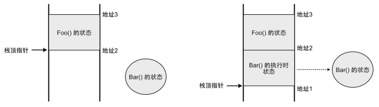

  首先， `Bar()` 的`状态`所需的内存会==在堆上分配，独立于线程栈而存在==。传递给它的参数都会复制到这个状态中，而局部变量会直接在这个状态中创建。调用 `Bar()` 的时候，由于本质上还是一个函数调用，所以栈顶指针也会往下移动，在栈上给执行 `Bar()` 所需的状态分配空间，其中会有==一个引用指向在堆上的状态==，这样一来， `Bar()` 就可以像一个普通函数那样执行了，线程也可以访问到位于堆上的状态。

  如果协程需要暂停，那么当前执行到的代码位置会记录到堆的状态中。然后栈上的执行时状态被销毁，栈顶指针移动以回收空间，就像普通函数结束时那样。在下一次恢复执行时，堆状态中记录的暂停位置会读取出来，从这个位置接着执行。这样就实现了一个可暂停和恢复执行的函数。

  由此可见，当协程执行的时候，它跟普通函数一样，也是需要依赖线程栈；但是，==一旦它暂停了，它的状态就会独立保存在堆中，此时它跟任何线程都没有关系==，调用它的线程可以继续去做其它事情而不会停止。在下一次恢复执行时，协程可以由上次执行的线程来执行，==也可以由另外一个完全不同的线程来执行。所以说协程是线程无关的==。

##### 参考

[C++ 多线程库  | 菜鸟教程](https://www.runoob.com/cplusplus/cpp-libs-thread.html)

[C++多线程编程入门教程 | 现代C++并发编程指南 | C++ 编程指南](https://chengxumiaodaren.com/docs/concurrent/cpp-concurrent-tutorial/)


### random

#### 生成种子值

方法1：使用std::random_device

```c++
#include <chrono>
#include <random>
#include<iostream>
 
 
int main() {
	
	std::random_device rd; // 创建一个std::random_device对象
	
	unsigned int seed = rd(); // 生成一个随机的种子值
	
	std::mt19937 engine(seed); // 使用随机的种子值创建一个伪随机数生成器
  	
  	std::cout<<engine();
  	
	return 0;
}
```
方法2：使用时间戳

```c++
#include <chrono>
#include <random>
#include <iostream>
 
unsigned int generateSeedFromTimestamp() {
  auto now = std::chrono::system_clock::now(); // 获取当前时间点
  auto timestamp = std::chrono::duration_cast<std::chrono::milliseconds>(now.time_since_epoch()); // 转换为毫秒级的时间戳
 
  return static_cast<unsigned int>(timestamp.count()); // 将时间戳转换为整数种子值
}
 
int main() {
  unsigned int seed = generateSeedFromTimestamp(); // 生成种子值
 
  std::mt19937 engine(seed); // 使用种子值初始化伪随机数生成器
 
  std::cout<<engine();
 
  return 0;
}
```


#### std::shuffle

• std::shuffle 的结果只由“==引擎类型 + 引擎当前状态 + 序列长度==”决定；同样的初始状态 → 一样的排
  列，不同状态 → 通常不一样（但有极小概率碰巧一样）。

  结果一样的情况

  - 两次 shuffle 用的是“相同种子、相同引擎类型、且引擎在调用前的状态完全一致”，比如：
      - std::mt19937 gen(123); 然后 auto gen2 = gen;，分别用 gen 和 gen2 shuffle 两个向量。
      - 每次 shuffle 前都 gen.seed(123); 重置到同一状态。
  - 同一程序/同一标准库实现里、引擎状态一致，结果就是确定性的。

  结果不一样的情况

  - ==用同一个引擎连续 shuffle 两次==（不重置）：第一次会消耗随机数、推进状态，第二次状态已不同。
  - 不同种子或用 std::random_device 作为种子来源（每次不同概率很高）。
  - 中间调用了其他随机操作（引擎状态被提前消耗）。
  - 不同的引擎类型/参数（例如 mt19937 vs mt19937_64）。
  - 跨标准库/平台实现时，可能存在实现差异（虽然同一实现里是确定的）。

  补充：即使状态不同，也有极小概率“碰巧”洗牌后完全一致。


#### Ref

- https://blog.csdn.net/m0_61629312/article/details/132327242


### 其他

C++ 标准库中的 `<complex>` 头文件提供了对复数的支持。

C++ 的 `<valarray>` 库是一个用于数值计算的库

`<cstdint>` 是 C++11 引入的一个头文件，它定义了一组固定宽度的整数类型，这些类型在不同的平台上具有相同的大小和表示范围。


## 其他库

### Boost库

[Boost](https://www.boost.org/)

#### 安装

```bash

```


#### 简介

Boost是一个流行的、开源的**C++库集合**，提供了各种功能强大的库和工具，扩展了C++语言的能力，并为开发者提供了更高级别的抽象和工具。Boost库经过广泛的使用和测试，被认为是C++社区的事实标准之一

Boost库包含了多个模块，每个模块都提供了不同领域的功能和工具，覆盖了诸如字符串操作、数据结构、算法、日期时间处理、文件系统、线程、网络、正则表达式等各个方面。以下是一些常用的Boost库：

>1.Boost.Asio：提供了异步I/O操作的网络编程库，支持TCP、UDP、串口等网络协议。 
>
> 2.Boost.Smart_Ptr：提供了**智能指针类**，如shared_ptr和weak_ptr，用于方便地进行内存管理。 
>
> 3.Boost.Filesystem：提供了对**文件系统**的访问和操作，包括文件和目录的创建、删除、遍历等。 
>
> 4.Boost.Regex：提供了**正则表达式**的功能，用于进行文本匹配和搜索操作。 
>
> 5.Boost.Thread：提供了**跨平台的多线程编程接口**，简化了线程的创建、同步和通信等操作。 
>
> 6.Boost.Serialization：提供了对象的序列化和反序列化功能，可以将对象以二进制或XML格式进行存储和传输。 
>
>7.Boost.Math用于数学计算
>
>8.Boost.Graph用于**图论算法** [Chapter 31. Boost.Graph](https://theboostcpplibraries.com/boost.graph)
>
>9.Boost.Algorithm - 提供了包括排序、搜索等在内的**各种算法**。
>
>10.Boost.Numeric - 提供了用于数值计算的库，如用于线性代数、随机数生成等


> [!TIP]
>
> 尝试过单独build boost::graph 库，但是不行，还是要整体build。


#### graph


#### bitmap


#### 参考

1. [【C++】开源：Boost库常用组件配置使用-腾讯云开发者社区-腾讯云](https://cloud.tencent.com/developer/article/2438818)
2. 项目Github地址：`https://github.com/boostorg/boost`
3. Boost库在线书籍：`https://wizardforcel.gitbooks.io/the-boost-cpp-libraries/content/0.html`
4. [官方文档：The Boost C++ Libraries](https://theboostcpplibraries.com/)


### OpenAccess2.2

- 一个EDA的C++底层api库
- 汉擎pdk对标
- cadence 的
- tutorial
  - [OpenAccess 2.2 API hierarchy](https://oa22doc.github.io/hierarchy.html)
  - [OpenAccess 2.2 API classes_sel](https://oa22doc.github.io/classes_sel.html)
  - [OpenAccess 2.2 API guide](https://oa22doc.github.io/guide/index.html)
  - [eda/OpenAccess™ Release 2.2 Standard API Tutorial by David Mallis (z-lib.org).pdf at main · liletian/eda](https://github.com/liletian/eda/blob/main/OpenAccess™ Release 2.2 Standard API Tutorial by David Mallis (z-lib.org).pdf)


### Lemon

[LEMON](https://lemon.cs.elte.hu/trac/lemon)

**LEMON** stands for **L**ibrary for **E**fficient **M**odeling and **O**ptimization in **N**etworks. It is a `C++ template library` providing efficient implementations of common data structures and algorithms with focus on ==combinatorial optimization tasks== connected mainly with ==graphs== and networks.


### Eigen

a C++ template library for linear algebra: matrices, vectors, numerical solvers, and related algorithms.


### lp_solver

##### install

```bash
pip install lpsolve55
lp_solver -h
```


### Gurobi

Gurobi 是一款强大的==商业==优化求解器，能够高效地解决线性规划（LP）、二次规划（QP）、混合整数规划（MIP）等多种优化问题。

适用C++、Python


### pybind

#### 配置

- pybind11可以使用==CMake==作为构建系统。在你的CMakeLists.txt文件中，需要添加对Python和pybind11的查找和链接

  ```cmake
  # 这个配置告诉CMake查找Python3解释器和开发包，以及pybind11库。`pybind11::embed`是pybind11提供的嵌入模式目标，包含了所有必要的链接信息。
  # 查找Python和pybind11
  find_package(Python3 COMPONENTS Interpreter Development REQUIRED)
  find_package(pybind11 REQUIRED)
  
  # 链接库
  target_link_libraries(YourTarget
      pybind11::embed
  )
  
  ```

  - build以后生成一个`name.cpython-311-x86_64-linux-gnu.so`， 然后python就可以直接`import name`

- 也可以使用setuptool, 通过`pip install .`来分装为一个python库

  - TODO


#### 核心概念

**1、Python解释器管理**

在使用pybind11时，首先需要理解Python解释器的管理机制。pybind11提供了Python解释器初始化功能，当你的程序启动时，需要先初始化Python解释器，在程序结束时，需要正确清理Python解释器，这确保所有Python对象被正确释放，避免内存泄漏和资源未清理的问题。

[GIL](https://zhida.zhihu.com/search?content_id=262153685&content_type=Article&match_order=1&q=GIL&zhida_source=entity)（Global Interpreter Lock）是Python解释器的一个重要概念。它确保在同一时间只有一个线程能够执行Python代码，这是Python解释器的设计特性。pybind11使用[RAII](https://zhida.zhihu.com/search?content_id=262153685&content_type=Article&match_order=1&q=RAII&zhida_source=entity)（Resource Acquisition Is Initialization）模式来管理GIL锁，这意味着当你创建一个GIL锁对象时，它会自动获取锁，当对象离开作用域时会自动释放锁。这种方式既安全又方便，避免了手动管理锁的复杂性。

**2、数据转换机制**

数据转换是C++与Python交互的核心。pybind11提供了强大的类型系统，能够自动处理大多数常见数据类型的转换。你可以在C++和Python之间传递基本类型（如整数、浮点数、字符串）、容器类型（如向量、列表、字典）以及自定义类型。

pybind11的类型转换是类型安全的，这意味着它会在编译时检查类型匹配，并在运行时进行必要的转换。这种机制大大减少了手动内存管理的需求，降低了出错的可能性。


#### instll

```bash
apt-get install pybind11
```


#### debug

[VSCode调试使用pybind11的Python和C++代码 - 知乎](https://zhuanlan.zhihu.com/p/683196635)


### ODB

ODB（Object-Relational Mapping）是一个C++库，用于将C++对象映射到关系数据库中。

### Logger

#### [spdlog](https://github.com/gabime/spdlog)

```
├── build
│   ├── CMakeCache.txt
│   ├── CMakeFiles
│   │   ├── 4.2.0
│   │   ├── cmake.check_cache
│   │   ├── CMakeConfigureLog.yaml
│   │   ├── CMakeDirectoryInformation.cmake
│   │   ├── InstallScripts.json
│   │   ├── Makefile2
│   │   ├── Makefile.cmake
│   │   ├── pkgRedirects
│   │   ├── progress.marks
│   │   ├── spdlog_demo.dir
│   │   └── TargetDirectories.txt
│   ├── cmake_install.cmake
│   ├── Makefile
│   └── spdlog_demo
├── CMakeLists.txt
├── main.cpp
└── src
    ├── CMakeLists.txt	#(clone from repo)
    └── thirdparty
        └── spdlog	#(headers clone from repo)
```

```cmake
cmake_minimum_required(VERSION 3.20)

project(spdlog_demo LANGUAGES CXX)

set(CMAKE_CXX_STANDARD 20)
set(CMAKE_CXX_STANDARD_REQUIRED ON)
set(CMAKE_CXX_EXTENSIONS OFF)

add_library(spdlog_header_only INTERFACE)
target_include_directories(
    spdlog_header_only
    INTERFACE
    ${CMAKE_CURRENT_SOURCE_DIR}/src/third_party
)

add_executable(spdlog_demo main.cpp)
target_link_libraries(spdlog_demo PRIVATE spdlog_header_only)
target_compile_features(spdlog_demo PRIVATE cxx_std_20)
```


### cairo

#### install

`conda install cairo`

### Raylib

### Dear ImGui

### 参考

- [C++知识库 | 收录各种各样的 C++ 优质内容](https://cpp-reference.com/)
- [程序喵/cpp-learning](https://gitee.com/chengxumiaodaren/cpp-learning)

## 多线程

### 进程与线程的区别


- 进程是正在运行的程序的实例，是可以执行的程序或文件(例如: exe)；而线程是是进程中的实际运作单位，指的是进程的指定单元,也叫执行路径

- 一个程序有且只有一个进程，但可以拥有至少一个的线程

- ==不同进程拥有不同的**地址空间**，互不相关;而不同线程共同拥有相同进程的地址空间==

- 线程是**CPU**调度和分配的基本单位，可以理解为CPU只看得到线程；进程是**操作系统**进行资源分配的最小单位

  >当你执行这个程序时，CPU响应为该进程分配资源对其进行处理，但是CPU看不到"进程"， 看到的是由很多个线程组成的一个网络（就是一个进程），于是CPU开始为这些线程利用`时间分配算法`来循环执行任务。


### 并发和并行

**并发**： 指的是两个(或以上)的线程同时请求执行，但是同一瞬间CPU只能执行一个，于是CPU就安排他们**交替**执行，我们看起来好像是同时执行的，其实不是。并发可认为是一种逻辑结构的设计模式。你可以用并发的设计方式去设计模型，然后运行在一个单核系统上，通过系统动态地逻辑切换制造出并行的假象。

> 并发在生活中随处可见，单核CPU边听歌边写代码

**并行**： 指的是两个(或以上)的线程**同时**执行。     


### Deadlock问题与解决方法

**死锁（Deadlock）** 是最危险的并发问题之一，指两个或多个线程因互相等待对方释放资源而永久阻塞。以下是关于死锁的完整解析、典型场景及解决方案：

------

#####  死锁的四大必要条件

死锁发生必须同时满足以下四个条件：

1. **互斥（Mutual Exclusion）**：资源被独占，一次只能被一个线程持有。
2. **持有并等待（Hold and Wait）**：线程持有至少一个资源，同时等待获取其他资源。
3. **不可抢占（No Preemption）**：资源只能由持有线程主动释放，不可强制剥夺。
4. **循环等待（Circular Wait）**：多个线程形成环形等待链，如 A 等 B，B 等 A。


### 多线程与核心数查看

```bash
# ubuntu下查看电脑CPU核数，CPU个数，最大线程数(逻辑CPU的数量)
## CPU个数
more /proc/cpuinfo |grep "physical id"|uniq|wc -l    # 1

## 查看CPU核数
cat /proc/cpuinfo| grep "cpu cores"| uniq      # 6

## 查看最大线程数(逻辑CPU的数量)
more /proc/cpuinfo |grep "physical id"|grep "0"|wc -l    # 12
```


## Tips

### 数值类型的差异

在不同的平台，声明特定大小整数的方法不同，我们可以使用标准头文件`stdint.h`，声明特定大小的整型，该方法还==可以跨平台，可移植==。

大多数情况下，整数运算非常快，但是，如果整数大于可用寄存器大小，效率就会低一些。例如，在32位系统中，使用64位整数效率低一些，特别是用于乘法或除法时。

如果声明了int类型，但是==没有指定具体大小，编译器将始终选择最有效的整数大小==。较小大小的整数如char、shortint等，效率可能稍微低一些，在很多情况下，编译器在进行计算时，会将这些类型转换为默认大小的整数，然后只使用结果中的低8位或者低16位。

在64位系统中，只要我们不做除法，使用32位整数和64位整数的效率其实没多大差别。

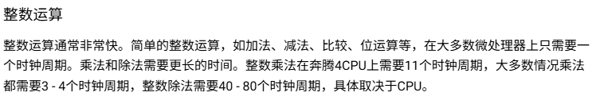


### void指针

在 `ANSI C` 标准中，不允许对 void 指针进行一些算术运算如 p++ 或 p+=1 等，因为既然 void 是无类型，那么每次算术运算我们就不知道该操作几个字节，例如 char 型操作 sizeof(char) 字节，而 int 则要操作 sizeof(int) 字节。而在 GNU 中则允许，因为在默认情况下，`GNU` 认为 `void *` 和 `char *` 一样，既然是确定的，当然可以进行一些算术操作，在这里`sizeof(p)==sizeof(char)`。

[C 语言中 void* 详解及应用 | 菜鸟教程](https://www.runoob.com/w3cnote/c-void-intro.html)


### 结构化绑定

pair/tuple/tie

[value1, value2] = function_return_pair/tuple()


### std::optional

C++ 17 引入

std::nullopt

[C++ std::optional 使用教程 - 知乎](https://zhuanlan.zhihu.com/p/639111975)


### std::variant

std::visit

std::get

std::monostate

std::get_if

std::bad_variant_access

[C++17 std::variant 详解：概念、用法和实现细节 - 非法关键字 - 博客园](https://www.cnblogs.com/linxmouse/p/18436326)


### std::any

std::any

std::any_cast

std::any::has_value

[C++语法糖(std::any)详解以及示例代码 - 知乎](https://zhuanlan.zhihu.com/p/628815313)


### IO 密集型与 cpu 密集型任务

[I/O密集型（I/O-bound）和CPU密集型（CPU-bound）](https://juejin.cn/post/7467819981926137867)


### 传引用和传指针的区别


### const形参报错

```c++
#include <iostream>
void takes_nonconst(int& x) { x += 1; }
void takes_const(const int& x) { std::cout << x << "\n"; }
int main() {
    int a = 10;
    const int ca = 20;
    takes_nonconst(a);      // OK：非 const 实参 -> 非 const 引用
    takes_const(a);         // OK：非 const 实参 -> const 引用
    takes_const(ca);        // OK：const 实参 -> const 引用
    takes_nonconst(ca);     // 错：不能把 const 绑定到非常量引用
    // error: binding reference of type 'int&' to 'const int' discards qualifiers
    return 0;
}
```


### others

- 使用`#include <bits/stdc++.h>`，这个库包含了常见的所有c++标准库
  - 用来做快速测试，实际项目中不要用
  
- 可以`using std::cout`, 而不需要每次都`using namespace std`

- 可以用using重定义一些数据类型
  - `using ll = long long;`
  
- 定义INF: `const long long INF = std::numeric_limits<long long>::max()`

- `#pragma once`

  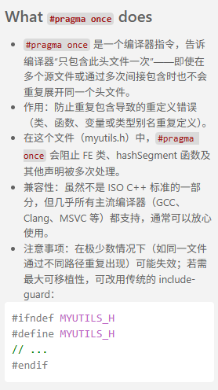

- `static`的作用：

  - [在类和结构体之外](https://www.bilibili.com/video/BV1Dk4y1j7oj?spm_id_from=333.788.videopod.episodes&vd_source=ea5f077dc692dc32725d05ff92da61a5&p=22): 声明以后无法被外部链接文件访问。局部静态：在函数内

    调用一次后就会一直存在

  - [在类和结构体内](https://www.bilibili.com/video/BV1Dk4y1j7oj?spm_id_from=333.788.videopod.episodes&vd_source=ea5f077dc692dc32725d05ff92da61a5&p=23): 相关变量只会有一个实例。同时你可以使用`class_name::static_var`; 同时，静态类方法（函数）没有类实例

- `volatile`

  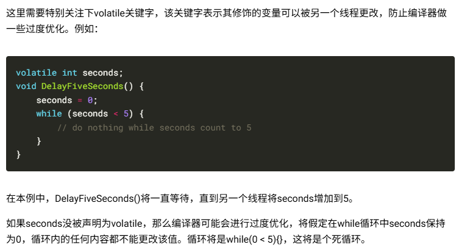

- 指针和引用

  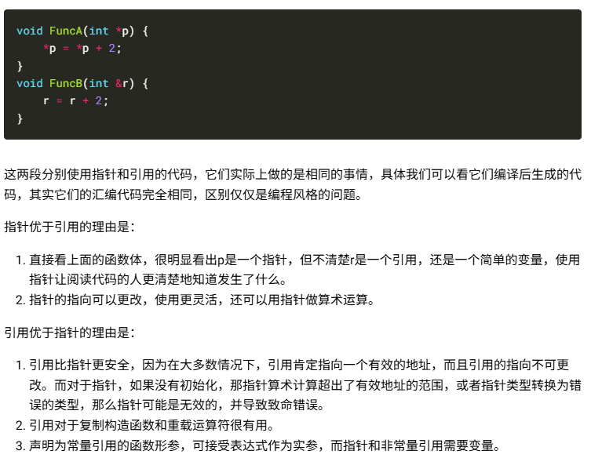

- C++函数传参的4种方式详解

  1. 按值传递

     ```c++
     void increment(int value) {
         value += 1; // 只修改副本
     }
     int main() {
         int a = 5;
         increment(a);
         // a 仍然是 5
     }
     ```

     按值传递的这种方式简单且安全，特别是对于基本数据类型（如 int、char 等），因为它避免了外部数据的无意修改。

     但是他会调用复制构造函数，效率较低

  2. 引用传递

     ```c++
     void increment(int& value) {
         value += 1; // 直接修改原始数据
     }
     int main() {
         int a = 5;
         increment(a);
         // a 现在是 6
     }
     ```

     不同于按值传递，引用传递允许函数==直接操作外部变量==。这意味着在函数内部对参数进行的任何修改都会反映到原始数据上。

     引用传递在需要修改传入数据或传递大型对象而又不想产生额外拷贝成本时非常有用

  3. 按指针传递

     ```c++
     void increment(int* value) {
         if (value) { // 检查指针非空
             *value += 1; // 修改指向的值
         }
     }
     int main() {
         int a = 5;
         increment(&a);
         // a 现在是 6
     }
     ```

     

  4. 右值引用

     C++11 标准新引入了一种引用类型，叫做`右值引用`，用于绑定==即将销毁的对象==（即“右值”），从而允许从原始对象中“移动”资源，而非复制

     右值引用也可以传递参数，非常适合传递临时对象或需要转移所有权的大型[数据结构](https://c.biancheng.net/data_structure/)，因为它减少了不必要的数据复制，提高了程序效率。

     [C++ std::move深入解析 | 移动语义与性能优化 | C++ 编程指南](https://chengxumiaodaren.com/docs/cpp-advanced/cpp-move/)

     ```c++
     void process(std::vector<int>&& data) {
         std::vector<int> local_data = std::move(data); // 从data移动数据到local_data，data 现在为空
     }
     int main() {
         std::vector<int> vec = {1, 2, 3, 4};
         process(std::move(vec)); // vec现在为空，其内容已经被移动到process中的local_data，vec不再含有原来的元素
     }
     ```

  

- 拷贝构造函数一定得传引用

  [C++拷贝构造函数为什么要用引用参数？| 核心概念详解 | C++ 编程指南](https://chengxumiaodaren.com/docs/cpp-advanced/cpp-copy-no-ref/)

- `explicit`隐式转换关键字，表示该构造函数只能显式调用，禁止隐式转换

  [【40】C++隐式转换与explicit关键字_哔哩哔哩_bilibili](https://www.bilibili.com/video/BV1Dk4y1j7oj?spm_id_from=333.788.videopod.episodes&vd_source=ea5f077dc692dc32725d05ff92da61a5&p=41)

  [理解C++中的explicit关键字-CSDN博客](https://blog.csdn.net/weixin_42527589/article/details/147999126)

- 入门：[【92】自己写C++数据结构（Vector数组）_哔哩哔哩_bilibili](https://www.bilibili.com/video/BV1Dk4y1j7oj?spm_id_from=333.788.videopod.episodes&vd_source=ea5f077dc692dc32725d05ff92da61a5&p=93)

- 当你使用 `g++`编译器时，它会**自动**将 C++ 标准库（如 `-lstdc++`）传递给链接器。这是因为 `g++`被设计为专门用于编译 C++ 程序，它预设了你需要这些核心库的支持。如果使用 `gcc`编译 C++ 代码，则需要手动添加 `-lstdc++`参数。

  c++标准库的头文件在编译器中，linux中的默认路径为：`/usr/include/c++/${g++ version}/`, **libstdc++.so** (动态!)库在`/usr/lib/gcc/<target-triplet>/<gcc-version>/`

  

## Bugs

### 1

>vector<int> var1\[m][n];//不行
>vector<vector<vector<int>>> var2\[m][n]；//可以

> //当wire_max_level和wire_max_sublevel较大(1000）时，初始化第258和259行的        “IntVec dst[wire_max_level][wire_max_sublevel];IntVec dst_ports[wire_max_level][wire_max_sublevel];”会报错：Segmentation fault

在C++中，这两种声明方式涉及到多维向量的初始化和存储方式，它们之间存在一些关键的差异：

**vector<int> var1\[m][n];**
这种声明方式试图在栈上创建一个二维数组，其中每个元素是一个 vector<int>。这种声明是非法的，因为标准C++不支持非静态数组大小的非固定大小数组（non-POD types，即包含构造函数、析构函数、虚函数等的类型）作为数组元素。std::vector 是一个非POD类型，因为它有动态内存管理和其他资源管理的需求。

问题：
栈溢出：如果 m 和 n 较大，这种声明可能会因为**栈空间不足而导致编译错误或运行时错误**（如段错误）。
未定义行为：在C++标准中，这种用法是未定义的，因为 vector 需要动态内存分配，而数组的静态内存分配无法满足这一需求。

**vector<vector<vector<int>>> var2\[m][n];**
这种声明方式创建了一个三维向量，其中最外层是一个数组，每个元素是一个二维 vector<int> 的向量。尽管这种声明在语法上是合法的，但它仍然存在效率和安全性问题。

特点：
堆分配：尽管 vector 通常在堆上分配内存，但这种声明方式实际上在栈上创建了一个指向 vector 的指针数组，每个指针指向一个在堆上分配的 vector。
内存管理：这种方式需要手动管理内存，因为数组中的每个 vector 指针都需要适当地构造和析构。
性能问题：每次访问 `var2[i][j]` 时，实际上涉及到两次内存访问：一次是从数组中获取指针，另一次是从 vector 中访问数据。


### 2

```c++
#include <bits/stdc++.h>
class Base {
public:
    bool a;
    Base(bool val) : a(val) {}
};
int main() {
    Base *ptr = nullptr;
    if (ptr->a || 1) {
        std::cout << "ok" << std::endl;
        std::cout << ptr->a << std::endl;
    }
}
```

>ok
>Segmentation fault (core dumped)

```c++
#include <bits/stdc++.h>
class Base {
public:
    bool a;
    Base(bool val) : a(val) {}
};
int main() {
    Base *ptr = nullptr;
    if (ptr->a && 1) {
        std::cout << "ok" << std::endl;
        std::cout << ptr->a << std::endl;
    }
}
```

> Segmentation fault (core dumped)

UB(未定义行为)可能会crash也可能不会？反正一定要避免UB


### 参考

[C++学习之智能指针中的unique_ptr与shared_ptr_C 语言_脚本之家 (jb51.net)](https://www.jb51.net/program/285055q9v.htm)


## 优化

先完成，再完美

谨记`80-20`法则

### 常用小技巧

- x能用`const`, `&`就用

  - ```c++
    bool Compare（string s1, string s2)
    bool Compare(string *s1, string *s2)
    bool Compare(string &s1, string &s2)
    bool Compare(const string &s1, const string &s2)
    ```

  - 其中若使用第一个函数（值传递），则在参数传递和函数返回时，需要调用string的构造函数和析构函数两次（即共多调用了四个函数），而其他的三个函数（指针传递和引用传递）则不需要调用这四个函数。==因为指针和引用都不会创建新的对象==。如果一个构造一个对象和析构一个对象的开销是庞大的，这就是会效率造成一定的影响。

  - 同时加上一个const还有一个好处，就是可以对常量进行引用，若不加上const修饰符，引用是不能引用常量的。

  - const的各种含义：[【34】C++中的CONST_哔哩哔哩_bilibili](https://www.bilibili.com/video/BV1Dk4y1j7oj?spm_id_from=333.788.videopod.episodes&vd_source=ea5f077dc692dc32725d05ff92da61a5&p=35)

- 将小粒度函数声明为内联函数（inline），减少函数调用次数(貌似现在是没用了？)

  - 调用函数是需要保护现场，为局部变量分配内存，函数结束后还要恢复现场等开销，而内联函数则是把它的代码直接写到调用函数处，所以不需要这些开销，但会使程序的源代码长度变大。所以若是小粒度的函数，如下面的Max函数，由于不需要调用普通函数的开销，所以可以提高程序的效率。
  - 和直接用#define一样？
  - [什么是内联函数](https://blog.csdn.net/zengxiaosen/article/details/73784922)

- **避免频繁的内存分配和释放**

  - 使用**对象池技术**预先分配对象？
  - 预先使用`reserve`优化容器：减少动态数组类型的容器在运行时的内存分配次数？

- **使用引用传递而非指针传递**

  - 在某些情况下，使用引用可以避免对象的复制，提高性能
  - 避免在函数调用时复制整个对象，特别是对于大型对象

- **使用位运算替代算术运算**：在低级代码中，位运算通常比算术运算更快（或者bitset?）

- **使用编译器优化选项**：如`-O2`或`-O3`，让编译器进行更多的优化

- **选择合适的数据结构**：例如，使用`std::vector`而不是`std::list`可以提高内存局部性，减少访问时间

- **使用`std::move`进行容器转移**：移动语义可以避免不必要的复制，提高效率

- **使用局部静态变量和成员变量**

- **减少除法运算**：将除法运算转换为乘法运算，以提高效率？(这个编译器会处理吧)

- **使用多线程**：对于可以并行处理的任务，使用多线程可以显著提高性能

  - omp parallel

    对于cpu端的代码，如果for内计算量比较大而且循环体中的操作是线程安全的， 一个简单的方式是开启`OpenMP`

    ```c++
    #include <omp.h>
    //使用 -fopenmp 编译选项
    //使用nvcc编译还需要添加 -Xcompiler
    //曾经实现了将一个2.11s的加速到0.36s
    
    #pragma omp parallel for	//    #pragma omp parallel for num_threads(32)， 也可以指定线程数，但是一般让,这一句会对下一句for循环进行多线程操作
    for(...)
    //注意，范围for(auto obj: objset)在较老的OpenMP版本中不被完全支持。为了确保并行化正常工作，建议改写成传统的索引形式：for(int i=0; i<x; i++)
    ```

- **避免不同数据类型相互操作**：减少数据类型转换，以提高效率（这个应该没什么影响）

- 直接使用现有的封装函数很方便，但是效率不是最好的，简单的功能实现，最好还是自己写源码？

- 对于容器：对于性能敏感且能保证索引合法时用 `[]`，否则建议用 `.at()` 增加安全性。实际中，这两者的性能差异在小型数组访问时通常可以忽略，但在高频率或大规模访问时可能会有影响。

- 避免使用多重继承

- 如果需要大量频繁创建和销毁短期对象，可考虑使用`对象池`。

- 布尔操作

  

- 多态与虚函数

  

  [C++虚函数性能分析：深入解析虚函数开销 | 性能优化 | C++ 编程指南](https://chengxumiaodaren.com/docs/performance/virtual-function/)

- `RTTI`(运行时类型识别)：会向所有类对象添加额外的信息，所以效率不高，可以考虑关闭`RTTI`选项来提高程序效率。

- 多维数组的`cache missing` 问题[【64】C++多维数组_哔哩哔哩_bilibili](https://www.bilibili.com/video/BV1Dk4y1j7oj?spm_id_from=333.788.videopod.episodes&vd_source=ea5f077dc692dc32725d05ff92da61a5&p=65)


### CPU Cache伪共享问题

[CPU Cache伪共享问题：原理与优化指南 | 性能优化 | C++ 编程指南](https://chengxumiaodaren.com/docs/performance/cpu-cache/)

[如何利用CPU Cache写出高性能代码，看这些图就够了！](https://mp.weixin.qq.com/s?__biz=MzkyODU5MTYxMA==&mid=2247492914&idx=1&sn=bd6dde78d06e6668f0879cb0092b44b9&source=41&poc_token=HKU1wWijvvtQ8FELhF1zy4b9PUo-2WMqlLcpRWCV)

### 流水线与分支预测

[CPU分支预测原理：if-else性能优化指南 | 性能优化 | C++ 编程指南](https://chengxumiaodaren.com/docs/performance/branch-predict/)

### 程序体积优化

[程序体积优化指南：十个实用技巧 | 性能优化 | C++ 编程指南](https://chengxumiaodaren.com/docs/performance/size-opt/)

### 类的数据成员

大数组和其他大对象排在最后最常用的数据成员排在前面。如果不能在前128个字节内包含所有数据成员，则将最常用的成员放在前128个字节中。

[C++性能优化设计指南：从类结构到继承模式 | 性能优化 | C++ 编程指南](https://chengxumiaodaren.com/docs/performance/design/)


# C++ Tools

## IDE

### VSCode

#### install extension

公司里面通过`.vsix`文件安装（离线）


#### Better debug view

默认情况, 难以观察：

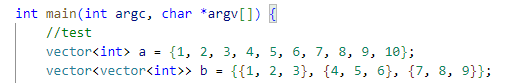

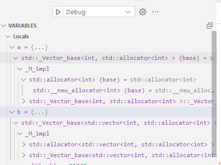


 在`launch.json`中设置：

```json
      "setupCommands": [
        {
          "description": "Test",
          "text": "python import sys;sys.path.insert(0, '/home/pengxuan/Software/miniconda3/envs/cenv/share/gcc-12.4.0/python');from libstdcxx.v6.printers import register_libstdcxx_printers;register_libstdcxx_printers(None)",
          "ignoreFailures": false
        },
        {
          "description": "Enable pretty-printing for gdb",
          "text": "-enable-pretty-printing",
          "ignoreFailures": true
        }
      ]
```

>注意把其中的`/home/pengxuan/Software/miniconda3/envs/cenv/share/gcc-12.4.0/python`路径换成自己环境中的

设置后重新debug

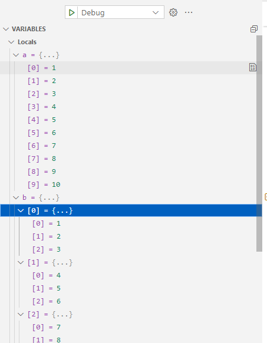

##### ref

- [How can i see the value of elements in STL containers or arrays in debug · Issue #1414 · microsoft/vscode-cpptools](https://github.com/Microsoft/vscode-cpptools/issues/1414)


#### Theme

之前一些关键字一直没有高亮，以为是include_path的问题，后来发现是主题有问题。不过确实发现如果把include_path去掉，会导致一些关键字不会高亮


### CLion


## 编译工具

### g++ 

- g++是GNU的c++编译器

  gcc的全称是`GNU` Compiler Collection，它是一个能够编译==多种语言==的编译器。最开始gcc是作为C语言的编译器（GNU C Compiler），现在除了c语言，还支持C++、java、Pascal等语言。gcc支持多种硬件平台。

- 是一个可移植的编译器，支持多种硬件平台。例如ARM、X86等等。

- 不仅是个本地编译器，它还能跨平台交叉编译。

  所谓的本地编译器，是指编译出来的程序只能够在本地环境进行运行。而gcc编译出来的程序能够在其他平台进行运行。例如嵌入式程序可在x86上编译，然后在arm上运行。

#### 编译过程

1. 预处理（Preprocessing）。由预处理器cpp完成，将.cpp源文件预处理为`.i`文件。预处理实际上是将头文件、宏进行展开。

   ```bash
   g++  -E  test.cpp  -o  test.i    //生成预处理后的.i文件
   ```

2. 编译（Compilation）。由编译器cc1plus完成，将`.i`文件编译为`.s`的汇编文件。使用-S选项，只进行编译而不进行汇编，生成汇编代码。

   ```bash
   g++ -S test.i -o test.s			//生成汇编.s文件
   ```

3. 汇编（Assembly）。由汇编器as完成，将`.s`文件汇编成`.o`的==二进制目标文件==

   汇编器生成的是可重定位的目标文件，学过操作系统，我们知道，在源程序中地址是从0开始的，这是一个相对地址，而程序真正在内存中运行时的地址肯定不是从0开始的，而且在编写源代码的时候也不能知道程序的绝对地址，所以**重定位**能够将源代码的代码、变量等定位为内存具体地址。

   ```bash
   g++  -c  test.s  -o  test.o    //生成二进制.o文件
   
   ```

   

4. 链接（Linking）。由链接器`ld`，将`.o`文件连接生成可执行程序


#### 版本

- GCC 7 (2017)
  - 主要进展：开始大规模支持 C++17 核心语言特性（structured bindings、if constexpr、fold expressions、inline variables 等）和不少库特性。
  - 改进诊断信息和优化生成代码。
- GCC 8 (2018)
  - 主要进展：继续完善 C++17 库实现；改进诊断与未定义行为检测。
  - 对模板/constexpr 相关实现进行修正与增强。
- GCC 9 (2019)
  - 主要进展：C++17 实现更加完备；开始引入对部分 C++20 草案特性的实验性支持（编译器端语言改进、constexpr 扩展等）。
  - 标准库中持续补齐缺失部分。
- GCC 10 (2020)
  - 主要进展：开始大量实现 C++20 特性（如 Concepts 的某些部分、更多 constexpr 能力、常用库更新）；同时引入若干重要行为/兼容性变化（例如在后续点引入的链接行为/默认开关变更在该系列讨论中出现）。
  - 更严格的诊断与警告。
- GCC 11 (2021)
  - 主要进展：C++20 支持显著增强（ranges、coroutines、modules 的早期/实验实现在此及后续版本逐步完善）；libstdc++ 中更多 C++20 库组件可用。
  - 工具链、优化与诊断继续改进。
- GCC 12 (2022)
  - 主要进展：完成或进一步完善大量 C++20 特性；开始引入对 C++23（草案）若干库特性的实现。
  - 性能与诊断增强，更多库接口可用作生产。
- GCC 13 (2023)
  - 主要进展：继续扩展对 C++23 的支持（库与语言特性逐步落地）；进一步稳定 modules、coroutines、ranges 等长期项目的实现。
  - libstdc++ 持续补全 C++23 库。
- GCC 14 (2024+)
  - 主要进展：进一步完善并扩大 C++23 的实现覆盖；持续修复兼容性与性能问题，改进编译器诊断与静态分析能力。
  - 向后兼容性与标准跟进继续进行。

#### Install

```bash
sudo apt -y install build-essential
g++ -v
```

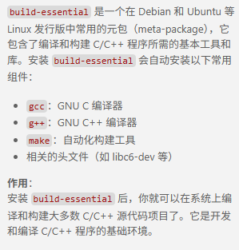

```bash
```


#### 常用命令选项

##### 编译过程选项

`-E` (仅作预处理，不进行编译、汇编和链接）
	只激活预处理,这个不生成文件,你需要把它重定向到一个输出文件里面。例子用法:   
	gcc -E hello.c > pianoapan.txt   
	gcc -E hello.c | more   
	慢慢看吧,一句`hello word`也要预处理成800行的代码。     
`-S` (仅编译到汇编语言，不进行汇编和链接）  
	只激活预处理和编译，就是指把文件编译成为汇编代码。例子用法： 
	gcc -S hello.c   
	将生成.s的汇编代码，可以用文本编辑器查看。    
`-c` (编译、汇编到目标代码，不进行链接）   
	只激活预处理,编译,和汇编,也就是他只把程序做成obj文件。例子用法:   
	gcc -c hello.c   
	将生成.o的目标文件（object file）。 
`-o` (输出到指定的文件）
	指定目标名称，缺省的时候，gcc/g++编译出来的文件是a.out。例子如下：   
	g++ -o hello.out hello.cpp
	g++ -o hello.asm -S hello.cpp   


##### 目录选项

`-I [dir]` （把dir加入到搜索`头文件`的路径列表中）
	g++优先在当前目录查找头文件，如果没有找到，会到系统默认的头文件目录找。如果使用`-I`指定了目录，g++会到`-I`指定的目录查找，查找不到，然后再到系统默认的头文件目录查找
        例子如下:
         `g++ test.c -I ../inc -o test`	

`-L [dir]` （把dir加入到搜索库文件的路径列表中）
	编译的时候，指定搜索库的路径。比如你自己的库，可以用它指定目录，==不然编译器将只在标准库==的目录找。这个dir就是目录的名称。例子如下:
        `g++ -I ../inc -L /home/mylib  test.c -o test -lmythread` 

`-l [library]` （进行链接时搜索名为library的库）  
	指定编译的时使用的库，例子用法   
	`g++  hello.c  -o hello -lpthread`
	使用pthread库编译连接，生成程序。  

​	[为什么当我们使用C++11的时，我们必须链接pthread？-腾讯云开发者社区-腾讯云](https://cloud.tencent.com/developer/ask/sof/105961775)

`-include [file]` （一般用不到，头文件都是在代码中 #include）
	相当于在代码中使用#include，用于包含某个代码。
	简单来说,就是编译某个文件,需要另一个文件的时候,就可以用它设定。例子用法:   
	g++ hello.c -include /root/pianopan.h  
`-Wl,-rpath=[dir]` （把dir加入到程序运行时搜索库文件的路径列表中）
          程序运行时查找自己的动态库的时候，可以用它指定运行时的动态库搜索路径。用法如下：
          g++ -o hello hello.cpp -L./lib -lmylib -Wl,-rpath=./lib

##### 预处理选项

-D macro
	相当于C语言中的#define macro

​	` gcc test.c -DDEBUG -o app`: 在gcc/g++命令中通过参数 -D指定出要定义的宏的名字，这样就相当于在代码中定义了一个宏，其名字为`DEBUG`。


在CMake中我们也可以做类似的事情，对应的命令叫做**add_definitions**

`add_definitions(-D宏名称)`

-D macro=defn
	定义宏，相当于C语言中的#define macro defn
-U macro
	取消宏定义，相当于C语言中的#undef macro
-undef
	取消任何非标准宏的定义，C++标准预定义的宏仍然有效

##### 链接方式选项

-static
	优点：程序运行不依赖于其他库。缺点：可执行文件==比较大==。
-shared
	此选项将==尽量使用动态库==，为默认选项。优点：生成文件比较小。缺点：==运行时==需要系统提供动态库。
-Wl,-Bstatic
	告诉链接器ld只链接静态库，如果只存在动态链接库，则链接器报错。
-Wl,-Bdynamic
	告诉链接器ld优先使用动态链接库，如果只存在静态链接库，则使用静态链接库。

##### 错误与警告

`-Wall`（打开一些很有用的警告选项）
	一般使用该选项，允许发出GCC能够提供的所有有用的警告。也可以用-W{warning}来标记指定的警告
-W （打印一些额外的警告信息）
`-Werror` （把警告当作错误，出现任何警告就放弃编译）
	要求g++将所有的警告当成错误进行处理，在警告发生时中止编译过程。
`-Werror={warning}`
	将指定警告设置为错误。例如-Werror=return-type，如果函数需要返回值却没有return语句，则编译报错
`-Wshadow`
        当一个局部变量遮盖住了另一个局部变量，或者全局变量时，给出警告(很有用，建议打开)
`-w`
	关闭所有警告(建议不要使用此项)
这一类选项其实还有很多，如-Wpointer-arith、-Wcast-qual、-Waggregate-return、-Winline等，在此不一一介绍，需要用到可以查手册。

其他

```
-Wall: 开启所有常见的编译警告。
-Wextra: 启用额外的警告，不包括在-Wall中。
-Wpedantic: 检查ISO C和ISO C++标准的严格遵守。
-Wunused: 检查未使用的变量、函数和标签。
-Wuninitialized: 检查未初始化的变量。
-Wshadow: 检查局部变量遮蔽全局变量的情况。
-Wpointer-arith: 检查无效的指针运算。
-Wcast-qual: 检查类型转换时丢失const或volatile限定符的情况。
-Wstrict-prototypes: 要求函数原型的严格声明。
-Wmissing-prototypes: 检查未声明的函数原型。
-Wmissing-declarations: 检查未声明的全局变量。
-Wredundant-decls: 检查重复的声明。
-Wnested-externs: 检查嵌套的外部声明。
-Winline: 报告无法内联的函数。
-Wconversion: 检查可能导致类型转换问题的代码。
-Wfloat-equal: 检查浮点数值的直接比较。
-Wunsafe-loop-optimizations: 检查循环优化的安全性。
-Wstrict-aliasing: 检查严格的别名规则。
-Wstrict-overflow: 检查溢出优化可能导致的问题。
-Wformat: 检查printf和scanf系列函数的格式字符串。
-Wformat-security: 检查格式字符串是否存在安全漏洞。
-Wformat-y2k: 检查年份是否符合Y2K问题的解决方案。
-Wnonnull: 检查是否将非空指针传递给要求非空参数的函数。
```

##### 调试选项

 -g   
	指示编译器，在编译时，产生调试信息。
-ggdb    
	此选项将尽可能的生成gdb可以使用的调试信息。
-glevel
	请求生成调试信息，同时用level指出需要多少信息，默认的level值是2。

##### 优化选项

-O0   （禁止编译器进行优化。默认为此项）
-O1   （尝试优化编译时间和可执行文件大小）
-O2   （更多的优化，会尝试几乎全部的优化功能，但不会进行“空间换时间”的优化方法）
-O3   （在 -O2 的基础上再打开一些优化选项：-finline-functions， -funswitch-loops 和 -fgcse-after-reload ）
-Os   （对生成文件大小进行优化。它会打开 -O2 开的全部选项，除了会那些增加文件大小的。）
	编译器优化建议使用-O2。

##### 其他选项

-fpic
	编译器生成位置无关目标码（PIC，position-independent code），用于动态链接库，即Linux下的.so文件。
	通过全局偏移表（GOT，Global Offset Table）访问所有常量地址。
	程序启动时通过动态加载程序解析GOT条目。
	如果链接的so文件的GOT大小超过计算机特定的最大大小，则会从链接器收到错误消息，指示-fpic不起作用。这种情况下，请使用-fPIC重新编译
-fPIC
	同-fpic功能一致，生成位置无关目标码，用于生成动态链接库，建议使用该选项，而非-fpic
-v
	显示详细的编译、汇编、连接命令

-imacros file   
	将file文件的宏,扩展到gcc/g++的输入文件,宏定义本身并不出现在输入文件中     
-nostdinc   
	不在系统缺省的头文件目录里面找头文件,一般和-I联合使用,明确限定头文件的位置。 
-nostdin C++
	不在g++指定的标准路经中搜索,但仍在其他路径中搜索,此选项在创建libg++库使用。
-C
	在预处理的时候,不删除注释信息,一般和-E使用,有时候分析程序，用这个很方便的。 
-m
	生成与具体CPU相关的程序。

-m32 
	生成32bits程序
-m64 
	生成64bits程序
-M
	生成文件依赖的信息，包含目标文件所依赖的所有源文件。你可以用gcc -M hello.c来测试一下，很简单。   
-MM   
	和上面的那个一样，但是它将忽略由#include造成的依赖关系。   
-MD
	和-M相同，但是输出将导入到.d的文件里面。
-MMD   
	和-MM相同，但是输出将导入到.d的文件里面。
-x language filename   
	设定文件所使用的语言,使后缀名无效,对以后的多个有效.
	也就是根据约定C语言的后缀名称是.c的，而C++的后缀名是.C或者.cpp。
	如果你很个性，决定你的C代码文件的后缀名是.pig，那你就要用这个参数
	这个参数对他后面的文件名都起作用，除非到了下一个参数的使用。可以使用的参数有下面的这些：
	c,objective-c,c-header,c++,cpp-output,assembler,assembler-with-cpp。   
	看到英文，应该可以理解的。例子用法:   
	gcc -x c hello.pig
-x none filenss ame
	关掉上一个选项，也就是让gcc根据文件名后缀，自动识别文件类型，例子用法:   
	gcc -x c hello.pig -x none hello2.c


#### 预编译头文件

预编译头文件是将经常使用且不常更改的头文件预先编译成一个中间文件（通常是`.pch`文件），之后在项目编译过程中直接使用这个预编译的中间文件，而不是每次重新编译这些头文件。这可以显著减少编译时间，特别是在大型项目中。

注意：

1. 在预编译头文件中包含的内容应尽量稳定且不经常变化。
   - 标准库头文件（如 `<vector>`、`<string>` 等）
   - 第三方库的头文件（如 Boost 等）
   - 项目中很少修改的公共头文件
2. 确保预编译头和所有包含的头文件都使用了头文件保护（#pragma once 或 include guards）来防止重复包含。
3. 

#### 参考

- [g++入门教程 - 时间的风景 - 博客园](https://www.cnblogs.com/create-serenditipy/p/16126280.html)
- [C++为了提升编译速度可以考虑使用预编译头 - 知乎](https://zhuanlan.zhihu.com/p/706229667)

### clangd


https://www.cnblogs.com/newtonltr/p/18867195

[一文搞懂C/C++常用编译器 - 陌尘(MoChen) - 博客园](https://www.cnblogs.com/luoweifu/p/18348981#122-gcc的常用工具)

### CMake

#### cmake-build-install

- 配置 (cmake -S src -B build):
  - 读 CMakeLists.txt，解析目标/依赖/选项。  
  - 探测编译器、标准库、依赖路径/版本，计算编译选项和平台特性
  - 生成底层构建脚本（Makefile/Ninja/MSBuild 等）并写入 build 目录；缓存变量到CMakeCache.txt。
  - 不编译代码，主要是“算清楚怎么编”。
- 编译 (cmake --build build):
  - 调用上一步生成的构建脚本执行实际编译/链接。
  - 产生目标文件、可执行文件、静/动态库等，产物放在 build 目录。
  - 可能运行自定义生成步骤（代码生成、资源打包等），但不负责把文件安装到系统位置。
- 安装 (cmake --install build [--prefix /path/to/prefix]):
      - 依据项目里的 install(TARGETS|FILES|DIRECTORY ...) 规则，将已编译好的可执行/库、头文件、
        资源、pkgconfig/cmake 包配置等复制到安装前缀（默认 CMAKE_INSTALL_PREFIX，可用 --prefix
        覆盖；支持 DESTDIR 重定位）。
      - 不重新编译，只做拷贝、创建目录和必要的 RPATH/权限调整。
      - 产物面向“被系统或其他项目使用”，与构建目录分离。

#### 基本用法

[cmake使用详细教程（日常使用这一篇就足够了）_cmake教程-CSDN博客](https://blog.csdn.net/iuu77/article/details/129229361)

[CMake基础：常用内部变量和环境变量的引用_cmake环境变量设置-CSDN博客](https://blog.csdn.net/haokan123456789/article/details/148749381)

#### cmake include

##### find_package

如果第三方库安装在==系统标准路径==（如 `/usr/local`）或者提供了 CMake 支持，这是最标准的方法。

```cmake
find_package(fmt REQUIRED)# 1. 查找库
 target_link_libraries(my_app PRIVATE fmt::fmt) # 2. 链接库 (Include 路径会自动带过来！)
```

 * 结果：你可以直接 #include <fmt/core.h>。

 * 优点：不需要手动管理路径，路径变化也不怕。

   

##### target_include_directories

源码集成/手动指定: 如果库是源码形式放在你的项目里（比如 third_party/文件夹），或者没有安装到系统目录

在 CMake 中，你只需要告诉目标（target）去哪里找==头文件==：

```cmake
target_include_directories(my_target PRIVATE
    /path/to/third_party/lib/include
)
```

即 GCC/Clang 的 ==`-I` 参数==

这会给编译器添加一个` -I/path/to/third_party/lib/include` 参数。因为 <>
的查找规则是“只在系统目录和由 `-I` 指定的目录中查找”，所以加上这句后，你就可以放心地使用`#include <mylib.h> `了。

> 进阶技巧：如果你想屏蔽第三方库头文件里的警告，可以加 ==SYSTEM== 关键字：
>  target_include_directories(xapr SYSTEM PUBLIC ...)

##### target_link_libraries

告诉链接器去链接哪些**库文件** (`.so` / `.a` / `.dll`)。
在 Modern CMake 中，它不仅链接二进制文件，还会自动传递该库的**Usage Requirements**（包括头文件路径！）。

*   **相当于**：把工具拿过来实际组装产品。
*   **核心特性**：
    如果你链接的是一个 **Target** (如 `fmt::fmt`)，CMake ==会自动把 `fmt` 的头文件路径加到 `my_app` 的 include 路径==里。**你不需要再手动写 `target_include_directories` 指向 `fmt` 的目录了。**

##### 总结：标准工作流

###### 现代做法 (Modern CMake - 推荐)
只需要两步，路径自动管理：

```cmake
# 1. 找
find_package(spdlog REQUIRED)

# 2. 链 (头文件路径会自动带过来)
add_executable(main main.cpp)
target_link_libraries(main PRIVATE spdlog::spdlog) 
```

###### 传统做法 (Legacy / 源码集成)
如果库没有提供 CMake 支持，或者你是直接引用的源码文件夹：

```cmake
# 1. 手动指定头文件在哪里
target_include_directories(main PRIVATE ${CMAKE_CURRENT_SOURCE_DIR}/third_party/libfoo/include)

# 2. 手动指定链接哪个 .a/.so 文件
target_link_libraries(main PRIVATE ${CMAKE_CURRENT_SOURCE_DIR}/third_party/libfoo/lib/libfoo.a)
```


#### build选项

在Release模式下，追求的是程序的最佳性能表现，在此情况下，编译器会对程序做最大的代码优化以达到最快运行速度。另一方面，由于代码优化后不与源代码一致，此模式下一般会丢失大量的调试信息。

1. Debug: `-O0 -g`
   - 有时候需要更加严格的`set(CMAKE_CXX_FLAGS_DEBUG "${CMAKE_CXX_FLAGS_DEBUG} -O0 -g3 -fno-omit-frame-pointer -fno-inline-functions")`
     - -O0：禁用优化，便于逐行调试（默认 Debug 就是它）。
       - -g3：生成最详细的调试信息（宏等都会保留，默认 -g 比它少一些）。
       - -fno-omit-frame-pointer：保留帧指针，堆栈回溯更稳定，调试器更容易显示变量。
       - -fno-inline-functions：==禁止函数内联==，避免断点/单步被“折叠”到调用点。
2. Release: `-O3 -DNDEBUG`
3. MinSizeRel: `-Os -DNDEBUG`
4. RelWithDebInfo: `-O2 -g -DNDEBUG`

此外需要注意：`NDEBUG`宏会使`assert`宏被去除掉（assert宏主要是在调试时使用）。

> [!CAUTION]
>
> NDEBUG 下，assert()是生效的

```cmake
cmake_minimum_required(VERSION 3.15)
project(hellocmake LANGUAGES CXX)

set(CMAKE_BUILD_TYPE Release)

add_executable(main main.cpp)
```

- [CMake各种项目配置变量的设置及作用 - 知乎](https://zhuanlan.zhihu.com/p/631231898)


#### 静态和动态链接

静态链接允许更多的优化发生

动态链接在运行的时候去找

**静态链接**

.a

静态库会在生成可执行程序的链接阶段被打包到可执行程序中，所以可执行程序启动，静态库就被加载到内存中了。cmake中指定要链接的动态库的时候，应该将命令写到生成了可执行文件之后


`add_library(库名称 STATIC 源文件1 [源文件2] ...) `

> add_library(calc STATIC ${SRC_LIST})
>
> 这样最终就会生成对应的静态库文件libcalc.a。


将所有.c/cpp文件独立编译生成的.o进行链接从而形成可执行程序


​    我们知道，链接器在链接静态链接库的时候是以目标文件为单位的。比如我们引用了静态库中的printf()函数，那么链接器就会把库中包含printf()函数的那个目标文件链接进来，**如果很多函数都放在一个目标文件中，很可能很多没用的函数都被一起链接进了输出结果中**。由于运行库有成百上千个函数，数量非常庞大，每个函数独立地放在一个目标文件中可以尽量减少空间的浪费，那些没有被用到的目标文件就不要链接到最终的输出文件中。

优缺点

- 浪费空间

- 另一方面就是更新比较困难，因为每当库函数的代码修改了，这个时候就需要重新进行编译链接形成可执行程序。
- 在可执行程序中已经具备了所有执行程序所需要的任何东西，在执行的时候运行速度快。

**动态链接**

`.so`

动态库在生成可执行程序的链接阶段不会被打包到可执行程序中，当可执行程序被启动并且调用了动态库中的函数的时候，动态库才会被加载到内存


>add_library(calc SHARED ${SRC_LIST})
>
>这样最终就会生成对应的动态库文件libcalc.so。

动态库的链接具有传递性，如果动态库 A 链接了动态库B、C，动态库D链接了动态库A，此时动态库D相当于也链接了动态库B、C，并可以使用动态库B、C中定义的方法

`add_library(库名称 SHARED 源文件1 [源文件2] ...) `

>target_link_libraries(A B C)
>target_link_libraries(D A)

将程序按照模块拆分成各个相对独立的部分，**程序运行到时才链接**

假设现在有两个程序program1.o和program2.0，这两者共用同一个库lib.o,假设首先运行程序program1，系统首先加载program1.0，当系统发现program1.o中用到了lib.0，即program1.o依赖于lib.o，那么系统接着加载lib.o，如果program1.o和lib.o还依赖于其他目标文件，则依次全部加载到内存中。当program2运行时，同样的加载program2.0，然后发现program2.o依赖于lib.o，但是此时lib.o已经存在于内存中，这个时候就不再进行重新加载，而是将内存中已经存在的lib.o映射到program2的虚拟地址空间中，从而进行链接(这个链接过程和静态链接类似)形成可执行程序。

  动态链接的优点显而易见，就是即使需要每个程序都依赖同一个库，但是该库**不会像静态链接那样在内存中存在多分**，副本，而是这多个程序在执行时共享同一份副本；另一个优点是，更新也比较方便，更新时只需要替换原来的目标文件，而无需将所有的程序再重新链接一遍。当程序下一次运行时，新版本的目标文件会被自动加载到内存并且链接起来，程序就完成了升级的目标。但是动态链接也是有缺点的，因为把链接推迟到了程序运行时，所以每次执行程序都需要进行链接，所以性能会有一定损失。

​    据估算，动态链接和静态链接相比，性能损失大约在5%以下。经过实践证明，这点性能损失用来换区程序在空间上的节省和程序构建和升级时的灵活性是值得的。

#### 基本内置宏变量

- PROJECT_SOURCE_DIR	使用cmake命令后紧跟的目录，一般是工程的根目录
- PROJECT_BINARY_DIR	执行cmake命令的目录
- CMAKE_CURRENT_SOURCE_DIR	当前处理的CMakeLists.txt所在的路径
- CMAKE_CURRENT_BINARY_DIR	target 编译目录
- EXECUTABLE_OUTPUT_PATH	重新定义目标二进制可执行文件的存放位置
- LIBRARY_OUTPUT_PATH	重新定义目标链接库文件的存放位置
- PROJECT_NAME	返回通过PROJECT指令定义的项目名称
- CMAKE_BINARY_DIR	项目实际构建路径，假设在build目录进行的构建，那么得到的就是这个目录的路径

#### CMakePresets


#### 参考

[CMake从入门到实战系列（四）——CMake链接静态库和动态库_cmake 链接静态库-CSDN博客](https://blog.csdn.net/zhangsan_3/article/details/144574938)


## Debug 工具

### GDB

   `GDB`是由 `GUN` 软件系统社区提供的调试工具，同 ==GCC 配套==组成了一套完整的开发环境，`GDB` 是 ==Linux 和许多类Unix系统==的标准开发环境。

#### cmd

启动：`gdb {binary}`

```bash
l 行号/函数名  #要看下面的，只需要多Enter几次就可以了，gdb会自动记忆你上次敲入的指令
b + 行号	# insert break point
b + 函数名
tbreak ... # 设置临时断点：只会触发一次
ignore {BP_num} {hit_num} # 假设需要在经历多次以后才用到的断点,可以使用ignore,忽略前N次
watch {var} # 设置一个一旦值发生变化就停止的断点.
info b	# get break point info
condition {BP_num} {condition} #条件断点 
d + 当前要删除断点的编号 # delete BP
d + breakpoints # 删除所有的断点
disable b(breakpoints) # 使所有断点无效
disable b(breakpoint) + 编号
enable b(breakpoints) #  使所有断点有效
enable b(breakpoint) + 编号
r(run) —— F5【无断点直接运行、有断点从第一个断点处开始运行】
n(next) —— 逐过程【相当于F10，为了查找是哪个函数出错了】
s(step) —— 逐语句【相当于F11，一次走一条代码，可进入函数，同样的库函数也会进入】
p(print) 变量名
display —— 跟踪查看一个变量，每次停下来都显示它的值【变量/结构体…】
undisplay + 变量名编号
bt —— 看到底层函数调用的过程【函数压栈】
set var —— 修改变量的值
until + 行号 —— 进行指定位置跳转，执行完区间代码
finish —— 在一个函数内部，执行到当前函数返回，然后停下来等待命令
c(continue) —— 从一个断点处，直接运行至下一个断点处【VS下不断按F5】


```

> [!TIP]
>
> 感觉还是太麻烦了，变量数据也不好看

#### reverse debug

> [!CAUTION]
>
> 好像是有这种东西，听说不好用，不知道有没有，感觉在大项目应该很有用。

#### GDB in VSCode

##### 脚本配置示例

debug脚本`json.json`

```json
{
    "version": "0.2.0",
    "configurations": [
        {
            "name": "Debug test",
            "type": "cppdbg",
            "request": "launch",
            "program": "${workspaceFolder}/test",
            "args": [],
            "stopAtEntry": false,
            "cwd": "${workspaceFolder}/",
            "environment": [],
            "externalConsole": false,
            "MIMode": "gdb",
            "setupCommands": [
                {
                    "description": "Enable pretty-printing for gdb",
                    "text": "-enable-pretty-printing",
                    "ignoreFailures": true
                },
                {
                    "description": "Enable pretty-printing for vector",
                    "text": "python import sys;sys.path.insert(0, '/home/pengxuan/Software/miniconda3/envs/cenv/share/gcc-9.4.0/python');from libstdcxx.v6.printers import register_libstdcxx_printers;register_libstdcxx_printers(None)",
                    "ignoreFailures": false
                },
            ],
        }
    ]
}
```

> [!TIP]
>
> 编译的时候记得加上`-g`
>
> `setupCommands` 中的 `Enable pretty-printing for vector` 是为了debug的时候让vector等信息更加可读一些: [vscode中让 C++一维、二维向量直接在调试窗口观察元素_c++ vscode 可视化二维 vector-CSDN博客](https://blog.csdn.net/qq_51080257/article/details/147636935?spm=1011.2124.3001.6209)


##### 断点设置


除了直接的Hit Breakpoint, 还可以右键设置其他的方式触发，或者只是输出Log Message

> [!WARNING]
>
> 关于Hit Count 用不了的问题
>
> [The Hit Count feature is **NOT** supported by the GDB C++ debugger.](https://stackoverflow.com/questions/65873190/vscode-cant-figure-out-hit-count-condition)
>
> [WebFreak001/code-debug: Native debugging for VSCode](https://github.com/WebFreak001/code-debug)

> [!CAUTION]
>
> vscode c++插件debug有个很恶心的是watch窗口变量不清的话，可能会导致有时候会看不到断点触发的地方

> [!CAUTION]
>
> condition break point 还是怪怪的，而且感觉大项目很慢

##### 内存查看

> [!TIP]
>
> 找了一下貌似是没有好用的GUI工具，只能用gdb指令

```c++
    int jjj = 0x81ffeecc;
    int *ptr = &jjj;
    cout << hex << *ptr << endl;
    cout << hex << ptr << endl;
```

在watch窗口输出`-exec x/{num}x {ptr}`

- 其中{num}为输出指针(地址){ptr}后面的显示个数
- 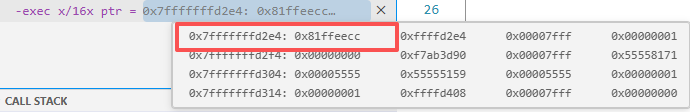


##### 运行时间可视化

[【81】C++的可视化基准测试_哔哩哔哩_bilibili](https://www.bilibili.com/video/BV1Dk4y1j7oj?spm_id_from=333.788.videopod.episodes&vd_source=ea5f077dc692dc32725d05ff92da61a5&p=82)

> [!TIP]
>
> 感觉还是不够好用

### 参考

[【Linux】GDB保姆级调试指南（什么是GDB？GDB如何使用？）_gdb教程-CSDN博客](https://blog.csdn.net/weixin_45031801/article/details/134399664)


## 测试工具

### CTest


### Google Test

[Quickstart: Building with CMake | GoogleTest](https://google.github.io/googletest/quickstart-cmake.html)


• 常用 EXPECT_* 一般按用途分组：

  - 相等/比较：EXPECT_EQ/NE/LT/LE/GT/GE。
      - EXPECT_NE(a, b): 断言 a 和 b 不相等（not equal）。
      - EXPECT_LT(a, b): 断言 a < b（less than）。
      - EXPECT_LE(a, b): 断言 a <= b（less or equal）。
      - EXPECT_GT(a, b): 断言 a > b（greater than）。
      - EXPECT_GE(a, b): 断言 a >= b（greater or equal）。
  - 布尔/真值：EXPECT_TRUE/FALSE。
  - 近似：EXPECT_FLOAT_EQ/DOUBLE_EQ，宽容版 EXPECT_NEAR.
  - 指针：EXPECT_NE(nullptr, p) 等（无专用宏）。
  - 字符串：EXPECT_STREQ/STRNE，大小写不敏感 EXPECT_STRCASEEQ/STRCASENE，C++ 字符串可用
    EXPECT_EQ。
  - 断言状态码：EXPECT_NO_FATAL_FAILURE，EXPECT_FATAL_FAILURE，以及 death test EXPECT_DEATH/EXPECT_DEATH_IF_SUPPORTED。
    - EXPECT_NO_FATAL_FAILURE(expr): 执行 expr，若期间触发任何 ASSERT_*（致命失败）则本断言失败；否则通过。用于包装“可能在内部用 ASSERT 保护”的代码，确认它不会提前终止测试。_
    - _EXPECT_FATAL_FAILURE(expr, substring): 期望 expr 触发一次致命失败（ASSERT_* 或ADD_FAILURE_AT 标记为致命），且错误消息包含给定子串；若未发生或消息不匹配则此断言失败。常用来验证防卫性检查。
    - EXPECT_DEATH(expr, regex): 期望 expr 以异常/abort/信号等“死亡”结束，并且 stderr 输出匹配regex；否则失败。通常用于检查前置条件被违背时程序会终止。
    - EXPECT_DEATH_IF_SUPPORTED(expr, regex): 同上，但若当前平台/配置不支持 death test，则此断言被标记为“仅警告或跳过”，测试不算失败，用于跨平台兼容。
  - 异常（typed tests需启用）：EXPECT_THROW(expr, Type) / EXPECT_ANY_THROW / EXPECT_NO_THROW。
  - 预测/自定义谓词：EXPECT_PRED1..5，EXPECT_PRED_FORMAT1..5。
  - 容器/范围（gMock 扩展）：EXPECT_THAT(value, matcher) 配合 ::testing matchers。

  说明：ASSERT_* 是对应的致命版本；EXPECT 只报告失败不中断当前测试。

#### TEST_F


#### TEST_P


#### tip

>短答（原因）：因为 Google Test 把类型放在全局命名空间下的 testing 命名空间，所以代码里用 ::testing::Test（前导 ::）显式指向全局命名空间，避免与当前作用域中可能存在的同名命名空间冲突。若当前没有嵌套同名命名空间，省略前导 ::（写成 testing::Test）通常也能正常工作。
>
>要点和容易踩的坑：
>
>::testing::Test 的前导 :: 强制从全局命名空间查找 testing。
>如果你的代码位于某个命名空间内（例如 namespace foo { ... }），写 testing::Test 可能会被解析为 foo::testing（如果存在），这会导致编译错误或歧义；使用 ::testing 则安全。


## C++项目性能分析工具

Valgrind

开源的内存调试工具

可用于检测内存泄漏、使用未初始化的内存等问题。它还可以进行性能分析和检测多线程问题。


## Format

### clang-format

`clang-format`是一款备受赞誉的==开源==代码格式化利器，专为程序员量身打造。它能够智能地自动调整源代码格式，确保代码遵循特定的编码风格规范。借助直观易懂的配置选项，`clang-format`能在不改变代码逻辑的前提下，精准处理缩进、空格、括号、逗号等细微之处，从而显著提升代码的可读性和统一性。无论是在个人项目中追求代码的整洁，还是在团队协作中追求代码风格的统一，`clang-format`都扮演着不可或缺的角色。它极大地减轻了代码审查和格式化的负担，使代码维护工作变得更加高效、轻松。

#### ref

- [vscode的c/c++ 环境配置(包含clang-format配置)_breakbeforebraces-CSDN博客](https://blog.csdn.net/2402_87385120/article/details/143581830)

- https://zhuanlan.zhihu.com/p/704205474
- https://www.cnblogs.com/laoshen-address-enshi/articles/18927445


### Doxygen 

- 注释规范
- 鼠标移动到函数就能够显示对应的信息
- 也可以根据Doxyen注释生成相关文档


# Python

## basic

###  直接赋值、浅拷贝和深度拷贝

[Python 直接赋值、浅拷贝和深度拷贝解析 | 菜鸟教程](https://www.runoob.com/w3cnote/python-understanding-dict-copy-shallow-or-deep.html)

### Python内存管理

[Python是如何进行内存管理的？（图文讲解）_python内存管理-CSDN博客](https://blog.csdn.net/YZL40514131/article/details/125884570)

> [!TIP]
>
> 当用python要考虑内存管理的时候，就该考虑是否该用python了😭

### `__init__.py`

1. **包初始化**：当一个目录包含 `__init__.py` 文件时，Python 解释器会将其视为一个包，允许你使用 `import` 语句导入该目录下的模块。
2. **初始化代码**：`__init__.py` 文件可以包含包的初始化代码。这些代码在包被导入时执行，可以用来执行一些初始化操作，比如设置包的属性、定义函数或类等。
3. **命名空间管理**：`__init__.py` 文件允许你控制包的命名空间。你可以通过这个文件来定义哪些模块或对象应该被暴露给包的使用者。
4. **避免命名冲突**：如果你的包中包含的模块名与标准库或其他第三方库的模块名相同，通过在 `__init__.py` 中明确导入和导出特定的模块或对象，可以避免命名冲突。
5. **向后兼容性**：在 Python 3.3 之前，`__init__.py` 文件是必须的，以将目录标记为包。从 Python 3.3 开始，PEP 420 允许隐式命名空间包，这意味着即使没有 `__init__.py` 文件，也可以将目录作为包使用。但是，使用 `__init__.py` 仍然是一种良好的实践，因为它提供了上述的好处。
6. **运行包**：如果 `__init__.py` 文件中包含 `if __name__ == "__main__":` 块，那么当包作为脚本直接运行时，该块中的代码将被执行。

```python
mypackage/
│
├── __init__.py
├── module1.py
└── module2.py
```

```python
# mypackage/__init__.py
from .module1 import my_function
from .module2 import MyClass
```

```python
import mypackage
mypackage.my_function()
mypackage.MyClass()
```

### `*args` 和 `**kwds`

```python
def func(*args, **kwds):
    for arg in args:
        print(arg)
    for key, value in kwds.items():
        print(f"{key} = {value}")

func(1, 2, 3, a=4, b=5)  # 输出:
# 1
# 2
# 3
# a = 4
# b = 5
```

### collections

#### defaultdict

```python
from collections import defaultdict

# 创建一个默认值为int的defaultdict，int类型的默认值为0
dd = defaultdict(int)

# 访问一个不存在的键，会自动创建该键，并将值设置为默认值0
print(dd['foo'])  # 输出: 0

# 手动设置一个键的值
dd['foo'] = 1

# 再次访问该键，返回设置后的值
print(dd['foo'])  # 输出: 1
```

#### NameTuple

元组 tuple 一样，NamedTuple 也是**不可变数据类型**，创建之后就不能改变内容

NamedTuple 不像数组那样使用下标读写，反而和类相似，使用 `.` 来读写。

```python
collections.namedtuple(typename, field_names, *, rename=False, defaults=None, module=None)

```


```python
# 导包
from collections import namedtuple

# 创建普通元组
point = (22, 33)
print(point) # 输出：(22, 33)

# 创建命名元组
Point = namedtuple('Point', 'x y')#我们先用 namedtuple 创建了一个名为 Point，有两个字段 x、y 的子类，然后将这个类赋给 Point 变量。
point_A = Point(22, 33)#相当于 new 
print(point_A) # 输出：Point(x=22, y=33)

```

```python
#三种风格
Point = namedtuple('Point', 'x y')
Point = namedtuple('Point', 'x,y')
Point = namedtuple('Point', ['x', 'y'])
```

```python
#取值
print(point_A[0])
print(point_A[1])

print(point_A.x)
print(point_A.y)

#创造一个对象
point1 = Point(x=1, y=2)
```

[【Python 高级特性】深入 NamedTuple 命名元组-CSDN博客](https://blog.csdn.net/XcantloadX/article/details/134071289)

### map

map()传入的第一个参数是f，即函数对象本身。由于结果r是一个[Iterator](https://so.csdn.net/so/search?q=Iterator&spm=1001.2101.3001.7020)，Iterator是惰性序列，因此通过list()函数让它把整个序列都计算出来并返回一个list。你可能会想，不需要map()函数，写一个循环，也可以计算出结果。但是，map要比循环更快，更稳健。

```python
def Fun(x) :                     # 计算平方数
      return x +  2

data = [1, 4, 9, 16, 25]

outdata = list(map(Fun, data))
#结果：outdata=[3, 4, 6, 7, 10, 12]
```

```python
#lambda
rewards = list(map(lambda s: s.reward, batch))#get reward from batch
```


### pip/venv 包管理

#### 配置国内镜像源

**临时使用：**

`pip install -i https://pypi.tuna.tsinghua.edu.cn/simple some-package`

**永久配置：**

`pip config set global.index-url https://pypi.tuna.tsinghua.edu.cn/simple`

**常用国内镜像源：**

- 清华大学源 https://pypi.tuna.tsinghua.edu.cn/simple
- 豆瓣源 https://pypi.douban.com/simple/
- 中国科学技术大学 https://pypi.mirrors.ustc.edu.cn/simple
- 阿里云 http://mirrors.aliyun.com/pypi/simple/
- 中国科技大学 https://pypi.mirrors.ustc.edu.cn/simple/


#### 包安装与管理

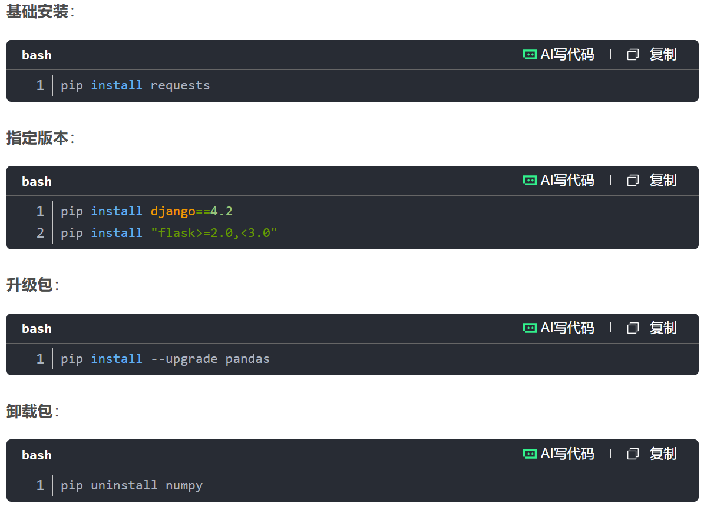


#### 离线安装

```
python -m pip show package_name 
python -m pip install package_name.whl # you can find **.whl in https://pypi.org/
```


#### 虚拟环境

从 Python 3.3 开始，`venv` 模块成为创建虚拟环境的标准工具。

**1. 创建虚拟环境**: 在你的项目根目录下，运行以下命令。`venv` 是你给这个环境起的名字，这是一个通用惯例。

```bash
# 在 my_project/ 目录下
python -m venv venv
```

执行后，会创建一个 `venv` 目录，里面包含了独立的 Python 解释器和包安装目录。

**2. 激活虚拟环境**: 在使用前，你必须“激活”它。

- Windows:

  ```bash
  .\venv\Scripts\activate
  ```

- macOS / Linux:

  ```bash
  source venv/bin/activate
  ```

激活后，你会发现你的命令行提示符前面多了 `(venv)` 的字样，表示你正处于这个虚拟环境中。

**3. 在虚拟环境中工作**: 激活后，你使用的 `python` 和 `pip` 命令都将是该环境内的版本。

```bash
# (venv) D:\path\to\my_project>
pip install requests
pip freeze > requirements.txt
```

现在 `requests` 被安装到了 `my_project/venv/Lib/site-packages` 目录下，而不是全局。

**4. 停用虚拟环境**: 当你工作完成，想回到全局环境时，只需运行：

```bash
deactivate
```


#### 参考

- [Python包管理：pip完全指南-CSDN博客](https://blog.csdn.net/u012399690/article/details/149044527)
- [Python 包管理与导入全方位教程 | 逐梦](https://0xdadream.github.io/2025/06/17/python-bao-guan-li/)


## 多线程

基于线程池

```python
from concurrent.futures import ThreadPoolExecutor
import requests

# 定义一个下载任务
def download(url):
    response = requests.get(url)
    return response.content

# 创建线程池
with ThreadPoolExecutor(max_workers=4) as executor:
    # 提交任务给线程池
    future1 = executor.submit(download, 'http://example.com/image1.jpg')
    future2 = executor.submit(download, 'http://example.com/image2.jpg')
    future3 = executor.submit(download, 'http://example.com/image3.jpg')

    # 获取任务执行结果
    data1 = future1.result()
    data2 = future2.result()
    data3 = future3.result()

    # 处理任务结果
    # ...


```

基于进程池

```python
from concurrent.futures import ProcessPoolExecutor

# 定义一个计算任务
def compute(n):
    result = n * n
    return result

# 创建进程池
with ProcessPoolExecutor(max_workers=4) as executor:
    # 提交任务给进程池
    future1 = executor.submit(compute, 2)
    future2 = executor.submit(compute, 3)
    future3 = executor.submit(compute, 4)

    # 获取任务执行结果
    print(future1.result())  # 输出：4
    print(future2.result())  # 输出：9
    print(future3.result())  # 输出：16

```

[Python 进程池和线程池的区别|极客教程](https://geek-docs.com/python/python-ask-answer/594_python_what_is_the_difference_between_processpoolexecutor_and_threadpoolexecutor.html)


## Pytorch

### Version


### Dataset

#### 最简案例

```python
from torch.utils.data import Dataset, DataLoader

class MyDataset(Dataset):
    def __init__(self, data):
        self.data = data
        
    def __len__(self):
        return len(self.data)
    
    def __getitem__(self, idx):
        return self.data[idx]

# 创建自定义数据集实例
my_data = [1, 2, 3, 4, 5, 6, 7]
my_dataset = MyDataset(my_data)

# 使用DataLoader加载自定义数据集my_dataset
dataloader = DataLoader(dataset=my_dataset)
```


### DataLoader

通过🛠️灵活配置DataLoader的各种参数，我们可以🔄优化数据加载速度，📏调整数据批次大小，甚至实现🎭自定义的数据处理和抽样策略。

#### 参数说明

- dataset (必需): 用于加载数据的数据集，通常是torch.utils.data.Dataset的子类实例。

- batch_size (可选): 每个批次的数据样本数。默认值为1。
- shuffle (可选): 是否在每个周期开始时打乱数据。默认为False。
- sampler (可选): 定义从数据集中抽取样本的策略。如果指定，则忽略shuffle参数。
- batch_sampler (可选): 与sampler类似，但一次返回一个批次的索引。不能与batch_size、shuffle和sampler同时使用。
- num_workers (可选): 用于数据加载的子进程数量。默认为0，意味着数据将在主进程中加载。
- collate_fn (可选): 如何将多个数据样本整合成一个批次。通常不需要指定。
- drop_last (可选): 如果数据集大小不能被批次大小整除，是否丢弃最后一个不完整的批次。默认为False。

#### 简单案例

```python
import torch
from torch.utils.data import Dataset, DataLoader
import torch.nn as nn
import torch.nn.functional as F
import os

class Mlp(nn.Module):
    """ Multilayer perceptron."""
    def __init__(self, in_features, hidden_features=None, out_features=None, act_layer=nn.LeakyReLU, drop=0.):
        super().__init__()
        out_features = out_features or in_features
        hidden_features = hidden_features or in_features
        self.fc1 = nn.Linear(in_features, hidden_features)
        self.act = act_layer()
        self.fc2 = nn.Linear(hidden_features, out_features)
        self.drop = nn.Dropout(drop)

    def forward(self, x):
        x = self.fc1(x)
        x = self.act(x)
        x = self.drop(x)
        x = self.fc2(x)
        x = self.drop(x)
        return x

# 自定义数据集类
class MyDataset(Dataset):
    def __init__(self, data, labels):
        self.data = data
        self.labels = labels
    
    def __getitem__(self, index):
        return self.data[index], self.labels[index]
    
    def __len__(self):
        return len(self.data)

device = torch.device('cuda' if torch.cuda.is_available() else 'cpu')

data = torch.randn(1000, 10, dtype=torch.float32)  # 示例数据（float32）
labels = torch.randint(0, 2, (1000,1), dtype=torch.int64).to(torch.float32) # 示例标签（float32）

dataset = MyDataset(data, labels)

model = Mlp(in_features=10, hidden_features=20, out_features=1).to(device) #262

# 创建DataLoader
dataloader = DataLoader(
    dataset=dataset,      # 数据集
    batch_size=25,        # 批次大小
    shuffle=True,         # 是否打乱数据
    num_workers=0,        # 多进程加载数据的线程数
    drop_last=True       # 当样本数不能被batch_size整除时，是否丢弃最后一个不完整的batch
)

# 训练50个epoch
criterion = torch.nn.BCEWithLogitsLoss()
optimizer = torch.optim.Adam(model.parameters(), lr=1e-3)
device = next(model.parameters()).device
scaler = torch.cuda.amp.GradScaler(enabled=(device.type == 'cuda'))

for epoch in range(50):
    model.train()
    running_loss = 0.0
    for batch_idx, (batch_data, batch_labels) in enumerate(dataloader):
        batch_data, batch_labels = batch_data.to(device), batch_labels.to(device) #306
        optimizer.zero_grad(set_to_none=True)
        with torch.cuda.amp.autocast(enabled=(device.type == 'cuda')):
            logits = model(batch_data)#342
            loss = criterion(logits, batch_labels)

        scaler.scale(loss).backward() #350
        scaler.step(optimizer)
        scaler.update()

        running_loss += loss.item() * batch_data.size(0)

    epoch_loss = running_loss / (len(dataloader) * dataloader.batch_size)
    print(f"Epoch {epoch + 1}/50 - Loss: {epoch_loss:.4f}")
```


#### 参考

1. [PyTorch入门必学：DataLoader（数据迭代器）参数解析与用法合集_python dataloader-CSDN博客](https://blog.csdn.net/qq_41813454/article/details/134903615)


### torch.nn.functional

#### F.interpolate


### nn.Sequential & nn.ModuleList

- `nn.Sequential`：允许将多个层按顺序组合起来，形成简单的线性堆叠网络。
- `nn.ModuleList` 和 `nn.ModuleDict`：可以动态地存储和访问子模块，支持可变长度或命名的模块集合。


### nn.Module

`nn.Module` 是所有自定义神经网络模型的基类


method:

- nn.Module.apply(fn)


### DDP


#### 参考

- [Single Machine Multi-GPU Minibatch Node Classification — DGL 2.4.0 documentation](https://www.dgl.ai/dgl_docs/en/2.4.x/tutorials/multi/2_node_classification.html)
- [pytorch单机多卡训练--完整示例代码_torchrun 单机多卡-CSDN博客](https://blog.csdn.net/weixin_42655901/article/details/131324593)


## DGL

### api

`with g.local_scope():` #

#### dgl.nn.pytorch as dglnn

##### 异构Embedding

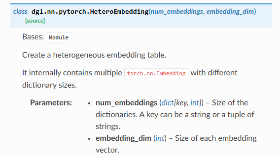


```python
layer = HeteroEmbedding({'user': 2, ('user', 'follows', 'user'): 3}, 4)
# Get the heterogeneous embedding table
embeds = layer.weight
print(embeds['user'].shape)
#torch.Size([2, 4])
print(embeds[('user', 'follows', 'user')].shape)
#torch.Size([3, 4])
```

```python
# Get the embeddings for a subset
input_ids = {'user': torch.LongTensor([0]),
             ('user', 'follows', 'user'): torch.LongTensor([0, 2])}
embeds = layer(input_ids)
print(embeds['user'].shape)
#torch.Size([1, 4])
print(embeds[('user', 'follows', 'user')].shape)
#torch.Size([2, 4])

```


##### 异构线性层

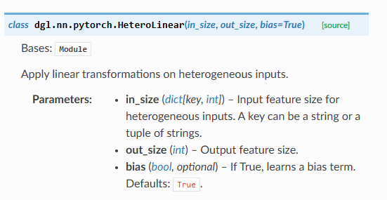


```python
layer = HeteroLinear({'user': 1, ('user', 'follows', 'user'): 2}, 3)
in_feats = {'user': torch.randn(2, 1), ('user', 'follows', 'user'): torch.randn(3, 2)}
out_feats = layer(in_feats)
print(out_feats['user'].shape)
print(out_feats[('user', 'follows', 'user')].shape)
```

##### 异构卷积层


#### dgl.batch


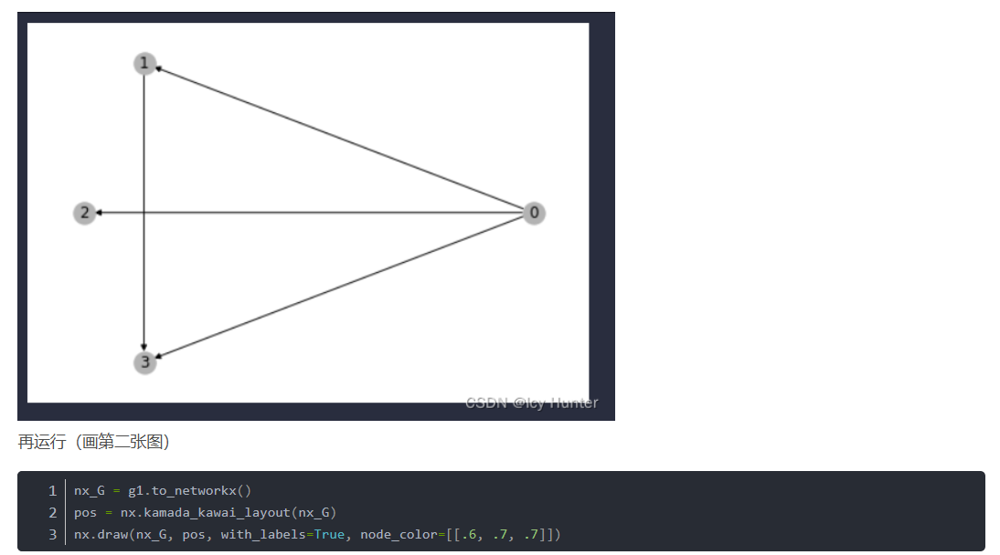

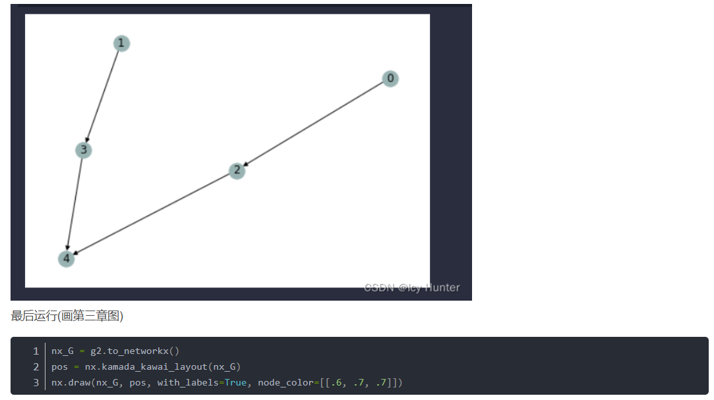


原文链接：https://blog.csdn.net/qq_52785473/article/details/124837249


### 单机多卡实现

[Single Machine Multi-GPU Minibatch Graph Classification — DGL 2.5 documentation](https://www.dgl.ai/dgl_docs/tutorials/multi/1_graph_classification.html)


### install

[Deep Graph Library](https://www.dgl.ai/pages/start.html)

[dgl与torch版本不兼容以及解决方法_dgl torch-CSDN博客](https://blog.csdn.net/qq_64076181/article/details/143184101)

## Tensorflow

### 基本操作

[pytorch函数mm() mul() matmul()区别_torch.mm matmul区别-CSDN博客](https://blog.csdn.net/qq_35091353/article/details/117234223)

```
tf.Variable(initial_value=1.)
tf.constant([[1., 2.], [3., 4.]])
tf.zero
tf.square() 操作代表对输入张量的每一个元素求平方
tf.reduce_sum() 操作代表对输入张量的所有元素求和
tf.random.uniform

print(A.shape)      # 输出(2, 2)，即矩阵的长和宽均为2
print(A.dtype)      # 输出<dtype: 'float32'>
print(A.numpy())  
```


### 自动求导

```python
import tensorflow as tf

x = tf.Variable(initial_value=3.)
with tf.GradientTape() as tape:     # 在 tf.GradientTape() 的上下文内，所有计算步骤都会被记录以用于求导
    y = tf.square(x)
y_grad = tape.gradient(y, x)        # 计算y关于x的导数
print(y, y_grad)
```

```python
tf.GradientTape() 是一个自动求导的记录器。只要进入了 with tf.GradientTape() as tape 的上下文环境，则在该环境中计算步骤都会被自动记录。比如在上面的示例中，计算步骤 y = tf.square(x) 即被自动记录。离开上下文环境后，记录将停止，但记录器 tape 依然可用，因此可以通过 y_grad = tape.gradient(y, x) 求张量 y 对变量 x 的导数。

X = tf.constant([[1., 2.], [3., 4.]])
y = tf.constant([[1.], [2.]])
w = tf.Variable(initial_value=[[1.], [2.]])
b = tf.Variable(initial_value=1.)
with tf.GradientTape() as tape:
    L = tf.reduce_sum(tf.square(tf.matmul(X, w) + b - y))
w_grad, b_grad = tape.gradient(L, [w, b])        # 计算L(w, b)关于w, b的偏导数
print(L, w_grad, b_grad)
```


### 模型与层

[简单粗暴 TensorFlow 2 | A Concise Handbook of TensorFlow 2 — 简单粗暴 TensorFlow 2 0.4 beta 文档 (tf.wiki)](https://tf.wiki/zh_hans/)

- Keras 在 `tf.keras.layers` 下内置了深度学习中大量常用的的预定义层，同时也允许我们自定义层

  - keras.layers.Dense

    - `units` ：输出张量的维度；
    - `activation` ：激活函数，对应于  中的  ，默认为无激活函数（ `a(x) = x` ）。常用的激活函数包括 `tf.nn.relu` 、 `tf.nn.tanh` 和 `tf.nn.sigmoid` ；
    - `use_bias` ：是否加入偏置向量 `bias` ，即  中的 。默认为 `True` ；
    - `kernel_initializer` 、 `bias_initializer` ：权重矩阵 `kernel` 和偏置向量 `bias` 两个变量的初始化器。默认为 `tf.glorot_uniform_initializer` [1](https://tf.wiki/zh_hans/basic/models.html#glorot) 。设置为 `tf.zeros_initializer` 表示将两个变量均初始化为全 0；
    - 该层包含权重矩阵 `kernel = [input_dim, units]` 和偏置向量 `bias = [units]` [2](https://tf.wiki/zh_hans/basic/models.html#broadcast) 两个可训练变量
  - tf.keras.layers.Conv2D
  - tf.keras.layers.MaxPool2D
  - tf.keras.layers.Reshape
  - tf.keras.layers.LSTMCell
- 我们可以通过继承 `tf.keras.Model` 这个 Python 类来定义自己的模型
- 在继承类中，我们需要重写 `__init__()` （构造函数，初始化）和 `call(input)` （模型调用）两个方法，同时也可以根据需要增加自定义的方法。
- 实例化类 `model = Model()` 后，可以通过 `model.variables` 这一属性直接获得模型中的所有变量

#### 自定义层

`tf.keras.models.Sequential()` 提供一个层的列表，就能快速地建立一个 `tf.keras.Model` 模型并返回

```python
        model = tf.keras.models.Sequential([
            tf.keras.layers.Flatten(),
            tf.keras.layers.Dense(100, activation=tf.nn.relu),
            tf.keras.layers.Dense(10),
            tf.keras.layers.Softmax()
        ])
```

### 变量的恢复和保存

[TensorFlow常用模块 — 简单粗暴 TensorFlow 2 0.4 beta 文档 (tf.wiki)](https://tf.wiki/zh_hans/basic/tools.html)

### 训练过程可视化

### GPU使用

#### 分布式训练

#### TPU训练

### install

[使用 pip 安装 TensorFlow (google.cn)](https://tensorflow.google.cn/install/pip?hl=zh-cn#1.-install-the-python-development-environment-on-your-system)

[TensorFlow安装与环境配置 — 简单粗暴 TensorFlow 2 0.4 beta 文档 (tf.wiki)](https://tf.wiki/zh_hans/basic/installation.html)

```bash
#需要使用 Python 3.6-3.9 和 pip 19.0 及更高版本
sudo apt update
sudo apt install python3-dev python3-pip python3-venv

python3 --version
pip3 --version

#enter vir env
#从 TensorFlow 2.1 开始，pip 包 tensorflow 即同时包含 GPU 支持，无需通过特定的 pip 包 tensorflow-gpu 安装 GPU 版本
pip install --upgrade tensorflow#install
#指定版本号
pip install tensorflow==2.6.0

```


### reference

[简单粗暴 TensorFlow 2 | A Concise Handbook of TensorFlow 2 — 简单粗暴 TensorFlow 2 0.4 beta 文档 (tf.wiki)](https://tf.wiki/zh_hans/)


## 其他第三方库

### [open-mmlab/mmcv](https://github.com/open-mmlab/mmcv?tab=readme-ov-file)

OpenMMLab 是一个用于学术研究和工业应用的开源算法体系，于2018年年中开始，由 MMLab（香港中文大学多媒体实验室）和商汤科技联合启动。OpenMMLab 致力于为计算机视觉领域的重要方向创建统一且开源的代码库，推进可复现算法生态的建立；目前为止 OpenMMLab 已经陆续开源**30多个**视觉算法库，实现了**300多种**算法，并包含**2000+**预训练模型，涵盖**2D/3D目标检测**、**语义分割**、**视频理解**、**姿态分析**等多个方向

[timm](https://www.bing.com/ck/a?!&&p=72cd6c6b998ed2c235756a386b2f07fe90e1ea694831b54205dbfd0ff6a69315JmltdHM9MTc1OTE5MDQwMA&ptn=3&ver=2&hsh=4&fclid=0fb3f3a8-cef7-65cf-0799-e5eecf916483&psq=timm+package&u=a1aHR0cHM6Ly9naXRodWIuY29tL2h1Z2dpbmdmYWNlL3B5dG9yY2gtaW1hZ2UtbW9kZWxz)

timm库，全称pytorch-image-models，是最前沿的PyTorch图像模型、预训练权重和实用脚本的开源集合库，其中的模型可用于训练、推理和验证。


## 模型

### CNN 预训练

#### restnet50

```python
# restnet50一共有5个stage, 这里提取前4个stage。
# 可以print(restnet_model)看看模型具体的结构
import torch
import torch.nn as nn
from torchvision.models import resnet50, ResNet50_Weights

class PartialResNet(nn.Module):
    def __init__(self, pretrained=True, freeze=False, return_intermediate=False):
        super().__init__()
        weights = ResNet50_Weights.IMAGENET1K_V1 if pretrained else None
        base = resnet50(weights=weights)

        self.stem = nn.Sequential(
            base.conv1,
            base.bn1,
            base.relu,
            base.maxpool,
        )
        self.layer1 = base.layer1
        self.layer2 = base.layer2
        self.layer3 = base.layer3
        self.return_intermediate = return_intermediate

        if freeze:
            for p in self.parameters():
                p.requires_grad = False

    def forward(self, x):
        x = self.stem(x)      # /4 空间
        f1 = self.layer1(x)   # /4 , C=256
        f2 = self.layer2(f1)  # /8 , C=512
        f3 = self.layer3(f2)  # /16, C=1024
        if self.return_intermediate:
            return {'layer1': f1, 'layer2': f2, 'layer3': f3}
        return f3  # 默认只返回最后一个


model = PartialResNet()
img = torch.randn(1, 3, 256, 256)# 生成一个随机 3x256x256 图片并测试模型

output = model(img)

print("Output shape:", output.shape)  # 期望: (1, 1000)

```


### nn.Linear和nn.Embedding的区别

| 特性             | `nn.Embedding`                                               | `nn.Linear`                                                  |
| :--------------- | :----------------------------------------------------------- | :----------------------------------------------------------- |
| **本质**         | **查找表 (Look-up Table)**                                   | **线性变换 (Affine Transformation)**                         |
| **输入**         | **整数索引** (LongTensor)，例如 `[0, 2, 1]`                  | **浮点数张量** (FloatTensor)，例如 `[[1.0, 2.0], [3.0, 4.0]]` |
| **操作**         | `output[i] = weight[input[i]]`                               | `output = input @ weight.T + bias`                           |
| **可学习参数**   | 一个权重矩阵 `(num_embeddings, embedding_dim)`               | 权重 `(out_features, in_features)`和偏置 `(out_features)`    |
| **主要用途**     | 将离散的类别ID、单词ID等映射为稠密的、可学习的向量表示。     | 对特征进行线性组合、变换维度（也称为“全连接层”）。           |
| **梯度更新**     | 只更新被查询到的索引对应的行（向量）。                       | 更新整个权重矩阵和所有输入特征相关。                         |
| **一个关键联系** | 一个 `nn.Embedding`层在数学上**等价于**一个将 **one-hot 输入** 输入到一个**没有偏置**的 `nn.Linear`层。 |                                                              |

### 总结与如何选择

| 场景                                                         | 应该使用的层       |
| :----------------------------------------------------------- | :----------------- |
| **自然语言处理 (NLP)**：将单词ID、字符ID转换为词向量。       | **`nn.Embedding`** |
| **推荐系统**：将用户ID、物品ID转换为嵌入向量。               | **`nn.Embedding`** |
| **处理任何离散的类别特征**。                                 | **`nn.Embedding`** |
| **在嵌入向量之后**，或者从其他层（如CNN、GCN）接一个层进行特征变换/降维。 | **`nn.Linear`**    |
| **多层感知机 (MLP)** 的构建块。                              | **`nn.Linear`**    |

### norm_layer

[Layer Norm 提升训练稳定性的原理:解决权重初始值敏感性问题（中英双语）_nn.layernorm初始化过大-CSDN博客](https://blog.csdn.net/shizheng_Li/article/details/144474020)

什么时候应该用:


### Attention

#### 综述


举一个简单的机器翻译的例子

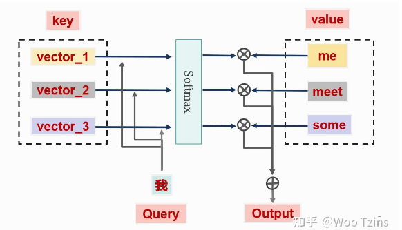

这就需要"我"和"me"之间的注意力分数相对于"我"和其他英文单词的要高

**Query：**我们就可以将`"我"`看作成 `Query`，因为这就是我们当前需要查询的目标，即当前输入的特征表示。

**Key：**可以将每个单词**的重要特征表示**看作成 Key。

**Value：**每个单词本身的特征向量看作为 Value，一般和 Key成对出现，也就是我们常说的"键-值"对。

##### SA步骤

1. Embedding

   

2. 位置编码

3. 获取相关性

   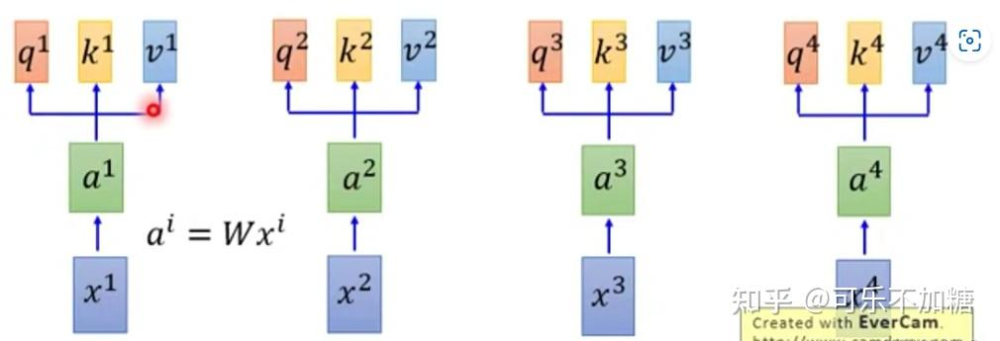

   

   

   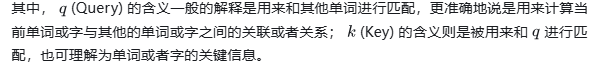

   

   使用 softmax 函数是为了使得所有的注意力分数在 [0,1] 之间，并且和为1

   除以√d是为了稳定训练

   > [!WARNING]
   >
   > 在NLP中，需要进行掩码操作。应为不知道后面的单词。将后面的query对应的相关性置为0。还是要像RNN一样。

4. 计算v

   

   


##### MSA


q,k计算距离


##### 参考

[【官方双语】直观解释注意力机制，Transformer的核心 | 【深度学习第6章】_哔哩哔哩_bilibili](https://www.bilibili.com/video/BV1TZ421j7Ke/?spm_id_from=333.337.search-card.all.click&vd_source=ea5f077dc692dc32725d05ff92da61a5)

[(51 封私信 / 80 条消息) 注意力机制综述（图解完整版附代码） - 知乎](https://zhuanlan.zhihu.com/p/631398525)

#### 自注意力机制（SA, MSA）


#### 通道注意力机制(CAM)

通道注意力机制是通过计算每个通道channel的重要性程度；因此，常常被用在卷积神经网络里面。

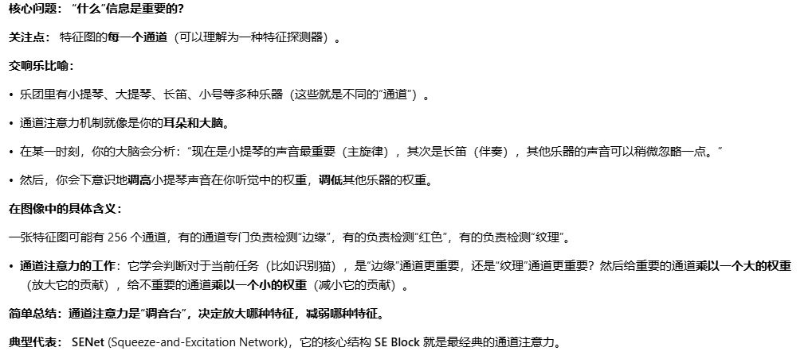

[SENet CVPR_2018: Squeeze-and-Excitation Networks](https://github.com/hujie-frank/SENet)

压缩和激励网络（Squeeze-and-Excitation Networks，SENet）是通道注意力机制的代表模型。

[(ICCV 2021) MSCA](https://link.zhihu.com/?target=https%3A//github.com/cfzd/FcaNet)


[(2023) OCA](https://link.zhihu.com/?target=https%3A//github.com/hady1011/orthonets)

论文首先分析了现有**通道注意力机制的局限性**：SENet 使用全局平均池化 (GAP) 作为压缩方法，但丢弃了低频信息。而 FcaNet 则使用离散余弦变换 (DCT) 来压缩特征，但需要手动选择频率，且计算成本高。此外，对于**正交滤波器**：正交滤波器能够从特征空间的不同子空间中提取信息，从而提供更丰富的特征表示。正交滤波器允许网络为每个通道赋予意义，从而提高注意力压缩的有效性。这篇论文提出一种 **正交通道注意力（Orthogonal Channel Attention）**，OCA 是一种==用于提高深度卷积神经网络 (DCNN) 性能的通道注意力机制==。其旨在通过突出相关特征并抑制不相关特征来改进网络的特征表示，从而提高网络的准确性和效率。


#### 空间注意力机制(SAM)

空间注意力机制和通道注意力机制具有异曲同工之妙，通道注意力机制旨在捕捉通道的重要性的程度，空间注意力机制旨在通过引入注意力模块，使模型能够自适应地学习不同区域的注意力权重。这样，模型可以更加关注重要的图像区域，而忽略不重要的区域

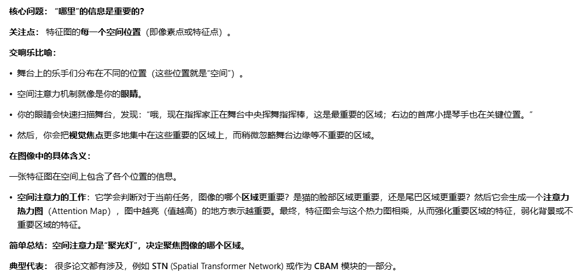

[spatial-transformer-network: A Tensorflow implementation of Spatial Transformer Networks.](https://github.com/kevinzakka/spatial-transformer-network)

*Spatial Transformer Networks* (STN) is a differentiable module that can be inserted anywhere in ConvNet architecture to increase its geometric invariance. It effectively gives the network the ability to spatially transform feature maps at no extra data or supervision cost.


[CoordAttention: Code for our CVPR2021 paper coordinate attention](https://github.com/houqb/CoordAttention)


[ICLR 2021 ](https://github.com/fundamentalvision/Deformable-DETR)

[Deformable DETR: 基于稀疏空间采样的注意力机制，让DCN与Transformer一起玩！ - 知乎](https://zhuanlan.zhihu.com/p/372116181)


[Efficient Multi-Scale Attention（ICASSP 2023）](https://link.zhihu.com/?target=https%3A//github.com/yoloonme/ema-attention-module)


[(WACV 2020) ULSA ](https://link.zhihu.com/?target=https%3A//github.com/Nandan91/ULSAM)

在现有的研究当中，CNN和传统注意力机制都存在着一定的局限性： 即虽然CNN 在图像识别等领域取得了显著成果，但其计算复杂度和参数数量仍然很高，限制了其在资源受限设备上的应用，现有的注意力机制（如 SE-Net, CBAM 等）虽然能够有效提升特征表达能力，但其计算复杂度和参数数量也相对较高，不适合轻量级 CNN。而子空间学习却有着以下优势： 子空间学习通过将特征图划分为多个子空间，可以分别学习每个子空间的注意力图，可以有效地捕捉不同尺度和不同频率的特征信息，从而提升特征表达能力。基于此，这篇论文提出一种 **超轻量子空间注意力（Ultra-Lightweight Subspace Attention）**，ULSA 是一种针对轻量级 CNN 设计的新型注意力模块，旨在提高计算效率并增强特征表达能力。


#### 混合注意力(CAM+SAM)

[DANet: Dual Attention Network for Scene Segmentation (CVPR2019)](https://github.com/junfu1115/DANet)

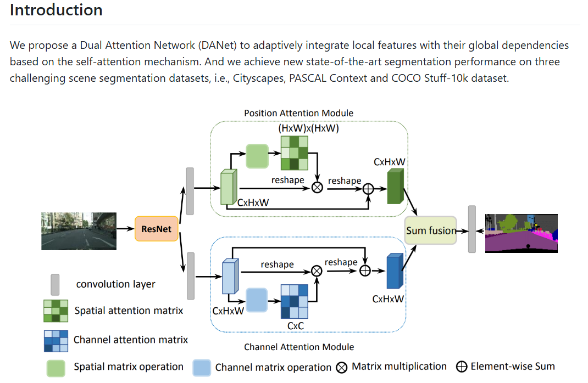

[BAM and CBAM: Official PyTorch code for "BAM: Bottleneck Attention Module (BMVC2018)" and "CBAM: Convolutional Block Attention Module (ECCV2018)"](https://github.com/Jongchan/attention-module)


[triplet-attention WACV 2021](https://github.com/landskape-ai/triplet-attention)


[Plug-and-Play](https://github.com/northBeggar/Plug-and-Play)


[SA-Net](https://link.zhihu.com/?target=https%3A//github.com/wofmanaf/SA-Net)

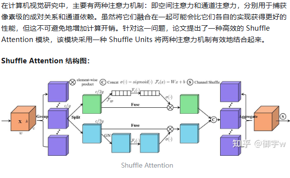

[(2023) TabAttention](https://link.zhihu.com/?target=https%3A//github.com/SanoScience/Tab-Attention)

在处理临床数据时，由于临床数据通常包含图像和表格数据，但现有的方法通常将它们分开处理，限制了信息交互和知识转移。同时，注意力机制已被证明可以显著提高深度学习模型的性能，但很少有研究将注意力模块与表格数据相结合。所以这篇论文提出一种 **TabAttention** 。旨在通过引入表格数据来增强卷积神经网络 (CNN) 的性能。

TabAttention 的核心思想是延展卷积块注意力模块 (CBAM) 到时间维度，通过添加了一个时间注意力模块 (TAM) 来学习注意力图。此外，该模块利用来自图像特征图和表格数据嵌入的池化信息来生成注意力图，包括通道注意力图、空间注意力图和时间注意力图。

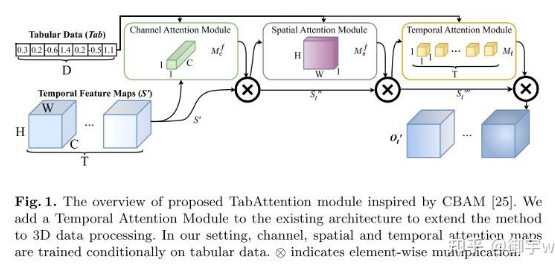


#### 轻量级网络模型

线性注意力机制


[(CVPR 2023) Super Token Attention](https://link.zhihu.com/?target=https%3A//github.com/hhb072/stvit)

现有的传统视觉 ViTs 在浅层网络中倾向于捕获局部特征，会导致大量冗余计算。同时， 为了降低计算成本，现有的许多方法采用局部注意力或早期卷积，但牺牲了全局建模能力。所以这篇论文从超像素分割中得到启发，==在后续处理中减少了图像基元的数量==，并在视觉Transformer中引入了一种**Super Token Attention**。Super Token Attention试图提供一个语义上有意义的视觉内容的镶嵌，从而==减少在自我注意力的token==，以及保留全局建模。STA 通过将视觉内容划分为超 token，在超 token 空间进行自注意力操作，从而有效地学习全局表示，同时降低计算成本。

> 也许用得上

[(TMM 2023) MSDA ](https://link.zhihu.com/?target=https%3A//github.com/JIAOJIAYUASD/dilateformer)

为了解决 Vision Transformers (ViTs) 中浅层==全局注意力机制冗余计算的问题==。论文中分析到在浅层全局注意力机制中，注意力矩阵呈现出局部性和稀疏性的特点，这意味着浅层网络中大部分远距离 patch 之间在语义建模上是无关的，因此全局注意力机制存在==大量冗余计算==。所以，基于这些存在的短处，论文提出一种 **多尺度膨胀注意力** ([Multi-Scale Dilated Attention](https://zhida.zhihu.com/search?content_id=255605567&content_type=Article&match_order=1&q=Multi-Scale+Dilated+Attention&zhida_source=entity)) 。

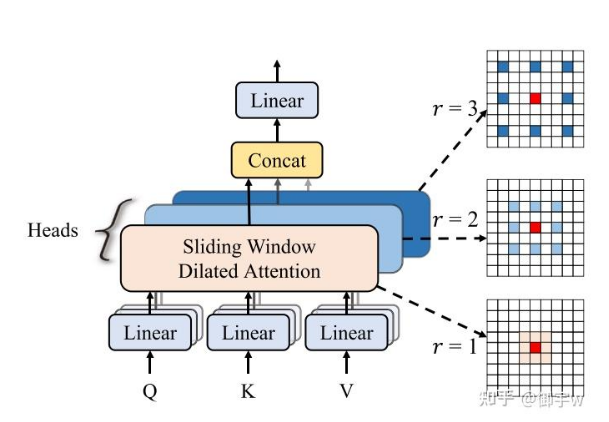

[(ICCV 2023) MSLA](https://link.zhihu.com/?target=https%3A//github.com/mit-han-lab/efficientvit)

现有模型的局限性存在以下短处：**计算成本高**： 现有的高分辨率密集预测模型往往依赖于复杂的模型结构，例如 ==softmax== 注意力机制、大卷积核等，这会导致计算成本高昂，==难以在硬件设备上部署。**性能提升有限**==： 一些轻量级的模型虽然计算成本较低，但性能提升有限，难以满足实际应用的需求。为了解决现有高分辨率密集预测模型在效率和性能之间的权衡问题。这篇论文提出一种新的**多尺度线性注意力（Multi-Scale Linear Attention）**。与以往的高分辨率稠密预测模型依赖于繁重的softmax注意力、硬件效率低的大核卷积或复杂的拓扑结构来获得良好性能不同，多尺度线性注意力仅需轻量级和硬件效率高的操作即可实现全局感受野和多尺度学习。

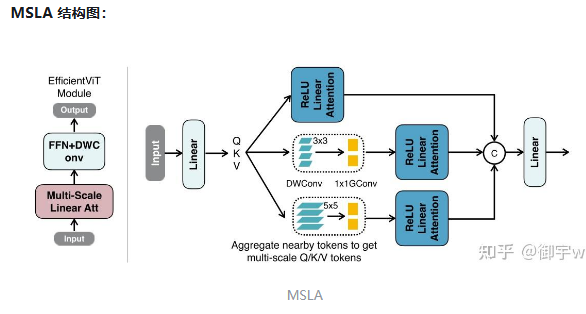


[(ICCV 2023) EAA](https://link.zhihu.com/?target=https%3A//github.com/Amshaker/SwiftFormer)

在现有的研究中，传统的 Multi-Head Self-Attention (MHSA) 计算 ==复杂度高，难以在移动设备上实时运行==。而现有的 Additive Attention 则需要计算 ==key 和 value== 之间的显式交互，这限制了其效率和灵活性。所以，这篇论文进一步提出一种 **有效附加注意力（Efficient Additive Attention）** 。旨在解决 Transformer 模型在移动设备上部署时遇到的效率问题。


[(2023) MLCA ](https://link.zhihu.com/?target=https%3A//github.com/wandahangFY/MLCA)

现有通道注意力机制的局限性： 大多数通道注意力机制只关注通道特征信息，忽略了空间特征信息，导致模型的表达能力或目标检测性能较差。空间注意力模块的复杂性： 现有的空间注意力模块往往结构复杂，计算量大，难以直接应用于轻量级网络模型。这篇论文提出一种 **混合局部通道注意力（Mixed Local Channel Attention）**，MLCA 的提出便是为了解决现有通道注意力机制的局限性，并提高目标检测网络的性能。

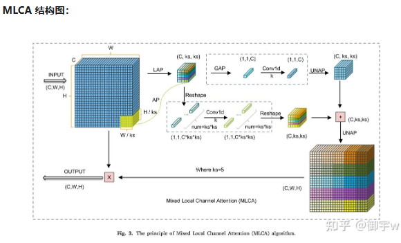


[(TIM 2023) LSGA ](https://link.zhihu.com/?target=https%3A//github.com/machao132/LSGA-VIT)

在现有的研究中存在以下两个问题，即 **Transformer 计算成本高**: 传统 Transformer 使用 QKV (Query-Key-Value) 结构进行自注意力计算，需要大量参数和计算量，导致模型复杂度高，运行效率低。**位置信息缺失**: Transformer 无法直接获取 token 的位置信息，这可能导致模型在处理图像时无法区分中心像素和周围像素的特征，影响分类精度。这篇论文提出一种 **轻量自高斯注意力（Light Self-Gaussian-Attention）**，其是一种轻量级的自注意力机制，用于改进 Transformer 在图像处理任务中的性能。


[(TPAMI 2022) EA](https://link.zhihu.com/?target=https%3A//github.com/MenghaoGuo/-EANet)

论文首先指出了现有的自注意力机制缺陷：**计算复杂度高**： 自注意力机制的计算复杂度为 O(N^2)，难以直接应用于图像等大规模输入。**忽略样本间关系**： 自注意力机制仅关注单个样本内部元素之间的关系，忽略了不同样本之间的潜在关联，限制了其能力和灵活性。所以这篇论文提出一种 **外部注意力（External Attention）**，希望通过外部注意力机制学习更具代表性的特征，同时降低计算成本。


[(CVPR 2023) TKSA](https://link.zhihu.com/?target=https%3A//github.com/cschenxiang/DRSformer)

Top-K稀疏注意力

标准 Transformer 中的自注意力机制在图像去雨任务中存在一些局限性：**全局信息交互**：标准自注意力对所有查询-键对进行计算，容易引入无关信息，干扰特征聚合，影响图像细节恢复。**冗余特征**：全连接计算模式放大了较小的相似度权重，导致特征交互和聚合过程易受噪声影响，产生冗余或不相关的特征表示。为了解决这些问题，这篇论文提出一种 **Top-k稀疏注意力（Top-K Sparse Attention）**。

> 感觉用得上

[(2023) ESRA 高效空间压缩注意力](https://link.zhihu.com/?target=https%3A//github.com/XSforAI/SUnet)

在现有的研究中， 虽然Transformer在捕捉长距离依赖关系方面表现出色，但其模型参数量大、计算复杂度高，容易过拟合，限制了其在计算资源有限的场景下的应用。而现有改进方法的不足：如Swin Transformer，主要通过减少模型层数或注意力头数量来降低参数量和计算复杂度，但这种方法会牺牲模型的性能。为此，论文提出一种 **高效空间压缩注意力（Efficient Spatial Reduction Attention）**，ESRA 通过使用卷积操作压缩多头自注意力（MHSA）中的键和值，从而降低模型参数量和计算复杂度，同时缓解过拟合问题。

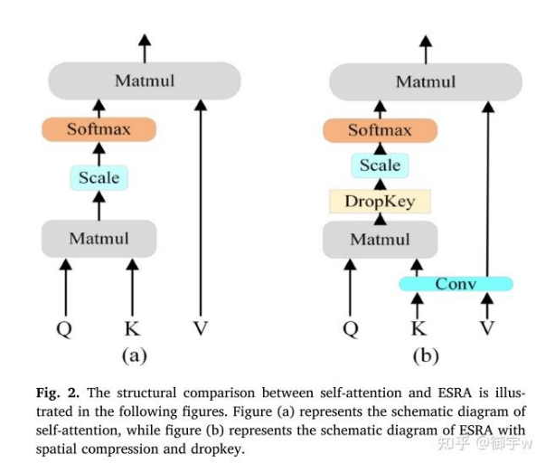

> 感觉用得上

[Agent Attention 代理注意力](https://link.zhihu.com/?target=https%3A//github.com/LeapLabTHU/Agent-Attention)

自Vision Transformer问世以来，自注意力在计算机视觉领域取得了显著的进步。然而，之后的对于自注意力的研究都不可避免地限制了自注意力的全局接受域，阻碍了模型对远程关系进行建模的能力。

而对于线性注意力，其与限制感受野的思想相反，是通过降低计算复杂度直接解决了计算挑战。在先前的线性注意力的研究中，像是采用深度卷积来保持特征多样性的方法虽然是有效的，但它们仍存在线性注意力有限的表达能力问题。

基于此，论文提出了一种新的注意力 **Agent Attention**。其创新性地引入了一组额外的令牌A的注意三元组（Q，K，V），并产生一种表示为四元组（Q，A，K，V）的代理注意力将代理令牌A的附加集合引入到传统注意力模块中。代理令牌首先充当查询令牌Q的代理，以聚集来自K和V的信息，然后将该信息广播回Q。假设代理令牌的数量可以设计为远小于查询令牌的数量，则代理注意力比广泛采用的Softmax注意力明显更有效，同时还能保持全局上下文建模能力。此外，论文还论证了所提出的 Agent Attention 等价于线性注意的一种推广形式。


#### other

[EPSANet ACCV 2021](https://github.com/murufeng/EPSANet)


[CSRA](https://link.zhihu.com/?target=https%3A//github.com/Kevinz-code/CSRA)

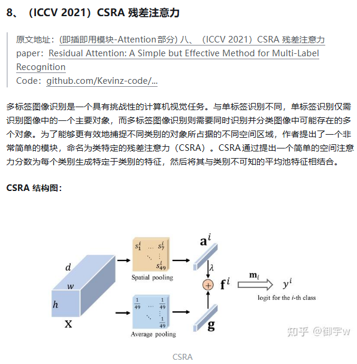

[OutLook Attention](https://link.zhihu.com/?target=https%3A//github.com/sail-sg/volo)

论文指出 ==ViTs 在最近的分类等任务中显示出基于自注意力的巨大潜力，但如果没有提供额外的数据，其性能仍然不如 CNN。==在这项工作中，论文指出限制 ViTs 性能的一个主要因素是 ViTs 在将精细级别的特征编码到令牌表示中时的效率较低。而为了解决这个问题，论文引入了一种新的注意力，即 OutLook Attention。OutLook Attention 与关注全局依赖模型的自注意力不同，==OutLook Attention 可以有效地将更精细的特征和上下文编码为令牌==，从而利用精细层次的信息来丰富表征。

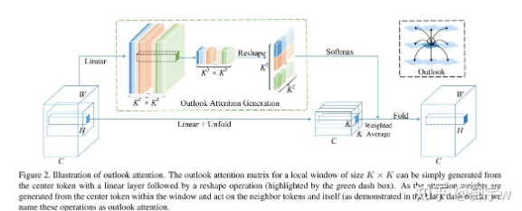

(CVPR 2022) Deformable Attention 可变形注意力


(CVPR 2023) BRA 双层路由注意力


#### 参考

[10种涨点即插即用模块 注意力 合集篇来啦（一）！！！(附原文地址+论文+代码) - 知乎](https://zhuanlan.zhihu.com/p/31864215481)


### Tips

-  torch.backends.cudnn.benchmark = True

  

- 


## 数据


## 方法

### 迁移学习


## 实验

### 训练速度

消费级显卡对单精度计算有优化，服务器级显卡对双精度计算有优化


### 显存占用

#### 训练

**网络模型占用**

- **网络模型占用：** 主要指网络中有参数的层，即神经网络中“有参数的层”如何占用显存？
- **模型输入及输出：** 训练过程中的中间变量指训练过程需要保存每一层输入输出的中间变量，一般后续反向传导，更新梯度
- **优化器的参数：** 除了保存权重之外，还要保存对应的梯度，用于梯度更新，尤其对哪些需要记录历史梯度、自适应学习率的优化器来说
- 框架自身的显存开销

#### 推理

- **不可控制空间**: 指系统分配的空间，如每个进程 [CUDA Context](https://zhida.zhihu.com/search?content_id=235724505&content_type=Article&match_order=1&q=CUDA+Context&zhida_source=entity) 所占用的显存空间，一般在 100-300MB 左右；
- **输入输出** :指用户自行分配的显存空间，如模型输入输出 Tensor 占用的空间，即神经网络中“输入与输出”如何占用显存？
- **模型参数** 指训练的深度学习模型的参数所占用的显存空间，我们需要将模型参数加载到显存中，才能进行计算，即神经网络中“有参数的层”如何占用显存？
- **“运行时空间”** 是指模型的算子在计算的时候，需要的显存空间

#### 降低模型训练显存

- 改精度，使用混合精度
- `Relu()`有一个默认参数`inplace`，默认设置为False。当设置为True时，我们在通过relu()计算得到的新值不会占用新的空间，而是直接覆盖原来的值，这也就是为什么当inplace参数设置为True时可以节省一部分内存的缘故。
- 减少batch
- 牺牲计算速度减少显存使用量: PyTorch中，如果一个模型占用的显存太大了，可以将一个计算过程分成两半，先计算前一半，保存后一半需要的中间结果，然后再计算后一半


### Loss选择


#### 参考

[分类和回归任务的常用损失函数](https://juejin.cn/post/7188370492187738167)


### 交叉验证

 [【小萌五分钟】机器学习 | 交叉验证 Cross-Validation_哔哩哔哩_bilibili](https://www.bilibili.com/video/BV1GQ4y1P7Tv/?spm_id_from=333.337.search-card.all.click&vd_source=ea5f077dc692dc32725d05ff92da61a5)


## Tips

- CPython

  `CPython` 是 Python 官方的标准实现，由 C 语言编写。它负责将 Python 代码解析、编译为字节码，并在虚拟机中执行。
  绝大多数 Python 用户用的都是 CPython。它支持 C/C++ 扩展模块（如 `.so` 文件），也是所有第三方库兼容的主流 Python 解释器。
  其他实现还有 PyPy（JIT）、Jython（Java）、IronPython（.NET）等，但 CPython 是最常用和最兼容的版本

- 


# TCL

## 基本知识

### list

一组单词或者使用双引号或大括号可以用来表示一个简单的列表

```tcl
#!/usr/bin/tclsh

set myVariable {red green blue}
puts [lindex $myVariable 2]
set myVariable "red green blue"
puts [lindex $myVariable 1]


```

>blue
>green

### 关联数组

```tcl
#!/usr/bin/tclsh

set  marks(english) 80
puts $marks(english)
set  marks(mathematics) 90
puts $marks(mathematics)


```

> 80 90

## 参考

[TCL数据类型 - Tcl教程 (yiibai.com)](https://www.yiibai.com/tcl/tcl_data_types.html#:~:text=原始数据类型在Tcl)


# CUDA

## 简介

### 什么是CUDA

CUDA建立在NVIDIA的GPU上的一个通用并行计算平台和编程模型  

### GPU性能指标

- 核心数：为GPU提供计算能力的硬件单元，核心数量越多，可并行运算的线程数量也就越多
- GPU显存容量
- GPU计算峰值：代表GPU的最大计算能力
- 显存带宽：运算单元与显存之间的通信速率


下图由GPT生成：


### 架构


- 控制器：
- 算数逻辑单元
- 缓存器
- 动态随机存取储存器


### 开发环境

可以用C++或python


## basic

### 核函数(Kernel function)

主机对设备的调用是通过核函数进行的

\_\_global\_\_和void的书写和函数是两个重要的规则


- 核函数**只能访问GPU内存**
  - CPU与GPU是无法相互直接访问各自内存的
  - 通过PCIE进行相互访问
- 核函数不能使用变**长参数**
- 核函数不能使用**静态变量**
- 核函数不能使用**函数指针**
- 核函数具有**异步性**
  - CPU主机无法控制GPU设备的执行
  - CPU主机不会等待核函数执行完毕
  - 所以我们需要显示的调用同步函数同步主机CPU
- 核函数不支持C++的iostream, 要使用printf来显示
  - 为什么可以使用printf? 
- 一个helloworld核函数

```c++
//声明
__global__ void hello_from_gpu()
{
    printf("Hello World from the the GPU\n");
}

//调用
hello_from_gpu<<<1, 1>>>(); //<<<grid_size, block_size>>>指定线程块和线程数量
```


### 同步

使用原因：CPU主机不会等待核函数执行完毕

- `cudaDeviceSynchronize()`


## 模型


### grid，block，thread

- 正常[程序执行](https://so.csdn.net/so/search?q=程序执行&spm=1001.2101.3001.7020)在host（CPU）端，当需要到device（GPU）执行时，启动kernel（核函数，一个kernel对应一个线程）调用[GPU](https://so.csdn.net/so/search?q=GPU&spm=1001.2101.3001.7020)。（K-G-B-T），一个kernel对应一个grid，启动一个kernel的时候需要制定grid和block的维度
- **线程(Thread)：**一般通过GPU的一个核进行处理; 受wrap影响，一般设置为32的整数倍

- **[线程块](https://zhida.zhihu.com/search?content_id=209214184&content_type=Article&match_order=1&q=线程块&zhida_source=entity)(Block)：**由多个线程组成；==各block是并行执行的，block间无法通信，也没有执行顺序==。
- **[线程格](https://zhida.zhihu.com/search?content_id=209214184&content_type=Article&match_order=1&q=线程格&zhida_source=entity)(Grid)：**由多个线程块组成。
- 线程分块是逻辑上的划分， **物理上线程不分块**  
- 最大允许线程块大小： 1024  
- 最大允许网格大小： 231 - 1 （针对一维网格）  


**dim, idx**


整个大3\*3\*3大蓝色是grid块， 大绿色$4 \times 4 \times 4$是block块，小绿色方块是线程

```text
gridDim.x=3    gridDim.y=3   gridDim.z=3
blockDim.x=4   blockDim.y=4  blockDim.z=4
#注意没有threadDim, 感觉用两个定义就好了0.0

总的线程个数
N = gridDim.x * gridDim.y * gridDim.z * blockDim.x * blockDim.y * blockDim.z
```

找线程idx

```
1.先找到当前线程位于线程格中的哪一个线程块blockId， 类似一个搭积木的方式
blockId = blockIdx.x + blockIdx.y*gridDim.x + blockIdx.z*gridDim.x*gridDim.y;
2.接着找到当前线程位于线程块中的哪一个线程threadId
threadId = threadIdx.x + threadIdx.y*blockDim.x + threadIdx.z*blockDim.x*blockDim.y;
3.计算一个线程块中一共有多少个线程M
M = blockDim.x*blockDim.y*blockDim.z
4.求得当前的线程序列号idx
idx = threadId + M*blockId;
```

```c++
，这里实现的功能是两个长度为n的tensor相加，每个block有1024个线程，一共有n/1024个block。
__global__ void add2_kernel(float* c,
                            const float* a,
                            const float* b,
                            int n) {
    for (int i = blockIdx.x * blockDim.x + threadIdx.x; \
            i < n; i += gridDim.x * blockDim.x) {
        c[i] = a[i] + b[i];
    }
}

void launch_add2(float* c,
                 const float* a,
                 const float* b,
                 int n) {
    dim3 grid((n + 1023) / 1024); #+1023是为了向上取整
    dim3 block(1024);
    add2_kernel<<<grid, block>>>(c, a, b, n);
}
```

```c++
//矩阵乘法
#include <stdio.h>
#include <cuda_runtime.h>

// Matrix multiplication kernel - basic version
__global__ void matrixMulBasic(float* A, float* B, float* C, 
                              int M, int N, int K) {
    // Calculate global row and column for this thread
    int row = blockIdx.y * blockDim.y + threadIdx.y;
    int col = blockIdx.x * blockDim.x + threadIdx.x;
    
    // Check if this thread should compute
    if (row < M && col < N) {
        float sum = 0.0f;
        // Each thread computes one element of C
        for (int k = 0; k < K; k++) {
            sum += A[row * K + k] * B[k * N + col];
        }
        C[row * N + col] = sum;
    }
}

int main() {
    // Matrix dimensions
    const int M = 16;  // A rows
    const int K = 16;  // A cols, B rows
    const int N = 16;  // B cols

    // Step 1: Allocate host memory
    size_t bytes_A = M * K * sizeof(float);
    size_t bytes_B = K * N * sizeof(float);
    size_t bytes_C = M * N * sizeof(float);
    
    float* h_A = new float[M * K];
    float* h_B = new float[K * N];
    float* h_C = new float[M * N];

    // Step 2: Initialize host matrices
    for (int i = 0; i < M; i++) {
        for (int j = 0; j < K; j++) {
            h_A[i * K + j] = 1.0f;  // Simple initialization
        }
    }
    
    for (int i = 0; i < K; i++) {
        for (int j = 0; j < N; j++) {
            h_B[i * N + j] = 2.0f;  // Simple initialization
        }
    }

    // Step 3: Allocate device memory
    float *d_A, *d_B, *d_C;
    cudaMalloc(&d_A, bytes_A);
    cudaMalloc(&d_B, bytes_B);
    cudaMalloc(&d_C, bytes_C);

    // Step 4: Copy data to device
    cudaMemcpy(d_A, h_A, bytes_A, cudaMemcpyHostToDevice);
    cudaMemcpy(d_B, h_B, bytes_B, cudaMemcpyHostToDevice);

    // Step 5: Set up grid and block dimensions
    dim3 threadsPerBlock(16, 16);
    dim3 blocksPerGrid((N + threadsPerBlock.x - 1) / threadsPerBlock.x,
                       (M + threadsPerBlock.y - 1) / threadsPerBlock.y);

    // Step 6: Launch kernel
    matrixMulBasic<<<blocksPerGrid, threadsPerBlock>>>(d_A, d_B, d_C, M, N, K);
    
} 
```


### memory


每个thread有独立的`Register`(程序计数器和状态寄存器)和`Local Memory`，

每个block有独立的`share memory`, block中的所有thread共享share memory

每个grid 有独立的`global`、`constant`、`texture memory`


- 共享内存位于芯片上(on-chip)，访问延迟比全局内存低约100倍。
- 访问global memory的延迟最大，提升性能的重要方法之一可能是减少对global memory的访存次数
- 访问global memory的线程数没有限制，任何block上的任何线程都可以读写global memory，==但是大量并发读写会导致延迟很大==
- global memory就是一块很大的on-board memory，并且有很高的latency。而shared memory正好相反，是一块很小，低延迟的on-chip memory，比global memory拥有高得多的带宽
- 由于shared memory和L1要比L2和global memory更接近SM，shared memory的延迟比global memory低20到30倍，带宽大约高10倍。
- 提现shared memory于global memor性能差距的案例：矩阵乘法

#### CUDA之静态、动态共享内存分配详解

[CUDA之静态、动态共享内存分配详解_cuda 动态内存分配-CSDN博客](https://blog.csdn.net/bruce_0712/article/details/65947934)

##### 静态的共享内存

```c++
__global__ void staticReverse(int *d, int n)
{
  __shared__ int s[64];
  int t = threadIdx.x;
  int tr = n-t-1;
  s[t] = d[t];
  __syncthreads();
  d[t] = s[tr];
}
```

在这个核函数中，`t`和`tr`分别代表了原始和倒序之后数组的下标索引。每个线程使用语句`s[t] = d[t]`将全局内存的数据拷贝到共享内存，反向工作是通过语句`d[t] = s[tr]`来完成的。但是在执行线程访问共享内存中被线程写入的数据前，==记住要使用`__syncthreads()`来确保所有的线程都已经完全将数据加载到共享内存。==


##### 动态的共享内存

这主要用于==共享内存的大小在编译时不能确定==的情况。在这种情况下，每个线程块中共享内存的大小必须在核函数第三个执行配置参数中指定(**以字节为单位**): `dynamicReverse<<<1, n, n*sizeof(int)>>>(d_d, n);`

```c++
//该动态共享内存的核函数dynamicReverse()使用了未指定大小的extern数组语法(extern __shared__ int s[])来声明共享内存数组。

__global__ void dynamicReverse(int *d, int n)
{
  extern __shared__ int s[];
  int t = threadIdx.x;
  int tr = n-t-1;
  s[t] = d[t];
  __syncthreads();
  d[t] = s[tr];
}

```


#### cuda bank conflict

参考：[【CUDA编程概念】一、什么是bank conflict？ - 知乎](https://zhuanlan.zhihu.com/p/659142274)

什么是`Bank`:

shared_memory 映射到大小相等的32个Bank上，Bank的数据读取带宽为32bit / cycle；

什么是`Bank Conflict`：

在访问`shared memory`时，因==多个线程读写同一个Bank中的不同数据地址==时，导致shared memory 并发读写 退化 成顺序读写的现象叫做`Bank Conflict`；


### wrap

指的是一组同时执行相同指令的线程集合。

#### 特性：

1. **大小**：在当前所有 NVIDIA GPU 架构中，一个 warp 固定包==含 32 个线程==。
2. **执行模式**：Warp 中的所有线程以 SIMT（Single Instruction, Multiple Threads）模式执行，即同一时刻执行相同的指令，但可以操作不同的数据。
3. **Warp 分歧**：当 warp 中的线程因条件分支（如 if-else 语句）而执行不同代码路径时，会发生 ==warp 分歧（warp divergence）。这会导致性能下降==，因为 GPU 必须串行执行不同的代码路径。
4. **调度单位**：==Warp 是 GPU 调度器的基本单位，而不是单个线程==。


#### bank conflicts


### Tile（瓦片）

Tile 是一种数据分块的策略，而不是 CUDA 硬件架构的一部分。它是一种软件优化技术，特别适用于矩阵操作。

#### Tile 的关键特性：

1. **定义**：将大型数据集（如矩阵）分解成更小的块，每个块称为"瓦片"（tile）。
2. **目的**：减少全局内存访问，提高数据局部性和重用性。
3. **实现方式**：通常使用共享内存来存储这些瓦片，使得线程块内的所有线程都可以高效访问。

一个很好的例子是在矩阵乘法中

### 核函数

kernel<<<Dg,Db, Ns, S>>>(param list);

Dg： int型或者dim3类型(x,y,z)。 用于定义一个grid中的block是如何组织的。 int型则直接表示为1维组织结构。
Db： int型或者dim3类型(x,y,z)。 用于定义一个block中的thread是如何组织的。 int型则直接表示为1维组织结构。
Ns： size_t类型，可缺省，默认为0。 用于设置每个block除了静态分配的==共享内存==外，最多能动态分配的共享内存大小，==单位为byte==。 0表示不需要动态分配。
S： cudaStream_t类型，可缺省，默认为0。 表示该核函数位于哪个流。


## nvcc

### 简介

类似gcc, 用于编译.cu文件


### 原理


- nvcc分离全部源代码为： （1） 主机代码 （2） 设备代码  
- nvcc先将设备代码编译为**PTX（Parallel Thread Execution）** 伪汇编代码， 再将PTX代码编译为二进制的**cubin**目标代码  
- 在将源代码编译为 PTX 代码时， 需要用选项**-arch=compute_XY**指定一个**虚拟架构**的计算能力，用以确定代码中能够使用的CUDA功能。  
- 在将PTX代码编译为cubin代码时， 需要用选项**-code=sm_XY**指定一个**真实架构**的计算能力， 用以确定可执行文件能够使用的GPU。 

#### PTX

- PTX（ Parallel Thread Execution） 是CUDA平台为基于GPU的通用计算而定义的虚拟机和指令集  
- 可以适配更多的GPU，C/C++源码转化为PTX这一步骤与GPU**硬件无关**  

### flow


### command

- `nvidia-smi`

  

  

  显存存满了GPU不一定在高速工作

- `nvidia-smi -q`:

  显示显卡的详细信息

- `nvidia-smi -q -i 0`:多卡下，看具体是哪一块显卡

- `nvidia-smi -q -i 0 -d MEMORY`:具体看MEMORY的信息


`nvcc  -arch=compute_x1 -code=sm_x2 file.cu -o file_binary -run `

- -o 输出binary

- -arch=compute_XY

  - XY： 第一个数字X代表计算能力的主版本号， 第二个数字Y代表计算能力的次版本号  
  - 
  - 可以理解为对显卡版本的最低要求

- -code=sm_XY

  - XY： 第一个数字X代表计算能力的主版本号， 第二个数字Y代表计算能力的次版本号  

  - 二进制cubin代码， 大版本之间不兼容 ，必须对应自己的GPU

  - 指定真实架构计算能力的时候必须指定虚拟架构计算能力

  - 定的真实架构能力必须大于或等于虚拟架构能力  

    

  - 真实架构小版本之间是兼容的

- -gencode arch=compute_XY –code=sm_XY

  - 使得编译出来的可执行文件可以在多GPU中执行  
  - 
  - 执行上述指令必须CUDA版本支持**7.0**计算能力， 否则会报错  

- -arch=sm_XY  


## 计算能力

不同版本CUDA编译器在编译CUDA代码时， 都有一个默认计算能力  


## GPU架构

不同的GPU架构之间, GPU指令集会有较大的差异，因此编译出的**二进制可执行文件在不同的架构之间是不可以混用的**

- 例如为帕斯卡GPU编译的扩大应用程序，很可能无法在福特GPU上运行


## Imbalanced Workload问题

指的是不同 GPU 线程之间的任务分配不均匀，导致某些线程需要处理比另一些线程更复杂或更耗时的任务。这种不均衡会严重降低 GPU 的并行效率

###  **Imbalanced Workload 的典型表现**

- **线程发散（Thread Divergence）**：同一线程束（Warp，通常包含 32 个线程）中的线程执行不同分支的代码，导致部分线程空闲。
- **任务粒度不均**：某些线程需要处理大量计算或内存访问，而其他线程很快完成工作后闲置。
- **资源争用**：部分线程因任务过重而长期占用显存带宽或计算单元，其他线程无法充分利用资源。

### **对 GPU 性能的影响**

1. **资源利用率下降**
   - 部分线程因等待其他线程而闲置，导致 SM（Streaming Multiprocessor）的计算单元和显存带宽未被充分利用。
   - 例如：若 80% 的线程在等待 20% 的慢线程，整体 GPU 利用率可能低于 50%。
2. **总执行时间增加**
   - GPU 的同步机制要求同一线程块内的线程必须同步完成，负载不均会导致整体延迟由最慢线程决定。
   - 例如：1000 个线程中，前 900 个线程在 1ms 内完成，剩余 100 个需要 10ms，则总耗时为 10ms。
3. **能耗效率降低**
   - 闲置线程仍占用功耗，但未贡献有效计算，导致单位能耗的性能（Performance per Watt）下降

## tutorial

### 1. Introduction

While the CPU is designed to excel at executing a sequence of operations, called a *thread*, as fast as possible and can execute a few tens of these threads in parallel, the GPU is designed to excel at executing thousands of them in parallel (amortizing the slower single-thread performance to achieve greater throughput).

GPU专门用于高度并行计算，因此设计了**更多的晶体管用于数据处理，而不是数据缓存和流量控制**。


整体架构还是一样的，只是各个模块的量不一样？

GPU缓存较少，浮点计算单元较多

Applications with a high degree of parallelism can exploit this massively parallel nature of the GPU to achieve higher performance than on the CPU.  

#### A Scalable Programming Mode

At its core are three key abstractions — **a hierarchy of thread groups, shared memories, and barrier synchronization** — that are simply exposed to the programmer as a minimal set of language extensions.

### 2. Memory Management & Thread Hierarchies


## 常用算法

### 矩阵乘法

### 规约

### 并行前缀和

[CUDA练手小项目——Parallel Prefix Sum (Scan) - 知乎](https://zhuanlan.zhihu.com/p/661460705)


### 参考

- [ Will Zhang - 知乎](https://www.zhihu.com/people/will-zhang-52-34/search?keyword=CUDA高性能计算经典问题&pathBefore=%2Fpeople%2Fwill-zhang-52-34)


## vscode debug配置

```shell
Press F5 to build and debug
Press Ctrl+Shift+B (Cmd+Shift+B on Mac) to build without debugging
```


````json
{
  "version": "0.2.0",
  "configurations": [
      {
          "name": "run",
          "type": "cppdbg",
          "request": "launch",
          "program": "${workspaceFolder}/build/${fileBasenameNoExtension}",
          "args": [],
          "stopAtEntry": false,
          "cwd": "${workspaceFolder}",
          "environment": [],
          "externalConsole": false,
          "MIMode": "gdb",
          "miDebuggerPath": "/usr/local/cuda-12.1/bin/cuda-gdb",
          "setupCommands": [
              {
                  "description": "Enable pretty-printing for gdb",
                  "text": "-enable-pretty-printing",
                  "ignoreFailures": true
              }
          ],
          "preLaunchTask": "CUDA Build"
      }
  ]
}
````


```json
{
  "version": "2.0.0",
  "tasks": [
      {
          "label": "CUDA Build",
          "type": "shell",
          "command": "/usr/local/cuda-12.1/bin/nvcc",
          "args": [
              "${file}",
              "-g",
              "-G",
              "-o",
              "${workspaceFolder}/build/${fileBasenameNoExtension}",
              "-I${workspaceFolder}/include"
          ],
          "group": {
              "kind": "build",
              "isDefault": true
          },
          "problemMatcher": {
              "owner": "cuda-cpp",
              "fileLocation": ["relative", "${workspaceFolder}"],
              "pattern": {
                  "regexp": "^(.*):(\\d+):(\\d+):\\s+(warning|error):\\s+(.*)$",
                  "file": 1,
                  "line": 2,
                  "column": 3,
                  "severity": 4,
                  "message": 5
              }
          }
      }
  ]
}
```


## install

- [wsl下的安装](https://www.bilibili.com/video/BV1sM4y1x7of?spm_id_from=333.788.videopod.episodes&vd_source=ea5f077dc692dc32725d05ff92da61a5&p=3)
- [CUDA C++ Programming Guide](https://docs.nvidia.com/cuda/cuda-c-programming-guide/index.html)
- [CUDA 所有相关官方文档](https://docs.nvidia.com/cuda/index.html#cuda-toolkit-documentation-v12-8)
- An extensive description of CUDA C++ is given in [Programming Interface](https://docs.nvidia.com/cuda/cuda-c-programming-guide/index.html#programming-interface).


## debug


## 参考

1. [sangyc10/CUDA-code](https://github.com/sangyc10/CUDA-code)
1. [cuda中threadIdx、blockIdx、blockDim和gridDim的使用 - 知乎](https://zhuanlan.zhihu.com/p/544864997)


# Triton

## PyTorch 与 Triton 的区别

PyTorch 和 Triton 是两个不同层次的工具，它们在GPU编程生态系统中扮演不同的角色：

### PyTorch

1. **高级深度学习框架**：PyTorch是一个完整的深度学习框架，提供了构建、训练和部署神经网络的全套工具。
2. **抽象级别**：PyTorch提供高级API，隐藏了大部分底层GPU编程细节。
3. **内置操作**：包含大量预定义的、高度优化的操作（如卷积、矩阵乘法等）。
4. **自动微分**：提供自动微分引擎，用于计算梯度。
5. **生态系统**：拥有庞大的生态系统，包括预训练模型、工具和库。
6. **用户群体**：主要面向机器学习研究人员和工程师。

### Triton

1. **中层编程语言**：Triton是一种专门用于编写GPU内核的语言，介于高级框架（如PyTorch）和底层CUDA之间。
2. **抽象级别**：比CUDA更高级，但比PyTorch更底层，允许更细粒度的控制。
3. **自动优化**：提供自动优化功能，如自动块大小选择、自动内存管理等。
4. **与PyTorch集成**：设计为与PyTorch无缝集成，可以在PyTorch中调用Triton内核。
5. **编程模型**：基于Python语法，但编译为GPU代码。使用特殊的语言构造（如tl.program_id, tl.load, tl.store等）。
6. **用户群体**：面向需要自定义高性能GPU操作的开发者。

## 关键区别

1. **目的**：
   - PyTorch：构建和训练完整的深度学习模型
   - Triton：编写高效的自定义GPU内核
2. **控制粒度**：
   - PyTorch：高级抽象，隐藏硬件细节
   - Triton：中等粒度控制，介于PyTorch和CUDA之间
3. **优化范围**：
   - PyTorch：优化整个模型和标准操作
   - Triton：优化特定内核和自定义操作
4. **编程复杂性**：
   - PyTorch：相对简单，专注于模型架构
   - Triton：需要更多GPU编程知识，但比CUDA简单
5. **使用场景**：
   - PyTorch：当标准操作足够满足需求时
   - Triton：当需要自定义操作或优化特定计算模式时


# SystemC

## 环境配置

### EDA Playground

### Local

[SystemC 学习之 Linux 安装 SystemC（一）_systemc如何安装-CSDN博客](https://blog.csdn.net/yp18792574062/article/details/133747670)

### other

[Sign Up - Stack Overflow](https://stackoverflow.com/users/auth/gcp?ssrc=google-one-tap&returnurl=https%3a%2f%2fstackoverflow.com%2fusers%2fauth%2fgcp%3fssrc%3dgoogle-one-tap%26returnurl%3dhttps%3a%2f%2fstackoverflow.com%2fusers%2fauth%2fgcp%3fssrc%3dgoogle-one-tap%26returnurl%3dhttps%253a%252f%252fstackoverflow.com%252f)


