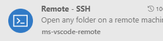
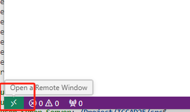
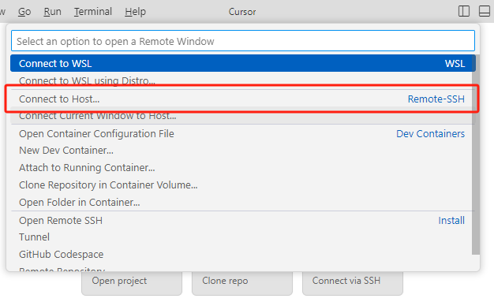
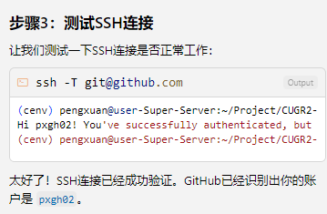
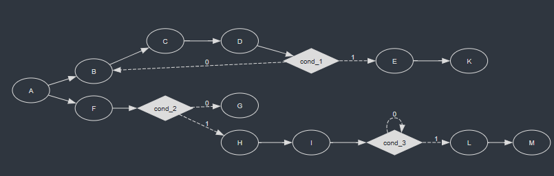

# vscode

## 通过ssh连接服务器

1. 下载`vscode`

2. 安装插件`Remote - SSH`

   

3. 点击`vscode`左下角绿色标记

   

4. 点击`Connect to Host`

   

5. 输入对应的服务器`ip`和`密码`

   第一次登陆后，会有一个config 文件在`C:\Users\your_user_name\.ssh\config`

   ```bash
   Host server_name#(default: ip)
     HostName server_ip #xxx.xxx.xxx.xxx
     Port 22
     User your_user_name
     ForwardX11 yes #用来可视化
   ```


## 离线安装remote_ssh server

https://blog.csdn.net/qq_43623902/article/details/136258880


## 免密登录（win2linux）


## Copilot

- [use rules](https://code.visualstudio.com/docs/copilot/getting-started?originUrl=%2Fdocs%2Fcopilot%2Fsetup#_create-custom-instructions)

  [instruction files](https://code.visualstudio.com/docs/copilot/customization/custom-instructions?originUrl=%2Fdocs%2Fcopilot%2Fchat%2Fcopilot-chat-context#_type-of-instructions-files)

  [Tips for defining custom instructions](https://code.visualstudio.com/docs/copilot/customization/custom-instructions?originUrl=%2Fdocs%2Fcopilot%2Fchat%2Fcopilot-chat-context#_tips-for-defining-custom-instructions)

  - Keep your instructions short and self-contained. Each instruction should be a single, simple statement. If you need to provide multiple pieces of information, use multiple instructions.
  - For task or language-specific instructions, use multiple `*.instructions.md` files per topic and apply them selectively by using the `applyTo` property.
  - Store project-specific instructions in your workspace to share them with other team members and include them in your version control.
  - Reuse and reference instructions files in your [prompt files](https://code.visualstudio.com/docs/copilot/customization/prompt-files) and [chat modes](https://code.visualstudio.com/docs/copilot/customization/custom-chat-modes) to keep them clean and focused, and to avoid duplicating instructions.

- [prompt files](https://code.visualstudio.com/docs/copilot/customization/prompt-files?originUrl=%2Fdocs%2Fcopilot%2Fcustomization%2Fcustom-instructions)

- [chat mode](https://code.visualstudio.com/docs/copilot/getting-started?originUrl=%2Fdocs%2Fcopilot%2Fsetup#_create-a-custom-chat-mode-for-code-reviews)

- [awesome-copilot](https://github.com/github/awesome-copilot/tree/main)

- [MCP](https://code.visualstudio.com/docs/copilot/customization/mcp-servers?originUrl=%2Fdocs%2Fcopilot%2Fcustomization%2Flanguage-models)

  

- [#-mentions](https://code.visualstudio.com/docs/copilot/chat/copilot-chat-context?originUrl=%2Fdocs%2Fcopilot%2Fchat%2Fcopilot-chat#_hashmentions)

  Instead of adding individual files manually, you can let VS Code find the right files from your codebase automatically. This can be useful when you don't know which files are relevant to your question.

  > Make sure to enable the [github.copilot.chat.codesearch.enabled](vscode://settings/github.copilot.chat.codesearch.enabled) *(preview)* setting to get the best results

- [@-mentions](https://code.visualstudio.com/docs/copilot/chat/copilot-chat-context?originUrl=%2Fdocs%2Fcopilot%2Fchat%2Fcopilot-chat#_atmentions)

  Chat participants are specialized assistants that enable you to ask domain-specific questions in chat. Imagine a chat participant as a domain expert to whom you hand off your chat request and it takes care of the rest.

- [Workspace indexing](https://code.visualstudio.com/docs/copilot/chat/copilot-chat-context?originUrl=%2Fdocs%2Fcopilot%2Fchat%2Fcopilot-chat#_workspace-indexing)

- [Agent tools](https://code.visualstudio.com/docs/copilot/chat/chat-agent-mode?originUrl=%2Fdocs%2Fcopilot%2Fchat%2Fcopilot-edits#_agent-mode-tools)

- 


## buglist

### [cpptools-srv](https://github.com/microsoft/vscode-cpptools/issues/12956#top) 疯狂生成core* 崩溃文件

安装新的cpp插件


# Codex CLI

### tutorial

在 `~/.codex/config.toml` 文件中进行基础配置：

````toml
# 模型配置
model = "codex-1"
#model = "gpt-5-codex"                      # Codex 0.36.0+ 支持
model_reasoning_effort = "high"            # 使用最大推理能力
model_reasoning_summary = "detailed"       # 终端显示详细推理总结 (Ctrl+T查看)
model_verbosity = "high"                   # 高详细度输出
model_supports_reasoning_summaries = true  # 强制启用推理总结

# 代理配置
hide_agent_reasoning = false               # 显示 Agent 内部思考过程

# 隐私配置
disable_response_storage = true            # 禁止 OpenAI 存储对话数据

# 权限配置 (建议通过 /approvals 命令配置)
approval_policy = "never"                  
sandbox_mode = "workspace-write"           

# 网络访问配置
[sandbox_workspace_write]
network_access = true                      # 允许网络访问
````

#### 恢复对话

Codex 的对话历史保存在本地目录 `~/.codex/sessions` 下：

**选择恢复对话：**

```
codex --resume    # 显示最近对话列表，手动选择
```

**直接继续上次对话：**

```
codex --continue  # 无需选择，自动继续上次对话
```

------


#### **[AGENTS.md](http://agents.md/)**

Codex 支持 **层级化的 [AGENTS.md](http://AGENTS.md) 配置**，在不同目录层级定义不同规则：


```
project-root/
├── AGENTS.md              # 全局规则（最低优先级）
├── src/
│   ├── AGENTS.md          # 源码目录规则
│   ├── components/
│   │   └── AGENTS.md      # 组件特定规则
│   └── tests/
│       └── AGENTS.md      # 测试特定规则（最高优先级）
```

重要技巧

每次修改 `AGENTS.md` 后，使用 `Ctrl+T` 查看 Codex 的思考过程，验证：

- 是否正确读取了 [AGENTS.md](http://agents.md/) 规则
- 命令调用是否符合预期
- 是否还有需要补充的规则


### install

- [远程 SSH 使用 Codex：转发本地 Clash 代理到服务器 | Welcome to Enoch's Blog!](https://cccignore.github.io/2025/06/21/远程 SSH 使用 Codex：转发本地 Clash 代理到服务器/index.html)
- [(67 封私信 / 80 条消息) 解决Codex插件在Remote SSH中的登录403报错问题 - 知乎](https://zhuanlan.zhihu.com/p/1964064988537808306)


# Gemini

## Ref

- [在remote ssh上登录gemini cli的临时解决方案 - 搞七捻三 - LINUX DO](https://linux.do/t/topic/752327)

  > 通过复制本地的`.gemini`到远端也可以

- 


# conda

## 基本命令

conda不止是能创建python相关的环境，还可以是cpp的环境等！

`conda install -c conda-forge gcc gxx cmake make ninja`

```bash
conda create --name myenv python=3.8
conda activate myenv
conda deactivate
conda list	#命令来查看当前环境中安装的包。
conda env remove --name myenv	#删除
conda info --envs	#查找所有虚拟环
```

```bash
conda install [package-name]        # 安装名为[package-name]的包
conda install [package-name]=X.X    # 安装名为[package-name]的包并指定版本X.X
conda update [package-name]         # 更新名为[package-name]的包
conda remove [package-name]         # 删除名为[package-name]的包
conda list                          # 列出当前环境下已安装的所有包
conda search [package-name]         # 列出名为[package-name]的包在conda源中的所有可用版本
```

```bash
conda create --name [env-name]      # 建立名为[env-name]的Conda虚拟环境
conda activate [env-name]           # 进入名为[env-name]的Conda虚拟环境
conda deactivate                    # 退出当前的Conda虚拟环境
conda env remove --name [env-name]  # 删除名为[env-name]的Conda虚拟环境
conda env list                      # 列出所有Conda虚拟环境
```


## 环境配置

```bash
wget https://repo.anaconda.com/miniconda/Miniconda3-py38_23.5.2-0-Linux-x86_64.sh
bash Miniconda3-py38_23.5.2-0-Linux-x86_64.sh
```


安装以后要重启才能生效！


## 环境迁移

- [【conda】实现conda环境迁移的4种方式-CSDN博客](https://blog.csdn.net/baidu_35692628/article/details/136519579)
-  [使用conda pack进行环境迁移（步骤很详细）-CSDN博客](https://blog.csdn.net/ds1302__/article/details/120027173)


## 常见问题

- 安装以后要重启才能生效！

- pycharm 无法添加 conda 环境时无法找到对应环境的 python.exe 文件 

> Conda Executable 是 conda 的执行文件，不是填环境的 python 解释器 0.0
>
> 看错两次了


# cuda 驱动，cuda-toolkit, cudnn

## 环境配置

[Windows 11/10 WSL2 Ubuntu 20.04 下配置 Cuda 及 Pytorch_win11 的 cuda 和 ubuntu 对比-CSDN 博客](https://blog.csdn.net/iwanvan/article/details/122119595)

### 安装 WSL Cuda 驱动

### cudatoolkit

[CUDA Toolkit 12.6 Update 1 Downloads | NVIDIA Developer](https://developer.nvidia.com/cuda-downloads?target_os=Linux&target_arch=x86_64)


### cudnn

[cuDNN Archive | NVIDIA Developer](https://developer.nvidia.com/rdp/cudnn-archive)

## 重装

[CUDA 的正确安装/升级/重装/使用方式 - 知乎 (zhihu.com)](https://zhuanlan.zhihu.com/p/520536351)


# pytorch, dgl, PyG

[PyTorch](https://pytorch.org/)

[Deep Graph Library (dgl.ai)](https://www.dgl.ai/pages/start.html)

[PyG](https://pytorch-geometric.readthedocs.io/en/latest/notes/installation.html)

```bash
conda install pytorch torchvision torchaudio pytorch-cuda=12.4 -c pytorch -c nvidia
conda install -c dglteam/label/th24_cu124 dgl
conda install pyg -c pyg
```

```python
#test
python -c "import torch; print(torch.cuda.is_available())"
python -c "import torch; print(torch.version.cuda)"

```


# docker

## 使用 dockerfile

### dockerfile

Dockerfile 是一个文本文件，包含一系列指令来组装 [Docker 镜像](https://so.csdn.net/so/search?q=Docker 镜像&spm=1001.2101.3001.7020)。每个指令执行一个特定动作，例如安装包、复制文件或定义启动命令。


```bash
docker pull ubuntu:20.04 #下一个镜像
docker run --rm ubuntu:22.04 nproc#安装，并查看cpu核心数
docker run -it ubuntu:22.04 bash #进入交互模式,这种情况在能用、
docker run -it --name my_centos7 -v /path/on/host:/path/in/container centos:7#如果需要将数据保存到宿主机上，可以挂载一个目录， 同时指定名字， 注意exit退出容器后容器还会存在，使用docker ps -a 才能看到
docker start <container_name> #重新启动暂停的容器
docker exec -it <container_name> bash #重新进入容器

apt install, 注意update
docker ps #查看运行的容器
docker ps -a#查看运行的容器,包括暂停的
#docker下 的gui显示也可以安装通过设置DISPLAY环境变量来处理
docker commit <容器ID或名称> <镜像名称>:<标签> #保存容器为镜像
docker images #查看保存的镜像
docker rm <container_name>#删除容器
docker rmi -f <镜像ID或名称> #删除镜像
docker exec -it my_container bash #对同一个docker容器开启多个终端
docker run -v <主机目录>:<镜像目录> -it <镜像名称>:<标签> bash #挂载
docker run -it --gpus all my_cugr_image #启用所有GPU
```

## container 内的C++项目debug

linux下vscode支持的调试器为gdb

1. 安装vs code 插件： Dev Container

2. 安装gdb:`apt-get install build-essential gdb`

3. 运行：Attach to Running Container

   

4. 在vscode中打开工程目录，并添加launch文件

5. 用g++或者用task.json生成binary可执行文件，注意编译的时候**加上-g**，-g意思就是编译出带调试信息的可执行文件，如果少了这个-g，生成的可执行文件就不能够调试了

6. 然后点三角形就行。


#### 参考

- [VSCode调试docker中的程序(C++) 和离线安装VSCode插件的方法_vs code docker插件dev container下载-CSDN博客](https://blog.csdn.net/xianxjm/article/details/112250699)
- launch.json官方教程https://go.microsoft.com/fwlink/?linkid=830387
- launch.json教程[VScode 调试教程 tasks.json和launch.json的设置（超详细）-CSDN博客](https://blog.csdn.net/qq_59084325/article/details/125662393)
- 

## centos 容器无法联网问题

>Could not retrieve mirrorlist http://mirrorlist.centos.org/?release=7&arch=x86_64&repo=os&infra=container error was
>14: curl#6 - "Could not resolve host: mirrorlist.centos.org; Unknown error"

```
#还是不行。。。
```

## 修改vscode docker容器内终端没有颜色


[自定义优化VsCode终端样式（提示高亮）_vscode终端颜色设置-CSDN博客](https://blog.csdn.net/weixin_45277161/article/details/130883635)


## install

[Ubuntu 安装 Docker_ubuntu 重新安装 docker-CSDN 博客](https://blog.csdn.net/breakaway_01/article/details/141285685)


# Git

## Gerrit-Git

[公司教程](https://cloud.italent.cn/PageHome/Index?product=Learning&keyName=Nusion&pageCode=LearningPlanDetailPage&appCode=Learning&id=e88cc4a6-2dc1-4df0-b284-40890ad35dfb&_qsrcapp=Learning&_qrt=html&quark_s=92885ba2bcb8c01354166887f7d1ce2dd3555ef5a4e3a3754f9b5e18dcf584c1#/viewDynamic?t=t&quark_s=bd841178dfbc1b9adb121eeadd71bfd241cc74cd78cfa6e159950402224c9010)

## base

- 全局配置文件：~/.gitconfig

- 当前仓库配置文件：.git/config

- to set git user:

  ```bash
       git config --global user.name "你的名字"
       git config --global user.email "你的邮箱"
  ```


## branch

```
git config --global init.defaultBranch <name> # change init branch name
git branch -m <name> #change the just-created branch

```

## .gitignore


## check

- `git status`

- `git status --short`

- `git branch -r` 指令可以查看远程仓库中的所有分支

- `git branch -a` 指令用于显示本地和远端的所有分支

- `git branch -vv` 指令显示本地分支与远端分支的追踪关系。

- 查看差异

  在 Git 中比较本地内容与上次提交的差异是日常开发中的高频操作。你可以根据文件是否已被添加到暂存区（`git add`），选择不同的命令。下面这个表格能帮你快速看清它们之间的关系和区别。

  | 比较范围                         | Git 命令                                  | 适用场景（提交前）                                           |
  | :------------------------------- | :---------------------------------------- | :----------------------------------------------------------- |
  | **工作区** ↔ **上次提交** (HEAD) | `git diff HEAD`                           | 查看所有已修改但**未提交**的变更（包括未暂存和已暂存的）。这是最全面的预览。 |
  | **工作区** ↔ **暂存区**          | `git diff`                                | 查看已修改但**未使用 `git add`暂存**的变更。                 |
  | **暂存区** ↔ **上次提交** (HEAD) | `git diff --cached`或 `git diff --staged` | 查看已使用 `git add`暂存，但**未提交**的变更。               |

- 

## commit and push

In VS Code, go to the Source Control view (left sidebar, Git icon). You’ll see the untracked files.
  - Click + (stage) on files or use the terminal: `git add .`
  - if u `add` some files you don't want to `add`, you can change your `.gitignore`, then use `git reset`
      `git rm -r --cached .`
  - `git commit -m "…"`


## clone & pull

https://blog.csdn.net/Lakers2015/article/details/111871196

### git clone

从远程服务器克隆一个一模一样的版本库到本地,复制的是整个版本库，叫做`git clone`。简单讲，`git clone`就是将一个库复制到本地，**是一个本地从无到有的过程**。包括里面的日志信息，git项目里的分支，你也可以直接切换、使用里面的分支等等。


### git pull

从远程服务器获取到一个branch分支的更新到本地，并更新本地库，叫做git pull.（pull是指同步一个你在本地有版本的库内容更新的部分到你的本地库）。

git pull 作用是，==取回远程主机某个分支的更新==，再与本地的指定分支合并。它的书写格式如下

`$ git pull #远程主机(origin)# #远程分支(next)#：#本地分支(master)#`

如果远程分支是与当前分支合并，则冒号后面的部分可以省略。

`$ git pull #远程主机(origin)# #远程分支(next)#`

该命令相当于 `git fetch origin` + `git merge origin/next`

> [!WARNING]
>
> 每次从本地仓库`push`到远程仓库之前都要先进行`git pull`操作，保证push到远程仓库时没有版本冲突。


## Connect to Remote

  1. ==Create a repository== on GitHub/Gitee/etc. (==without initializing== it with files if you already have local content).
  2. Copy its HTTPS or SSH URL.
  3. Back in VS Code terminal:
      - `git remote add origin <remote-url>`
      - `git branch -M main` (if you want main instead of master)
      - `git push -u origin <branch_name>`


## pull


## 分支管理

- `git checkout -b <new_branch_name> origin/<new_branch_name>`指令创建一个 `new_branch_name` 分支并切换到 `new_branch_name` 分支上，并建立远端`new_branch_name`分支的追踪关系

- 如果其他开发者push了，那么我们push的时候可能发生冲突：

  

- 


## 参考

- [如何使用 Git 进行多人协作开发（全流程图解）_git多人协作开发流程-CSDN博客](https://blog.csdn.net/whc18858/article/details/133209975)


## ssh 设置密钥

>fatal: unable to access 'https://github.com/xx/xxx.git/': GnuTLS recv error (-110): The TLS connection was non-properly terminated.





## auto upload project to github

1. new repo in web

2. init repo

  ```bash
  echo "# HarmonyOS-Health-app" >> README.md
  git init                          //初始化
  git add README.md                
  git commit -m "first commit"       
  git branch -M main                //确定为main分支, 老版本默认是master
  git remote add origin https://github.com/lion-kng/HarmonyOS-Health-app.git    //关联github与本地代码，这一步最重要！！！
  git push -u origin main            //上传代码
  ```

  > remember to set git user

### reference

- [vscode上传代码到github_vscode上传github-CSDN博客](https://blog.csdn.net/2203_75380431/article/details/147686301)`


# Latex

## latex in vscode

[华工课程论文和毕设Latex模板](https://github.com/mengchaoheng/SCUT_thesis)

教程：

- [texlive2023+vscode安装与配置（简洁版） - 知乎](https://zhuanlan.zhihu.com/p/624932249)

- [Visual Studio Code (vscode)配置LaTeX - 知乎](https://zhuanlan.zhihu.com/p/166523064)

LaTeX 配置（放到 `settings.json`)

```json
      //------------------------------LaTeX 配置----------------------------------
      // 设置是否自动编译
      "latex-workshop.latex.autoBuild.run": "onSave",
      //右键菜单
      "latex-workshop.showContextMenu": true,
      //从使用的包中自动补全命令和环境
      "latex-workshop.intellisense.package.enabled": true,
      //编译出错时设置是否弹出气泡设置
      "latex-workshop.message.error.show": false,
      "latex-workshop.message.warning.show": false,
      // 编译工具和命令
      "latex-workshop.latex.tools": [
          {
              "name": "xelatex",
              "command": "xelatex",
              "args": [
                  "-synctex=1",
                  "-interaction=nonstopmode",
                  "-file-line-error",
                  "%DOCFILE%"
              ]
          },
          {
              "name": "pdflatex",
              "command": "pdflatex",
              "args": [
                  "-synctex=1",
                  "-interaction=nonstopmode",
                  "-file-line-error",
                  "%DOCFILE%"
              ]
          },
          {
              "name": "latexmk",
              "command": "latexmk",
              "args": [
                  "-synctex=1",
                  "-interaction=nonstopmode",
                  "-file-line-error",
                  "-pdf",
                  "-outdir=%OUTDIR%",
                  "%DOC%"
              ],
              "env": {}
          },
          {
              "name": "lualatex",
              "command": "lualatex",
              "args": [
                  "-synctex=1",
                  "-interaction=nonstopmode",
                  "-file-line-error",
                  "-shell-escape", //这个命令行在网上的Latex Workshop设置里一般没有，所以直接recipe会报错
                  "%DOCFILE%"
              ]
          },
          {
              "name": "bibtex",
              "command": "bibtex",
              "args": [
                  "%DOCFILE%"
              ]
          },
          {
              "name": "biber",
              "command": "biber",
              "args": [
                  "%DOCFILE%"
              ]
          }
      ],
      // 用于配置编译链
      "latex-workshop.latex.recipes": [
          {
              "name": "XeLaTeX",
              "tools": [
                  "xelatex"
              ]
          },
          {
              "name": "PDFLaTeX",
              "tools": [
                  "pdflatex"
              ]
          },

          {
              "name": "xelatex -> bibtex -> xelatex*2",
              "tools": [
                  "xelatex",
                  "bibtex",
                  "xelatex",
                  "xelatex"
              ]
          },
          {
              "name": "xelatex -> biber -> xelatex*2",
              "tools": [
                  "xelatex",
                  "biber",
                  "xelatex",
                  "xelatex"
              ]
          },
          {
              "name": "pdflatex -> bibtex -> pdflatex*2",
              "tools": [
                  "pdflatex",
                  "bibtex",
                  "pdflatex",
                  "pdflatex"
              ]
          },

      ],
      
      //文件清理。此属性必须是字符串数组
      "latex-workshop.latex.clean.fileTypes": 
      [
          "*.aux",//包含有关文档交叉引用、标签和参考文献等信息
          "*.bbl",//用于管理文献引用和参考文献列表
          "*.blg",
          "*.idx",
          "*.ind",
          "*.lof",//插图目录
          "*.lot",
          "*.out",
          "*.toc",//目录
          "*.acn",
          "*.acr",
          "*.alg",
          "*.glg",
          "*.glo",
          "*.gls",
          "*.ist",
          "*.fls",
          "*.log",
          "*.fdb_latexmk",
      ],
  //设置为onFaild 在构建失败后清除辅助文件
      "latex-workshop.latex.autoClean.run": "onFailed",
      // 使用上次的recipe编译组合
      "latex-workshop.latex.recipe.default": "lastUsed",
      //使用 SumatraPDF 预览编译好的PDF文件
      // 设置VScode内部查看生成的pdf文件
      "latex-workshop.view.pdf.viewer": "tab",
      // PDF查看器用于在\ref上的[View on PDF]链接
      "latex-workshop.view.pdf.ref.viewer": "auto",
      "latex-workshop.synctex.indicator":"circle",//正向搜索显示
      "latex-workshop.view.pdf.internal.synctex.keybinding": "double-click", //双击反向搜索
      "editor.wordWrap": "on",
      "editor.renderControlCharacters": false,
      "security.workspace.trust.untrustedFiles": "newWindow", // 
      "files.autoSave": "afterDelay",// 自动保存
```

  

## ppt

> 感觉Beamer缺点就是插入图片太麻烦

- [Beamer——基于LaTeX制作学术PPT - 知乎](https://zhuanlan.zhihu.com/p/665090820)
- https://mpetroff.net/files/beamer-theme-matrix/


# taskflow

## introduction


Taskflow is faster, more expressive, and easier for drop-in integration than many of existing task programming frameworks in handling complex parallel workloads.


Taskflow solves a large-scale machine learning workload up to 29%
faster, 1.5 less memory, and 1.9 higher throughput than the industrial system, oneTBB, on a machine of 40 CPUs and 4 GPUs.

支持运行时间可视化：

- Taskflow comes with a built-in profiler, [Taskflow Profiler](https://taskflow.github.io/tfprof/), for you to profile and visualize taskflow programs in an easy-to-use web-based interface.


- 支持并行模块可视化

  


## Project Motivation

[Cookbook » Project Motivation | Taskflow QuickStart](https://taskflow.github.io/taskflow/ProjectMotivation.html)


## command

### 编译

`g++ -std=c++20 simple.cpp -I taskflow/ -O2 -pthread -o simple`


`nvcc -std=c++17 -I path/to/taskflow/ --extended-lambda simple.cu -o simple`


#### 编译两个文件

`nvcc -std=c++17 --extended-lambda -x cu -arch=sm_86 -I path/to/taskflow -dc cudaflow.cpp -o cudaflow.o` ## now we have the two compiled .o objects, main.o and cudaflow.o

`nvcc main.o cudaflow.o -o main` # link

- The `--extended-lambda` option tells `nvcc` to generate GPU code for the lambda defined with `**device**`.
-  The `-x cu` tells `nvcc` to treat the input files as .cu files containing both CPU and GPU code. By default, `nvcc` treats .cpp files as CPU-only code. 


## module

### Taskflow

`taskflow.emplace([](){})`	//add task

`taskflow.num_task()`	

`taskflow.placeholder() `// create a `task` with no work


#### trick

##### std::move()

```c++
tf::Taskflow taskflow1, taskflow3;

taskflow1.emplace([](){});

// move-construct taskflow2 from taskflow1
tf::Taskflow taskflow2(std::move(taskflow1));
assert(taskflow2.num_tasks() == 1 && taskflow1.num_tasks() == 0);

// move-assign taskflow3 to taskflow2
taskflow3 = std::move(taskflow2);
assert(taskflow3.num_tasks() == 1 && taskflow2.num_tasks() == 0);
```

`taskflow.composed_of(other_taskflow)`


### Task

`task.name("")`	//set name

`task.work([](){})`	//set work

`task.data()` 	//set or get  task's data

`task.precede(other task)`	//set pretask

`task.num_dependents()`	//get dependents num

`task.num_successors()` 	//get sucessors num

```c++
// traverse all successors of my_task
my_task.for_each_successor([s=0] (tf::Task successor) mutable {
  std::cout << "successor " << s++ << '\n';
});

// traverse all dependents of my_task
my_task.for_each_dependent([d=0] (tf::Task dependent) mutable {
  std::cout << "dependent " << d++ << '\n';
});
```

#### condition task

```c++
tf::Taskflow taskflow;

tf::Task A = taskflow.emplace([](){}).name("A");
tf::Task B = taskflow.emplace([](){}).name("B");
tf::Task C = taskflow.emplace([](){}).name("C");
tf::Task D = taskflow.emplace([](){}).name("D");
tf::Task E = taskflow.emplace([](){}).name("E");
tf::Task F = taskflow.emplace([](){}).name("F");
tf::Task G = taskflow.emplace([](){}).name("G");
tf::Task H = taskflow.emplace([](){}).name("H");
tf::Task I = taskflow.emplace([](){}).name("I");
tf::Task K = taskflow.emplace([](){}).name("K");
tf::Task L = taskflow.emplace([](){}).name("L");
tf::Task M = taskflow.emplace([](){}).name("M");
tf::Task cond_1 = taskflow.emplace([](){ return std::rand()%2; }).name("cond_1");
tf::Task cond_2 = taskflow.emplace([](){ return std::rand()%2; }).name("cond_2");
tf::Task cond_3 = taskflow.emplace([](){ return std::rand()%2; }).name("cond_3");

A.precede(B, F);
B.precede(C);
C.precede(D);
D.precede(cond_1);
E.precede(K);
F.precede(cond_2);
H.precede(I);
I.precede(cond_3);
L.precede(M);

cond_1.precede(B, E);       // return 0 to 'B' or 1 to 'E'
cond_2.precede(G, H);       // return 0 to 'G' or 1 to 'H'
cond_3.precede(cond_3, L);  // return 0 to 'cond_3' or 1 to 'L'

taskflow.dump(std::cout);
```



`cond` 不止支持true和false，也可有3个以上的输出情况，相当于switch, 当然也可以设计成while


#### AsyncTask


### Executor

`executor.this_worker_id()`

```c++
#### create excutor
tf::Executor executor1;     // create an executor with the number of workers
                            // equal to std::thread::hardware_concurrency, 106 server has 256 thread(当前硬件支持的并发线程数量)
tf::Executor executor2(4);  // create an executor of 4 worker threads
```

```c++
tf::Future<void> fu = executor.run(taskflow); //Each run variant of tf::Executor returns a tf::Future object which allows you to wait 
fu.wait();//run the taskflow once and wait for completion


executor.run(taskflow, [](){ std::cout << "end of 1 run"; }).wait(); //runs the taskflow once with a callback to invoke when the execution finishes

executor.run_n(taskflow, 4); 
executor.wait_for_all();  //run the taskflow four times and use tf::Executor::wait_for_all to wait for completion

executor.run_n(taskflow, 4, [](){ std::cout << "end of 4 runs"; }).wait();	//runs the taskflow four times and invokes a callback at the end of the fourth execution
executor.run_until(taskflow, [cnt=0] () mutable { return ++cnt == 10; });	// keeps running the taskflow until the predicate returns true
```

```c++
//corun:
///deadlock:在 C++ 多线程编程中，死锁（Deadlock） 是最危险的并发问题之一，指两个或多个线程因互相等待对方释放资源而永久阻塞
tf::Executor executor(2);
tf::Taskflow taskflow;
std::array<tf::Taskflow, 1000> others;

std::atomic<size_t> counter{0};

for(size_t n=0; n<1000; n++) {
  for(size_t i=0; i<500; i++) {
    others[n].emplace([&](){ counter++; });
  }
  taskflow.emplace([&executor, &tf=others[n]](){
    // blocking the worker can introduce deadlock where
    // all workers are waiting for their taskflows to finish
    executor.run(tf).wait();
  });
}
executor.run(taskflow).wait();

//-------------------------------------------------------------------
tf::Executor executor(2);
tf::Taskflow taskflow;
std::array<tf::Taskflow, 1000> others;

std::atomic<size_t> counter{0};

for(size_t n=0; n<1000; n++) {
  for(size_t i=0; i<500; i++) {
    others[n].emplace([&](){ counter++; });
  }
  taskflow.emplace([&executor, &tf=others[n]](){
    // the caller worker will not block but corun these
    // taskflows through its work-stealing loop
    executor.corun(tf);	//注意这里没有.wait
  });
}
executor.run(taskflow).wait();
```

`executor.corun_until()`


`observer`https://taskflow.github.io/taskflow/ExecuteTaskflow.html#ObserveThreadActivities

`tf::WorkerInterface`可以将一个worker映射到一个特定的CPU内核https://taskflow.github.io/taskflow/ExecuteTaskflow.html#ModifyWorkerProperty


异步任务：[Cookbook » Asynchronous Tasking | Taskflow QuickStart](https://taskflow.github.io/taskflow/AsyncTasking.html)

Taskflow库中的异步任务机制允许在任务执行过程中动态生成并行任务，提供了灵活的任务管理和同步方式。以下是详细解释：

- `executor.async(F&& f)`：启动异步任务，返回 `std::future` 以获取结果。
- `executor.silent_async(F&& f)`：启动异步任务，无返回值，开销更小。


### Future

`future.get()`

`future.cancel()`


### cudaFlow

- `cudaflow.kernel(grid_dim, block_dim, Ns, kernel_function, N, other_args)`//<<<(N+255)/256, 256, 0>>>(N, 2.0f, dx, dy)
- `cudaflow.run(stream)`
- `cudaflow.copy(src, dst, N)`
- `cudaflow.memset(target, 0, sizeof(int) * count)`
- `cudaflow.fill(target, 0, count)`
- `cudaflow.zero(target, count)`


#### [Integrate a cudaFlow into Taskflow](https://taskflow.github.io/taskflow/GPUTaskingcudaFlow.html#IntegrateCudaFlowIntoTaskflow)

```c++
tf::Executor executor;
tf::Taskflow taskflow;

taskflow.emplace([](){
  // create a cudaFlow inside a static task
  tf::cudaFlow cudaflow;

  // ... create a kernel task
  cudaflow.kernel(...);
  
  // run the capturer through a stream
  tf::cudaStream stream;
  capturer.run(stream);
  stream.synchronize();
});
```


### cudaStream

`cudastream.synchronize()`


#### [Run a cudaFlow on Specific GPU](https://taskflow.github.io/taskflow/GPUTaskingcudaFlow.html#run_a_cudaflow_on_a_specific_gpu)


### Subflow

没看懂有什么用


### Runtime

`runtime.schedule(task)`	//forcefully run task

`runtime.corun(taskflow)`	//还是不太懂https://taskflow.github.io/taskflow/RuntimeTasking.html#RuntimeTaskingRunATaskGraphSynchronously


Taskflow allows a static task and a condition task to take a referenced [tf::Runtime](https://taskflow.github.io/taskflow/classtf_1_1Runtime.html) object that provides a set of methods to interact with the scheduling runtime. The following example creates a static task that leverages [tf::Runtime](https://taskflow.github.io/taskflow/classtf_1_1Runtime.html) to explicitly schedule a conditioned task which would never run under the normal scheduling circumstance:

```
tf::Task A, B, C, D;
std::tie(A, B, C, D) = taskflow.emplace(
  [] () { return 0; },
  [&C] (tf::Runtime& rt) {  // C must be captured by reference
    std::cout << "B\n"; 
    rt.schedule(C);
  },
  [] () { std::cout << "C\n"; },
  [] () { std::cout << "D\n"; }
);
A.precede(B, C, D);
executor.run(taskflow).wait();
```


When the condition task `A` completes and returns `0`, the scheduler moves on to task `B`. Under the normal circumstance, tasks `C` and `D` will not run because their conditional dependencies never happen. This can be broken by forcefully scheduling `C` or/and `D` via a runtime object of a task that resides in the same graph. Here, task `B` call [tf::Runtime::schedule](https://taskflow.github.io/taskflow/classtf_1_1Runtime.html#aa7e72cc0f298475195b252c8f1793343) to forcefully run task `C` even though the weak dependency between `A` and `C` will never happen based on the graph structure itself. As a result, we will see both `B` and `C` in the output:


### Semaphore

 limit the concurrency or the maximum number of workers in your Taskflow applications.https://taskflow.github.io/taskflow/LimitTheMaximumConcurrency.html#DefineASemaphore


## install

Taskflow is *header-only* and there is no wrangle with installation. To compile the program, clone the Taskflow project and tell the compiler to include the headers under `taskflow/`.

```c++
#include <taskflow/taskflow.hpp>  // Taskflow is header-only

int main(){
  
  tf::Executor executor;
  tf::Taskflow taskflow;

  auto [A, B, C, D] = taskflow.emplace(  // create four tasks
    [] () { std::cout << "TaskA\n"; },
    [] () { std::cout << "TaskB\n"; },
    [] () { std::cout << "TaskC\n"; },
    [] () { std::cout << "TaskD\n"; } 
  );                                  
                                      
  A.precede(B, C);  // A runs before B and C
  D.succeed(B, C);  // D runs after  B and C
                                      
  executor.run(taskflow).wait(); 

  return 0;
}
```

```shell
~$ git clone https://github.com/taskflow/taskflow.git  # clone it only once
~$ g++ -std=c++20 simple.cpp -I taskflow/ -O2 -pthread -o simple
~$ ./simple
TaskA
TaskC 
TaskB 
TaskD
```

可以把git clone 下的taskflow_master/taskflow 放到`{workspace}/include/`下，这样编译的时候用 `-I ./include` 就行


## 参考

1. [Taskflow QuickStart](https://taskflow.github.io/taskflow/pages.html)
2. [Taskflow: A General-purpose Task-parallel Programming System](https://taskflow.github.io/)
3. [Modern C++ Parallel Task Programming | Taskflow QuickStart](https://taskflow.github.io/taskflow/index.html)

# 代理

[windows11 搭建 WSL2 运行环境（2024）-CSDN 博客](https://blog.csdn.net/qq_39316962/article/details/139927197)


# Hugo/mkdoc

> hugo 有点麻烦，mkdoc简单点

### 参考

[如何用 GitHub Pages + Hugo 搭建个人博客 · KrislinBlog](https://krislinzhao.github.io/docs/create-a-wesite-using-github-pages-and-hugo/#9-reference)


# Jira

软件产品管理

[公司教程](https://cloud.italent.cn/PageHome/Index?product=Learning&keyName=Nusion&pageCode=LearningPlanDetailPage&appCode=Learning&id=e88cc4a6-2dc1-4df0-b284-40890ad35dfb&_qsrcapp=Learning&_qrt=html&quark_s=92885ba2bcb8c01354166887f7d1ce2dd3555ef5a4e3a3754f9b5e18dcf584c1#/viewDynamic?t=t&quark_s=bd841178dfbc1b9adb121eeadd71bfd241cc74cd78cfa6e159950402224c9010)


