# 模拟设计流程

- 以一个环振PLL的模拟部分为例
- PDK: SMIC 28nm
- 工具链：virtuoso
- 环境: 学院服务器, 使用服务器的脚本source 相关的软件环境

## 1. PDK install

一般会给多个工艺库选项，这次SMIC 28 项目中:SPDK28HKCPlus==LG==_0925_OA_CDS_V1和SPDK28HKCPlus==RF==_0925_OA_CDS_V1.0_REV5_1需要选择一个进行安装

``` 
SPDK28HKCPlusLG_0925_OA_CDS_V1.0_REV5_2和SPDK28HKCPlusRF_0925_OA_CDS_V1.0_REV5_1这两个PDK的主要区别如下：
主要区别
工艺技术定位:
LG (Logic Gate): 主要用于常规数字逻辑电路设计，专注于低功耗和高性能的通用逻辑电路
RF (Radio Frequency): 特别针对射频电路设计优化，包含专门的射频元器件模型和参数
特殊器件支持:
RF PDK 包含了大量射频专用器件模型:
高Q值电感 (ind_spiral, ind_2Tdiff, ind_3Tdiff)
射频变容二极管 (rf_var)
射频电阻模型 (rf_res)
MOM电容 (rf_mom)
LG PDK 主要包含标准逻辑单元所需的基本器件模型
文件结构:
RF PDK的spectre目录有明显更多的射频特定模型文件
RF PDK包含额外的emxkit目录，用于电磁仿真
版本差异:
LG是REV5_2版本，比RF的REV5_1版本更新
RF特别标明了金属层配置: 1P10M_8Ic_1TMc_1MTTc_ALPA2（1个poly层，10个金属层）
适用场景
SPDK28HKCPlusLG:
适合纯数字电路设计
适合低功耗应用
更适合标准单元库开发和ASIC设计
SPDK28HKCPlusRF:
适合射频电路设计（如RF收发器、PLL、混频器等）
支持高频模拟电路
包含特殊射频器件模型（电感、变容二极管等）
适合混合信号RF SoC设计
```

这里选择RF，然后安装：

```markdown
1. README.INSTALL                             ---> This file.
2. SMIC_PDK_install                           ---> Perl script to install SMIC PDK.
3. smic28hkcPlusrf_Enhance_0925_oa_cds_vxx     ---> PDK source data for installation.  

How to Install:
1. Type "SMIC_PDK_install" in command line to execute the script, then follow the instruction step by step to install your required PDK option. 
2. User can get help by typing "SMIC_PDK_install -h", or refer to the quick start located at "smic28hkcPluslg_0925_oa_cds_vxx/docs/SMIC_OA_CDS_quick_start_28HKCPlusLG_0925_Vxx.pdf"for more details.
```

> 有个点需要注意：
>
> NOTICE: This PDK only contains RC extraction files for below metal options:
> 1P8M for 8X + ultra thick Cu top metal layers ALPA2=28k,
> For the other metal options, user can download RC files from SMICNOW, or raise request if 
> no such supply, we will deliver upon request. 


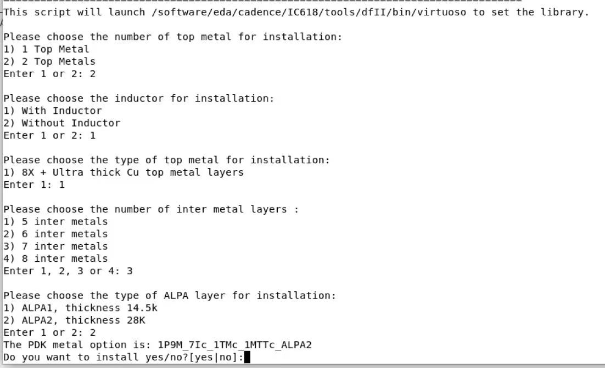

### 1.1 导入数字库

第一次做的时候所有的基本逻辑门都是自己搭的，这是不需要的，至少对于大多数非关键性能的逻辑门。

数字标准库中的器件相比自己手画，往往具有更高的性能，所以要导入数字库

#### 1.1.1 导入symbol

- 可以使用Verilog In(`SMIC28 `不知道为什么导入是`VDD!, VSS!`)，

- 或者复制pdk数字库中的`cdn_symbol`文件到当前library（这种方法不知道怎么在virtuoso中导入，我是直接将对应的器件symbol文件夹复制过去的）

  - 对应脚本：

    ```tcl
    #!/usr/bin/env bash
    set -euo pipefail
    
    SRC="/SM05/home/phd2024/phd202411094979/project/cpicp25/pdk/STDCELL/SCC28NHKCP_HDC30P140_RVT_V0p2/cdn_symbol/scc28nhkcp_hdc30p140_rvt_oa"
    DST="/SM05/home/phd2024/phd202411094979/project/cpicp25/analog/mylib_new/hdc_lib"
    
    mkdir -p "$DST"
    
    # 遍历所有器件目录，若存在 symbol 子目录则覆盖复制到目标
    find "$SRC" -mindepth 1 -maxdepth 1 -type d | while read -r cellDir; do
      cellName="$(basename "$cellDir")"
      if [ -d "$cellDir/symbol" ]; then
        mkdir -p "$DST/$cellName"
        # rsync -a --delete "$cellDir/symbol/" "$DST/$cellName/symbol/"
        cp -r "$SRC/$cellName/symbol" "$DST/$cellName/symbol"
        echo "Copied: $cellName"
      fi
    done
    
    echo "Done."
    ```

#### 1.1.2 导入layout

使用Stream In， 导入gds 文件

> 和倒数数字模块一样

#### 1.1.3 导入schematic

有的标准库的verilog文件是可以在Verilog In 的时候导入的，但是有些不行（至少SMIC28不行）。
使用Spice In, 通过`.cdl`文件导入

> 注意`device_map`文件的书写, 貌似只要把`.cdl`文件里面的pmos, nmos, diode 写进来就行
>
> 注意进行参数映射，`.cdl`的参数和pdk中的参数定义可能不一样，区分大小写
>
> ```txt
> -- Device Mapping file generated from SpiceIn GUI
> devSelect := p09_ckt p09_ckt
> 	propMap := W w L l
> 
> devSelect := n09_ckt n09_ckt
> 	propMap := W w L l
> 
> devSelect := ndio09 ndio09
> 	propMap := AREA area
> 
> 
> ```
>
> 

> [!WARNING]
>
> 发现这部分器件长宽对不上的情况

##### 参考

- [数字标准单元库cdl导入virtuoso_virtuoso导入cdl-CSDN博客](https://blog.csdn.net/weixin_45894265/article/details/143484308)
- [通过virtuoso的spice in功能批量将数字标准单元库网表转换成schematic的方法 - 知乎](https://zhuanlan.zhihu.com/p/678951019)

## 2. New Liabrary

### 1. new `cds.lib`

```bash
DEFINE cdsDefTechLib $CDSHOME/tools/dfII/etc/cdsDefTechLib 
DEFINE basic         $CDSHOME/tools/dfII/etc/cdslib/basic 
DEFINE analogLib     $CDSHOME/tools/dfII/etc/cdslib/artist/analogLib 
DEFINE smic28hkmg ~/pdk/SMIC28_uncomp/PDK/SPDK28HKCPlusRF_0925_OA_CDS_V1.0_REV5_1/smic28hkcPlusrf_0925_1P10M_8Ic_1TMc_1MTTc_ALPA2_oa_cds_2021_12_15_v1.0_rev5_1/smic28hkmg/
```

- cdsDefTechLib: Cadence默认技术库，包含基本的技术定义和参数。它为Virtuoso环境提供默认设置和配置，是Cadence工具运行的基础库。
- basic: 基本元件库，包含电路设计所需的最基础组件和原语。它提供了如引脚(pin)、端口(port)等基本元素，这些是原理图绘制和版图设计的基础构建模块。
- analogLib: : 模拟组件库，包含用于模拟电路仿真的==理想化组件==。这个库中有理想电压源/电流源、无源元件(电阻、电容、电感)、各种分析模型，以及基本的数字组件如缓冲器、反相器等。这些组件都是与工艺无关的，通常用于初始设计探索和仿真。
- smic28hkmg: PDK 安装后生成的路径

### 2. run virtuoso

- 当前文件夹

  ```bash
  |-- README.md -> .cursor/rules/analogdesign.mdc
  |-- bak
  |   `-- scripts
  |-- docs
  |   `-- xxx.pdf
  |-- mylib
  |-- runspace
  |   |-- cds.lib -> ../scripts/cds.lib
  |   |-- libManager.log
  |   `-- logs_phd202411094979
  `-- scripts
      `-- cds.lib
  ```

  > ./scripts：下放所有脚本
  >
  > ./runspace: virtuoso的启动路径，运行后virtuoso会在这个目录下生成一些log文件。我这里在`runspace`下建了一个`scripts/cds.lib`的软链
  >
  > ./docs：放一些相关文档
  >
  > ./mylib: 之后放有一些新建的`library`

- bash CMD: `virtuoso`

- Click: `Tools --> Library Manager`

- 

- 如果cds没写错，`Library Manager`长这样， `smic28hkmg`就是PDK安装后的库

  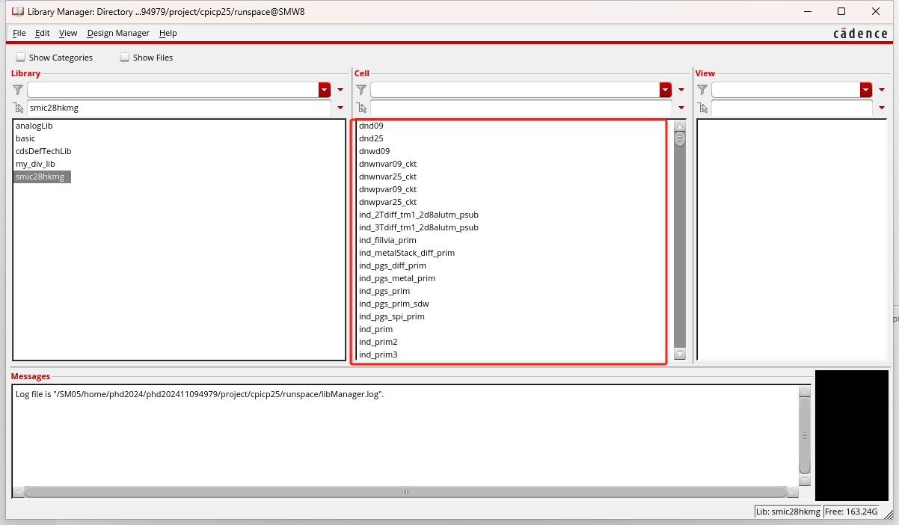

  > my_div_lib是我已经建好的，按照教程现在其实是没有的
  >
  > 红框内就是对应的器件
  >
  > 中间的`Cell`是各种器件
  >
  > 右边的`View`就是每个`Cell`的一些原理图`schematic`, 图标`symbol`, 版图`layout`, 测试环境`state`&`maestro`, `constraint`等

###  3. new `Library`

  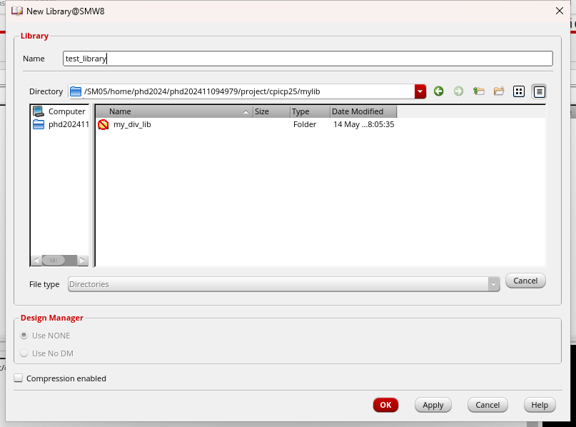

  

  

  

  >Compile an ASCII technology file (编译ASCII技术文件)
  >
  >- 当你有自定义的ASCII格式技术文件(.tf)时使用
  >
  >- 系统会根据此文件编译并创建新的技术库
  >
  >- 适用于:**需要自定义工艺规则的情况**
  >
  >Reference existing technology libraries (引用现有技术库)
  >
  >- 允许**引用多个已存在的技术库**
  >
  >- 不创建新的技术库，而是引用现有库的技术信息
  >
  >- 适用于:**需要多个技术库信息的设计**
  >
  >Attach to an existing technology library (附加到现有技术库) 
  >
  >- 直接将新库附加到一个现有的已编译技术库
  >
  >- **新库将完全继承该技术库的所有设置，包括层级定义、DRC规则等**
  >
  >- 适用于:在现有工艺下创建标准设计库(最常用选项)
  >
  >Do not need process information (不需要工艺信息)
  >
  >- 创建不含任何工艺信息的库
  >
  >- 适用于:仅含符号的库、行为模型库等不需物理版图信息的库

  在SMIC 28nm设计中，选择第3个选项，附加到已有的工艺库(`smic28hkmg`)。

  


- 也可以使用`Tools -->  Library Path Editor`新建或者添加别人的`Library`


  > `cds.lib`现在变为：
  >
  > ```bash
  > # File Created by  at Mon May 26 10:59:50 2025
  > # assisted by CdsLibEditor
  > DEFINE cdsDefTechLib $CDSHOME/tools/dfII/etc/cdsDefTechLib
  > DEFINE basic $CDSHOME/tools/dfII/etc/cdslib/basic
  > DEFINE analogLib $CDSHOME/tools/dfII/etc/cdslib/artist/analogLib
  > DEFINE smic28hkmg ~/pdk/SMIC28_uncomp/PDK/SPDK28HKCPlusRF_0925_OA_CDS_V1.0_REV5_1/smic28hkcPlusrf_0925_1P10M_8Ic_1TMc_1MTTc_ALPA2_oa_cds_2021_12_15_v1.0_rev5_1/smic28hkmg/
  > DEFINE my_div_lib /SM05/home/phd2024/phd202411094979/project/cpicp25/mylib/my_div_lib
  > DEFINE ropll /SM05/home/pgs2024/pgs202421065159/s28/ropll/ropll
  > DEFINE test_library /SM05/home/phd2024/phd202411094979/project/cpicp25/mylib/test_library
  > ```

## 3. new Cell‘s schematic and symbol

> import basic logic gate from imported digtal library

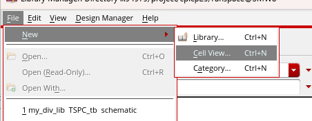

- 

- 新建`Cell`一般是先新建`schematic`，这里`OR`就是要新建的`Cell`的名字

- 编辑`schematic`原理图

  - 用快捷键`i`插入器件

    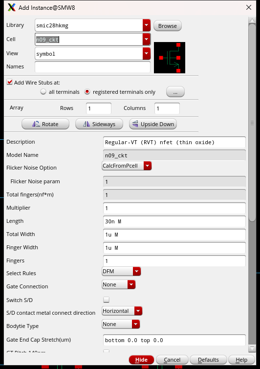

  - 用快捷键`q`编辑器件属性

    

  - 用快捷键`c`复制器件

  - 用快捷键`u`撤销编辑

  - 用快捷键`w`布线

    

  - 用快捷键`L（小写）`加入`label`, 相同的`label`的`wire`是连在一起的

  - 用快捷键`r`旋转器件等

  - 用快捷键`p`加入`port`, 也就是这个`Cell`的外部引脚，注意输入输出等

  - 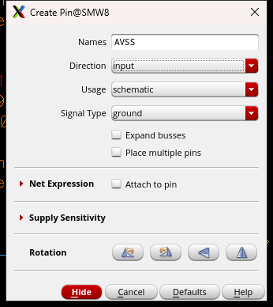

  - 

  - 

    > 模拟电源一般命名为AVDD和AVSS
    >
    > 数字则是DVDD, DVSS

  - `Ctrl +s `保存`schematic`，再点击`Check and Save`

    

    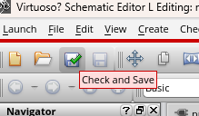

    > 现在Library Manager 里面就有了相应的View， 其他也是一样的
    >
    > 对应的文件也在`./mylib/my_div_lib/NOR/下面

    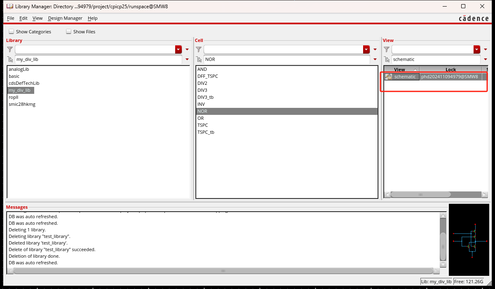

- 新建`symbol`

  

  

  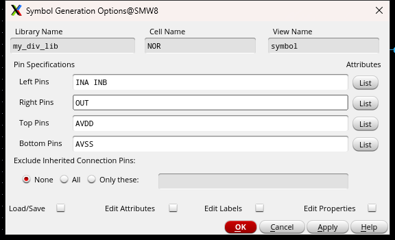

  

  > 这里可以简单绘制一下，默认也行，就是一个矩形

  保存

  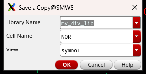

  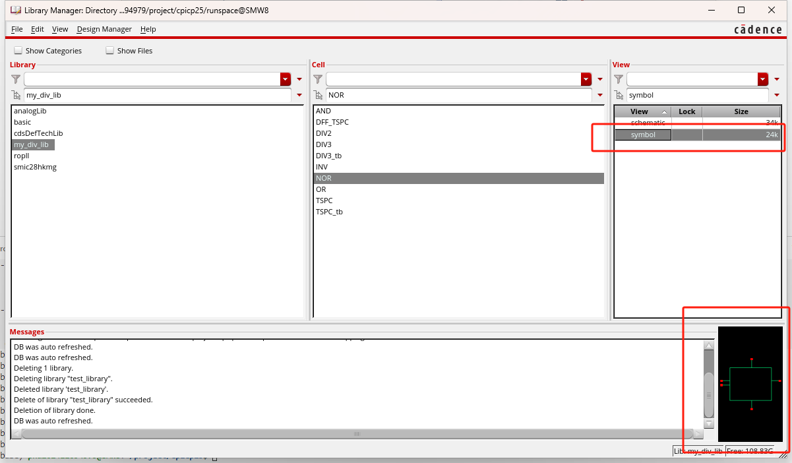

- 同理，新建`OR`的`schematic`， 使用创建好的`symbol`来画原理图，实现复用

  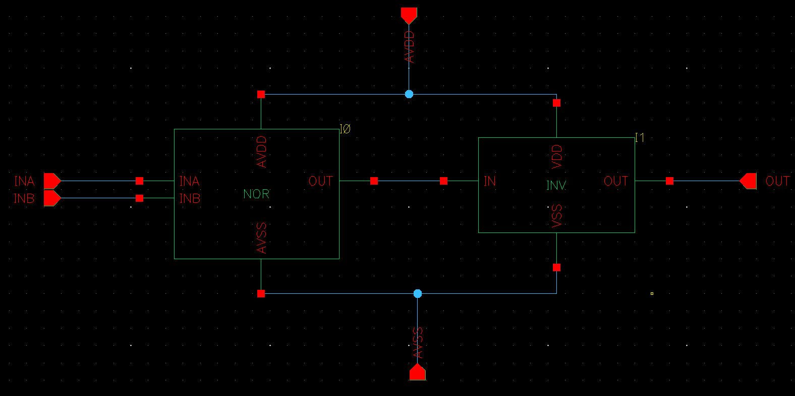

  > NOR + INV = OR

- 

## 4. 搭建`testbench`

- 新建原理图

- 插入自己设计的模块的`symbol`

  

  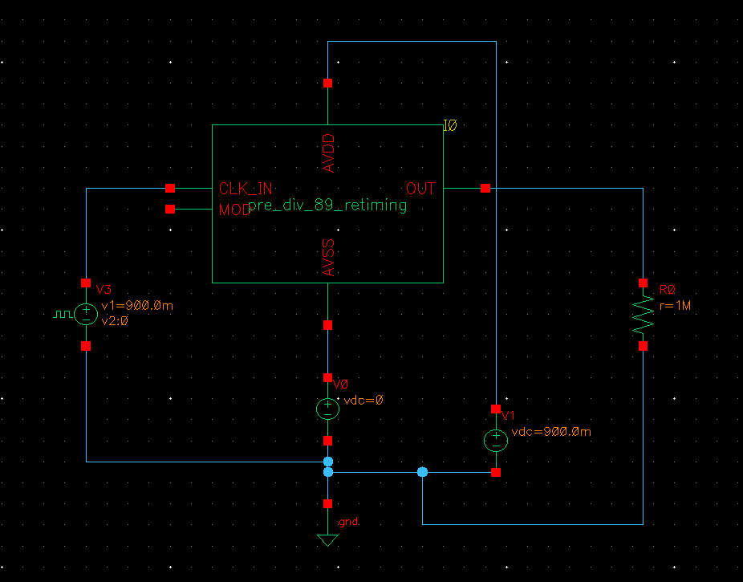

  > 一个分频器示例

- gnd, 直流源, clk等在`anlogLib`中


## 5. ADE前仿

- 简单的任务可以用`ADE L`, 复杂了可以用`ADE Explorer` 和`ADE Assembler`, 具体使用查看[这里](# simulation ADE)

  > 貌似现在还用`ADE L`有点落伍了0.0

  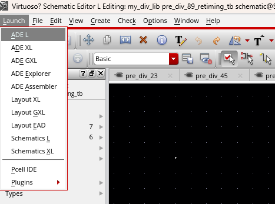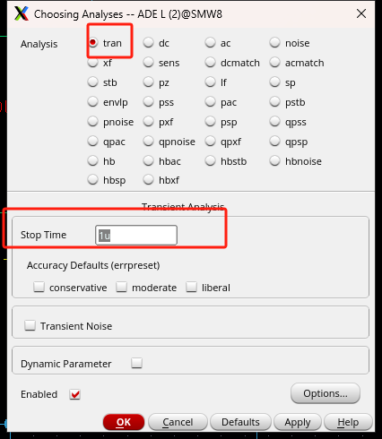

  

  > 这里选择做一个简单的瞬态仿真

  - 选择观察信号

    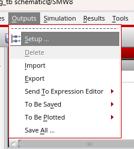

    `ADE Explorer` 中的做法：

    

    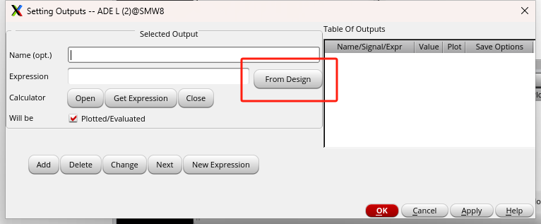

    > 简单选取`schematic`中的`wire`
    >
    > 也可以自定义一些表达式

  - 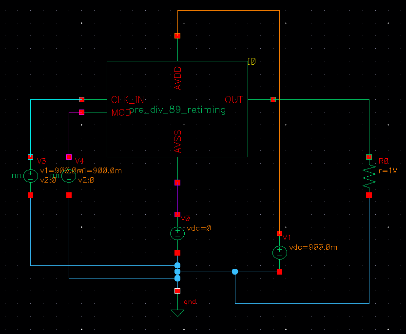

  - 点击后会变颜色

    

    > 点击`wire`是电压，`pin`是电流
    >
    > 可以给原理图一些`label`明确一下是哪个信号

  - 开启仿真

    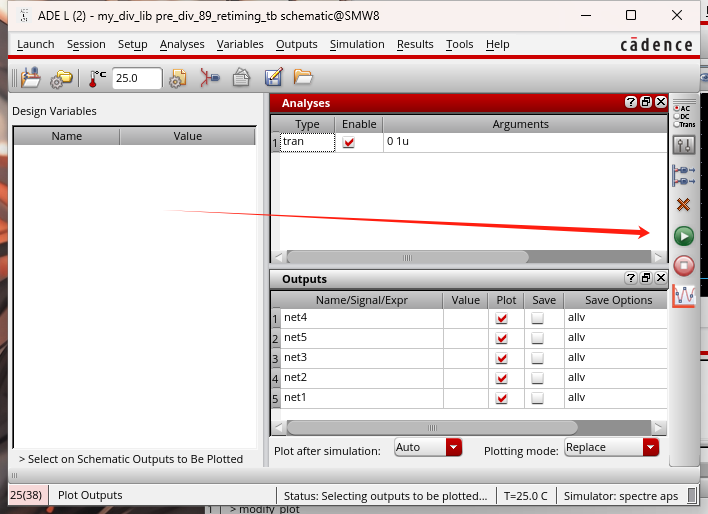

    - `ADE Explorer`

    仿真运行中：

    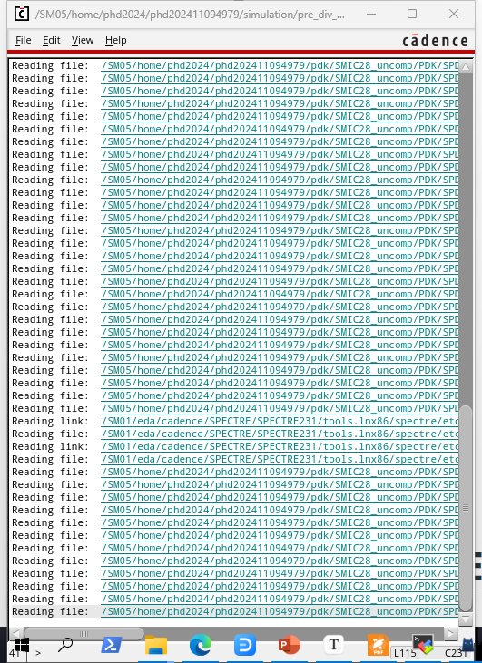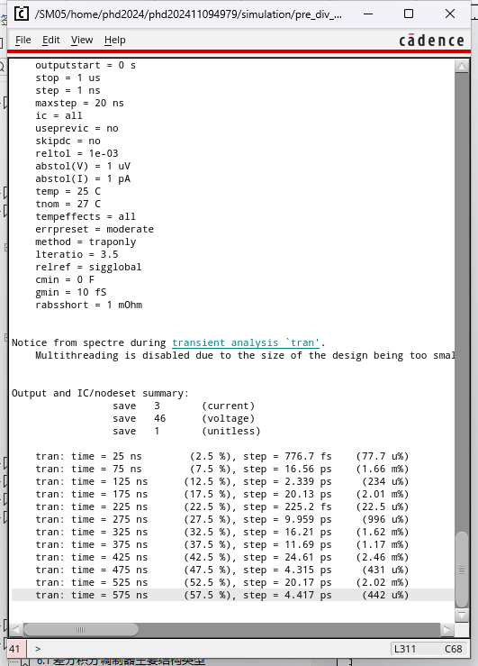

  - 仿真结束，弹出波形

    

    - `ADE Explorer`

      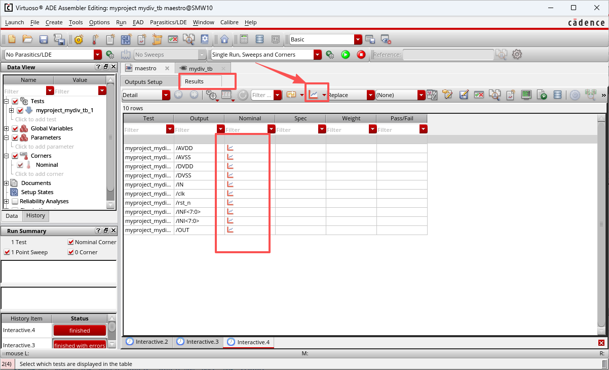

    

    > 可以右键`split current strip-->trace`把波形分开，然后可以拖动、缩放波形

  - 检查波形

    - 可以使用快捷键`v`实现测量

    - 选中一个光标以后按`d`, 可以看两个光标之间的距离

    - 也可以使用`calculator`的表达式功能

      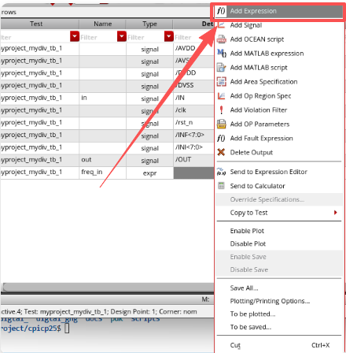

      

      

      

- 仿真结束可以保存为`state`，一般用`cellview`

  

  然后在这个`Cell`的`Veiw`里面就会有个`state`, 这个也可以导入到`ADE Explorer`

## 6.前仿PVT验证

> [!NOTE]
>
> 感觉这一步可以不做？如果没时间，或者性能卡得很死才做

1. 获取`corner.scs`

   

   > 别人给我的，不知道, 
   >
   > 安装目录有自带的，在`install/models/spectre/**.scs`, 或者`install/models/spectre/**.lib`
   >
   > `ADE Explorer`下也可以看到
   >
   > 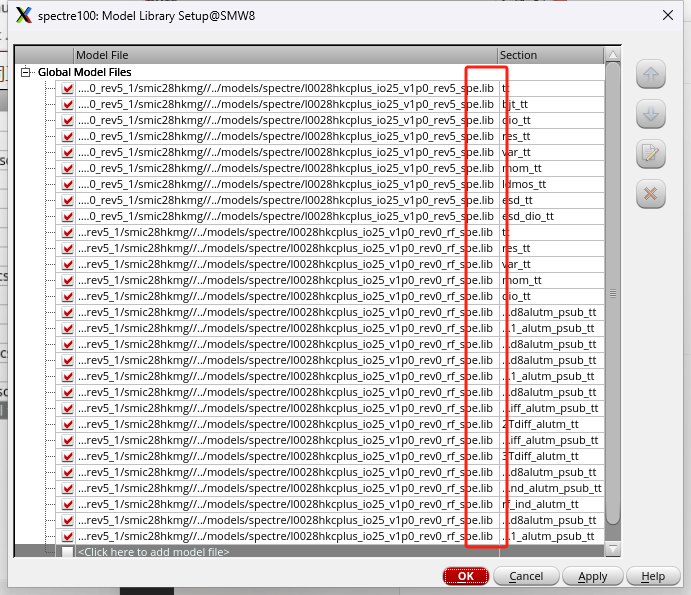
   >
   > 

   - smic28 的一个示例`.scs文件`

     ```txt
     section top_tt
     include "/SM05/home/phd2024/phd202411094979/pdk/SMIC28_uncomp/PDK/SPDK28HKCPlusRF_0925_OA_CDS_V1.0_REV5_1/smic28hkcPlusrf_0925_1P10M_8Ic_1TMc_1MTTc_ALPA2_oa_cds_2021_12_15_v1.0_rev5_1/smic28hkmg/../models/spectre/l0028hkcplus_io25_v1p0_rev5_spe.lib" section=tt
     include "/SM05/home/phd2024/phd202411094979/pdk/SMIC28_uncomp/PDK/SPDK28HKCPlusRF_0925_OA_CDS_V1.0_REV5_1/smic28hkcPlusrf_0925_1P10M_8Ic_1TMc_1MTTc_ALPA2_oa_cds_2021_12_15_v1.0_rev5_1/smic28hkmg/../models/spectre/l0028hkcplus_io25_v1p0_rev5_spe.lib" section=bjt_tt
     include "/SM05/home/phd2024/phd202411094979/pdk/SMIC28_uncomp/PDK/SPDK28HKCPlusRF_0925_OA_CDS_V1.0_REV5_1/smic28hkcPlusrf_0925_1P10M_8Ic_1TMc_1MTTc_ALPA2_oa_cds_2021_12_15_v1.0_rev5_1/smic28hkmg/../models/spectre/l0028hkcplus_io25_v1p0_rev5_spe.lib" section=dio_tt
     include "/SM05/home/phd2024/phd202411094979/pdk/SMIC28_uncomp/PDK/SPDK28HKCPlusRF_0925_OA_CDS_V1.0_REV5_1/smic28hkcPlusrf_0925_1P10M_8Ic_1TMc_1MTTc_ALPA2_oa_cds_2021_12_15_v1.0_rev5_1/smic28hkmg/../models/spectre/l0028hkcplus_io25_v1p0_rev5_spe.lib" section=res_tt
     include "/SM05/home/phd2024/phd202411094979/pdk/SMIC28_uncomp/PDK/SPDK28HKCPlusRF_0925_OA_CDS_V1.0_REV5_1/smic28hkcPlusrf_0925_1P10M_8Ic_1TMc_1MTTc_ALPA2_oa_cds_2021_12_15_v1.0_rev5_1/smic28hkmg/../models/spectre/l0028hkcplus_io25_v1p0_rev5_spe.lib" section=var_tt
     include "/SM05/home/phd2024/phd202411094979/pdk/SMIC28_uncomp/PDK/SPDK28HKCPlusRF_0925_OA_CDS_V1.0_REV5_1/smic28hkcPlusrf_0925_1P10M_8Ic_1TMc_1MTTc_ALPA2_oa_cds_2021_12_15_v1.0_rev5_1/smic28hkmg/../models/spectre/l0028hkcplus_io25_v1p0_rev5_spe.lib" section=mom_tt
     include "/SM05/home/phd2024/phd202411094979/pdk/SMIC28_uncomp/PDK/SPDK28HKCPlusRF_0925_OA_CDS_V1.0_REV5_1/smic28hkcPlusrf_0925_1P10M_8Ic_1TMc_1MTTc_ALPA2_oa_cds_2021_12_15_v1.0_rev5_1/smic28hkmg/../models/spectre/l0028hkcplus_io25_v1p0_rev5_spe.lib" section=ldmos_tt
     include "/SM05/home/phd2024/phd202411094979/pdk/SMIC28_uncomp/PDK/SPDK28HKCPlusRF_0925_OA_CDS_V1.0_REV5_1/smic28hkcPlusrf_0925_1P10M_8Ic_1TMc_1MTTc_ALPA2_oa_cds_2021_12_15_v1.0_rev5_1/smic28hkmg/../models/spectre/l0028hkcplus_io25_v1p0_rev5_spe.lib" section=esd_tt
     include "/SM05/home/phd2024/phd202411094979/pdk/SMIC28_uncomp/PDK/SPDK28HKCPlusRF_0925_OA_CDS_V1.0_REV5_1/smic28hkcPlusrf_0925_1P10M_8Ic_1TMc_1MTTc_ALPA2_oa_cds_2021_12_15_v1.0_rev5_1/smic28hkmg/../models/spectre/l0028hkcplus_io25_v1p0_rev5_spe.lib" section=esd_dio_tt
     include "/SM05/home/phd2024/phd202411094979/pdk/SMIC28_uncomp/PDK/SPDK28HKCPlusRF_0925_OA_CDS_V1.0_REV5_1/smic28hkcPlusrf_0925_1P10M_8Ic_1TMc_1MTTc_ALPA2_oa_cds_2021_12_15_v1.0_rev5_1/smic28hkmg/../models/spectre/l0028hkcplus_io25_v1p0_rev0_rf_spe.lib" section=tt
     include "/SM05/home/phd2024/phd202411094979/pdk/SMIC28_uncomp/PDK/SPDK28HKCPlusRF_0925_OA_CDS_V1.0_REV5_1/smic28hkcPlusrf_0925_1P10M_8Ic_1TMc_1MTTc_ALPA2_oa_cds_2021_12_15_v1.0_rev5_1/smic28hkmg/../models/spectre/l0028hkcplus_io25_v1p0_rev0_rf_spe.lib" section=res_tt
     include "/SM05/home/phd2024/phd202411094979/pdk/SMIC28_uncomp/PDK/SPDK28HKCPlusRF_0925_OA_CDS_V1.0_REV5_1/smic28hkcPlusrf_0925_1P10M_8Ic_1TMc_1MTTc_ALPA2_oa_cds_2021_12_15_v1.0_rev5_1/smic28hkmg/../models/spectre/l0028hkcplus_io25_v1p0_rev0_rf_spe.lib" section=var_tt
     include "/SM05/home/phd2024/phd202411094979/pdk/SMIC28_uncomp/PDK/SPDK28HKCPlusRF_0925_OA_CDS_V1.0_REV5_1/smic28hkcPlusrf_0925_1P10M_8Ic_1TMc_1MTTc_ALPA2_oa_cds_2021_12_15_v1.0_rev5_1/smic28hkmg/../models/spectre/l0028hkcplus_io25_v1p0_rev0_rf_spe.lib" section=mom_tt
     include "/SM05/home/phd2024/phd202411094979/pdk/SMIC28_uncomp/PDK/SPDK28HKCPlusRF_0925_OA_CDS_V1.0_REV5_1/smic28hkcPlusrf_0925_1P10M_8Ic_1TMc_1MTTc_ALPA2_oa_cds_2021_12_15_v1.0_rev5_1/smic28hkmg/../models/spectre/l0028hkcplus_io25_v1p0_rev0_rf_spe.lib" section=dio_tt
     endsection top_tt
     section top_ff
     include "/SM05/home/phd2024/phd202411094979/pdk/SMIC28_uncomp/PDK/SPDK28HKCPlusRF_0925_OA_CDS_V1.0_REV5_1/smic28hkcPlusrf_0925_1P10M_8Ic_1TMc_1MTTc_ALPA2_oa_cds_2021_12_15_v1.0_rev5_1/smic28hkmg/../models/spectre/l0028hkcplus_io25_v1p0_rev5_spe.lib" section=ff
     include "/SM05/home/phd2024/phd202411094979/pdk/SMIC28_uncomp/PDK/SPDK28HKCPlusRF_0925_OA_CDS_V1.0_REV5_1/smic28hkcPlusrf_0925_1P10M_8Ic_1TMc_1MTTc_ALPA2_oa_cds_2021_12_15_v1.0_rev5_1/smic28hkmg/../models/spectre/l0028hkcplus_io25_v1p0_rev5_spe.lib" section=bjt_ff
     include "/SM05/home/phd2024/phd202411094979/pdk/SMIC28_uncomp/PDK/SPDK28HKCPlusRF_0925_OA_CDS_V1.0_REV5_1/smic28hkcPlusrf_0925_1P10M_8Ic_1TMc_1MTTc_ALPA2_oa_cds_2021_12_15_v1.0_rev5_1/smic28hkmg/../models/spectre/l0028hkcplus_io25_v1p0_rev5_spe.lib" section=dio_ff
     include "/SM05/home/phd2024/phd202411094979/pdk/SMIC28_uncomp/PDK/SPDK28HKCPlusRF_0925_OA_CDS_V1.0_REV5_1/smic28hkcPlusrf_0925_1P10M_8Ic_1TMc_1MTTc_ALPA2_oa_cds_2021_12_15_v1.0_rev5_1/smic28hkmg/../models/spectre/l0028hkcplus_io25_v1p0_rev5_spe.lib" section=res_ff
     include "/SM05/home/phd2024/phd202411094979/pdk/SMIC28_uncomp/PDK/SPDK28HKCPlusRF_0925_OA_CDS_V1.0_REV5_1/smic28hkcPlusrf_0925_1P10M_8Ic_1TMc_1MTTc_ALPA2_oa_cds_2021_12_15_v1.0_rev5_1/smic28hkmg/../models/spectre/l0028hkcplus_io25_v1p0_rev5_spe.lib" section=var_ff
     include "/SM05/home/phd2024/phd202411094979/pdk/SMIC28_uncomp/PDK/SPDK28HKCPlusRF_0925_OA_CDS_V1.0_REV5_1/smic28hkcPlusrf_0925_1P10M_8Ic_1TMc_1MTTc_ALPA2_oa_cds_2021_12_15_v1.0_rev5_1/smic28hkmg/../models/spectre/l0028hkcplus_io25_v1p0_rev5_spe.lib" section=mom_ff
     include "/SM05/home/phd2024/phd202411094979/pdk/SMIC28_uncomp/PDK/SPDK28HKCPlusRF_0925_OA_CDS_V1.0_REV5_1/smic28hkcPlusrf_0925_1P10M_8Ic_1TMc_1MTTc_ALPA2_oa_cds_2021_12_15_v1.0_rev5_1/smic28hkmg/../models/spectre/l0028hkcplus_io25_v1p0_rev5_spe.lib" section=ldmos_ff
     include "/SM05/home/phd2024/phd202411094979/pdk/SMIC28_uncomp/PDK/SPDK28HKCPlusRF_0925_OA_CDS_V1.0_REV5_1/smic28hkcPlusrf_0925_1P10M_8Ic_1TMc_1MTTc_ALPA2_oa_cds_2021_12_15_v1.0_rev5_1/smic28hkmg/../models/spectre/l0028hkcplus_io25_v1p0_rev5_spe.lib" section=esd_ff
     include "/SM05/home/phd2024/phd202411094979/pdk/SMIC28_uncomp/PDK/SPDK28HKCPlusRF_0925_OA_CDS_V1.0_REV5_1/smic28hkcPlusrf_0925_1P10M_8Ic_1TMc_1MTTc_ALPA2_oa_cds_2021_12_15_v1.0_rev5_1/smic28hkmg/../models/spectre/l0028hkcplus_io25_v1p0_rev5_spe.lib" section=esd_dio_ff
     include "/SM05/home/phd2024/phd202411094979/pdk/SMIC28_uncomp/PDK/SPDK28HKCPlusRF_0925_OA_CDS_V1.0_REV5_1/smic28hkcPlusrf_0925_1P10M_8Ic_1TMc_1MTTc_ALPA2_oa_cds_2021_12_15_v1.0_rev5_1/smic28hkmg/../models/spectre/l0028hkcplus_io25_v1p0_rev0_rf_spe.lib" section=ff
     include "/SM05/home/phd2024/phd202411094979/pdk/SMIC28_uncomp/PDK/SPDK28HKCPlusRF_0925_OA_CDS_V1.0_REV5_1/smic28hkcPlusrf_0925_1P10M_8Ic_1TMc_1MTTc_ALPA2_oa_cds_2021_12_15_v1.0_rev5_1/smic28hkmg/../models/spectre/l0028hkcplus_io25_v1p0_rev0_rf_spe.lib" section=res_ff
     include "/SM05/home/phd2024/phd202411094979/pdk/SMIC28_uncomp/PDK/SPDK28HKCPlusRF_0925_OA_CDS_V1.0_REV5_1/smic28hkcPlusrf_0925_1P10M_8Ic_1TMc_1MTTc_ALPA2_oa_cds_2021_12_15_v1.0_rev5_1/smic28hkmg/../models/spectre/l0028hkcplus_io25_v1p0_rev0_rf_spe.lib" section=var_ff
     include "/SM05/home/phd2024/phd202411094979/pdk/SMIC28_uncomp/PDK/SPDK28HKCPlusRF_0925_OA_CDS_V1.0_REV5_1/smic28hkcPlusrf_0925_1P10M_8Ic_1TMc_1MTTc_ALPA2_oa_cds_2021_12_15_v1.0_rev5_1/smic28hkmg/../models/spectre/l0028hkcplus_io25_v1p0_rev0_rf_spe.lib" section=mom_ff
     include "/SM05/home/phd2024/phd202411094979/pdk/SMIC28_uncomp/PDK/SPDK28HKCPlusRF_0925_OA_CDS_V1.0_REV5_1/smic28hkcPlusrf_0925_1P10M_8Ic_1TMc_1MTTc_ALPA2_oa_cds_2021_12_15_v1.0_rev5_1/smic28hkmg/../models/spectre/l0028hkcplus_io25_v1p0_rev0_rf_spe.lib" section=dio_ff
     endsection top_ff
     section top_ss
     include "/SM05/home/phd2024/phd202411094979/pdk/SMIC28_uncomp/PDK/SPDK28HKCPlusRF_0925_OA_CDS_V1.0_REV5_1/smic28hkcPlusrf_0925_1P10M_8Ic_1TMc_1MTTc_ALPA2_oa_cds_2021_12_15_v1.0_rev5_1/smic28hkmg/../models/spectre/l0028hkcplus_io25_v1p0_rev5_spe.lib" section=ss
     include "/SM05/home/phd2024/phd202411094979/pdk/SMIC28_uncomp/PDK/SPDK28HKCPlusRF_0925_OA_CDS_V1.0_REV5_1/smic28hkcPlusrf_0925_1P10M_8Ic_1TMc_1MTTc_ALPA2_oa_cds_2021_12_15_v1.0_rev5_1/smic28hkmg/../models/spectre/l0028hkcplus_io25_v1p0_rev5_spe.lib" section=bjt_ss
     include "/SM05/home/phd2024/phd202411094979/pdk/SMIC28_uncomp/PDK/SPDK28HKCPlusRF_0925_OA_CDS_V1.0_REV5_1/smic28hkcPlusrf_0925_1P10M_8Ic_1TMc_1MTTc_ALPA2_oa_cds_2021_12_15_v1.0_rev5_1/smic28hkmg/../models/spectre/l0028hkcplus_io25_v1p0_rev5_spe.lib" section=dio_ss
     include "/SM05/home/phd2024/phd202411094979/pdk/SMIC28_uncomp/PDK/SPDK28HKCPlusRF_0925_OA_CDS_V1.0_REV5_1/smic28hkcPlusrf_0925_1P10M_8Ic_1TMc_1MTTc_ALPA2_oa_cds_2021_12_15_v1.0_rev5_1/smic28hkmg/../models/spectre/l0028hkcplus_io25_v1p0_rev5_spe.lib" section=res_ss
     include "/SM05/home/phd2024/phd202411094979/pdk/SMIC28_uncomp/PDK/SPDK28HKCPlusRF_0925_OA_CDS_V1.0_REV5_1/smic28hkcPlusrf_0925_1P10M_8Ic_1TMc_1MTTc_ALPA2_oa_cds_2021_12_15_v1.0_rev5_1/smic28hkmg/../models/spectre/l0028hkcplus_io25_v1p0_rev5_spe.lib" section=var_ss
     include "/SM05/home/phd2024/phd202411094979/pdk/SMIC28_uncomp/PDK/SPDK28HKCPlusRF_0925_OA_CDS_V1.0_REV5_1/smic28hkcPlusrf_0925_1P10M_8Ic_1TMc_1MTTc_ALPA2_oa_cds_2021_12_15_v1.0_rev5_1/smic28hkmg/../models/spectre/l0028hkcplus_io25_v1p0_rev5_spe.lib" section=mom_ss
     include "/SM05/home/phd2024/phd202411094979/pdk/SMIC28_uncomp/PDK/SPDK28HKCPlusRF_0925_OA_CDS_V1.0_REV5_1/smic28hkcPlusrf_0925_1P10M_8Ic_1TMc_1MTTc_ALPA2_oa_cds_2021_12_15_v1.0_rev5_1/smic28hkmg/../models/spectre/l0028hkcplus_io25_v1p0_rev5_spe.lib" section=ldmos_ss
     include "/SM05/home/phd2024/phd202411094979/pdk/SMIC28_uncomp/PDK/SPDK28HKCPlusRF_0925_OA_CDS_V1.0_REV5_1/smic28hkcPlusrf_0925_1P10M_8Ic_1TMc_1MTTc_ALPA2_oa_cds_2021_12_15_v1.0_rev5_1/smic28hkmg/../models/spectre/l0028hkcplus_io25_v1p0_rev5_spe.lib" section=esd_ss
     include "/SM05/home/phd2024/phd202411094979/pdk/SMIC28_uncomp/PDK/SPDK28HKCPlusRF_0925_OA_CDS_V1.0_REV5_1/smic28hkcPlusrf_0925_1P10M_8Ic_1TMc_1MTTc_ALPA2_oa_cds_2021_12_15_v1.0_rev5_1/smic28hkmg/../models/spectre/l0028hkcplus_io25_v1p0_rev5_spe.lib" section=esd_dio_ss
     include "/SM05/home/phd2024/phd202411094979/pdk/SMIC28_uncomp/PDK/SPDK28HKCPlusRF_0925_OA_CDS_V1.0_REV5_1/smic28hkcPlusrf_0925_1P10M_8Ic_1TMc_1MTTc_ALPA2_oa_cds_2021_12_15_v1.0_rev5_1/smic28hkmg/../models/spectre/l0028hkcplus_io25_v1p0_rev0_rf_spe.lib" section=ss
     include "/SM05/home/phd2024/phd202411094979/pdk/SMIC28_uncomp/PDK/SPDK28HKCPlusRF_0925_OA_CDS_V1.0_REV5_1/smic28hkcPlusrf_0925_1P10M_8Ic_1TMc_1MTTc_ALPA2_oa_cds_2021_12_15_v1.0_rev5_1/smic28hkmg/../models/spectre/l0028hkcplus_io25_v1p0_rev0_rf_spe.lib" section=res_ss
     include "/SM05/home/phd2024/phd202411094979/pdk/SMIC28_uncomp/PDK/SPDK28HKCPlusRF_0925_OA_CDS_V1.0_REV5_1/smic28hkcPlusrf_0925_1P10M_8Ic_1TMc_1MTTc_ALPA2_oa_cds_2021_12_15_v1.0_rev5_1/smic28hkmg/../models/spectre/l0028hkcplus_io25_v1p0_rev0_rf_spe.lib" section=var_ss
     include "/SM05/home/phd2024/phd202411094979/pdk/SMIC28_uncomp/PDK/SPDK28HKCPlusRF_0925_OA_CDS_V1.0_REV5_1/smic28hkcPlusrf_0925_1P10M_8Ic_1TMc_1MTTc_ALPA2_oa_cds_2021_12_15_v1.0_rev5_1/smic28hkmg/../models/spectre/l0028hkcplus_io25_v1p0_rev0_rf_spe.lib" section=mom_ss
     include "/SM05/home/phd2024/phd202411094979/pdk/SMIC28_uncomp/PDK/SPDK28HKCPlusRF_0925_OA_CDS_V1.0_REV5_1/smic28hkcPlusrf_0925_1P10M_8Ic_1TMc_1MTTc_ALPA2_oa_cds_2021_12_15_v1.0_rev5_1/smic28hkmg/../models/spectre/l0028hkcplus_io25_v1p0_rev0_rf_spe.lib" section=dio_ss
     endsection top_ss
     
     ```

     

   - 一个8种工艺角示例：

     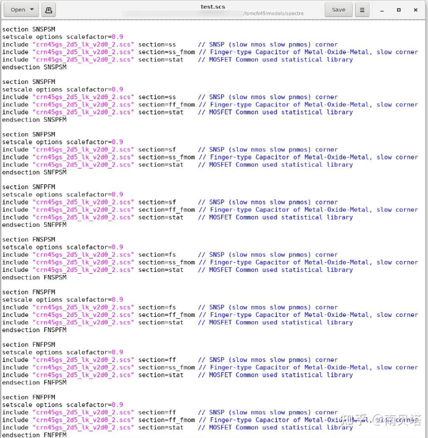

     >1. Slow NMOS、slow PMOS、slow 电容
     >2. Slow NMOS、slow PMOS、fast 电容
     >3. Slow NMOS、fast PMOS、slow 电容
     >4. Slow NMOS、fast PMOS、fast 电容
     >5. Fast NMOS、slow PMOS、slow 电容
     >6. Fast NMOS、slow PMOS、fast 电容
     >7. Fast NMOS、fast PMOS、slow 电容
     >8. Fast NMOS、fast PMOS、fast 电容

     

2. 导入`corner.scs`

   

   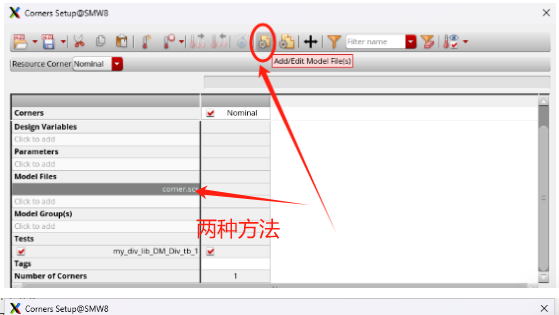

   ```
   section pre_layout
   include "/SM05/home/phd2024/phd202411094979/pdk/SMIC28_uncomp/PDK/SPDK28HKCPlusRF_0925_OA_CDS_V1.0_REV5_1/smic28hkcPlusrf_0925_1P10M_8Ic_1TMc_1MTTc_ALPA2_oa_cds_2021_12_15_v1.0_rev5_1/smic28hkmg/../models/spectre/l0028hkcplus_io25_v1p0_rev5_spe.lib" section=pre_layout
   endsection pre_layout
   
   section noise_tt
   include "/SM05/home/phd2024/phd202411094979/pdk/SMIC28_uncomp/PDK/SPDK28HKCPlusRF_0925_OA_CDS_V1.0_REV5_1/smic28hkcPlusrf_0925_1P10M_8Ic_1TMc_1MTTc_ALPA2_oa_cds_2021_12_15_v1.0_rev5_1/smic28hkmg/../models/spectre/l0028hkcplus_io25_v1p0_rev5_spe.lib" section=noise_tt
   endsection noise_tt
   
   section top_tt
   include "/SM05/home/phd2024/phd202411094979/pdk/SMIC28_uncomp/PDK/SPDK28HKCPlusRF_0925_OA_CDS_V1.0_REV5_1/smic28hkcPlusrf_0925_1P10M_8Ic_1TMc_1MTTc_ALPA2_oa_cds_2021_12_15_v1.0_rev5_1/smic28hkmg/../models/spectre/l0028hkcplus_io25_v1p0_rev5_spe.lib" section=tt
   include "/SM05/home/phd2024/phd202411094979/pdk/SMIC28_uncomp/PDK/SPDK28HKCPlusRF_0925_OA_CDS_V1.0_REV5_1/smic28hkcPlusrf_0925_1P10M_8Ic_1TMc_1MTTc_ALPA2_oa_cds_2021_12_15_v1.0_rev5_1/smic28hkmg/../models/spectre/l0028hkcplus_io25_v1p0_rev5_spe.lib" section=bjt_tt
   include "/SM05/home/phd2024/phd202411094979/pdk/SMIC28_uncomp/PDK/SPDK28HKCPlusRF_0925_OA_CDS_V1.0_REV5_1/smic28hkcPlusrf_0925_1P10M_8Ic_1TMc_1MTTc_ALPA2_oa_cds_2021_12_15_v1.0_rev5_1/smic28hkmg/../models/spectre/l0028hkcplus_io25_v1p0_rev5_spe.lib" section=dio_tt
   include "/SM05/home/phd2024/phd202411094979/pdk/SMIC28_uncomp/PDK/SPDK28HKCPlusRF_0925_OA_CDS_V1.0_REV5_1/smic28hkcPlusrf_0925_1P10M_8Ic_1TMc_1MTTc_ALPA2_oa_cds_2021_12_15_v1.0_rev5_1/smic28hkmg/../models/spectre/l0028hkcplus_io25_v1p0_rev5_spe.lib" section=res_tt
   include "/SM05/home/phd2024/phd202411094979/pdk/SMIC28_uncomp/PDK/SPDK28HKCPlusRF_0925_OA_CDS_V1.0_REV5_1/smic28hkcPlusrf_0925_1P10M_8Ic_1TMc_1MTTc_ALPA2_oa_cds_2021_12_15_v1.0_rev5_1/smic28hkmg/../models/spectre/l0028hkcplus_io25_v1p0_rev5_spe.lib" section=var_tt
   include "/SM05/home/phd2024/phd202411094979/pdk/SMIC28_uncomp/PDK/SPDK28HKCPlusRF_0925_OA_CDS_V1.0_REV5_1/smic28hkcPlusrf_0925_1P10M_8Ic_1TMc_1MTTc_ALPA2_oa_cds_2021_12_15_v1.0_rev5_1/smic28hkmg/../models/spectre/l0028hkcplus_io25_v1p0_rev5_spe.lib" section=mom_tt
   include "/SM05/home/phd2024/phd202411094979/pdk/SMIC28_uncomp/PDK/SPDK28HKCPlusRF_0925_OA_CDS_V1.0_REV5_1/smic28hkcPlusrf_0925_1P10M_8Ic_1TMc_1MTTc_ALPA2_oa_cds_2021_12_15_v1.0_rev5_1/smic28hkmg/../models/spectre/l0028hkcplus_io25_v1p0_rev5_spe.lib" section=ldmos_tt
   include "/SM05/home/phd2024/phd202411094979/pdk/SMIC28_uncomp/PDK/SPDK28HKCPlusRF_0925_OA_CDS_V1.0_REV5_1/smic28hkcPlusrf_0925_1P10M_8Ic_1TMc_1MTTc_ALPA2_oa_cds_2021_12_15_v1.0_rev5_1/smic28hkmg/../models/spectre/l0028hkcplus_io25_v1p0_rev5_spe.lib" section=esd_tt
   include "/SM05/home/phd2024/phd202411094979/pdk/SMIC28_uncomp/PDK/SPDK28HKCPlusRF_0925_OA_CDS_V1.0_REV5_1/smic28hkcPlusrf_0925_1P10M_8Ic_1TMc_1MTTc_ALPA2_oa_cds_2021_12_15_v1.0_rev5_1/smic28hkmg/../models/spectre/l0028hkcplus_io25_v1p0_rev5_spe.lib" section=esd_dio_tt
   include "/SM05/home/phd2024/phd202411094979/pdk/SMIC28_uncomp/PDK/SPDK28HKCPlusRF_0925_OA_CDS_V1.0_REV5_1/smic28hkcPlusrf_0925_1P10M_8Ic_1TMc_1MTTc_ALPA2_oa_cds_2021_12_15_v1.0_rev5_1/smic28hkmg/../models/spectre/l0028hkcplus_io25_v1p0_rev0_rf_spe.lib" section=tt
   include "/SM05/home/phd2024/phd202411094979/pdk/SMIC28_uncomp/PDK/SPDK28HKCPlusRF_0925_OA_CDS_V1.0_REV5_1/smic28hkcPlusrf_0925_1P10M_8Ic_1TMc_1MTTc_ALPA2_oa_cds_2021_12_15_v1.0_rev5_1/smic28hkmg/../models/spectre/l0028hkcplus_io25_v1p0_rev0_rf_spe.lib" section=res_tt
   include "/SM05/home/phd2024/phd202411094979/pdk/SMIC28_uncomp/PDK/SPDK28HKCPlusRF_0925_OA_CDS_V1.0_REV5_1/smic28hkcPlusrf_0925_1P10M_8Ic_1TMc_1MTTc_ALPA2_oa_cds_2021_12_15_v1.0_rev5_1/smic28hkmg/../models/spectre/l0028hkcplus_io25_v1p0_rev0_rf_spe.lib" section=var_tt
   include "/SM05/home/phd2024/phd202411094979/pdk/SMIC28_uncomp/PDK/SPDK28HKCPlusRF_0925_OA_CDS_V1.0_REV5_1/smic28hkcPlusrf_0925_1P10M_8Ic_1TMc_1MTTc_ALPA2_oa_cds_2021_12_15_v1.0_rev5_1/smic28hkmg/../models/spectre/l0028hkcplus_io25_v1p0_rev0_rf_spe.lib" section=mom_tt
   include "/SM05/home/phd2024/phd202411094979/pdk/SMIC28_uncomp/PDK/SPDK28HKCPlusRF_0925_OA_CDS_V1.0_REV5_1/smic28hkcPlusrf_0925_1P10M_8Ic_1TMc_1MTTc_ALPA2_oa_cds_2021_12_15_v1.0_rev5_1/smic28hkmg/../models/spectre/l0028hkcplus_io25_v1p0_rev0_rf_spe.lib" section=dio_tt
   endsection top_tt
   section top_ff
   include "/SM05/home/phd2024/phd202411094979/pdk/SMIC28_uncomp/PDK/SPDK28HKCPlusRF_0925_OA_CDS_V1.0_REV5_1/smic28hkcPlusrf_0925_1P10M_8Ic_1TMc_1MTTc_ALPA2_oa_cds_2021_12_15_v1.0_rev5_1/smic28hkmg/../models/spectre/l0028hkcplus_io25_v1p0_rev5_spe.lib" section=ff
   include "/SM05/home/phd2024/phd202411094979/pdk/SMIC28_uncomp/PDK/SPDK28HKCPlusRF_0925_OA_CDS_V1.0_REV5_1/smic28hkcPlusrf_0925_1P10M_8Ic_1TMc_1MTTc_ALPA2_oa_cds_2021_12_15_v1.0_rev5_1/smic28hkmg/../models/spectre/l0028hkcplus_io25_v1p0_rev5_spe.lib" section=bjt_ff
   include "/SM05/home/phd2024/phd202411094979/pdk/SMIC28_uncomp/PDK/SPDK28HKCPlusRF_0925_OA_CDS_V1.0_REV5_1/smic28hkcPlusrf_0925_1P10M_8Ic_1TMc_1MTTc_ALPA2_oa_cds_2021_12_15_v1.0_rev5_1/smic28hkmg/../models/spectre/l0028hkcplus_io25_v1p0_rev5_spe.lib" section=dio_ff
   include "/SM05/home/phd2024/phd202411094979/pdk/SMIC28_uncomp/PDK/SPDK28HKCPlusRF_0925_OA_CDS_V1.0_REV5_1/smic28hkcPlusrf_0925_1P10M_8Ic_1TMc_1MTTc_ALPA2_oa_cds_2021_12_15_v1.0_rev5_1/smic28hkmg/../models/spectre/l0028hkcplus_io25_v1p0_rev5_spe.lib" section=res_ff
   include "/SM05/home/phd2024/phd202411094979/pdk/SMIC28_uncomp/PDK/SPDK28HKCPlusRF_0925_OA_CDS_V1.0_REV5_1/smic28hkcPlusrf_0925_1P10M_8Ic_1TMc_1MTTc_ALPA2_oa_cds_2021_12_15_v1.0_rev5_1/smic28hkmg/../models/spectre/l0028hkcplus_io25_v1p0_rev5_spe.lib" section=var_ff
   include "/SM05/home/phd2024/phd202411094979/pdk/SMIC28_uncomp/PDK/SPDK28HKCPlusRF_0925_OA_CDS_V1.0_REV5_1/smic28hkcPlusrf_0925_1P10M_8Ic_1TMc_1MTTc_ALPA2_oa_cds_2021_12_15_v1.0_rev5_1/smic28hkmg/../models/spectre/l0028hkcplus_io25_v1p0_rev5_spe.lib" section=mom_ff
   include "/SM05/home/phd2024/phd202411094979/pdk/SMIC28_uncomp/PDK/SPDK28HKCPlusRF_0925_OA_CDS_V1.0_REV5_1/smic28hkcPlusrf_0925_1P10M_8Ic_1TMc_1MTTc_ALPA2_oa_cds_2021_12_15_v1.0_rev5_1/smic28hkmg/../models/spectre/l0028hkcplus_io25_v1p0_rev5_spe.lib" section=ldmos_ff
   include "/SM05/home/phd2024/phd202411094979/pdk/SMIC28_uncomp/PDK/SPDK28HKCPlusRF_0925_OA_CDS_V1.0_REV5_1/smic28hkcPlusrf_0925_1P10M_8Ic_1TMc_1MTTc_ALPA2_oa_cds_2021_12_15_v1.0_rev5_1/smic28hkmg/../models/spectre/l0028hkcplus_io25_v1p0_rev5_spe.lib" section=esd_ff
   include "/SM05/home/phd2024/phd202411094979/pdk/SMIC28_uncomp/PDK/SPDK28HKCPlusRF_0925_OA_CDS_V1.0_REV5_1/smic28hkcPlusrf_0925_1P10M_8Ic_1TMc_1MTTc_ALPA2_oa_cds_2021_12_15_v1.0_rev5_1/smic28hkmg/../models/spectre/l0028hkcplus_io25_v1p0_rev5_spe.lib" section=esd_dio_ff
   include "/SM05/home/phd2024/phd202411094979/pdk/SMIC28_uncomp/PDK/SPDK28HKCPlusRF_0925_OA_CDS_V1.0_REV5_1/smic28hkcPlusrf_0925_1P10M_8Ic_1TMc_1MTTc_ALPA2_oa_cds_2021_12_15_v1.0_rev5_1/smic28hkmg/../models/spectre/l0028hkcplus_io25_v1p0_rev0_rf_spe.lib" section=ff
   include "/SM05/home/phd2024/phd202411094979/pdk/SMIC28_uncomp/PDK/SPDK28HKCPlusRF_0925_OA_CDS_V1.0_REV5_1/smic28hkcPlusrf_0925_1P10M_8Ic_1TMc_1MTTc_ALPA2_oa_cds_2021_12_15_v1.0_rev5_1/smic28hkmg/../models/spectre/l0028hkcplus_io25_v1p0_rev0_rf_spe.lib" section=res_ff
   include "/SM05/home/phd2024/phd202411094979/pdk/SMIC28_uncomp/PDK/SPDK28HKCPlusRF_0925_OA_CDS_V1.0_REV5_1/smic28hkcPlusrf_0925_1P10M_8Ic_1TMc_1MTTc_ALPA2_oa_cds_2021_12_15_v1.0_rev5_1/smic28hkmg/../models/spectre/l0028hkcplus_io25_v1p0_rev0_rf_spe.lib" section=var_ff
   include "/SM05/home/phd2024/phd202411094979/pdk/SMIC28_uncomp/PDK/SPDK28HKCPlusRF_0925_OA_CDS_V1.0_REV5_1/smic28hkcPlusrf_0925_1P10M_8Ic_1TMc_1MTTc_ALPA2_oa_cds_2021_12_15_v1.0_rev5_1/smic28hkmg/../models/spectre/l0028hkcplus_io25_v1p0_rev0_rf_spe.lib" section=mom_ff
   include "/SM05/home/phd2024/phd202411094979/pdk/SMIC28_uncomp/PDK/SPDK28HKCPlusRF_0925_OA_CDS_V1.0_REV5_1/smic28hkcPlusrf_0925_1P10M_8Ic_1TMc_1MTTc_ALPA2_oa_cds_2021_12_15_v1.0_rev5_1/smic28hkmg/../models/spectre/l0028hkcplus_io25_v1p0_rev0_rf_spe.lib" section=dio_ff
   endsection top_ff
   section top_ss
   include "/SM05/home/phd2024/phd202411094979/pdk/SMIC28_uncomp/PDK/SPDK28HKCPlusRF_0925_OA_CDS_V1.0_REV5_1/smic28hkcPlusrf_0925_1P10M_8Ic_1TMc_1MTTc_ALPA2_oa_cds_2021_12_15_v1.0_rev5_1/smic28hkmg/../models/spectre/l0028hkcplus_io25_v1p0_rev5_spe.lib" section=ss
   include "/SM05/home/phd2024/phd202411094979/pdk/SMIC28_uncomp/PDK/SPDK28HKCPlusRF_0925_OA_CDS_V1.0_REV5_1/smic28hkcPlusrf_0925_1P10M_8Ic_1TMc_1MTTc_ALPA2_oa_cds_2021_12_15_v1.0_rev5_1/smic28hkmg/../models/spectre/l0028hkcplus_io25_v1p0_rev5_spe.lib" section=bjt_ss
   include "/SM05/home/phd2024/phd202411094979/pdk/SMIC28_uncomp/PDK/SPDK28HKCPlusRF_0925_OA_CDS_V1.0_REV5_1/smic28hkcPlusrf_0925_1P10M_8Ic_1TMc_1MTTc_ALPA2_oa_cds_2021_12_15_v1.0_rev5_1/smic28hkmg/../models/spectre/l0028hkcplus_io25_v1p0_rev5_spe.lib" section=dio_ss
   include "/SM05/home/phd2024/phd202411094979/pdk/SMIC28_uncomp/PDK/SPDK28HKCPlusRF_0925_OA_CDS_V1.0_REV5_1/smic28hkcPlusrf_0925_1P10M_8Ic_1TMc_1MTTc_ALPA2_oa_cds_2021_12_15_v1.0_rev5_1/smic28hkmg/../models/spectre/l0028hkcplus_io25_v1p0_rev5_spe.lib" section=res_ss
   include "/SM05/home/phd2024/phd202411094979/pdk/SMIC28_uncomp/PDK/SPDK28HKCPlusRF_0925_OA_CDS_V1.0_REV5_1/smic28hkcPlusrf_0925_1P10M_8Ic_1TMc_1MTTc_ALPA2_oa_cds_2021_12_15_v1.0_rev5_1/smic28hkmg/../models/spectre/l0028hkcplus_io25_v1p0_rev5_spe.lib" section=var_ss
   include "/SM05/home/phd2024/phd202411094979/pdk/SMIC28_uncomp/PDK/SPDK28HKCPlusRF_0925_OA_CDS_V1.0_REV5_1/smic28hkcPlusrf_0925_1P10M_8Ic_1TMc_1MTTc_ALPA2_oa_cds_2021_12_15_v1.0_rev5_1/smic28hkmg/../models/spectre/l0028hkcplus_io25_v1p0_rev5_spe.lib" section=mom_ss
   include "/SM05/home/phd2024/phd202411094979/pdk/SMIC28_uncomp/PDK/SPDK28HKCPlusRF_0925_OA_CDS_V1.0_REV5_1/smic28hkcPlusrf_0925_1P10M_8Ic_1TMc_1MTTc_ALPA2_oa_cds_2021_12_15_v1.0_rev5_1/smic28hkmg/../models/spectre/l0028hkcplus_io25_v1p0_rev5_spe.lib" section=ldmos_ss
   include "/SM05/home/phd2024/phd202411094979/pdk/SMIC28_uncomp/PDK/SPDK28HKCPlusRF_0925_OA_CDS_V1.0_REV5_1/smic28hkcPlusrf_0925_1P10M_8Ic_1TMc_1MTTc_ALPA2_oa_cds_2021_12_15_v1.0_rev5_1/smic28hkmg/../models/spectre/l0028hkcplus_io25_v1p0_rev5_spe.lib" section=esd_ss
   include "/SM05/home/phd2024/phd202411094979/pdk/SMIC28_uncomp/PDK/SPDK28HKCPlusRF_0925_OA_CDS_V1.0_REV5_1/smic28hkcPlusrf_0925_1P10M_8Ic_1TMc_1MTTc_ALPA2_oa_cds_2021_12_15_v1.0_rev5_1/smic28hkmg/../models/spectre/l0028hkcplus_io25_v1p0_rev5_spe.lib" section=esd_dio_ss
   include "/SM05/home/phd2024/phd202411094979/pdk/SMIC28_uncomp/PDK/SPDK28HKCPlusRF_0925_OA_CDS_V1.0_REV5_1/smic28hkcPlusrf_0925_1P10M_8Ic_1TMc_1MTTc_ALPA2_oa_cds_2021_12_15_v1.0_rev5_1/smic28hkmg/../models/spectre/l0028hkcplus_io25_v1p0_rev0_rf_spe.lib" section=ss
   include "/SM05/home/phd2024/phd202411094979/pdk/SMIC28_uncomp/PDK/SPDK28HKCPlusRF_0925_OA_CDS_V1.0_REV5_1/smic28hkcPlusrf_0925_1P10M_8Ic_1TMc_1MTTc_ALPA2_oa_cds_2021_12_15_v1.0_rev5_1/smic28hkmg/../models/spectre/l0028hkcplus_io25_v1p0_rev0_rf_spe.lib" section=res_ss
   include "/SM05/home/phd2024/phd202411094979/pdk/SMIC28_uncomp/PDK/SPDK28HKCPlusRF_0925_OA_CDS_V1.0_REV5_1/smic28hkcPlusrf_0925_1P10M_8Ic_1TMc_1MTTc_ALPA2_oa_cds_2021_12_15_v1.0_rev5_1/smic28hkmg/../models/spectre/l0028hkcplus_io25_v1p0_rev0_rf_spe.lib" section=var_ss
   include "/SM05/home/phd2024/phd202411094979/pdk/SMIC28_uncomp/PDK/SPDK28HKCPlusRF_0925_OA_CDS_V1.0_REV5_1/smic28hkcPlusrf_0925_1P10M_8Ic_1TMc_1MTTc_ALPA2_oa_cds_2021_12_15_v1.0_rev5_1/smic28hkmg/../models/spectre/l0028hkcplus_io25_v1p0_rev0_rf_spe.lib" section=mom_ss
   include "/SM05/home/phd2024/phd202411094979/pdk/SMIC28_uncomp/PDK/SPDK28HKCPlusRF_0925_OA_CDS_V1.0_REV5_1/smic28hkcPlusrf_0925_1P10M_8Ic_1TMc_1MTTc_ALPA2_oa_cds_2021_12_15_v1.0_rev5_1/smic28hkmg/../models/spectre/l0028hkcplus_io25_v1p0_rev0_rf_spe.lib" section=dio_ss
   endsection top_ss
   ```

   

3. 选择`corner`

   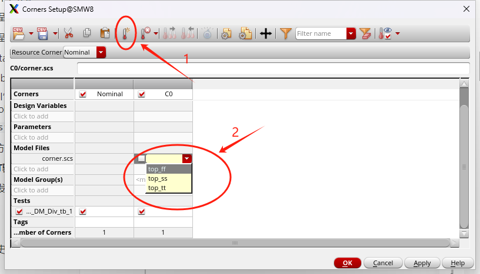

   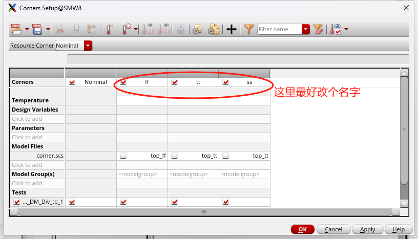

   设置温度和电压

   - 设置电源`AVDD`电压变量为0.9

   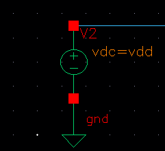

   `test`右键`Design Variables`下导入变量，设置默认值

   

   

   修改不同`corner`对应的温度和电压

   

   

4. 点击`OK`， 重新开启仿真

   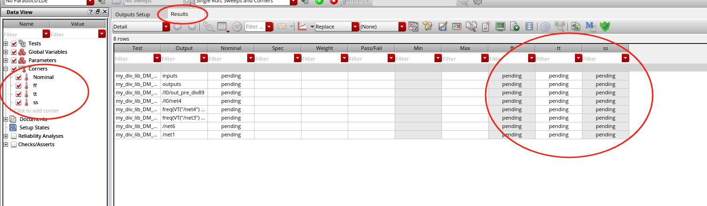

5. `plot`可以过滤具体的corner或信号

   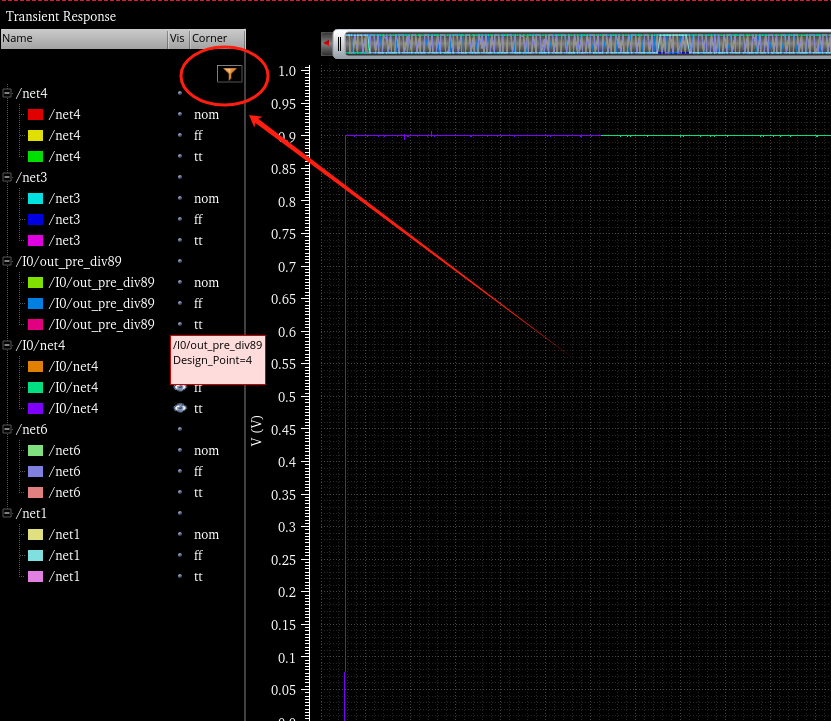

   

   

**参考**

- [cadence的工艺角仿真、蒙特卡洛仿真、PSRR-CSDN博客](https://blog.csdn.net/qq_42702596/article/details/124285118)

## 7.画版图

[Cadence Virtuoso Layout 快捷键_virtuoso镜像翻转快捷键-CSDN博客](https://blog.csdn.net/weixin_42221495/article/details/128989819)

发现SMIC28工艺不能90°旋转

前仿正确后，就可以绘制版图了

- 在原理图选择`Layout XL`

  

- 把器件拿过来

  

- 连线(快捷键p)

- 画矩形(r)

- 自动打孔(o)

  

- 加garding(shift+g)

- 如果某个pin找不到了，可以`ctrl+a`然后右键按`q`, 可以看到所有信息

  - 可以通过右键`keep`选中，然后删除dv'y;

- 常规设置(e)

  


#### 常用技巧

[ 模拟集成电路版图要点小结 - 知乎](https://zhuanlan.zhihu.com/p/523707257)

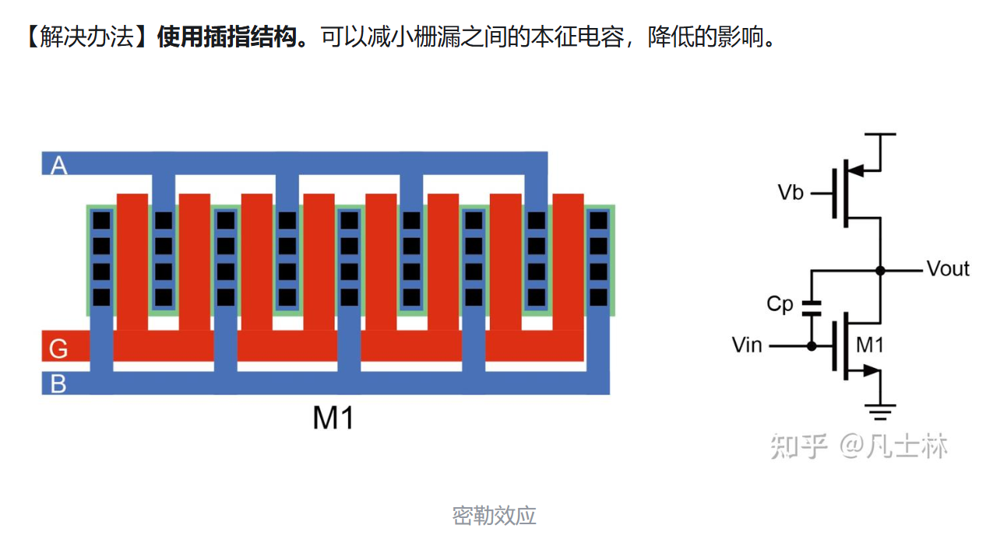


### 一个能够较快手动布线的技巧

相隔的层使用不同的走线方向（类似数字的方法），这样可以不用仔细看是否会短路。

缺点是过孔比较多


### 源漏共用

[12-源漏共用_哔哩哔哩_bilibili](https://www.bilibili.com/video/BV18FcmeGEK8?vd_source=ea5f077dc692dc32725d05ff92da61a5&spm_id_from=333.788.player.switch&p=12)

一个实例：左边为没有源漏共用的NAND版图，右边为源漏共用NAND版图，面积小了


> [!TIP]
>
> 应该也可以用数字库的版图，就是没有那么general了


### MOS匹配


### Tips

- 注意每一个module分开画，画完尽量加上boundry然后左下角放到坐标原点


## 8.DRC, LVS


> [!NOTE]
>
> 要通过脚本才能把这个calibre放到菜单栏的，calibre是西门子的，virtuoso是

和数字的没区别，都是选pdk里面的rule文件（后缀为`.drc`, `.lvs`）

> [!WARNING]
>
> 现在的比较先进的工艺都对方向有要求，不能一些mos水平一些mos垂直放置

## 9.寄生参数提取（PEX）

1. 找到`.pex`文件

2. 导入

   

3. 设置输出

   

   > [!NOTE]
   >
   > spectre方式提取的网表进行后仿真，是使==用带有寄生参数的网表替换原理图网表==，按照原理图仿真方式进行仿真。
   >
   > 也可以使用`Calibreview`·
   >
   > Spectre是仿真器仿真时读取的网表格式。
   >
   > Calibreview会将产生的网表封装在一个schematic文件中，同时其后续选项中也可以选择生成对应的spectre网表。
   >
   > [模拟IC仿真验证：基于Cadence Virtuoso的电路寄生参数提取与后仿真 - 哔哩哔哩](https://www.bilibili.com/opus/888360753381244962)

4. 其他设置

   

   

   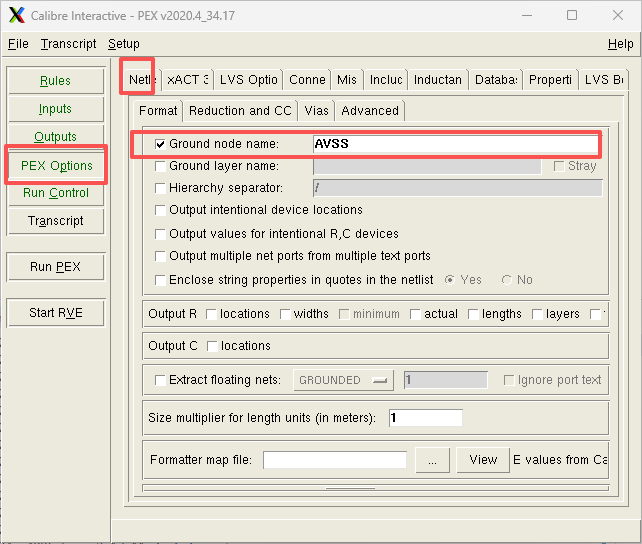

   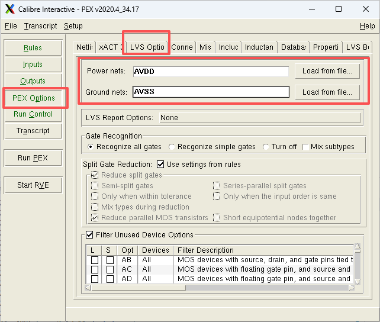

   

   config中修改模拟模块网表：

   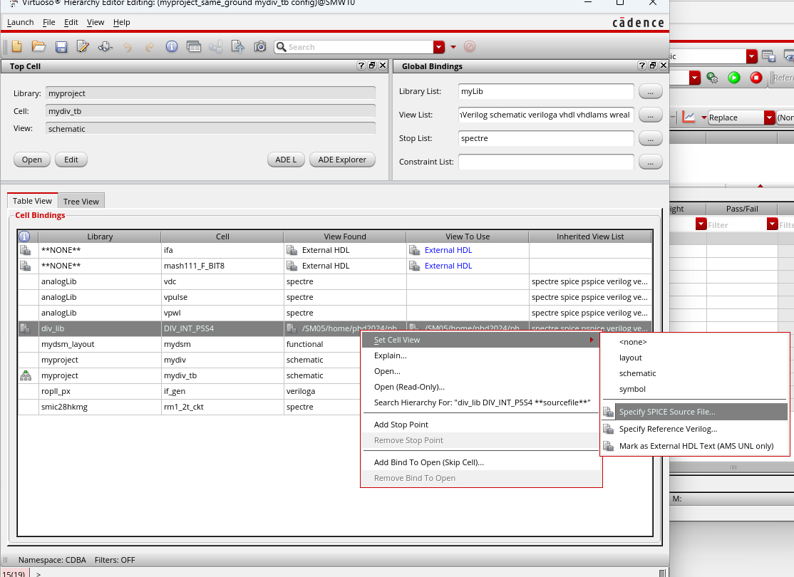

## 10.后仿

1. 导入寄生提取后的网表

   需要建立tb对应的config文件，然后修改模块的view

   这里以一个数模混合的config为例

   

   只需要替换模拟模块顶层（这里是`DIV_INT_P5S4`）就行了，发现还有很多模拟模块的子模块也在表上显示了, 不过替换以后点击保存子模块就没了

   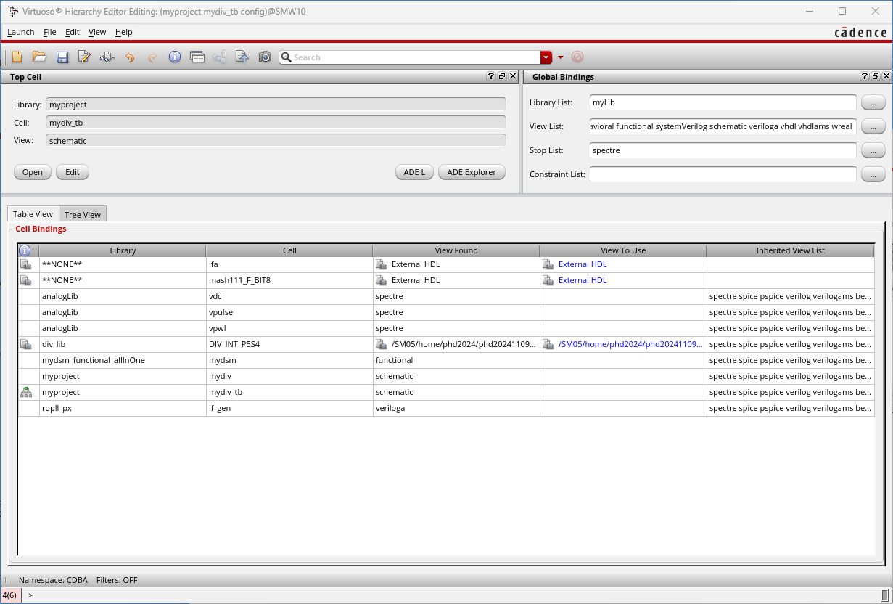

2. 然后和前仿一样，进行仿真


## 参考：

1. *CMOS模拟集成电路全流程设计，李金城，机械工业出版社，第7章*


# 数字设计流程

- 以一个DSM模块为例
- 参考始终 24MHz
- 工具链：
  - use `VCS` and `Verdi` to font-end digtal chip design
  - use `design compiler` to synthesize `rtl` design to `netlist`
  - use `innovus` to do placement and routing 
  - use `starrc` to do RC parameter extraction
  - use `formality` to do logic equivalence checking
  - use `calibre` to do DRC/LVS/ERC sign-off
  - use `prime time` to do STA


## 前端

### 0. 系统级仿真

大型项目要做，在类似`Matlab`的平台

### 1. 写HDL

- 现在貌似都是用的`verilog`
- 注意根据系统需求优化逻辑面积时序，我是不太懂

### 2. 写testbench, 用vcs编译仿真，用verdi看波形

- 可以用AI写，快。 可以直接用脚本来运行，简单的使用还是非常方便的
- 善用断言, 这样就不用人工去检查波形了，这也是AI的强项，不熟悉不太确定的还是最好人工看看波形
- 复杂项目要用`system verilog/system C` 或 `UVM`， 这只是一个简单示例，所以直接用`verilog`， 公司里面还要用VCS做检查==代码和功能覆盖率==

- 具体命令可以看[VCS](# VCS), [Verdi](# Verdi)

- 示例：

  - 文件结构：

    ```bash
    |-- outputs
    |   |-- mydsm_eachinf.fsdb
    |   |-- mydsm_eachinf.vcd
    |   |-- mydsm_eachinf_sim
    |   |-- mydsm_max.fsdb
    |   |-- mydsm_max.vcd
    |   |-- mydsm_max_sim
    |   |-- mydsm_random.fsdb
    |   |-- mydsm_random.vcd
    |   `-- mydsm_random_sim
    |-- runspace	#这里是VCS和Verdi的运行路径，每次编译仿真会在这里输出一些不常用的文件，让文件夹干净点就都放到这里了
    |-- scripts
    |   |-- calculate_average.py
    |   |-- clean.sh
    |   |-- file.f
    |   |-- sim.sh
    |   `-- sim4tb_hk_mash111.sh
    |-- src
    |   |-- dff.v
    |   |-- hk_efm.v
    |   |-- hk_mash111.v
    |   |-- ifa.v
    |   |-- mydsm.v
    |   `-- ncl.v
    `-- tb
        |-- mydsm_eachinf_tb.v
        |-- mydsm_max_tb.v
        |-- mydsm_min_tb.v
        |-- mydsm_random_tb.v
        `-- tb_hk_mash111.v
    ```

  - AI promt

    ```markdown
    # Digtal module
    - a DSM, its top design name is `mydsm`: mash 1-1-1 module + IFA(Integer and Frac Adapter)
        - `hk_mash111` module: input fraction part and output 2's complement code [-3, 4]
        - IFA module: a adapter to combine integer and frac part
    
    ## input and output
    - input
        - clk,
        - rst_n,           // Reset signal, low enable
        - in_i[7:0]: integer input
        - in_f[7:0]: fraction input
    - output
        - out_p[4:0]: connect with programable divder P
        - out_s[3:0]: connect with programable divder S
    
    ## rtl
    
    ### logic
    1. `in_f` input to `hk_mash111`, it output a `frac_value` in range of [-3, 4]
    2. `div_value = in_i + frac_value` 
    3. `div_value` will be Be decomposed to two part: `out_p[4:0]` and `out_s[3:0]`, formulation is `div_value = (out_p+2) * 8 + (out_s+2)`. attention: `3 <= out_s <=10 `
    4. output `out_p` and `out_s`
    
    
    ### testbench
    generate `.fsdb` files in testbench for waveform check
    1. testbench1: mydsm_min_tb.
        - `in_i` = 0d83, `in_f` = 0, calculate the average `div_value` with 1000 times clock.
    2. testbench2: mydsm_max_tb.
        - `in_i` = 0d255, `in_f` = 255, calculate the average `div_value` with 1000 times clock.
    3. testbench3: mydsm_random_tb.
        - set `in_i` and `in_f` randomly get seed, randomly selet `in_i` in range [83, 255], `in_f` in range [0, 255] for 5 times, calculate the average `div_value` with 1000 times clock for each case.
    4. testbench4: mydsm_eachinf_tb.
        - set `in_i == 255`, set `in_f` from 0 to 255, simulate 1000 times each case, calculate average `div_value` for these 256 cases, display result with a table 
    
    #### warning: 
    - Each testbench must print out the input integer frequency division ratio and the fractional frequency division ratio!
    - Detect through assertion whether the average frequency division ratio of the final output is within 0.5% error of the input frequency division ratio
    
    ### sim file
    - file path: `${WorkSpace}/digtal/front/scripts/sim.sh`
    - Some useful methods are defined in `sim.sh`
        - compile(cp):
            - compile one specify testbench
                - such as `./sim.sh cp mydsm_min` to compile `${WorkSpace}/digtal/front/tb/mydsm_min_tb.v`
            - compile all specify testbench
                - cmd: `./sim.sh cp all`
                - return which testbench compile successfully
        - run:
            - run one specify testbench
                - such as `./sim.sh run mydsm_min` to run `${WorkSpace}/digtal/front/tb/mydsm_min_tb.v`
        - plot:
            - plot one specify testbench
                - such as `./sim.sh plot mydsm_min` to plot `${WorkSpace}/digtal/front/tb/mydsm_min_tb.v`
        - clean:
            - clean all files in runspace and outputs folders.
    
    ```


### 3. FPGA上板验证

- 最好做这一步，这次小项目没做

## 综合

- 使用`DC`, 主要脚本：
  - constraint.sdc：约束文件
  - flow.tcl: dc 脚本
  
  > 不同设计差别很大，这里就不总结了，我也不熟, [详情](# DC)
  
- 在pdk中选择合适的标准单元库
  - 可以查看[SMIC](# SMIC)
  
- 示例代码
  
  ```tcl
  #flow.tcl
  # Set workspace path
  set WORKSPACE "/SM05/home/phd2024/phd202411094979/project/cpicp25"
  set SYN_PATH "$WORKSPACE/digtal/syn"
  set SRC_PATH "$WORKSPACE/digtal/front/src"
  set PDK_PATH "$WORKSPACE/pdk"
  set STD_CELL_PATH "$PDK_PATH/STDCELL/SCC28NHKCP_HDC30P140_RVT_V0p2"
  # set STD_CELL_PATH "$PDK_PATH/STDCELL/SCC28NHKCP_12T25OD33_RVT_V0p2"
  
  # Set top design name
  set DESIGN_NAME "mydsm"
  
  # Create output directories if they don't exist
  file mkdir $SYN_PATH/reports
  file mkdir $SYN_PATH/outputs
  
  puts "=============================================="
  puts "         Starting Synthesis Flow              "
  puts "=============================================="
  puts "Workspace: $WORKSPACE"
  puts "Design   : $DESIGN_NAME"
  puts "=============================================="
  
  #=========================================================
  # Setup Libraries
  #=========================================================
  puts "Setting up libraries..."
  
  set LIB_SS_ECSM "$STD_CELL_PATH/liberty/0.9v/scc28nhkcp_hdc30p140_rvt_ss_v0p81_125c_ecsm.db"
  set LIB_TT_ECSM "$STD_CELL_PATH/liberty/0.9v/scc28nhkcp_hdc30p140_rvt_tt_v0p9_25c_ecsm.db"
  set LIB_FF_ECSM "$STD_CELL_PATH/liberty/0.9v/scc28nhkcp_hdc30p140_rvt_ff_v0p99_-40c_ecsm.db"
  
  
  # Set target library - use worst case for synthesis
  set target_library $LIB_SS_ECSM
  set link_library "* $LIB_SS_ECSM $LIB_TT_ECSM $LIB_FF_ECSM"
  
  # Set synthetic library
  set synthetic_library {}
  set synlib_list ""
  set symbol_library {}
  
  # Set search path
  set search_path [list . $SRC_PATH $STD_CELL_PATH/verilog]
  
  #=========================================================
  # Setup for Formality verification  
  #=========================================================
  puts "Setting up SVF for Formality verification..."
  
  # SVF should always be written to allow Formality verification for advanced optimizations.
  # Once set_svf is issued, DC will begin recording all relevant operations.
  set_svf $SYN_PATH/outputs/${DESIGN_NAME}_syn.svf
  
  #=========================================================
  # Read Design
  #=========================================================
  puts "Reading RTL design..."
  
  # Define source files - can be expanded based on actual design files
  set RTL_FILES [list $SRC_PATH/mydsm.v $SRC_PATH/ifa.v $SRC_PATH/mash111.v]
  
  # Read RTL files
  analyze -format verilog $RTL_FILES
  elaborate $DESIGN_NAME
  
  # Link design
  current_design $DESIGN_NAME
  link > $SYN_PATH/reports/link.rpt
  
  # Check design
  check_design > $SYN_PATH/reports/check_design.rpt
  
  #=========================================================
  # Apply Constraints
  #=========================================================
  puts "Applying constraints..."
  
  # Source constraint file
  source $SYN_PATH/scripts/constraint_${DESIGN_NAME}.sdc
  
  #=========================================================
  # Set Optimization Options
  #=========================================================
  puts "Setting optimization options..."
  
  set_wire_load_mode "top"
  set_fix_multiple_port_nets -all -buffer_constants
  # set_fix_hold
  # set_fix_hold [get_clocks clk]
  
  # Compile with ultra optimization
  # compile_ultra -timing_high_effort -no_autoungroup -incremental
  # compile_ultra -only_hold_time
  
  # three steps optimization
  compile_ultra -timing_high_effort -no_autoungroup
  compile_ultra -timing_high_effort -incremental
  compile_ultra -only_hold_time -incremental
  
  #=========================================================
  # Generate Reports
  #=========================================================
  # Timing reports for different corners
  report_timing -path full -delay max -max_paths 40 -nworst 3 > $SYN_PATH/reports/timing_ss_max.rpt
  report_timing -path full -delay min -max_paths 40 -nworst 3 > $SYN_PATH/reports/timing_ss_min.rpt
  report_timing -path full -delay max -max_paths 40 -nworst 3 > $SYN_PATH/reports/timing_tt_max.rpt
  report_timing -path full -delay min -max_paths 40 -nworst 3 > $SYN_PATH/reports/timing_tt_min.rpt
  report_timing -path full -delay max -max_paths 40 -nworst 3 > $SYN_PATH/reports/timing_ff_max.rpt
  report_timing -path full -delay min -max_paths 40 -nworst 3 > $SYN_PATH/reports/timing_ff_min.rpt
  
  # Other reports
  report_reference -hierarchy > $SYN_PATH/reports/reference_hierarchy.rpt
  report_resources -hierarchy > $SYN_PATH/reports/resources_hierarchy.rpt
  report_design > $SYN_PATH/reports/design.rpt
  report_compile_options > $SYN_PATH/reports/compile_options.rpt
  report_area > $SYN_PATH/reports/area.rpt
  report_power > $SYN_PATH/reports/power.rpt
  report_qor > $SYN_PATH/reports/qor.rpt
  report_resources > $SYN_PATH/reports/resources.rpt
  report_constraint -all_violators > $SYN_PATH/reports/constraints.rpt
  report_hierarchy > $SYN_PATH/reports/hierarchy.rpt
  report_reference > $SYN_PATH/reports/reference.rpt
  report_clock_gating > $SYN_PATH/reports/clock_gating.rpt
  
  #=========================================================
  # Write and close SVF file and make it available for immediate use
  #=========================================================
  set_svf -off
  
  #=========================================================
  # Generate Output Files
  #=========================================================
  puts "Generating output files..."
  
  # Write netlist
  write -format verilog -hierarchy -output $SYN_PATH/outputs/${DESIGN_NAME}_syn.v
  
  # Write constraints for P&R
  write_sdc $SYN_PATH/outputs/${DESIGN_NAME}_syn.sdc
  
  # Write parasitics
  write_parasitics -output $SYN_PATH/outputs/${DESIGN_NAME}_syn.spef
  
  # Write SDF for gate-level simulation
  write_sdf $SYN_PATH/outputs/${DESIGN_NAME}_syn.sdf
  
  # Write DDC for Design Vision
  write -format ddc -hierarchy -output $SYN_PATH/outputs/${DESIGN_NAME}_syn.ddc
  
  # Save UPF file
  save_upf $SYN_PATH/outputs/${DESIGN_NAME}_syn.upf
  
  
  
  puts "=============================================="
  puts "         Synthesis Flow Completed             "
  puts "=============================================="
  exit
  
  ```
  
  ```tcl
  # constraint.sdc
  ###############################################################
  # Author: pxmmmm
  # Date: 2025-09-02
  # Description: Constraint file for mydsm design
  # Version: 1.0
  ###############################################################
  
  # Clock definition
  # 设置时钟名称
  set CLOCK_NAME "clk"
  # v
  set CLOCK_PERIOD [expr 1.0/200.0*1000]
  # 10% of period
  set CLOCK_UNCERTAINTY [expr $CLOCK_PERIOD * 0.1]
  # 3% of period
  set CLOCK_TRANSITION [expr $CLOCK_PERIOD * 0.03]
  
  # Create clock
  create_clock -name $CLOCK_NAME -period $CLOCK_PERIOD [get_ports clk]
  set_clock_uncertainty $CLOCK_UNCERTAINTY [get_clocks $CLOCK_NAME]
  # Add separate setup/hold uncertainty
  set_clock_uncertainty -setup [expr $CLOCK_UNCERTAINTY * 0.7] [get_clocks $CLOCK_NAME]
  set_clock_uncertainty -hold [expr $CLOCK_UNCERTAINTY * 0.2] [get_clocks $CLOCK_NAME]
  set_clock_transition $CLOCK_TRANSITION [get_clocks $CLOCK_NAME]
  
  # Set don't touch network for clock and reset
  # set_dont_touch_network [get_ports clk]
  # set_dont_touch_network [get_ports rst_n]
  
  # Input and output delay constraints
  set INPUT_DELAY_MAX [expr $CLOCK_PERIOD * 0.5]
  set INPUT_DELAY_MIN [expr $CLOCK_PERIOD * 0.15]
  set OUTPUT_DELAY_MAX [expr $CLOCK_PERIOD * 0.5]
  set OUTPUT_DELAY_MIN [expr $CLOCK_PERIOD * 0.15]
  
  # Set input delays
  set_input_delay -clock $CLOCK_NAME -max $INPUT_DELAY_MAX [get_ports {in_i[*] in_f[*] rst_n}]
  set_input_delay -clock $CLOCK_NAME -min $INPUT_DELAY_MIN [get_ports {in_i[*] in_f[*] rst_n}]
  
  # Set output delays
  set_output_delay -clock $CLOCK_NAME -max $OUTPUT_DELAY_MAX [get_ports {out_p[*] out_s[*]}]
  set_output_delay -clock $CLOCK_NAME -min $OUTPUT_DELAY_MIN [get_ports {out_p[*] out_s[*]}]
  
  # Set ideal network for clock and reset
  # set_ideal_network [get_ports clk]
  # set_ideal_network [get_ports rst_n]
  
  # Set max fanout
  set_max_fanout 10 [current_design]
  
  # Set driving cell for all inputs except clock and reset
  # Use a buffer found in the actual library
  set_driving_cell -lib_cell BUFV2_140P7T30R [remove_from_collection [all_inputs] [get_ports {clk rst_n}]]
  
  # Set load for all outputs
  # # 基于 BUFV2_140P7T30R 的输入电容使用来自PDK的一个实际引脚电容值 0.00077238pF 
  set_load -pin_load 0.001 [all_outputs] 
  # Set max area constraint
  # set_max_area 0
  
  # # Set operating conditions
  # set_operating_conditions -min_library "scc28nhkcp_hdc30p140_rvt_ff_v0p99_-40c_ecsm" -min "ff_v0p99_-40c" \
  #                          -max_library "scc28nhkcp_hdc30p140_rvt_ss_v0p81_125c_ecsm" -max "ss_v0p81_125c"
  
  # Set wire load model - use default since ZeroWireload wasn't found
  # set_wire_load_mode "top"
  
  ```
  
- 关于IO。在`innovus`中可以加入IO，但是需要在综合的时候加入对应的IO库和网表
  
  示例
  
  
  
  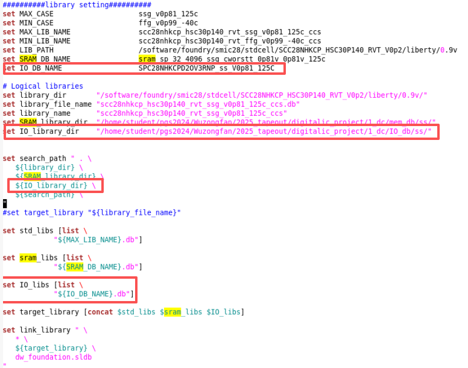
  
- Tips:

  - 综合阶段或者Place阶段遇到setup timing不满足时，我们可以通过插入pipeline的方式修改RTL来解决setup violation，但是hold timing vioation往往CTS后才能发现且只能通过后端修复。所以如果有hold time, 在综合阶段是很难修的。
  
- 一般做完综合之后要做一次网表等价性验证，[实例代码](# Formality)

- > hjf师兄在紫光就是做这个

## 后端

书籍推荐：CMOS集成电路后端设计与实战 (刘峰, 2015)

[用脚本进行Innovus设计 - 白发戴花君莫笑 - 博客园](https://www.cnblogs.com/li2000/p/18269818/IC-digital-Innovus-tcl)

1. 生成模板

   `writeFlowTemplate -directory <输出目录路径>`

   > 可以基于这个来做
   >
   > 但是他给的也不能直接跑，缺了文件，不知道为什么
   >
   > 我感觉这个`template`还是太臃肿了，还是自己写吧0.0

   >注意学校服务器目前(2025/06) 默认用的innovus 15, 其实可以改成innovus 19: `alias innovus="/SM01/eda/cadence/INNOVUS191/bin/innovus"`

2. 准备整体输入文件：

   - 综合网表

   - 约束sdc文件

   - tech lef, STD lef, ANT lef, .lib(时序功耗)

   - qrcTechfile&capTable
     - 可以通过`.ict`文件生成，[详情](# ITF, ICT)
     - 之前做SMIC 28的时候有一些不同金属层设置的pdk安装后没对应的`.ict`文件.要和foundary的代理要
     
   - innovus 脚本
     - flow.tcl （自己写，可以模仿`template`写，但是感觉`template`太琐碎了，适合公司，不适合个人）
     
     - mmmc.tcl（这个要自己写，各种corner）
     
     - 贴两个相关的示例脚本
     
       ```tcl
       ###############################################################
       # Author: Pxmmmm
       # Description: Innovus flow for mydsm
       # Version: 1.5
       # Date: 2025-06-05
       # Usage: innovus -init flow.tcl
       ###############################################################
       
       # freeDesign
       
       # Set basic environment variables
       set WORKSPACE "/SM05/home/phd2024/phd202411094979/project/cpicp25"
       set DESIGN "mydsm"
       # set DESIGN "lock_det"
       set PDK_DIR "$WORKSPACE/pdk"
       set NETLIST "$WORKSPACE/digtal/syn/outputs/${DESIGN}_syn.v"
       set OUTPUTS "$WORKSPACE/digtal/back/outputs"
       set REPORTS "$WORKSPACE/digtal/back/reports"
       set DBS_DIR "$WORKSPACE/digtal/back/DBS"
       
       # # Create output directories
       # file mkdir $OUTPUTS
       # file mkdir $REPORTS
       # file mkdir $DBS_DIR
       
       # Set multi-CPU usage
       setMultiCpuUsage -localCpu 8 -verbose
       
       # Set design parameters
       set init_verilog $NETLIST
       set init_top_cell $DESIGN
       
       # Set LEF files
       set TECH_LEF_PATH "$PDK_DIR/SCC28NHKCP_TF_V0p2/innovus/hd/tf_mtt"
       set TECH_LEF_FILE "$TECH_LEF_PATH/scc28n_1p9m_7ic_1tmc_1mttc_alpa2.lef"
       set STDCELL_LEF_PATH "$PDK_DIR/STDCELL/SCC28NHKCP_HDC30P140_RVT_V0p2/lef/macro"
       set STDCELL_LEF_FILE "$STDCELL_LEF_PATH/scc28nhkcp_hdc30p140_rvt.lef"
       set ANTENNA_LEF_FILE "$STDCELL_LEF_PATH/scc28nhkcp_hdc30p140_rvt_ant.lef"
       # set init_lef_file "$TECH_LEF_FILE $ANTENNA_LEF_FILE"
       set init_lef_file "$TECH_LEF_FILE $STDCELL_LEF_FILE $ANTENNA_LEF_FILE"
       
       # Initialize design setup
       set init_mmmc_file "$WORKSPACE/digtal/back/scripts/mmmc.tcl"
       set init_pwr_net "VDD"
       set init_gnd_net "VSS"
       set init_design_settop 1
       
       puts "\n=============================================="
       puts "Starting Innovus flow for design: $DESIGN"
       puts "=============================================="
       
       # Initialize design
       setDesignMode -process 28
       
       # pre_init
       setImportMode -bufferTieAssign true
       
       init_design
       
       # checkDesign -all -noHtml -outfile $REPORTS/check_design.rpt
       # check_timing
       # check_timing > $REPORTS/check_timing.rpt
       # report_metric -file $REPORTS/metrics.html -format html
       saveNetlist $OUTPUTS/${DESIGN}_init.v
       
       ###########################################
       # 1. Global Settings and Analysis Modes
       ###########################################
       
       # Set global optimization parameters
       setOptMode -effort high
       setOptMode -fixCap true
       setOptMode -fixTran true
       setOptMode -fixFanoutLoad true
       setOptMode -holdFixingCells {CLKBUFV10_140P7T30R CLKBUFV12_140P7T30R CLKBUFV16_140P7T30R CLKBUFV20_140P7T30R CLKBUFV24_140P7T30R CLKBUFV2_140P7T30R CLKBUFV32_140P7T30R CLKBUFV3_140P7T30R CLKBUFV40_140P7T30R CLKBUFV48_140P7T30R CLKBUFV4_140P7T30R CLKBUFV5_140P7T30R CLKBUFV6_140P7T30R CLKBUFV7_140P7T30R CLKBUFV8_140P7T30R
       }
       # BUFV10_140P7T30R BUFV12_140P7T30R BUFV16_140P7T30R BUFV1P5_140P7T30R BUFV1_140P7T30R BUFV20_140P7T30R BUFV24_140P7T30R BUFV2_140P7T30R BUFV32_140P7T30R BUFV3_140P7T30R BUFV40_140P7T30R BUFV48_140P7T30R BUFV4_140P7T30R BUFV5_140P7T30R BUFV6_140P7T30R BUFV7_140P7T30R BUFV8_140P7T30R 
       # setOptMode -holdFixingCells {DEL1V1P5_140P7T30RDEL1V1_140P7T30RDEL1V2_140P7T30RDEL1V4_140P7T30RDEL2V1P5_140P7T30RDEL2V1_140P7T30RDEL2V2_140P7T30RDEL2V4_140P7T30RDEL4V1P5_140P7T30RDEL4V1_140P7T30RDEL4V2_140P7T30RDEL4V4_140P7T30R
       # }
       setOptMode -allEndPoints true
       # setOptMode -holdTargetSlack 0.04
       # setOptMode -fixHoldAllowSetupTnsDegrade true
       # setOptMode -fixHoldAllowOverlap true
       setOptMode -checkRoutingCongestion true
       
       # via gen mode 
       # setViaGenMode -parameterized_via_only true
       # setViaGenMode -optimize_via_on_routing_track true
       
       # Set RC extraction mode
       setExtractRCMode -engine postRoute -effortLevel high -coupled true
       
       # Other
       setPinAssignMode -pinEditInBatch true
       # dbget top.insts.cell.name "*INV*"
       
       ###########################################
       # 2. Floorplanning and Power Planning
       ###########################################
       # Floorplan
       # floorPlan -site hd_p140_CoreSite -r 1 0.6 3 4.3 3 4.3
       # floorPlan -site hd_p140_CoreSite -r 0.5 0.65 11 5 11 5
       floorPlan -site hd_p140_CoreSite -r 1 0.55 7 7 7 7
       
       # Edit pins for mixed-signal interface
       editPin -pin {clk} -layer M3 -spacing 0.6 -spreadType CENTER -side TOP -fixedPin 1
       editPin -pin {rst_n} -layer M3 -spacing 0.6 -spreadType CENTER -side BOTTOM -fixedPin 1
       editPin -pin {in_i[*] in_f[*]} -layer M4 -spacing 1 -spreadType CENTER -side LEFT -fixedPin 1
       editPin -pin {out_p[*] out_s[*]} -layer M4 -spacing 1.5 -spreadType CENTER -side RIGHT -fixedPin 1
       
       globalNetConnect VDD -type pgpin -pin VDD -inst *
       globalNetConnect VSS -type pgpin -pin VSS -inst *
       globalNetConnect VDD -type pgpin -pin VNW -inst *
       globalNetConnect VSS -type pgpin -pin VPW -inst *
       
       
       # Power Planning
       deleteAllPowerPreroutes
       addRing -nets {VDD VSS} -type core_rings -follow io \
               -layer {top TM1 bottom TM1 left M7 right M7} \
               -width {top 2 bottom 2 left 2 right 2} \
               -spacing {top 1 bottom 1 left 1 right 1} \
               -center 1
       
       # addRing -nets {VDD VSS} -type core_rings -follow io \
       #         -layer {top TM1 bottom TM1 left MTT2 right MTT2} \
       #         -width {top 1 bottom 1 left 2 right 2} \
       #         -spacing {top 0.9 bottom 0.9 left 3.1 right 3.1} \
       #         -center 1
       
       # addRing -nets {VDD VSS} -type core_rings -follow io \
       #         -layer {top TM1 bottom TM1 left MTT2 right MTT2} \
       #         -width {top 1 bottom 1 left 2 right 2} \
       #         -spacing {top 0.9 bottom 0.9 left 3.1 right 3.1} \
       #         -center 1
       
       # addStripe -nets {VDD VSS} -layer M7 -direction vertical -width 0.45 -spacing 1 -set_to_set_distance 11 -start_offset 7.5
       # addStripe -nets {VDD VSS} -layer MTT2 -direction vertical -width 2 -spacing 3.1 -set_to_set_distance 13 -start_offset 1
       # addStripe -nets {VDD VSS} -layer M7 -direction vertical -width 2 -spacing 6 -set_to_set_distance 20 -start_offset 4
       
       
       # addStripe -nets {VDD VSS} -layer TM1 -direction horizontal -width 0.45 -spacing 1 -set_to_set_distance 11 -start_offset 7
       # addStripe -nets {VDD VSS} -layer TM1 -direction horizontal -width 0.45 -spacing 1 -set_to_set_distance 5 -start_offset 2
       # addStripe -nets {VDD VSS} -layer TM1 -direction horizontal -width 2 -spacing 6 -set_to_set_distance 20 -start_offset 4
       
       # Add power rail
       
       
       # sroute -nets {VDD VSS} -connect {corePin} \
       #        -layerChangeRange {M2 M2} \
       #        -blockPinTarget nearestTarget \
       #        -allowJogging true \
       #        -allowLayerChange true \
       #        -crossoverViaLayerRange {M2 M2} \
       #        -targetViaLayerRange {M2 M2}
       
       # fixVia -minCut 
       # fixVia -short 
       # fixVia -minStep
       
       ## srout
       setNanoRouteMode -routeBottomRoutingLayer 2
       sroute -nets {VDD VSS} -connect { corePin } -blockPinTarget { nearestTarget } -checkAlignedSecondaryPin 1 -corePinLayer { M1 } -allowJogging 1 -crossoverViaBottomLayer M1 -allowLayerChange 1 -targetViaTopLayer TM1 -crossoverViaTopLayer TM1 -targetViaBottomLayer M1
       verifyPowerVia
       verifyConnectivity -nets {VDD VSS}
       
       sroute -nets {VDD VSS} -connect {blockPin padPin padRing floatingStripe} -allowJogging 1 -allowLayerChange 1 -stripeLayerRange {M1 TM1} -targetViaLayerRange {M1 TM1}
       
       
       
       checkDesign -all -noHtml -outfile $REPORTS/check_design.rpt
       ###########################################
       # 3. Placement and Placement Optimization
       ###########################################
       # # reportDontUseCells
       
       # Set placement mode
       setPlaceMode -fp false -timingDriven true -place_global_timing_effort high -ignoreScan true
       ## 0.28 means 2xminimum pitch,or when your design pitch=135,you must change 0.28 to 0.27
       setPlaceMode -fillerGapMinGap 0.28 -fillerGapEffort high  
       setPlaceMode -checkImplantWidth true 
       setPlaceMode -honorImplantSpacing true
       
       setEndCapMode -prefix ENDCAP
       setEndCapMode -leftEdge "ENDCAP_ROW_140P7T30R" -rightEdge "ENDCAP_ROW_140P7T30R" 
       addEndCap -prefix ENDCAP
       # deleteFiller -cell FILLTIE_140P7T30R
       # addWellTap -cell FILLTIE_140P7T30R -cellInterval 40 -prefix WELLTAP
       addWellTap -cell FILLTIE_140P7T30R -cellInterval 20 -prefix WELLTAP
       
       
       # Run placement
       placeDesign -prePlaceOpt
       # placeDesign -prePlaceOpt -incremental
       # saveDesign $DBS_DIR/place.enc
       
       # Placement optimization
       # optDesign -preCTS
       optDesign -preCTS -setup
       # optDesign -preCTS -incremental
       saveDesign $DBS_DIR/preCTS.enc
       checkDesign -all -noHtml -outfile $REPORTS/check_design_preCTS.rpt
       ###########################################
       # 4. Clock Tree Synthesis and Optimization
       ###########################################
       setAnalysisMode -analysisType onChipVariation
       setAnalysisMode -cppr both
       # set_ccopt_mode  -integration "native" -ccopt_modify_clock_latency true
       # create_route_type -name leaf_rule -top_preferred_layer M4 \
       # -bottom_preferred_layer M2
       # create_route_type -name trunk_rule -top_preferred_layer M4 \
       # -bottom_preferred_layer M2
       # # -shield_net VSS
       # create_route_type -name top_rule -top_preferred_layer M4 \
       # -bottom_preferred_layer M2
       # set_ccopt_property -net_type leaf route_type leaf_rule
       # set_ccopt_property -net_type trunk route_type trunk_rule
       # set_ccopt_property -net_type top route_type top_rule
       set_ccopt_property buffer_cells {CLKBUFV10_140P7T30R CLKBUFV12_140P7T30R CLKBUFV16_140P7T30R CLKBUFV20_140P7T30R CLKBUFV24_140P7T30R CLKBUFV2_140P7T30R CLKBUFV32_140P7T30R CLKBUFV3_140P7T30R CLKBUFV40_140P7T30R CLKBUFV48_140P7T30R CLKBUFV4_140P7T30R CLKBUFV5_140P7T30R CLKBUFV6_140P7T30R CLKBUFV7_140P7T30R CLKBUFV8_140P7T30R
       }
       set_ccopt_property inverter_cells {INV10_140P7T30R INV12_140P7T30R INV16_140P7T30R INV1P5_140P7T30R INV1P5M_140P7T30R INV1_140P7T30R INV1M_140P7T30R INV20_140P7T30R INV24_140P7T30R INV2_140P7T30R INV2M_140P7T30R INV32_140P7T30R INV3_140P7T30R INV40_140P7T30R INV48_140P7T30R INV4_140P7T30R INV5_140P7T30R INV6_140P7T30R INV7_140P7T30R INV8_140P7T30R}
       set_ccopt_property use_inverters true
       create_ccopt_clock_tree_spec -file ccopt.spec
       # source ccopt.spec
       
       
       # Run clock tree synthesis
       ccopt_design -CTS -outDir $REPORTS/CTS_opt
       # selectNet -clock
       report_ccopt_clock_trees -file $REPORTS/clock_trees.rpt
       report_ccopt_skew_groups -file $REPORTS/skew_groups.rpt
       saveNetlist $OUTPUTS/${DESIGN}_cts.v
       saveDesign $DBS_DIR/cts.enc
       
       #check timing
       # Post-CTS optimization
       # setOptMode -fixHoldAllowResizing true
       # setOptMode -fixHoldAllowSetupTnsDegrade true
       
       # optDesign -postCTS -hold -setup
       # optDesign -postCTS -hold -expandedViews
       # optDesign -postCTS -hold -expandedViews -incremental
       # optDesign -postCTS -expandedViews
       optDesign -postCTS -setup -expandedViews
       optDesign -postCTS -setup -expandedViews -incremental
       
       saveNetlist $OUTPUTS/${DESIGN}_postcts.v
       checkDesign -all -noHtml -outfile $REPORTS/check_design_postcts.rpt
       
       verify_drc
       verifyConnectivity
       ###########################################
       # 5. Routing and Post-Route Optimization
       ###########################################
       
       setDelayCalMode -siAware true -engine aae
       setAnalysisMode -cppr both
       setNanoRouteMode -routeWithLithoDriven true \
                       -routeWithTimingDriven true \
                       -routeWithSiDriven true \
                       -routeTopRoutingLayer 6
       
       # setNanoRouteMode -dbViaWeight { *R_40x40x40x40_dfm* 21 , *R_30x30x30x30_dfm* 20 , *R_20x20x20x20_dfm* 19 , \
       # 	*R_10x30x10x30_dfm* 18 , *R_30x10x30x10_dfm* 17 , *HR_40x40x40x00_dfm* 16 , *VR_40x40x00x40_dfm* 15 , *HR_30x30x40x00_dfm* 14 , \
       # 	*VR_30x30x00x40_dfm* 13 , *HR_20x20x40x00_dfm* 12 , *VR_20x20x00x40_dfm* 11 , *HR_40x00x20x20_dfm* 10 , *VR_00x40x20x20_dfm* 9 , \
       # 	*HR_40x00x40x00_dfm* 8 , *VR_00x40x00x40_dfm* 7 , *V*_40x40x40x40_dfm* 6 , *V*_30x30x30x30_dfm* 5  , *V*_25x25x25x25_dfm* 4 , *25x10x30x00_dfm* 3 , \
       # 	*30x00x25x10_dfm* 2 , *10x50x10x50_dfm* 1}
       
       # Run routing
       routeDesign
       saveDesign $DBS_DIR/route.enc
       saveNetlist $OUTPUTS/${DESIGN}_route.v
       
       
       # Post-route optimization
       setExtractRCMode -engine postRoute
       # setOptMode -holdTargetSlack 0.01
       # setOptMode -fixHoldAllowSetupTnsDegrade true
       optDesign -postRoute -hold -setup -expandedViews
       # optDesign -postRoute -hold -setup -incremental
       optDesign -postRoute -setup -incremental
       
       # optDesign -postRoute -hold -expandedViews
       saveDesign $DBS_DIR/postRoute.enc
       saveNetlist $OUTPUTS/${DESIGN}_postroute.v
       checkDesign -all -noHtml -outfile $REPORTS/check_design_postroute.rpt
       ###########################################
       # 6. signoff
       ###########################################
       setExtractRCMode -coupled true -effortLevel high
       setAnalysisMode -analysisType onChipVariation -cppr both
       setExtractRCMode -engine postRoute -effortLevel high -coupled true
       
       # reportDontUseCells
       
       # # Add filler cells
       # setFillerMode -core "F_FILL32_140P7T30R" -add_fillers_with_drc false
       # addFiller -cell {F_FILL32_140P7T30R} -prefix POSTFILL -fitGap
       # setFillerMode -core "F_FILL16_140P7T30R" -add_fillers_with_drc false
       # addFiller -cell {F_FILL16_140P7T30R} -prefix POSTFILL -fitGap
       # setFillerMode -core "F_FILL8_140P7T30R" -add_fillers_with_drc false
       # addFiller -cell {F_FILL8_140P7T30R} -prefix POSTFILL -fitGap
       # setFillerMode -core "F_FILL6_140P7T30R" -add_fillers_with_drc false
       # addFiller -cell {F_FILL6_140P7T30R} -prefix POSTFILL -fitGap
       # setFillerMode -core "F_FILL5_140P7T30R" -add_fillers_with_drc false
       # addFiller -cell {F_FILL5_140P7T30R} -prefix POSTFILL -fitGap
       # setFillerMode -core "F_FILL4_140P7T30R" -add_fillers_with_drc false
       # addFiller -cell {F_FILL4_140P7T30R} -prefix POSTFILL -fitGap
       # setFillerMode -core "F_FILL3_140P7T30R" -add_fillers_with_drc false
       # addFiller -cell {F_FILL3_140P7T30R} -prefix POSTFILL -fitGap
       # setFillerMode -core "F_FILL2_140P7T30R" -add_fillers_with_drc false
       # addFiller -cell {F_FILL2_140P7T30R} -prefix POSTFILL -fitGap
       addFiller -cell {F_FILL2_140P7T30R F_FILL3_140P7T30R F_FILL4_140P7T30R F_FILL5_140P7T30R F_FILL6_140P7T30R F_FILL8_140P7T30R F_FILL16_140P7T30R F_FILL32_140P7T30R} -prefix POSTFILL -fitGap
       
       # addMetalFill -layer {M1 M2 M3 M4 M5 M6 M7 M8 M9 M10} -timingAware on
       
       # sroute -connect {blockPin padPin padRing corePin floatingStripe} 
       
       # route_fix_signoff_drc
       
       ecoRoute -target
       ecoRoute -fix_drc
       
       fixVia -minCut
       fixVia -short
       fixVia -minStep
       
       
       extractRC
       
       # saveDesign $DBS_DIR/signoff.enc
       # restoreDesign ../DBS/signoff.enc.dat mydsm
       
       
       # # ###########################################
       # # # 7. check
       # # ###########################################
       ## verify
       checkPlace -outfile $REPORTS/verify/check_place.rpt
       checkDesign -all -noHtml -outfile $REPORTS/check_design.rpt
       verifyConnectivity -type all -report $REPORTS/verify/connectivity.rpt
       verify_drc -report $REPORTS/verify/drc.rpt
       verifyGeometry -report $REPORTS/verify/geometry.rpt
       verifyProcessAntenna -report $REPORTS/verify/antenna.rpt
       verifyMetalDensity -report $REPORTS/verify/metal_density.rpt
       verifyACLimit -use_db_freq -report $REPORTS/verify/ac_limit.rpt
       
       saveDesign $DBS_DIR/final.enc
       # restoreDesign ../DBS/final.enc.dat mydsm
       
       
       ## output
       set dbgLefDefOutVersion 5.8
       global dbgLefDefOutVersion
       saveNetlist ${OUTPUTS}/${DESIGN}.v
       saveNetlist ${OUTPUTS}/${DESIGN}_rmove_pg.v -removePowerGround
       saveNetlist ${OUTPUTS}/${DESIGN}_pg.v -includePowerGround
       
       
       defOut -floorplan -netlist -routing ${OUTPUTS}/${DESIGN}.def
       streamOut ${OUTPUTS}/${DESIGN}.gds -mapFile ../../../pdk/SCC28NHKCP_TF_V0p2/innovus/hd/tf_mtt/encStreamout_mtt.map -libName DesignLib -units 2000 -mode ALL
       
       
       ## report
       report_power -view view_ss -outfile $REPORTS/${DESIGN}_power_ss.rpt
       report_power -view view_tt -outfile $REPORTS/${DESIGN}_power_tt.rpt
       report_power -view view_ff -outfile $REPORTS/${DESIGN}_power_ff.rpt
       
       report_area
       
       timeDesign -prefix signoff -signoff -reportOnly -outDir $REPORTS/timeDesign
       timeDesign -prefix signoff_hold -signoff -reportOnly -hold -outDir $REPORTS/timeDesign
       
       report_timing -late -max_paths 100 -max_slack 0 > $REPORTS/setup_violations.rpt
       report_timing -early -max_paths 100 -max_slack 0 > $REPORTS/hold_violations.rpt
       
       ```
     
       ```tcl
       ###############################################################
       # Author: pxmmmm
       # Date: 2025-06-04
       # Description: MMMC configuration for mydsm
       # Version: 2.2
       ###############################################################
       
       # 设置基本目录
       set WORKSPACE "/SM05/home/phd2024/phd202411094979/project/cpicp25"
       set PDK_DIR "$WORKSPACE/pdk"
       
       set ICT_DIR "$PDK_DIR/TD-LO28-XQ-2090v0/SMIC_CCIQRC_28HKCPlusLG_0925_1P9M_7Ic_1TMc_1MTTc_ALPA2_V1.0_REV5_0/ICT"
       set QRC_DIR "$PDK_DIR/TD-LO28-XQ-2090v0/SMIC_CCIQRC_28HKCPlusLG_0925_1P9M_7Ic_1TMc_1MTTc_ALPA2_V1.0_REV5_0/rulefiles"
       
       create_rc_corner -name rc_corner_rcmax \
       -T 85 \
       -preRoute_res 0.95 \
       -preRoute_cap 1.09 \
       -preRoute_clkres 1.0 \
       -preRoute_clkcap 1.1 \
       -postRoute_res 1.27 \
       -postRoute_cap 1.09 \
       -postRoute_xcap 1.03 \
       -postRoute_clkres 1.0 \
       -postRoute_clkcap 1.05 \
       -qx_tech_file $QRC_DIR/RCMAX/qrcTechFile
       
       create_rc_corner -name rc_corner_typical \
       -T 25 \
       -preRoute_res 0.95 \
       -preRoute_cap 1.09 \
       -preRoute_clkres 1.0 \
       -preRoute_clkcap 1.1 \
       -postRoute_res 1.27 \
       -postRoute_cap 1.09 \
       -postRoute_xcap 1.03 \
       -postRoute_clkres 1.0 \
       -postRoute_clkcap 1.05 \
       -qx_tech_file $QRC_DIR/TYPICAL/qrcTechFile
       
       create_rc_corner -name rc_corner_rcmin \
       -T -40 \
       -preRoute_res 0.95 \
       -preRoute_cap 1.09 \
       -preRoute_clkres 1.0 \
       -preRoute_clkcap 1.1 \
       -postRoute_res 1.27 \
       -postRoute_cap 1.09 \
       -postRoute_xcap 1.03 \
       -postRoute_clkres 1.0 \
       -postRoute_clkcap 1.05 \
       -qx_tech_file $QRC_DIR/RCMIN/qrcTechFile
       
       set lib_ss "$PDK_DIR/STDCELL/SCC28NHKCP_HDC30P140_RVT_V0p2/liberty/0.9v/scc28nhkcp_hdc30p140_rvt_ss_v0p81_125c_ecsm.lib"
       set lib_tt "$PDK_DIR/STDCELL/SCC28NHKCP_HDC30P140_RVT_V0p2/liberty/0.9v/scc28nhkcp_hdc30p140_rvt_tt_v0p9_25c_ecsm.lib"
       set lib_ff "$PDK_DIR/STDCELL/SCC28NHKCP_HDC30P140_RVT_V0p2/liberty/0.9v/scc28nhkcp_hdc30p140_rvt_ff_v0p99_-40c_ecsm.lib"
       
       create_library_set -name lib_ss -timing $lib_ss
       create_library_set -name lib_tt -timing $lib_tt
       create_library_set -name lib_ff -timing $lib_ff
       
       # Create delay corners
       create_delay_corner -name corner_ss \
       -library_set lib_ss \
       -rc_corner rc_corner_rcmax
       
       create_delay_corner -name corner_tt \
       -library_set lib_tt \
       -rc_corner rc_corner_typical
       
       create_delay_corner -name corner_ff \
       -library_set lib_ff \
       -rc_corner rc_corner_rcmin
       
       # Create constraint mode
       # set constraint_file "$WORKSPACE/digtal/back/scripts/constraint.sdc"
       set syn_sdc_file "$WORKSPACE/digtal/syn/outputs/${DESIGN}_syn.sdc"
       create_constraint_mode -name constraint_mode \
       -sdc_files $syn_sdc_file
       
       # set_timing_derate, useful?
       set_timing_derate -data -cell_delay -early -delay_corner corner_ss 0.97
       set_timing_derate -clock -cell_delay -early -delay_corner corner_ss 0.97
       set_timing_derate -data -cell_delay -late -delay_corner corner_ss 1.03
       set_timing_derate -clock -cell_delay -late -delay_corner corner_ss 1.03
       set_timing_derate -data -net_delay -early -delay_corner corner_ss 0.97
       set_timing_derate -clock -net_delay -early -delay_corner corner_ss 0.97
       set_timing_derate -data -net_delay -late -delay_corner corner_ss 1.03
       set_timing_derate -clock -net_delay -late -delay_corner corner_ss 1.03
       
       set_timing_derate -data -cell_delay -early -delay_corner corner_tt 0.97
       set_timing_derate -clock -cell_delay -early -delay_corner corner_tt 0.97
       set_timing_derate -data -cell_delay -late -delay_corner corner_tt 1.03
       set_timing_derate -clock -cell_delay -late -delay_corner corner_tt 1.03
       set_timing_derate -data -net_delay -early -delay_corner corner_tt 0.97
       set_timing_derate -clock -net_delay -early -delay_corner corner_tt 0.97
       set_timing_derate -data -net_delay -late -delay_corner corner_tt 1.03
       set_timing_derate -clock -net_delay -late -delay_corner corner_tt 1.03
       
       set_timing_derate -data -cell_delay -early -delay_corner corner_ff 0.97
       set_timing_derate -clock -cell_delay -early -delay_corner corner_ff 0.97
       set_timing_derate -data -cell_delay -late -delay_corner corner_ff 1.03
       set_timing_derate -clock -cell_delay -late -delay_corner corner_ff 1.03
       set_timing_derate -data -net_delay -early -delay_corner corner_ff 0.97
       set_timing_derate -clock -net_delay -early -delay_corner corner_ff 0.97
       set_timing_derate -data -net_delay -late -delay_corner corner_ff 1.03
       set_timing_derate -clock -net_delay -late -delay_corner corner_ff 1.03
       
       # Create analysis views
       create_analysis_view -name view_ss -constraint_mode constraint_mode -delay_corner corner_ss
       create_analysis_view -name view_tt -constraint_mode constraint_mode -delay_corner corner_tt
       create_analysis_view -name view_ff -constraint_mode constraint_mode -delay_corner corner_ff
       
       set_analysis_view -setup {view_ss view_tt} -hold {view_ff view_tt}
       
       ```

3. 数字模块导入virtuoso

   - **Verilog In**

     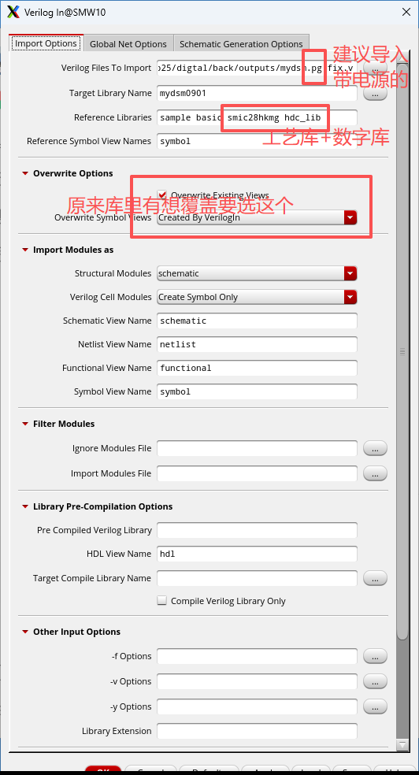

     

   - **stream In** 导入layout
     
   - 
     
     然后点击`More Options`
     
     
     
     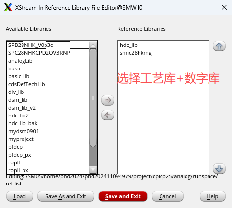
     
     

4. 注意：

   - 导出网表要导出电源和地，使用`-includePowerGround`, 这样才能在后续加pad的时候做lvs, 同时数字模块才能打上电源label后过lvs，否则：

     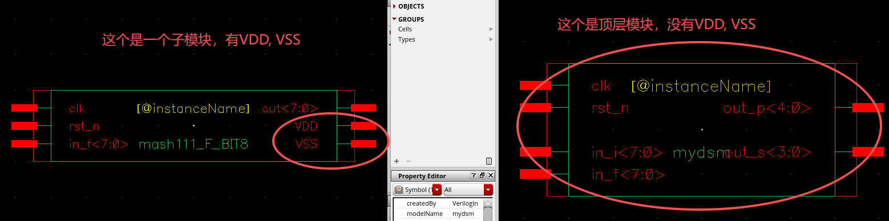

     

     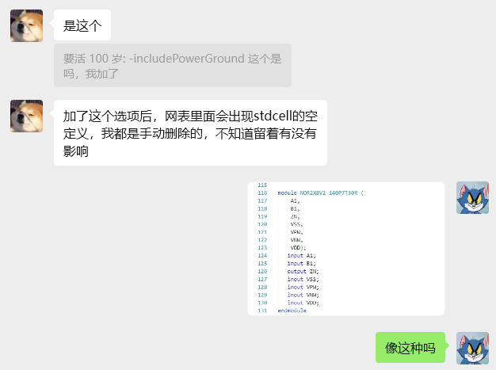

     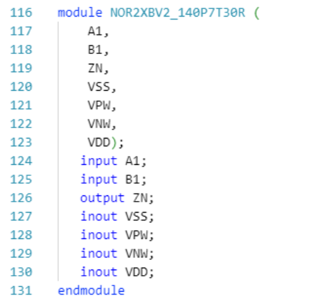

     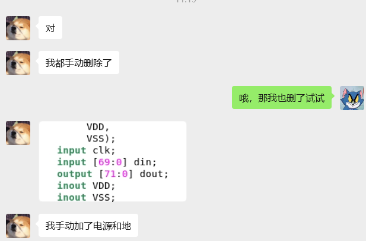

     

### 参考

   - [修复Hold Violation的方法_专栏_易百纳技术社区](https://www.ebaina.com/articles/140000013451#:~:text=RTL设计实现时，尤其是算法RTL，综合阶段或者Place阶段遇到setup timing不满足时，我们可以通过插入pipeline的方式修改RTL来解决setup violation，但是hold timing vioation往往CTS后才能发现且只能通过后端修复。,遇到hold violation时检查以下几点： 首先，检查SDC约束； 其次，检查CTS阶段后clock skew是否合理范围内； 再次，对CTS友好的FloorPlan和Placement也非常重要；)
   - [用脚本进行Innovus设计 - 白发戴花君莫笑 - 博客园](https://www.cnblogs.com/li2000/p/18269818/IC-digital-Innovus-tcl)
   - [(56 封私信 / 80 条消息) 集成电路中的Physical Cells - 知乎](https://zhuanlan.zhihu.com/p/654322816)


## Formality

> 这次没用了。。。

## DRC

> DFM 和[DRC](https://zhida.zhihu.com/search?content_id=259887039&content_type=Article&match_order=1&q=DRC&zhida_source=entity) 的区别在于，DRC 满足不了芯片大概率会废了，DFM 满足不了顶多是良率受损。所以有些关于DFM的DRC violation 可以选择waive掉

### 忽略部分violation

有很多violation需要在最后才能解决，前期calibre drc 可以选择忽略部分calibre

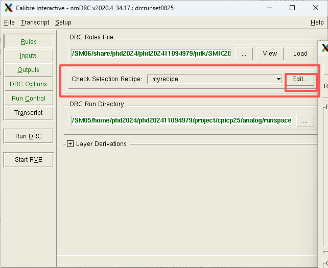

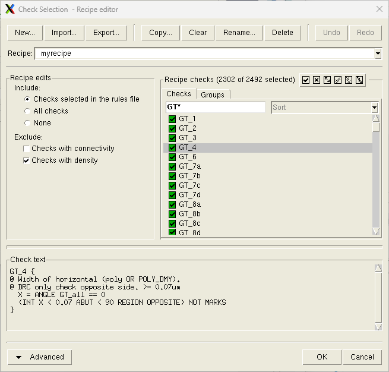

### 参考

[芯片漫谈—— DFM是个什么东西 - 知乎](https://zhuanlan.zhihu.com/p/1924235105657942639)


## LVS

导入了数字的schematic，然后添加drc rule文件就可以直接run了

> 没有标准库的schematic无法做LVS？ 貌似也不是：
>
> 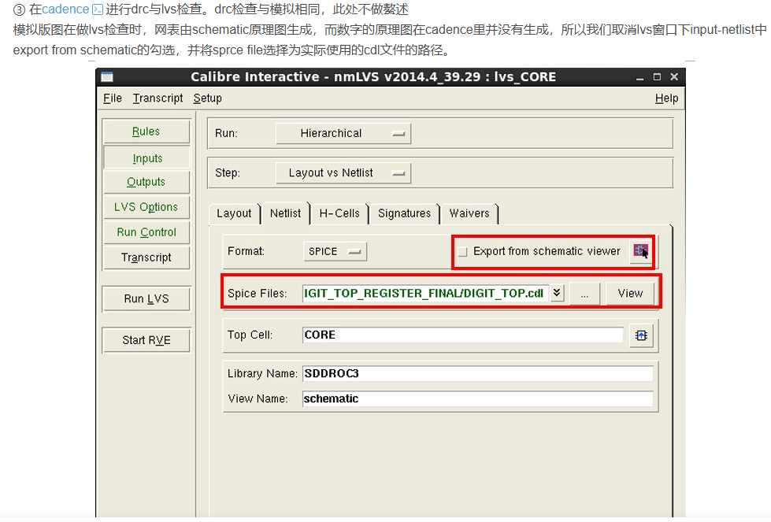

如果有错，这几个都可以点开来检查：

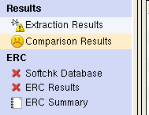

要善用图解


### buglist

1. ERC报错：check n/pwell_not_to_power/ground 或者 Warining: There is no data for layout net name

   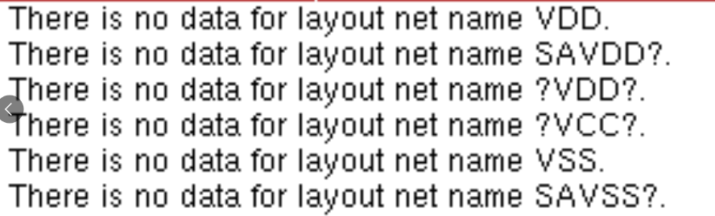

   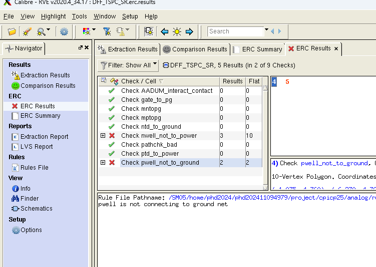

   不要看到笑脸就不管了，注意有时候ERC可能没过！

   [一文搞懂版图ERC类型 - 藍色天空](https://www.kaixinspace.com/layout-erc-type/)

   

   填上对应的电源和地，如果有数字地和模拟地，就分别填上比如“AVDD DVDD”

2. check floating

   

   这种情况是可以的，没问题可以waive


### 参考

[virtuoso中数模混合版图的lvs教程_版图lvs教程-CSDN博客](https://blog.csdn.net/weixin_44729325/article/details/132030722)


## StartRC

> 注意有很多提取spef的方式
> [后仿XRC、QRC 和 StarRC 的区别与联系_pex提取工具qrc-CSDN博客](https://blog.csdn.net/weixin_44996615/article/details/149334506)
>
> `QRC`可以直接在innovus上用, 不过这次更具博客做一直报错没有解决😭

> starRC可根据`数字集成电路课程设计`提到的脚本做，但是貌似一般PDK都会给相关脚本和文档，看了一下很复杂，没搞明白，不知道和课设的方法有什么区别。

输入：*.map*, *.nxtgrd*, *所有.lef*, *.def*

输出: *.spef/.spf*

脚本示例

```sh
#!/bin/bash
cd ../runspace
StarXtract -clean ../scripts/starrc_bst_spef.tcl
```

```tcl
* Library and design
BLOCK                       : mydsm

* Extraction
EXTRACTION                  : RC
COUPLE_TO_GROUND            : YES
REDUCTION                   : YES

* Processing
STAR_DIRECTORY              : /SM05/home/phd2024/phd202411094979/project/cpicp25/digtal/starRC/runspace/bst
NETS                        : * 
*MODE                       : 200
SKIP_CELLS                  : * 

*LEF
LEF_FILE	                : /SM05/home/phd2024/phd202411094979/project/cpicp25/pdk/SCC28NHKCP_TF_V0p2/innovus/hd/tf_mtt/scc28n_1p9m_7ic_1tmc_1mttc_alpa2.lef 
LEF_FILE	                : /SM05/home/phd2024/phd202411094979/project/cpicp25/pdk/STDCELL/SCC28NHKCP_HDC30P140_RVT_V0p2/lef/macro/scc28nhkcp_hdc30p140_rvt.lef 
LEF_FILE	                : /SM05/home/phd2024/phd202411094979/project/cpicp25/pdk/STDCELL/SCC28NHKCP_HDC30P140_RVT_V0p2/lef/macro/scc28nhkcp_hdc30p140_rvt_ant.lef
TOP_DEF_FILE		        : /SM05/home/phd2024/phd202411094979/project/cpicp25/digtal/back/outputs/mydsm.def

*Netlist
SUMMARY_FILE		        : ../reports/star_bst.summary
NETLIST_FILE                : ../outputs/mydsm_bst.spef
NETLIST_FORMAT              : SPEF

*Extraction 
TCAD_GRD_FILE               : /SM05/home/phd2024/phd202411094979/project/cpicp25/pdk/SMIC_CCIStarRC_28HKCplusLG_0925_1P9M_7Ic_1TMc_1MTTc_ALPA2_V1.0_REV5_1/NXTGRD/StarRC_28HKCplus_1P9M_7Ic_1TMc_1MTTc_ALPA2_RCMIN.nxtgrd
MAPPING_FILE                : /SM05/home/phd2024/phd202411094979/project/cpicp25/pdk/SMIC_CCIStarRC_28HKCplusLG_0925_1P9M_7Ic_1TMc_1MTTc_ALPA2_V1.0_REV5_1/CCI_flow_for_CUI/StarRC_28HKCplus_1P9M_7Ic_1TMc_1MTTc_ALPA2_cell.map
OPERATING_TEMPERATURE       : -40

```

> [!CAUTION]
>
> 这个脚本本来想在`.sh`里面设置环境变量然后在`.tcl`中使用的，但是报错了，找不到文件，不知道为什么。留给后人解决吧

### 参考

- [【StarRC】StarRC抽取寄生RC-CSDN博客](https://blog.csdn.net/zxhtiger84/article/details/135001829)

## PrimeTime


## 后仿

> 如果是单纯的数字模块可以在VCS上面跑
>
> 如果是数模混仿的一部分，感觉在virtuoso上跑比较好

### VCS-纯数字

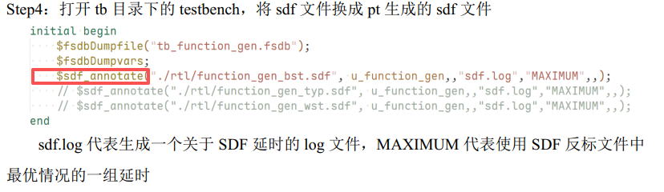

使用和前仿相同的testbench，主要区别是反标时序

### virtuoso

>  参考数模混合流程中的后仿方法


# 数字芯片流片工具链

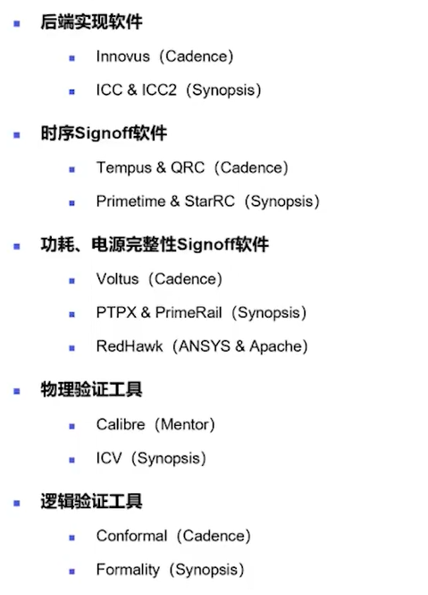

## VCS

### 简介

- Synopsys
- 要VCS与Verdi联合仿真，需要在testbench里面必须加入``ifdef FSDB`到`endif`的代码，这样才能生成fsdb文件提供Verdi读取，不然不会输出波形

### 运行脚本示例

```bash
#!/bin/bash

# Create simulation directory if it doesn't exist
mkdir -p ../rtl/sim

# Go to simulation directory
cd ../rtl/sim

# Compile RTL and testbench
vcs -full64 -sverilog -timescale=1ns/1ps \
    -debug_all -kdb \
    +define+FSDB \
    -R \
    -P $VERDI_HOME/share/PLI/VCS/LINUX64/novas.tab \
    $VERDI_HOME/share/PLI/VCS/LINUX64/pli.a \
    ../../rtl/spi_1kb_reg.v \
    ../../rtl/tb_spi_1kb_reg.v \
    -o sim_spi_1kb_reg

# Run simulation
./sim_spi_1kb_reg
# ./sim_spi_1kb_reg -gui
```

### command

- AI to generate scripts is all you need


### 参考

[Linux下VCS与Verdi联合仿真简易教程及例子示范_vcs和verdi-CSDN博客](https://blog.csdn.net/JasonFuyz/article/details/107508893)


## DC

### 简介


### 流程

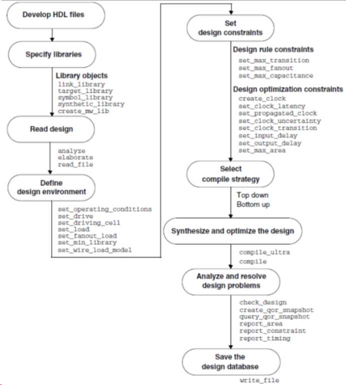


### 基本脚本

```tcl
## 设置工艺库
if {![info exists syn_dc_path]} {
    set syn_dc_path "/SM05/home/phd2024/phd202411094979/project/testflow/syn_dc"
}
set target_library "$syn_dc_path/../pdk/STDCELL/SCC28NHKCP_12T25OD33_RVT_V0p2/liberty/3.3v/scc28nhkcp_12t25od33_rvt_tt_v3p3_25c_basic.db"
set link_library "* $target_library"
# 如果你使用脚本模式而不使用 GUI,此库可不指定 Symbol library
set symbol_library "scc28nhkcp_12t25od33_rvt.sdb" 

## 检查库是否正确加载
list_libs

## 设置设计参数
set design_name "gcd"
set rtl_files "$syn_dc_path/../rtl/gcd.v"

## analyze命令用于读取并分析RTL源代码 # -format verilog 指定输入文件为Verilog格式 # $rtl_files 包含了要分析的RTL文件路径
analyze -format verilog $rtl_files
## elaborate命令用于根据analyze命令分析的RTL源代码,构建设计的内部数据结构 # 它会展开所有的层次结构,解析所有的模块实例,建立设计的完整网表模型 # $design_name指定要elaborate的顶层模块名
elaborate $design_name
## 检查设计是否正确加载
list_designs

## 设置基本的设计约束
create_clock -period 1 -name clk [get_ports clk]
set_input_delay -clock clk 0.5 [all_inputs]
set_output_delay -clock clk 0.5 [all_outputs]
set_max_area 0
### 检查时钟约束是否正确设置
report_clocks

## 编译设计
compile

## 生成报告
report_timing > $syn_dc_path/reports/timing.rpt
report_area > $syn_dc_path/reports/area.rpt
report_power > $syn_dc_path/reports/power.rpt

## 保存网表
write -format verilog -hierarchy -output $syn_dc_path/outputs/${design_name}_syn.v
write_sdc -version 2.0 $syn_dc_path/outputs/${design_name}_syn.sdc 
```


### 时序约束

时序路径是一个点到点的数据通路， 数据沿着时序路径进行传递。每条时序路径有一个起点(Startpoint)和一个终点(Endpoint)。

四条路径：


详细查看参考


#### 实战


##### 时钟的约束（寄存器和寄存器之间的路径约束）

```tcl
create_clock -period my_period_value [get_ports my_clk]
#时钟源到时钟端口的（最大）延时
set_clock_latency -source -max my_max_latency [get clocks my_clk]
#时钟端口到寄存器的时钟端口延时
set_clock_latency -max -my_max_latency [get_clocks clk]
#时钟抖动与偏移
## 首先是时钟偏移为±30ps,则有可能是前级时钟往后移30ps，同时本级时钟往前移30ps，对于建立时间偏移的不确定因素为30+30 =60ps；
## 然后是时钟抖动，前级的时钟抖动影响不到本级，因此只需要考虑本级的时钟抖动，由于是考虑建立时间，因此考虑本级时钟往前抖40ps，即对于建立时间抖动的不确定因素为40ps；
## 最后是要留50ps的建立时间不确定余量；
## 因此对于建立时间，总的不确定时间为60+40+50=150ps=0.15ns:
set_clock_uncertainty -setup 0.15 [get_clocks clk]
#时钟转换时间
set_clock_transition 0.12 [get_clocks clk]


```

#### 输入/输出延迟约束（输入路径的约束）

没看懂，感觉没道理，他怎么知道`dalay of S` 和 `register set up time`"：[Tcl与Design Compiler （六）——基本的时序路径约束 - IC_learner - 博客园](https://www.cnblogs.com/IClearner/p/6624722.html)

```tcl
set_input_delay
set_output_delay
```


### 面积约束

如果不设置面积的约束，Design Compiler将**做最小限度的面积优化**

设置了面积的约束后，DC将在达到面积约束目标时退出的面积优化。如果设置面积的约束为“0" , DC将为面积做优化直到再继续优化也不能有大的效果。这时，DC将中止优化。

注意，对于很大(如百万门电路)的设计，如将面积的约束设置为“0" , DC可能要花很长的时间为设计做面积优化。综合时，运行的时间很长

在超深亚微米(deep sub-micro)工艺中，一般说来，面积并不是设计的主要目标，对设计的成本影响不大。因此，我们在初次优化时，可以不设置面积的约束。

```tcl
set_max_area my_area
```


### 驱动强度、电容负载约束

这些约束是要经验的，一方面是对I/O口进行约束，属于I/O口的约束，为时序约束与时序分析提供了路径，更是为输入/输出路径延时约束的精确性提供保证；一方面是对I/O口对外的环境进行约束，可以算是**属于环境约束**


### 设置设计规则约束

```tcl
set_max_transition
set_max_fanout
set_max_capacitance
```


#### 参考

[Tcl与Design Compiler （六）——基本的时序路径约束 - IC_learner - 博客园](https://www.cnblogs.com/IClearner/p/6624722.html)


### 综合编译

电路综合优化包括三个阶段

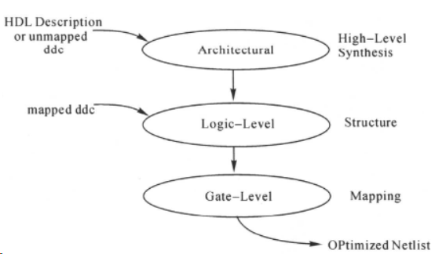

详细可看：[Tcl与Design Compiler （八）——DC的逻辑综合与优化 - IC_learner - 博客园](https://www.cnblogs.com/IClearner/p/6636176.html)

comand: `compile`

- **当违规得比较严重时**，也就是**时序的违规（timing violation）在时钟周期的25%以上**时，就需要重新修改RTL代码了。
- **时序违规在25%以下**，有下面的时序优化方法：
  - 使用`compile_ultra`命令（在拓扑模式下运行）
    - **compile_ultra**跟**compile**一样，是进行编译的命令。compile_ultra命令适用于时序要求比较严格，高性能的设计。使用该命令可以得到更好的**延迟质量( delay QoR )**，特别适用于高性能的**算术电路**优化。该命令非常容易使用，它自动设置所有所需的选项和变量。
    - **compile_ultra**命令包含了**以时间为中心**的优化算法，在编辑过程中使用的算法有:**A**以**时间为驱动**的高级优化(Timing driven high-level optimization);**B**为**算术运算**选择适当的宏单元结构;**C**从DesignWare库中**选择最好的数据通路**实现电路;**D**映射**宽扇入(Wide-fanin)门**以减少逻辑级数;**E**积极进取地使用**逻辑复制**进行负载隔离;**F**在**关键路径**自动**取消层次划分**(Auto-ungrouping of hierarchies)。
    - 


- **自顶向下（Top-Down）：** 整体优化，适用于中小型设计
- **自底向上（Bottom-Up）：** 分层编译，适合大型设计==（需设置 dont_touch 保护子模块）==
- 

### notes

#### target_library 和 link_library 的区别

target_library:

- 这是综合工具最终映射到的目标工艺库, 在门级优化及映射的时候提供生成网表的 cell,即DC 用于创建实际电路的库。

- 包含实际要使用的标准单元（如 SMIC28 的单元）

- 综合工具会优先使用这个库中的单元

- 通常只设置一个目标库


link_library:

- 这是链接库，用于解析设计中引用的所有单元. 提供设计网表中的 cell，可以跟target_library使用同一个库，但是 DC 不用 link library中的 cell 来综合设计

- 可以包含多个库文件

- 必须包含 target_library 中指定的库
- 此当读入的文件是门级网表（比如用到了IP核的网表）时，需要把 link library 设成指向生成该门级网表的目标库，否则 DC 因不知道网表中门单元电路的功能而报错。
- 如果需要将已有的设计从工艺A转到工艺B时，可以将当前的单元综合库A设为link_library，而将单元综合库B设为target_library，重新映射一下就可以了。

- 通常包含：
  - 目标工艺库
  - 内存编译器生成的库
  - IP 核的库
  - 其他特殊单元的库


#### link_library中的“*”

`* `的具体含义：

- 代表当前在 Design Compiler 内存中已经加载的设计

- 包括你通过 analyze 和 elaborate 命令读入的 RTL 设计

- 也包括综合过程中生成的中间设计
- 为什么需要 *：当 Design Compiler 进行链接（linking）时，它需要能够找到所有被引用的单元，这些单元可能来自：
  - 工艺库（如 scc28nhkcp_12t25od33_rvt_tt_v3p3_25c_basic.db）
  - 内存中的设计（*）*
  - 其他库（如 memory_compiler.db, ip_core.db）


#### 两种编译策略

`top down` & `bottom up`

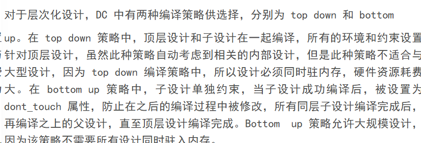


### command补充解释

#### list_libs

```tcl
Logical Libraries:
-------------------------------------------------------------------------
Library         File                    Path
-------         ----                    ----
  scc28nhkcp_12t25od33_rvt_tt_v3p3_25c_basic scc28nhkcp_12t25od33_rvt_tt_v3p3_25c_basic.db /SM05/home/phd2024/phd202411094979/project/testflow/pdk/STDCELL/SCC28NHKCP_12T25OD33_RVT_V0p2/liberty/3.3v
  gtech         gtech.db                /SM01/eda/synopsys/syn/R-2020.09-SP4/libraries/syn
  standard.sldb standard.sldb           /SM01/eda/synopsys/syn/R-2020.09-SP4/libraries/syn
```

- gtech.db (Generic Technology Library):
  - 这是 Synopsys 提供的一个通用技术库
  - 包含基本的逻辑门单元（如 AND, OR, NOT, NAND, NOR 等）
  - 用于在综合的早期阶段，当设计还没有映射到具体工艺库时使用
  - 提供基本的时序和面积信息
  - 路径：/SM01/eda/synopsys/syn/R-2020.09-SP4/libraries/syn
- standard.sldb (Standard Symbol Library):
  - 这是符号库文件
  - 包含标准单元的图形符号定义
  - 用于 Design Compiler 的图形界面显示
  - 提供单元的可视化表示
  - 路径：/SM01/eda/synopsys/syn/R-2020.09-SP4/libraries/syn

#### search path

可以通过`search_path`减少文件路径前缀

```tcl
# 1. 首先设置基本路径
set search_path [list "."]

# 2. 添加工艺库路径
lappend search_path "pdk/STDCELL/SCC28NHKCP_12T25OD33_RVT_V0p2/liberty/3.3v"
lappend search_path "pdk/STDCELL/SCC28NHKCP_12T25OD33_RVT_V0p2/verilog"

# 3. 添加设计文件路径
lappend search_path "rtl"

# 4. 添加其他必要路径
lappend search_path "ip"
lappend search_path "memory"
```

#### set_addribute

许多设计者都会抱怨工艺库中对单元的DRC属性设置不当，这是由于库的能力是有限的所致。对于一个设计，综合库的DRC设置可能很合适，而对于另一个设计就可能不太合适。这时候，需要设**计者对综合库进行“剪裁”**。当然，这种**“剪裁”必须比库中的定义更为严格**。如将一个库中buffd0的Z端的max_fanout由4.0改为2.0的命令：

  `set_addribute  find(pin, ex25/BUFFDO/Z)  max_fanout  2.0`


#### change_names

`change_names` 命令是 Design Compiler 中的一个重要功能，主要用于修改设计中的名称以符合特定硬件描述语言或工具的命名规则。具体作用如下：

在脚本中的 change_names -rules verilog -hierarchy 命令：

1. 名称标准化：

- -rules verilog 参数指定使用 Verilog HDL 的命名规则

- 确保所有的信号、模块和单元名称符合 Verilog 语法规范

1. 解决命名冲突：

- 在综合过程中，编译器可能生成不符合目标语言规范的名称

- 可能存在保留字冲突、非法字符或其他命名问题

1. 层次结构处理：

- -hierarchy 参数表示应用于整个设计层次结构

- 不仅修改顶层模块名称，还递归地处理所有子模块和信号名称

1. 写出网表前的准备：

- 这个命令通常在使用 write -format verilog 命令输出网表之前执行

- 确保生成的网表可以被下游工具（如布局布线工具）正确解析

1. 实际转换包括：

- 替换非法字符（如 $, ., [, ] 等）

- 处理以数字开头的名称（Verilog 要求标识符以字母或下划线开头）

- 修改与 Verilog 关键字冲突的名称

如果不执行这个命令，生成的网表可能包含不符合 Verilog 语法的名称，导致下游工具无法正确读取，或者在仿真和验证阶段出现问题。


#### redirect

重定向

`redirect -file file.rpt {command}`

### 参考

- [Design Compiler (DC) 工具基本综合流程_design compiler教程-CSDN博客](https://blog.csdn.net/jiangyezhou110/article/details/146161891)
- [Design Compiler - 标签 - IC_learner - 博客园](https://www.cnblogs.com/IClearner/tag/Design Compiler/)


## Innovus_

[详细内容](# innovus)


## Cerebrus

- PR tool
- Cadence
- AI-based


## StarRC

- Synopsys
- Sign-off级别RC参数提取
- 与PrimeTime STA深度集成


## Formality

- Synopsys

- 网表逻辑等价性验证，一般会在综合以后和综合前的网表做一次验证， 做完后端物理设计以后再进行一次验证

- 

- 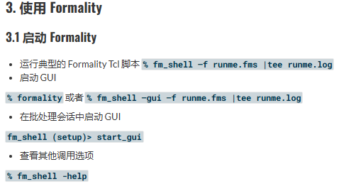

- 

- 实例脚本

  ```tcl
  #dc_setup.tcl
  
  set DESIGN_NAME                "function_gen"
  set REPORTS_DIR                 "reports"
  file mkdir ${REPORTS_DIR}
  set DC_DIR                     "../1_dc/output"
  set DCRM_SVF_OUTPUT_FILE       "function_gen.svf"
  set INNOVUS_DIR                "../4_innovus/postlayout"
  set DCRM_FINAL_VERILOG_OUTPUT_FILE "function_gen.v"
  
  set FMRM_UNMATCHED_POINTS_REPORT "unmatched_points"
  set FMRM_FAILING_SESSION_NAME  "failing_session"
  set FMRM_FAILING_POINTS_REPORT "failing_points"
  set FMRM_ABORTED_POINTS_REPORT "aborted_points"
  set FMRM_ANALYZE_POINTS_REPORT "analyze_points"
  
  # specify library
  set library_dir        "/SM01/teaching/bs/digitalic/gb18_dc_lib"
  
  # specify timing library
  set ADDITIONAL_LINK_LIB_FILES " \
     ${library_dir}/scx_csm_18ic_tt_1p8v_25c.db \
  "
  
  # specify RTL directory
  set rtl_dir "../1_dc/output"
  
  # specify RTL
  set RTL_SOURCE_FILES " \
  ${rtl_dir}/function_gen.v \
  "
  
  ```

  ```tcl
  #fm.tcl
  
  source -echo -verbose ./tcl/dc_setup.tcl
  
  # setup for handing undriven signals in the design
  set verification_set_undriven_signals x 
  
  # to treat simulation and synthesis mismatch messages as warning
  set_app_var hdlin_error_on_mismatch_message false
  
  #read in the SVF file
  set_svf ${DC_DIR}/${DCRM_SVF_OUTPUT_FILE}
  
  # read in the SVF file
  read_db -technology_library ${ADDITIONAL_LINK_LIB_FILES}
  
  # read in the Ref design
  read_verilog -r ${RTL_SOURCE_FILES} -work_library WORK
  set_top r:/WORK/${DESIGN_NAME}
  
  # read in the Impl design
  read_verilog -i ${INNOVUS_DIR}/${DCRM_FINAL_VERILOG_OUTPUT_FILE}
  set_top i:/WORK/${DESIGN_NAME}
  
  # match compare points and report unmatched points
  match
  report_unmatched_points > ./reports/unmatch_points.rpt
  report_matched_points > fm_match.rpt
  
  # Verify and report
  if { ![verify] }  {  
    save_session -replace ${REPORTS_DIR}/${FMRM_FAILING_SESSION_NAME}
    report_failing_points > ${REPORTS_DIR}/${FMRM_FAILING_POINTS_REPORT}
    report_aborted > ${REPORTS_DIR}/${FMRM_ABORTED_POINTS_REPORT}
    analyze_points -all > ${REPORTS_DIR}/${FMRM_ANALYZE_POINTS_REPORT}
  }
  
  ```

  


### 参考

[Formality 快速上手指南 | EasyFormal](https://easyformal.com/lec/formality_guide/)


## Calibre

- Synopsys
- DRC/LVS/ERC验证事实标准，支持先进封装（3DIC）


## Prime Time


# 模拟芯片流片工具链

## Virtuoso

### schematic

### simulation ADE

#### 简介

早期的仿真环境主要包含 `ADE L` 和 `ADE XL`，但是在 Virtuoso `IC617 版本`后，Cadence 公司新推出了两款仿真工具 `ADE Explorer` 和 `ADE Assembler`，用于替代原本的 ADE L、ADE XL 以及 ADE GXL 环境。相比于原本的 ADE L 仿真环境，ADE Explorer 将单次仿真、corners、sweeps、蒙特卡罗以及参数对比等功能都整合在了 ADE Explorer 中，而 ADE Assembler 则主要取代了之前的 ADE XL 以及 ADE GXL 功能。

#### ADE Explorer

- 是`ADE Assembler`的子集，直接用`ADE Assembler`吧
- ADE Assembler 的操作逻辑和 ADE Explorer 类似，可以认为是全局设置和局部设置的区别

#### ADE Assembler

- Assembler 具有极高的自由度，可以在右侧同时添加多个 ADE Explorer，而每个 ADE Explorer 就对应着一个 Test。

- 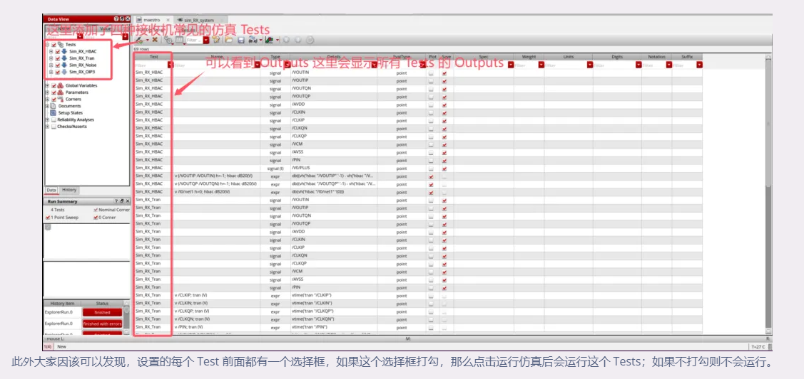

- 添加信号

  

  > 直接右键也可以添加`signal`

  

  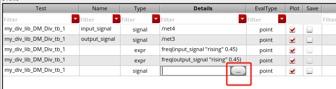

  点这三个点可以从原理图选取

  批量添加：右键空白处-->`To be plotted`--> 在原理图点击

  

- 每次跑完的结果都会记录：

  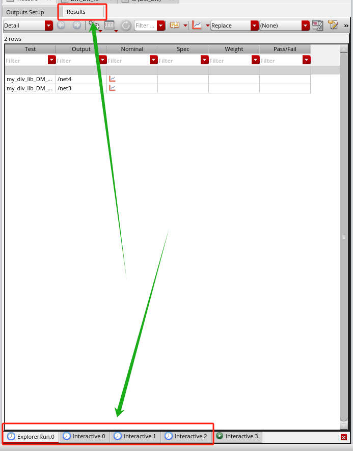

- 一般跑完后，右键`plot all` 就行

  

- 或者选择`Direct Plot`， 可以在`schematic` 点那个信号就画那个

  


#### 参考

- [Cadence maestro 快速仿真实用教程（ADE Explorer 与 ADE Assembler） – Analog-Life](https://www.analog-life.com/2025/02/improve-simulation-efficiency-with-cadence-maestro/)


### Layout

#### 相关设置

- 注意一定要新建原理图需要attach对应的PDK才行

- 需要一个`.cdsinit`文件才能在Virtuosovi'jx用`Calibre`做DRC和LVS

- 需要一个`runset`文件

- 高亮/设置网格（一般都会设置成0.005)：

  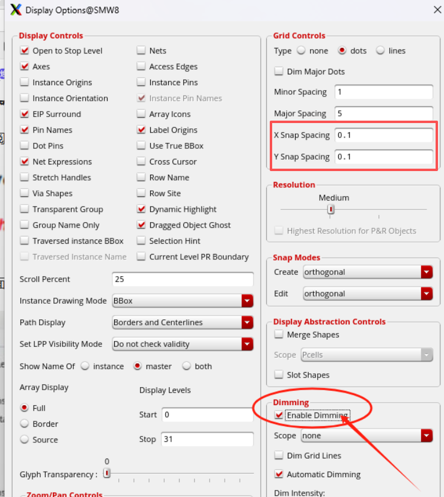

- 有时候滚轮缩放到很大才会显示，可以适当提高`Resolution`精度

  

​	

#### 自动布线

> 注意要打上pin

[自动布局布线使用说明 - 小小桂花糕 - 博客园](https://www.cnblogs.com/jinzbr/p/18235464)

### tips

- 没有连接的，默认会警告，可以用`basic--> noCon`替代

  

  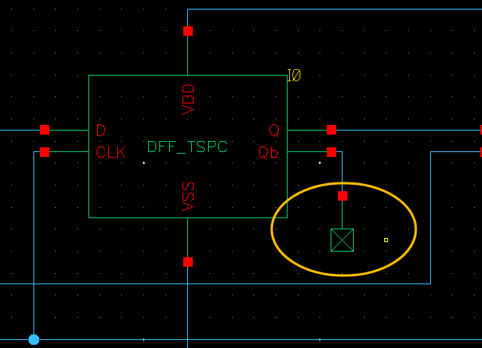

- 测试的时候，负载可以接到NMOS栅极，不用电阻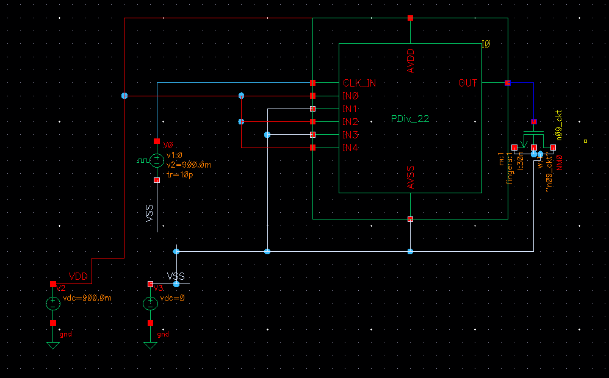

- `ADE A`并行加速

  

  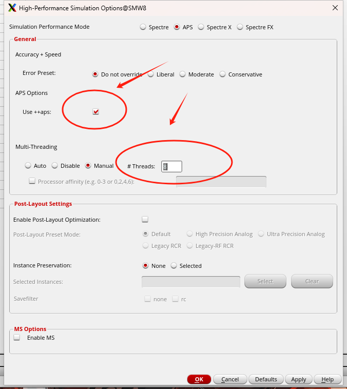

  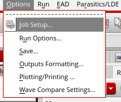

- Outputs Setup有变量更新了或者有新的表达式，可是点击这个黄色按钮，不需要重新跑，就可以plot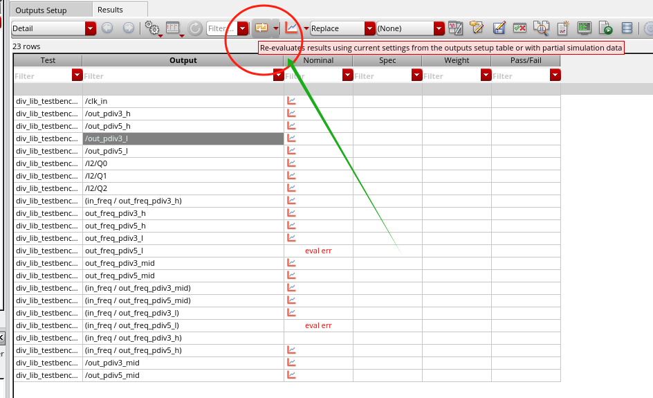

- 设置变量：根据输入频率变量确定瞬态仿真的时间

  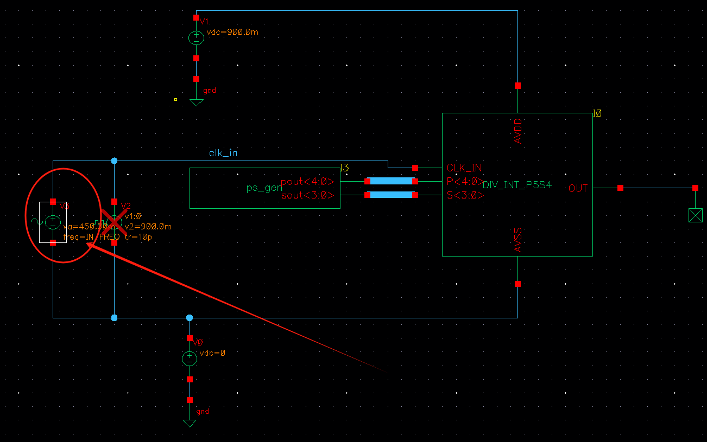

  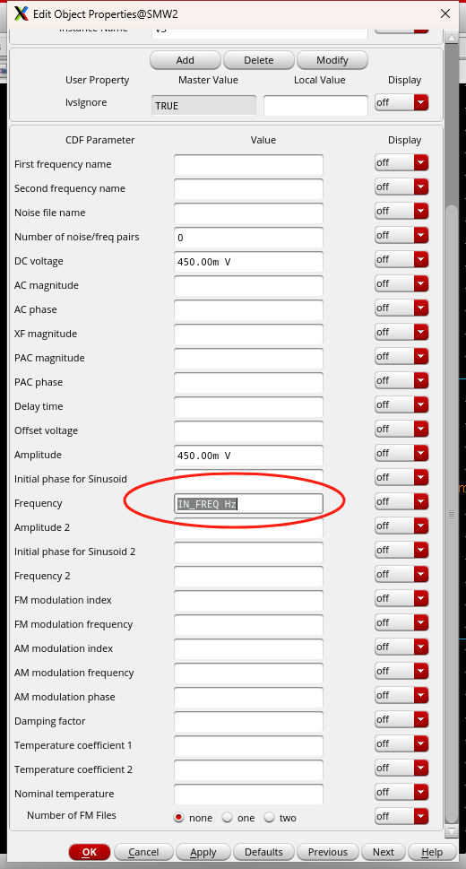

  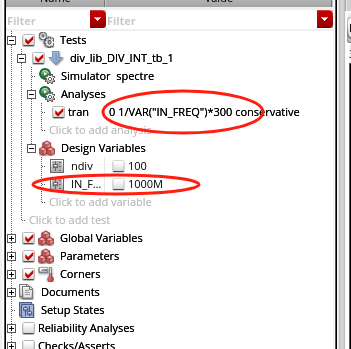

- 可以通过corner设置，把选择多个输入频率同时仿真

  

  

- 可以导出数字标准单元的layout查看

- 

### 相关快捷键

- 对一个symbol按空格可以快速引出label

#### 原理图编辑器 (Schematic Editor)

- i: 放置实例/组件

- w: 绘制导线

- l: 创建标签

- p: 创建引脚

- r: 旋转所选对象

- m: 镜像所选对象

- c: 复制所选对象

- q: 查看属性

- Shift+f: 适应窗口大小

- f: 放大选中区域

- Ctrl+f: 缩小视图

- Ctrl+z: 撤销

- Ctrl+y: 重做

- Delete: 删除所选对象

- Esc: 取消当前操作

- e: 编辑属性

- Tab: 在对象之间循环选择

#### 版图编辑器 (Layout Editor)

- Ctrl+a: 创建新图层

- p: 创建路径

- r: 创建矩形

- c: 复制对象

- m: 移动对象

- s: 拉伸对象

- Shift+f: 适应窗口大小

- f: 放大选中区域

- k: 测量距离

- Ctrl+d: DRC检查

- Ctrl+e: 提取器(Extractor)

- Ctrl+l: LVS检查

#### 全局快捷键

- Ctrl+s: 保存

- o: 打开对象

- h: 帮助

- x: 剪切

- v: 粘贴

#### ADE (模拟设计环境)

- Alt+s: 仿真

- Alt+p: 绘制波形

- Alt+a: 添加新分析

- Alt+v: 设置变量


# 混合仿真流程

## 前仿

前提：模拟模块和数字模块(综合前)分别搭好

1. 新建verilog veiw, 并生成symbol

2. 新建config

   

   > 选择外部的HDL代码，也就是源码

3. 画好testbench原理图

4. 新建`maestro`，选择`AMS`仿真器


​	


> 这里主要是修改高低电平，根据使用的器件修改

> 注意, 如果是综合后的，要加上数字库的functional
>
> 导入每个数字标准单元的functional，把所有模块的verilog代码放到一个文件可以跑，分开来不知道为什么不行。。。
>
> 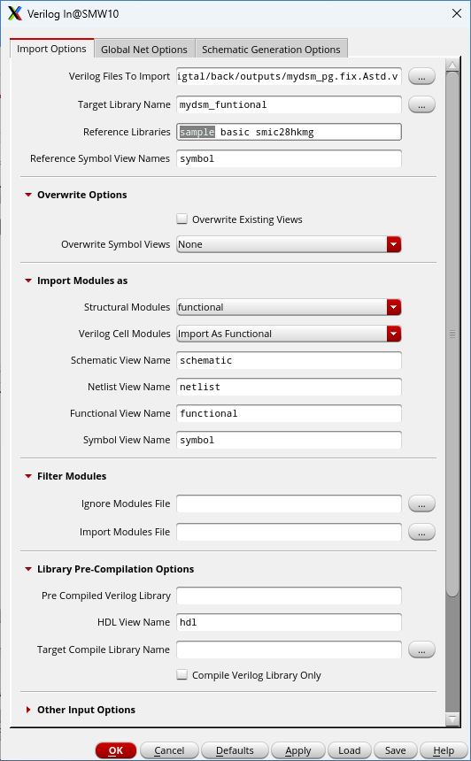
>
> [cadence AMS数模混合仿真_ams仿真-CSDN博客](https://blog.csdn.net/qq_41990421/article/details/134294680)
>
> [使用 Cadence AMS 仿真器进行数模混仿教程 – Analog-Life](https://www.analog-life.com/2023/02/using-cadence-ams-simulator-for-digital-analog-mixing-simulation/)
>
> 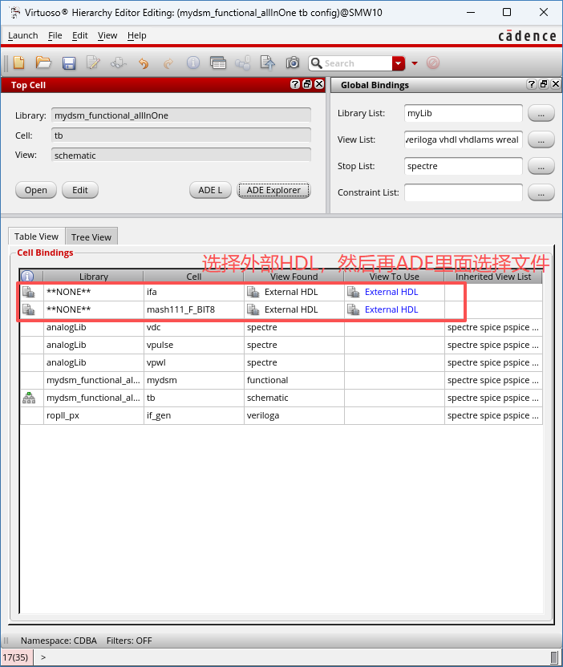
>
> > 上图的两个框选模块`mydsm`的两个子模块，本来是红色的


### 参考

- [Cadence Virtuoso数模混合仿真流程 - 知乎](https://zhuanlan.zhihu.com/p/8280687951)

## LVS

### buglist

1. 同时拥有数字和模拟电源/地的情况下，保证数字和模拟地没有连线，也出现短路，同时有soft check

   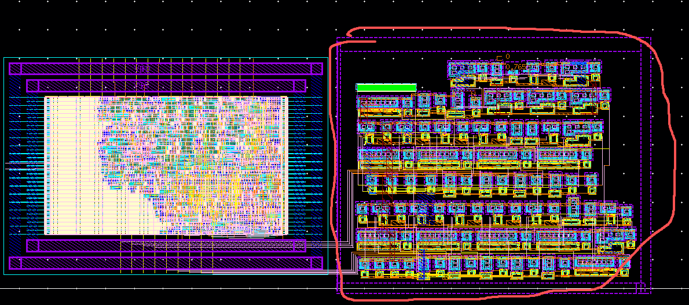

   在模拟/数字版图周围加上一圈NWell

   参考：[ 跑lvs出现soft connect怎么处理？ - 知乎](https://zhuanlan.zhihu.com/p/721804516)

   但是又出现了以下softcheck：

   

   后面不分数字模拟地了，也被NWell去掉了，clean了

   > [!WARNING]
   >
   > 但是原因是什么？不分会有什么后果？

## DRC

### Buglist

- LU3.

  

  解决方法：在VDD/VSS的PAD上盖上VDDMK/VSSMK层

- 模拟ant drc:

  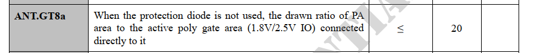

  发生在连接了pad的gt上。

  解决方法：信号线连接二极管

  [天线效应antenna effect错误求助 - Layout讨论区 - EETOP 创芯网论坛 (原名：电子顶级开发网) -](https://bbs.eetop.cn/thread-842513-1-1.html)

  


## 后仿

> [!WARNING]
>
> 注意，数字模块理论上可以进行晶体管级的（动态？）仿真，但是项目大的话千万不要怎么做！很卡

### 数字模块时序反标

`simulation –>option -->AMS simulator`中点击`SDF`，在`sdf command file`中输入`.sdf`文件路径即可


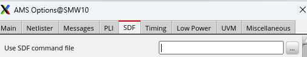

> [!WARNING]
>
> 
>
> 貌似跑一次`.sdf`文件只能选一个，这样不好在plot出来的图上比较。不知道怎么解决

### 模拟模块提取寄生参数并替换网表

同[9.寄生参数提取（PEX）](# 9.寄生参数提取（PEX）)


### 设置corner

同[前仿PVT验证](# 6.前仿PVT验证)

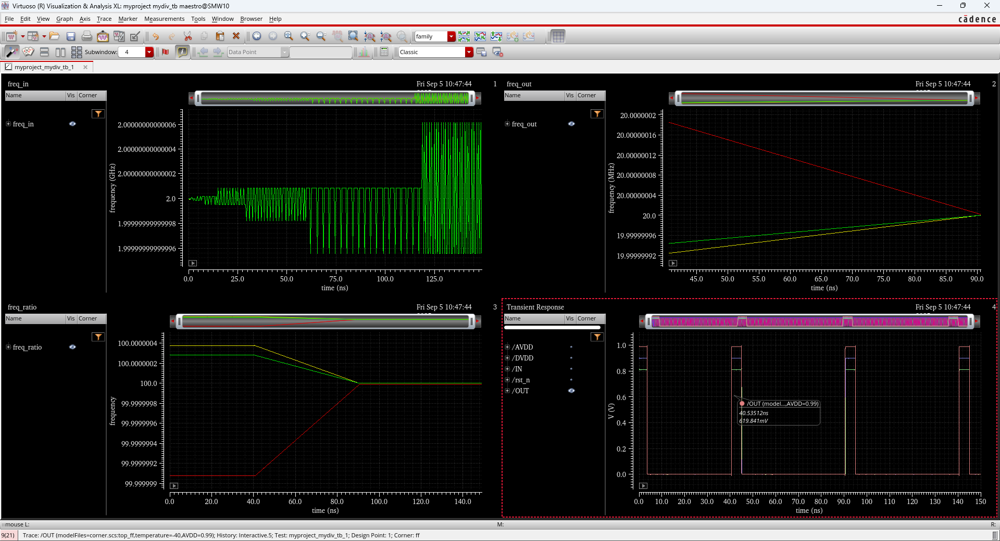


## 加I/O PAD

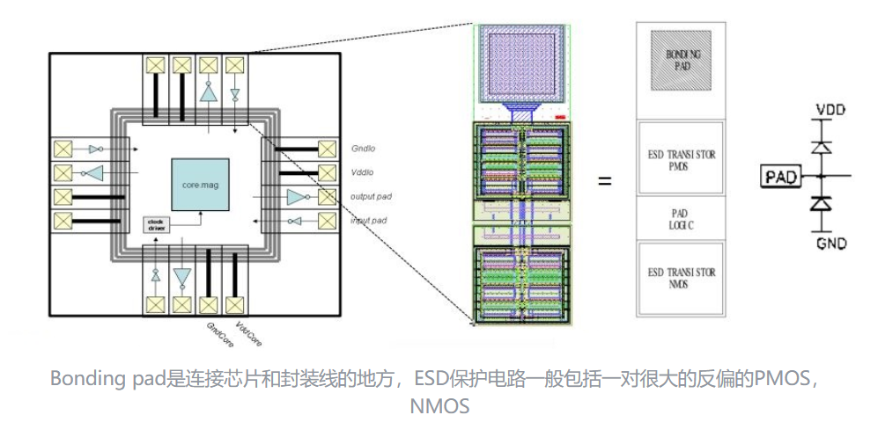

IO 电路的作用有几方面：ESD保护，level shifter，施密特触发器等等。还有提供电源环路。

> **PAD Ring部分在设计项目中十分重要**，包括整个芯片的电源网络都在这部分完成，因此也会**占据很大一部分芯片面积**。在先进工艺设计中，核心电路的尺寸可能一直在减小，但是由于**电源线宽**、**PAD尺寸**、**ESD保护电路尺寸**等限制，PAD Ring的尺寸并没有按比例减小。**良好的PAD规划一方面可以节省芯片面积**

一个基本的pad library，应该可以提供如下几种pad：

1. 给pad供电的pad，例如：PAD_VDD, PAD_VSS;
2. 给core供电的pad，例如：VDD, VSS; （如果存在多个VDD domain， 还有AVDD, AVSS，之类的pad）
3. 模拟信号的pad，例如ANIN (analog的pad一般就是一块铁片，有的vendor推荐用户可以自己基于要求自己再加上一定的ESD保护电路)
4. 数字信号的pad，一般有input和output的区别，里面还有包括level shifter(电平转换)，buffers之类的数字电路

> 建议设计pad ring之前，先去读一下vendor的文档，文档一般会说明各种类型的pad的用法，还有各种注意事项。不同的vendor提供的pad library不一样，所以有时候还是谨慎一点。
>
> 比如SMIC28的*SMIC_SPC28NHKCPD2OV3RNP_IO_DataBook_Ver0p5.pdf*:
>
> SPC28NHKCPD2OV3RNP: Where SP  stands for SMIC pad, 28HKCP is 28nm Logic  HKC  plus  process  and  D2  means  2.5V  voltage  application, OV3  means  the  IO  Power can be  overdriven  3.3V,  R  means  regular,  N  means  narrow  and  the second P  is  DUP  (Device  Under Pad).  All  I/O  pads  are  matched  with  the  design  requirement  of  SMIC  28nm  Logic  HKC  plus 0.9V/1.8V/2.5V  Design  Rules  (TD-LO28-DR-2013).  Table  1  describes  the  process  and  physical specification  of  the  Library.  It  should  be  noted  that  SPC28NHKCPD2OV3RNP  support  design with  7,  8,  9  and  10  layers  of  metal  application.


### 基础知识


### 结构

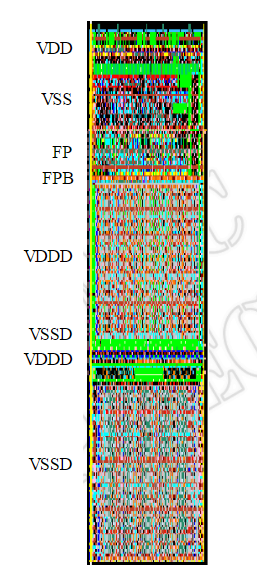

#### pre-driver

Pre-driver  provides  logic operation  for  I/O  circuit

The  pre-driver  section  contains  `VDD`  and  `VSS`  ports. 

 `VDD` is  connecting  to  the  0.9V power ring

####  post-driver

post-driver  provides  large  driving  capability  and  ESD  protection ability.

The  post-driver  section  contains  various  ports  and  their  functions  are  connecting  to  the  `3.3V  or 1.8V` power, and connecting to various `guard rings` for latch-up and `ESD `protection purposes

#### FP

FP stands for ‘From Power Pad’. FP and FPB pin  is for ==global signal==

FP is activated  by  `PVDD2PUDCRNC_X  `or  `PVDD2PUDCRNC_Y  `to  ‘HIGH’  (==3.3V  or  1.8V==)  

FPB is activated by `PVDD2PUDCRNC_X `or PVDD2P `UDCRNC_Y `to  ‘LOW’ (==0V==)

FP and FPB rail  will  be automatically  connected while joining  with other digital  I/O cells


### Cell categories

#### Digital I/O Cells

#### Analog I/O Cells

#### ESD clamp Cells

#### Filler Cells 


### DC and AC Specification


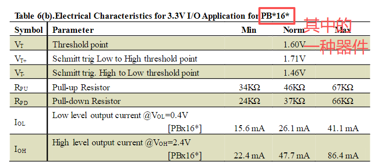

> 有很多，需要具体在文档看

#### Data Sheet 

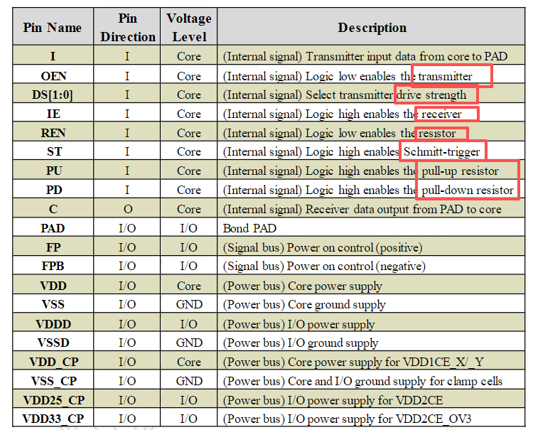

##### 3-state output  pad（都是数字的）

- PBSxRNC_X/_Y 
- PBCDxRNC_X/_Y
- PBCUxRNC_X/_Y 
- PBCSUD4RNC_HD _X/_Y


> [!WARNING]
>
> 这次SMIC28PAD，没有原理图，做不了LVS

### 技巧：

1. layout 里面可以使用快捷键对齐工具与快捷键`a`在某个金属层上实现对齐与吸附

   

   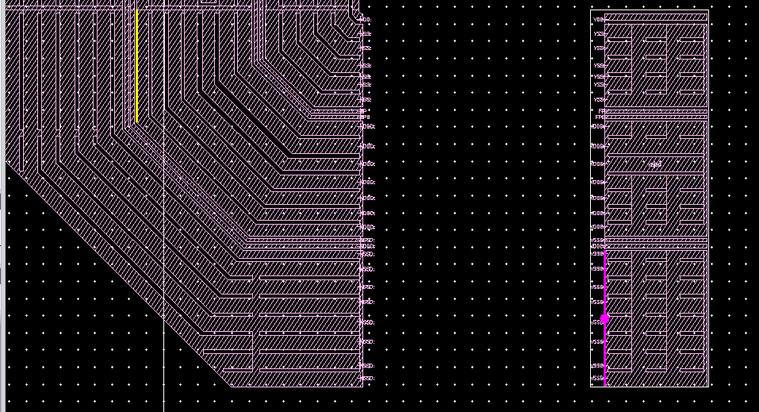

   

   > [!WARNING]
   >
   >  又不会依旧会对不齐，不知道为什么，最后的小部分手动解决了

   


### 参考

- [一点的关于pad的基础知识分享 - 知乎](https://zhuanlan.zhihu.com/p/572630948)
- [模拟集成电路设计流程--ESD保护电路和PAD电路-电子工程专辑](https://www.eet-china.com/mp/a44030.html)
- [关于电源IO的数量](https://bbs.eetop.cn/forum.php?mod=viewthread&tid=336715)


## LVS/DRC

> 再次做LVS和DRC

## 加seal ring

在整个芯片的外围，一般还要求**放置一圈Seal Ring**

Seal Ring是一种**氧化、钝化层结构**，在版图上Seal Ring是一个由**离子注入**、**过孔**、**金属**等各层按照一定的规则叠加实现的。特别是**过孔在Seal Ring上的实现可能和其它电路中不一致**，所以大部分工艺针对Seal Ring有相应的设计规则。

设计人员可以根据自己的需要在版图外围添加Seal Ring，有些**代工厂也可以为版图添加Seal Ring**

作用

- **防止芯片在切割的时候受到机械应力损伤**
- 如果把Seal Ring接地，也可以**起到屏蔽芯片外干扰的作用**
- Seal Ring可以**防止潮气从侧面断口侵入芯片**，**对静电保护也有一定的作用**。


### SMIC28实例

1. 导入seal ring的`.gds`文件到新的library
2. 会有一个长条和一个拐角模块
3. 拼接成合适的大小


### 参考

- [保护神——Seal ring - 知乎](https://zhuanlan.zhihu.com/p/44729829)

## 运行dummy脚本填充FIller

### SMIC28 流程示例

1. 在顶层中画一个``BORDER`层盖住设计整个设计

2. `Stream Out `导出顶层`top.gds`

3. 修改foundary给的脚本的相关路径

   示例:

   ``` 
   #! tvf
   namespace import tvf::*
   tvf::VERBATIM {
   //##|     Note 1 : This script could fill OCCD/OCOVL,AA/GT/P2/P4,1X metal (M1~M8),1X Via (V1~V7),8X/10X Top metal (TM1,TM2; STM1,STM2),MTT2,ALPA layers.
   //##|     Note 2 : This runset must be run with hierarchy mode.
   //##|     Note 3 : Output GDS datatype is 1 & 7.  
   //##|     Note 4 : Please keep all tech file at same folder, or change the attachment file path within main file.
   //##|     Note 5 : Please designers ensure timing closure post dummy insertion.     
   //##|     Note 6 : This runset required "calibredrc/calibrehdrc/calyieldenhance" license by Mentor Graphics.             
   //##|     Note 7 : Please make sure your EDA tool&tool version: Calibre® Calibre nmDRC/Calibre nmDRC-H2 & "v2014.4_18.13". 
   //##|     Note 8 : Any question about this utility, please don't hesitate to contact me, email: Tyzy_Lee@smics.com.  
   //##|     Note 9 : Please read this utility's release note carefully, which release together with utility.
   //##********************************************************************************
   //##|                Calibre Model-Based dummy fills program
   //##********************************************************************************
   //##================================================================================
   //##|       SMIC:               28nm Logic HKC Plus Auto Dummy Insertion Rules
   //##|       Doc.No:             TD-LO28-IR-2004
   //##|       Doc.Rev:            4
   //##|       Tech.Dev.Rev:       V1.0_REV1
   //##|
   //##|       Document for reference:
   //##|       SMIC:               28nm Logic HKC plus 0.9V/1.8V/2.5V Design Rules
   //##|       Doc.No:             TD-LO28-DR-2013
   //##|       Doc.Rev:            10
   //##|       Tech.Dev.Rev:       V1.0_REV6
   //##|===============================================================================| 
   //##|===============================================================================|
   //##|  QA level :  I   -> pass nothing                                              |
   //##|              II  -> pass testchip QA                                          |
   //##|              III -> pass standart QA flow (official release)                  |
   //##|===============================================================================|
   //##|===============================================================================|
   //##| Revision History :                                                            |
   //##|    Rev        Date          Who                      What                     |
   //##| --------  ------------  ------------  ----------------------------------------|
   //##|V1.0_REV1_0 20210819     Jinyan Wang   1. Add P4 dummy insertion               |
   //##| --------  ------------  ------------  ----------------------------------------|
   //##|	 V1.0   20180604      Robben_Lee    1.  Just follow up dummy rule version. rule optimization but coding not need update.			
   //##|  QA level : III 								    |
   //##| --------  ------------  ------------  ----------------------------------------|
   //##|	 V0.9   20180115      Robben_Lee    1.  update HiR area rules			
   //##|  QA level : III 								    |
   //##| --------  ------------  ------------  ----------------------------------------|
   //##|	 V0.6_1   20171017    Robben_Lee    1.  Change chip corner defination from 70um to 74um
   //##|  QA level : III 								    |
   //##| --------  ------------  ------------  ----------------------------------------|
   //##|	 V0.6   20170607      Robben_Lee    1.  Initial, This deck refer 28HKMG V1.0
   //##|					    2.  Change MTT2 dummy rules and follow 65nm MTT2 rules to decrease the density to avoid wafer warpage issue.
   //##|  QA level : III 								    |
   //##| --------  ------------  ------------  ----------------------------------------|
   
   SVRF VERSION "v2014.4_18.13"
   
   //##|===============================================================================|
   //##|       User configuration section						    |
   //##|===============================================================================|
   
   //##|===============================================================================|
   //##|Chip window size defines: "If use coordinate input",
   //##|  "pleae un-comment the following code"
   //##|  "wxLB","wyLB","wxRT","wyRT" are Chip window left-bottom and right-top coordinate
   //##|  user should define it according to your real layout
   //##|===============================================================================|
   
   //LAYER ChipWindow 2999
   //VARIABLE   wxLB  1000 
   //VARIABLE   wyLB  1000
   //VARIABLE   wxRT  10000
   //VARIABLE   wyRT  10000
   //POLYGON wxLB wyLB wxRT wyRT ChipWindow
   //BULK_1 = COPY ChipWindow
   
   //##|===============================================================================|
   //##|Chip window size defines: "If use layer 127;0 (BORDER) as chip boundary",
   //##|  "please un-comment the following code"; and "comment out above code"
   //##|===============================================================================|
   
   BULK_1 = COPY BORDER
   
   //##|===============================================================================|
   //##|Switches selection 1                       /////////////////////////////////
   //##|This action for chip corner cut YES or NO  /////////////////////////////////
   //##|If you will use SMIC seal ring, please select "CUTCORNER" as YES////////////
   //##|And user should define "Chamfer_Size" according to your real layout   //////
   //##|V0.6_1 Dummy rules default Chamfer_Size value is "74um" /////////////////////
   //##|===============================================================================|
   
   #DEFINE         CUTCORNER       NO
   VARIABLE        Chamfer_Size    74
   
   //##|===============================================================================|
   //##|CREATE FILL OR OCCD                /////////////////////////////////////////
   //##|===============================================================================|
   
   #DEFINE         Dummy_Fill      YES             
   #DEFINE         OCCD_Fill       NO             
   #DEFINE		OCOVL_Fill	NO
                
   //##|===============================================================================|
   //##|CREATE FILL LAYERS (starts here)   /////////////////////////////////////////
   //##|If you need to fill below layers dummy, please set "YES", otherwise "NO".///
   //##|Only fill via dummy is not supported, If you want to fill via dummy,     ///
   //##|please make sure below and above metal fill also "YES".                /////
   //##|===============================================================================|
   
   #DEFINE		AAGT_Fill		YES		
   #DEFINE		P2_Fill			YES	
   #DEFINE		1X_M1_Fill	YES			
   #DEFINE		1X_V1_Fill	NO	
   #DEFINE		1X_M2_Fill	YES			
   #DEFINE		1X_V2_Fill	NO		
   #DEFINE		1X_M3_Fill	YES	
   #DEFINE		1X_V3_Fill	NO	
   #DEFINE		1X_M4_Fill	YES	
   #DEFINE		1X_V4_Fill	NO	
   #DEFINE		1X_M5_Fill	YES		
   #DEFINE		1X_V5_Fill	NO			
   #DEFINE		1X_M6_Fill	YES			
   #DEFINE		1X_V6_Fill	NO	     
   #DEFINE		1X_M7_Fill	YES	     	
   #DEFINE		1X_V7_Fill	NO	     
   #DEFINE		1X_M8_Fill	NO	     	
   #DEFINE		8X_TM1_Fill	YES			
   #DEFINE		8X_TM2_Fill	NO			
   #DEFINE		10X_STM1_Fill	NO	     	
   #DEFINE		10X_STM2_Fill	NO	     	
   #DEFINE		MTT2_Fill	YES	     	
   #DEFINE		ALPA_Fill	YES			
   //////////////////////////////////////////////////////////////////////////////////////////////////////
   //////////////////////////////////////////////////////////////////////////////////////////////////////
   PRECISION	1000			//Input Layout database precision
   RESOLUTION	5					
   LAYOUT SYSTEM	GDSII			//Input Layout database type
   LAYOUT PRIMARY	"*"      		//Input primary cell
   LAYOUT PATH	"/SM05/home/phd2024/phd202411094979/project/cpicp25/analog/runspace/top.gds"	 	//Input database path
   }
   set ::env(ResultsDB)	"Dummy.gds"	;# Output database path and file
   tvf::VERBATIM {
   /////////////////////////////////////////////////////////////////////////////////////////////////////
   //// Do not modify below code                //////////////////////////////////////////////////////// 
   /////////////////////////////////////////////////////////////////////////////////////////////////////
   DRC RESULTS DATABASE "./cal.rpt" ASCII append _Dummy    		
   DRC SUMMARY REPORT "./cal.sum"						
   DRC MAXIMUM RESULTS ALL																
   DRC KEEP EMPTY NO							
   /////////////////////////////////////////////////////////////////////////////////////////////////////
   Include ../V1.0_1_HKC_Plus_layermapping_20210819.tvf
   Include ../V1.0_1_HKC_Plus_model_recipe_20210819.tbc
   #IFDEF Dummy_Fill YES
   Include ../V1.0_1_HKC_Plus_Density_map_20210819.tvf
   #ENDIF
   /////////////////////////////////////////////////////////////////////////////////////////////////////
   /////////////////////////////////////////////////////////////////////////////////////////////////////
   LAYOUT TURBO FLEX YES
   LAYOUT BASE LAYER AA GT NW SP CTi M1 M2 
   }
   
   ```

   > 这里没有加fill via, 还有不知道为什么是OCCD和OCOVL，没见过所以也没加

4. 根据文档`TD-LO28-DT-2074v4.pdf`示例cmd运行脚本，得到`Dummy.gds`

   > [!WARNING]
   >
   > 微电子学院的服务器的启动指令和文档的calibre指令不一样：
   >
   > 
   >
   > `calibre -64 -drc -hier -turbo 8 ../SMIC_Cal_Model_Based_Dummy_28HKCPlusLG_091825_V1.0_REV1_0_20210819.tvf`

5. `Stream In`生成的`Dummy.gds`, 注意生成的是一个同名的`cellview`, 要新建一个library，避免覆盖（我没试过是否会被覆盖）

6. 导入Dummy layout到顶层，`q`设置dummy模块的坐标为==（0,0）==实现贴合

7. 做DRC，打开密度检查选项

   > SMIC28的IO附近有dummy的Block，有部分密度过不了，需要手动加一点


## 再次后仿

> [!TIP]
>
> 导入IO的原理图
> PAD没有网表。。这次是没做了


## 提交

- 多于foundary沟通
  - DRC waive list
  - Sealring 之间最短距离
- 加密，会给脚本，跑一下就好
- 提交用到的器件列表
- 

> [!TIP]
>
> 不知道是不是都需要


## tips

- rst_n信号也可以用vdc来做，设成变量

  

  

  


# innovus

15年后 Encounter --> Innovus

## flow


需要准备以下文件：


### floorplan

#### 考虑因素

- 封装形式
- 面积、绕通性、电源完整性、时序性能、功耗
- Hard IP 使用需求

 

#### 基础概念

##### Box


**Die Box**: 整个芯片区域

**Core Box**: 标准单元和 IP 摆放单元

**IO Box**: IO 单元摆放区域(红色与黄色之间)

**Core2IO Box**: 隔离距离，电压隔离，ESD 保护，Core 电源环创建（绿色红色之间）


##### site, row, 


###### Site(最小布局单位)


- SITE 的类别通常分为 core 和 pad，分别对应着 std cell 的 row 和 io cell 的 row。
- SITE 的方向通常有 X，Y，R90 三个参数。X 代表可以沿 X 轴翻转，Y 代表可以沿 Y 轴翻转，R90 代表可以任意翻转。
- SIZE 定义了 site 的宽度，通常 std cell 都是 site 的整数倍高度，宽度


###### Row(Standard/l0 cell 摆放位置)


- 整数倍 Site
- Row 也有自己的方向，如上图箭头所示，通常相邻的 row 会 abut 且 flip，这样相邻 site 可以 **共用一根电源线**，节省 Power 资源。
- Row Cut 问题
  - 非整数倍 Row
  - 低功耗设计


- 所有 std cell 都必须 snap 到 row 上面，这是最基本的 place 规则


- 默认的 std cell 摆放方向遵从 Row 的方向，即方向箭头一致，但是根据 cell 本身的 symmetry，std cell 的摆放位置也可以有如上图所示的选择


- 实际 design 中，我们还能经常见到一些其他种类的 row。常见的有 double height，trible height 的 row，用来摆放两倍高，三倍高的 cell。
- 一般我们只允许创建整数倍高的 row，而在 Voltage island 中，我们允许创建非整数倍高的 Row，比如默认电压区域用的是 9T 单元，而在 Voltage island 中我们使用了 12T 的 cell，这时候就需要创建非整数倍高度的 row


##### EndCap, WellTap, Decap

在后端物理设计中，除了与，非，或等一些常见的标准单元外，还有一些特殊的物理单元(physical cell)，它们通常 **没有逻辑电路**，不存在与 netlist 当中，但是对整个芯片的运行，稳定却起着举足轻重的作用。

###### EndCap

- 也叫 boundary cell， 拐角单元
- 是一种特殊的标准单元。
- 作用是确保每个 nwell 都是 nwell enclosed，类似一个封闭环。主要加在 row 的结尾(两边都要加)，以及 memory 或者其他 block 的周围包边
- 
- 

###### WellTap

- welltap 是只包含 well contact 的 cell，将衬底接到电源和地网络，避免衬底悬浮。主要防止 CMOS 器件的寄生闩锁效应(latch-up)

- 一般 tap cell 的作用范围是 30~40um, 即每隔 60um 左右放置一个 tap cell，具体的数据要参考艺商给的 document

- well tap cell 一般交错摆放，类似棋盘分布。

  

###### Decap

- Decap cell，去耦单元，这是一种特殊的 **Filler cell**。
- 当电路中大量单元同时翻转时会导致冲放电瞬间电流增大，使得电路 **动态供电电压下降** 或地线电压升高，引起动态电压降俗称 **IR-drop**。为了避免 IR-drop 对电路性能的影响，通常在电源和地线之间放置 **由 MOS 管构成的电容**，这种电容被称为去耦电容或者去耦单元，它的作用是在瞬态电流增大，电压下降时向电路补充电流以保持电源和地线之间的电压稳定，防止电源线的电压降和地线电压的升高。

##### Filler

缓解 dynamic IR drop, eco

- 通常是单元库中与逻辑无关的填充物

- 可以分为 I/O filler(pad filler)以及普通的 standard cell filler.

- **pad filer**，通常是用来填充 I/O 单元与 I/O 单元之间的空隙。为了更好的完成 power ring，也就是 ESD 之间的电源连接。通常是在 Floorplan 阶段时添加。

  

- **standard cell filler**, 也是为了填充 std cell 之间的空隙。主要是为了满足 DRC 规则和设计需求，并形成 power rails。这个在 route 之前，之后加都可以。

  

- **Decap cell，去耦单元**，这是一种特殊的 **Filler cell**。

  - 当电路中大量单元同时翻转时会导致冲放电瞬间电流增大，使得电路 **动态供电电压下降** 或地线电压升高，引起动态电压降俗称 **IR-drop**。为了避免 IR-drop 对电路性能的影响，通常在电源和地线之间放置 **由 MOS 管构成的电容**，这种电容被称为去耦电容或者去耦单元，它的作用是在瞬态电流增大，电压下降时向电路补充电流以保持电源和地线之间的电压稳定，防止电源线的电压降和地线电压的升高。

  - 需要注意的是 Decap cell 是 **带有 metal 层** 的，为了不影响工具 routing resource，一般建议是最后 **routing 全部结束后再加**，加完之后再添加普通的不带 metal 的 filer.

    


##### **hard IP**

- hard IP 就是 macro

- macro 有自己 **单独的 lef 文件**， 定义形状，pin 信息等等

- hard IP 一般有：SRAM/DDR/PLL/AD/DA

  

- 常用原则

  - Macro 一般摆放在芯片或模块(block)边缘
  - Macro 摆放时尽量缩短与其通信的 10 或 Macro 的距离
  - Macro 摆放时尽量缩短其 pins 与 standard cell 谡辑的距离
  - Macro 之间留够安全距离
  - 重视 macro 之间的 channel，可以 abut 尽量 abut, channel 中在 place 时根据需求加入 soft blockage
  - 标准单元区域尽量保持连续，不要产生小宽度的 channel; 长宽比接近 1


##### backbox

BlackBox 类似于一个 HardMacro，它内部的东西完全看不见，只是一个黑盒子，但是它又类似于一个 ModuleBoundary。它可以被改变形状，而且它可以被分配 pin 和被分割出去(partition)。如下图所示，灰色的形状就是 Black Box。


BlackBox 是一种较为粗糙的模型，由于它看不见里面的东西，这样的结构使得它做任何 implementation 速度都很快，取而代之的精准度就会相对较低

##### track, pitch

###### track

- 走线轨道，信号线通常在 track 上
- 可以约束走线的方向
- Std Cell 的高度通常用 metal2 track pitch 来表示，常用的 std cell 库有 7T/9T /12T，就是以 track 来区分的， 9T 就是说 std cell 的高度范围内可以走九条线，所以一般来讲， 7Tcell 的 size 最小， 9T cell 的 size 稍大。
- 布线时，往往第一层一般是水平，第二层垂直，相互交替

.lef 中定义如下，举例：

```tcl
LAYER M1
TYPE ROUTING ;#TYPE ROUTING代表这是一层走线层，我们还有其他的type包括Implant, Masterslice等.
DIRECTION VERTICAL ; #DIRECTION代表这层Metal prefer走线方向，这边值得注意的是，每层track会分为pref track和non pref track。pref track就是这层layer上主流的走线方向，那剩下的non pref track就是非主流方向。因此上述例子中的主流走线方向就是vertical(纵向)，非主流就是横向(honrizontal)。通常。走non-pref track的wire会比较宽，这样就比较占用绕线资源。所以，一般不推荐使用non-pref track。特别是在先进工艺的设计中，绕线资源极其紧张，一般很少用到non-pref track.
PITCH 0.090 0.064 #track之间的间距，垂直方向间距是0.09，水平方向是0.064.
OFFSET 0.000 0.000 #第一条track偏离起始点的举例
MAXWIDTH 2; #WIDTH就代表默认这层layer上wire的宽度？MAXWIDTH就代表最高不能超过多少width
WIDTH 0.032;
```


##### **Grid**

- Litho Grid，中文名，光刻格点。又被称为制造单元格点，这是 **最基本的网格单元**，任何元件都要对 Litho Grid 上，不然就无法被制造
- 它定义在 design 的 **technology LEF**. e.g.: `MANUFACTURINGGRID 0.001;`. 这就代表着改设计的制造单元格点间距为 0.001, 起始点是 Die Box 的 lower left 角上


##### Blockage, halo


##### Net, Wire

###### Net

- 线网，也就是 Verilog 里的 wire(还有 tri、wor、trior、wand、triand、trireg、tri1、tri0、supply0、supply1)

Wire

- 后端工具中的 wire 指的是 net 的 **物理化概念**
- 每一条 net 在后端工具里面是由许多小段的 wire 组成，每一小段 wire 我们称之为 wire segment.
- wire 按照类型可以分为 Regular Wire(信号线)，Special Wire(电源线)，Patch Wire(补丁线)。
  - Regular Wire 就是我们平常见到的信号连线，连接各个 Siqnal Pin 的金属线段。每层金属层上的 Regular wire 默认的宽度都是一样的。
  - Special Wire 就是电源接地线，平常我们所见到的 power ring，stripes，power rail 等都是 Special Wire。**一般用高层金属走线.**
  - Patch Wire，我们称之为补丁线。这是先进工艺中的一种走线，用于修复 Min Area，MinStep 等 DRC，不属于任何 net。

##### Pin

- 引脚

- 分为 Instance Pin, I/O Pin, Physical Pin, Partition Pin:

  - Instance Pin: cell 的 pin

  - I/O Pin: 模块输入输出，也叫 IO port

    

  - Physical Pin: Physical Pin 是 IO pin 具体物理化的信息，该引脚用于底层模块与上层模块拼接时的接口，类似一个纽扣一样，定义模块走线的起点和终点。它也是有具体的金属层参数信息，和普通 wire 一样。

    

  - Partition Pin: 切分模块的引脚。用于在顶层模块未切分时，定义 physical pin 的位置，这个阶段的 physical pin，我们称之为 partition pin。和 Physical Pin 一样，他具有实际的金属层参数信息。

    

##### Power Rings (电源环) & Power Stripes

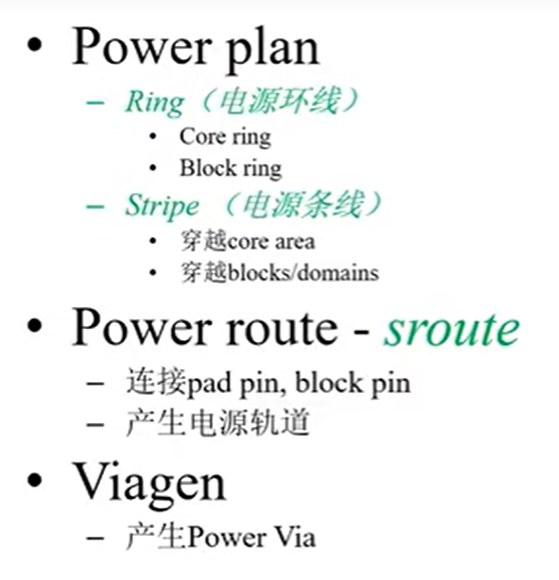

**Power Rings (电源环)**

定义

电源环是围绕芯片核心区域的封闭环形电源网络，通常位于标准单元阵列的外侧边缘。

结构特点

- 形成闭合环路，围绕整个设计核心

- 使用较宽的金属线以减少电阻

- 通常在顶层金属实现（如您的设计中使用MTTC/M7）

主要作用

- 供电入口点：作为电源进入芯片核心区域的主要入口
- 降低电阻：提供低阻抗电源分发路径
- 均匀分布：确保电源均匀地分布到芯片四周
- 减少IR压降：环形结构可从多个方向提供电源，减少压降

**Power Stripes (电源条)**

定义

电源条是贯穿芯片核心区域的直线电源网络，通常呈垂直和水平交错排列。

结构特点

- 平行排列的直线结构

- 垂直和水平方向交错布置

- 与电源环相连接

主要作用

- 细粒度分发：将电源从外围环分发到芯片内部各处
- 减少局部IR压降：降低芯片内部区域的电源电压变化
- 提供供电网格：形成覆盖整个芯片的电源网格
- 降低电迁移风险：通过提供多路径供电减少单一金属线的电流密度

### placement


摆放标准单元，同时满足各种 constraint

会删掉综合后加入的 buffer

#### 基础概念

- Tie High/Low

  电压转换

  尺寸越小越重要，静电

- Global/Detail Place

  Detail 是把 Global 后的单元放到网格上同时满足 constraint 要求

  

### CTS

placement 后的 clock tree 是理想的（没有延时）

主要的行为是插入 buffer/inverter

希望到同一级（流水线的级？）的时钟 delay 是一致的

如果有不同 clock，也要考虑 clock 之间的影响 

innouvs 的 CTS 工具叫 ccopt

评价指标：(latency (insertion delay), skew, clock power, clock em, long common path(cppr), duty cycle)

#### 基本概念


### route

三个步骤：global route, track assignment（分配 global route 的 track 给对应的 net）, detail route

#### 基本知识

##### nano

##### SI

##### Antenna

##### eco route

工艺制造，栅极放电破坏

signoff 的时候会检查这个问题，工具会加上

连接到栅极的面积不要太大

### sign off

#### 基本知识

##### mode

###### function

- 最常见
- 标准时序约束模式

###### Scan shift

- 移位扫描模式
- 由于芯片内部是个黑盒子，在外部难以控制。我们将芯片中的所应用的普通寄存器替换成带有扫描功能的扫描寄存器，首尾相连成串，从而可以实现附加的测试功能，这就是 Scan chain 的概念。下图一就是扫描寄存器，下图二就是将扫描寄存器串起来的 Scan Chain 
- 

###### Capture

- 也叫 Stuck-at 模式
- DC 模式：主要检查我们平时常见的 stuckat 0/1 错误。比如下图中的 inverter A 端如果被接到了 VSS 端的话，就是一个 stuck at 1 的 fault 

###### ASST


###### At Speed MBIST


###### Boundary Scan


## common command

```tcl
#gui
innovus -no_gui
win/win_off #gui 开关 win_off用不了？

#run
innovus -init init.tcl
source xxx.tcl


dbGet top.insts.name
selectInst xxx_insts_name
dbGet selected.pgInstTerms.name

#kill
ps -ef | grep innovus
killall -9 innovus
```


## 实战

### 0_所需文件：

- netlist

- tech_lef, cell_lef(standard cell, io, ip(ram))

- pex_tech(best, worst, typ_qrcTechFile)

- mmmc.viewDefinition.tcl

  

  - library_set 

    - fast standard cell's .lib, ip's .lib
    - slow standard cell's .lib, ip's .lib

  - rc corner

    - best/worst qrcTechFile(unreadable)
    - 

  - delay_corner

    

  - constraint_mode

    config sdc_file

  - analysis_view

    

    

### 1_数据初始化

- 设置 netlist

- tech_lef，cell_lef

- pex_tech

- set scenarios

  

- set cell type

  

```tcl
##############################################################
# Common design settings
# Created by Yanfuti
##############################################################
### design information
set design "leon"

### design data directory
set project_root    ".."
set library_root 	"~/BackEnd/innovus_learn/library"
set reports_root    "${project_root}/reports"

### gate level netlist files
set import_netlists     ""
lappend import_netlists "${project_root}/netlist/post_syn_netlist/${design}.vnet.gz"
### SDC files

### tech lef
set tech_lef "${library_root}/tlef/gsclib045_tech.lef"

### library files
set cell_lef ""
lappend lef_files "${library_root}/lef/gsclib045_hvt_macro.lef"
lappend lef_files "${library_root}/lef/gsclib045_macro.lef"
lappend lef_files "${library_root}/lef/MEM1_256X32.lef"
lappend lef_files "${library_root}/lef/MEM2_128X32.lef"
lappend lef_files "${library_root}/lef/pdkIO.lef"
lappend lef_files "${library_root}/lef/pads.lef"

### PEX tech
set qrc_tech(rcbest)        "${library_root}/tech/qrc/rcbest/qrcTechFile"
set qrc_tech(rcworst)       "${library_root}/tech/qrc/rcworst/qrcTechFile"
set qrc_tech(typical)       "${library_root}/tech/qrc/typical/qrcTechFile"

### view (scenarios) of each step
set default_scenarios  "func_slow_rcworst"
set placeopt_scenarios "func_slow_rcworst"
set cts_scenarios      "cts_slow_rcworst"
set clockopt_scenarios "func_slow_rcworst func_fast_rcbest"
set routeopt_scenarios "func_slow_rcworst func_fast_rcbest"

### cells type settings
set fillers_ref     "FILL1 FILL16 FILL2 FILL32 FILL4 FILL64 FILL8"
set welltap_ref     "DECAP8"

##############################################################
# END
##############################################################

```

### 2_import

```tcl
set init_top_cell $design  #给该design赋一个名字
set init_verilog $import_netlists #设置verilog文件的路径
set init_lef_file [concat $tech_lef $lef_files] #设置lef file的路径
set init_pwr_net "VDD" #表示初始电源网络的标识符或名称
set init_gnd_net "VSS" #表示初始接地网络的标识符或名称
set init_mmmc_file "../viewDefinition.tcl" #设置mmmc文件的路径

setImportMode -keepEmptyModule true  #-keepEmptyModule是一个命令的参数，它指定是否在导入设计时保留空的模块，空的模块，顾名思义，没有任何内容（如实例化，信号，逻辑，声明等）的模块。通过保留这些模块，可以确保设计的层次结构不变，方便后续的设计迭代与调试。

### read design
init_design       #开始导入设计
setIoFlowFlag 0  #此内容可以先忽略

### connect pg (pg--power ground)
globalNetConnect $init_pwr_net -type pgpin -pin VDD -all  #globalNetConnect，用于连接全局网络也就是用于定义全局电源（Power）和地（Ground）连接。在后端设计阶段，需要明确的定义电源和地如何连接到各个模块和单元。$init_pwr_net 是一个变量，表示初始电源网络的名称，此处等价于VDD，-type 是指定连接的类型是电源/地引脚（pgpin）-------pgpin（power ground pin），-pin VDD，这是另一个参数，用于指定连接的引脚名称或标识符，这里是指定连接到电源引脚，也就是要将$init_pwr_net 连接到所有名为VDD的引脚上，-all 表示该连接适用于设计中的所有实例。
globalNetConnect $init_gnd_net -type pgpin -pin VSS -all #同上，这里不挨个解释，综合说明一下，也可看作是上一条的总结：将变量$init_pwr_net（通常是表示某个电源网络，例如 VSS）连接到设计中所有单元和模块中的 VSS 引脚。这种全局连接是为了确保设计中的所有模块和单元都能正确地连接到电源网络，确保电源供给的一致性和可靠性。


### save design
file delete -force ${data_dir}/${current_step}.enc* #保存设计之前把该路径下存在的.enc文件全部删除
saveDesign ${data_dir}/${current_step}.enc #saveDesign命令，用于保存设计，其后接的是保存设计的文件路径

```


**mmmc(viewDefinition.tcl)**

```tcl
  ### library set (-aocv or lvf, spatial socv)
create_library_set -name "fast" -timing\
    [list \
        ${library_root}/liberty/fast_vdd1v2_basicCells.lib\
        ${library_root}/liberty/fast_vdd1v2_basicCells_hvt.lib\
        ${library_root}/liberty/MEM1_256X32_slow.lib\
        ${library_root}/liberty/MEM2_128X32_slow.lib\
    ]
create_library_set -name "slow" -timing\
    [list \
        ${library_root}/liberty/slow_vdd1v0_basicCells.lib\
        ${library_root}/liberty/slow_vdd1v0_basicCells_hvt.lib\
        ${library_root}/liberty/MEM1_256X32_slow.lib\
        ${library_root}/liberty/MEM2_128X32_slow.lib\
    ]

### rc corner
create_rc_corner -name "rc_best"\
    -preRoute_res 1.34236\
    -postRoute_res 1.34236\
    -preRoute_cap 1.10066\
    -postRoute_cap 0.960235\
    -postRoute_xcap 1.22327\
    -preRoute_clkres 0\
    -preRoute_clkcap 0\
    -postRoute_clkcap {0.969117 0 0}\
    -T 0\
    -qx_tech_file ${library_root}/tech/qrc/rcbest/qrcTechFile
create_rc_corner -name "rc_worst"\
    -preRoute_res 1.34236\
    -postRoute_res 1.34236\
    -preRoute_cap 1.10066\
    -postRoute_cap 0.960234\
    -postRoute_xcap 1.22327\
    -preRoute_clkres 0\
    -preRoute_clkcap 0\
    -postRoute_clkcap {0.969117 0 0}\
    -T 125\
    -qx_tech_file ${library_root}/tech/qrc/rcworst/qrcTechFile

### delay corner for each pvt (process voltage temperature) : library set + rc corner
create_delay_corner -name slow_rcworst\
    -library_set slow\
    -rc_corner rc_worst
create_delay_corner -name fast_rcbest\
    -library_set fast\
    -rc_corner rc_best

### mode : (func + shift + capture)
#一般对不同情况有多个sdc文件，比如现在有两种delay_corner,就可以写两个，不过现在只有一个现成的sdc文件所以只写一个
create_constraint_mode -name functional \
    -sdc_files [list ${sdc_file}]

### define view (mode + delay corner)
create_analysis_view -name func_slow_rcworst -constraint_mode functional -delay_corner slow_rcworst
create_analysis_view -name func_fast_rcbest  -constraint_mode functional -delay_corner fast_rcbest

### set analysis view status
set_analysis_view -setup [list func_slow_rcworst] -hold [list func_fast_rcbest]

 
```


### 3_floorPlan

```tcl
floorPlan -site CoreSite -d 930 600.28 0 1.71 0 1.71 -fplanOrigin llcorner	#-d <W H Left Bottom Right Top> 得到的是Die size; -s 得到的是Core size;  #-fplanOrigin llcorner 设置原点坐标

#手动放置marco: shift+r进入移动模式，选中后移动marco
```

对齐，移动：用 ctrl 选择多个 macro


导出位置 tcl 文件，方便下次自动化：

**注意！这部分要手工！！**

```tcl
1.
选中macrof
2.
writeFPlanScript -selected -fileName ${project_root}/scripts/macro_placement.tcl
3.
source ${project_root}/scripts/macro_placement.tcl 
```

```tcl
#fix macro
dbGet top.insts.cell.subClass block
dbGet [dbGet top.insts.cell.subClass block -p2].name
dbSet [dbGet top.insts.cell.subClass block -p2].pStatus fixed
```


```tcl
### create placement and routing halo around hard macros (instance name vs cell name, and reference name)
set halo_left   2.0
set halo_right  2.0
set halo_top    2.0
set halo_bottom 2.0
set rhalo_space 2.0
deleteHaloFromBlock -allBlock 
deleteRoutingHalo -allBlocks
#addHaloToBlock $halo_left $halo_bottom $halo_right $halo_top -allBlock
foreach macro [dbGet [dbGet top.insts.cell.subClass block -p2].name] {
    addHaloToBlock $halo_left $halo_bottom $halo_right $halo_top $macro
    addRoutingHalo -space $rhalo_space -top Metal11 -bottom Metal1 -inst $macro
}


```
```tcl
### place ports
set input_ports [dbGet [dbGet top.terms.direction input -p].name]
editPin -pinWidth 0.08 -pinDepth 0.32 -fixOverlap 1 -unit TRACK -spreadDirection clockwise -layer 5 -spreadType START -spacing 4 -start 0 -200 -pin $input_ports -fixedPin -side LEFT
set output_ports [dbGet [dbGet top.terms.direction output -p].name]
editPin -pinWidth 0.08 -pinDepth 0.32 -fixOverlap 1 -unit TRACK -spreadDirection counterclockwise -layer 5 -spreadType START -spacing 4 -start 0 -200 -pin $output_ports -fixedPin -side RIGHT
dbSet top.terms.pStatus fixed
```

```tcl
#放置blockage
2.
writeFPlanScript -selected -fileName ${project_root}/scripts/blockage_placement.tcl
3.
source ${project_root}/scripts/blockage_placement.tcl 
```

```tcl
#一些endcap, welltap
### insert boundary cells (endcap)
set endcap_prefix   "ENDCAP"
set endcap_left     "FILL2"
set endcap_right    "FILL2"
set endcap_top      "FILL1"
set endcap_bottom   "FILL1"

deleteFiller -prefix $endcap_prefix
setEndCapMode -reset
setEndCapMode -topEdge $endcap_top
setEndCapMode -bottomEdge $endcap_bottom
setEndCapMode -leftEdge $endcap_left
setEndCapMode -rightEdge $endcap_left

setEndCapMode -leftBottomCorner $endcap_bottom
setEndCapMode -leftTopCorner $endcap_top
setEndCapMode -rightBottomCorner $endcap_bottom
setEndCapMode -rightTopCorner $endcap_top

setEndCapMode -leftBottomEdge $endcap_left
setEndCapMode -leftTopEdge $endcap_left
setEndCapMode -rightBottomEdge $endcap_right
setEndCapMode -rightTopEdge $endcap_right
addEndCap -prefix $endcap_prefix

### create well tap cells (fix latch up)
set welltap_prefix   "WELLTAP"
deleteFiller -prefix $welltap_prefix
addWellTap -prefix $welltap_prefix -cell $welltap_ref -cellInterval 70 -checkerBoard

```

### 4_powerPlan

```tcl
### remove all existing power routing
editDelete -use {POWER} -shape {RING STRIPE FOLLOWPIN IOWIRE COREWIRE BLOCKWIRE PADRING BLOCKRING FILLWIRE FILLWIREOPC DRCFILL}


```


```tcl
#Add power Stripe
setAddStripeMode -reset
setAddStripeMode -stacked_via_bottom_layer Metal1 -stacked_via_top_layer Metal1#指定最底层和最顶层要用via连接的是哪些层，此处我们只create Metal1最底层的rails，所以top_layer和bottom_layer都是Metal1。
addStripe -nets { VDD } -layer Metal1 -direction horizontal -width 0.120 -spacing 1.710 -set_to_set_distance 3.420 -start [expr 1.71 - 0.120 / 2.0] -stop $die_y1 -area $die_area -area_blockage $macro_region 
#-nets 指定是VDD
#-layer 指定使用的层，此处是Metal1
#-direction 指定方向，此处为horizontal
#-width 一般来说是std cell的VDD的width是多少就设为多少，下图所示是0.12，所以我们也设为0.12
addStripe -nets { VSS } -layer Metal1 -direction horizontal -width 0.120 -spacing 1.710 -set_to_set_distance 3.420 -start [expr 1.71*2 - 0.120 / 2.0] -stop $die_y1 -area $die_area -area_blockage $macro_region
```


```tcl
##给macro通过ring加上power strip

### create power rings for memory cells {Metal8 & Metal9}
setAddRingMode -reset
deselectAll
selectInst [dbGet [dbGet top.insts.cell.subClass block -p2].name]
setAddRingMode -stacked_via_bottom_layer Metal1 -stacked_via_top_layer Metal9
addRing -nets {VDD VSS} -type block_rings -around selected -layer {top Metal9 bottom Metal9 left Metal8 right Metal8} -width {top 5 bottom 5 left 5 right 5} -spacing {top 1.25 bottom 1.25 left 1.25 right 1.25} -offset {top 5 bottom 5 left 5 right 5}
deselectAll

### create power stripes (Metal8 and Metal9)
#editDelete -use {POWER} -shape {RING STRIPE FOLLOWPIN IOWIRE COREWIRE BLOCKWIRE PADRING BLOCKRING FILLWIRE FILLWIREOPC DRCFILL}
setAddStripeMode -reset
setAddStripeMode -break_at {block_ring} -stacked_via_bottom_layer Metal1 -stacked_via_top_layer Metal9
addStripe -nets {VDD VSS} -layer Metal9 -direction horizontal -width 5 -spacing 1.25 -set_to_set_distance 72 -start_from bottom -start_offset 40 -stop_offset 0 -block_ring_top_layer_limit Metal9 -block_ring_bottom_layer_limit Metal1

setAddStripeMode -reset
setAddStripeMode -break_at {block_ring} -stacked_via_bottom_layer Metal1 -stacked_via_top_layer Metal9
addStripe -nets {VDD VSS} -layer Metal8 -direction vertical -width 5 -spacing 1.25 -set_to_set_distance 75 -start_from left -start_offset 35 -stop_offset 0 -block_ring_top_layer_limit Metal9 -block_ring_bottom_layer_limit Metal1

```

```tcl
#check
set report_drc_dir  ${project_root}/reports/${current_step}
file mkdir ${report_drc_dir}
verify_drc -limit 99999 -report ${report_drc_dir}/verify_drc.rpt#给一个error数量的限制 -limit 99999
verifyConnectivity -net {VDD VSS} -error 99999 -report ${report_drc_dir}/verifyConnectivity.rpt #给一个error数量的限制 -limit 99999
redirect -tee ${report_drc_dir}/checkPlace.rpt {checkPlace}

```

可以在这里查看报告：


```tcl
#上面这个bug：
deleteRouteBlk -name $rblkg_prefix
```


### 5_place_opt

- setDesignMode

  

  - -node，别称“超级开关”，是比较重要的一个设置，可以针对 **某一种特定的工艺做一些基础的设置**。它的选项很多，分别对应不同 Foundary 的不同工艺的区别，N 系列就是台积电的，S 系列就是三星的。。。

  -    -process，相比于-node，-process 是更 **通用的设置**，因为可以看到-node 里面的都是 20 以下的，此处用到的工艺是 45，所以使用更为通用的-process 45。在成熟的工艺中，都有特定的数字去代替，比如 40，28 等等。

  - -topRoutingLayer,-bottomRoutingLayer. 就是告诉工具只能用哪些层进行绕线

    

- setAnalysisMode

  

  - -analysisType {single | bcwc  | onChipVariation}

    > 其中(onChipVariation)模拟的 PVT 条件的偏差会更接近实际情况，会减少一些不必要的悲观量。
    >
    > 一般都用 OCV

  -  -cppr 是关于 clock line 上的 common path 的一个处理方式

- setOptMode

  - -addInstancePrefix, -addNetPrefix 

    > 工具在优化的过程中会增加很多新的 Cell，对于这些 Cell，我们希望他们都带一个我们能快速辨别他们的名字。也就是 Prefix（前缀）。当然，可以给 Instance 加 Prefix，那么也可以给 Net 加 Prefix
    >
    > e.g.: 
    >
    > ```tcl
    > setOptMode -addInstancePrefix "PRECTS_" -addNetPrefix "PRECTS_NET_"
    > ```

  -  -powerEffort {none|low|high}

  - -maxDensity <density>

  - -maxLength <length>

- setTieHiLoMode

  这条命令本身只是去控制那些加的 Tie-high 和 Tie-low 的 Cell，也就是说在电路中某些地方电平需要拉高和拉低，就需要 **专门的 Cell** 去做这些连接。

  -  -maxFanout 2 ，就是设置一个 Tie cell 可以连接几个 Fanout。若设置的太大，可能出现的问题：需要拉高的时候拉不高，需要拉低的时候拉不低。若是设置的太小，可能导致 Tie Cell 最后局部的 density 会出现问题。
  - -honorDontTouch true ，就是设置为 honorDontTouch 的情况下到底要不要加 Tie，一般加的 DontTouch 都是工程师自己加的，也就是真的不希望动的地方，所以设置为 true
  - -honorDontUse true，同上一样，是工程师真的不需要用到的，所以设置为 true。
  - -prefix “PRECTS_TIE_” , 给加的 Tie cell 加一个 Prefix（前缀）。便于识别。
  - -cell {TIEHI TIELO} 就是指定我们需要加的 Tie Cell 的类型

- setNanoRouteMode

  这里的绕线是 **global route**

  - -routeWithTimingDriven -true 也就是告诉工具在绕线的时候考虑时序。

- group_path, setPathGroupOptions

  

  

  - -effortLevel 对不同的 path group 的关注不一样，如此处，我们 **关心 reg2reg**，所以把 reg2reg 的 effortLevel 设置为 high

- set_dont_use_cells

  一般用于优化 PPA 的时候, 把一些面积大的, 功耗大的删掉

  

- set_clock_uncertainty

  set_clock_uncertainty 150 [all_clocks] -setup

  - place : jitter + clock skew + route correlation (si) + extra margin
  - clock : jitter + route correlation (si) + extra margin
  - route : jitter + extra margin
  - signoff : jitter + extra margin

  

- set_max_transition

  一般可以按照 clock_cycle 的比例来定，对 clock 上面的 transition 一般定为 5%-8%，对 data 上面的 transition 一般定为 15%-20%

  库里面也有一些关于 max_transition 的限制, 但是往往比较宽松, 需要自己设置

  - -clock_path xxx [all_clocks] 

  - -data_path xxx [all_clocks] 

  - -override, 覆盖其他地方的关于 max_transition 的设置

    

- place_opt_design

  使用 GigaPlace 进行布局优化

  -  -expanded_views 就是告诉工具不要做 view 的 merge

  - -out_dir 就是告诉工具输出的 path 放在哪个地方

  -  -prefix ”innovus_placeopt“

### 6_CTS

- set_ccopt_property

  - 查看 clk_buffer 种类：`get_lib_cell *CLK*BUF*`，一般不选 hvt
  - buffer_cells
  - clock_gating_cells
  - use_inverters
  - effort
  - max_fanout
  - target_skew
  - target_max_trans
  - target_insertion_delay
  - route_type
  - use_estimated_routes_during_final_implementation

- add_ndr

  NDR:(Non-Default Rule)

  clock 上的 route 需要和 standard cell 上的不一样，需要更大的间距。。。

- ccopt_design

```tcl
```

### 7_cts_opt

`optDesign -expandedViews -setup -hold -drv -outDir "myreports/${current_step}/innovus_clockopt" -postCTS -prefix "innovus_clockopt"`

### 8_route


## 优化

### 优化目标

时序(Performance)

- 设计规则(DRV): transition(slew)/cap/wire length
- setup / hold /recovery/ removal /other
- 噪声: Sl violation

功耗(Power):

- leakage/internal/switching

面积(Area): total standard cell area

DFM: 电迁移(EM)

### innovus 优化流程


有些公司不做 postCTS_opt, 应为还没有进行真实的布线，RC 延时估算不准，尤其是对 hold 来说。

做关于 hold 的优化是很有限的，基本上只有插入 buffer 和调整 size，CTS 之后基本不会将存在的 buffer 删掉，因此一般没什么优化

在 placement 就存在的 vio 很难在后面的优化中去掉

## 文件名称


 

## install

**环境：ubuntu20.04, innovus20**

安装包：[innovus20_install](E:\installer\innovus20_installer.7z)

### 依赖

```bash
sudo apt-get -y install openjdk-11-jdk
sudo apt-get install ksh
sudo apt-get install csh
sudo apt-get install xterm
sudo add-apt-repository ppa:linuxuprising/libpng12
sudo apt update
sudo apt install libpng12-0
sudo apt install libjpeg62
sudo apt install libncurses5

```

1.进入 [官网](http://ftp.xfree86.org/pub/XFree86/4.8.0/binaries/Linux-x86_64-glibc23/) 下载 Xbin.tgz 这个文件


### 解压

```bash
#解压3个innovus20压缩包
#InstallScape是一个安装cadence软件的工具，解压以后进入03.InstallScape/iscape/bin/
sh iscape.sh
```

### 安装


等待，弹出终端选 no，然后回车结束

### 破解

```bash
#在crack文件夹中
./1patch.sh /your/install/path
python cdslicgen.py #生成license.dat
cp patch/license.dat /path/you/want/to/place/License/ #把license放到一个你要放的位置
```

cdslicgen.py 破解改动在这里，我只是发现了别人的脚本在这里会报错，改了一点：


### 环境变量

根据你的安装路径和 license 路径对应修改

```bash
# >>> innovus initialize >>>
export INNOVUS_HOME=/opt/EDA_Tools/cadence/innovus20
# license
export LM_LICENSE_FILE=${INNOVUS_HOME}/License/license.dat

export LD_LIBRARY_PATH=${LD_LIBRARY_PATH}:${INNOVUS_HOME}/tools.lnx86/lib/64bit:${INNOVUS_HOME}/tools.lnx86
export PATH=${PATH}:${INNOVUS_HOME}/tools.lnx86/bin

# <<< innovus initialize <<<
```


### 大致结束

```bash
innovus &
```


### 其他相关 bug

1.libstdc++.so.6


[Cadence Innovus2020 在 Ubuntu20.04 上的安装教程【超详细】_innovus 安装-CSDN 博客](https://blog.csdn.net/qq_44447544/article/details/122698979?ops_request_misc =%7B%22request%5Fid%22%3A%22A2277519-6B4E-4DD3-952A-1958A9EA40EA%22%2C%22scm%22%3A%2220140713.130102334..%22%7D&request_id = A2277519-6B4E-4DD3-952A-1958A9EA40EA&biz_id = 0&utm_medium = distribute.pc_search_result.none-task-blog-2~all~top_click~default-2-122698979-null-null.142^v100^control&utm_term = innovus 安装&spm = 1018.2226.3001.4187)

sudo ln -s /lib/x86_64-linux-gnu/libstdc++.so.6.0.30 libstdc++.so.6

2.No LSB modules are available.

sudo apt-get install lsb-core

3.place_opt_design 后

```
terminate called after throwing an instance of 'std::runtime_error'
  what():  locale::facet::_S_create_c_locale name not valid
Innovus terminated by internal (ABORT) error/signal...
*** Stack trace:
/opt/EDA_Tools/cadence/innovus20/tools.lnx86/innovus/bin/64bit/innovus [0x12f9ffe5]
/opt/EDA_Tools/cadence/innovus20/tools.lnx86/innovus/bin/64bit/innovus(syStackTrace+0xa5)[0x12fa0456]
/opt/EDA_Tools/cadence/innovus20/tools.lnx86/innovus/bin/64bit/innovus [0x4aa5ef3]
/opt/EDA_Tools/cadence/innovus20/tools.lnx86/innovus/bin/64bit/innovus(_ZN15goSignalHandler13executeActionEiP7siginfoPv+0x47)[0x7c97667]
/opt/EDA_Tools/cadence/innovus20/tools.lnx86/innovus/bin/64bit/innovus(_ZN15goSignalHandler16executeSigActionEiP7siginfoPv+0x84)[0x7c98494]
/lib/x86_64-linux-gnu/libc.so.6(+0x4251f)[0x7f2653c1951f]
/lib/x86_64-linux-gnu/libc.so.6(pthread_kill+0x12c)[0x7f2653c6d9fc]
/lib/x86_64-linux-gnu/libc.so.6(raise+0x15)[0x7f2653c19475]
/lib/x86_64-linux-gnu/libc.so.6(abort+0xd2)[0x7f2653bff7f2]
/opt/EDA_Tools/cadence/innovus20/tools.lnx86/lib/64bit/libstdc++.so.6(+0xa2b9d)[0x7f265ac76b9d]
/opt/EDA_Tools/cadence/innovus20/tools.lnx86/lib/64bit/libstdc++.so.6(+0xae20b)[0x7f265ac8220b]
/opt/EDA_Tools/cadence/innovus20/tools.lnx86/lib/64bit/libstdc++.so.6(_ZSt9terminatev+0x16)[0x7f265ac82276]
/opt/EDA_Tools/cadence/innovus20/tools.lnx86/lib/64bit/libstdc++.so.6(__cxa_throw+0x47)[0x7f265ac824d7]
/opt/EDA_Tools/cadence/innovus20/tools.lnx86/lib/64bit/libstdc++.so.6(_ZSt21__throw_runtime_errorPKc+0x3f)[0x7f265ac7951c]
/opt/EDA_Tools/cadence/innovus20/tools.lnx86/lib/64bit/libstdc++.so.6(_ZNSt6locale5facet18_S_create_c_localeERP15_ _locale_structPKcS2_+0x27)[0x7f265aca5257]
/opt/EDA_Tools/cadence/innovus20/tools.lnx86/lib/64bit/libstdc++.so.6(_ZNSt6locale5_ImplC2EPKcm+0x54)[0x7f265ac96d04]
/opt/EDA_Tools/cadence/innovus20/tools.lnx86/lib/64bit/libstdc++.so.6(_ZNSt6localeC1EPKc+0x144)[0x7f265ac978e4]
/opt/EDA_Tools/cadence/innovus20/tools.lnx86/innovus/bin/64bit/innovus(_ZNK11oiInstCntCL5printERKSsb+0x2a)[0x7490eaa]
/opt/EDA_Tools/cadence/innovus20/tools.lnx86/innovus/bin/64bit/innovus(_ZN15oiPhyDesignMcCL6createERK22oiPhyDesignGridParamCLiib+0x290)[0x74948e0]
/opt/EDA_Tools/cadence/innovus20/tools.lnx86/innovus/bin/64bit/innovus(_Z17oiPhyInitDesignMci+0x22)[0x7495112]
/opt/EDA_Tools/cadence/innovus20/tools.lnx86/innovus/bin/64bit/innovus [0x4d546fb]
/opt/EDA_Tools/cadence/innovus20/tools.lnx86/innovus/bin/64bit/innovus(_ZN10tcmBaseCmd7executeEP10Tcl_InterpiPPc+0x166)[0x15264886]
/opt/EDA_Tools/cadence/innovus20/tools.lnx86/innovus/bin/64bit/innovus(_ZN6tcmMgr9cmdParserEPvP10Tcl_InterpiPPc+0x693)[0x15257fe3]
/opt/EDA_Tools/cadence/innovus20/tools.lnx86/innovus/bin/64bit/innovus(TclInvokeStringCommand+0x7f)[0x20ed56df]
/opt/EDA_Tools/cadence/innovus20/tools.lnx86/innovus/bin/64bit/innovus(TclNRRunCallbacks+0x46)[0x20eda056]
/opt/EDA_Tools/cadence/innovus20/tools.lnx86/innovus/bin/64bit/innovus [0x20edc527]
/opt/EDA_Tools/cadence/innovus20/tools.lnx86/innovus/bin/64bit/innovus(Tcl_EvalEx+0x15)[0x20edce55]
/opt/EDA_Tools/cadence/innovus20/tools.lnx86/innovus/bin/64bit/innovus(Tcl_Eval+0x14)[0x20edce74]
/opt/EDA_Tools/cadence/innovus20/tools.lnx86/innovus/bin/64bit/innovus(_ZN5oiTcl9CmdInterp6evalOKEPKc+0x2d)[0x4d87a8d]
/opt/EDA_Tools/cadence/innovus20/tools.lnx86/innovus/bin/64bit/innovus(_ZNK14rdaOptDesignCL3runEv+0x9c3)[0x4d2b543]
/opt/EDA_Tools/cadence/innovus20/tools.lnx86/innovus/bin/64bit/innovus [0x4d4da81]
/opt/EDA_Tools/cadence/innovus20/tools.lnx86/innovus/bin/64bit/innovus(_ZN10tcmBaseCmd7executeEP10Tcl_InterpiPPc+0x166)[0x15264886]
/opt/EDA_Tools/cadence/innovus20/tools.lnx86/innovus/bin/64bit/innovus(_ZN6tcmMgr9cmdParserEPvP10Tcl_InterpiPPc+0xad2)[0x15258422]
/opt/EDA_Tools/cadence/innovus20/tools.lnx86/innovus/bin/64bit/innovus(TclInvokeStringCommand+0x7f)[0x20ed56df]
/opt/EDA_Tools/cadence/innovus20/tools.lnx86/innovus/bin/64bit/innovus(TclNRRunCallbacks+0x46)[0x20eda056]
/opt/EDA_Tools/cadence/innovus20/tools.lnx86/innovus/bin/64bit/innovus [0x20edc527]
/opt/EDA_Tools/cadence/innovus20/tools.lnx86/innovus/bin/64bit/innovus(Tcl_EvalEx+0x15)[0x20edce55]
/opt/EDA_Tools/cadence/innovus20/tools.lnx86/innovus/bin/64bit/innovus(TclNREvalObjEx+0x6e)[0x20edcefe]
/opt/EDA_Tools/cadence/innovus20/tools.lnx86/innovus/bin/64bit/innovus [0x20f9270a]
/opt/EDA_Tools/cadence/innovus20/tools.lnx86/innovus/bin/64bit/innovus [0x20ef0150]
/opt/EDA_Tools/cadence/innovus20/tools.lnx86/innovus/bin/64bit/innovus(TclNRRunCallbacks+0x46)[0x20eda056]
/opt/EDA_Tools/cadence/innovus20/tools.lnx86/innovus/bin/64bit/innovus(Tcl_RecordAndEvalObj+0xf3)[0x20f78753]
/opt/EDA_Tools/cadence/innovus20/tools.lnx86/innovus/bin/64bit/innovus(Tcl_RecordAndEval+0x37)[0x20f788b7]
/opt/EDA_Tools/cadence/innovus20/tools.lnx86/innovus/bin/64bit/innovus(_Z17rdaEditCmdLineEndPc+0x344)[0x4b68f44]
/opt/EDA_Tools/cadence/innovus20/tools.lnx86/innovus/bin/64bit/innovus(_ZN9seConsole7sesMode9DoExecuteERKSsPv+0xc6)[0xfb3bc66]
/opt/EDA_Tools/cadence/innovus20/tools.lnx86/innovus/bin/64bit/innovus(_ZN7Redline9EmacsMode10AcceptLineEv+0x3b)[0x10cac8eb]
/opt/EDA_Tools/cadence/innovus20/tools.lnx86/innovus/bin/64bit/innovus(_ZN7Redline11ModeCommandINS_9EmacsModeEE15CommandFnNoKeysERKN5boost8functionIFvRS1_EEERNS_6EditorE+0x60)[0x10cb4e70]
/opt/EDA_Tools/cadence/innovus20/tools.lnx86/innovus/bin/64bit/innovus(_ZN5boost6detail8function26void_function_obj_invoker2INS_3_bi6bind_tINS3_11unspecifiedENS_8functionIFvRN7Redline6EditorEEEENS3_5list1INS_3argILi1EEEEEEEvS9_RKNS7_14KeyCombinationEE6invokeERNS1_15function_bufferES9_SJ_+0x1a)[0x10cc46ca]
/opt/EDA_Tools/cadence/innovus20/tools.lnx86/innovus/bin/64bit/innovus(_ZNK7Redline7Command3RunERNS_6EditorERKNS_14KeyCombinationE+0x1b)[0x10cc43eb]
/opt/EDA_Tools/cadence/innovus20/tools.lnx86/innovus/bin/64bit/innovus(_ZN7Redline6Editor9Internals3RunEb+0xdf)[0x10ca8f0f]
/opt/EDA_Tools/cadence/innovus20/tools.lnx86/innovus/bin/64bit/innovus [0x20fdce36]
/opt/EDA_Tools/cadence/innovus20/tools.lnx86/innovus/bin/64bit/innovus(Tcl_ServiceEvent+0x86)[0x20f9e886]
/opt/EDA_Tools/cadence/innovus20/tools.lnx86/innovus/bin/64bit/innovus(Tcl_DoOneEvent+0x128)[0x20f9eb88]
/opt/EDA_Tools/cadence/innovus20/tools.lnx86/lib/64bit/libtq.so(_ZN17TqEventDispatcher13processEventsE6QFlagsIN10QEventLoop17ProcessEventsFlagEE+0x69)[0x7f265741b239]
/opt/EDA_Tools/cadence/innovus20/tools.lnx86/Qt/v5//64bit/lib/libcdsQt5Core.so.5(_ZN10QEventLoop4execE6QFlagsINS_17ProcessEventsFlagEE+0xe9)[0x7f2656ad00c9]
/opt/EDA_Tools/cadence/innovus20/tools.lnx86/Qt/v5//64bit/lib/libcdsQt5Core.so.5(_ZN16QCoreApplication4execEv+0x83)[0x7f2656ad8953]
/opt/EDA_Tools/cadence/innovus20/tools.lnx86/lib/64bit/libtq.so(_ZN13TqApplication4execEv+0x176)[0x7f265741a896]
/opt/EDA_Tools/cadence/innovus20/tools.lnx86/innovus/bin/64bit/innovus(_Z12edi_app_initP10Tcl_Interp+0x2a8)[0x4b510d8]
/opt/EDA_Tools/cadence/innovus20/tools.lnx86/innovus/bin/64bit/innovus(Tcl_MainEx+0x176)[0x20f993c6]
/opt/EDA_Tools/cadence/innovus20/tools.lnx86/innovus/bin/64bit/innovus(main+0x1d1)[0x41d4b71]
/lib/x86_64-linux-gnu/libc.so.6(+0x29d8f)[0x7f2653c00d8f]
/lib/x86_64-linux-gnu/libc.so.6(__libc_start_main+0x7f)[0x7f2653c00e3f]
/opt/EDA_Tools/cadence/innovus20/tools.lnx86/innovus/bin/64bit/innovus [0x4aa2c1c]
==== ==== ==== ==== ==== ==== ==== ==== ==== ====
                gdb
==== ==== ==== ==== ==== ==== ==== ==== ==== ====
Using: gdb
Could not attach to process.  If your uid matches the uid of the target
process, check the setting of /proc/sys/kernel/yama/ptrace_scope, or try
again as the root user.  For more details, see /etc/sysctl.d/10-ptrace.conf
ptrace: Operation not permitted.
/home/pengxuan/Project/mylab/innovus/lab2/work/1314912: No such file or directory.
```


### 参考

[Cadence Innovus2020 在Ubuntu20.04上的安装教程【超详细】_innovus安装-CSDN博客](https://blog.csdn.net/qq_44447544/article/details/122698979?ops_request_misc=%7B%22request%5Fid%22%3A%22A2277519-6B4E-4DD3-952A-1958A9EA40EA%22%2C%22scm%22%3A%2220140713.130102334..%22%7D&request_id=A2277519-6B4E-4DD3-952A-1958A9EA40EA&biz_id=0&utm_medium=distribute.pc_search_result.none-task-blog-2~all~top_click~default-2-122698979-null-null.142^v100^control&utm_term=innovus安装&spm=1018.2226.3001.4187)

[innovus2020安装_innovus安装-CSDN博客](https://blog.csdn.net/dacming/article/details/129873358?spm=1001.2101.3001.6650.1&utm_medium=distribute.pc_relevant.none-task-blog-2~default~CTRLIST~Rate-1-129873358-blog-138365651.235^v43^control&depth_1-utm_source=distribute.pc_relevant.none-task-blog-2~default~CTRLIST~Rate-1-129873358-blog-138365651.235^v43^control&utm_relevant_index=2)

[Ubuntu18.04安装Cadence Innovus2021_innovus安装-CSDN博客](https://blog.csdn.net/RONAL_DINHO/article/details/139830971)


## 参考

1. 官方文档：UserGuide, Command reference 

   

2. [数字后端实训Innovus软件及后端流程介绍1_哔哩哔哩_bilibili](https://www.bilibili.com/video/BV1Ha411v7NL?spm_id_from=333.788.videopod.episodes)

3. [Innovus流程（4）-Route和ECO - 知乎](https://zhuanlan.zhihu.com/p/580275898)


# PDK

DK即Process Design Kit 工艺设计包，是连接IC设计公司、代工厂和EDA公司的桥梁. PDK包含了从芯片设计到制造的各个环节所需的数据和信息，为了更直观地了解它，我们可以将**PDK比作芯片设计过程中的“指导手册”**

PDK的主要作用是将晶圆代工厂的制造工艺要求转化为芯片设计师能够理解的信息。设计师利用PDK中的数据来确保他们的设计能够顺利制造，并将PDK导入到EDA软件中，进行设计、模拟和验证。一旦完成设计，设计师就可以将设计文件发送给晶圆代工厂进行生产。

A Process Design Kit (PDK) serves as the fundamental building block for integrated circuit (IC) design, playing a crucial role in transforming chip designs  into **silicon reality**. These files serve as essential  inputs for Electronic Design Automation (EDA) tools during chip design. Clients engage with a foundry's PDKs before production to ensure that their chip  designs align with the foundry's capabilities and intended functionality.EDA Tool Ecosystem and PDK Integration. These tools rely on  **accurate PDK data to generate layouts, verify designs, and simulate performance.** **Standardized interfaces** across diverse technology platforms enhance  PDK usability.

## 概述


### 生态


上游到下游


## 金属层

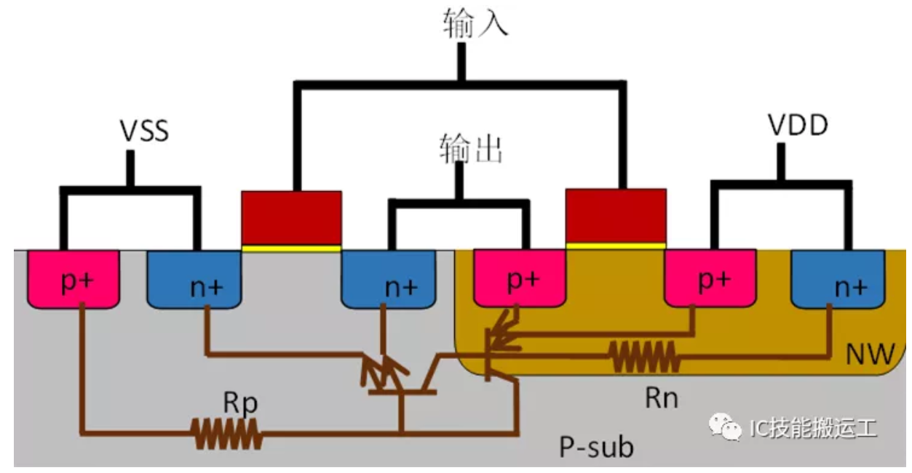

[(59 封私信 / 80 条消息) PDK中的Design Layer和Mask Layer以及FEOL和BEOL - 知乎](https://zhuanlan.zhihu.com/p/656143449)

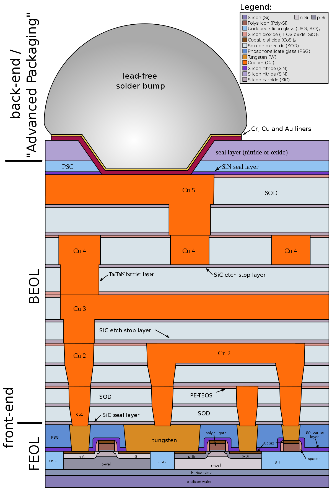

> [!WARNING]
>
> 每个PDK名称会有些不一样

### AA

离子注入的主要位置


### POLY

多晶硅材质，电压就是压在他上面

> gate 和 poly 的区别：
>
> poly指的是多晶硅这种材料，gate指的是mos管的栅极、源级、漏级中的栅极
> 在很多尺寸的工艺中，mos管的栅极是用poly这种材料制作的。
> 但是poly不仅可以用在栅极这个地方，在一些小的cell中，poly可以用来做短距离的导线起连接的作用，以此来减少这个cell所用的metal的层数。

### PC

poly connect layer


### CT

下面晶体管Drain/Source跟上面金属线的连接层


### GT

gate


### Mx

金属层

### Vx

过孔

### Fin

for FinFET


## 文件汇总

### sp/cdl

- 模拟网表
- `cdl`基本是`spcie`格式的，略有不同，主要是用来做LVS的，只包含`LVS`中需要比较的参数。通过子电路的形式来写的，即使是顶层单元，也要用子电路形式。
- spice则略有不同，顶层模块没有子电路的外框。也可以用来做LVS，需要手动提取。直接提取的为cdl形式的。spice还可以用来==仿真==。

#### 语法

- **行类型**：以 `*` 开头为注释，`+` 表示上一行续行；`.` 开头是控制语句，如 `.TITLE`、`.LIB`、`.PARAM`、`.OP`、`.AC`、`.TRAN`、`.TEMP`、`.OPTION`、`.PRINT` 等。
- **元件语法**：首字母区分器件类型，后接节点列表和参数；常见如 `Rname n1 n2 value`、`Cname n1 n2 value`、`Mname nd ng ns nb model L=... W=...`、`Vname n+ n- type(...)`。
- **子电路**：用 `.SUBCKT name pin1 pin2 ...` 定义，内部可实例化器件或其他子电路，结束用 `.ENDS name`。实例化语法为 `Xname node... subckt_name [参数]`。
- **模型与库**：通过 `.MODEL` 定义简单模型，或用 `.LIB filepath libname` 引用工艺库；调用时在器件行写模型名。
- **分析与输出**：在主体结构后放置分析指令（如 `.DC`、`.TRAN`）和输出控制（如 `.PRINT`、`.MEASURE`），文件以 `.END` 结束。

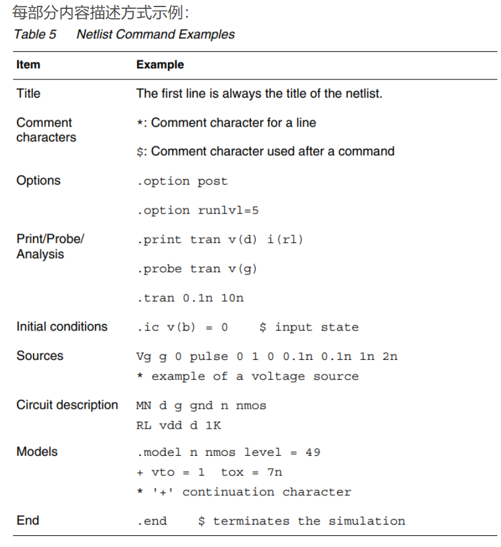

**参考：**

[【HSPICE】输入网表文件 --- 基本内容_hspice写网表-CSDN博客](https://blog.csdn.net/Tranquil_ovo/article/details/132500664)


### LEF

- （library exchange format）, 叫库交换格式，

- 它是描述库单元的物理属性，包括端口位置、层定义和通孔定义。

- 它抽象了单元的底层几何细节，提供了足够的信息，以便允许布线器在不对内部单元约束来进行修订的基础上进行单元连接。

- 包含了==工艺的技术信息==，如布线的层数、最小的线宽、线与线之间的最小距离以及每个被选用 cell，BLOCK，PAD 的大小和 pin 的实际位置。 cell，PAD 的这些信息由厂家提供的 LEF 文件给出，自己定制的 BLOCK 的 LEF 文件描述经 ABSTRACT 后生成，只要把这两个 LEF 文件整合起来就可以了。

- 案例

  - `DATABASE MICRONS 2000`

    表示 1 微米 = 2000DBU。
  
    有些.lef会定义为 `DISTANCE MICRONS <dbu>`
  
  - `MANUFACTURINGGRID 0.0005 ;`
  
    0.0005 微米 = 1/2000 微米，说明最小网格是 1 DBU。
  
  - ```
    LAYER Metal1
      TYPE ROUTING ;
      DIRECTION HORIZONTAL ;
      PITCH 0.19 0.19 ;
      WIDTH 0.06 ;
      AREA 0.02 ;
      SPACINGTABLE
        PARALLELRUNLENGTH 0 
        WIDTH 0    0.06 
        WIDTH 0.1  0.1 
        WIDTH 0.75 0.25 
        WIDTH 1.5  0.45 ;
      SPACING 0.09 ENDOFLINE 0.09 WITHIN 0.025 ;
    END Metal1
    ```
  
  - ```
    LAYER Via1
      TYPE CUT ;
      SPACING 0.07 ;
      WIDTH 0.07 ;
    END Via1
    ```
    
  - ````
    SITE CoreSite
      CLASS CORE ;
      SIZE 0.2 BY 1.71 ;
    END CoreSite
    ````
  
  - 

### DEF

- （design exchange format），叫设计交换格式

- 它描述的是 实际的设计，对库单元及它们的位置和连接关系进行了列表，使用 DEF 来在不同的设计系统间传递设计，同时又可以保持设计的内容不变。DEF 与只传递几何信息的 GDSII 不一样。它还给出了器件的物理位置关系和时序限制等信息。

- 案例：

  - 版图面积`DIEAREA ( 0 0 ) ( 390800 383040 ) ;`

  - 数字标准单元行信息：

    `ROW ROW_93 CoreSite 0 318060 N DO 977 BY 1 STEP 400 0`
  
    - ROW ROW_93：行名（唯一标识）。
    - CoreSite：引用的 SITE 类型（在 LEF 里定义单元高度/对齐网格）。
    - 0 318060：行起点坐标 (x y)。
    - N 或 FS：行的朝向/翻转。N=不翻转朝上，FS=沿 X 轴翻转且行方向反向。
    - DO 977 BY 1：重复次数，X 方向 977 个 site，Y 方向 1 行。
    - STEP 400 0：相邻重复的步长（X 步长 400，Y 步长 0），对应 site 宽度和行间距。
    - 每行末尾 ;：语句结束。
    
    > 为什么是 STEP 400 0?
    >
    > 已知： UNITS DISTANCE MICRONS 2000
    >
    > CoreSite 宽度 0.2 微米 → 0.2 * 2000 = 400 DBU，因此 X
    >     步长写成 400
    
  - TRACK 信息：
  
    `TRACKS X 200 DO 977 STEP 400 LAYER Metal9 ;`
  
    在 X 方向的扫描线上放置 977 条平行于 Y 轴的轨迹，起始于 x=200（DBU），相邻轨迹的间距 400（DBU），适用于 Metal9。
  
    `TRACKS Y 950 DO 503 STEP 760 LAYER Metal9 ;`
  
    在 Y 方向的扫描线上放置 503 条平行于 X 轴的轨迹，起始于 y=950（DBU），间距 760（DBU），适用于 Metal9。
  
    > 注意，根据TRACK算面积不是：200+977*400 = 391000
    >
    > 而是：
    > 
    >
    > 这个可以不等于diearea
  
  - ````
    GCELLGRID X 0 DO 65 STEP 6000 ;
    GCELLGRID X 384000 DO 2 STEP 6800 ;
    ````
  
    GCell
  
    > （65-1）*6000 = 384000
    >
    > 384000+6800 = 390800 == die_are.width

### Lib

- 文本格式: .lib 文件通常是文本文件，使用人类可读的 ASCII 文本来描述。

- 标准化: .lib 文件使用的是` Liberty 格式`，这是一个业界标准，用于描述电子电路库的性能。

- 可携带性和可读性: 由于它是一个文本文件，所以很容易通过文本编辑器查看和修改，并且容易在不同的设计工具和平台之间转移。

- 用途: Liberty 文件主要用于逻辑合成和静态时序分析（STA）。它包含有关单元（如门、触发器等）的时序和功耗特性

- 连线负载模型（wire load models）：电阻、电容、面积。

- 工作环境/条件（Operating conditions）:制程（process）（电压和温度的比例因数k，表示不同的环境之间，各参数缩放的比例）

- 设计规则约束（Design ）:最大最小电容、最大最小转换时间、最大最小扇出。

- 延迟模型：指明在计算延迟时用的那个模型，主要有generic_cmos(默认值)、table-lookup(非线性模型)、piecewise-cmos(optional)、dcm(Delay Calculation Module)、polynomial。这个库使用的非线性模型。

- Design Compiler工具本身是没有单位的。然而在建立工艺库和产生报告时，必须要有单位。库中有6个库级属性定义单位:time_ unit(时间单位)、voltage_unit(电压单位)、current_  unit(电流单位)、pulling_resistance_unit(上/下拉电阻单位)、capacitive_load_unit(电容负载单位)、leakage_power_unit(漏电功耗单位)。

- I/Opad属性（pad attributes）：主要就是定义I/O引脚的电平属性，告诉你输入是COMS还是TTL，什么时候达到高电平、什么时候是低电平。

- 线负载模型（wire-loads）

  - DC采用wire-load模型在**布局前**预估连线的延时。通常，在工艺库中，根据不同的芯片面积给出了几种模型（上图所示）。这些模型定义了**电容、电阻与面积因子**。此外，导线负载模型还设置了slope与fanout_length，fanout-length设置了与扇出数相关的导线的长度。
  - 有时候，除了扇出与长度，该属性还包括其他参数的值（这个工艺库没有），例如average_capacitance、standard_deviation与number_of_nets，在DC产生导线负载模型时会自动写出这些值。对于超过fanout-length属性的节点，可将该导线分成斜率不同的几段，以确定它的值

- 比例缩放因子（k-factors）

  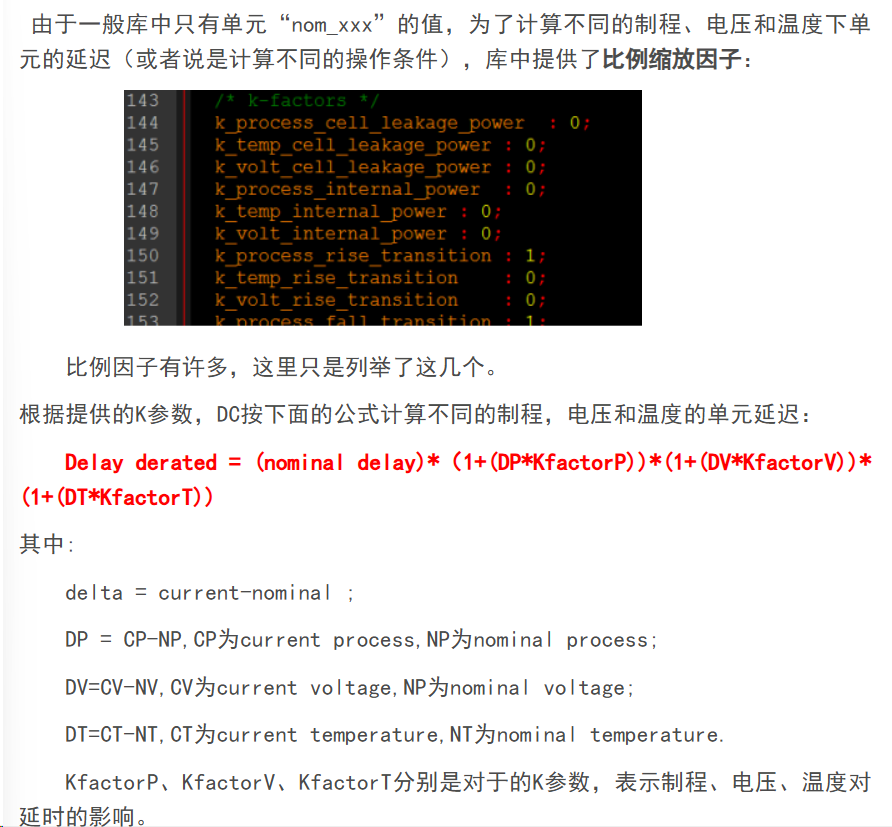

- 标准单元

  - 输入引脚的fanout-load属性、输出引脚的max_fanout属性、输入或输出引脚的max_transition属性、输出或者inout引脚的max_capacitance属性
  - 如果某个单元的输出最大只能接0.2pF的负载，但在实际综合的网表中却连接了0.3pF的负载，这时候综合工具就会报出DRC错误
  - 通常，fanout_load与max_fanout一起使用max_transition与max_capacitance一起使用。 如果一个节点的扇出为4，它驱动3个与非门，每个与非门的fanout-load是2，则这三个与非门无法被驱动(因为3*2>4)。
  - 

#### 参考

- [Tcl与Design Compiler （五）——综合库（时序库）和DC的设计对象 - IC_learner - 博客园](https://www.cnblogs.com/IClearner/p/6622524.html)


### DB

- .lib文件，经过LC编译后，产生.db文件。
- 不可读


### ITF, ICT

- 工艺参数文件，记录了每层材料的电阻率、介电常数、温度系数、最小宽度等详细信息。EDA工具没有直接使用这类文件进行RC的抽取，因为计算量是巨大的，将严重影响EDA工具的速度。
- `itf`（S家工具用到的互联工艺格式文件）
- `ict`文件（C家工具用到的互连工艺格式文件）
- 互连线工艺文件，主要包括：
  工艺参数：比如金属的厚度，金属层的方块电阻值，介质层的厚度，介质层的介电常数等。
  工艺效应系数和PVT系数：比如线宽增大效应，温度系数等。
- `ICT`和`ITF`文件可以相互转换
- 不同金属层有不同的对应`.ict/itf`文件

#### tluplus, capTable

2D model

为了减少RC抽取过程中的计算量，节省RC抽取的时间，我们一般不直接使用这种文件而是先将其转换成[查找表](https://so.csdn.net/so/search?q=查找表&spm=1001.2101.3001.7020)文件（TLU+以及capTable）。PR工具根据导线的长度和宽度查表即可得到电阻电容值，虽然过程中也要计算一些系数的影响(比如温度系数)，但计算量已经大幅降低了。

- tluplus

  - S家PR工具（[ICC2](https://so.csdn.net/so/search?q=ICC2&spm=1001.2101.3001.7020)）用的net电阻电容查找表，tlu升级版格式
  - itf文件可以转换为`tluplus`
    - 通过`grdgenxo`命令，

- capTable

  - captable的精度低于qrcTechfile

  - C家PR工具（Innovous）用的net电阻电容查找表

  - `ict`文件可以转换为captable文件

    - 通过`generateCapTbl`命令，`generateCapTbl`是Innovus安装包里面的一个程序

    - captable的生成过程就是由ict中的工艺参数按照一些特定的导线尺寸计算出相应电阻电容值的过程。

    - ```tcl
      generateCapTbl -lef tech.lef -ict LIB/ICT/qrc_min.ict -output LIB/captable/cmin.captbl
      generateCapTbl -lef tech.lef -ict LIB/ICT/qrc_typ.ict -output LIB/captable/typ.captbl
      generateCapTbl -lef tech.lef -ict LIB/ICT/qrc_max.ict -output LIB/captable/cmax.captbl
      ```

#### nxtgrd，qrcTechFile

3D model

- `ict`文件可以使用`techgen`命令（qrc）生成`qrcTechFile`，qrc吃`qrcTechFile`可以抽取`spef`
  - `qrcTechFile`由`ict`文件生成，其内容主要是电容电阻的查找表，通常由半导体厂提供。
- 为了提高RC提取的精度，我们会使用更加精确的RC提取引擎或者RC提取工具（如`StarRC`），它们的输入是`nxtgrd`/`qrcTechfile`文件。同样，它们也可以由`itf`和`ict`文件转换而成，用的命令分别是`Techgen`和`grdgenxo`。

>32nm及以上工艺，要么用`qrcTechfile`文件，要么用`captable`。若`qrcTechfile`和`captable`都没有，Innovus会利用默认工艺参数生成一个captable，但精度会差很多。
>
>32nm及以下更先进工艺则必须要`qrcTechfile`。


### SDF

-    (Standard delay format), 叫标准延时格式，是 IEEE 标准，它描述设计中的时序信息，指明了模块管脚和管脚之间的延迟、时钟到数据的延迟和内部连接延迟。


### GDS

通用的版图文件，可以认为该文件不受限于EDA工具和厂商。

数字模块生成结束后，将其生成为.gds再导入到版图工具（比如Virtuoso）中。在芯片版图画完后，也是将其生成为.gds提交流片。

 

### map

版图转换文件

在版图转换时，经常用到.map文件，其说明各层的名称、作用、GDS层序号等等。

在Innovus导出版图时需要一个参考.map文件。但是其实有若干个.map文件，在不同地方使用的。因此需要根据内容进行区分

 

### Innovus.dat

保存文件


### 各种map, layermap

在gds导入导出的时候会用到一些map（映射）文件

在starRC生成`.spef`文件时也会用到一个`.map`文件


### spef

寄生参数网表


### nxtgrd

和寄生参数提取相关，在`starRC`中使用


## 工艺类型

### Planar


### FinFET

[Finfet电流模型里fin, finger, multiplier指的是什么啊？ - 知乎](https://www.zhihu.com/question/426949421)

[(67 封私信 / 80 条消息) 来，一块了解下半导体工艺FinFET - 知乎](https://zhuanlan.zhihu.com/p/584196314)

[深度解析finFET设计规则 - 制造/封装 - 电子发烧友网](https://www.elecfans.com/article/89/2024/202402212408720.html)


随着[晶体管](https://zhida.zhihu.com/search?content_id=434296346&content_type=Answer&match_order=1&q=晶体管&zhida_source=entity)尺寸的缩小，传统的面结构的FET的[栅控能力](https://zhida.zhihu.com/search?content_id=434296346&content_type=Answer&match_order=1&q=栅控能力&zhida_source=entity)减弱，所以引进了新的结构[FinFET](https://zhida.zhihu.com/search?content_id=434296346&content_type=Answer&match_order=1&q=FinFET&zhida_source=entity)，从结构上看，FinFET结构增大了栅极和沟道的接触面积，使得栅控能力增强，抑制[短沟道效应](https://zhida.zhihu.com/search?content_id=434296346&content_type=Answer&match_order=1&q=短沟道效应&zhida_source=entity)，减小[亚阈值漏电流](https://zhida.zhihu.com/search?content_id=434296346&content_type=Answer&match_order=1&q=亚阈值漏电流&zhida_source=entity)

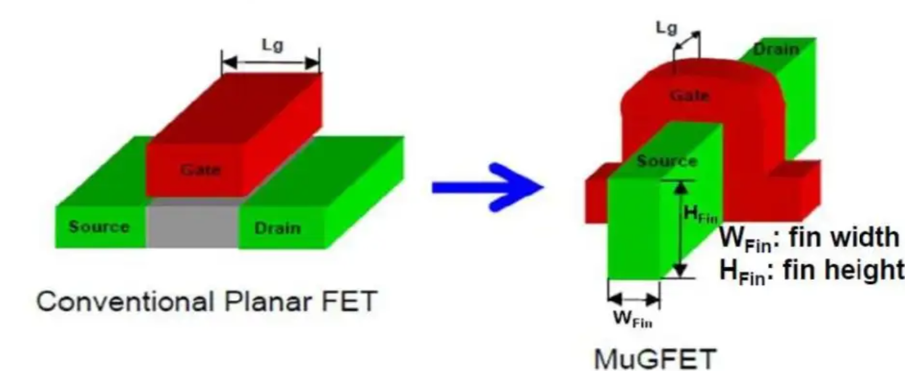


参数`nfin`:控制宽度

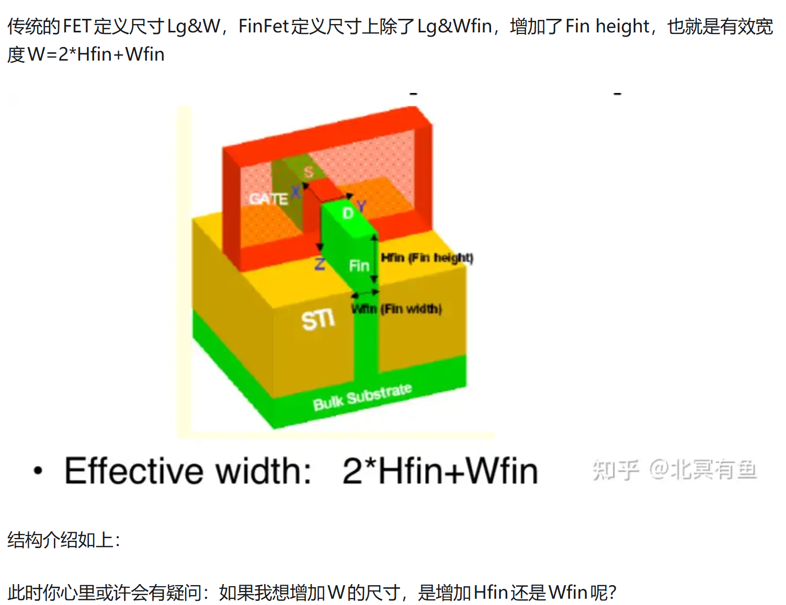

管子高度step是限制的，也就是fin的边界和OD层次的高度必须是fin的倍数

一个fin step = 0.048um

从techfile得到的数据


调用了一个lvt的nmos，电路中管子的参数如下：

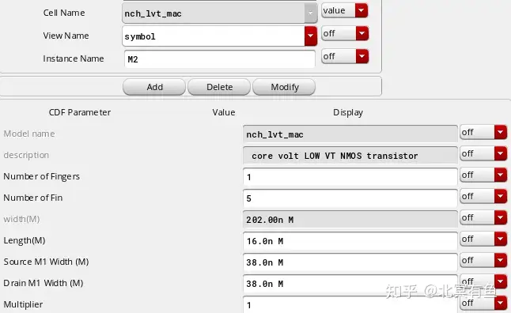

nmos的fin数量为5，对应的width为202n，如果fin=6，加一个fin step 0.048um，那么width为250n

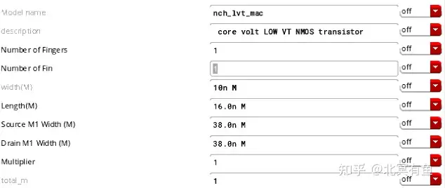

如果fin =1 width=10nm，

w=(nfin-1)finpitch + findrawnwidth(单个fin的width，这里wdith=10nm)


### GAA


## SMIC

### 文件目录简要介绍

#### liberty

下文会介绍

#### verilog

包含标准单元的逻辑功能模型，用于逻辑仿真和综合。

- 文件类型：

  - 基本Verilog模型(.v)

  - 带有负载的Verilog模型(_neg.v)

  - 带有电源/地连接的Verilog模型(_pg.v)

  - 带有电源/地和负载的Verilog模型(_neg_pg.v)

#### lef

包含物理设计所需的单元布局信息。

- scc28nhkcp_hdc30p140_pmk_rvt.lef - 基本物理描述

- scc28nhkcp_hdc30p140_pmk_rvt_ant.lef - 带有天线规则的描述

#### gds

包含标准单元的物理版图数据，用于流片。

- 文件：scc28nhkcp_hdc30p140_pmk_rvt.gds(版图数据库文件)

#### 其他

- cdl/ - 包含电路描述语言文件，用于LVS验证

- astro/ - 包含Synopsys Astro工具所需文件

- symbol/ - 包含原理图符号

- aocv/ - 包含高级片上变化(AOCV)模型

- cdb/ - 包含Cadence设计库文件

- voltagestorm/ - 包含功耗分析所需文件

- icc2_ndm/ - 包含ICC2所需的NDM库

### 标准单元库

　　绝大多数的数字设计流程都是基于标准单元的半定制设计流程。标准单元库包含了==反相器、缓冲、与非、或非、与或非、锁存器、触发器等等逻辑单元综合模型的物理信息==，标准单元是完成通用功能的逻辑，==具有同等的高度（宽度可以不同）==，这样方便了数字后端的自动布局布线。

STDCELL文件夹下是不同类型的标准单元库

>|-- SCC28NHKCP_12T25OD33_RVT_V0p2
>|-- SCC28NHKCP_HDC30P140_PMK_RVT_V0p2
>|-- SCC28NHKCP_HDC30P140_PMK_ULVT_V0p2
>|-- SCC28NHKCP_HDC30P140_RVT_V0p2
>|-- SCC28NHKCP_HSC30P140_RVT_V0p2
>|-- SCC28NHKCP_VHSC30P140_PMK_LVT_V0p1a
>`-- SCC28NHKCP_VHSC30P140_PMK_RVT_V0p1a


#### 命名方式

>SCC28NHKCP_12T25OD33_RVT_V0p2
>│   │  │   │  │   │   │   │
>│   │  │   │  │   │   │   └── 版本号 (Version 0.2)
>│   │  │   │  │   │   └── 阈值电压类型 (RVT: Regular Vt)
>│   │  │   │  │   └── 栅氧厚度 (25OD33: 25Å)
>│   │  │   │  └── 晶体管类型 (12T: 12-track)
>│   │  │   └── 工艺节点 (28nm HKC+)
>│   │  └── 代工厂 (SMIC)
>│   └── 标准单元库 (Standard Cell)


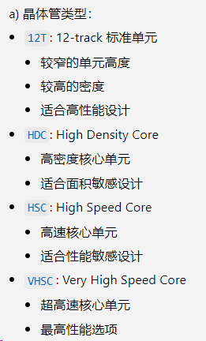


#### 应用场景


#### 注意

- 不同库之间不能混用! 不过可以在不同模块使用不同库，但要注意接口匹配（AI生成·）

  - 不能混用原因：

    

    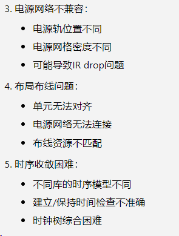

### 同一标准单元库下不同时序模型和PVT条件组合

在`liberty`文件夹下

#### 命名规则

>scc28nhkcp_12t25od33_rvt_tt_v3p3_25c_basic.lib
>│   │  │   │  │  │  │  │  │  │
>│   │  │   │  │  │  │  │  │  └── 时序模型类型 (basic)
>│   │  │   │  │  │  │  │  └── 温度 (25°C)
>│   │  │   │  │  │  │  └── 电压 (3.3V)
>│   │  │   │  │  │  └── 工艺角 (tt: typical)
>│   │  │   │  │  └── 阈值电压类型 (rvt)
>│   │  │   │  └── 栅氧厚度 (25OD33)
>│   │  │   └── 晶体管类型 (12T)
>│   │  └── 工艺节点 (28nm HKC+)
>│   └── 代工厂 (SMIC)

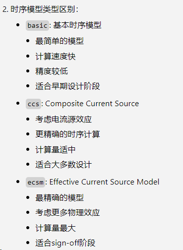


> ff/tt/ss貌似是根据电压区分的？

```tcl
# 不同corner

set_operating_conditions -library scc28nhkcp_12t25od33_rvt_ss_v2p97_125c_ccs.db ss_v2p97_125c
# ss: slow-slow process (最慢工艺)
# v2p97: 2.97V (最低电压)
# 125c: 125°C (最高温度)
# 这种组合会导致最慢的时序

set_operating_conditions -library scc28nhkcp_12t25od33_rvt_ff_v3p63_-40c_ccs.db ff_v3p63_-40c
# ff: fast-fast process (最快工艺)
# v3p63: 3.63V (最高电压)
# -40c: -40°C (最低温度)
# 这种组合会导致最快的时序

set_operating_conditions -library scc28nhkcp_12t25od33_rvt_ff_v3p63_125c_ccs.db ff_v3p63_125c
# ff: fast-fast process (更多漏电)
# v3p63: 3.63V (最高电压)
# 125c: 125°C (最高温度)
# 这种组合会导致最高的动态功耗和漏电功耗

set_operating_conditions -library scc28nhkcp_12t25od33_rvt_ss_v2p97_-40c_ccs.db ss_v2p97_-40c
# ss: slow-slow process (较少漏电)
# v2p97: 2.97V (最低电压)
# -40c: -40°C (最低温度)
# 这种组合会导致最低的功耗

set_operating_conditions -library scc28nhkcp_12t25od33_rvt_tt_v3p3_25c_ccs.db tt_v3p3_25c
# tt: typical-typical process (典型工艺)
# v3p3: 3.3V (标称电压)
# 25c: 25°C (室温)
# 这种组合代表典型工作条件
```


> LVT的变准单元库一般会有较多的电压域：
> 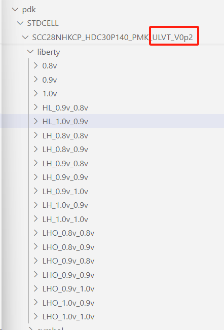
>
> 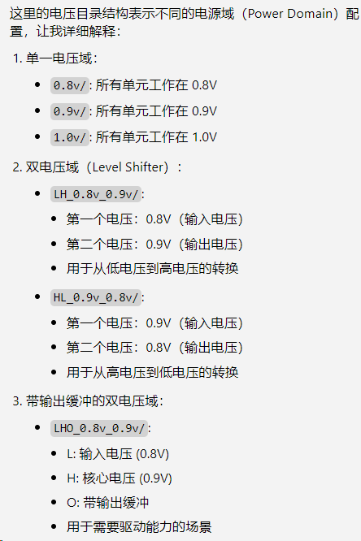


## TSMC

#### 参考

[tsmc28nm数字工艺库介绍 - 知乎](https://zhuanlan.zhihu.com/p/243485197)


## 开源PDK

### sky130


### GF180

### FreePDK45

### [nangate45](https://github.com/rbarzic/platform_nangate45)


FreePDK45 是**北卡罗来纳州立大学**的电子设计自动化实验室提供的免费开源的45nm工艺库，使用了MOSIS工艺

### IHP Open Source PDK

### ASAP7 

7nm Predictive PDK

### ASAP5

5nm

[The-OpenROAD-Project/asap5](https://github.com/The-OpenROAD-Project/asap5)

貌似还用不了


## 参考

[DesignAutomationConference_SFO_2024](DesignAutomationConference_SFO_2024.pdf) 

[Finfet电流模型里fin, finger, multiplier指的是什么啊？ - 知乎](https://www.zhihu.com/question/426949421)


# OpenROAD/ORFS/OpenLane

数字后端EDA领域的开源工具

## 特点

### 优点

- 开源，可以自定义修改

- 该领域的热门应用

- 作者回复迅速（一般第二天就会回复）

- 自动化程度较高

- 还在不断更新中，更新快

  

### 缺点

- 有一些商用工具有的功能他没有


## relation between openroad/SRFS/openlane

### openroad

- basic model
- netlist2gds, 也可以hdl2gds，但是比较麻烦， 用abc做综合
- 越来越流行了，比赛也开始用了

### ORFS

- hdl2gds
- pdk friendly， 可以直接跑7nm
- 支持重新编译OpenROAD（自定义修改）
- gui不知道为什么用起来很卡
- 内置AutoTuner，一个扫参自动优化PPA的工具
- 支持在线使用（Colab）

### **openlance**

- hdl2gds
- most auto
- 内置只有sky130 PDK
- 不支持重新编译OpenROAD
- 


## Architecture

**openlane**


## OpenLane Flow Stages

OpenLane flow consists of several stages. By default all flow steps are run in sequence. Each stage may consist of multiple sub-stages. OpenLane can also be run interactively as shown [here][25].

1. **Synthesis**
   1. [Yosys](https://github.com/yosyshq/yosys) - Perform RTL synthesis and technology mapping.
   2. [OpenSTA](https://github.com/the-openroad-project/opensta) - Performs static timing analysis on the resulting netlist to generate timing reports
2. **Floorplaning**
   1. [OpenROAD/Initialize Floorplan](https://github.com/the-openroad-project/openroad/tree/master/src/ifp) - Defines the core area for the macro as well as the rows (used for placement) and the tracks (used for routing)
   2. OpenLane IO Placer - Places the macro input and output ports
   3. [OpenROAD/PDN Generator](https://github.com/the-openroad-project/openroad/tree/master/src/pdn) - Generates the power distribution network
   4. [OpenROAD/Tapcell](https://github.com/the-openroad-project/openroad/tree/master/src/tap) - Inserts welltap and endcap cells in the floorplan
3. **Placement**
   1. [OpenROAD/RePlace](https://github.com/the-openroad-project/openroad/tree/master/src/gpl) - Performs global placement
   2. [OpenROAD/Resizer](https://github.com/the-openroad-project/openroad/tree/master/src/rsz) - Performs optional optimizations on the design
   3. [OpenROAD/OpenDP](https://github.com/the-openroad-project/openroad/tree/master/src/dpl) - Performs detailed placement to legalize the globally placed components
4. **CTS**
   1. [OpenROAD/TritonCTS](https://github.com/the-openroad-project/openroad/tree/master/src/cts) - Synthesizes the clock distribution network (the clock tree)
5. **Routing**
   1. [OpenROAD/FastRoute](https://github.com/the-openroad-project/openroad/tree/master/src/grt) - Performs global routing to generate **a guide file** for the detailed router
   2. [OpenROAD/TritonRoute](https://github.com/the-openroad-project/openroad/tree/master/src/drt) - Performs detailed routing
   3. [OpenROAD/OpenRCX](https://github.com/the-openroad-project/openroad/tree/master/src/rcx) - Performs SPEF extraction
6. **Tapeout**
   1. [Magic](https://github.com/rtimothyedwards/magic) - Streams out the final GDSII layout file from the routed def
   2. [KLayout](https://github.com/klayout/klayout) - Streams out the final GDSII layout file from the routed def as a back-up
7. **Signoff**
   1. [Magic](https://github.com/rtimothyedwards/magic) - Performs DRC Checks & Antenna Checks
   2. [Magic](https://github.com/klayout/klayout) - Performs DRC Checks & an XOR sanity-check between the two generated GDS-II files
   3. [Netgen](https://github.com/rtimothyedwards/netgen) - Performs LVS Checks

All tools in the OpenLane flow are free, libre and open-source software. While OpenLane itself as a script (and its associated build scripts) are under the Apache License, version 2.0, tools may fall under stricter licenses.

> Everything in Floorplanning through Routing is done using [OpenROAD](https://github.com/The-OpenROAD-Project/OpenROAD) and its various sub-utilities, hence the name “OpenLane.”

## PDK

The OpenROAD application is PDK independent. However, it has been tested and validated with specific PDKs in the context of various flow controllers.

OpenLane supports SkyWater 130nm and GlobalFoundries 180nm.

OpenROAD-flow-scripts supports several public and private PDKs including:

#### Open-Source PDKs

- `GF180` - 180nm
- `SKY130` - 130nm
- `Nangate45` - 45nm
- `ASAP7` - Predictive FinFET 7nm

#### Proprietary PDKs

These PDKS are supported in **OpenROAD-flow-scripts only**. They are used to test and calibrate OpenROAD against commercial platforms and ensure good QoR. The PDKs and platform-specific files for these kits cannot be provided due to NDA restrictions. However, if you are able to access these platforms independently, you can create the necessary platform-specific files yourself.

- `GF55` - 55nm
- `GF12` - 12nm
- `Intel22` - 22nm
- `Intel16` - 16nm
- `TSMC65` - 65nm

## Basic Run

``` bash
openroad [-help] [-version] [-no_init] [-exit] [-gui]
         [-threads count|max] [-log file_name] cmd_file
  -help              show help and exit
  -version           show version and exit
  -no_init           do not read .openroad init file
  -threads count|max use count threads
  -no_splash         do not show the license splash at startup
  -exit              exit after reading cmd_file
  -gui               start in gui mode
  -python            start with python interpreter [limited to db operations]
  -log <file_name>   write a log in <file_name>
  cmd_file           source cmd_file
```


OpenROAD sources the Tcl command file `~/.openroad` unless the command line option `-no_init` is specified.

OpenROAD then sources the command file `cmd_file` if it is specified on the command line. Unless the `-exit` command line flag is specified, it enters an interactive Tcl command interpreter.

A list of the available tools/modules included in the OpenROAD app and their descriptions are available [here](https://openroad.readthedocs.io/en/latest/contrib/Logger.html#openroad-tool-list).

## Basic Command

### area

ord::get_die_area
ord::get_core_area

### Save Image[#](https://openroad.readthedocs.io/en/latest/main/src/gui/README.html#save-image)

This command can be both be used when the GUI is active and not active to save a screenshot with various options.

``` tcl
save_image 
    [-resolution microns_per_pixel]
    [-area {x0 y0 x1 y1}]
    [-width width]
    [-display_option {option value}]
    filename
```


#### Options

| Switch Name       | Description                                                  |
| ----------------- | ------------------------------------------------------------ |
| `filename`        | path to save the image to.                                   |
| `-area`           | x0, y0 - first corner of the layout area (in microns) to be saved, default is to save what is visible on the screen unless called when gui is not active and then it selected the whole block. x1, y1 - second corner of the layout area (in microns) to be saved, default is to save what is visible on the screen unless called when gui is not active and then it selected the whole block. |
| `-resolution`     | resolution in microns per pixel to use when saving the image, default will match what the GUI has selected. |
| `-width`          | width of the output image in pixels, default will be computed from the resolution. Cannot be used with `-resolution`. |
| `-display_option` | specific setting for a display option to show or hide specific elements. For example, to hide metal1 `-display_option {Layers/metal1 false}`, to show routing tracks `-display_option {Tracks/Pref true}`, or to show everthing `-display_option {* true}` |

### Select Objects

This command selects object based on options. Returns: number of objects selected.

```
select 
    -type object_type
    [-name glob_pattern]
    [-filter attribute = value]
    [-case_insensitive]
    [-highlight group]
```


#### Options

| Switch Name  | Description                                                  |
| ------------ | ------------------------------------------------------------ |
| `-type`      | name of the object type. For example, `Inst` for instances, `Net` for nets, and `Marker` for database markers. |
| `-name`      | (optional) filter selection by the specified name. For example, to only select clk nets `*clk*`. Use `-case_insensitive` to filter based on case insensitive instead of case sensitive. |
| `-filter`    | (optional) filter selection based on the objects’ properties. `attribute` represents the property’s name and `value` the property’s value. In case the property holds a collection (e. g. BTerms in a Net) or a table (e. g. Layers in a Generate Via Rule) `value` can be any element within those. A special case exists for checking whether a collection is empty or not by using the value `CONNECTED`. This can be useful to select a specific group of elements (e. g. BTerms=CONNECTED will select only Nets connected to Input/Output Pins). |
| `-highlight` | (optional) add the selection to the specific highlighting group. Values can be 0 to 7. |

### Add a single net to selection

To add a single net to the selected items:

```
gui:: selection_add_net 
    name
```


#### Options

| Switch Name | Description             |
| ----------- | ----------------------- |
| `name`      | name of the net to add. |

### Add multiple nets to selection

To add several nets to the selected items using a regex:

```
gui:: selection_add_nets 
name_regex
```


#### Options

| Switch Name  | Description                                 |
| ------------ | ------------------------------------------- |
| `name_regex` | regular expression of the net names to add. |

### Add a single inst to selection

To add a single instance to the selected items:

```
gui:: selection_add_inst 
    name
```


#### Options

| Switch Name | Description                  |
| ----------- | ---------------------------- |
| `name`      | name of the instance to add. |

### Add multiple insts to selection

To add several instances to the selected items using a regex:

```
gui:: selection_add_insts 
    name_regex
```


#### Options

| Switch Name  | Description                                      |
| ------------ | ------------------------------------------------ |
| `name_regex` | regular expression of the instance names to add. |

### Select at point or area

To add items at a specific point or in an area:

Example usage:

```
gui:: select_at x y
gui:: select_at x y append
gui:: select_at x0 y0 x1 y1
gui:: select_at x0 y0 x1 y1 append
```


```
gui:: select_at 
    x0 y0 x1 y1
    [append]

Or

gui:: select_at
    x y 
    [append]
```


#### Options

| Switch Name      | Description                                                  |
| ---------------- | ------------------------------------------------------------ |
| `x, y`           | point in the layout area in microns.                         |
| `x0, y0, x1, y1` | first and second corner of the layout area in microns.       |
| `append`         | if `true` (the default value) append the new selections to the current selection list, else replace the selection list with the new selections. |

### Select next item from selection

To navigate through multiple selected items: Returns: current index of the selected item.

```
gui:: select_next
```

### Select previous item from selection

To navigate through multiple selected items: Returns: current index of the selected item.

```
gui:: select_previous 
```


### Clear Selection

To clear the current set of selected items:

```
gui:: clear_selections
```


### Set Heatmap

To control the settings in the heat maps:

The currently availble heat maps are:

- `Power`
- `Routing`
- `Placement`
- `IRDrop`
- `RUDY` [[1\]](https://openroad.readthedocs.io/en/latest/main/src/gui/README.html#rudy)

These options can also be modified in the GUI by double-clicking the underlined display control for the heat map.

```
gui:: set_heatmap 
    name
    [option]
    [value]
```


#### Options

| Switch Name | Description                                                  |
| ----------- | ------------------------------------------------------------ |
| `name`      | is the name of the heatmap.                                  |
| `option`    | is the name of the option to modify. If option is `rebuild` the map will be destroyed and rebuilt. |
| `value`     | is the new value for the specified option. This is not used when rebuilding map. |

### Dump Heatmap to file

To save the raw data from the heat maps ins a comma separated value (CSV) format:

```
gui:: dump_heatmap 
    name 
    filename
```


#### Options

| Switch Name | Description                            |
| ----------- | -------------------------------------- |
| `name`      | is the name of the heatmap.            |
| `filename`  | path to the file to write the data to. |


## init


## floorplant


## placement


## Routing

### globle routing

#### Write Guides

This command writes global routing guides, which can be used as input for global routing.

Example: `write_guides route.guide`.

```
write_guides file_name
```


#### Options

| Switch Name | Description      |
| ----------- | ---------------- |
| `file_name` | Guide file name. |


## report and dump

### Write Macro Placement

This command writes macro placement.

```
write_macro_placement file_name
```


## Global Routing - FastRoute4.1

[OpenROAD/src/grt at master · The-OpenROAD-Project/OpenROAD](https://github.com/the-openroad-project/openroad/tree/master/src/grt)

| Switch Name                    | Description                                                  |
| ------------------------------ | ------------------------------------------------------------ |
| `-guide_file`                  | Set the output guides file name (e.g., `route.guide`).       |
| `-congestion_iterations`       | Set the number of iterations made to remove the overflow of the routing. The default value is `50`, and the allowed values are integers `[0, MAX_INT]`. |
| `-congestion_report_file`      | Set the file name to save the congestion report. The file generated can be read by the DRC viewer in the GUI (e.g., `report_file.rpt`). |
| `-congestion_report_iter_step` | Set the number of iterations to report. The default value is `0`, and the allowed values are integers `[0, MAX_INT]`. |
| `-grid_origin`                 | Set the (x, y) origin of the routing grid in DBU. For example, `-grid_origin {1 1}` corresponds to the die (0, 0) + 1 DBU in each x--, y- direction. |
| `-critical_nets_percentage`    | Set the percentage of nets with the worst slack value that are considered timing critical, having preference over other nets during congestion iterations (e.g. `-critical_nets_percentage 30`). The default value is `0`, and the allowed values are integers `[0, MAX_INT]`. |
| `-allow_congestion`            | Allow global routing results to be generated with remaining congestion. The default is false. |
| `-verbose`                     | This flag enables the full reporting of the global routing.  |
| `-start_incremental`           | This flag initializes the GRT listener to get the net modified. The default is false. |
| `-end_incremental`             | This flag run incremental GRT with the nets modified. The default is false. |


## Using Macro in openlane


## debug in openroad

#### make as follow
```bash
cd OpenROAD
mkdir build_debug
cd build_debug
cmake .. -DCMAKE_BUILD_TYPE=DEBUG
#wait
make
#make  -j $thread_to_make
```

### my lancun.json
```
{
    "configurations": [
    {
        "name": "(gdb) Launch",
        "type": "cppdbg",
        "request": "launch",
        "program": "/you/path/OpenROAD/build_debug/src/openroad",
        "args": [],
        "stopAtEntry": false,
        "cwd": "/you/path/OpenROAD-flow-scripts/tools/OpenROAD/build_debug/src/",
        "environment": [],
        "externalConsole": false,
        "MIMode": "gdb",
        "setupCommands": [
            {
                "description": "Enable pretty-printing for gdb",
                "text": "-enable-pretty-printing",
                "ignoreFailures": true
            },
            {
                "description": "Set Disassembly Flavor to Intel",
                "text": "-gdb-set disassembly-flavor intel",
                "ignoreFailures": true
            }
        ]
    }
    ]
}
```

after add your breakpoints, click the triangle to debug
and you have to wait a minutes


then you can input you command to debug openroad in terminal


I just found out how to do that too, holp this help.

## install

[Installing OpenROAD — OpenROAD documentation](https://openroad.readthedocs.io/en/latest/user/Build.html#install-dependencies)

```
#在ubuntu:20.04新的docker容器中
apt update
apt-get update --fix-missing
apt install git
git clone --recursive https://github.com/The-OpenROAD-Project/OpenROAD.git
cd OpenROAD/
./etc/DependencyInstaller.sh
cd build/
make
make install
openroad -help
```

**install in a new ubuntu20.04 container**

现在openroad中安装依赖，再直接build ORFS

[Build from sources using Docker — OpenROAD Flow documentation](https://openroad-flow-scripts.readthedocs.io/en/latest/user/BuildWithDocker.html)

```bash
apt install swig
apt-get install libboost-all-dev
```

a bug:

>Ign:1 https://download.docker.com/linux/ubuntu focal InRelease
>
>Err:2 https://download.docker.com/linux/ubuntu focal Release                                               
>
>  Could not handshake: Error in the pull function. [IP: 13.35.210.84 443]
>
>Hit:3 http://security.ubuntu.com/ubuntu focal-security InRelease                                           
>
>Hit:4 http://archive.ubuntu.com/ubuntu focal InRelease                                                     
>
>Hit:5 http://archive.ubuntu.com/ubuntu focal-updates InRelease
>
>Hit:6 http://archive.ubuntu.com/ubuntu focal-backports InRelease
>
>Reading package lists... Done
>
>E: The repository 'https://download.docker.com/linux/ubuntu focal Release' no longer has a Release file.
>
>N: Updating from such a repository can't be done securely, and is therefore disabled by default.
>
>N: See apt-secure(8) manpage for repository creation and user configuration details.

```bash
build in docker, not in locally
```


# iEDA

[OSCC-Project/iEDA: An open-source EDA infrastructure and tools from netlist to GDS](https://github.com/OSCC-Project/iEDA)

数字后端EDA领域的开源工具


# Magical

[magical-eda/MAGICAL: Machine Generated Analog IC Layout](https://github.com/magical-eda/MAGICAL?tab=readme-ov-file)

- MAGICAL: Machine Generated Analog IC Layout
- ML-enhance

maintain seperate components, such as constraint generation, placement and routing, in different repository. And we integrate each component through top-level python flow.


# ALIGN

[ALIGN-analoglayout/ALIGN-public](https://github.com/ALIGN-analoglayout/ALIGN-public)

[Detail Notes](EDA4PR-Analog)

- ALIGN is an open-source automatic layout generator for analog circuits jointly developed under the DARPA IDEA program by the University of Minnesota, Texas A&M University, and Intel Corporation.
- The goal of ALIGN (Analog Layout, Intelligently Generated from Netlists) is to automatically translate an unannotated (or partially annotated) SPICE netlist of an analog circuit to a GDSII layout. The repository also releases a set of analog circuit designs.
- ML-enhance


# KLayout

